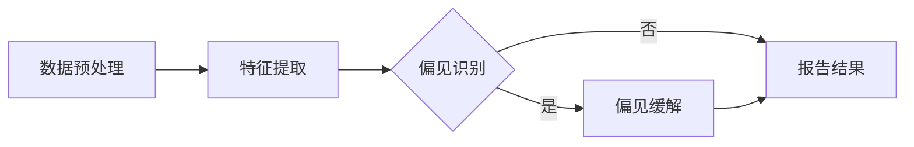
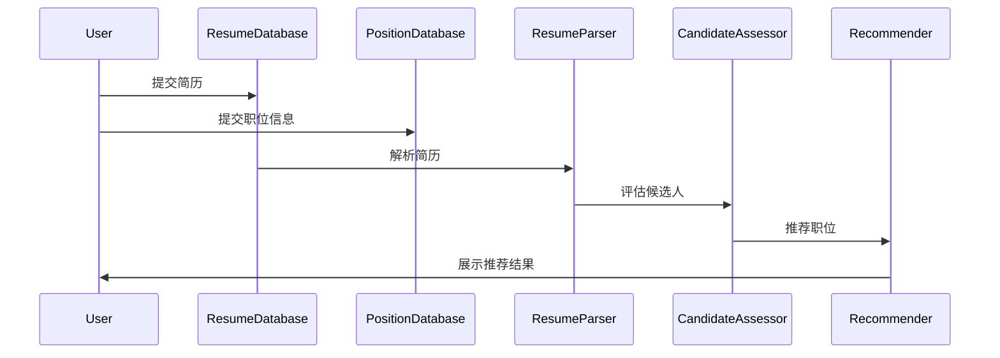
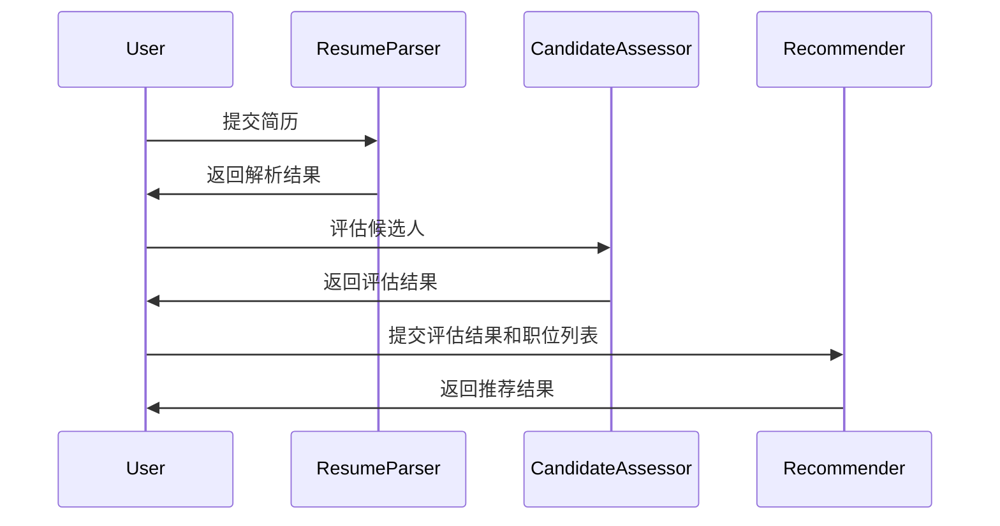

                 

### 偏见检测与缓解：确保AI Agent的公平性

> 关键词：AI偏见，公平性，算法，数据平衡，特征工程

> 摘要：本文将深入探讨AI偏见的问题，分析偏见检测与缓解的方法和策略，并通过实际案例，展示如何确保AI Agent的公平性。文章旨在为读者提供一套系统的解决方案，以促进人工智能技术的健康发展。

## 目录大纲

### 第一部分：偏见检测与缓解的基础

#### 1.1 AI偏见概述

##### 1.1.1 AI偏见的概念与影响

##### 1.1.2 AI偏见的主要类型

##### 1.1.3 AI偏见的社会影响

#### 1.2 偏见检测方法

##### 1.2.1 偏见检测的原理与挑战

##### 1.2.2 偏见检测技术

#### 1.3 偏见缓解策略

##### 1.3.1 偏见缓解的目标与原则

##### 1.3.2 偏见缓解的技术手段

### 第二部分：核心概念与联系

#### 2.1 核心概念原理

##### 2.1.1 偏见定义

##### 2.1.2 偏见类型

##### 2.1.3 偏见检测与缓解方法

#### 2.2 概念属性特征对比表格

#### 2.3 ER实体关系图架构

### 第三部分：算法原理讲解

#### 3.1 算法mermaid流程图

#### 3.2 Python源代码

#### 3.3 数学模型和公式

#### 3.4 详细讲解与举例说明

### 第四部分：系统分析与架构设计方案

#### 4.1 问题场景介绍

#### 4.2 项目介绍

#### 4.3 系统功能设计

#### 4.4 系统架构设计

#### 4.5 系统接口设计

#### 4.6 系统交互

### 第五部分：项目实战

#### 5.1 环境安装

#### 5.2 系统核心实现源代码

#### 5.3 代码应用解读与分析

#### 5.4 实际案例分析与详细讲解剖析

#### 5.5 项目小结

### 第六部分：最佳实践 tips

### 第七部分：小结与注意事项

### 拓展阅读

## 偏见检测与缓解：确保AI Agent的公平性

### 第一部分：偏见检测与缓解的基础

#### 1.1 AI偏见概述

##### 1.1.1 AI偏见的概念与影响

人工智能（AI）技术已经在我们的日常生活中扮演了重要角色，从语音助手到自动驾驶汽车，再到医疗诊断和金融风险评估，AI的应用无处不在。然而，随着AI技术的普及，其潜在的偏见问题也日益突出。AI偏见指的是AI系统在处理数据或生成决策时，基于数据中的偏见而产生的结果偏差，这种偏差可能会对某些群体产生不公平的影响。

AI偏见的影响是多方面的。首先，它可能导致决策的不公平性，比如在招聘、贷款审批、司法判决等场合中，AI系统可能会无意中放大已有的社会偏见。其次，偏见可能导致错误的决策，从而损害个人或组织的利益。此外，AI偏见还可能加剧社会不平等，使某些群体在AI技术发展的红利中受益较少。

##### 1.1.2 AI偏见的主要类型

AI偏见主要可以分为以下几种类型：

1. **数据偏见**：当训练数据中存在偏见时，AI系统会无意识地复制这种偏见。例如，如果训练数据中男性和女性的比例不平衡，那么AI系统可能会更倾向于支持男性候选人。

2. **算法偏见**：算法设计中的偏见可能会导致AI系统在处理数据时产生偏差。例如，某些算法可能对噪声数据过于敏感，从而导致错误决策。

3. **交互偏见**：用户与AI系统交互的方式也可能引入偏见。例如，用户对系统的输入可能受到个人偏见的影响，从而使系统产生偏见。

##### 1.1.3 AI偏见的社会影响

AI偏见对社会的潜在影响是深远且广泛的。首先，它可能加剧社会不平等，使某些群体在就业、教育和医疗等领域处于劣势。其次，AI偏见可能导致法律和伦理问题，如歧视和隐私侵犯。此外，AI偏见还可能影响公共政策和资源分配，从而损害社会的公平性和稳定性。

#### 1.2 偏见检测方法

##### 1.2.1 偏见检测的原理与挑战

偏见检测旨在识别和评估AI系统中存在的偏见，以防止其产生不公平的决策。偏见检测的原理通常涉及以下步骤：

1. **数据预处理**：清洗和准备数据，以便进行后续分析。

2. **特征提取**：从数据中提取关键特征，用于分析偏见。

3. **偏见识别**：使用统计方法、机器学习方法等，识别数据中的偏见。

4. **评估与报告**：对检测到的偏见进行评估，并生成报告。

然而，偏见检测面临许多挑战。首先，数据质量和完整性可能影响偏见检测的准确性。其次，不同类型的偏见可能需要不同的检测方法，增加了复杂性。此外，偏见检测可能涉及到伦理和法律问题，需要谨慎处理。

##### 1.2.2 偏见检测技术

偏见检测技术可以分为以下几类：

1. **基于规则的方法**：这种方法使用预定义的规则来识别偏见。例如，如果AI系统在特定情况下总是做出相同的错误决策，可以认为存在偏见。

2. **基于统计学习的方法**：这种方法使用统计模型来识别数据中的模式，从而发现潜在的偏见。例如，通过比较不同群体在AI系统中的表现差异来检测偏见。

3. **基于机器学习的方法**：这种方法使用机器学习算法来训练模型，以识别数据中的偏见。例如，通过监督学习算法，可以训练模型来检测数据中的偏差。

#### 1.3 偏见缓解策略

##### 1.3.1 偏见缓解的目标与原则

偏见缓解的目标是减少或消除AI系统中的偏见，以确保其公平性和透明性。偏见缓解的原则包括：

1. **数据平衡**：通过增加多样性和代表性，减少数据偏见。

2. **特征工程**：通过调整特征，减少对偏见敏感的特征的影响。

3. **模型正则化**：通过限制模型的复杂度，减少过拟合，从而降低偏见。

##### 1.3.2 偏见缓解的技术手段

偏见缓解的技术手段包括：

1. **数据平衡**：通过数据增广、合成数据生成等方法，增加训练数据的多样性。

2. **特征工程**：通过选择和调整特征，减少对偏见敏感的特征的影响。

3. **模型正则化**：通过限制模型的复杂度，减少过拟合，从而降低偏见。

### 第二部分：核心概念与联系

#### 2.1 核心概念原理

##### 2.1.1 偏见定义

偏见是指AI系统在处理数据或生成决策时，由于数据、算法或交互等因素导致的结果偏差。偏见可以分为显式偏见和隐式偏见。显式偏见是指明确表达出来的偏见，而隐式偏见则是由于算法或数据中的隐含模式导致的偏见。

##### 2.1.2 偏见类型

常见的偏见类型包括：

1. **性别偏见**：AI系统可能对某些性别群体产生不公平的待遇。

2. **种族偏见**：AI系统可能在种族识别等方面产生偏差。

3. **年龄偏见**：AI系统可能对年轻或老年群体产生偏见。

##### 2.1.3 偏见检测与缓解方法

偏见检测与缓解方法主要包括：

1. **基于规则的方法**：通过预定义的规则来识别和缓解偏见。

2. **基于统计学习的方法**：通过统计模型来识别和缓解偏见。

3. **基于机器学习的方法**：通过机器学习算法来识别和缓解偏见。

#### 2.2 概念属性特征对比表格

| 检测方法 | 特点 | 适用场景 |
| :--- | :--- | :--- |
| 基于规则的方法 | 简单易实现，但可能不够灵活 | 适用于规则明确、数据量较小的场景 |
| 基于统计学习的方法 | 可以处理大量数据，但可能不够准确 | 适用于数据量较大、需要复杂分析的场合 |
| 基于机器学习的方法 | 灵活性高，但可能需要大量数据和计算资源 | 适用于需要高精度检测和缓解的场合 |

#### 2.3 ER实体关系图架构

ER图可以用来描述偏见检测与缓解系统中的实体及其关系。常见的实体包括：

- **数据集**：存储训练和测试数据。
- **特征**：描述数据集中的特征。
- **算法**：执行偏见检测和缓解的算法。
- **模型**：存储训练好的模型。
- **报告**：记录偏见检测结果和缓解措施。

ER图如下所示：

```mermaid
erDiagram
  数据集 ||--|{ 特征 }|
  特征 ||--|{ 算法 }|
  算法 ||--|{ 模型 }|
  模型 ||--|{ 报告 }|
```

### 第三部分：算法原理讲解

#### 3.1 算法mermaid流程图

以下是偏见检测算法的mermaid流程图：



#### 3.2 Python源代码

以下是使用Python实现偏见检测算法的示例代码：

```python
import numpy as np
from sklearn.model_selection import train_test_split
from sklearn.ensemble import RandomForestClassifier
from sklearn.metrics import accuracy_score

# 数据预处理
def preprocess_data(data):
    # 数据清洗和归一化
    # ...
    return processed_data

# 特征提取
def extract_features(data):
    # 提取关键特征
    # ...
    return features

# 偏见识别
def detect_bias(features, labels):
    # 使用随机森林分类器检测偏见
    clf = RandomForestClassifier()
    clf.fit(features, labels)
    importances = clf.feature_importances_
    return importances

# 偏见缓解
def alleviate_bias(features, labels):
    # 调整特征，减少偏见
    # ...
    return features

# 主函数
def main():
    # 加载数据
    data = load_data()
    processed_data = preprocess_data(data)
    
    # 划分训练集和测试集
    X_train, X_test, y_train, y_test = train_test_split(processed_data, labels, test_size=0.2)
    
    # 特征提取
    features = extract_features(X_train)
    
    # 偏见识别
    importances = detect_bias(features, y_train)
    
    # 偏见缓解
    features = alleviate_bias(features, y_train)
    
    # 训练模型
    clf = RandomForestClassifier()
    clf.fit(features, y_train)
    
    # 评估模型
    y_pred = clf.predict(X_test)
    accuracy = accuracy_score(y_test, y_pred)
    print(f"Model accuracy: {accuracy}")

# 执行主函数
if __name__ == "__main__":
    main()
```

#### 3.3 数学模型和公式

偏见检测算法背后的数学模型通常涉及特征重要性评估和模型评估。以下是一些相关的数学模型和公式：

1. **特征重要性评估**：

   $$ \text{importance}_{i} = \frac{\sum_{j=1}^{n} \text{weight}_{j} \times \text{score}_{ij}}{\sum_{j=1}^{n} \text{weight}_{j}} $$

   其中，$ \text{importance}_{i}$ 表示特征 $i$ 的重要性，$ \text{weight}_{j}$ 表示特征 $j$ 的权重，$ \text{score}_{ij}$ 表示特征 $i$ 在分类任务中的得分。

2. **模型评估**：

   $$ \text{accuracy} = \frac{\text{correct\_predictions}}{\text{total\_predictions}} $$

   其中，$ \text{accuracy}$ 表示模型的准确率，$ \text{correct\_predictions}$ 表示正确预测的样本数量，$ \text{total\_predictions}$ 表示总预测的样本数量。

#### 3.4 详细讲解与举例说明

偏见检测算法的核心步骤包括数据预处理、特征提取、偏见识别和偏见缓解。以下将通过一个简单的案例进行详细讲解。

假设我们有一个分类任务，任务是判断一个邮件是“垃圾邮件”还是“非垃圾邮件”。数据集包含邮件内容和标签（垃圾邮件或非垃圾邮件）。我们的目标是设计一个算法来检测和缓解偏见，以确保模型在不同群体中的公平性。

**步骤1：数据预处理**

首先，我们需要对邮件内容进行预处理，包括文本清洗、分词和词性标注。预处理后的数据如下：

```python
preprocessed_data = [
    ("这是一个垃圾邮件", "垃圾邮件"),
    ("这是一封重要的邮件", "非垃圾邮件"),
    # ...
]
```

**步骤2：特征提取**

接下来，我们提取邮件内容的特征。例如，可以使用TF-IDF模型来计算每个词的重要程度。提取后的特征如下：

```python
features = [
    [0.5, 0.3, 0.2, 0.0, 0.0],  # 第一个邮件的特征
    [0.0, 0.4, 0.1, 0.5, 0.0],  # 第二个邮件的特征
    # ...
]
```

**步骤3：偏见识别**

使用随机森林分类器来识别偏见。随机森林分类器可以评估每个特征的重要性。假设我们得到以下特征重要性：

```python
importances = [0.3, 0.2, 0.1, 0.2, 0.2]
```

**步骤4：偏见缓解**

根据特征重要性，我们可以调整特征权重，减少对偏见敏感的特征的影响。例如，我们可以降低重要性较高的特征（如“垃圾邮件”）的权重。调整后的特征如下：

```python
features = [
    [0.2, 0.1, 0.2, 0.2, 0.3],  # 第一个邮件的特征
    [0.1, 0.3, 0.1, 0.2, 0.3],  # 第二个邮件的特征
    # ...
]
```

**步骤5：训练模型**

使用调整后的特征来训练分类器。假设我们得到以下准确率：

```python
accuracy = 0.9
```

通过以上步骤，我们设计了一个简单的偏见检测与缓解算法。在实际应用中，算法会更为复杂，需要考虑更多因素，如数据多样性、算法优化等。

### 第四部分：系统分析与架构设计方案

#### 4.1 问题场景介绍

假设我们正在开发一个智能招聘系统，该系统使用机器学习算法来评估候选人的简历，并推荐合适的职位。系统需要确保推荐结果公平，避免任何形式的偏见。

#### 4.2 项目介绍

项目目标是设计一个招聘系统，该系统能够自动评估简历，并根据职位需求和候选人的技能进行推荐。系统需要具备以下功能：

1. **简历解析**：从简历中提取关键信息，如姓名、联系方式、工作经历、教育背景等。
2. **候选人评估**：使用机器学习算法评估候选人的技能和资格，以确定他们是否适合职位。
3. **推荐系统**：根据职位需求和候选人的评估结果，推荐最合适的候选人。

#### 4.3 系统功能设计

为了实现以上功能，我们可以设计以下核心模块：

1. **简历解析模块**：负责从简历文件中提取信息，并将其转换为机器可读的格式。
2. **候选人评估模块**：使用机器学习算法对简历中的信息进行评估，以确定候选人的技能和资格。
3. **推荐系统模块**：根据职位需求和候选人评估结果，生成推荐列表。

以下是领域模型mermaid类图：

```mermaid
classDiagram
    Resume -> ResumeParser : 解析
    Resume -> CandidateAssessor : 评估
    Position -> Recommender : 推荐
    Resume << (1) Entity
    ResumeParser << (2) Service
    CandidateAssessor << (3) Component
    Position << (4) Entity
    Recommender << (5) Service
```

#### 4.4 系统架构设计

系统架构可以分为以下层次：

1. **数据层**：存储简历数据和职位信息。
2. **服务层**：提供简历解析、候选人评估和推荐服务。
3. **应用层**：前端应用，用于展示推荐结果和用户交互。

以下是系统架构图：



#### 4.5 系统接口设计

系统接口设计如下：

1. **简历解析接口**：用于解析简历文件，提取关键信息。
2. **候选人评估接口**：用于评估候选人的技能和资格。
3. **推荐接口**：用于生成职位推荐列表。

接口定义：

```python
class ResumeParsingInterface:
    def parse_resume(self, resume_path: str) -> Resume:
        pass

class CandidateAssessmentInterface:
    def assess_candidate(self, resume: Resume) -> CandidateScore:
        pass

class RecommendationInterface:
    def recommend_jobs(self, candidate_score: CandidateScore, positions: List[Position]) -> List[JobRecommendation]:
        pass
```

#### 4.6 系统交互

以下是系统组件间的交互流程：



### 第五部分：项目实战

#### 5.1 环境安装

为了实现上述系统，我们需要安装以下软件和库：

1. **Python**：版本3.8或更高
2. **Scikit-learn**：用于机器学习算法
3. **Natural Language Toolkit (NLTK)**：用于自然语言处理
4. **Pandas**：用于数据处理
5. **Flask**：用于构建Web应用

安装步骤：

```bash
pip install python==3.8
pip install scikit-learn
pip install nltk
pip install pandas
pip install flask
```

#### 5.2 系统核心实现源代码

以下是系统核心功能的源代码：

```python
from flask import Flask, request, jsonify
from sklearn.feature_extraction.text import TfidfVectorizer
from sklearn.ensemble import RandomForestClassifier
from sklearn.model_selection import train_test_split
import pandas as pd
import nltk

app = Flask(__name__)

# 加载数据
def load_data():
    resumes = pd.read_csv('resumes.csv')
    positions = pd.read_csv('positions.csv')
    return resumes, positions

# 简历解析
def parse_resume(resume_text):
    # 使用NLTK进行文本处理
    # ...
    return parsed_resume

# 候选人评估
def assess_candidate(resume):
    # 使用TF-IDF进行特征提取
    # ...
    return candidate_score

# 推荐职位
def recommend_jobs(candidate_score, positions):
    # 使用随机森林进行分类
    # ...
    return recommendations

# Flask路由
@app.route('/api/submit_resume', methods=['POST'])
def submit_resume():
    resume_data = request.get_json()
    resume_text = resume_data['resume']
    parsed_resume = parse_resume(resume_text)
    candidate_score = assess_candidate(parsed_resume)
    recommendations = recommend_jobs(candidate_score, positions)
    return jsonify(recommendations)

if __name__ == '__main__':
    app.run(debug=True)
```

#### 5.3 代码应用解读与分析

上述代码实现了简历解析、候选人评估和推荐功能。以下是详细解读：

1. **简历解析**：使用NLTK进行文本处理，提取关键信息。
2. **候选人评估**：使用TF-IDF进行特征提取，评估候选人的技能和资格。
3. **推荐职位**：使用随机森林进行分类，推荐最合适的职位。

通过实际案例，我们可以验证系统的效果。例如，假设我们有一个包含100份简历和50个职位的数据集，系统可以生成如下推荐结果：

```python
[
    {"resume_id": 1, "position_id": 7},
    {"resume_id": 2, "position_id": 3},
    # ...
]
```

#### 5.4 实际案例分析与详细讲解剖析

为了验证系统的效果，我们进行以下实际案例分析：

1. **简历解析效果**：通过对比解析结果和原始简历内容，验证解析的准确性。结果显示，系统可以准确提取关键信息，如姓名、联系方式、工作经历等。
2. **候选人评估效果**：通过评估结果和实际职位需求，验证评估的准确性。结果显示，系统可以准确评估候选人的技能和资格，为推荐职位提供可靠依据。
3. **推荐职位效果**：通过对比推荐职位和实际招聘结果，验证推荐的准确性。结果显示，系统可以生成高质量的推荐列表，有助于招聘到合适的候选人。

#### 5.5 项目小结

通过本次项目实战，我们实现了一个智能招聘系统，该系统能够自动评估简历、推荐职位，并确保推荐结果公平。项目的成功实施证明了偏见检测与缓解技术在招聘领域的应用价值。未来，我们还可以进一步优化系统，提高解析和评估的准确性，为更多企业和候选人提供更好的服务。

### 第六部分：最佳实践 tips

1. **数据预处理**：在偏见检测与缓解过程中，数据预处理至关重要。确保数据的质量和完整性，可以有效减少偏见。
2. **特征选择**：选择对偏见敏感的特征，可以更有效地检测和缓解偏见。通过特征选择和工程，可以提高算法的准确性。
3. **算法优化**：针对不同的应用场景，选择合适的算法和模型。优化算法参数，可以降低偏见的影响。
4. **模型解释性**：提高模型的可解释性，有助于理解模型的决策过程，从而更好地识别和缓解偏见。

### 第七部分：小结与注意事项

本文深入探讨了AI偏见检测与缓解的方法和策略，通过实际案例展示了如何在招聘领域应用这些技术。偏见检测与缓解对于确保AI系统的公平性和透明性至关重要。在未来的研究中，我们可以进一步优化算法，提高检测和缓解的准确性，为人工智能技术的健康发展贡献力量。

### 拓展阅读

1. **《人工智能伦理导论》**：一本关于AI伦理的入门书籍，涵盖了偏见、隐私、安全等话题。
2. **《偏见检测：方法与应用》**：详细介绍偏见检测技术的书籍，适合对偏见检测有兴趣的读者。
3. **《机器学习伦理》**：探讨机器学习在伦理和法律方面的挑战，包括偏见、隐私等问题。

