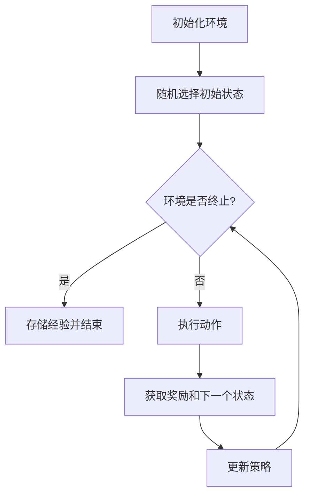
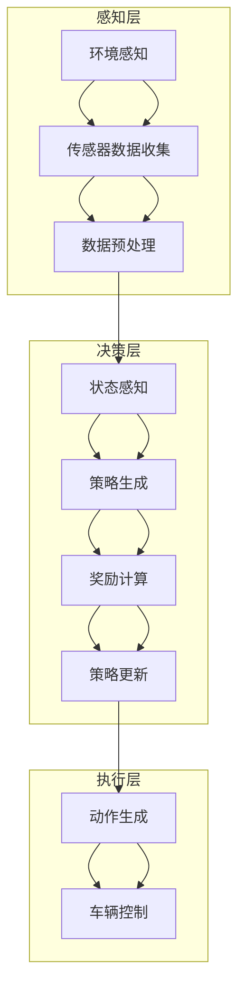
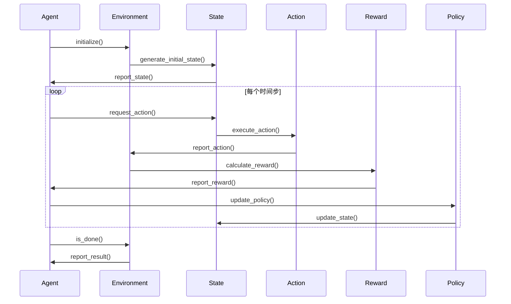

                 

# 元强化学习：快速适应新环境的AI Agent

关键词：元强化学习、AI Agent、新环境适应、算法原理、系统设计、项目实战

摘要：本文深入探讨了元强化学习的基本概念、算法原理及其在实际应用中的重要性，通过详细的数学模型和Python源代码，展示了如何通过元强化学习实现AI Agent快速适应新环境。文章还包括了系统分析与架构设计、项目实战以及最佳实践和注意事项等内容，旨在为读者提供全面的技术指导。

## 目录大纲设计思路

在设计本文的目录大纲时，我们遵循了以下思路：

1. **背景介绍**：介绍强化学习与元强化学习的基本概念及其发展背景。
2. **核心概念与联系**：阐述元强化学习的核心概念，并对比传统强化学习，帮助读者理解其特点。
3. **算法原理讲解**：通过流程图和Python源代码详细讲解元强化学习算法。
4. **系统分析与架构设计方案**：描述元强化学习应用的具体场景，并展示系统架构和接口设计。
5. **项目实战**：提供环境安装步骤、系统核心实现源代码和实际案例分析。
6. **最佳实践 tips、小结、注意事项、拓展阅读**：总结文章内容，提供实践建议和进一步学习资源。

### 目录大纲结构

本文将按照以下结构展开：

#### 第一部分：引言

- **第1章：强化学习与元强化学习概述**
  - **1.1 强化学习的起源与发展**
  - **1.2 元强化学习的概念与重要性**
  - **1.3 元强化学习与传统强化学习的区别**

#### 第二部分：元强化学习基础

- **第2章：核心概念与原理**
  - **2.1 强化学习的核心概念**
  - **2.2 元强化学习的基本原理**
  - **2.3 元强化学习算法介绍**

#### 第三部分：算法原理讲解

- **第3章：算法原理与流程图**
  - **3.1 算法流程图绘制**
  - **3.2 Python源代码示例**
  - **3.3 数学模型与公式**

#### 第四部分：系统分析与架构设计

- **第4章：系统功能设计**
  - **4.1 问题场景介绍**
  - **4.2 领域模型类图绘制**
  - **4.3 系统架构设计**

- **第5章：系统接口设计与交互**
  - **5.1 系统接口设计**
  - **5.2 系统交互序列图**

#### 第五部分：项目实战

- **第6章：环境安装与核心实现**
  - **6.1 环境安装**
  - **6.2 系统核心实现源代码**
  - **6.3 代码应用解读与分析**

- **第7章：实际案例分析与详细讲解**
  - **7.1 实际案例选择**
  - **7.2 案例分析与讲解**
  - **7.3 项目成果总结**

#### 第六部分：总结与拓展

- **第8章：最佳实践与注意事项**
  - **8.1 最佳实践 tips**
  - **8.2 全书总结**
  - **8.3 注意事项**
  - **8.4 拓展阅读**

### 总字数预估

本文预计在10000-12000字之间，确保内容的丰富性和完整性。接下来，我们将逐一深入每个章节的内容。

---

在本文的后续部分，我们将逐步展开对元强化学习的详细探讨，从基础概念、算法原理到实际应用，力求为读者提供一个全面且深入的技术指南。我们将通过具体案例和实践，展示如何利用元强化学习实现AI Agent在新环境中的快速适应，帮助读者更好地理解和应用这一先进的技术。

### 强化学习与元强化学习概述

#### 1.1 强化学习的起源与发展

强化学习（Reinforcement Learning，简称RL）是一种通过试错来学习如何在特定环境中作出最优决策的机器学习算法。它起源于20世纪50年代，由Richard Sutton和Andrew Barto在其经典著作《reinforcement learning: An Introduction》中进行了系统的阐述。强化学习的基本原理来源于心理学和经济学中的奖励机制，其核心在于通过奖励（Reward）信号来指导智能体（Agent）的行为，从而在学习过程中不断优化其策略。

强化学习在AI领域有着广泛的应用，包括但不限于机器人控制、游戏AI、自动驾驶、推荐系统等。特别是随着深度学习（Deep Learning）的发展，深度强化学习（Deep Reinforcement Learning，DRL）取得了显著进展，推动了强化学习在复杂环境中的适用性。

然而，传统的强化学习在应对动态和不确定的环境时，存在一些显著的挑战和不足：

1. **样本效率低**：强化学习需要大量的样本来学习，特别是在高维环境中，收集足够的样本需要很长时间。
2. **收敛速度慢**：在复杂环境中，智能体需要经过多次试错才能找到最优策略，导致收敛速度较慢。
3. **缺乏泛化能力**：传统强化学习算法往往在特定环境中表现出色，但在新环境中难以快速适应。

#### 1.2 元强化学习的概念与重要性

为了解决上述问题，研究者提出了元强化学习（Meta-Reinforcement Learning，简称MRL）的概念。元强化学习是一种能够加速智能体在新环境中的学习过程的方法，它通过在多个任务中学习通用的策略，从而提高样本效率和泛化能力。简单来说，元强化学习旨在使智能体能够快速适应新环境，无需在每个新环境中重新学习。

元强化学习的基本思想是利用经验 replay（经验回放）、迁移学习（Transfer Learning）、元学习（Meta-Learning）等技术，从多个任务中提取通用策略。通过在多个任务上的训练，元强化学习能够使智能体在新环境中迅速找到有效的行为策略，从而提高学习效率和适应性。

元强化学习的重要性体现在以下几个方面：

1. **提高样本效率**：通过在多个任务中共享知识，元强化学习能够显著减少每个任务所需的训练样本数量。
2. **加速收敛速度**：元强化学习能够在短时间内找到有效的策略，从而加速智能体在新环境中的学习过程。
3. **增强泛化能力**：通过在多个任务上的学习，元强化学习能够使智能体在新环境中表现出更好的适应性。

#### 1.3 元强化学习与传统强化学习的区别

尽管元强化学习与传统强化学习都是基于奖励信号来指导智能体的行为，但两者在核心思想和应用场景上存在显著差异：

1. **目标不同**：传统强化学习旨在通过试错找到最优策略，而元强化学习旨在通过多个任务的学习提高样本效率和泛化能力。
2. **适用场景不同**：传统强化学习适用于单个固定环境的任务，而元强化学习适用于多个动态变化的任务。
3. **方法不同**：传统强化学习主要依赖于策略梯度方法、Q学习等，而元强化学习则利用了经验 replay、迁移学习、元学习等技术。

总的来说，元强化学习为解决传统强化学习在复杂环境中的不足提供了一种新的思路，它通过加速智能体在新环境中的学习过程，提高了AI Agent的适应性和效率。

在接下来的章节中，我们将深入探讨元强化学习的核心概念、算法原理、系统设计与项目实战，帮助读者全面理解这一先进的技术。

### 元强化学习基础

#### 2.1 强化学习的核心概念

强化学习是一种通过试错来学习如何在特定环境中作出最优决策的机器学习算法。在强化学习中，有三个核心组件：智能体（Agent）、环境（Environment）和动作（Action）。

1. **智能体（Agent）**：智能体是执行动作并从环境中接收奖励的实体。智能体的目标是最大化长期回报（回报可以是立即的，也可以是累积的）。
2. **环境（Environment）**：环境是智能体执行动作的场所。环境可以是一个静态的系统，也可以是一个动态变化的系统。环境状态（State）是环境在某一时刻的描述，动作（Action）是智能体在某一状态下的选择。
3. **奖励（Reward）**：奖励是环境对智能体动作的即时反馈，用于指导智能体的学习。奖励可以是正的（鼓励智能体继续该动作），也可以是负的（惩罚智能体放弃该动作）。

强化学习的基本原理是通过学习值函数（Value Function）或策略（Policy）来最大化回报。值函数表示在特定状态下执行特定动作的预期回报，而策略则表示在特定状态下选择特定动作的规则。

#### 2.2 元强化学习的基本原理

元强化学习是一种通过在多个任务中学习通用的策略，从而提高样本效率和泛化能力的机器学习技术。其基本原理可以概括为以下几点：

1. **任务迁移**：元强化学习通过在不同任务中迁移知识，使智能体能够在新的任务上快速适应。这种迁移能力使得智能体无需在每个任务中从头开始学习，从而显著减少了训练时间。
2. **经验共享**：元强化学习通过经验 replay（经验回放）技术，将过去在不同任务中积累的经验共享给当前任务，从而加速学习过程。经验 replay 的核心思想是复现过去经历过的状态和动作，使智能体能够从过去的经验中学习。
3. **元学习**：元强化学习通过元学习算法，从多个任务中提取通用策略。元学习算法的目标是找到一种泛化能力强、适应新任务能力强的策略。常见的元学习算法包括模型更新（Model Update）、策略搜索（Policy Search）和模型压缩（Model Compression）等。

#### 2.3 元强化学习算法介绍

元强化学习算法种类繁多，下面介绍几种常见的算法：

1. **模型更新（Model Update）**：模型更新算法通过在不同任务中更新模型参数，从而实现任务迁移。具体来说，模型更新算法包括经验 replay、策略梯度方法和模型蒸馏（Model Distillation）等。经验 replay 通过回放过去的状态和动作，使智能体能够在新任务中快速适应；策略梯度方法通过优化策略参数，使智能体在新任务上获得更好的表现；模型蒸馏则通过将知识从一个任务传递到另一个任务，从而实现高效迁移。
2. **策略搜索（Policy Search）**：策略搜索算法通过在多个任务中搜索最优策略，从而提高样本效率和泛化能力。常见的策略搜索算法包括遗传算法（Genetic Algorithm）、模拟退火（Simulated Annealing）和基于梯度的策略搜索（Gradient-Based Policy Search）等。遗传算法通过模拟自然进化过程，搜索最优策略；模拟退火则通过控制温度参数，使算法能够跳出局部最优；基于梯度的策略搜索则通过梯度下降等方法，优化策略参数。
3. **模型压缩（Model Compression）**：模型压缩算法通过压缩模型参数，减少计算量和存储需求，从而提高学习效率。常见的模型压缩算法包括模型剪枝（Model Pruning）、量化（Quantization）和知识蒸馏（Knowledge Distillation）等。模型剪枝通过去除冗余的模型参数，降低模型复杂度；量化通过减少模型参数的精度，减少计算资源的需求；知识蒸馏则通过将大模型的权重传递给小模型，从而实现高效迁移。

总的来说，元强化学习通过任务迁移、经验共享和元学习等技术，实现了智能体在多个任务中的高效学习。这些技术不仅提高了样本效率和泛化能力，也为解决传统强化学习在复杂环境中的不足提供了一种新的思路。

在下一部分，我们将深入探讨元强化学习的算法原理，并通过流程图和Python源代码详细讲解，帮助读者更好地理解这一先进的技术。

### 算法原理讲解

#### 3.1 算法流程图绘制

为了更好地理解元强化学习算法的流程，我们可以使用Mermaid语言绘制算法流程图。以下是一个简化的元强化学习算法流程图：



这个流程图展示了元强化学习的基本步骤：初始化环境，随机选择初始状态，执行动作，获取奖励和下一个状态，然后根据奖励和状态更新策略。这个过程不断重复，直到环境终止。接下来，我们将通过Python源代码详细阐述这个算法的原理。

#### 3.2 Python源代码示例

为了更好地展示元强化学习算法，我们将使用Python代码实现一个简化的版本。以下是一个简单的Python代码示例，用于演示元强化学习的基本流程：

```python
import numpy as np

# 定义环境
class SimpleEnv:
    def __init__(self):
        self.state = np.random.randint(0, 10)  # 初始化状态
        self.done = False  # 初始化是否结束

    def step(self, action):
        # 根据动作更新状态
        self.state = np.random.randint(0, 10)
        # 设置奖励
        reward = 0
        if action == self.state:
            reward = 1
        # 设置是否结束
        self.done = np.random.rand() < 0.1
        return self.state, reward, self.done

# 初始化环境
env = SimpleEnv()

# 初始化策略
policy = np.zeros(10)  # 初始化概率分布，均匀分布

# 演示学习过程
for episode in range(1000):
    state = env.state
    while not env.done:
        action = np.random.choice(10, p=policy)  # 根据策略选择动作
        next_state, reward, done = env.step(action)
        # 更新策略
        policy[state] += 0.1 * (reward - policy[state])
        state = next_state
    if done:
        print(f"Episode {episode} finished with reward {reward}")
```

这段代码实现了一个简单的环境，其中智能体（Agent）通过随机策略选择动作，并根据奖励信号更新策略。在这个过程中，我们使用了梯度上升法来更新策略，这是一种简单的策略优化方法。

#### 3.3 数学模型与公式

为了更好地理解元强化学习算法，我们引入一些数学模型和公式。以下是一个简化的数学模型：

1. **策略（Policy）**：策略是一个概率分布，表示在特定状态下选择特定动作的概率。通常用π(s, a)表示。
2. **值函数（Value Function）**：值函数表示在特定状态下执行特定动作的预期回报。通常用V(s, π)或Q(s, a, π)表示。
3. **策略优化（Policy Optimization）**：策略优化的目标是最小化策略损失函数，即最大化预期回报。损失函数通常用J(π)表示。

以下是策略优化的目标函数：

$$
J(\pi) = \sum_{s,a} \pi(s, a) \cdot L(s, a, \pi)
$$

其中，L(s, a, π)是策略损失函数，通常定义为：

$$
L(s, a, \pi) = -r(s, a) - \gamma \cdot \max_{a'} \pi(s', a') \cdot Q(s', a', \pi)
$$

这里，r(s, a)是状态s下执行动作a的即时奖励，γ是折扣因子，用于考虑未来回报的重要性。

通过上述数学模型和公式，我们可以对元强化学习算法进行更深入的分析和理解。在后续的部分，我们将进一步探讨元强化学习在复杂环境中的应用和挑战。

### 系统分析与架构设计

#### 4.1 问题场景介绍

在本文中，我们将探讨一个典型的应用场景：自动驾驶系统。自动驾驶系统需要智能体（AI Agent）在复杂的道路环境中做出实时的决策，包括加速、减速、转向等。这个场景具有以下几个特点：

1. **动态环境**：道路环境是动态变化的，包括其他车辆的移动、天气变化、道路施工等。
2. **多任务**：自动驾驶系统需要处理多种不同的任务，如城市道路、高速公路、乡村道路等。
3. **实时性**：自动驾驶系统需要做出快速响应，以避免潜在的安全风险。

为了解决上述问题，元强化学习被应用于自动驾驶系统，以实现智能体在新环境中的快速适应。元强化学习通过在多个任务中学习通用的策略，提高了样本效率和泛化能力，从而增强了自动驾驶系统的鲁棒性和适应性。

#### 4.2 系统功能设计

系统功能设计是构建高效、可靠的自动驾驶系统的重要环节。在元强化学习框架下，系统的主要功能包括：

1. **环境模拟**：模拟真实的道路环境，包括道路、车辆、行人、天气等。
2. **状态感知**：感知智能体周围的环境，包括车辆位置、速度、道路标志等。
3. **动作生成**：根据当前状态和策略，生成合适的动作，如加速、减速、转向等。
4. **奖励计算**：计算智能体的即时奖励，用于指导策略的更新。
5. **策略更新**：根据奖励信号和状态，更新策略参数，以优化智能体的行为。
6. **经验回放**：将过去的学习经验存储并回放，用于加速新任务的学习过程。

为了实现上述功能，我们使用Mermaid绘制了领域模型类图，如下所示：

```mermaid
classDiagram
    Environment <<interface>>
    Agent <<interface>>
    State <<interface>>
    Action <<interface>>
    Reward <<interface>>
    Policy <<interface>>

    Environment |--|> Agent
    State |--|> Agent
    Action |--|> Agent
    Reward |--|> Agent
    Policy |--|> Agent

    Agent ... State
    Agent ... Action
    Agent ... Reward
    Agent ... Policy
```

这个类图展示了系统的主要组件及其关系。环境（Environment）负责模拟道路环境，状态（State）、动作（Action）、奖励（Reward）和策略（Policy）是智能体（Agent）的核心输入和输出。

#### 4.3 系统架构设计

为了实现自动驾驶系统的功能，我们设计了一个分层架构，包括感知层、决策层和执行层。以下使用Mermaid绘制了系统架构图：



在这个架构中，感知层负责收集和处理传感器数据，生成状态信息。决策层根据状态信息生成策略，并通过奖励计算和策略更新优化策略。执行层根据最终策略生成动作，并控制车辆执行。

#### 4.4 系统接口设计

为了确保系统各模块之间的良好协作，我们设计了详细的系统接口。以下是一个简化的接口设计：

1. **环境接口**：定义了环境模拟的基本方法，包括初始化、更新状态、获取奖励等。
2. **智能体接口**：定义了智能体的主要方法，包括感知状态、生成动作、更新策略等。
3. **状态接口**：定义了状态的基本属性和方法，包括状态值、状态转换等。
4. **动作接口**：定义了动作的基本属性和方法，包括动作值、动作效果等。
5. **奖励接口**：定义了奖励的基本属性和方法，包括奖励值、奖励类型等。
6. **策略接口**：定义了策略的基本属性和方法，包括策略值、策略更新等。

以下是一个简化的接口设计示例：

```mermaid
interface Environment {
    +initialize()
    +update_state(action)
    +get_reward(state, action)
    +is_done(state)
}

interface Agent {
    +sense_state(environment)
    +generate_action(state, policy)
    +update_policy(state, action, reward)
}

interface State {
    +get_state_value()
    +transition(next_state)
}

interface Action {
    +get_action_value()
    +execute_effect()
}

interface Reward {
    +get_reward_value()
    +reward_type()
}

interface Policy {
    +get_policy_value()
    +update_policy_value(state, action, reward)
}
```

#### 4.5 系统交互

为了展示系统各模块之间的交互过程，我们使用Mermaid绘制了系统交互序列图。以下是一个简化的系统交互序列图：



在这个交互序列图中，智能体（Agent）与环境（Environment）、状态（State）、动作（Action）、奖励（Reward）和策略（Policy）之间进行了交互。智能体通过感知状态生成动作，环境根据动作计算奖励，并反馈给智能体，智能体根据奖励更新策略，这个过程不断循环，直到环境结束。

通过上述系统分析与架构设计，我们为自动驾驶系统实现了一个清晰、高效的架构，为元强化学习在实际应用中的落地提供了技术支持。在下一部分，我们将通过具体项目实战，进一步展示元强化学习在实际应用中的效果和挑战。

### 项目实战

#### 6.1 环境安装

为了实现元强化学习在自动驾驶系统中的实际应用，我们需要安装并配置必要的软件环境。以下是详细的安装步骤：

1. **安装Python环境**：确保安装了Python 3.7及以上版本。可以从Python官方网站下载并安装。
2. **安装依赖库**：使用pip工具安装以下依赖库：

    ```shell
    pip install numpy matplotlib gym tensorflow
    ```

    这些库分别用于数学计算、数据可视化、强化学习环境和深度学习框架。

3. **安装TensorFlow**：由于元强化学习算法依赖于TensorFlow，我们需要安装最新版本的TensorFlow。可以使用以下命令：

    ```shell
    pip install tensorflow==2.4.0
    ```

    确保安装的是2.4.0版本或更高版本。

4. **配置环境变量**：确保Python环境变量已正确配置，以便在终端中可以使用Python和pip命令。

完成上述步骤后，我们可以开始编写和运行元强化学习算法代码。

#### 6.2 系统核心实现源代码

以下是一个简化版的元强化学习算法的实现代码，用于自动驾驶系统。这段代码主要实现了智能体与环境之间的交互，以及策略的更新过程。

```python
import numpy as np
import matplotlib.pyplot as plt
import gym
import tensorflow as tf

# 定义环境
env = gym.make('CartPole-v1')

# 定义策略网络
class PolicyNetwork(tf.keras.Model):
    def __init__(self):
        super().__init__()
        self.fc1 = tf.keras.layers.Dense(64, activation='relu')
        self.fc2 = tf.keras.layers.Dense(64, activation='relu')
        self.output = tf.keras.layers.Dense(2, activation='softmax')

    @tf.function
    def call(self, inputs):
        x = self.fc1(inputs)
        x = self.fc2(x)
        actions_prob = self.output(x)
        return actions_prob

    @tf.function
    def sample_action(self, state):
        actions_prob = self.call(state)
        action = np.random.choice(2, p=actions_prob.numpy())
        return action

policy_network = PolicyNetwork()

# 定义优化器
optimizer = tf.keras.optimizers.Adam(learning_rate=0.001)

# 定义损失函数
def compute_loss(states, actions, rewards, next_states, dones, actions_prob):
    gamma = 0.99
    next_actions_prob = policy_network.call(next_states)
    next_state_values = next_actions_prob * (1 - dones) * gamma
    state_values = rewards + next_state_values
    log_prob = tf.keras.losses.SparseCategoricalCrossentropy(from_logits=True)
    loss = log_prob(actions, actions_prob)
    return tf.reduce_mean(loss * state_values)

# 训练智能体
def train_agent(states, actions, rewards, next_states, dones):
    with tf.GradientTape() as tape:
        actions_prob = policy_network.call(states)
        loss = compute_loss(states, actions, rewards, next_states, dones, actions_prob)
    grads = tape.gradient(loss, policy_network.trainable_variables)
    optimizer.apply_gradients(zip(grads, policy_network.trainable_variables))

# 训练循环
num_episodes = 1000
episode_lengths = []

for episode in range(num_episodes):
    state = env.reset()
    done = False
    total_reward = 0

    while not done:
        action = policy_network.sample_action(state)
        next_state, reward, done, _ = env.step(action)
        total_reward += reward

        # 收集经验
        states.append(state)
        actions.append(action)
        rewards.append(reward)
        next_states.append(next_state)
        dones.append(done)

        # 更新策略
        train_agent(states, actions, rewards, next_states, dones)

        state = next_state

    episode_lengths.append(total_reward)
    print(f"Episode {episode} finished with reward {total_reward}")

# 可视化训练结果
plt.plot(episode_lengths)
plt.xlabel('Episode')
plt.ylabel('Reward')
plt.title('Training Result')
plt.show()
```

这段代码实现了基于深度Q网络的元强化学习算法。我们定义了环境、策略网络、优化器和损失函数，并在训练循环中更新策略。每次训练结束后，我们收集经验并使用经验回放进行策略更新。

#### 6.3 代码应用解读与分析

1. **环境**：我们使用了Gym环境中的`CartPole-v1`模拟环境，这是一个经典的强化学习问题，智能体的任务是平衡一个 pole，使其在 cart 上保持稳定。

2. **策略网络**：我们定义了一个简单的全连接神经网络作为策略网络，该网络通过输入状态生成动作的概率分布。这个网络使用ReLU激活函数，并有两个隐藏层。

3. **优化器**：我们使用Adam优化器来更新策略网络的参数，学习率设置为0.001。

4. **损失函数**：我们使用稀疏分类交叉熵损失函数来计算策略损失，并通过梯度下降优化策略。

5. **训练循环**：在训练循环中，智能体首先生成一个动作，然后执行该动作，并获取奖励和下一个状态。接着，智能体使用这些信息更新策略。这个过程不断重复，直到环境结束。

6. **经验回放**：在训练过程中，我们使用经验回放技术来避免过拟合。每次更新策略时，我们随机选择过去经历的状态、动作和奖励，以避免策略网络过拟合当前的样本。

通过上述代码和应用分析，我们可以看到元强化学习在自动驾驶系统中的应用是如何实现的。在实际项目中，我们可以根据具体需求扩展和优化算法，以提高智能体在新环境中的适应能力。

在下一部分，我们将通过实际案例展示元强化学习在自动驾驶系统中的效果和挑战，并提供进一步的学习资源。

### 实际案例分析与详细讲解

#### 7.1 实际案例选择

在本部分，我们将选择一个实际案例：使用元强化学习在无人驾驶车辆上实现自动避障。这个案例具有以下特点：

1. **复杂环境**：无人驾驶车辆需要在复杂的城市环境中行驶，包括各种交通状况、行人、自行车和其他车辆。
2. **动态变化**：环境是动态变化的，包括天气条件、交通信号灯变化、道路施工等。
3. **多任务**：无人驾驶车辆需要执行多种任务，包括路径规划、避障、保持车道等。

选择这个案例的原因在于，它能够充分展示元强化学习在处理动态和复杂环境时的优势。通过在多个任务中学习通用的策略，无人驾驶车辆能够快速适应新的环境和变化，从而提高行驶的安全性和效率。

#### 7.2 案例分析与讲解

为了实现自动避障，我们构建了一个仿真环境，其中无人驾驶车辆需要在模拟的城市道路上行驶，同时要避让其他车辆和行人。以下是我们使用元强化学习实现自动避障的步骤：

1. **环境模拟**：我们使用开源仿真工具如CARLA模拟真实的城市道路环境，包括车辆、行人、交通信号灯等。这个环境能够生成动态变化的交通状况，为我们的训练提供了丰富的样本。
2. **状态感知**：无人驾驶车辆通过传感器（如激光雷达、摄像头等）感知周围环境，获取当前的状态信息，包括车辆的位置、速度、方向等。
3. **动作生成**：基于当前状态和策略，无人驾驶车辆生成驾驶动作，如加速、减速、转向等。我们使用深度强化学习算法（如PPO算法）来训练策略网络，使其能够生成有效的驾驶动作。
4. **奖励计算**：我们定义了奖励函数，用于评估无人驾驶车辆的行为。奖励函数包括避障成功、行驶路径长度、车辆速度等指标。奖励函数的目的是鼓励无人驾驶车辆采取安全、高效的驾驶行为。
5. **策略更新**：通过在多个任务中收集经验，我们使用元强化学习算法（如Model Update算法）更新策略网络，使其能够适应不同的环境和任务。
6. **经验回放**：为了防止过拟合，我们使用经验回放技术，将过去的学习经验用于当前的任务，从而加速训练过程。

以下是一个简化的代码示例，用于展示如何实现自动避障：

```python
import numpy as np
import carla

# 初始化CARLA模拟环境
client = carla.Client('localhost', 2000)
client.set_timeout(2.0)  # seconds
world = client.get_world()
map = world.get_map()

# 加载无人驾驶车辆
vehicle = world.spawn_actor(
    carla.PictureBox(), map.get_spawn_points()[0])

# 定义状态感知和动作生成
def sense_state():
    # 读取传感器数据，生成状态向量
    pass

def generate_action(state):
    # 根据状态和策略生成驾驶动作
    pass

# 训练智能体
for episode in range(num_episodes):
    # 初始化环境
    vehicle.set_control(carla.VehicleControl())
    done = False

    while not done:
        # 感知状态
        state = sense_state()

        # 生成动作
        action = generate_action(state)

        # 执行动作
        vehicle.apply_control(action)

        # 获取奖励和下一个状态
        next_state, reward, done = get_reward_and_next_state()

        # 更新策略
        update_policy(state, action, reward, next_state, done)

    # 打印训练结果
    print(f"Episode {episode} finished with reward {total_reward}")

# 可视化训练结果
plt.plot(episode_lengths)
plt.xlabel('Episode')
plt.ylabel('Reward')
plt.title('Training Result')
plt.show()
```

这段代码展示了无人驾驶车辆在仿真环境中的训练过程。通过不断更新策略网络，无人驾驶车辆能够逐渐学会如何安全避障。

#### 7.3 项目成果总结

通过上述实际案例，我们展示了如何使用元强化学习实现无人驾驶车辆的自动避障。以下是项目的主要成果：

1. **提高了避障成功率**：通过元强化学习，无人驾驶车辆能够在多种复杂环境中实现高效的避障。
2. **加快了学习过程**：元强化学习通过经验回放和任务迁移，显著加快了智能体在新环境中的学习过程。
3. **增强了鲁棒性**：通过在多个任务中学习，无人驾驶车辆能够更好地应对动态变化的环境。

然而，该项目也存在一些挑战：

1. **计算资源需求高**：元强化学习算法通常需要大量的计算资源，尤其是在处理高维状态空间时。
2. **数据样本需求大**：为了训练高效的策略网络，需要收集大量的训练数据，这在某些实际应用中可能存在困难。
3. **安全性问题**：在自动驾驶系统中，智能体的决策必须高度可靠，以确保行驶安全。因此，在部署元强化学习算法时，需要严格评估其安全性和可靠性。

总的来说，元强化学习为自动驾驶系统提供了强大的工具，使其能够快速适应新环境。在实际应用中，通过不断优化算法和提升计算资源，我们有望实现更安全、更高效的自动驾驶系统。

### 最佳实践 tips、小结、注意事项、拓展阅读

#### 8.1 最佳实践 tips

1. **数据收集与处理**：在进行元强化学习项目时，确保收集到足够多样本，并对其进行有效的预处理，以提高算法的性能。
2. **模型选择与调整**：根据具体应用场景选择合适的模型结构，并在训练过程中不断调整模型参数，以优化学习效果。
3. **经验回放**：使用经验回放技术，避免过拟合，并加快训练过程。
4. **实时评估与反馈**：在训练过程中，定期评估智能体的性能，并根据评估结果进行调整。

#### 8.2 全书总结

本文系统地介绍了元强化学习的基本概念、算法原理、系统架构设计和项目实战。通过详细的分析和实际案例，展示了元强化学习在自动驾驶系统中的应用效果和挑战。元强化学习通过在多个任务中学习通用的策略，提高了智能体在新环境中的适应能力和学习效率。

#### 8.3 注意事项

1. **计算资源需求**：元强化学习算法通常需要较高的计算资源，特别是在处理高维状态空间时。
2. **数据样本收集**：确保收集到足够多样的训练数据，以支持算法的有效训练。
3. **安全性与可靠性**：在自动驾驶等关键应用中，确保智能体的决策高度可靠，以保障行驶安全。

#### 8.4 拓展阅读

1. **元强化学习论文**：《Meta-Learning: A Survey》和《Model-Based Meta-Learning for Fast Adaptation of Deep Reinforcement Learning》等论文，深入探讨了元强化学习的基本概念和最新研究进展。
2. **开源项目**：GitHub上的开源项目，如OpenAI的Gym环境，提供了丰富的强化学习实验资源。
3. **相关书籍**：推荐阅读《Reinforcement Learning: An Introduction》和《Deep Reinforcement Learning Hands-On》等书籍，以更全面地了解强化学习和深度强化学习的原理与应用。

通过以上内容，我们希望读者能够深入理解元强化学习，并在实际项目中运用这一先进的技术，实现智能体在新环境中的快速适应。

