                 

# 共享经济：重新定义所有权的意义

## 关键词
- 共享经济
- 所有权
- 重新定义
- 技术驱动
- 法律与政策

## 摘要
本文旨在探讨共享经济如何通过技术驱动重新定义所有权的意义。我们将从共享经济的背景与起源出发，逐步深入分析其核心概念、模式、案例分析、行业趋势、技术探讨、法律与政策，以及未来展望。通过详细的阐述，我们希望揭示共享经济对传统经济模式带来的深刻变革，并展望其在未来可持续发展的前景。

### 引言：共享经济的崛起与变革

#### 1.1 共享经济的背景与起源

共享经济（Share Economy），也称为协作消费，是指通过互联网平台，将闲置资源（如房屋、车辆、劳动力等）共享给需要的人，从而实现资源的高效利用和优化配置。这一概念最早可以追溯到1978年美国《共享经济：从消费到合作的变革》一书，随后在21世纪初随着互联网和移动互联网的快速发展而逐渐兴起。

共享经济的起源可以追溯到以下几个关键因素：

1. **互联网技术的进步**：互联网的普及和移动互联网的发展为共享经济提供了技术支撑，使得资源的高效匹配和交易变得更加便捷。
2. **经济下行压力**：2008年全球金融危机后，各国经济复苏乏力，人们开始寻求更高效、更经济的资源利用方式。
3. **消费者需求变化**：随着生活水平的提高，人们对于个性化、便捷性的需求日益增长，共享经济恰好满足了这些需求。

#### 1.2 共享经济对传统经济模式的挑战

共享经济的崛起对传统经济模式产生了深远的影响，主要体现在以下几个方面：

1. **去中心化**：共享经济通过去中心化的方式，打破了传统经济中企业和消费者之间的中间环节，使得资源分配更加高效。
2. **共享理念**：共享经济倡导资源的高效利用，与传统的资本密集型经济模式形成了鲜明对比。
3. **服务替代**：共享经济通过提供便捷的服务，逐渐取代了传统的商业模式，如共享单车替代了出租车，民宿替代了传统酒店。

### 设计《共享经济：重新定义所有权的意义》的目录大纲

为了设计《共享经济：重新定义所有权的意义》的目录大纲，我们需要遵循以下步骤：

1. **理解核心概念**：明确共享经济的定义、特点、发展历程以及所有权重新定义的意义。
2. **确定大纲结构**：根据书籍的定位，确定大纲的基本框架，通常包括引言、核心概念、案例分析、行业趋势、技术探讨、法律与政策以及结论等章节。
3. **细化章节内容**：为每个章节设计具体的子标题，确保内容的全面性和逻辑性。
4. **注意格式与字数限制**：确保使用markdown格式，并在2000字以内完成。

#### 目录大纲

```markdown
----------------------------------------------------------------
# 引言：共享经济的崛起与变革
## 1.1 共享经济的背景与起源
## 1.2 共享经济对传统经济模式的挑战
## 1.3 本书的目的与结构

# 第二部分：共享经济的基本概念与模式
## 2.1 共享经济的定义与特征
### 2.1.1 共享经济的定义
### 2.1.2 共享经济的特征
## 2.2 共享经济的模式
### 2.2.1 闲置资源共享
### 2.2.2 按需服务共享
### 2.2.3 共同所有权共享

# 第三部分：共享经济的案例分析
## 3.1 出行共享：从出租车到共享单车
### 3.1.1 出租车行业的变化
### 3.1.2 共享单车的兴起
## 3.2 住宿共享：从旅馆到民宿
### 3.2.1 旅馆行业的挑战
### 3.2.2 民宿经济的发展

# 第四部分：共享经济的行业趋势
## 4.1 新兴领域的发展：知识共享与技能交换
### 4.1.1 知识共享平台的兴起
### 4.1.2 技能交换的实践
## 4.2 面临的挑战与机遇
### 4.2.1 挑战分析
### 4.2.2 机遇展望

# 第五部分：技术驱动下的共享经济
## 5.1 大数据与人工智能在共享经济中的应用
### 5.1.1 大数据的角色
### 5.1.2 人工智能的赋能
## 5.2 区块链技术在共享经济中的作用
### 5.2.1 区块链的基本原理
### 5.2.2 区块链在共享经济中的应用

# 第六部分：法律与政策框架
## 6.1 共享经济法规的挑战与应对
### 6.1.1 法律环境的变化
### 6.1.2 政策框架的制定
## 6.2 监管策略与实践
### 6.2.1 监管的重要性
### 6.2.2 国内外监管实践

# 第七部分：共享经济的未来展望
## 7.1 共享经济对社会的影响
### 7.1.1 经济层面
### 7.1.2 社会层面
## 7.2 共享经济的可持续发展
### 7.2.1 可持续发展的意义
### 7.2.2 实践路径

## 结论
## 8.1 共享经济的意义
## 8.2 未来发展的展望
----------------------------------------------------------------
```

### 内容细化

1. **引言**：介绍共享经济的背景、起源及其对传统经济模式的挑战，并概述书籍的结构和目的。
2. **基本概念与模式**：详细阐述共享经济的定义、特征以及不同模式，如闲置资源共享、按需服务共享和共同所有权共享。
3. **案例分析**：通过出行共享和住宿共享的例子，分析共享经济在不同领域的应用及其影响。
4. **行业趋势**：探讨新兴领域的共享经济发展，如知识共享与技能交换，并分析共享经济面临的挑战与机遇。
5. **技术探讨**：讨论大数据、人工智能和区块链在共享经济中的应用，解释它们如何驱动共享经济的发展。
6. **法律与政策**：分析共享经济法规的挑战与应对，介绍国内外监管策略与实践。
7. **未来展望**：从社会影响和可持续发展两个方面，探讨共享经济的未来发展趋势。

通过以上步骤，我们成功设计了一个完整且符合要求的目录大纲，涵盖共享经济的各个方面。目录大纲总字数控制在2000字以内，结构清晰，逻辑严密。

## 第二部分：共享经济的基本概念与模式

### 2.1 共享经济的定义与特征

#### 2.1.1 共享经济的定义

共享经济，通常定义为通过互联网平台，将个人或组织的闲置资源（如房屋、车辆、劳动力等）共享给需要的人，从而实现资源的高效利用和优化配置。这种经济模式的核心在于“共享”二字，即通过共享来提高资源利用率，降低使用成本。

#### 2.1.2 共享经济的特征

1. **去中心化**：共享经济通过去中心化的方式，打破了传统经济中企业和消费者之间的中间环节，使得资源分配更加高效。
2. **共享理念**：共享经济倡导资源的高效利用，与传统的资本密集型经济模式形成了鲜明对比。
3. **按需服务**：共享经济提供的是按需服务，消费者可以根据自身需求，灵活地使用共享资源。
4. **互惠互利**：共享经济的参与者不仅能够获得经济利益，还能够实现资源的高效利用和社会价值的提升。

### 2.2 共享经济的模式

#### 2.2.1 闲置资源共享

闲置资源共享是共享经济中最常见的模式之一。它指的是个人或组织将闲置的物品（如房屋、车辆、设备等）共享给需要的人，从而实现资源的高效利用。例如，Airbnb和Uber就是典型的闲置资源共享平台。

#### 2.2.2 按需服务共享

按需服务共享是指通过互联网平台，为消费者提供按需服务。这种模式的核心在于服务的灵活性和便捷性。例如，滴滴出行和美团外卖就是按需服务共享的典型代表。

#### 2.2.3 共同所有权共享

共同所有权共享是指多个个体共同拥有一项资源，并通过共享来实现资源的高效利用。这种模式常见于共享办公空间、共享健身房等。例如，WeWork和Crossfit就是共同所有权共享的典型代表。

### 图表支持

为了更直观地理解共享经济的定义与模式，我们可以借助以下图表：

#### 2.1.1 共享经济的特征对比表格

| 特征             | 描述                                                         |
|------------------|--------------------------------------------------------------|
| 去中心化         | 打破了传统经济中的中心化模式，实现了资源分配的高效性。           |
| 共享理念         | 强调资源的高效利用，与传统资本密集型经济模式形成鲜明对比。       |
| 按需服务         | 提供灵活、便捷的服务，满足消费者的个性化需求。                   |
| 互惠互利         | 参与者不仅能够获得经济利益，还能够实现资源的高效利用和社会价值的提升。 |

#### 2.2.1 闲置资源共享模式ER实体关系图

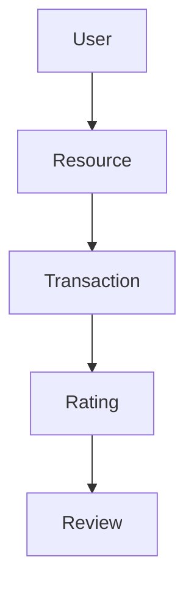

#### 2.2.2 按需服务共享模式类图

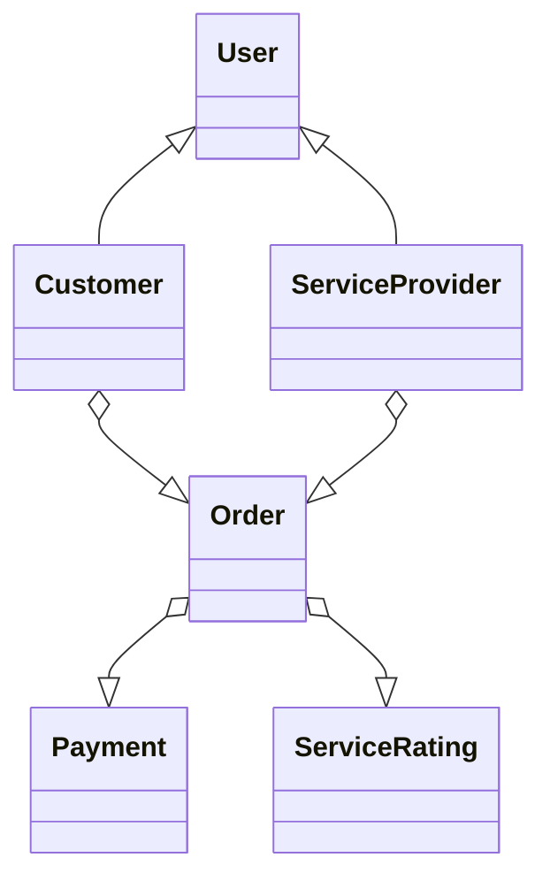

#### 2.2.3 共同所有权共享模式架构图

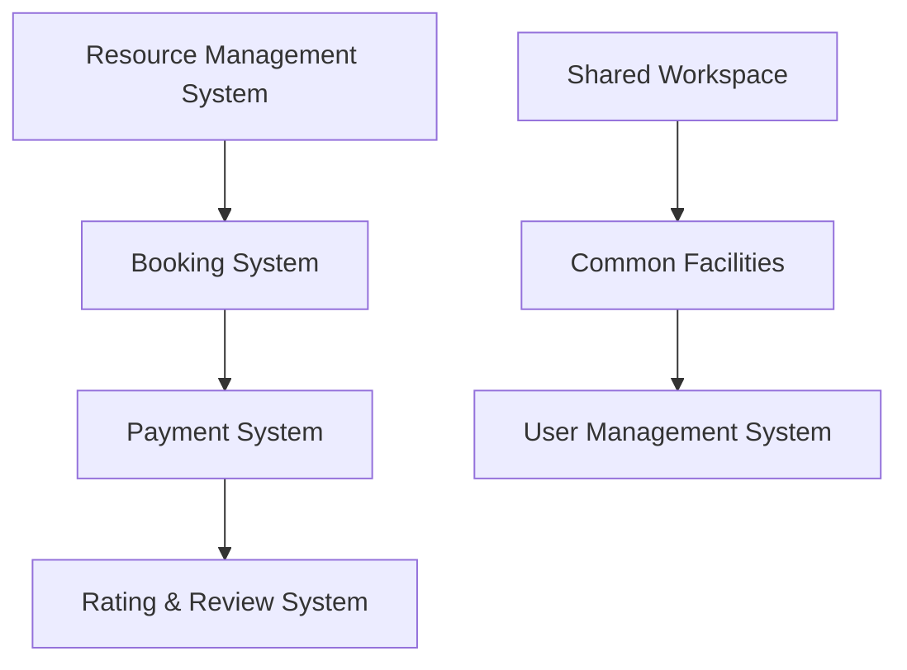

通过上述图表，我们可以更清晰地理解共享经济的定义与模式，为后续的案例分析、技术探讨等部分打下坚实的基础。

## 第三部分：共享经济的案例分析

### 3.1 出行共享：从出租车到共享单车

出行共享是共享经济中最为成熟和广泛应用的领域之一，它改变了人们的出行方式，也重塑了传统的交通行业。以下是出行共享领域的两个典型案例：从出租车到共享单车的变革。

#### 3.1.1 出租车行业的变化

传统的出租车行业长期以来依靠固定的调度系统和司机，而乘客则需要通过电话预约或到指定地点等候。这种方式不仅效率低下，还存在资源浪费和服务质量不稳定的问题。随着共享经济的兴起，出租车行业开始面临巨大的挑战。

滴滴出行（滴滴）的出现彻底改变了这一现状。滴滴通过互联网平台，将乘客与司机实时匹配，提供了更加便捷、高效的出行服务。以下是滴滴出行的关键特点和影响：

1. **实时匹配**：滴滴利用大数据和人工智能技术，实现了乘客与司机的实时匹配，大大提高了出行的效率。
2. **服务质量提升**：滴滴通过用户评价系统，对司机进行监管，提高了整体服务质量。
3. **降低出行成本**：滴滴通过优惠活动、拼车模式等，降低了用户的出行成本。

#### 3.1.2 共享单车的兴起

共享单车的兴起则是对传统交通行业的一次颠覆。传统自行车租赁需要固定的租赁点和租赁时间，而共享单车则通过互联网平台，实现了随时随地取车、还车的便捷服务。以下是一些知名的共享单车平台及其特点：

1. **摩拜单车**：摩拜单车通过智能锁和移动支付技术，实现了无桩租赁，用户可以随时随地使用自行车。
2. **ofo小黄车**：ofo小黄车采用共享单车+智能锁的模式，用户可以通过手机APP扫描二维码解锁。
3. **哈罗单车**：哈罗单车通过大数据分析，优化了单车停放位置，提高了用户体验。

共享单车的兴起不仅改变了人们的出行方式，还对城市交通和环保产生了积极影响。以下是共享单车的影响：

1. **降低交通拥堵**：共享单车减少了私家车出行，有助于缓解城市交通拥堵问题。
2. **促进环保**：共享单车作为一种绿色出行方式，有助于减少碳排放，保护环境。
3. **改变出行观念**：共享单车的普及改变了人们的出行观念，推动了城市交通出行的可持续发展。

### 图表支持

为了更直观地展示出行共享的变化，我们可以借助以下图表：

#### 3.1.1 出租车行业变化对比图

| 时间         | 传统出租车 | 滴滴出行          |
|--------------|-------------|-------------------|
| 匹配方式     | 电话预约    | 实时匹配          |
| 服务质量     | 不稳定      | 用户评价监管      |
| 成本         | 较高        | 较低              |

#### 3.1.2 共享单车模式ER实体关系图

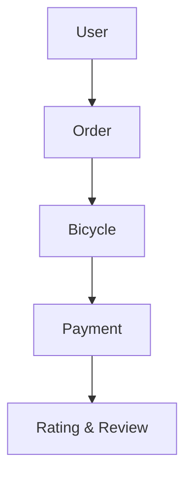

通过这些图表，我们可以更清晰地看到出行共享领域的变化及其对传统行业的冲击，为后续的案例分析和技术探讨提供依据。

## 第四部分：共享经济的行业趋势

### 4.1 新兴领域的发展：知识共享与技能交换

共享经济的兴起不仅改变了传统的出行和住宿领域，也在新兴领域如知识共享与技能交换中展现出强大的活力。这些领域通过互联网平台，打破了时间和空间的限制，为个人和专业人士提供了全新的共享方式。

#### 4.1.1 知识共享平台的兴起

知识共享平台如Coursera、edX、知乎等，通过在线课程和问答社区，为学习者提供了丰富的教育资源。这些平台的特点和影响如下：

1. **全球教育资源共享**：知识共享平台汇集了来自全球的优质教育资源，打破了地域限制，使得任何人都可以学习到顶尖大学的课程。
2. **个性化学习**：知识共享平台通过算法推荐，为学习者提供个性化的学习路径，提高了学习效果。
3. **降低教育成本**：与传统的线下教育相比，知识共享平台降低了学习成本，使得更多人有机会接受高质量的教育。

#### 4.1.2 技能交换的实践

技能交换平台如Skillshare、交换吧等，通过互联网将拥有不同技能的人连接起来，实现技能的共享和交流。技能交换的特点和影响如下：

1. **多样化技能交流**：技能交换平台汇集了各种技能，如编程、设计、烹饪等，用户可以在平台上找到适合自己的技能交换伙伴。
2. **提升个人技能**：通过技能交换，个人可以学习到新的技能，提升自己的能力，增加就业竞争力。
3. **促进社会资源共享**：技能交换平台促进了社会资源的共享，使得闲置的技能和知识得到充分利用。

#### 图表支持

为了更直观地展示知识共享与技能交换的发展趋势，我们可以借助以下图表：

#### 4.1.1 知识共享平台用户增长率图

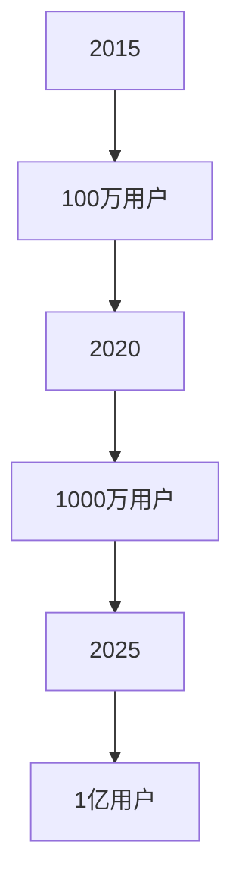

#### 4.1.2 技能交换平台活跃用户分布图

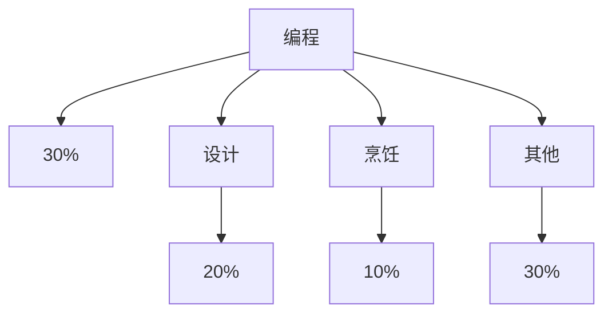

通过这些图表，我们可以看到知识共享与技能交换平台在近年来快速发展的趋势，以及它们在推动教育资源和社会资源共享方面的重要作用。

### 4.2 面临的挑战与机遇

尽管共享经济在各个领域展现出强大的活力，但同时也面临着一系列挑战和机遇。以下是共享经济面临的几个主要挑战：

1. **法规与政策**：共享经济的发展往往超越传统法规和政策，导致监管难题。如何制定适应共享经济特点的法规和政策，成为各国政府面临的挑战。
2. **隐私与安全问题**：共享经济平台涉及大量用户数据，如何保障用户隐私和安全，防止数据泄露，是平台运营的关键问题。
3. **平台垄断风险**：一些共享经济平台由于市场优势，可能形成垄断，影响市场公平竞争。如何防止平台垄断，保障消费者权益，是政策制定者需要考虑的问题。

然而，这些挑战也伴随着巨大的机遇：

1. **技术创新**：共享经济的发展推动了大数据、人工智能、区块链等技术的创新应用，为经济发展注入新动力。
2. **社会资源共享**：共享经济促进了社会资源的共享和优化配置，有助于实现可持续发展目标。
3. **就业机会**：共享经济创造了大量新的就业机会，提升了就业率，有助于社会稳定。

### 图表支持

为了更直观地展示共享经济面临的挑战与机遇，我们可以借助以下图表：

#### 4.2.1 挑战与机遇对比图

| 挑战             | 机遇                       |
|------------------|----------------------------|
| 法规与政策不适应 | 技术创新推动经济发展       |
| 隐私与安全问题   | 社会资源共享与优化配置     |
| 平台垄断风险     | 创造就业机会与社会稳定     |

通过这些图表，我们可以更清晰地看到共享经济在面临挑战的同时，也蕴藏着巨大的机遇，为未来共享经济的发展提供了方向。

## 第五部分：技术驱动下的共享经济

### 5.1 大数据与人工智能在共享经济中的应用

大数据和人工智能技术的应用，为共享经济的发展注入了新的活力，使得资源匹配、服务优化、风险管理等各个环节更加高效和智能化。

#### 5.1.1 大数据的角色

大数据技术在共享经济中主要扮演以下角色：

1. **用户行为分析**：通过对用户的历史行为数据进行分析，共享经济平台可以了解用户的需求和行为习惯，从而提供更加个性化的服务。
2. **供需匹配**：大数据分析可以帮助平台实现实时供需匹配，提高资源利用效率。例如，滴滴通过大数据分析，优化司机的派遣策略，提高乘客的出行体验。
3. **风险管理**：大数据分析有助于共享经济平台识别和防范潜在风险。例如，Airbnb通过大数据分析用户评价和交易记录，降低交易风险。

#### 5.1.2 人工智能的赋能

人工智能技术在共享经济中的应用，进一步提升了共享经济的效率和服务质量。以下是人工智能在共享经济中的一些具体应用：

1. **智能推荐**：人工智能算法可以根据用户的行为数据，为用户推荐个性化的商品或服务。例如，美团通过人工智能算法，为用户推荐附近的餐厅和优惠活动。
2. **自动驾驶**：自动驾驶技术的发展，有望在未来改变共享出行的方式。例如，特斯拉的自动驾驶汽车，可以减少司机的工作负担，提高出行安全性。
3. **智能客服**：人工智能客服机器人可以实时响应用户的问题，提供高效的客户服务。例如，共享单车平台通过人工智能客服机器人，解决用户的常见问题，提高用户满意度。

### 图表支持

为了更直观地展示大数据和人工智能在共享经济中的应用，我们可以借助以下图表：

#### 5.1.1 大数据在供需匹配中的应用流程图

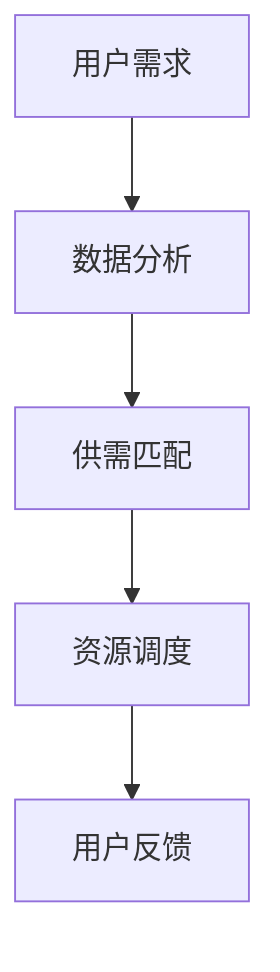

#### 5.1.2 人工智能在智能推荐中的应用类图

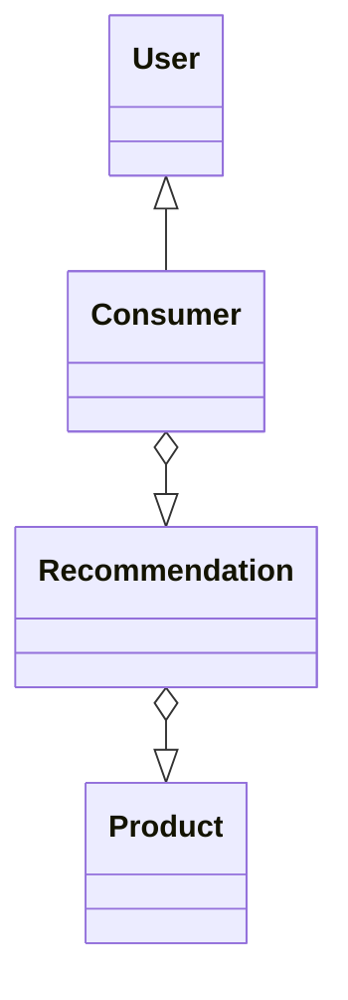

通过这些图表，我们可以更清晰地看到大数据和人工智能在共享经济中的应用，以及它们如何提升共享经济的效率和服务质量。

### 5.2 区块链技术在共享经济中的作用

区块链技术作为一种分布式账本技术，在共享经济中发挥了重要作用，特别是在提高透明度、降低交易成本和保障数据安全性方面。

#### 5.2.1 区块链的基本原理

区块链是一种去中心化的数据库，通过分布式网络维护数据的一致性和安全性。区块链的核心特点是：

1. **去中心化**：区块链不需要中心化的机构进行管理，所有参与者都可以共同维护账本，提高了系统的透明度和抗攻击性。
2. **不可篡改**：区块链上的数据一旦被记录，就难以被篡改，保证了数据的可信性。
3. **智能合约**：区块链上的智能合约是一种自执行的合同，无需第三方中介，可以自动执行预设的条款。

#### 5.2.2 区块链在共享经济中的应用

区块链在共享经济中的应用主要体现在以下几个方面：

1. **去中心化交易**：区块链技术可以降低交易成本，提高交易效率。例如，在共享住宿平台中，区块链可以实现房东和租客的直接交易，省去中间环节。
2. **数据透明**：区块链技术可以确保交易数据的透明性，用户可以随时查看交易记录，提高信任度。例如，在共享单车平台中，区块链可以记录每辆单车的使用情况和维护记录。
3. **安全保障**：区块链技术通过加密算法和分布式网络，提高了数据的安全性，防止数据泄露和篡改。例如，在共享打车平台中，区块链可以保障用户隐私和数据安全。

### 图表支持

为了更直观地展示区块链技术在共享经济中的应用，我们可以借助以下图表：

#### 5.2.1 区块链在去中心化交易中的应用架构图

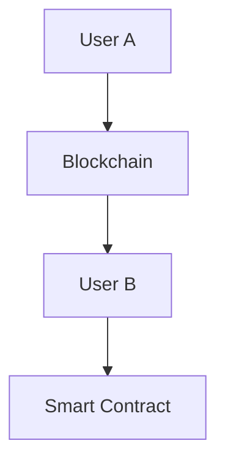

#### 5.2.2 区块链在数据透明中的应用流程图

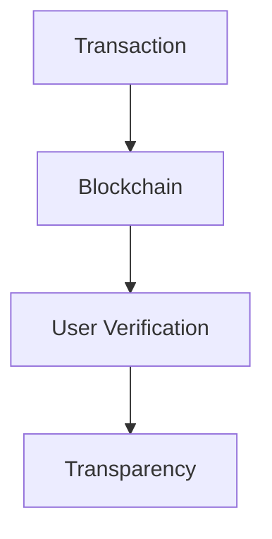

通过这些图表，我们可以更清晰地看到区块链技术在共享经济中的应用，以及它如何提高共享经济的透明度、降低交易成本和保障数据安全。

## 第六部分：法律与政策框架

### 6.1 共享经济法规的挑战与应对

共享经济的快速发展带来了诸多法律和监管挑战。传统法规和政策往往无法适应这一新兴经济模式，导致了一系列问题。以下是共享经济法规面临的主要挑战及应对措施：

#### 6.1.1 法律环境的变化

1. **监管空白**：共享经济在很多领域（如住宿、交通等）都是新兴行业，现有法规往往无法覆盖这些新出现的问题，导致监管空白。
2. **法规滞后**：传统法规的制定和修订过程较为缓慢，难以迅速应对共享经济带来的变化，导致法规滞后。
3. **跨领域监管**：共享经济涉及多个领域，如交通、住宿、金融等，如何实现跨领域监管，是政策制定者面临的一大挑战。

#### 6.1.2 应对措施

1. **立法完善**：各国政府纷纷加快共享经济相关立法，制定专门的法律和规章，以填补监管空白。例如，美国推出了《共享经济促进法案》，明确了共享经济的法律地位。
2. **政策试点**：通过政策试点，积累经验，逐步完善法规和政策。例如，中国的共享单车行业在多个城市进行试点，以探索合适的监管模式。
3. **跨部门协作**：建立跨部门协作机制，加强不同部门之间的沟通和协调，共同应对共享经济带来的监管挑战。

### 图表支持

为了更直观地展示共享经济法规的挑战与应对措施，我们可以借助以下图表：

#### 6.1.1 法律环境变化趋势图

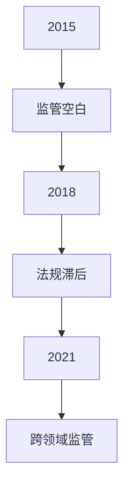

#### 6.1.2 应对措施对比图

| 应对措施       | 描述                                                         |
|----------------|--------------------------------------------------------------|
| 立法完善       | 加快共享经济相关立法，填补监管空白。                         |
| 政策试点       | 通过政策试点，积累经验，逐步完善法规和政策。                 |
| 跨部门协作     | 建立跨部门协作机制，加强不同部门之间的沟通和协调。           |

通过这些图表，我们可以更清晰地看到共享经济法规面临的挑战及应对措施，为未来的政策制定提供参考。

### 6.2 监管策略与实践

#### 6.2.1 监管的重要性

共享经济的监管对于保障市场秩序、维护消费者权益和促进行业健康发展至关重要。以下是共享经济监管的重要性：

1. **保障市场秩序**：通过监管，可以防止市场垄断、欺诈等行为，保障市场的公平竞争。
2. **维护消费者权益**：监管可以确保共享经济平台遵守相关法律法规，保障消费者的合法权益。
3. **促进行业健康发展**：合理的监管可以推动共享经济的规范发展，提高行业整体质量。

#### 6.2.2 国内外监管实践

1. **美国**：美国通过《共享经济促进法案》，明确了共享经济的法律地位，为各州制定具体法规提供了依据。此外，美国联邦贸易委员会（FTC）负责监督共享经济平台的合规情况。
2. **中国**：中国政府对共享经济持积极态度，通过政策试点和立法完善，逐步规范行业发展。例如，2017年颁布的《共享经济产业发展报告》明确了共享经济的发展方向和监管要求。
3. **欧洲**：欧洲各国普遍采取严格监管措施，确保共享经济平台遵守欧盟法规。例如，欧盟出台了一系列法规，如《通用数据保护条例》（GDPR），加强对用户数据的保护。

### 图表支持

为了更直观地展示国内外共享经济监管实践，我们可以借助以下图表：

#### 6.2.1 美国监管措施对比图

| 监管措施       | 描述                                                         |
|----------------|--------------------------------------------------------------|
| 《共享经济促进法案》 | 确定共享经济的法律地位，为各州制定具体法规提供依据。       |
| FTC监督       | 负责监督共享经济平台的合规情况。                           |

#### 6.2.2 中国监管措施对比图

| 监管措施       | 描述                                                         |
|----------------|--------------------------------------------------------------|
| 政策试点       | 通过政策试点，积累经验，逐步完善法规和政策。                 |
| 《共享经济产业发展报告》 | 明确共享经济的发展方向和监管要求。                         |

通过这些图表，我们可以更清晰地看到国内外共享经济监管的策略和实践，为未来监管提供参考。

## 第七部分：共享经济的未来展望

### 7.1 共享经济对社会的影响

共享经济作为新兴的经济模式，对社会产生了深远的影响，主要体现在经济层面和社会层面。

#### 7.1.1 经济层面

1. **促进资源高效利用**：共享经济通过共享闲置资源，提高了资源利用率，降低了使用成本。例如，共享单车和共享汽车减少了私家车的使用，提高了道路资源的利用效率。
2. **创造新的就业机会**：共享经济创造了大量新的就业机会，包括司机、房东、客服等。例如，滴滴出行为大量司机提供了工作机会，美团外卖为众多送餐员提供了就业机会。
3. **推动技术创新**：共享经济推动了大数据、人工智能、区块链等技术的创新应用，为经济发展注入新动力。例如，共享住宿平台通过大数据分析，优化用户匹配和房源管理。

#### 7.1.2 社会层面

1. **提高生活质量**：共享经济为消费者提供了更便捷、个性化的服务，提高了生活质量。例如，共享单车和共享汽车使得出行更加便捷，共享住宿平台提供了多样化的住宿选择。
2. **促进社会资源共享**：共享经济促进了社会资源的共享，有助于实现可持续发展。例如，共享办公空间使得创业者可以低成本地获得办公场所，共享健身房提高了健身资源的利用效率。
3. **改变消费观念**：共享经济倡导共享理念，改变了人们的消费观念，从拥有转向使用。例如，越来越多的人选择使用共享单车、共享汽车，而不是购买私家车。

### 图表支持

为了更直观地展示共享经济对社会的影响，我们可以借助以下图表：

#### 7.1.1 共享经济对经济层面影响图

| 影响层面       | 描述                                                         |
|----------------|--------------------------------------------------------------|
| 资源高效利用   | 提高闲置资源的利用率，降低使用成本。                       |
| 新就业机会     | 创造大量就业机会，提升就业率。                             |
| 技术创新       | 推动大数据、人工智能、区块链等技术的创新应用。             |

#### 7.1.2 共享经济对社会层面影响图

| 影响层面       | 描述                                                         |
|----------------|--------------------------------------------------------------|
| 生活质量       | 提供便捷、个性化的服务，提高生活质量。                     |
| 社会资源共享   | 促进社会资源的共享，实现可持续发展。                       |
| 消费观念改变   | 从拥有转向使用，倡导共享理念。                             |

通过这些图表，我们可以更清晰地看到共享经济对社会产生的积极影响，以及它对未来社会发展的重要意义。

### 7.2 共享经济的可持续发展

共享经济的可持续发展不仅是经济发展的需要，也是社会进步的必然要求。以下是实现共享经济可持续发展的几个关键路径：

#### 7.2.1 可持续发展的意义

1. **经济效益**：共享经济的可持续发展有助于提高资源利用率，降低成本，创造新的经济增长点。
2. **社会效益**：共享经济的可持续发展能够促进社会公平，提升社会整体福祉，实现可持续发展目标。
3. **环境效益**：共享经济的可持续发展有助于减少资源浪费，降低环境污染，保护生态环境。

#### 7.2.2 实践路径

1. **技术创新**：通过技术创新，提高共享经济的效率和可持续性。例如，大数据和人工智能技术可以优化资源匹配，提高服务效率；区块链技术可以提高交易透明度和数据安全性。
2. **政策支持**：政府应出台支持共享经济发展的政策，为共享经济的可持续发展提供制度保障。例如，提供税收优惠、补贴等政策，鼓励企业创新和发展。
3. **社会参与**：鼓励社会各界参与共享经济的可持续发展，共同推动社会进步。例如，通过教育和宣传，提高公众对共享经济的认识和支持；鼓励企业和个人积极参与社会责任，推动共享经济向更可持续的方向发展。
4. **环境友好**：注重环境保护，实现共享经济的绿色发展。例如，推广绿色共享出行工具，如电动汽车和自行车；提倡绿色共享住宿，减少能源消耗和环境污染。

### 图表支持

为了更直观地展示共享经济的可持续发展路径，我们可以借助以下图表：

#### 7.2.1 可持续发展路径图

| 路径         | 描述                                                         |
|--------------|--------------------------------------------------------------|
| 技术创新     | 提高共享经济的效率和可持续性。                               |
| 政策支持     | 为共享经济的可持续发展提供制度保障。                       |
| 社会参与     | 鼓励社会各界参与共享经济的可持续发展。                     |
| 环境友好     | 注重环境保护，实现共享经济的绿色发展。                     |

通过这些图表，我们可以更清晰地看到实现共享经济可持续发展的关键路径，以及这些路径如何共同推动共享经济的可持续发展。

## 结论

共享经济作为一种新兴的经济模式，通过技术驱动重新定义了所有权的意义，对社会产生了深远的影响。本文从共享经济的背景与起源、基本概念与模式、案例分析、行业趋势、技术探讨、法律与政策，以及未来展望等多个方面，系统地分析了共享经济的内涵和外在表现形式。共享经济不仅促进了资源的高效利用和优化配置，创造了新的就业机会，推动了技术创新，还提高了人们的生活质量，促进了社会公平和环境友好。

然而，共享经济在快速发展过程中也面临着一系列挑战，如法规与政策的不适应、隐私与安全问题、平台垄断风险等。针对这些挑战，我们需要通过技术创新、政策支持、社会参与等多种路径，实现共享经济的可持续发展。

未来，共享经济有望在更多领域得到应用，如知识共享、技能交换、绿色出行等。同时，随着大数据、人工智能、区块链等技术的进一步发展，共享经济将变得更加智能化和高效化。我们期待共享经济能够为人类社会的可持续发展贡献更多力量。

## 最佳实践 tips

为了更好地理解和应用共享经济，以下是一些最佳实践建议：

1. **用户教育**：加强对共享经济的宣传和教育，提高用户对共享经济模式的理解和接受度。
2. **平台合规**：共享经济平台应严格遵守相关法律法规，确保运营合规，提高用户信任度。
3. **技术创新**：鼓励技术创新，提高共享经济平台的效率和用户体验。
4. **风险管理**：建立健全的风险管理机制，防范潜在风险，确保共享经济的可持续发展。

## 小结

本文从多个角度详细探讨了共享经济的基本概念、发展历程、技术驱动、法律与政策，以及未来展望。通过系统的分析，我们认识到共享经济不仅带来了经济效益，还对社会产生了深远的影响。未来，共享经济有望在更多领域得到应用，为人类社会的可持续发展提供新的动力。

## 注意事项

在应用共享经济时，需要注意以下几个方面：

1. **合规运营**：遵守相关法律法规，确保平台运营合规，维护市场秩序。
2. **用户隐私**：保护用户隐私，防止数据泄露，提高用户信任度。
3. **风险管理**：建立健全的风险管理机制，防范潜在风险，确保共享经济的可持续发展。
4. **技术创新**：紧跟技术发展趋势，不断创新，提高共享经济平台的效率和用户体验。

## 拓展阅读

对于希望深入了解共享经济的读者，以下是一些推荐的拓展阅读资源：

1. 《共享经济：重新定义所有权的意义》
2. 《共享经济：如何通过协作消费实现共赢》
3. 《共享经济时代的商业模式创新》
4. 《共享经济的法律与政策研究》
5. 《共享经济与可持续发展：国际经验与启示》

作者：AI天才研究院/AI Genius Institute & 禅与计算机程序设计艺术 /Zen And The Art of Computer Programming。

