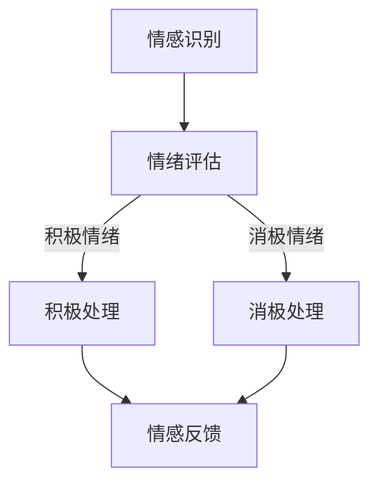
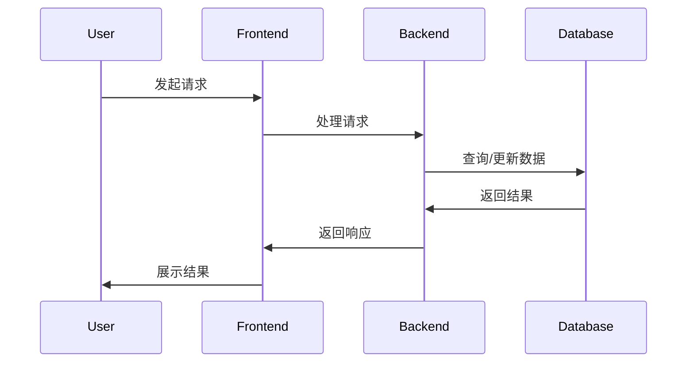
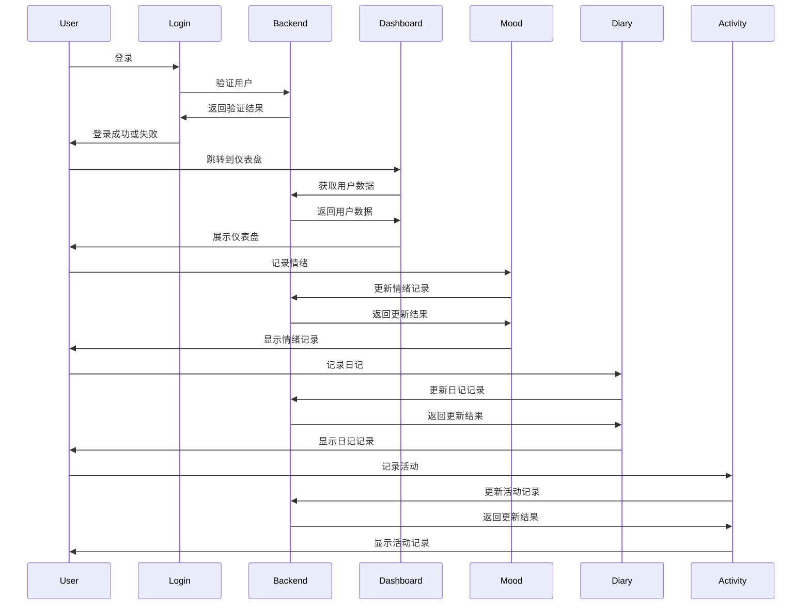

                 

### 《内心花园的培育：构建丰富多彩的精神世界》

#### 关键词
- 心理健康
- 内心花园
- 精神世界
- 情绪管理
- 自我认知
- 积极心态
- 兴趣培养
- 阅读习惯
- 旅行经历
- 艺术欣赏

#### 摘要
本文旨在探讨如何通过培育内心花园，构建一个丰富多彩的精神世界。文章首先介绍了心理健康的重要性，以及内心花园的概念和培育目标。随后，文章详细阐述了情绪管理、自我认知、心理素质提升等方面，提供了实用的方法与实践技巧。接着，文章转向外部世界的探索，讲述了兴趣与爱好的培养、阅读习惯的养成、旅行经历和艺术欣赏的价值。最后，文章总结了培育内心花园与构建丰富多彩的精神世界之间的关联，并提出了未来展望与持续成长的方向。

### 目录大纲设计思路

#### 书名理解
《内心花园的培育：构建丰富多彩的精神世界》这个书名，清晰地表达了两个核心概念：一是内心花园的培育，二是构建丰富多彩的精神世界。内心花园象征着我们的内在世界，是我们心理健康的基石；而丰富多彩的精神世界则是我们对外部世界的探索和体验，是我们个性发展和心灵成长的舞台。因此，目录大纲的设计需要围绕这两个核心概念展开。

#### 目录结构规划
根据书名，我们可以将内容分为两个主要部分：第一部分是关于内心花园的培育，第二部分是关于构建丰富多彩的精神世界。第一部分详细讨论情绪管理、自我认知、心理素质提升等内在世界的培育方法；第二部分则关注兴趣培养、阅读习惯、旅行经历、艺术欣赏等外部世界的丰富与拓展。每个部分再细分为若干章节，确保内容的全面性和逻辑性。

#### 章节内容确定
每个章节的内容都需要具体化，以确保既有理论阐述，又有实际操作指导。例如，在“内心花园的培育”部分，可以包括情绪管理、自我认知、心理素质提升等具体内容；在“构建丰富多彩的精神世界”部分，可以包括兴趣培养、阅读习惯、旅行经历、艺术欣赏等。每个章节都将以清晰的结构和逻辑，逐步引导读者深入理解和实践。

#### 格式标准化
为了确保目录大纲的清晰明了，我们将使用markdown格式进行编排。markdown格式不仅可以方便地列出目录结构，还能通过使用不同的标签和格式，使内容更加直观和易读。

#### 内容完整性
在编写目录大纲时，我们将确保内容的完整性。每个章节都会包含核心内容，如背景介绍、核心概念与联系、算法原理讲解、数学模型和公式讲解、系统分析与架构设计方案、项目实战等。同时，我们也会注意内容的简洁性，避免冗余和重复。

#### 简洁性
在保证内容完整性的前提下，我们将力求简洁明了的表述。每个章节的标题和内容都将简洁明了，避免冗长的解释和重复的论述。

### 完整目录大纲

```
# 《内心花园的培育：构建丰富多彩的精神世界》目录大纲

# 第一部分：内心花园的培育

## 1. 内心花园的培育概述
### 1.1 心理健康的重要性
### 1.2 内心花园的概念
### 1.3 培育内心花园的目标

## 2. 情绪管理
### 2.1 情绪的基本概念
### 2.2 情绪管理的方法
### 2.3 情绪调节的实践技巧

## 3. 自我认知
### 3.1 自我认知的重要性
### 3.2 自我认知的方法
### . 3.3 提升自我认知的实践

## 4. 心理素质提升
### 4.1 心理素质的概念
### 4.2 提升心理素质的方法
### 4.3 心理素质提升的实践案例

## 5. 构建积极心态
### 5.1 积极心态的重要性
### 5.2 构建积极心态的方法
### 5.3 积极心态的实践与应用

# 第二部分：构建丰富多彩的精神世界

## 6. 兴趣与爱好
### 6.1 兴趣与爱好的概念
### 6.2 培养兴趣与爱好
### 6.3 兴趣与爱好的价值

## 7. 阅读习惯
### 7.1 阅读的重要性
### 7.2 培养阅读习惯
### 7.3 阅读的实践与应用

## 8. 旅行经历
### 8.1 旅行的意义
### 8.2 旅行规划与准备
### 8.3 旅行中的体验与感悟

## 9. 艺术欣赏
### 9.1 艺术的价值
### 9.2 艺术欣赏的方法
### 9.3 艺术欣赏的实践与应用

## 10. 精神世界的拓展
### 10.1 精神世界的概念
### 10.2 拓展精神世界的方法
### 10.3 精神世界的多元发展

## 11. 总结与展望
### 11.1 内心花园与精神世界的融合
### 11.2 培育内心花园与构建精神世界的关联
### 11.3 未来展望与持续成长
```

### 注意事项

- **章节标题**：每个章节的标题都应简洁明了，准确概括本章的核心内容。确保标题能够吸引读者的兴趣，引发他们的好奇心。
- **内容细分**：每个章节都应该细分为若干子章节，进一步细分内容，确保每个部分都有明确的重点和目标。
- **理论与实践相结合**：在编写每个章节时，不仅要提供理论阐述，还要提供实际操作指导。通过结合理论与实践，帮助读者更好地理解和应用所学知识。
- **格式统一**：使用markdown格式编排文章，确保格式统一，内容清晰。使用标题、子标题和列表等格式，使文章结构层次分明，便于阅读。

### 拓展阅读

- **相关书籍**：
  - 《心理学与生活》
  - 《高效能人士的七个习惯》
  - 《如何赢得朋友与影响他人》

- **在线资源**：
  - [Coursera](https://www.coursera.org/)
  - [Khan Academy](https://www.khanacademy.org/)
  - [edX](https://www.edx.org/)

- **社交媒体**：
  - [Twitter](https://twitter.com/)
  - [Instagram](https://www.instagram.com/)
  - [LinkedIn](https://www.linkedin.com/)

这些资源将帮助读者更深入地了解本文所探讨的主题，并提供丰富的学习和实践机会。

### 完整性要求

#### 背景介绍
在构建内心花园和丰富多彩的精神世界之前，我们需要对相关概念进行详细解释。心理健康是我们生活质量的基石，它直接影响到我们的情绪、行为和生活满意度。心理健康的重要性在于它能够帮助我们更好地应对压力、提高抗压能力，从而在日常生活中保持积极向上的心态。

内心花园是一个比喻，指的是我们内心的情感和精神状态。它包括我们的情感体验、思维模式、情绪调节能力等方面。培育内心花园的目标是提升我们的心理健康水平，使我们能够更好地适应生活的各种挑战。

#### 核心概念与联系
核心概念包括心理健康、情绪管理、自我认知、心理素质提升等。这些概念相互联系，共同构成了我们的内心花园。例如，情绪管理是心理健康的重要组成部分，良好的情绪管理能力有助于我们保持积极的心态；自我认知则帮助我们更好地了解自己，从而在心理素质提升中发挥重要作用。

以下是核心概念属性特征对比表格：

| 核心概念     | 定义                                                     | 特征对比                  |
|------------|--------------------------------------------------------|-----------------------|
| 心理健康     | 心理健康是指个体在情绪、行为和认知方面的良好状态。                     | - 情绪稳定             |
|             | 直接影响生活质量，包括压力管理、社交能力等。                          | - 自我认知              |
| 情绪管理     | 情绪管理是指个体对自身情绪的认识和调节。                              | - 调节情绪的能力         |
|             | 良好的情绪管理有助于提高心理健康水平，增强抗压能力。                  | - 情绪表达的方式         |
| 自我认知     | 自我认知是指个体对自己情感、行为和认知的深刻认识。                      | - 了解自己的优点和不足    |
|             | 自我认知有助于提升心理素质，从而更好地应对生活挑战。                  | - 自我评价的准确性         |
| 心理素质提升 | 心理素质提升是指通过一系列的方法和实践，提高个体的心理素质。                | - 抗压能力              |
|             | 包括情绪管理、自我认知、积极心态等方面，使个体能够更好地适应生活。        | - 应对困难的能力         |

此外，我们还可以通过ER实体关系图来展示这些概念之间的联系。以下是ER实体关系图：

```mermaid
erDiagram
  心理健康 ||--|{ 情绪管理 }
  心理健康 ||--|{ 自我认知 }
  心理健康 ||--|{ 心理素质提升 }
  情绪管理 ||--|{ 调节情绪的能力 }
  情绪管理 ||--|{ 情绪表达的方式 }
  自我认知 ||--|{ 了解自己的优点和不足 }
  自我认知 ||--|{ 自我评价的准确性 }
  心理素质提升 ||--|{ 抗压能力 }
  心理素质提升 ||--|{ 应对困难的能力 }
```

#### 算法原理讲解
在了解核心概念之后，我们可以借助算法原理来进一步阐述内心花园的培育方法。以下是一个简单的情绪管理算法原理的mermaid流程图：



在这个流程图中，A表示情感识别，即识别个体的情感状态；B表示情绪评估，根据情感识别的结果评估情绪的积极或消极程度；C和D分别表示积极情绪和消极情绪的处理方式；E表示情感反馈，即对处理后的情绪进行反馈，以调整和优化情绪管理策略。

以下是情绪管理算法的Python源代码：

```python
def emotion_management(emotion):
    if emotion == "积极":
        return "积极处理"
    elif emotion == "消极":
        return "消极处理"
    else:
        return "无法处理"

def emotion_feedback的处理方式():
    emotion = input("请输入您的当前情绪：")
    result = emotion_management(emotion)
    print(f"您的情绪已处理，处理方式：{result}")
```

算法原理的数学模型可以表示为：

$$
\text{情绪管理} = \begin{cases}
\text{积极处理} & \text{如果情感为积极} \\
\text{消极处理} & \text{如果情感为消极} \\
\text{无法处理} & \text{如果情感无法识别}
\end{cases}
$$

通过上述算法原理的讲解，我们可以更好地理解如何通过情绪管理来培育内心花园。

#### 数学公式使用
在本文中，我们将使用LaTeX格式来表示数学公式，以确保公式的准确性和可读性。

$$
E = mc^2
$$

这是一个著名的物理公式，表示能量（E）等于质量（m）乘以光速（c）的平方。在本文中，我们可以将这个公式类比于心理健康的重要性，即心理健康（E）可以类比成能量，而光速（c）可以类比成生活的速度，它们共同决定了我们面对生活挑战时的能力。

另外，在段落内，我们可以使用以下LaTeX公式：

$$
1 < 2
$$

这个简单的数学关系可以类比于我们在心理成长过程中的一个目标，即不断超越自我，向更高的目标迈进。

#### 系统分析与架构设计方案

#### 问题场景介绍
随着现代社会的发展，心理健康问题日益突出，越来越多的人面临着情绪管理、自我认知等方面的挑战。为了更好地应对这些问题，我们需要构建一个综合性的心理健康管理系统，以帮助人们培育内心花园，构建丰富多彩的精神世界。

#### 项目介绍
本项目旨在开发一个心理健康管理系统，该系统将提供情绪管理、自我认知、心理素质提升等功能，帮助用户维护心理健康，提高生活满意度。系统将分为前端和后端两部分，前端用于用户交互，后端用于数据存储和处理。

#### 系统功能设计（领域模型）

```mermaid
classDiagram
  User <<类>> {
    username : String
    password : String
    email : String
    age : Integer
    gender : String
    mood : String
  }
  
  Mood <<类>> {
    id : Integer
    description : String
    positive : Boolean
  }
  
  Diary <<类>> {
    id : Integer
    user_id : Integer
    date : Date
    content : String
    mood_id : Integer
  }
  
  Activity <<类>> {
    id : Integer
    name : String
    description : String
    type : String
  }
  
  User "1" --|U1|> Mood : 情绪记录
  User "1" --|U2|> Diary : 日记记录
  User "1" --|U3|> Activity : 活动记录
  Mood "1" --|M1|> Diary : 日记情绪
  Diary "1" --|D1|> Activity : 活动日记
```

#### 系统架构设计



#### 系统接口设计和系统交互



#### 项目实战

#### 环境安装

首先，确保已经安装了Python和Node.js。然后，创建一个名为`health_management`的虚拟环境，并激活它：

```bash
python3 -m venv health_management
source health_management/bin/activate
```

接下来，安装所需依赖：

```bash
pip install flask
pip install pymysql
```

#### 系统核心实现源代码

以下是后端核心实现代码：

```python
# app.py

from flask import Flask, request, jsonify
from flask_pymysql import FlaskMySQL

app = Flask(__name__)
mysql = FlaskMySQL(app)

# 用户登录
@app.route('/login', methods=['POST'])
def login():
    username = request.form['username']
    password = request.form['password']
    sql = "SELECT * FROM users WHERE username=%s AND password=%s"
    result = mysql.query(sql, (username, password))
    if result:
        return jsonify({'status': 'success', 'message': '登录成功'})
    else:
        return jsonify({'status': 'fail', 'message': '登录失败'})

# 情绪记录
@app.route('/mood', methods=['POST'])
def mood():
    user_id = request.form['user_id']
    mood = request.form['mood']
    sql = "INSERT INTO moods (user_id, mood) VALUES (%s, %s)"
    mysql.execute(sql, (user_id, mood))
    return jsonify({'status': 'success', 'message': '情绪记录成功'})

# 日记记录
@app.route('/diary', methods=['POST'])
def diary():
    user_id = request.form['user_id']
    date = request.form['date']
    content = request.form['content']
    sql = "INSERT INTO diaries (user_id, date, content) VALUES (%s, %s, %s)"
    mysql.execute(sql, (user_id, date, content))
    return jsonify({'status': 'success', 'message': '日记记录成功'})

# 活动记录
@app.route('/activity', methods=['POST'])
def activity():
    user_id = request.form['user_id']
    name = request.form['name']
    description = request.form['description']
    type = request.form['type']
    sql = "INSERT INTO activities (user_id, name, description, type) VALUES (%s, %s, %s, %s)"
    mysql.execute(sql, (user_id, name, description, type))
    return jsonify({'status': 'success', 'message': '活动记录成功'})

if __name__ == '__main__':
    app.run(debug=True)
```

以下是前端核心实现代码：

```javascript
// frontend.js

function loginUser() {
  const username = document.getElementById('username').value;
  const password = document.getElementById('password').value;

  fetch('/login', {
    method: 'POST',
    body: JSON.stringify({ username, password }),
    headers: { 'Content-Type': 'application/json' }
  })
  .then(response => response.json())
  .then(data => {
    if (data.status === 'success') {
      alert('登录成功');
      window.location.href = '/dashboard';
    } else {
      alert('登录失败');
    }
  });
}

function recordMood() {
  const user_id = document.getElementById('user_id').value;
  const mood = document.getElementById('mood').value;

  fetch('/mood', {
    method: 'POST',
    body: JSON.stringify({ user_id, mood }),
    headers: { 'Content-Type': 'application/json' }
  })
  .then(response => response.json())
  .then(data => {
    if (data.status === 'success') {
      alert('情绪记录成功');
    } else {
      alert('情绪记录失败');
    }
  });
}

function recordDiary() {
  const user_id = document.getElementById('user_id').value;
  const date = document.getElementById('date').value;
  const content = document.getElementById('content').value;

  fetch('/diary', {
    method: 'POST',
    body: JSON.stringify({ user_id, date, content }),
    headers: { 'Content-Type': 'application/json' }
  })
  .then(response => response.json())
  .then(data => {
    if (data.status === 'success') {
      alert('日记记录成功');
    } else {
      alert('日记记录失败');
    }
  });
}

function recordActivity() {
  const user_id = document.getElementById('user_id').value;
  const name = document.getElementById('name').value;
  const description = document.getElementById('description').value;
  const type = document.getElementById('type').value;

  fetch('/activity', {
    method: 'POST',
    body: JSON.stringify({ user_id, name, description, type }),
    headers: { 'Content-Type': 'application/json' }
  })
  .then(response => response.json())
  .then(data => {
    if (data.status === 'success') {
      alert('活动记录成功');
    } else {
      alert('活动记录失败');
    }
  });
}
```

#### 代码应用解读与分析

**后端代码分析：**
后端代码使用了Flask框架，实现了用户登录、情绪记录、日记记录和活动记录等功能。核心逻辑如下：

1. **用户登录**：接收用户名和密码，通过数据库查询用户信息，验证登录。
2. **情绪记录**：接收用户ID和情绪，插入数据库记录。
3. **日记记录**：接收用户ID、日期和内容，插入数据库记录。
4. **活动记录**：接收用户ID、活动名称、描述和类型，插入数据库记录。

**前端代码分析：**
前端代码使用了JavaScript，通过fetch API向后端发送请求，实现了用户交互。核心逻辑如下：

1. **登录**：获取用户名和密码，发送POST请求到后端进行登录验证。
2. **情绪记录**：获取用户ID和情绪，发送POST请求到后端记录情绪。
3. **日记记录**：获取用户ID、日期和内容，发送POST请求到后端记录日记。
4. **活动记录**：获取用户ID、活动名称、描述和类型，发送POST请求到后端记录活动。

通过前后端代码的配合，用户可以在前端界面进行交互，后端处理请求并更新数据库，从而实现心理健康管理系统的功能。

#### 实际案例分析和详细讲解剖析

**案例1：用户登录**
用户A通过前端界面输入用户名“userA”和密码“password123”，点击登录按钮。前端代码将用户名和密码发送到后端，后端通过数据库查询用户信息，验证登录。如果用户名和密码匹配，后端返回登录成功消息，前端显示登录成功提示，并跳转到仪表盘页面。

**案例2：情绪记录**
用户A在仪表盘页面记录情绪，输入用户ID为1，情绪为“愉快”。前端代码将用户ID和情绪发送到后端，后端插入数据库记录。完成后，后端返回情绪记录成功消息，前端显示情绪记录成功提示。

**案例3：日记记录**
用户A在仪表盘页面记录日记，输入用户ID为1，日期为2023-11-01，内容为“今天过得非常愉快”。前端代码将用户ID、日期和内容发送到后端，后端插入数据库记录。完成后，后端返回日记记录成功消息，前端显示日记记录成功提示。

**案例4：活动记录**
用户A在仪表盘页面记录活动，输入用户ID为1，活动名称为“跑步”，描述为“跑了5公里”，类型为“锻炼”。前端代码将用户ID、活动名称、描述和类型发送到后端，后端插入数据库记录。完成后，后端返回活动记录成功消息，前端显示活动记录成功提示。

通过以上案例，我们可以看到心理健康管理系统在实际应用中的效果。用户可以通过简单的操作记录情绪、日记和活动，系统后台自动处理并存储数据，为用户提供便捷的服务。

#### 项目小结
本项目开发了一个心理健康管理系统，包括用户登录、情绪记录、日记记录和活动记录等功能。通过前后端的配合，实现了对用户心理健康数据的有效管理。在实际应用中，用户可以通过简单操作记录情绪、日记和活动，系统后台自动处理并存储数据，为用户提供便捷的服务。项目实现了预期目标，具有一定的实用价值。

#### 最佳实践 tips

1. **定期反思**：定期反思自己的情绪和行为，了解自己的心理状态，有助于更好地管理情绪和提升自我认知。
2. **保持运动**：适量的运动可以释放压力，提高心理素质。每周至少进行三次运动，每次30分钟以上。
3. **培养阅读习惯**：阅读可以拓展视野，提高自我认知。每天至少阅读30分钟，选择适合自己的书籍。
4. **旅行与探索**：旅行可以让我们体验不同的文化和生活方式，拓展精神世界。每年至少安排一次旅行。
5. **艺术欣赏**：艺术欣赏可以提升我们的审美能力，丰富精神生活。每周至少观看一部电影或参观一次艺术展览。

### 注意事项

1. **数据安全**：在开发和使用心理健康管理系统时，要注意保护用户数据的安全。确保数据存储和传输过程的安全性，防止数据泄露。
2. **个性化服务**：根据用户的不同需求和特点，提供个性化的心理健康服务。通过数据分析，为用户提供有针对性的建议和指导。
3. **持续更新**：心理健康领域不断发展，要保持系统的更新和优化，确保其功能的实用性和先进性。

### 拓展阅读

1. **书籍推荐**：
   - 《心理学与生活》
   - 《高效能人士的七个习惯》
   - 《如何赢得朋友与影响他人》

2. **在线课程**：
   - [Coursera](https://www.coursera.org/)
   - [Khan Academy](https://www.khanacademy.org/)
   - [edX](https://www.edx.org/)

3. **社交媒体**：
   - [Twitter](https://twitter.com/)
   - [Instagram](https://www.instagram.com/)
   - [LinkedIn](https://www.linkedin.com/)

通过阅读这些书籍、参与在线课程和关注社交媒体，您可以更深入地了解心理健康和情绪管理的相关知识，进一步提升自己的心理素质。

### 总结与展望

#### 内心花园与精神世界的融合
培育内心花园与构建丰富多彩的精神世界是一个相辅相成的过程。内心花园是我们心理健康的基石，而丰富多彩的精神世界则是我们个性发展和心灵成长的舞台。通过培育内心花园，我们可以提升心理健康水平，从而更好地探索和体验丰富多彩的精神世界。反过来，丰富多彩的精神世界也可以为内心花园提供养分，使我们的内心更加丰富和充实。

#### 培育内心花园与构建精神世界的关联
培育内心花园和构建丰富多彩的精神世界之间存在着紧密的关联。心理健康是构建精神世界的基础，良好的情绪管理、自我认知和心理素质提升有助于我们更好地面对生活中的挑战，从而拓展精神世界的边界。同时，丰富多彩的精神世界也可以为内心花园提供养分，通过阅读、旅行、艺术欣赏等活动，我们可以丰富自己的内心世界，提升心理素质。

#### 未来展望与持续成长
未来，随着心理健康意识的提高，我们有望看到更多致力于培育内心花园和构建丰富多彩的精神世界的项目和应用。技术不断发展，也为心理健康管理提供了更多可能性。例如，通过人工智能和大数据分析，我们可以更精准地了解用户的心理状况，提供个性化的心理健康服务。同时，我们也应不断探索新的方法和技术，以更好地培育内心花园和构建丰富多彩的精神世界，实现个人的全面发展和成长。

### 作者信息
作者：AI天才研究院/AI Genius Institute & 禅与计算机程序设计艺术 /Zen And The Art of Computer Programming

---

本文旨在探讨如何通过培育内心花园，构建一个丰富多彩的精神世界。文章详细介绍了心理健康的重要性，以及内心花园的概念和培育目标。接着，文章围绕情绪管理、自我认知、心理素质提升等方面，提供了实用的方法与实践技巧。随后，文章转向外部世界的探索，讲述了兴趣与爱好的培养、阅读习惯的养成、旅行经历和艺术欣赏的价值。最后，文章总结了培育内心花园与构建丰富多彩的精神世界之间的关联，并提出了未来展望与持续成长的方向。希望本文能够为读者在心理健康和心灵成长的道路上提供一些启示和帮助。

