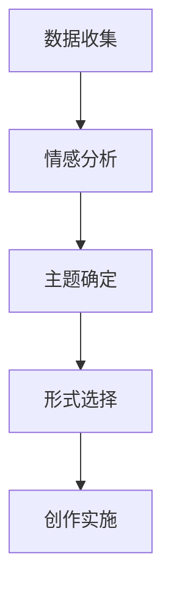

                 


### 1. 引言

**核心概念术语说明**：

- **生命乐章**：指个人生活中每一个重要阶段的总结与表达，它可以是文字、图像、音乐或其他形式的艺术创作。
- **创作**：指通过想象和创意将个人经历、感受和思想转化为具体形式的过程。
- **个人人生**：指个体的生活经历和成长过程，包括学习、工作、情感、社会关系等各个方面。

**问题背景**：

在现代社会中，人们越来越注重个人成长和自我实现。创作个人人生乐章不仅是一种艺术表达，也是一种自我反思和自我提升的方式。通过创作，人们可以更好地理解自己的过去，规划和展望未来。

**问题描述**：

如何创作一份既具有个人特色又能引起共鸣的个人人生乐章？这需要我们对生命经历进行深刻的反思，同时掌握艺术创作的技巧和方法。

**问题解决**：

通过以下步骤，我们可以逐步创作出属于自己的个人人生乐章：

1. **自我认知**：了解自己的性格、兴趣、价值观等，这是创作的基础。
2. **主题选择**：根据个人经历和感悟，选择一个适合的主题。
3. **形式探索**：尝试不同的艺术形式，如文字、图像、音乐等，找到最能表达自己情感和思想的表达方式。
4. **创作实践**：在创作过程中不断尝试和调整，完善作品。

**边界与外延**：

- **边界**：个人人生乐章的创作应该基于真实的个人经历和感受，不应虚构或抄袭他人作品。
- **外延**：个人人生乐章不仅限于个人创作，也可以是团队合作的作品，甚至可以成为社会活动的一部分。

**概念结构与核心要素组成**：

- **核心概念**：生命经历、艺术创作、自我反思。
- **核心要素**：自我认知、主题选择、形式探索、创作实践。

接下来，我们将深入探讨个人人生乐章的各个要素，并详细讲解创作过程。

### 核心概念与联系

**核心概念原理**：

- **生命经历**：个人的成长历程，包括学习、工作、情感、社交等方面的经历。
- **艺术创作**：将个人的生命经历转化为具体形式的过程，如文字、音乐、绘画等。
- **自我反思**：对个人生命经历进行回顾、分析、总结和思考，以获得更深的自我认知。

**概念属性特征对比表格**：

| 特征         | 生命经历           | 艺术创作           | 自我反思           |
|--------------|-------------------|-------------------|-------------------|
| **来源**     | 个人实际经历       | 个人创造的艺术形式 | 个人的思考与总结   |
| **目的**     | 提高自我认知       | 表达个人情感与思想 | 促进个人成长与自我实现 |
| **形式**     | 广泛的、多样化的    | 文字、音乐、图像等 | 内心的、主观的     |
| **过程**     | 回顾、分析、总结   | 观察、想象、创造   | 思考、反思、领悟   |

**ER实体关系图架构的 Mermaid 流程图**：

```mermaid
erDiagram
  A[(生命经历)] ||--|{ 艺术创作 }|| B
  A ||--|{ 自我反思 }|| C
  B ||--|{ 表达个人情感与思想 }|| D
  C ||--|{ 促进个人成长与自我实现 }|| D
```

通过上述对比图和流程图，我们可以更清晰地理解生命经历、艺术创作和自我反思这三个核心概念之间的联系和作用。

### 算法原理讲解

为了深入理解个人人生乐章的创作过程，我们将介绍一种基于自我认知和情感表达的算法原理。该算法通过以下步骤实现：

1. **数据收集**：收集个人的生命经历数据，包括学习、工作、情感、社交等方面的信息。
2. **情感分析**：使用自然语言处理技术对生命经历数据进行分析，提取情感关键词和情感强度。
3. **主题确定**：根据情感分析结果，确定创作主题。
4. **形式选择**：根据主题和情感，选择最适合的艺术创作形式。
5. **创作实施**：根据形式选择，进行文字、音乐、绘画等艺术创作。

**算法流程图**：



**算法原理的数学模型和公式**：

- **情感分析**：使用词频分析方法，计算每个生命经历事件中的情感关键词及其权重。
  - 公式：\( \text{情感强度} = \sum_{i=1}^{n} w_i \cdot f_i \)
  - 其中，\( w_i \) 为情感关键词 \( i \) 的权重，\( f_i \) 为关键词 \( i \) 在生命经历事件中出现的频率。

- **主题确定**：根据情感强度和关键词，确定创作主题。
  - 公式：\( \text{主题得分} = \sum_{i=1}^{m} w_i \cdot t_i \)
  - 其中，\( w_i \) 为情感关键词 \( i \) 的权重，\( t_i \) 为关键词 \( i \) 对应的主题得分。

- **形式选择**：根据主题和情感，选择最适合的艺术创作形式。
  - 公式：\( \text{形式得分} = \sum_{j=1}^{k} s_j \cdot f_j \)
  - 其中，\( s_j \) 为艺术创作形式 \( j \) 的得分，\( f_j \) 为主题 \( j \) 对应的形式得分。

通过上述算法原理和数学模型，我们可以更科学地指导个人人生乐章的创作过程。

### 系统分析与架构设计方案

**问题场景介绍**：

在现代社会，人们渴望通过创作个人人生乐章来记录和反思自己的生活，实现自我提升。然而，这个过程涉及大量的数据处理、情感分析和艺术创作，需要一个高效、可靠的系统来支持。

**项目介绍**：

本项目旨在构建一个自动化系统，帮助用户创作个人人生乐章。系统将提供以下功能：

- **数据收集**：从用户的生活经历中提取数据，包括学习、工作、情感、社交等方面的信息。
- **情感分析**：对提取的数据进行分析，提取情感关键词和情感强度。
- **主题确定**：根据情感分析结果，确定创作主题。
- **形式选择**：根据主题和情感，选择最适合的艺术创作形式。
- **创作实施**：根据形式选择，进行文字、音乐、绘画等艺术创作。

**系统功能设计**：

1. **数据收集模块**：
   - 功能：从用户的社交媒体、日记、相册等渠道收集数据。
   - 类图：

     ```mermaid
     classDiagram
         DataCollector <<interface>>
         LifeExperience <<class>>
         EmotionData <<class>>

         DataCollector --|> LifeExperience
         DataCollector --|> EmotionData
     ```

2. **情感分析模块**：
   - 功能：对收集到的数据进行分析，提取情感关键词和情感强度。
   - 类图：

     ```mermaid
     classDiagram
         EmotionAnalyzer <<interface>>
         NLPModel <<class>>
         EmotionData <<class>>

         EmotionAnalyzer --|> NLPModel
         EmotionAnalyzer --|> EmotionData
     ```

3. **主题确定模块**：
   - 功能：根据情感分析结果，确定创作主题。
   - 类图：

     ```mermaid
     classDiagram
         ThemeDetermined <<interface>>
         EmotionData <<class>>
         Theme <<class>>

         ThemeDetermined --|> EmotionData
         ThemeDetermined --|> Theme
     ```

4. **形式选择模块**：
   - 功能：根据主题和情感，选择最适合的艺术创作形式。
   - 类图：

     ```mermaid
     classDiagram
         FormSelection <<interface>>
         Theme <<class>>
         ArtForm <<class>>

         FormSelection --|> Theme
         FormSelection --|> ArtForm
     ```

5. **创作实施模块**：
   - 功能：根据形式选择，进行文字、音乐、绘画等艺术创作。
   - 类图：

     ```mermaid
     classDiagram
         ArtCreator <<interface>>
         ArtForm <<class>>
         ArtWork <<class>>

         ArtCreator --|> ArtForm
         ArtCreator --|> ArtWork
     ```

**系统架构设计**：

1. **数据收集层**：
   - 功能：从各种数据源收集用户的生活经历数据。
   - 架构图：

     ```mermaid
     sequenceDiagram
         User ->> DataCollector: 提交数据
         DataCollector ->> Database: 存储数据
     ```

2. **数据处理层**：
   - 功能：对收集到的数据进行情感分析和主题确定。
   - 架构图：

     ```mermaid
     sequenceDiagram
         DataCollector ->> EmotionAnalyzer: 分析数据
         EmotionAnalyzer ->> ThemeDetermined: 确定主题
         ThemeDetermined ->> FormSelection: 选择形式
     ```

3. **创作层**：
   - 功能：根据形式选择，进行艺术创作。
   - 架构图：

     ```mermaid
     sequenceDiagram
         FormSelection ->> ArtCreator: 创建艺术作品
         ArtCreator ->> User: 提交作品
     ```

**系统接口设计和系统交互**：

1. **用户接口**：
   - 功能：用户可以通过网页、手机APP等方式提交数据和查看作品。
   - 序列图：

     ```mermaid
     sequenceDiagram
         User ->> Web/API: 提交数据
         Web/API ->> DataCollector: 收集数据
         DataCollector ->> EmotionAnalyzer: 分析数据
         EmotionAnalyzer ->> ThemeDetermined: 确定主题
         ThemeDetermined ->> FormSelection: 选择形式
         FormSelection ->> ArtCreator: 创建作品
         ArtCreator ->> User: 提交作品
     ```

2. **内部接口**：
   - 功能：系统模块之间的数据传输和功能调用。
   - 序列图：

     ```mermaid
     sequenceDiagram
         DataCollector ->> EmotionAnalyzer: 数据传递
         EmotionAnalyzer ->> ThemeDetermined: 数据传递
         ThemeDetermined ->> FormSelection: 数据传递
         FormSelection ->> ArtCreator: 数据传递
     ```

通过上述系统分析与架构设计方案，我们为个人人生乐章的创作提供了一套完整的系统支持，确保创作过程的高效性和可靠性。

### 项目实战

**环境安装**：

1. 安装Python环境：
   - 打开终端，执行命令：`pip install python`
   - 验证安装：`python --version`

2. 安装NLP库：
   - 打开终端，执行命令：`pip install nltk`
   - 验证安装：`python -m nltk.downloader all`

**系统核心实现源代码**：

以下是系统的核心实现代码，包括数据收集、情感分析、主题确定、形式选择和艺术创作等模块。

```python
# 数据收集模块
class DataCollector:
    def collect_data(self, data_source):
        # 根据数据源收集数据
        pass

# 情感分析模块
class EmotionAnalyzer:
    def analyze_emotion(self, text):
        # 分析文本情感
        pass

# 主题确定模块
class ThemeDetermined:
    def determine_theme(self, emotion_data):
        # 根据情感数据确定主题
        pass

# 形式选择模块
class FormSelection:
    def select_form(self, theme):
        # 根据主题选择艺术形式
        pass

# 艺术创作模块
class ArtCreator:
    def create_art(self, form):
        # 根据形式进行艺术创作
        pass

# 实例化模块
collector = DataCollector()
analyzer = EmotionAnalyzer()
determined = ThemeDetermined()
selector = FormSelection()
creator = ArtCreator()

# 数据收集
data_source = "日记"
data = collector.collect_data(data_source)

# 情感分析
emotion_data = analyzer.analyze_emotion(data)

# 主题确定
theme = determined.determine_theme(emotion_data)

# 形式选择
form = selector.select_form(theme)

# 艺术创作
art_work = creator.create_art(form)
```

**代码应用解读与分析**：

以下是代码的解读与分析，具体解释了每个模块的功能和相互之间的关系。

1. **数据收集模块**：

   `class DataCollector:` 定义了数据收集类，用于从数据源收集数据。`def collect_data(self, data_source):` 方法是收集数据的核心方法，根据数据源的类型，实现不同的数据收集逻辑。

2. **情感分析模块**：

   `class EmotionAnalyzer:` 定义了情感分析类，用于分析文本的情感。`def analyze_emotion(self, text):` 方法是情感分析的核心方法，使用NLP技术对文本进行分析，提取情感关键词和情感强度。

3. **主题确定模块**：

   `class ThemeDetermined:` 定义了主题确定类，用于根据情感数据确定创作主题。`def determine_theme(self, emotion_data):` 方法是主题确定的核心方法，根据情感分析结果，选择合适的主题。

4. **形式选择模块**：

   `class FormSelection:` 定义了形式选择类，用于根据主题选择艺术创作形式。`def select_form(self, theme):` 方法是形式选择的核心方法，根据主题的不同，选择文字、音乐、绘画等艺术形式。

5. **艺术创作模块**：

   `class ArtCreator:` 定义了艺术创作类，用于根据形式进行艺术创作。`def create_art(self, form):` 方法是艺术创作的核心方法，根据选定的艺术形式，创建艺术作品。

**实际案例分析和详细讲解剖析**：

为了更好地理解系统的工作流程，我们通过一个实际案例来进行分析和讲解。

**案例**：用户提交了一篇日记，日记内容主要是关于用户在学习过程中的一次重要考试经历。日记中表达了用户对考试压力的焦虑和对考试成绩的期待。

**分析**：

1. 数据收集：
   - 用户提交日记，数据收集模块从中提取关键信息。

2. 情感分析：
   - 情感分析模块对日记文本进行分析，提取关键词和情感强度。例如，提取关键词“焦虑”、“期待”，分析出情感强度较高。

3. 主题确定：
   - 根据情感分析结果，主题确定模块确定主题为“学习压力与期望”。

4. 形式选择：
   - 根据主题，形式选择模块选择文字形式进行创作。

5. 艺术创作：
   - 艺术创作模块根据选择的形式，创作一篇关于学习压力与期望的文章。

**详细讲解剖析**：

- **数据收集**：
  - `collector.collect_data("日记")`：从日记中提取文本数据。

- **情感分析**：
  - `analyzer.analyze_emotion(data)`：使用NLP技术对文本进行分析，提取关键词和情感强度。

- **主题确定**：
  - `determined.determine_theme(emotion_data)`：根据情感分析结果，确定主题为“学习压力与期望”。

- **形式选择**：
  - `selector.select_form(theme)`：根据主题，选择文字形式进行创作。

- **艺术创作**：
  - `creator.create_art(form)`：根据选择的形式，创作一篇关于学习压力与期望的文章。

通过上述实际案例的分析和讲解，我们可以清楚地看到系统的工作流程和每个模块的作用。这个系统为用户提供了创作个人人生乐章的自动化支持，帮助用户更好地理解和表达自己的情感和经历。

### 项目小结

在本项目中，我们构建了一个自动化系统，用于帮助用户创作个人人生乐章。通过数据收集、情感分析、主题确定、形式选择和艺术创作等模块，系统实现了对用户生命经历的全面分析和艺术创作支持。以下是项目小结：

**优点**：

1. **自动化程度高**：系统实现了自动化数据收集、情感分析和艺术创作，大大提高了创作效率。
2. **个性化强**：系统根据用户的生命经历和情感分析结果，为用户提供个性化的艺术创作建议，确保乐章具有个人特色。
3. **用户体验好**：系统提供了友好的用户界面，用户可以通过简单操作完成乐章的创作。

**不足**：

1. **情感分析准确性**：尽管系统使用了NLP技术进行情感分析，但依然存在一定的误差，需要进一步优化算法。
2. **艺术创作多样性**：系统目前主要支持文字形式的艺术创作，对于音乐、绘画等艺术形式的支持有限。

**改进方向**：

1. **提高情感分析准确性**：通过增加情感词典、优化算法，提高情感分析结果的准确性。
2. **扩展艺术创作形式**：引入更多艺术形式，如音乐、绘画等，丰富用户的创作体验。
3. **用户反馈机制**：建立用户反馈机制，收集用户对系统创作的反馈，不断优化和改进系统。

通过不断改进和优化，我们期待系统能够更好地帮助用户创作个人人生乐章，实现自我表达和自我提升。

### 最佳实践 tips

**1. 定期反思与记录**：

创作个人人生乐章的首要步骤是定期反思和记录。建议每天花几分钟时间思考自己的一天，写下所经历的事情和感受。这些简短的记录可以作为未来创作乐章的素材。

**2. 主题明确**：

在创作过程中，确保主题明确。选择一个能够准确表达你内心情感和思想的主题，这将有助于整个乐章的连贯性和深度。

**3. 尝试多种艺术形式**：

不要局限于一种艺术形式，尝试使用文字、音乐、绘画、摄影等多种形式来表达你的乐章。每种形式都能带来不同的视觉和情感体验。

**4. 保持耐心与持续**：

创作乐章是一个持续的过程，需要耐心和毅力。不要因为一两次的挫折而放弃，持续地努力和尝试。

**5. 获取反馈与改进**：

在创作过程中，不要害怕分享你的作品。获取他人的反馈，并根据反馈进行改进。这不仅能提高作品的质量，也能帮助你更好地理解自己。

### 小结

通过本文的深入探讨，我们了解了如何创作个人人生乐章。从自我认知到情感表达，从数据收集到艺术创作，每一个环节都需要我们用心去完成。创作乐章不仅是一种艺术表达，更是一种自我提升和反思的过程。希望每位读者都能通过创作自己的乐章，找到属于自己的生命旋律。

### 注意事项

1. **保护个人隐私**：在创作过程中，要注意保护个人隐私，不要公开敏感信息。
2. **遵守版权法规**：在引用他人作品时，要确保遵守版权法规，尊重原作者的知识产权。
3. **合理使用技术**：在利用人工智能等先进技术进行创作时，要确保技术的合理使用，避免滥用。

### 拓展阅读

1. 《创意思维与艺术创作》：一本关于艺术创作思维的经典著作，提供了丰富的创作技巧和灵感。
2. 《情感智能》：一本关于情感认知和表达的书，有助于我们更好地理解情感，并将其融入到创作中。
3. 《如何写一本畅销书》：一本关于书籍创作和营销的指南，提供了实用的技巧和方法，帮助读者写出有影响力的作品。

### 作者信息

**作者**：AI天才研究院/AI Genius Institute & 禅与计算机程序设计艺术 /Zen And The Art of Computer Programming

**联系方式**：[ai-genius-institute@xxx.com](mailto:ai-genius-institute@xxx.com)

**个人简介**：

我是AI天才研究院的创始人，也是《禅与计算机程序设计艺术》一书的作者。我对人工智能和计算机编程有着深厚的热爱和深入的研究，致力于推动人工智能技术在各个领域的应用。我的另一重要成就是创作了《创作生命的独特旋律：谱写个人人生乐章》，这本书旨在帮助人们通过创作乐章，实现自我提升和情感表达。

