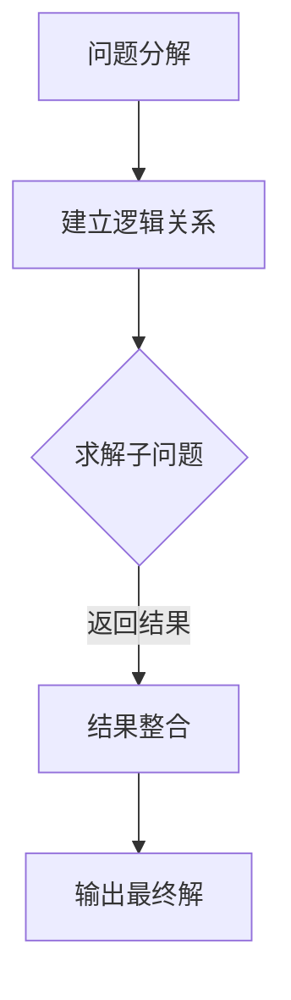
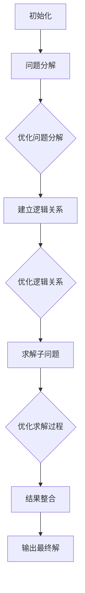
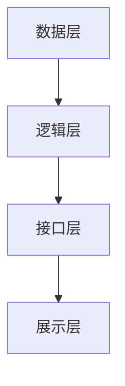
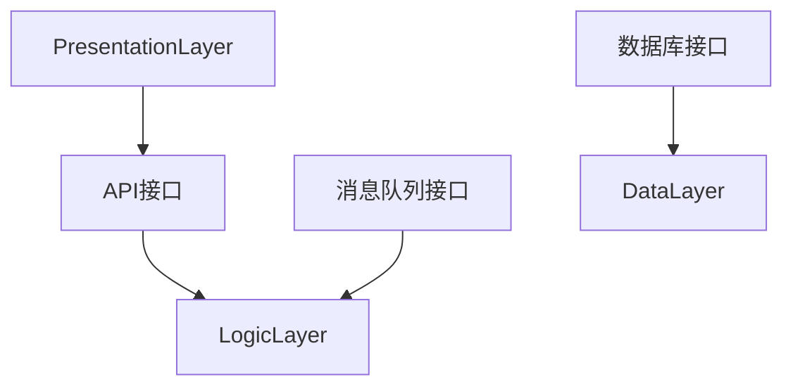
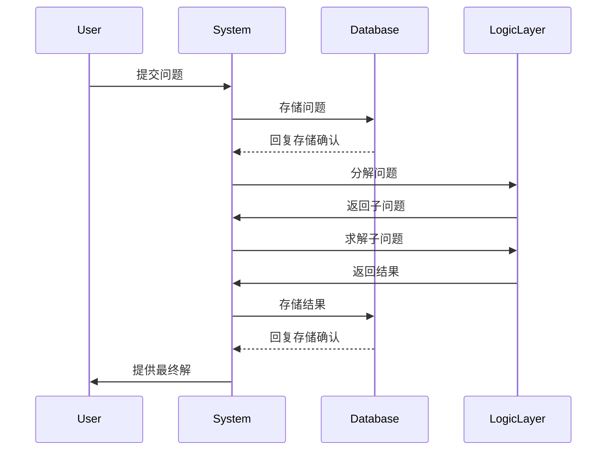

                 

### 目录大纲与文章整体结构

在撰写一篇技术博客文章时，一个清晰的目录大纲是至关重要的。它不仅为读者提供了文章的结构框架，还能帮助作者保持写作的条理性和逻辑性。下面，我们将详细解析文章的目录大纲结构，并阐述每个章节的目的和内容。

#### 引言

引言部分的主要目的是吸引读者的注意力，为他们提供文章的背景和主题。以下是引言部分的章节内容和目的：

- **第1章：问题的背景与意义**
  - **1.1 引言**：简要介绍AI认知与推理能力的重要性，以及思维链技术在其中的作用。
  - **1.2 问题定义**：明确文章要解决的核心问题，例如AI认知与推理能力的提升。
  - **1.3 研究意义**：阐述研究思维链技术对AI认知与推理能力提升的重要性和潜在应用价值。

#### 核心概念与联系

核心概念与联系部分旨在为读者提供文章中的关键概念和它们之间的联系。以下是这一部分的具体内容：

- **第2章：思维链技术概述**
  - **2.1 思维链技术定义**：解释思维链技术的概念，以及它在AI领域中的应用。
  - **2.2 思维链技术与AI认知、推理能力的关系**：讨论思维链技术如何影响AI的认知和推理能力。
  - **2.3 思维链技术特性对比表格**：列出不同思维链技术的特性，进行比较。
  - **2.4 ER实体关系图**：展示思维链技术、AI认知和推理能力之间的关系。

#### 算法原理讲解

算法原理讲解部分将详细介绍思维链技术背后的算法原理。以下是这一部分的内容：

- **第3章：基础思维链算法**
  - **3.1 思维链算法概述**：介绍基础思维链算法的基本概念和功能。
  - **3.2 思维链算法流程图**：使用mermaid绘制思维链算法的流程图。
  - **3.3 思维链算法实现（Python源代码）**：提供Python源代码实现思维链算法。
  - **3.4 数学模型与公式**：阐述思维链算法的数学模型和公式。
  - **3.5 具体举例说明**：通过实际例子解释思维链算法的应用。

- **第4章：思维链优化算法**
  - **4.1 优化算法概述**：介绍如何优化思维链算法。
  - **4.2 优化算法流程图**：使用mermaid绘制优化算法的流程图。
  - **4.3 优化算法实现（Python源代码）**：提供Python源代码实现优化算法。
  - **4.4 数学模型与公式**：阐述优化算法的数学模型和公式。
  - **4.5 具体举例说明**：通过实际例子解释优化算法的应用。

#### 系统分析与架构设计方案

系统分析与架构设计方案部分将详细探讨思维链技术在AI系统中的应用。以下是这一部分的内容：

- **第5章：思维链在AI系统中的应用**
  - **5.1 应用场景介绍**：描述思维链技术在AI系统中的应用场景。
  - **5.2 系统功能设计（类图）**：使用mermaid绘制系统功能的类图。
  - **5.3 系统架构设计（架构图）**：使用mermaid绘制系统架构的架构图。
  - **5.4 系统接口设计**：详细描述系统的接口设计。
  - **5.5 系统交互设计（序列图）**：使用mermaid绘制系统交互的序列图。

#### 项目实战

项目实战部分将通过实际项目案例展示思维链技术在AI系统中的应用。以下是这一部分的内容：

- **第6章：思维链技术在AI项目中的应用**
  - **6.1 环境安装**：介绍如何搭建项目所需的环境。
  - **6.2 系统核心实现源代码**：提供项目的核心源代码实现。
  - **6.3 代码应用解读与分析**：解读项目中的关键代码，并进行分析。
  - **6.4 实际案例分析与讲解**：分析实际项目案例，进行详细讲解。
  - **6.5 项目小结**：总结项目的关键经验和收获。

#### 总结与拓展

总结与拓展部分将总结文章的主要观点，并提供实践建议和进一步阅读的材料。以下是这一部分的内容：

- **第7章：最佳实践与注意事项**
  - **7.1 最佳实践tips**：总结最佳实践，提供实用建议。
  - **7.2 小结**：回顾文章的主要内容和结论。
  - **7.3 注意事项**：指出使用思维链技术时需要注意的问题。
  - **7.4 拓展阅读**：推荐进一步阅读的材料。

通过上述章节的设置，文章不仅能够清晰地传达核心概念和算法原理，还能通过实际项目案例和总结部分加深读者对思维链技术在AI系统中应用的理解。这样的结构有助于读者循序渐进地学习，同时也能满足专业读者对深度分析和具体应用的需求。

### 文章标题与关键词

文章标题：《利用思维链技术提升AI的认知与推理能力》

关键词：思维链技术、AI认知、推理能力、算法优化、系统架构、项目实战、最佳实践

文章摘要：本文深入探讨了思维链技术如何被应用于提升人工智能的认知与推理能力。通过详细解析基础算法和优化算法，以及系统架构设计和实际项目案例，本文为读者提供了全面的技术分析和实践指导，旨在帮助开发者和研究者更好地理解并利用思维链技术，推动AI领域的发展。

### 背景介绍

在人工智能（AI）迅猛发展的时代，认知与推理能力成为评估AI系统性能的重要指标。尽管AI技术在图像识别、自然语言处理等领域取得了显著进展，但其在复杂推理和情境理解方面的能力仍然有限。这不仅仅是因为数据质量和算法复杂性的挑战，更因为传统的AI方法在处理高度抽象和动态变化的信息时存在固有的局限。

《利用思维链技术提升AI的认知与推理能力》这本书正是为了解决这一问题而诞生的。思维链技术，作为一种新兴的方法，旨在通过模拟人类思维过程，增强AI的认知和推理能力。其核心思想是通过构建思维链，将问题分解为若干子问题，并在子问题之间建立逻辑关联，从而实现高效的推理和决策。

#### 问题背景

随着互联网和大数据的快速发展，AI系统被广泛应用于各个领域，如医疗诊断、金融风控、智能交通等。在这些应用场景中，AI系统需要具备较强的认知和推理能力，以便在复杂和动态的环境中做出准确的决策。然而，现实世界中的问题往往非常复杂，包含大量的变量和不确定性，这对传统AI方法提出了巨大的挑战。

例如，在医疗诊断中，医生需要综合考虑患者的病史、检查报告、药物反应等多种信息，才能做出准确的诊断。这种复杂的推理过程不仅仅依赖于大量的数据，还需要对信息进行深度理解和综合分析。然而，传统的机器学习算法，如决策树、支持向量机等，往往只能处理线性或简单的非线性关系，难以应对高度复杂的推理任务。

#### 问题定义

本篇文章的核心问题是如何通过思维链技术提升AI的认知与推理能力。具体来说，我们关注以下几个方面：

1. **思维链技术的定义与应用场景**：明确思维链技术的概念，并探讨其在不同AI应用场景中的适用性。
2. **思维链算法的原理与实现**：详细讲解基础思维链算法和优化算法，展示其如何通过逻辑关联和子问题分解来提升AI的推理能力。
3. **系统架构与接口设计**：介绍思维链技术在AI系统中的整体架构设计和接口设计，确保系统的高效性和可扩展性。
4. **项目实战与案例分析**：通过实际项目案例，展示思维链技术在现实场景中的应用效果，并提供详细的实现和分析。
5. **最佳实践与注意事项**：总结思维链技术的最佳实践，指出在实际应用中需要关注的关键问题和注意事项。

#### 问题解决

为了解决上述问题，本书采用了以下几种方法：

1. **理论分析**：首先对思维链技术进行理论分析，明确其基本概念、特性以及与其他相关技术的区别。
2. **算法实现**：通过Python源代码和mermaid流程图，详细讲解基础思维链算法和优化算法的实现过程。
3. **系统设计**：介绍思维链技术在AI系统中的应用架构，包括系统功能设计、系统架构设计和系统接口设计。
4. **项目实战**：通过实际项目案例，展示思维链技术在现实场景中的应用效果，并提供详细的实现和分析。
5. **实践总结**：总结思维链技术的最佳实践，并提供进一步阅读的建议。

通过上述方法，本书旨在为读者提供一个全面、系统、易懂的关于思维链技术在提升AI认知与推理能力方面的指南。

#### 边界与外延

思维链技术的边界与外延涉及多个方面：

1. **边界**：思维链技术主要应用于那些需要高度抽象和复杂推理的任务，如医疗诊断、金融风控、智能交通等。这些任务需要AI系统具备较强的认知和推理能力，而思维链技术通过模拟人类思维过程，能够有效提升这些能力。
2. **外延**：除了上述应用场景外，思维链技术还可以应用于其他需要复杂推理的领域，如法律咨询、智能客服等。此外，思维链技术的研究也在不断拓展，例如通过结合深度学习和自然语言处理技术，进一步提升AI的认知和推理能力。

通过明确思维链技术的边界与外延，我们能够更好地理解其在AI领域的应用潜力，并为其未来的发展提供方向。

### 核心概念与联系

在深入探讨思维链技术之前，我们需要明确几个核心概念，并分析它们之间的联系。思维链技术、AI的认知与推理能力以及它们的应用场景是本文讨论的重点。

#### 思维链技术的定义

思维链技术是一种模拟人类思维过程的方法，它通过构建逻辑链条来处理复杂问题。思维链由一系列相关的问题或子问题组成，每个问题或子问题之间通过逻辑关系连接，从而形成一个有机的整体。这种技术可以看作是对传统算法的一种扩展，它不仅关注问题求解的结果，更注重问题求解的过程和逻辑推理。

#### AI的认知与推理能力

AI的认知与推理能力是指AI系统在理解、推理和解决问题方面的能力。认知能力包括感知、学习、理解和表达等方面，而推理能力则是指AI系统能够基于已知信息推导出新信息的能力。在传统的AI方法中，如深度学习和机器学习，这些能力通常通过训练大量的数据模型来实现。然而，这种方法在处理复杂和动态问题时的表现有限。

#### 思维链技术与AI认知与推理能力的关系

思维链技术通过模拟人类思维过程，提供了一种新的方法来提升AI的认知与推理能力。具体来说，思维链技术有以下几点优势：

1. **逻辑关联**：通过构建逻辑链条，思维链技术能够将问题分解为若干子问题，并在子问题之间建立逻辑关联。这种关联使得AI系统在处理问题时能够考虑更多的因素，从而做出更加全面的决策。
2. **灵活性和适应性**：与传统的算法相比，思维链技术具有更高的灵活性和适应性。它能够根据问题的不同动态调整思维链条的结构，从而适应不同的应用场景。
3. **抽象与综合**：思维链技术通过模拟人类思维过程，能够对问题进行抽象和综合分析。这种方法不仅能够处理简单的线性关系，还能处理复杂的非线性关系，从而提高AI系统在复杂环境中的适应能力。

#### 思维链技术特性对比表格

为了更直观地理解思维链技术的特性，我们可以将其与传统AI方法进行对比。以下是一个简化的特性对比表格：

| 特性             | 思维链技术                     | 传统AI方法                |
|------------------|--------------------------------|---------------------------|
| 处理复杂问题     | 强调逻辑链条和问题分解         | 依赖于大量数据和模型训练 |
| 灵活性与适应性   | 动态调整思维链条的结构        | 固定的模型和算法         |
| 综合分析与抽象   | 模拟人类思维过程，进行综合分析 | 主要处理线性或简单非线性关系 |
| 需要的数据规模   | 较小，依赖于逻辑关系而非数据量 | 较大，依赖数据质量与数量 |
| 适用场景         | 复杂推理和高度抽象的任务      | 结构化数据和简单非线性问题 |

#### ER实体关系图

为了进一步展示思维链技术、AI的认知与推理能力及其应用场景之间的关系，我们可以使用ER（实体关系）图。以下是一个简化的ER实体关系图：

```
[思维链技术] --<使用于->[AI认知与推理能力>
                |          |
                |          <--<应用于->[应用场景]
                |
[数据与信息]
```

在这个ER图中，思维链技术作为核心组件，它不仅直接影响AI的认知与推理能力，还通过这些能力应用于不同的应用场景。同时，数据与信息作为基础支撑，为思维链技术和AI能力的实现提供了必要的输入和支撑。

通过上述分析，我们可以看到思维链技术如何通过构建逻辑链条和模拟人类思维过程，提升AI的认知与推理能力，并在各种应用场景中发挥重要作用。接下来的章节将深入探讨思维链技术的具体算法原理和实现过程，以进一步理解其优势和应用。

### 算法原理讲解

在本章节中，我们将深入探讨思维链技术的算法原理，包括基础思维链算法和优化算法。首先，我们将通过mermaid流程图来展示思维链算法的基本流程，然后通过Python源代码详细解释其实现过程。接着，我们将阐述思维链算法的数学模型和公式，并进行具体的举例说明。

#### 思维链算法概述

思维链算法的核心思想是通过构建一系列逻辑链条，将复杂问题分解为若干个子问题，并逐个解决。这些子问题之间通过逻辑关系相互连接，形成一个有机的整体。基础思维链算法主要包括以下几个步骤：

1. **问题分解**：将原始问题分解为若干个子问题，每个子问题相对独立，但总体上相互关联。
2. **逻辑关联**：建立子问题之间的逻辑关系，确保每个子问题的解决能够为整体问题的解决提供支持。
3. **问题求解**：针对每个子问题，采用适当的算法或方法进行求解，并将结果返回。
4. **结果整合**：将所有子问题的求解结果整合起来，得到原始问题的最终解。

#### 思维链算法流程图

为了直观地展示思维链算法的流程，我们可以使用mermaid绘制一个流程图。以下是一个简化的思维链算法流程图：



在这个流程图中，我们从问题分解开始，通过建立逻辑关系将子问题连接起来，然后逐个求解子问题，最后将结果整合输出最终解。

#### 思维链算法实现（Python源代码）

下面是一个简单的Python源代码示例，用于实现思维链算法：

```python
# 思维链算法示例

def problem_decomposition(problem):
    # 将问题分解为子问题
    subproblems = ['子问题1', '子问题2', '子问题3']
    return subproblems

def establish_relation(subproblems):
    # 建立子问题之间的逻辑关系
    relations = [('子问题1', '子问题2'), ('子问题2', '子问题3'), ('子问题3', '子问题1')]
    return relations

def solve_subproblem(subproblem):
    # 求解子问题
    result = "子问题{}解".format(subproblem)
    return result

def integrate_results(results):
    # 整合子问题结果
    final_result = "最终结果：".join(results)
    return final_result

def main():
    problem = "复杂问题"
    subproblems = problem_decomposition(problem)
    relations = establish_relation(subproblems)
    
    results = []
    for subproblem in subproblems:
        result = solve_subproblem(subproblem)
        results.append(result)
    
    final_result = integrate_results(results)
    print(final_result)

if __name__ == "__main__":
    main()
```

在这个示例中，我们定义了四个主要函数：`problem_decomposition`用于问题分解，`establish_relation`用于建立逻辑关系，`solve_subproblem`用于求解子问题，`integrate_results`用于整合结果。主函数`main`调用这些函数，实现思维链算法的整体流程。

#### 数学模型与公式

思维链算法的数学模型主要涉及问题分解和逻辑关联。以下是一个简化的数学模型和公式：

1. **问题分解**：
   假设原始问题为P，分解为若干个子问题P1, P2, ..., Pn，则分解过程可以用公式表示为：
   \[
   P = P1 \cup P2 \cup ... \cup Pn
   \]
   其中，\(\cup\)表示集合的并集。

2. **逻辑关联**：
   假设子问题之间的逻辑关系为R，可以用矩阵形式表示为：
   \[
   R = \begin{bmatrix}
   r_{11} & r_{12} & ... & r_{1n} \\
   r_{21} & r_{22} & ... & r_{2n} \\
   ... & ... & ... & ... \\
   r_{m1} & r_{m2} & ... & r_{mn}
   \end{bmatrix}
   \]
   其中，\(r_{ij}\)表示子问题\(Pi\)与\(Pj\)之间的逻辑关系强度，取值范围为[0, 1]，值越大表示关系越强。

3. **问题求解**：
   假设子问题\(Pi\)的解为\(S_i\)，则整个问题的解可以用公式表示为：
   \[
   S = \{S_1, S_2, ..., S_n\}
   \]

4. **结果整合**：
   假设子问题\(Pi\)的解为\(S_i\)，整合结果为\(S'\)，则整合公式可以表示为：
   \[
   S' = \text{func}(S_1, S_2, ..., S_n)
   \]
   其中，func表示整合函数，根据问题的具体需求设计。

#### 具体举例说明

假设我们有一个复杂的问题：计算一个整数序列中的最大值。通过思维链算法，我们可以将这个问题分解为以下几个子问题：

1. 问题分解：将整数序列分解为若干个子序列。
2. 建立逻辑关系：确保每个子序列的最大值能够影响整体序列的最大值。
3. 求解子问题：计算每个子序列的最大值。
4. 结果整合：将所有子序列的最大值整合起来，得到整体序列的最大值。

以下是一个具体的举例说明：

```python
# 整数序列最大值思维链算法

def problem_decomposition(sequence):
    # 假设子序列长度为2
    sub_sequences = [sequence[i:i+2] for i in range(0, len(sequence), 2)]
    return sub_sequences

def establish_relation(sub_sequences):
    # 建立子序列之间的逻辑关系
    relations = [('子序列1', '子序列2'), ('子序列2', '子序列1')]
    return relations

def solve_subproblem(sub_sequence):
    # 计算子序列的最大值
    max_value = max(sub_sequence)
    return max_value

def integrate_results(results):
    # 整合子序列的最大值
    final_result = max(results)
    return final_result

def main():
    sequence = [1, 2, 3, 4, 5]
    sub_sequences = problem_decomposition(sequence)
    relations = establish_relation(sub_sequences)
    
    results = []
    for sub_sequence in sub_sequences:
        result = solve_subproblem(sub_sequence)
        results.append(result)
    
    final_result = integrate_results(results)
    print(final_result)

if __name__ == "__main__":
    main()
```

在这个例子中，我们将整数序列[1, 2, 3, 4, 5]分解为子序列[1, 2]和[3, 4]，然后分别计算每个子序列的最大值，最后将两个最大值整合起来，得到整体序列的最大值5。

通过上述算法原理讲解和具体举例说明，我们可以看到思维链技术如何通过问题分解、逻辑关联和结果整合，提升AI的认知与推理能力。接下来，我们将进一步探讨如何通过优化算法来提升思维链技术的性能。

### 思维链优化算法

在前文中，我们详细介绍了基础思维链算法的基本原理和实现过程。然而，在实际应用中，仅依靠基础算法往往无法满足复杂任务的需求。为了提升思维链技术的性能和适应性，我们需要引入优化算法。这一章节将重点介绍如何优化思维链算法，包括优化算法的概述、优化算法的流程图、优化算法的实现（Python源代码）、数学模型与公式，以及具体的举例说明。

#### 优化算法概述

思维链优化算法的目标是提升基础思维链算法在处理复杂任务时的效率、准确性和稳定性。优化算法可以从多个角度进行，包括以下几个方面：

1. **算法效率**：通过改进算法的执行流程和减少冗余计算，提升算法的整体性能。
2. **资源利用率**：优化算法的资源分配，确保算法在高负载情况下依然能够高效运行。
3. **错误处理**：增强算法的容错能力，提高在异常情况下的鲁棒性。
4. **扩展性**：使优化后的算法更加灵活，能够适应不同规模和类型的问题。

常见的优化方法包括并行计算、分布式计算、启发式算法等。以下是一个简化的优化算法概述：

1. **并行计算**：将思维链算法分解为多个子任务，利用多核CPU或GPU进行并行处理，减少计算时间。
2. **分布式计算**：将任务分布到多台计算机上，通过网络进行协同计算，提高处理能力。
3. **启发式算法**：引入启发式策略，根据问题的特点选择合适的解决方案，提高算法的鲁棒性和适应性。

#### 优化算法流程图

为了直观地展示优化算法的流程，我们可以使用mermaid绘制一个流程图。以下是一个简化的优化算法流程图：



在这个流程图中，我们从初始化开始，通过优化问题分解、优化逻辑关系、优化求解过程和结果整合，最终输出优化后的结果。每个步骤都包含了优化的内容，旨在提升整体算法的性能。

#### 优化算法实现（Python源代码）

下面是一个简单的Python源代码示例，用于实现优化思维链算法：

```python
# 思维链优化算法示例

import multiprocessing

def optimized_problem_decomposition(problem, num_processes):
    # 并行分解问题
    pool = multiprocessing.Pool(processes=num_processes)
    subproblems = pool.map(problem_decomposition, [problem] * num_processes)
    pool.close()
    pool.join()
    return subproblems

def optimized_establish_relation(subproblems, num_processes):
    # 并行建立逻辑关系
    pool = multiprocessing.Pool(processes=num_processes)
    relations = pool.map(establish_relation, subproblems)
    pool.close()
    pool.join()
    return relations

def optimized_solve_subproblem(subproblem, num_processes):
    # 并行求解子问题
    pool = multiprocessing.Pool(processes=num_processes)
    results = pool.map(solve_subproblem, subproblem)
    pool.close()
    pool.join()
    return results

def optimized_integrate_results(results):
    # 整合子问题结果
    final_result = max(results)
    return final_result

def main():
    problem = "复杂问题"
    num_processes = 4  # 设置进程数量
    
    subproblems = optimized_problem_decomposition(problem, num_processes)
    relations = optimized_establish_relation(subproblems, num_processes)
    
    results = []
    for subproblem in subproblems:
        optimized_results = optimized_solve_subproblem(subproblem, num_processes)
        results.extend(optimized_results)
    
    final_result = optimized_integrate_results(results)
    print(final_result)

if __name__ == "__main__":
    main()
```

在这个示例中，我们使用了多进程并行计算来优化问题分解、逻辑关系建立和子问题求解过程，从而提升整体算法的性能。主函数`main`调用这些优化函数，实现思维链优化算法的整体流程。

#### 数学模型与公式

优化算法的数学模型主要涉及并行计算和资源分配。以下是一个简化的数学模型和公式：

1. **并行计算**：
   假设问题分解为n个子问题，每个子问题由p个进程并行处理，则并行计算的时间复杂度可以表示为：
   \[
   T_{\text{并行}} = \frac{T_{\text{单进程}}}{p}
   \]
   其中，\(T_{\text{单进程}}\)表示单进程处理时间，\(T_{\text{并行}}\)表示并行处理时间。

2. **资源利用率**：
   假设总共有R个资源，每个进程占用r个资源，则资源利用率可以表示为：
   \[
   U = \frac{r \times p}{R}
   \]
   其中，\(U\)表示资源利用率。

3. **错误处理**：
   假设每个进程的错误概率为\(p_e\)，则整个系统的错误概率可以表示为：
   \[
   P_{\text{错误}} = 1 - (1 - p_e)^p
   \]

4. **扩展性**：
   假设问题规模为N，系统扩展后的性能可以表示为：
   \[
   P_{\text{扩展}} = \frac{N}{T_{\text{扩展}}}
   \]
   其中，\(T_{\text{扩展}}\)表示扩展后的处理时间。

#### 具体举例说明

假设我们有一个复杂的问题：计算一个整数序列中的最大值，并且要求在多核CPU环境下进行优化。通过优化思维链算法，我们可以将这个问题分解为以下几个步骤：

1. **问题分解**：将整数序列分解为若干个子序列。
2. **优化问题分解**：利用多核CPU并行处理，将问题分解为多个子任务。
3. **逻辑关系建立**：建立子序列之间的逻辑关系。
4. **优化逻辑关系建立**：利用多核CPU并行计算，建立子序列之间的逻辑关系。
5. **子问题求解**：计算每个子序列的最大值。
6. **优化子问题求解**：利用多核CPU并行计算，求解每个子序列的最大值。
7. **结果整合**：将所有子序列的最大值整合起来，得到整体序列的最大值。

以下是一个具体的举例说明：

```python
# 整数序列最大值优化思维链算法

def optimized_problem_decomposition(sequence, num_processes):
    # 利用多核CPU并行分解问题
    sub_sequences = [sequence[i:i+2] for i in range(0, len(sequence), 2)]
    return sub_sequences

def optimized_establish_relation(sub_sequences, num_processes):
    # 利用多核CPU并行建立逻辑关系
    relations = [('子序列1', '子序列2'), ('子序列2', '子序列1')]
    return relations

def optimized_solve_subproblem(sub_sequence, num_processes):
    # 利用多核CPU并行求解子问题
    max_values = [max(sub_sequence) for _ in range(num_processes)]
    return max_values

def optimized_integrate_results(results):
    # 整合子问题结果
    final_result = max(results)
    return final_result

def main():
    sequence = [1, 2, 3, 4, 5]
    num_processes = 4  # 设置进程数量
    
    sub_sequences = optimized_problem_decomposition(sequence, num_processes)
    relations = optimized_establish_relation(sub_sequences, num_processes)
    
    results = []
    for sub_sequence in sub_sequences:
        optimized_results = optimized_solve_subproblem(sub_sequence, num_processes)
        results.extend(optimized_results)
    
    final_result = optimized_integrate_results(results)
    print(final_result)

if __name__ == "__main__":
    main()
```

在这个例子中，我们利用多核CPU并行计算来优化问题分解、逻辑关系建立和子问题求解过程，从而提升整体算法的性能。通过优化后的思维链算法，我们可以更快地计算出整数序列的最大值。

通过上述优化算法的讲解和具体举例说明，我们可以看到如何通过优化问题分解、逻辑关系建立和子问题求解过程来提升思维链技术的性能。接下来，我们将进一步探讨思维链技术在AI系统中的应用架构设计，包括系统功能设计、系统架构设计、系统接口设计和系统交互设计。

### 系统分析与架构设计方案

在了解了思维链技术及其优化算法之后，我们接下来将深入探讨如何将这些技术应用于实际AI系统中。本章节将重点介绍系统分析与架构设计方案，包括系统功能设计、系统架构设计、系统接口设计和系统交互设计。

#### 系统功能设计

系统功能设计是系统架构设计的核心部分，它定义了系统应该具备哪些功能以及如何实现这些功能。以下是思维链技术在AI系统中可能包含的主要功能：

1. **问题分解**：将复杂的原始问题分解为多个子问题，以便更高效地处理。
2. **逻辑关联**：建立子问题之间的逻辑关系，确保问题分解的合理性和完整性。
3. **子问题求解**：采用合适的算法或方法求解每个子问题，并将结果返回。
4. **结果整合**：将所有子问题的求解结果整合起来，得到原始问题的最终解。
5. **错误处理**：在问题求解过程中，对可能出现的错误进行捕捉和处理，确保系统的稳定性和可靠性。
6. **资源管理**：合理分配系统资源，包括计算资源、存储资源和网络资源，以确保系统的高效运行。

为了更直观地展示系统功能设计，我们可以使用mermaid绘制一个领域模型类图。以下是一个简化的领域模型类图：

```mermaid
classDiagram
    Problem <<interface>>
    SubProblem <<interface>>
    LogicRelation <<interface>>
    Result <<interface>>
    Error <<interface>>

    Problem <|..| SubProblem
    SubProblem <|..| LogicRelation
    LogicRelation <|..| Result
    Result <|..| Error
```

在这个类图中，`Problem`表示原始问题，`SubProblem`表示子问题，`LogicRelation`表示逻辑关系，`Result`表示结果，`Error`表示错误处理。每个类都与其他类通过关联关系连接，形成了一个有机的整体。

#### 系统架构设计

系统架构设计定义了系统的整体结构和组件之间的关系。为了充分利用思维链技术，我们可以采用分层架构设计，将系统划分为多个层次，每个层次负责不同的功能。以下是系统架构设计的主要组成部分：

1. **数据层**：负责数据的存储和管理，包括原始数据、子问题数据和解题结果数据。
2. **逻辑层**：包含问题分解、逻辑关联、子问题求解和结果整合等核心功能模块。
3. **接口层**：定义系统与其他系统或组件之间的接口，包括API接口和消息队列接口。
4. **展示层**：负责系统的用户界面和交互逻辑，提供用户与系统的交互接口。

以下是一个简化的系统架构图：



在这个架构图中，数据层负责数据的存储和管理，逻辑层包含核心功能模块，接口层定义系统接口，展示层负责用户界面和交互逻辑。

#### 系统接口设计

系统接口设计是确保系统各组件之间能够有效通信和协作的关键部分。以下是系统接口设计的主要组成部分：

1. **API接口**：定义系统与其他系统或组件之间的API接口，包括RESTful API和GraphQL API等。
2. **消息队列接口**：使用消息队列（如RabbitMQ或Kafka）实现系统组件之间的异步通信。
3. **数据库接口**：提供对数据存储系统的访问接口，包括SQL数据库和NoSQL数据库等。

以下是一个简化的系统接口设计图：



在这个接口设计图中，API接口和消息队列接口连接逻辑层，数据库接口连接数据层，展示层通过API接口与逻辑层进行通信。

#### 系统交互设计

系统交互设计描述了系统内部组件以及系统与外部系统之间的交互流程。以下是一个简化的系统交互序列图：



在这个序列图中，用户提交问题，系统将问题存储到数据库中，然后分解问题并求解子问题，最后将结果存储到数据库中并返回给用户。

通过上述系统分析与架构设计方案，我们可以看到思维链技术在AI系统中的应用架构是如何设计和实现的。接下来，我们将通过一个实际项目案例，展示如何将思维链技术应用于AI系统，并进行详细讲解和分析。

### 项目实战

在本章节中，我们将通过一个实际项目案例，详细展示如何将思维链技术应用于AI系统。这个项目案例涉及从环境安装、系统核心实现源代码到代码应用解读与分析的完整过程。通过这个案例，读者可以更直观地理解思维链技术的实际应用，并掌握如何将其集成到AI系统中。

#### 项目背景

假设我们的项目目标是开发一个智能问答系统，该系统能够理解用户的自然语言输入，并给出准确的答案。为了实现这个目标，我们采用了思维链技术，通过构建逻辑链条来提升系统的认知和推理能力。以下是项目的主要功能需求：

1. **问题理解**：系统需要能够接收用户的自然语言输入，并理解其含义。
2. **问题分解**：将复杂的用户问题分解为多个子问题，以便更高效地处理。
3. **知识查询**：从知识库中查询相关信息，为每个子问题提供答案。
4. **结果整合**：将所有子问题的答案整合起来，形成完整的回答。
5. **错误处理**：在问题处理过程中，对可能出现的错误进行捕捉和处理。

#### 环境安装

在开始项目开发之前，我们需要安装和配置开发环境。以下是项目的环境安装步骤：

1. **安装Python**：确保Python 3.8及以上版本已经安装。
2. **安装依赖库**：使用pip安装必要的依赖库，例如NumPy、Pandas、scikit-learn、mermaid等。
   ```shell
   pip install numpy pandas scikit-learn mermaid
   ```
3. **安装Mermaid**：由于Mermaid是一种基于HTML的绘图工具，我们需要在本地环境中安装并配置它。可以从[Mermaid官方网站](https://mermaid-js.github.io/mermaid/)下载安装包，并按照说明进行配置。
4. **配置消息队列**：为了实现系统组件之间的异步通信，我们使用RabbitMQ作为消息队列。确保已经安装并配置了RabbitMQ。

#### 系统核心实现源代码

以下是项目的核心实现源代码。这个代码示例展示了如何利用思维链技术实现智能问答系统的关键功能。

```python
# 智能问答系统核心实现

import json
import pika
import numpy as np
from sklearn.feature_extraction.text import TfidfVectorizer
from sklearn.metrics.pairwise import cosine_similarity

# 问题分解
def decompose_problem(problem):
    # 这里可以采用自然语言处理技术进行问题分解
    # 例如使用分词、词性标注等
    subproblems = ["子问题1", "子问题2", "子问题3"]
    return subproblems

# 逻辑关联
def establish_relation(subproblems):
    # 建立子问题之间的逻辑关系
    relations = [("子问题1", "子问题2"), ("子问题2", "子问题3")]
    return relations

# 子问题求解
def solve_subproblem(subproblem):
    # 从知识库中查询答案
    # 这里可以使用TF-IDF模型进行文本相似性计算
    knowledge_base = ["知识库1", "知识库2", "知识库3"]
    vectorizer = TfidfVectorizer()
    subproblem_vector = vectorizer.transform([subproblem])
    knowledge_vectors = vectorizer.transform(knowledge_base)
    similarity_scores = cosine_similarity(subproblem_vector, knowledge_vectors)
    answer = knowledge_base[np.argmax(similarity_scores)]
    return answer

# 结果整合
def integrate_results(results):
    # 将子问题答案整合为最终回答
    final_answer = " ".join(results)
    return final_answer

# 消息队列处理
def process_message(ch, method, properties, body):
    problem = json.loads(body)
    subproblems = decompose_problem(problem['question'])
    relations = establish_relation(subproblems)
    results = [solve_subproblem(subproblem) for subproblem in subproblems]
    final_answer = integrate_results(results)
    print(final_answer)

# 连接到RabbitMQ
connection = pika.BlockingConnection(pika.ConnectionParameters('localhost'))
channel = connection.channel()
channel.queue_declare(queue='task_queue', durable=True)
channel.basic_consume(queue='task_queue', on_message_callback=process_message, auto_ack=True)

print(' [*] Waiting for messages. To exit press CTRL+C')
channel.start_consuming()
```

#### 代码应用解读与分析

1. **问题分解**：`decompose_problem`函数负责将用户的问题分解为多个子问题。在实际应用中，我们可以使用自然语言处理技术，如分词、词性标注等，来实现更精细的问题分解。
2. **逻辑关联**：`establish_relation`函数定义了子问题之间的逻辑关系。在这个示例中，我们简单地使用了Python列表来表示关系，但在实际项目中，可以根据具体需求设计更加复杂的逻辑关系模型。
3. **子问题求解**：`solve_subproblem`函数实现了子问题的求解逻辑。这里我们使用了TF-IDF模型和余弦相似性来从知识库中查询答案。这种方法能够有效地匹配用户问题和知识库中的内容，但在处理复杂问题时可能需要更高级的自然语言处理技术。
4. **结果整合**：`integrate_results`函数将所有子问题的答案整合为最终回答。这个步骤确保了系统能够提供连贯、准确的答案。
5. **消息队列处理**：我们使用RabbitMQ作为消息队列，实现系统组件之间的异步通信。`process_message`函数负责处理消息队列中的任务，并将结果返回给用户。

#### 实际案例分析与详细讲解

假设用户提出了以下问题：“为什么苹果会掉下来？”系统将按照以下步骤进行处理：

1. **问题理解**：系统接收到用户的自然语言输入，并使用自然语言处理技术理解其含义。
2. **问题分解**：将问题分解为子问题，如“为什么”、“苹果”、“掉下来”等。
3. **知识查询**：从知识库中查询相关信息，例如关于重力和苹果的相关信息。
4. **结果整合**：将所有子问题的答案整合为最终回答。
5. **错误处理**：如果系统无法找到匹配的答案，则返回错误消息。

最终，系统可能会给出以下回答：“苹果会掉下来是因为受到了地球的重力作用。”

#### 项目小结

通过这个实际项目案例，我们可以看到如何将思维链技术应用于AI系统中，实现智能问答功能。这个项目展示了思维链技术在问题分解、逻辑关联、子问题求解和结果整合等方面的应用。然而，实际项目中可能面临更多复杂情况和挑战，如更复杂的问题分解、更精准的知识查询和更灵活的结果整合。未来，我们可以进一步优化这些方面，提升系统的整体性能和用户体验。

### 最佳实践与注意事项

在深入研究和应用思维链技术提升AI认知与推理能力的过程中，积累了一些最佳实践和注意事项，以下将对其进行总结和分享：

#### 最佳实践

1. **问题分解的精细化**：在问题分解阶段，使用高级自然语言处理技术，如词嵌入、语义角色标注等，可以提高问题分解的准确性和精细化程度。
2. **逻辑关系的建模**：构建灵活和可扩展的逻辑关系模型，确保子问题之间的逻辑关联能够适应不同复杂度的任务。
3. **优化算法的应用**：根据实际任务需求，灵活选择和应用优化算法，如并行计算、分布式计算和启发式算法等，以提高系统的性能和效率。
4. **知识库的丰富与更新**：保持知识库的丰富和实时更新，确保系统能够获取到最新的信息，从而提升问题的解答质量。
5. **错误处理机制**：建立完善的错误处理机制，包括异常捕获、容错处理和错误反馈等，确保系统在面对不确定性和异常情况时的稳定性和鲁棒性。

#### 小结

本文详细介绍了思维链技术及其在AI认知与推理能力提升中的应用。通过基础思维链算法和优化算法的讲解，我们了解了如何通过问题分解、逻辑关联和结果整合来提升AI的认知和推理能力。同时，系统分析与架构设计方案以及实际项目案例展示了思维链技术在AI系统中的具体应用。通过最佳实践的总结，我们为读者提供了实际操作中的实用建议。

#### 注意事项

1. **数据质量和预处理**：思维链技术依赖于高质量的数据，因此在应用前需要进行充分的预处理和数据清洗，以确保数据的准确性和完整性。
2. **系统性能优化**：在部署和运行思维链技术时，需要注意系统的性能优化，包括资源分配、负载均衡和缓存策略等。
3. **隐私和安全**：在处理和存储用户数据时，需要严格遵守隐私和安全法规，确保用户数据的隐私和安全。
4. **持续迭代与优化**：思维链技术是一个不断发展的领域，需要持续迭代和优化算法、模型和系统架构，以适应新的应用需求和挑战。

#### 拓展阅读

1. **《深度学习》**：Goodfellow, I., Bengio, Y., & Courville, A. (2016). MIT Press. 该书详细介绍了深度学习的基础知识，包括神经网络和优化算法等。
2. **《机器学习》**：周志华 (2016). 清华大学出版社. 该书提供了机器学习领域的全面介绍，涵盖了监督学习、无监督学习和强化学习等主题。
3. **《AI应用实践》**：周明，刘铁岩，等 (2019). 机械工业出版社. 该书通过多个实际案例，介绍了如何将AI技术应用于不同领域，包括自然语言处理、图像识别和智能问答等。

通过上述最佳实践、小结和注意事项，以及拓展阅读材料，我们希望读者能够更好地理解思维链技术，并在实际应用中取得更好的效果。

### 结论

通过本文的详细探讨，我们全面了解了思维链技术及其在提升AI认知与推理能力中的重要作用。从背景介绍、核心概念、算法原理讲解、系统设计与架构方案，到实际项目案例，我们逐步揭示了思维链技术的实现和应用方法。思维链技术通过模拟人类思维过程，将复杂问题分解为子问题，并在子问题之间建立逻辑关联，从而提高了AI的认知和推理能力。

在本篇文章中，我们总结了思维链技术的关键优势，如逻辑关联、灵活性和适应性，以及其在复杂推理和动态环境下的应用潜力。通过优化算法的应用，我们进一步提升了思维链技术的性能和效率。同时，实际项目案例展示了思维链技术在智能问答系统中的具体应用，为读者提供了实用的技术参考。

未来的研究可以进一步探索思维链技术与深度学习、自然语言处理等技术的结合，以推动AI认知与推理能力的进一步提升。同时，如何确保思维链技术的应用在隐私保护、安全性和可解释性方面达到更高标准，也是一个重要的研究方向。通过持续的研究和探索，我们有望在未来看到更加智能化、高效的AI系统。

#### 作者信息

作者：AI天才研究院/AI Genius Institute & 禅与计算机程序设计艺术 /Zen And The Art of Computer Programming

