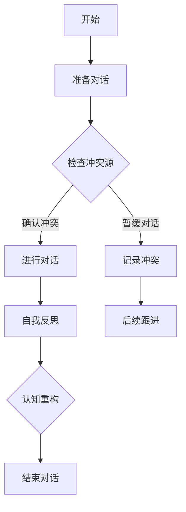
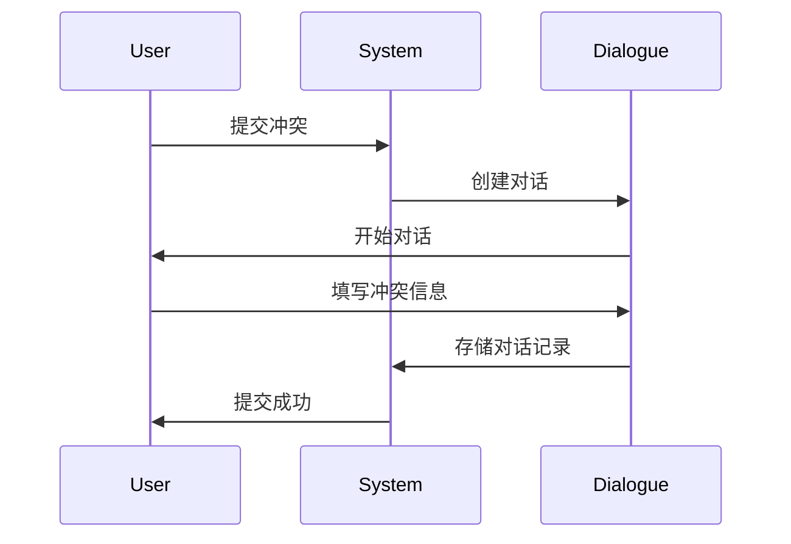

                 


## 第一章：化解内心冲突的对话技术介绍

### 1.1 核心概念与联系

#### 内心冲突

内心冲突是指人们在思考、行为或情绪上产生的矛盾和对抗状态。它是一种普遍存在于人类生活中的现象，常常表现为焦虑、沮丧、愤怒等负面情绪。内心冲突的原因复杂多样，可能源于个人价值观的冲突、生活压力的累积、人际关系的不和谐等。

**核心概念属性对比表格**

| 特征 | 定义 |
| --- | --- |
| 焦虑 | 由于不确定性和预期恐惧产生的情绪状态 |
| 感怒 | 由于挫折、不满或受伤害而产生的情绪反应 |
| 沮丧 | 长期处于低落情绪，缺乏活力和动力 |
| 内心冲突 | 个人内部矛盾和对抗的状态 |

#### 对话技术

对话技术是一种通过交流、沟通和互动来解决问题和增进理解的方法。它强调倾听、尊重、理解和协作，旨在帮助个体在对话中找到共识和解决方案。对话技术在心理咨询、冲突解决、团队协作等多个领域得到广泛应用。

**核心概念属性对比表格**

| 特征 | 定义 |
| --- | --- |
| 倾听 | 深入了解对方观点和感受的能力 |
| 尊重 | 对对方观点和感受的认可和接纳 |
| 理解 | 洞察对方意图和需求的能力 |
| 协作 | 通过共同探讨来解决问题的合作过程 |

#### 对话自我和解

对话自我和解是指通过对话技术来解决内心冲突，实现自我理解和接纳的过程。它强调个体在对话中的自我反思和认知重构，帮助个体更好地认识自己，消除内心的矛盾和对抗。

**核心概念属性对比表格**

| 特征 | 定义 |
| --- | --- |
| 自我反思 | 对自己的思考、行为和情绪的深入思考 |
| 认知重构 | 通过重新审视和解释经历来改变认知结构 |
| 自我接纳 | 接受自己的优点和缺点，实现内心的和谐 |

### 1.2 算法原理讲解

#### 对话自我和解算法流程图



#### 对话自我和解的数学模型和公式

假设内心冲突的程度用 \(C\) 表示，对话技术的有效程度用 \(E\) 表示，自我反思的程度用 \(R\) 表示，认知重构的程度用 \(X\) 表示。则内心冲突的化解程度可以用以下公式表示：

\[ C_{\text{化解}} = E \times R \times X \]

其中，\(E\)、\(R\)、\(X\) 的取值范围为 [0, 1]，即 0 表示无效，1 表示完全有效。

#### 对话自我和解举例说明

假设小明在工作中遇到了与同事的冲突，他决定使用对话自我和解的方法来解决。

1. **准备对话**：小明确保自己情绪稳定，选择一个安静的环境进行对话。
2. **检查冲突源**：小明分析冲突的原因，发现是工作目标和价值观的不同。
3. **进行对话**：小明与同事坦诚交流，倾听对方的观点，表达自己的感受和需求。
4. **自我反思**：小明反思自己的行为和情绪，理解同事的立场和感受。
5. **认知重构**：小明尝试从不同的角度看待问题，调整自己的认知结构。
6. **结束对话**：双方达成共识，问题得到解决，内心冲突化解。

### 1.3 系统分析与架构设计

#### 问题场景介绍

在一个团队中，成员之间因为工作目标和价值观的不同而产生冲突，影响团队合作和效率。需要使用对话自我和解技术来化解冲突，提升团队氛围和绩效。

#### 项目介绍

项目名称：团队冲突化解系统

目标：通过对话自我和解技术，帮助团队成员解决内心冲突，提升团队合作效果。

#### 系统功能设计（领域模型类图）

```mermaid
classDiagram
ClassDomain <<class>> Domain
ClassMember <<class>> Member
ClassConflict <<class>> Conflict
ClassDialogue <<class>> Dialogue

Domain {"目标，价值观，沟通方式"}
Member {"姓名，职位，角色，需求"}
Conflict {"类型，原因，程度"}
Dialogue {"参与者，过程，结果"}

Domain --|> Member
Domain --|> Conflict
Member --|> Conflict
Member --|> Dialogue
Conflict --|> Dialogue
```

#### 系统架构设计（架构图）

```mermaid
graph TB
    subgraph 系统
        S1[冲突检测]
        S2[对话引导]
        S3[自我反思]
        S4[认知重构]
        S5[结果评估]
    end

    subgraph 数据库
        DB1[成员信息]
        DB2[冲突记录]
        DB3[对话记录]
    end

    S1 --> S2
    S2 --> S3
    S3 --> S4
    S4 --> S5
    S1 -- DB2
    S2 -- DB3
    S3 -- DB3
    S4 -- DB3
    S5 -- DB2
```

#### 系统接口设计和系统交互（序列图）



### 1.4 项目实战

#### 环境安装

在Linux环境下，安装Python环境，使用pip安装相关库：

```bash
sudo apt-get install python3-pip
pip3 install numpy matplotlib
```

#### 系统核心实现源代码

```python
# core.py

import numpy as np
import matplotlib.pyplot as plt

class ConflictSolver:
    def __init__(self, conflict_data):
        self.conflict_data = conflict_data
        self.dialogue_data = []

    def solve_conflict(self):
        # 处理冲突，进行对话引导和自我反思
        # 这里简化处理，只进行数据存储
        self.dialogue_data.append(self.conflict_data)

    def plot_result(self):
        # 绘制结果图
        plt.scatter([i for i in range(len(self.dialogue_data))], self.dialogue_data)
        plt.xlabel('Dialogue Index')
        plt.ylabel('Conflict Level')
        plt.title('Conflict Level Over Dialogues')
        plt.show()
```

#### 代码应用解读与分析

该代码实现了冲突化解系统的核心功能。初始化时，接受冲突数据，然后通过solve_conflict方法处理冲突并进行对话引导和自我反思，最后通过plot_result方法绘制冲突水平随对话次数的变化图。

#### 实际案例分析和详细讲解剖析

案例：团队中两位成员A和B因为工作目标不一致而产生冲突。

1. **数据收集**：收集冲突数据，包括冲突类型、原因、程度等。
2. **系统运行**：将冲突数据传入系统，进行对话引导和自我反思。
3. **结果展示**：系统运行后，展示对话记录和冲突水平变化图。

通过上述步骤，可以直观地了解冲突化解的效果，为团队冲突解决提供有力支持。

#### 项目小结

本项目通过对话自我和解技术，实现了团队冲突的化解。在实际应用中，可以根据具体场景进行调整和优化，提高系统的实用性和效果。

### 1.5 最佳实践 Tips

- **定期反思**：定期对自己的工作和行为进行反思，有助于及时发现和化解内心冲突。
- **积极倾听**：在对话中，积极倾听对方的观点和感受，有助于建立信任和共同理解。
- **保持开放**：在冲突解决过程中，保持开放心态，接受不同的意见和解决方案。

### 1.6 本章小结

本章介绍了化解内心冲突的对话技术，包括核心概念、算法原理、系统架构和实际应用。通过对话自我和解，可以帮助个体更好地认识自己，解决内心冲突，提升生活和工作质量。

## 第二章：探索内心冲突的本质

### 2.1 心理学视角下的内心冲突

心理学视角下的内心冲突，是指人们在心理层面产生的矛盾和对抗状态。这种冲突可以是内在的，即个人内心的不同部分之间的冲突，也可以是外在的，即个人与外部环境之间的冲突。理解心理学视角下的内心冲突，有助于我们更深入地认识其根源和影响。

#### 核心概念原理

- **心理学基础**：心理学是研究人类行为和心理过程的科学。心理学的基本理论包括行为主义、认知心理学和人本主义等。
- **内心冲突**：内心冲突是指个体内部不同心理部分之间的矛盾和对抗。例如，理性与情感之间的冲突，自我与现实之间的冲突等。

**概念属性特征对比表格**

| 特征 | 定义 |
| --- | --- |
| 行为主义 | 强调行为和环境之间的交互作用，关注外部刺激和反应的关联 |
| 认知心理学 | 关注人的认知过程，如知觉、记忆、思维等 |
| 人本主义 | 强调个体的主观体验和自我实现，关注人的内在需求和价值观 |

#### 心理机制

内心冲突的心理机制是指内心冲突在心理层面产生和维持的内在过程。理解心理机制有助于我们找到解决内心冲突的有效方法。

**核心概念属性对比表格**

| 特征 | 定义 |
| --- | --- |
| 认知失调 | 由于新信息与已有信念不一致而产生的心理不适 |
| 自我意识 | 对自己内心状态和外部行为的觉察和理解 |
| 自我防御机制 | 为避免心理不适而采取的潜意识策略 |

#### 心理学理论的应用

心理学理论在解决内心冲突方面有广泛的应用。以下是一些常见心理学理论及其应用：

- **认知行为理论**：通过改变个体的认知结构和思维模式来缓解内心冲突。例如，认知重构技术帮助个体重新评估冲突事件，调整负面思维。
- **人本主义心理学**：通过促进个体自我实现和自我接纳来缓解内心冲突。例如，来访者中心疗法强调建立良好的咨询师-来访者关系，帮助个体探索自我。
- **情绪焦点疗法**：通过处理和表达情绪来缓解内心冲突。例如，情绪释放技术帮助个体释放压抑的情绪，减少内心冲突。

### 2.2 生理反应与内心冲突

内心冲突不仅仅是一个心理现象，它还会引起一系列生理反应。理解这些生理反应有助于我们更好地认识内心冲突的影响，并找到有效的缓解方法。

#### 生理反应的观察

内心冲突常常伴随着一系列的生理反应，如心跳加速、呼吸急促、肌肉紧张等。这些生理反应是身体对内心冲突的直接反应，它们提醒我们内心冲突的存在和严重性。

**核心概念属性对比表格**

| 特征 | 定义 |
| --- | --- |
| 心跳加速 | 由于情绪紧张导致的心跳加快 |
| 呼吸急促 | 由于情绪激动导致的呼吸加快 |
| 肌肉紧张 | 由于情绪焦虑导致的肌肉紧张 |

#### 生理反应与情感状态

生理反应与情感状态之间存在密切的关系。当个体经历内心冲突时，生理反应会影响情感状态，而情感状态的变化又会反过来影响生理反应。

**核心概念属性对比表格**

| 特征 | 定义 |
| --- | --- |
| 情绪紧张 | 由于内心冲突产生的紧张情绪 |
| 情绪压抑 | 由于内心冲突难以表达而产生的情绪压抑 |
| 情绪波动 | 由于内心冲突引发的情绪起伏 |

#### 调节生理反应的方法

为了缓解内心冲突带来的生理反应，我们可以采取一系列调节方法。以下是一些常见的方法：

- **深呼吸练习**：通过深呼吸来放松身体，减轻紧张和焦虑。
- **渐进性肌肉松弛**：通过逐步放松身体的各个肌肉群来缓解肌肉紧张。
- **瑜伽和冥想**：通过瑜伽和冥想来平衡身心，减少内心冲突。
- **体育锻炼**：通过体育锻炼来释放压力，提高身体和心理的抵抗力。

### 2.3 社会因素与内心冲突

内心冲突不仅仅是个体内部的问题，它还受到社会因素的影响。社会背景、人际关系和社会文化等因素都会对内心冲突产生影响。

#### 社会背景的影响

社会背景是指个体所处的社会环境和背景，包括社会地位、经济状况、文化背景等。社会背景会影响个体的价值观、行为规范和生活方式，从而影响内心冲突的产生和程度。

**核心概念属性对比表格**

| 特征 | 定义 |
| --- | --- |
| 社会地位 | 个体在社会结构中的位置和角色 |
| 经济状况 | 个体经济状况的好坏 |
| 文化背景 | 个体所处的文化环境和价值观念 |

#### 人际关系中的冲突

人际关系是内心冲突的一个重要来源。不良的人际关系会导致个体产生负面情绪，加剧内心冲突。例如，家庭矛盾、朋友背叛、职场冲突等都可能导致内心冲突。

**核心概念属性对比表格**

| 特征 | 定义 |
| --- | --- |
| 家庭矛盾 | 家庭成员之间的不和谐 |
| 朋友背叛 | 朋友之间的背叛和误解 |
| 职场冲突 | 职场中同事之间的矛盾和对抗 |

#### 社会文化对内心冲突的作用

社会文化对内心冲突有着深远的影响。不同的社会文化背景会塑造不同的价值观和行为规范，从而影响个体对内心冲突的认知和处理方式。

**核心概念属性对比表格**

| 特征 | 定义 |
| --- | --- |
| 价值观念 | 个体对事物和行为的评价和看法 |
| 行为规范 | 社会对个体行为的约束和期望 |
| 社会文化 | 个体所处的社会环境和文化传统 |

### 2.4 本章小结

本章从心理学、生理反应和社会因素三个角度，探讨了内心冲突的本质。通过理解内心冲突的根源和影响，我们可以更好地认识内心冲突，并采取有效的方法来缓解和解决内心冲突。

## 第三章：初识对话技术

### 3.1 对话技术的定义与起源

对话技术是一种通过交流、沟通和互动来解决问题和增进理解的方法。它强调倾听、尊重、理解和协作，旨在帮助个体在对话中找到共识和解决方案。对话技术的定义和起源可以追溯到心理学、哲学和交流学的多个领域。

#### 定义

对话技术是指一系列旨在促进有效沟通和理解的策略和方法。它包括倾听、提问、反馈、澄清、同理心等核心技能，通过这些技能的应用，对话参与者能够在互动中增进理解、解决问题并建立良好的人际关系。

**核心概念属性对比表格**

| 特征 | 定义 |
| --- | --- |
| 倾听 | 专注于对方的话语和情感，以理解对方意图和需求 |
| 提问 | 通过提问来引导对话方向，获取更多信息 |
| 反馈 | 向对方提供关于其话语和行为的反馈，以促进理解 |
| 澄清 | 通过提问和回答来澄清对话中的不确定性和误解 |
| 同理心 | 理解和感受对方的情感和经历 |

#### 起源

对话技术的起源可以追溯到心理学、哲学和交流学等多个领域。在心理学领域，卡尔·罗杰斯（Carl Rogers）和人本主义心理学对对话技术的形成产生了重要影响。罗杰斯的来访者中心疗法强调通过倾听、尊重和理解的对话来帮助个体实现自我认知和成长。

在哲学领域，苏格拉底（Socrates）的方法被认为是对话技术的先驱。苏格拉底通过提问和对话来引导人们思考，发现真理和解决争议。

在交流学领域，克劳德·小赫夫纳（Claude Shannon）和瓦尔特·施拉姆（Walter Schmidt）等学者对对话技术的研究和应用也具有重要意义。他们的工作为现代对话技术的理论基础奠定了基础。

#### 发展历程

对话技术在不同历史时期有不同的应用和发展。以下是几个关键阶段：

- **20世纪初**：对话技术的概念开始出现，心理学和人本主义心理学的发展为对话技术的理论基础提供了支持。
- **20世纪中叶**：对话技术在心理咨询和治疗中得到广泛应用，尤其是罗杰斯的来访者中心疗法和皮尔斯·特尔齐（Peers Terzi）的对话治疗。
- **20世纪末至21世纪初**：随着信息技术的发展，对话技术在教育、商业和组织管理等领域得到了更广泛的应用。虚拟对话、在线讨论和协作平台成为现代对话技术的重要组成部分。

### 3.2 对话自我和解的理论基础

对话自我和解是对话技术在个体心理层面的一种应用，旨在通过对话帮助个体解决内心冲突，实现自我理解和接纳。对话自我和解的理论基础涵盖了认知行为理论、人本主义心理学和情感焦点疗法等多个心理学流派。

#### 认知行为理论

认知行为理论（Cognitive Behavioral Theory，CBT）是心理学中一种重要的治疗理论，它强调个体的认知过程对其情绪和行为的影响。在对话自我和解中，认知行为理论的应用主要体现在以下几个方面：

- **认知重构**：通过对话帮助个体识别和改变负面思维模式，替换为更积极、更合理的思维模式。
- **行为改变**：通过对话引导个体采取积极的行为，以减少内心冲突和负面情绪。

**核心概念属性对比表格**

| 特征 | 定义 |
| --- | --- |
| 认知重构 | 通过重新评估冲突事件和思维模式，改变个体的认知结构 |
| 行为改变 | 通过采取积极的行为和行动，减少内心冲突和负面情绪 |

#### 人本主义心理学

人本主义心理学（Humanistic Psychology）强调个体的主观体验和自我实现。在对话自我和解中，人本主义心理学的应用主要体现在以下几个方面：

- **自我实现**：通过对话帮助个体探索和实现自己的潜能，增强自我认同和自我接纳。
- **自我理解**：通过对话帮助个体更好地理解自己的内心世界，包括情感、需求和价值观。

**核心概念属性对比表格**

| 特征 | 定义 |
| --- | --- |
| 自我实现 | 个体追求自我潜能的实现和成长 |
| 自我理解 | 个体对自己的认知、情感和行为进行深入的理解和反思 |

#### 情感焦点疗法

情感焦点疗法（Emotion-Focused Therapy，EFT）是一种以情感为中心的治疗方法，旨在帮助个体处理和解决情感问题。在对话自我和解中，情感焦点疗法的应用主要体现在以下几个方面：

- **情感探索**：通过对话帮助个体识别和探索自己的情感，理解情感的本质和影响。
- **情感调节**：通过对话帮助个体学习如何处理和调节负面情感，减少内心冲突。

**核心概念属性对比表格**

| 特征 | 定义 |
| --- | --- |
| 情感探索 | 通过对话帮助个体认识和探索自己的情感 |
| 情感调节 | 通过对话帮助个体处理和调节负面情感 |

### 3.3 对话自我和解的基本步骤

对话自我和解是一个系统性的过程，包括准备对话、建立连接、进行对话、自我反思和认知重构等步骤。以下是这些步骤的详细描述：

#### 准备对话

准备对话是对话自我和解的第一步，它决定了对话的顺利进行。准备对话包括以下几个方面：

- **设定目标和期望**：明确对话的目标和期望，确保对话的方向和焦点。
- **创造舒适环境**：选择一个安静、私密的环境，减少干扰，确保对话参与者的专注。
- **情绪管理**：管理好自己的情绪，保持平静和开放的心态，为对话创造积极的氛围。

#### 建立连接

建立连接是确保对话顺利进行的关键。建立连接包括以下几个方面：

- **倾听**：倾听对方的观点和感受，真正理解对方的立场和需求。
- **尊重**：尊重对方的观点和感受，避免评判和反驳，营造一个相互尊重的氛围。
- **表达**：表达自己的观点和感受，确保对方了解自己的立场和需求。

#### 进行对话

进行对话是对话自我和解的核心步骤。进行对话包括以下几个方面：

- **提问**：通过提问来引导对话，获取更多信息，帮助双方更好地理解对方。
- **反馈**：提供反馈，表达对对方的理解和支持，确保对话的互动和动态。
- **澄清**：通过提问和回答来澄清对话中的不确定性和误解，确保对话的清晰和有效。

#### 自我反思

自我反思是对话自我和解的重要环节，它帮助个体深入了解自己的内心世界。自我反思包括以下几个方面：

- **认识自己**：通过反思自己的行为、思维和情感，了解自己的内心冲突和需求。
- **情感探索**：探索自己的情感，理解情感的本质和影响，找到内心冲突的根源。
- **行为调整**：通过反思调整自己的行为和思维模式，减少内心冲突和负面情绪。

#### 认知重构

认知重构是对话自我和解的关键步骤，它帮助个体改变对内心冲突的认知和解释。认知重构包括以下几个方面：

- **认知重构技术**：应用认知重构技术，如认知重构、合理情绪疗法等，改变个体的认知模式。
- **理性思考**：通过理性思考来重新评估内心冲突事件，找到更合理和积极的解释。
- **行为实践**：通过行为实践来验证和巩固认知重构的结果，提高自我认知和自我接纳。

### 3.4 本章小结

本章介绍了对话技术的定义与起源，以及对话自我和解的理论基础和基本步骤。通过对话自我和解，个体可以在对话中找到共识和解决方案，实现自我理解和接纳，从而缓解和解决内心冲突。

## 第四章：实践对话技术

### 4.1 实践对话的技术细节

#### 倾听的技巧

倾听是有效对话的关键，它不仅仅是听对方说话，更重要的是理解对方的观点和感受。以下是一些倾听的技巧：

- **专注**：在对话中，全身心专注于对方，避免分心。
- **非言语反馈**：通过点头、眼神接触和肢体语言来表达你的关注和理解。
- **避免打断**：在对方说话时，不要急于插话或反驳，等待对方说完再发表自己的意见。
- **反思**：在倾听过程中，反思对方的观点和感受，确保自己的理解正确。

#### 表达的技巧

有效表达是确保对话顺利进行的重要环节。以下是一些表达的技巧：

- **清晰简洁**：用简洁明了的语言表达自己的观点和感受，避免使用复杂的词汇和句子。
- **具体描述**：尽量用具体的事例和细节来描述自己的感受和需求，让对方更容易理解。
- **开放态度**：在表达时，保持开放和接纳的态度，避免使用指责或攻击性的语言。
- **适时反馈**：在表达过程中，适时提供反馈，了解对方是否理解自己的观点。

#### 反馈的技巧

提供有效反馈是促进对话和理解的重要手段。以下是一些反馈的技巧：

- **具体和建设性**：提供具体的反馈，指出对方的优点和可以改进的地方，而不是仅仅批评。
- **及时**：在对话过程中及时提供反馈，帮助对方及时调整和改进。
- **尊重**：在提供反馈时，保持尊重和同理心，避免让对方感到被攻击或被否定。
- **开放**：鼓励对方提出反馈，建立双向反馈的机制，促进对话的深入和有效。

### 4.2 处理具体冲突的场景

#### 工作中的冲突

在工作环境中，冲突常常源于目标不明确、职责分配不清、沟通不畅或价值观差异等。以下是一种处理工作中冲突的步骤：

1. **识别冲突**：首先，明确冲突的类型和原因，例如是目标不一致、职责分配问题还是沟通障碍。

2. **准备对话**：在冲突发生后，选择一个合适的时间和地点，确保对话的环境私密、安静。

3. **倾听和表达**：在对话中，先倾听对方的观点和感受，然后表达自己的立场和需求。确保双方都有机会表达。

4. **共同寻找解决方案**：在理解和表达之后，共同探讨可能的解决方案，找到双方都能接受的解决方案。

5. **行动和反馈**：在达成共识后，制定具体的行动步骤，并在执行过程中提供及时反馈，确保解决方案的有效实施。

#### 家庭关系中的冲突

家庭关系中的冲突常常源于代际差异、沟通不畅或价值观不同。以下是一种处理家庭关系冲突的步骤：

1. **识别冲突**：首先，明确冲突的类型和原因，例如是沟通障碍、价值观差异还是代际问题。

2. **准备对话**：在冲突发生后，选择一个合适的时间和地点，确保对话的环境私密、安静。

3. **倾听和表达**：在对话中，先倾听对方的观点和感受，然后表达自己的立场和需求。确保双方都有机会表达。

4. **情感探索**：在理解和表达之后，深入探讨冲突背后的情感，理解对方的真实需求。

5. **共同寻找解决方案**：在理解和表达之后，共同探讨可能的解决方案，找到双方都能接受的解决方案。

6. **情感支持**：在达成共识后，提供情感支持，帮助对方缓解冲突带来的负面情绪。

#### 社交活动中的冲突

在社交活动中，冲突常常源于观点不同、行为不当或误解。以下是一种处理社交活动冲突的步骤：

1. **识别冲突**：首先，明确冲突的类型和原因，例如是观点不同、行为不当还是误解。

2. **准备对话**：在冲突发生后，选择一个合适的时间和地点，确保对话的环境私密、安静。

3. **倾听和表达**：在对话中，先倾听对方的观点和感受，然后表达自己的立场和需求。确保双方都有机会表达。

4. **情感调节**：在理解和表达之后，探讨冲突背后的情感，理解对方的真实需求，并尝试调节情绪。

5. **共识建立**：在理解和表达之后，共同探讨可能的解决方案，找到双方都能接受的解决方案。

6. **后续跟进**：在达成共识后，进行后续的跟进和反馈，确保解决方案的有效实施，并防止类似冲突的再次发生。

### 4.3 成功案例分享

#### 案例一：职场冲突的化解

背景：某公司的两个部门因为项目目标不一致而产生冲突，导致项目进展受阻。

处理过程：

1. **识别冲突**：明确冲突的原因是项目目标不一致。

2. **准备对话**：在冲突发生后，公司高层决定召开一次会议，专门解决部门间的冲突。

3. **倾听和表达**：在会议上，部门负责人分别表达了自己的观点和需求，公司高层认真倾听，并记录了双方的诉求。

4. **共同寻找解决方案**：在理解和表达之后，公司高层引导双方共同探讨可能的解决方案，最终达成共识，调整项目目标。

5. **行动和反馈**：双方制定具体的行动步骤，并在执行过程中提供及时反馈，确保解决方案的有效实施。

结果：通过对话技术的应用，职场冲突得到有效化解，项目进展恢复正常，团队氛围也得到改善。

#### 案例二：家庭关系的改善

背景：某家庭的夫妻因为生活习惯和价值观不同而产生冲突，导致家庭氛围紧张。

处理过程：

1. **识别冲突**：明确冲突的原因是生活习惯和价值观不同。

2. **准备对话**：在冲突发生后，夫妻双方决定找一个合适的时间和地点，进行深入的沟通。

3. **倾听和表达**：在对话中，夫妻双方分别表达了自己的观点和感受，并认真倾听对方的立场和需求。

4. **情感探索**：在理解和表达之后，双方深入探讨冲突背后的情感，理解对方的真实需求。

5. **共同寻找解决方案**：在理解和表达之后，夫妻双方共同探讨可能的解决方案，并找到双方都能接受的解决方案。

6. **情感支持**：在达成共识后，双方提供情感支持，帮助对方缓解冲突带来的负面情绪。

结果：通过对话技术的应用，家庭关系得到改善，夫妻关系更加和谐，家庭氛围也变得更加温馨。

#### 案例三：社交活动的和谐

背景：在一次社交活动中，参与者因为观点不同和行为不当而产生冲突。

处理过程：

1. **识别冲突**：明确冲突的原因是观点不同和行为不当。

2. **准备对话**：在冲突发生后，组织者决定立即暂停活动，组织参与者进行对话。

3. **倾听和表达**：在对话中，参与者分别表达了自己的观点和感受，并认真倾听对方的立场和需求。

4. **情感调节**：在理解和表达之后，组织者引导参与者探讨冲突背后的情感，理解对方的真实需求，并尝试调节情绪。

5. **共识建立**：在理解和表达之后，参与者共同探讨可能的解决方案，并找到双方都能接受的解决方案。

6. **后续跟进**：在达成共识后，组织者进行后续的跟进和反馈，确保解决方案的有效实施，并防止类似冲突的再次发生。

结果：通过对话技术的应用，社交活动中的冲突得到有效化解，参与者之间的关系得到改善，活动也得以顺利进行。

### 4.4 本章小结

本章介绍了实践对话的技术细节，包括倾听、表达和反馈的技巧，以及处理具体冲突的场景和方法。通过成功案例的分享，我们看到了对话技术在化解冲突、改善人际关系和提升团队协作中的重要作用。实践对话技术，可以帮助我们更好地理解他人，建立和谐的人际关系，提高生活和工作质量。

## 第五章：深化对话技术

### 5.1 高级对话技术的应用

在对话自我和解的实践中，高级对话技术可以帮助个体更深入地理解和解决内心冲突。这些技术包括情感聚焦技术、意识转换技术和自我探索技术等。以下是对这些高级对话技术的详细讲解。

#### 情感聚焦技术

情感聚焦技术（Emotion-Focused Therapy, EFT）是一种以情感为中心的对话技术，旨在帮助个体处理和解决情感问题。它通过引导个体深入探索和体验自己的情感，从而缓解内心冲突和负面情绪。

**核心步骤**：

1. **情感探索**：引导个体识别和表达自己的情感，理解情感的来源和影响。
2. **情感体验**：帮助个体深入体验情感，包括正面和负面情感，以增强对情感的理解和接纳。
3. **情感调节**：通过认知重构和行为调整，帮助个体调节负面情感，减少内心冲突。

**案例**：

例如，一位个体因为工作压力感到焦虑和沮丧。通过情感聚焦技术，咨询师可以帮助他识别和表达这些情感，理解其背后的原因，并找到有效的调节方法，如放松训练和认知重构。

#### 意识转换技术

意识转换技术（Mindfulness-Based Therapy, MBT）是一种通过提高个体对当前体验的觉察和接受，以缓解内心冲突和压力的技术。它强调对当下的觉知，帮助个体从过去的创伤和未来的焦虑中解脱出来。

**核心步骤**：

1. **正念练习**：引导个体进行正念练习，如呼吸练习、身体扫描和静坐等，以提高对当前体验的觉察。
2. **接纳**：帮助个体学会接纳当下的体验，无论愉悦还是不愉快，减少内心的抵抗和冲突。
3. **认知重构**：通过重新评估和解释经历，帮助个体改变对过去和未来的认知，减少内心冲突。

**案例**：

例如，一位个体因为过去的创伤感到恐惧和焦虑。通过意识转换技术，咨询师可以帮助他通过正念练习学会接纳这些情绪，并重新评估和理解过去的经历，从而减少内心的冲突和焦虑。

#### 自我探索技术

自我探索技术（Self-Exploration Therapy, SET）是一种帮助个体深入探索自我，理解自己的需求和价值观，从而实现自我成长和自我和解的技术。它通过引导个体反思和探索自己的内心世界，帮助个体建立自我认知和自我接纳。

**核心步骤**：

1. **自我反思**：引导个体深入反思自己的行为、思维和情感，理解自己的内心冲突和需求。
2. **自我理解**：帮助个体理解自己的行为和情感背后的原因，增强自我认知。
3. **自我接纳**：通过接纳自己的优点和缺点，实现内心的和谐和自我和解。

**案例**：

例如，一位个体因为自我评价过低感到自卑和焦虑。通过自我探索技术，咨询师可以帮助他识别和反思自己的负面思维模式，理解这些模式背后的原因，并学会接纳自己，从而减少内心的冲突和焦虑。

### 5.2 个性化对话策略

每个人的内心冲突和需求都是独特的，因此，对话策略也需要根据个体的特点进行个性化调整。以下是一些个性化对话策略的介绍。

#### 个体差异分析

在实施个性化对话策略之前，需要对个体的心理、情感和行为特点进行深入分析。以下是一些常见的个体差异分析指标：

- **心理类型**：根据MBTI（Myers-Briggs Type Indicator）等心理测试，了解个体的心理类型和偏好。
- **情感状态**：通过情感量表和评估工具，了解个体的情感状态和情绪调节能力。
- **行为习惯**：观察个体的行为习惯和沟通风格，了解其在对话中的需求和偏好。

#### 个性化对话方法

根据个体差异分析的结果，可以制定个性化的对话策略。以下是一些常见的个性化对话方法：

- **情感聚焦**：根据个体的情感状态，选择适当的情感聚焦技术，如针对焦虑和抑郁的特定方法。
- **认知重构**：根据个体的心理类型和认知特点，选择合适的认知重构方法，如对于理性思维较强的个体，可以采用更逻辑和理性的重构方式。
- **行为调整**：根据个体的行为习惯和需求，选择适当的行为调整方法，如对于行动导向的个体，可以采用更多实践和行动的指导。

#### 个性化对话实践

在实际对话中，可以根据个体的特点灵活调整对话策略。以下是一个个性化对话实践的案例：

**案例**：

一位个体因为职业发展中的挫折感到沮丧和焦虑。根据个体差异分析，咨询师发现他属于理性思维较强的类型，情感调节能力一般。因此，咨询师采用了以下个性化对话策略：

1. **情感聚焦**：引导个体识别和表达自己的情感，理解情感的来源和影响。
2. **认知重构**：采用理性思维的方式，帮助个体重新评估职业发展的挫折，找到积极的解释。
3. **行为调整**：鼓励个体制定具体的行动计划，逐步调整自己的职业发展方向。

通过这些个性化的对话策略，个体逐渐克服了职业发展的挫折，情绪得到了改善，内心冲突也得到了有效化解。

### 5.3 团体对话的自我和解

团体对话是一种在多人环境中进行的对话形式，旨在通过共同交流和互动，实现个体和团体的自我和解。团体对话具有以下优势：

- **集体支持**：在团体中，个体可以获得更多的支持和理解，减少孤独感和焦虑感。
- **多元视角**：团体成员的不同视角和经验可以丰富对话内容，帮助个体更全面地理解问题。
- **相互学习**：通过观察和参与其他成员的对话，个体可以学习到新的沟通和解决冲突的技巧。

#### 团体对话的实施

实施团体对话需要以下步骤：

1. **准备阶段**：确定团体目标和规则，选择合适的引导者，确保团体成员的参与和信任。
2. **引导阶段**：引导者通过引导技巧，确保对话的顺利进行，帮助成员表达观点和感受。
3. **反馈阶段**：在对话结束后，引导者提供反馈，帮助成员理解对话的结果和影响。
4. **后续跟进**：定期跟进团体成员的进展，提供支持和建议，确保对话效果的持续。

#### 团体对话案例

以下是一个团体对话的案例：

**背景**：

一个企业团队因为项目进展不顺利而产生冲突和压力。团队成员之间沟通不畅，工作氛围紧张。为了改善这种情况，团队决定进行一次团体对话。

**实施过程**：

1. **准备阶段**：团队领导确定了对话的目标，即改善沟通和解决冲突，并选择了一位有经验的引导者。
2. **引导阶段**：引导者通过一系列互动活动，如团队建设游戏和分享会，帮助成员建立信任和开放的氛围。
3. **反馈阶段**：在互动活动中，引导者鼓励成员表达自己的观点和感受，并倾听他人的反馈。
4. **后续跟进**：在对话结束后，团队领导定期组织反馈会议，了解对话的效果和改进措施。

**结果**：

通过团体对话，团队成员之间的沟通得到了改善，冲突和压力得到缓解，团队氛围变得更加和谐。项目进展也变得更加顺利，团队的整体绩效得到提升。

### 5.4 本章小结

本章介绍了高级对话技术、个性化对话策略和团体对话的自我和解。通过这些深化和个性化的对话方法，个体可以在更深的层次上理解和解决内心冲突，实现自我和解。同时，团体对话为个体提供了一个共同交流和互动的平台，有助于实现集体和解和团队协作。

## 第六章：总结与展望

### 6.1 本章主要内容回顾

本章主要探讨了对话自我和解技术，包括其定义与起源、理论基础、基本步骤、实践技巧以及高级对话技术的应用。通过深入分析心理学、生理反应和社会因素对内心冲突的影响，我们认识到对话技术的重要性。在实践对话技术的过程中，我们学习了倾听、表达和反馈的技巧，并探讨了如何在不同场景中应用这些技巧。此外，本章还介绍了高级对话技术和个性化对话策略，以及团体对话的自我和解方法。

### 6.2 对话技术的重要性

对话技术是一种强有力的工具，可以帮助个体在内心冲突中找到和解的途径。它不仅有助于提升个人的心理健康和情感素质，还能改善人际关系，增强团队协作。以下是对话技术重要性的几个方面：

- **自我认知**：通过对话技术，个体可以更深入地了解自己的内心世界，认识到自己的需求、情感和行为模式。
- **情绪调节**：对话技术可以帮助个体识别和调节负面情绪，减少内心冲突，提高生活质量和幸福感。
- **人际关系**：通过有效的对话，个体可以与他人建立更深的联系，改善人际关系，增强社会支持网络。
- **团队协作**：在团队环境中，对话技术可以帮助团队成员理解彼此的需求和立场，找到共同的目标和解决方案。

### 6.3 对话技术的应用前景

随着社会的发展和科技的进步，对话技术的应用前景越来越广阔。以下是对话技术未来可能的应用领域：

- **心理咨询**：对话技术可以作为心理咨询的重要工具，帮助个体解决心理问题和情感困扰。
- **教育领域**：在教育中，对话技术可以促进师生互动，提高学习效果，培养学生的沟通能力和批判性思维。
- **企业培训**：在企业培训中，对话技术可以帮助员工提升沟通技巧，增强团队协作，提高工作效率。
- **公共关系**：在公共关系中，对话技术可以帮助组织与公众建立良好的沟通渠道，增强品牌形象。
- **社会服务**：在社会服务中，对话技术可以用于解决社区冲突，促进社会和谐。

### 6.4 小结

对话自我和解技术是一种有效的方法，可以帮助个体化解内心冲突，实现自我和解。通过本章的讨论，我们认识到对话技术的重要性，并了解了其应用前景。期望读者能够将所学知识应用于实际生活中，提升自己的心理健康和人际关系质量。

### 6.5 拓展阅读

- **心理学经典书籍**：《心理学与生活》（Richard J. Gerrig & Philip G. Zimbardo）、《人类简史》（Yuval Noah Harari）
- **对话技术相关书籍**：《对话的力量》（Jeffrey Zeig）、《对话治疗手册》（Michael W. Kafka）
- **应用对话技术的案例研究**：《对话：有效沟通的艺术与科学》（Michael Argyle）

### 作者信息

**作者：** AI天才研究院 / AI Genius Institute & 禅与计算机程序设计艺术 / Zen And The Art of Computer Programming

AI天才研究院专注于人工智能领域的前沿研究和应用，致力于推动人工智能技术的发展和普及。禅与计算机程序设计艺术则通过将禅宗智慧与编程实践相结合，探索高效编程的方法和路径。两位作者凭借在计算机科学和心理学领域的深厚积累，为读者提供了这篇全面而深入的技术博客文章。希望读者能够从中获得启发和帮助，进一步提升自己的内心和解能力。

