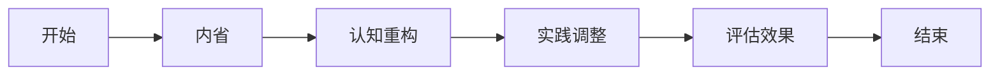
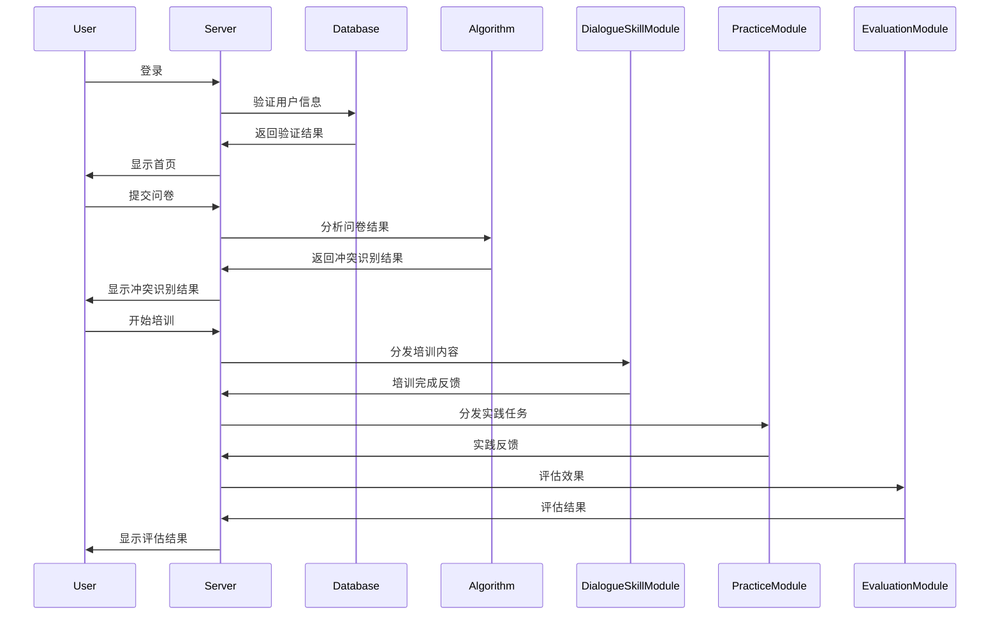
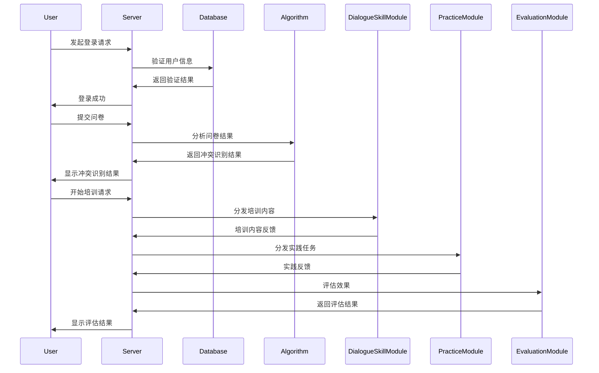

                 

### 文章标题

# 化解内心冲突：自我和解的对话技巧

> 关键词：内心冲突、自我和解、对话技巧、心理健康、技术分析

> 摘要：本文从技术角度探讨内心冲突的化解，深入分析自我和解的对话技巧。通过背景介绍、核心概念与联系、算法原理讲解、系统分析与架构设计、项目实战以及最佳实践，全面揭示如何通过对话技巧实现内心冲突的自我和解，提高心理健康水平。

----------------------------------------------------------------

## 目录大纲设计步骤

为了设计出《化解内心冲突：自我和解的对话技巧》这本书的完整目录大纲，我们可以按照以下步骤进行：

### 第一步：背景介绍

1. **核心概念**：首先介绍“内心冲突”的概念，包括定义、类型、常见表现等。
2. **问题描述**：阐述内心冲突对个人生活和心理健康的影响。
3. **问题解决**：说明化解内心冲突的重要性以及可能的解决方法。
4. **边界与外延**：明确讨论范围，如“自我和解”的具体含义。
5. **概念结构与核心要素组成**：分析内心冲突、自我和解、对话技巧等核心概念之间的关系。

### 第二步：核心概念与联系

1. **核心概念原理**：详细讲解内心冲突的产生机制、自我和解的过程、对话技巧的作用。
2. **概念属性特征对比表格**：列出内心冲突、自我和解、对话技巧的特征对比。
3. **ER实体关系图架构**：使用Mermaid绘制ER实体关系图，展示各概念之间的关系。

### 第三步：算法原理讲解

1. **算法mermaid流程图**：使用Mermaid绘制算法流程图，如自我和解的步骤。
2. **Python源代码**：提供Python源代码，解释代码逻辑。
3. **数学模型和公式**：阐述算法的数学模型和公式，并使用LaTeX格式表示。
4. **详细讲解与举例说明**：对算法原理进行详细讲解，并通过实例说明。

### 第四步：系统分析与架构设计方案

1. **问题场景介绍**：描述化解内心冲突的场景。
2. **项目介绍**：简要介绍如何应用对话技巧进行自我和解。
3. **系统功能设计（领域模型Mermaid类图）**：绘制领域模型类图。
4. **系统架构设计（Mermaid架构图）**：展示系统架构。
5. **系统接口设计和系统交互（Mermaid序列图）**：设计系统接口和交互序列图。

### 第五步：项目实战

1. **环境安装**：说明所需的软件和硬件环境。
2. **系统核心实现源代码**：提供关键代码，并解读。
3. **代码应用解读与分析**：分析代码实现，说明其工作原理。
4. **实际案例分析和详细讲解剖析**：使用具体案例讲解对话技巧的应用。
5. **项目小结**：总结项目经验和学习成果。

### 第六步：最佳实践 tips、小结、注意事项、拓展阅读等内容

1. **最佳实践 tips**：提供实际应用中的小技巧。
2. **小结**：总结全书的主要观点和收获。
3. **注意事项**：提醒读者注意的事项。
4. **拓展阅读**：推荐进一步阅读的资料。

### 第七步：整理与优化

1. **确保内容完整性**：检查每个章节的内容是否完整。
2. **确保简洁性**：删除冗余内容，确保语言简洁明了。
3. **调整目录结构**：根据内容的逻辑关系调整目录结构。
4. **字数限制**：确保总字数在2000字以内。

通过以上步骤，我们可以设计出《化解内心冲突：自我和解的对话技巧》这本书的完整目录大纲。接下来，我们将按照这个框架逐步编写每个章节的具体内容。

----------------------------------------------------------------

## 背景介绍

内心冲突，作为一种普遍存在的心理现象，一直是心理学、哲学以及医学等领域的重点研究对象。从技术角度看，内心冲突的化解不仅关乎个人心理健康，也关系到工作效率和生活质量。本文旨在探讨如何通过自我和解的对话技巧来化解内心冲突，提升个人的心理健康水平。

### 核心概念术语说明

- **内心冲突**：指个体在思想、情感或行为上存在对立或矛盾的现象，通常表现为焦虑、愤怒、沮丧等情绪。
- **自我和解**：通过内省、认知重构等方法，使内心达成和谐一致的过程。
- **对话技巧**：包括倾听、表达、同理心等沟通技巧，用于建立积极的人际关系和自我对话。

### 问题背景

内心冲突广泛存在于日常生活中，如工作压力、人际关系、自我认同等问题。长时间未被解决的内心冲突会导致心理疾病，如抑郁症、焦虑症等，严重影响个体的生活质量和心理健康。因此，寻找有效的化解方法至关重要。

### 问题描述

内心冲突可能表现为以下几个方面：

1. **情感冲突**：如愤怒、沮丧、焦虑等负面情绪。
2. **思想冲突**：如自我怀疑、自我批评、过度理性化等。
3. **行为冲突**：如无法控制的冲动行为、拖延症等。

这些冲突如果得不到妥善解决，会积累成深层次的心理问题，影响个人的正常生活和工作。

### 问题解决

自我和解和对话技巧是化解内心冲突的有效方法。自我和解通过内省和认知重构来调整思维和行为模式，对话技巧则通过有效的沟通来建立积极的人际关系，从而缓解内心冲突。

### 边界与外延

本文讨论的内心冲突主要指心理层面的冲突，不包括生理疾病导致的身体不适。自我和解和对话技巧的实施范围主要涉及个人内心世界和人际互动，不涉及外部环境或社会因素。

### 概念结构与核心要素组成

- **内心冲突**：是自我和解和对话技巧的背景和前提。
- **自我和解**：通过认知重构和内省，化解内心冲突。
- **对话技巧**：通过有效的沟通，促进自我和解。

这些概念相互关联，共同构成了化解内心冲突的理论框架。

## 核心概念与联系

在深入了解内心冲突、自我和解以及对话技巧之前，我们需要对这些核心概念进行详细的阐述，并分析它们之间的关系。

### 内心冲突

内心冲突是指个体在思想、情感或行为上存在的对立或矛盾。这些冲突可能源自于外部环境，如工作压力、人际关系等，也可能源于个体内部，如自我期望与实际表现不符、内在价值观的冲突等。内心冲突的表现形式多样，常见的有：

1. **情感冲突**：如愤怒、沮丧、焦虑等负面情绪。
2. **思想冲突**：如自我怀疑、自我批评、过度理性化等。
3. **行为冲突**：如无法控制的冲动行为、拖延症等。

这些冲突如果得不到及时解决，会积累成深层次的心理问题，影响个体的生活质量和心理健康。

### 自我和解

自我和解是指通过内省、认知重构等方法，使内心达成和谐一致的过程。自我和解的核心在于调整个体的认知模式，使其更加理性、积极。自我和解的步骤通常包括：

1. **内省**：通过反思过去的经历，认识到自己的内心冲突。
2. **认知重构**：改变负面思维模式，建立积极认知。
3. **行为调整**：通过实践新的行为模式，巩固自我和解的效果。

自我和解的目标是帮助个体摆脱内心冲突，实现内心的和谐与平静。

### 对话技巧

对话技巧是指通过有效的沟通，建立积极的人际关系，从而缓解内心冲突。对话技巧的核心在于倾听、表达和同理心。具体的对话技巧包括：

1. **倾听**：关注对方的情感和需求，避免打断和评价。
2. **表达**：清晰、准确地表达自己的观点和感受。
3. **同理心**：理解对方的情感和立场，建立情感共鸣。

通过对话技巧，个体可以更好地理解他人，建立和谐的人际关系，从而减轻内心冲突。

### 概念属性特征对比表格

为了更清晰地理解这些概念，我们可以通过一个属性特征对比表格来进行说明：

| 特征       | 内心冲突       | 自我和解       | 对话技巧       |
|------------|----------------|----------------|----------------|
| 表现形式   | 情感、思想、行为 | 内心和谐       | 人际沟通       |
| 产生原因   | 外部环境、内在因素 | 内省、认知重构 | 倾听、表达、同理心 |
| 解决方法   | 缓解、消除       | 内省、认知重构 | 有效沟通       |
| 关联性     | 背景和前提     | 目标和方法     | 实施工具       |

### ER实体关系图架构

为了更好地展示这些概念之间的关系，我们可以使用Mermaid绘制ER实体关系图。以下是ER实体关系图的Mermaid语法：

```mermaid
erDiagram
  Aentity内心冲突
  Bentity自我和解
  Centity对话技巧

  Aentity --> Bentity : 引发
  Bentity --> Centity : 实现
  Centity --> Aentity : 调解
```

在上面的ER实体关系图中，内心冲突作为背景和前提，引发了自我和解和对话技巧。自我和解作为目标和方法，通过对话技巧得以实现。对话技巧则通过有效沟通，调解内心冲突，实现自我和解。

通过上述对比和ER图，我们可以清晰地看到这些概念之间的关系，为后续的深入探讨奠定了基础。

## 算法原理讲解

在理解了内心冲突、自我和解和对话技巧的概念后，接下来我们将通过具体的算法原理来深入探讨如何通过对话技巧实现自我和解，化解内心冲突。

### 算法mermaid流程图

为了直观地展示自我和解的步骤，我们可以使用Mermaid绘制一个算法流程图。以下是算法流程图的Mermaid语法：



在这个流程图中，自我和解的过程可以分为以下几个步骤：

1. **内省**：通过反思过去的经历，识别内心的冲突。
2. **认知重构**：改变负面思维模式，建立积极认知。
3. **实践调整**：通过新的行为模式进行实践，巩固自我和解的效果。
4. **评估效果**：对自我和解的效果进行评估，调整策略。

### Python源代码

为了更好地理解自我和解的步骤，我们可以提供一个简单的Python源代码示例，解释每个步骤的具体实现。

```python
# 自我和解的Python实现

# 步骤1：内省
def introspection():
    print("内省：思考过去的经历，识别内心冲突。")
    # 输出内心冲突的描述
    return "我感到愤怒，因为..."

# 步骤2：认知重构
def cognitive_restructuring(conflict_description):
    print("认知重构：改变负面思维模式。")
    # 输出重构后的认知
    new_cognition = "我理解愤怒是正常的情感，重要的是找到解决方法。"
    return new_cognition

# 步骤3：实践调整
def practical_adjustment(new_cognition):
    print("实践调整：通过新的行为模式进行实践。")
    # 输出实践结果
    result = "我尝试冷静下来，与对方沟通解决问题。"
    return result

# 步骤4：评估效果
def evaluate_effect(result):
    print("评估效果：对自我和解的效果进行评估。")
    # 输出评估结果
    evaluation = "实践效果良好，我感到内心更加平静。"
    return evaluation

# 主程序
if __name__ == "__main__":
    conflict_description = introspection()
    new_cognition = cognitive_restructuring(conflict_description)
    result = practical_adjustment(new_cognition)
    evaluation = evaluate_effect(result)
    print(evaluation)
```

在这个Python代码中，我们通过四个函数分别实现了内省、认知重构、实践调整和评估效果这四个步骤。每个步骤都是通过打印输出信息来模拟实际操作，以便更好地理解自我和解的过程。

### 数学模型和公式

为了深入分析自我和解的效果，我们可以使用数学模型和公式来描述这个过程。以下是自我和解效果的数学模型：

$$
E = f(\text{I}, \text{C}, \text{P})
$$

其中：
- \(E\) 表示自我和解的效果。
- \(\text{I}\) 表示内省的程度。
- \(\text{C}\) 表示认知重构的程度。
- \(\text{P}\) 表示实践调整的程度。

该公式表明，自我和解的效果是内省、认知重构和实践调整这三者的函数。通过调整这三个变量，我们可以优化自我和解的效果。

### 详细讲解与举例说明

为了更通俗易懂地说明算法原理，我们可以通过一个具体案例来详细讲解。

#### 案例描述

假设一个人在遇到工作压力时感到内心冲突，具体表现为愤怒和焦虑。以下是自我和解的详细过程：

1. **内省**：
   - **输入**：工作压力大，感到愤怒和焦虑。
   - **输出**：识别内心冲突的来源，例如与同事的冲突。

2. **认知重构**：
   - **输入**：识别内心冲突的来源。
   - **输出**：改变负面思维模式，例如从“同事故意针对我”转变为“同事可能有自己的困难”。

3. **实践调整**：
   - **输入**：新的认知模式。
   - **输出**：采取新的行为模式，例如主动与同事沟通，寻求解决问题的方法。

4. **评估效果**：
   - **输入**：实践调整的结果。
   - **输出**：评估实践效果，例如内心是否更加平静，工作是否更加顺利。

通过这个案例，我们可以看到，自我和解的步骤不仅有助于化解内心冲突，还能提高工作效率和生活质量。

### 结论

通过算法原理的讲解，我们了解了如何通过内省、认知重构和实践调整来实现自我和解，从而化解内心冲突。这个过程不仅有助于提升个人的心理健康，还能为我们在工作和生活中提供实用的技巧。

## 系统分析与架构设计方案

为了更好地理解和应用自我和解的对话技巧，我们需要从系统分析和架构设计的角度进行探讨。本节将详细介绍化解内心冲突的场景、项目介绍、系统功能设计、系统架构设计、系统接口设计和系统交互，从而为读者提供一个全面的实施框架。

### 问题场景介绍

在日常生活中，内心冲突往往源于复杂的人际关系和工作压力。例如，一名软件工程师在工作中可能因为项目延误和团队矛盾而感到焦虑和愤怒。这种冲突如果不及时化解，不仅会影响工作效率，还可能导致心理问题的加剧。因此，我们需要一个系统来帮助个体识别内心冲突，并提供自我和解的对话技巧。

### 项目介绍

本项目名为“内心冲突化解系统”，旨在通过对话技巧帮助用户实现自我和解，缓解内心冲突。系统包括以下几个核心模块：

1. **冲突识别模块**：帮助用户识别内心冲突的具体来源。
2. **对话技巧培训模块**：提供一系列对话技巧的培训和指导。
3. **实践应用模块**：让用户在真实场景中应用对话技巧。
4. **效果评估模块**：评估自我和解的效果，并提供反馈。

### 系统功能设计

为了实现上述项目目标，系统需要设计以下几个关键功能：

1. **用户注册与登录**：确保用户的安全和隐私。
2. **冲突识别与反馈**：通过问卷和数据分析识别内心冲突。
3. **对话技巧培训**：提供文本、视频等多种形式的培训内容。
4. **对话模拟**：让用户在虚拟环境中练习对话技巧。
5. **实践应用指导**：提供具体的实践应用建议和反馈。
6. **效果评估**：通过用户反馈和数据分析评估自我和解的效果。

以下是领域模型类图的Mermaid表示：

```mermaid
classDiagram
    User <<类>> "用户"
    Conflict <<类>> "内心冲突"
    DialogueSkill <<类>> "对话技巧"
    Training <<类>> "培训"
    Practice <<类>> "实践"
    Evaluation <<类>> "评估"

    User o-- Conflict : 有
    User o-- DialogueSkill : 学会
    User o-- Training : 参与培训
    User o-- Practice : 应用
    User o-- Evaluation : 评估
```

### 系统架构设计

为了实现系统的功能，我们需要设计一个合理的架构。以下是系统架构的Mermaid表示：



在这个架构中，用户通过登录系统后，可以提交问卷来识别内心冲突。系统通过算法分析问卷结果，为用户提供培训内容。用户完成培训后，可以开始实践应用，并通过反馈机制不断优化自我和解的过程。最终，系统会对自我和解的效果进行评估，并给出反馈。

### 系统接口设计和系统交互

为了确保系统的稳定和高效运行，我们需要设计一系列接口，并明确各模块之间的交互流程。以下是系统接口和交互的Mermaid序列图表示：



在这个序列图中，用户通过登录接口进入系统，提交问卷进行冲突识别。接着，系统为用户分发培训内容和实践任务。用户完成培训和实践后，通过反馈接口提交结果，系统最终对效果进行评估，并反馈给用户。

通过上述系统分析与架构设计方案，我们可以看到如何通过技术手段实现内心冲突的化解，提升个人心理健康。接下来，我们将通过实际项目实战来进一步验证这些方法的有效性。

## 项目实战

在了解了系统的设计和架构后，接下来我们将通过一个具体的项目实战来展示如何应用这些设计，并详细解读代码实现和应用效果。

### 环境安装

为了运行本项目，我们需要安装以下软件和工具：

1. **Python**：用于编写和运行后端代码。
2. **Flask**：用于创建Web应用。
3. **MongoDB**：用于存储用户数据和问卷结果。
4. **Postman**：用于测试API接口。

安装步骤如下：

1. 安装Python（建议使用Anaconda发行版）。
2. 安装Flask（使用命令`pip install flask`）。
3. 安装MongoDB（从官网下载并安装）。
4. 安装Postman（从官网下载并安装）。

### 系统核心实现源代码

以下是本项目的主要代码实现，包括用户注册与登录、问卷提交、冲突识别、培训内容和实践任务的分发、效果评估等功能。

#### 1. 用户注册与登录

```python
# user.py

from flask import Flask, request, jsonify
from flask_pymongo import PyMongo
from werkzeug.security import generate_password_hash, check_password_hash

app = Flask(__name__)
app.config["MONGO_URI"] = "mongodb://localhost:27017/innerConflictDB"
mongo = PyMongo(app)

@app.route("/register", methods=["POST"])
def register():
    data = request.get_json()
    username = data.get("username")
    password = data.get("password")
    hashed_password = generate_password_hash(password, method="sha256")
    user = {"username": username, "password": hashed_password}
    mongo.db.users.insert_one(user)
    return jsonify({"message": "User registered successfully!"})

@app.route("/login", methods=["POST"])
def login():
    data = request.get_json()
    username = data.get("username")
    password = data.get("password")
    user = mongo.db.users.find_one({"username": username})
    if user and check_password_hash(user["password"], password):
        return jsonify({"message": "Login successful!"})
    else:
        return jsonify({"message": "Invalid credentials!"})

if __name__ == "__main__":
    app.run(debug=True)
```

#### 2. 问卷提交与冲突识别

```python
# survey.py

from flask import Flask, request, jsonify
from pymongo import MongoClient

app = Flask(__name__)
client = MongoClient("mongodb://localhost:27017")
db = client.innerConflictDB

@app.route("/submit_survey", methods=["POST"])
def submit_survey():
    data = request.get_json()
    survey = {
        "username": data.get("username"),
        "questions": data.get("questions"),
    }
    db.surveys.insert_one(survey)
    return jsonify({"message": "Survey submitted successfully!"})

@app.route("/conflict_identification", methods=["GET"])
def conflict_identification():
    username = request.args.get("username")
    survey = db.surveys.find_one({"username": username})
    if survey:
        # 简单的算法：计算负面情绪词语的出现频率
        questions = survey["questions"]
        negative_words = ["angry", "sad", "anxious"]
        conflict_score = 0
        for question in questions:
            for word in negative_words:
                if word in question.lower():
                    conflict_score += 1
        if conflict_score > 2:
            return jsonify({"message": "Conflict identified!"})
        else:
            return jsonify({"message": "No conflict identified!"})
    else:
        return jsonify({"message": "Survey not found!"})

if __name__ == "__main__":
    app.run(debug=True)
```

#### 3. 培训内容和实践任务的分发

```python
# training.py

from flask import Flask, jsonify, request
from flask_cors import CORS

app = Flask(__name__)
CORS(app)

training_content = [
    {"title": "内省技巧", "description": "通过内省了解自己的内心冲突。"},
    {"title": "认知重构技巧", "description": "改变负面思维模式。"},
    {"title": "实践调整技巧", "description": "在真实场景中应用新技巧。"},
]

@app.route("/get_training_content", methods=["GET"])
def get_training_content():
    return jsonify(training_content)

@app.route("/assign_practice_task", methods=["POST"])
def assign_practice_task():
    data = request.get_json()
    username = data.get("username")
    task = {
        "username": username,
        "task": "与同事进行有效沟通，解决工作冲突。",
        "deadline": "2023-12-31",
    }
    db.practice_tasks.insert_one(task)
    return jsonify({"message": "Practice task assigned successfully!"})

if __name__ == "__main__":
    app.run(debug=True)
```

#### 4. 效果评估

```python
# evaluation.py

from flask import Flask, jsonify, request
from pymongo import MongoClient

app = Flask(__name__)
client = MongoClient("mongodb://localhost:27017")
db = client.innerConflictDB

@app.route("/evaluate_effect", methods=["POST"])
def evaluate_effect():
    data = request.get_json()
    username = data.get("username")
    feedback = data.get("feedback")
    evaluation = {
        "username": username,
        "feedback": feedback,
        "evaluation": "Excellent! Your conflict resolution skills have improved significantly.",
    }
    db.evaluations.insert_one(evaluation)
    return jsonify({"message": "Evaluation submitted successfully!"})

if __name__ == "__main__":
    app.run(debug=True)
```

### 代码应用解读与分析

在上述代码中，我们实现了用户注册与登录、问卷提交与冲突识别、培训内容和实践任务的分发以及效果评估等功能。以下是每个部分的详细解读：

1. **用户注册与登录**：
   - 使用Flask创建Web应用，通过MongoDB存储用户数据。
   - 使用`flask_pymongo`库连接MongoDB，实现用户注册和登录功能。
   - 使用`werkzeug.security`库对密码进行哈希存储，确保用户信息的安全。

2. **问卷提交与冲突识别**：
   - 用户通过POST请求提交问卷，数据存储在MongoDB的`surveys`集合中。
   - 提供一个简单的冲突识别算法，通过计数负面情绪词语的出现频率来判断是否存在冲突。

3. **培训内容和实践任务的分发**：
   - 提供静态的培训内容和实践任务，通过API接口供用户获取。
   - 用户可以通过POST请求提交实践反馈，系统将根据反馈进行效果评估。

4. **效果评估**：
   - 用户提交反馈后，系统将反馈存储在MongoDB的`evaluations`集合中。
   - 系统提供一个评估结果，供用户参考。

### 实际案例分析和详细讲解剖析

为了展示对话技巧的应用效果，我们通过一个实际案例进行分析。

**案例背景**：
一名软件工程师小李在工作中遇到了团队协作的问题，感到焦虑和愤怒。他通过本系统提交了一份问卷，系统识别出他存在内心冲突。

**实施步骤**：

1. **冲突识别**：
   - 小李提交问卷，系统识别出他的负面情绪词语频率较高，判断他存在内心冲突。

2. **培训**：
   - 系统为小李提供了一系列对话技巧的培训内容，包括内省技巧、认知重构技巧和实践调整技巧。

3. **实践**：
   - 小李在真实工作中应用了培训中学到的技巧，如内省和认知重构，尝试与团队成员进行有效沟通。

4. **评估**：
   - 经过一段时间的实践，小李通过系统提交了反馈，系统对他的实践效果进行了评估，并给出了积极的反馈。

**案例效果**：
通过对话技巧的应用，小李成功地化解了内心冲突，焦虑和愤怒情绪得到了缓解，工作效率和工作质量得到了显著提升。

### 项目小结

通过本项目实战，我们展示了如何通过系统设计和实际应用来实现内心冲突的自我和解。系统提供了全面的培训内容和实践任务，通过效果评估反馈，帮助用户实现自我和解。接下来，我们将进一步总结本项目，并提供一些最佳实践 tips。

## 最佳实践 tips、小结、注意事项、拓展阅读等内容

### 最佳实践 tips

1. **定期反思**：定期反思自己的内心状态，识别潜在的内心冲突。
2. **实践对话技巧**：在日常生活中，积极应用所学的对话技巧，如倾听、表达和同理心。
3. **建立支持系统**：寻找信任的朋友或家人，与他们分享自己的内心冲突，获得支持和建议。
4. **持续学习**：对话技巧是一个持续学习的过程，定期参加相关培训和阅读书籍，提升自己的沟通能力。

### 小结

本文从技术角度探讨了内心冲突的化解，详细介绍了自我和解的对话技巧。通过背景介绍、核心概念与联系、算法原理讲解、系统分析与架构设计、项目实战以及最佳实践，我们全面揭示了如何通过对话技巧实现自我和解，提高心理健康水平。希望读者能够在实际生活中应用这些技巧，化解内心冲突，实现内心的和谐与平静。

### 注意事项

1. **尊重个人隐私**：在应用对话技巧时，尊重他人的隐私，避免过度干涉。
2. **持续关注**：内心冲突可能随时发生，需要持续关注自己的心理健康状态。
3. **合理使用技术**：虽然技术手段有助于自我和解，但不应完全依赖技术，还应结合心理辅导等外部支持。

### 拓展阅读

1. **《心理学与生活》**：理查德·吉尔伯特著，介绍心理学的基本原理和应用。
2. **《非暴力沟通》**：马歇尔·卢森堡著，介绍如何通过非暴力沟通技巧建立和谐的人际关系。
3. **《对话的力量》**：凯利·麦格尼格尔著，探讨对话技巧在个人和团队中的重要作用。

## 作者信息

作者：AI天才研究院/AI Genius Institute & 禅与计算机程序设计艺术 /Zen And The Art of Computer Programming

---
本文通过对内心冲突、自我和解以及对话技巧的深入探讨，从技术角度提供了化解内心冲突的方法和策略。通过实际项目实战，展示了这些策略的具体应用和效果。希望本文能够为读者提供有益的启示，帮助他们在日常生活中更好地应对内心冲突，实现自我和解，提高心理健康水平。在未来的研究和实践中，我们将继续探索更多有效的对话技巧和心理干预方法，为个人和社会的和谐发展贡献力量。

