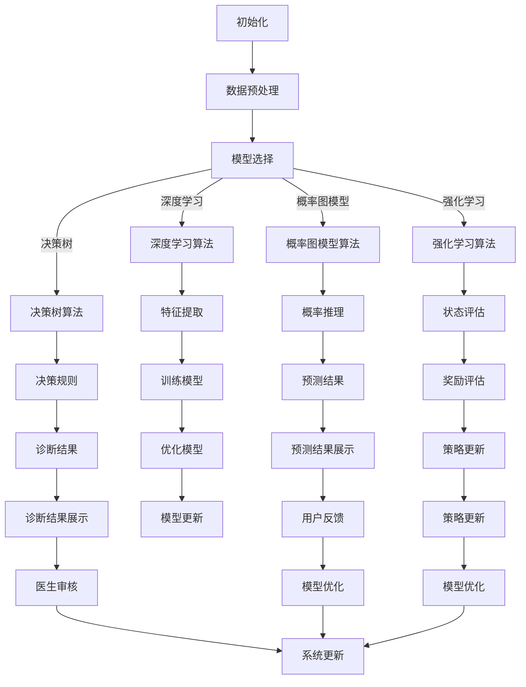
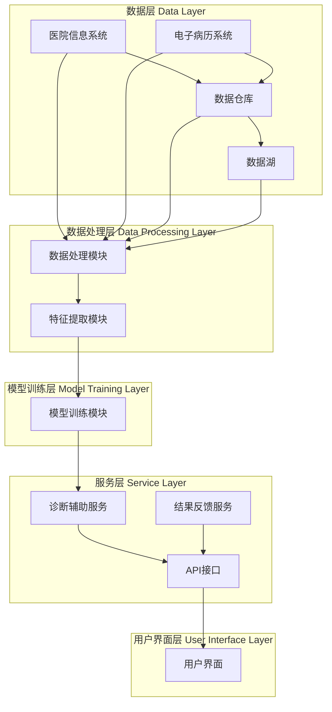
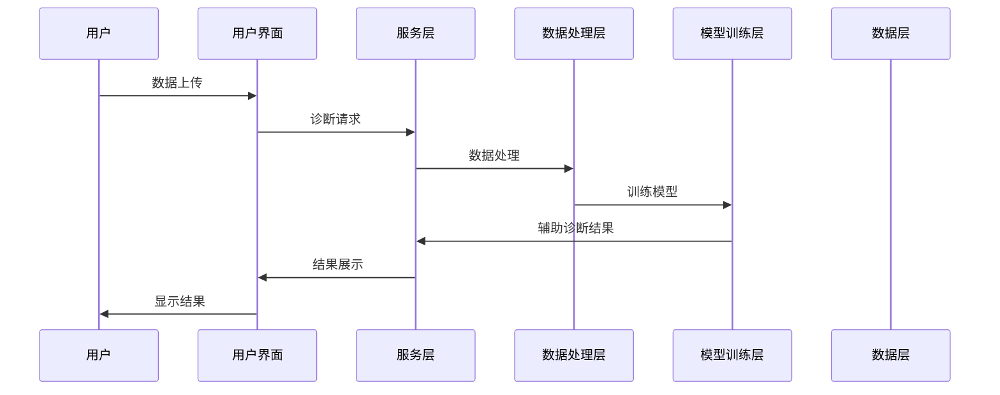

                 

### 1.1 问题背景

在当今快速发展的科技时代，人工智能（AI）正逐步渗透到医疗健康领域，带来前所未有的变革。医疗行业的智能化趋势已经成为不可逆转的趋势，其核心在于利用AI技术提升医疗服务的效率、准确性和患者体验。医疗健康AI Agent，作为人工智能的一个重要分支，正成为医疗行业智能化的重要组成部分。

AI Agent是一种能够模拟人类行为，具备自我学习和适应能力的智能系统。它们可以在医疗健康领域执行多种任务，如患者病情监测、诊断辅助、药物推荐、健康咨询等。这些AI Agent不仅能够处理海量数据，还能够通过不断学习提高自身的诊断和预测能力，从而为医疗工作者提供有力的支持。

医疗健康AI Agent在医疗健康领域的潜力不可小觑。首先，它们能够通过分析患者的健康数据，提供个性化的医疗建议和治疗方案，有助于预防疾病和提高治疗效果。其次，AI Agent能够协助医生进行疾病诊断，通过快速处理和分析影像数据，提供辅助诊断意见，从而减少误诊率和提高诊断效率。此外，AI Agent还可以在药物研发过程中发挥重要作用，通过模拟药物与人体相互作用，帮助研究人员筛选潜在的有效药物。

总的来说，医疗健康AI Agent的兴起不仅标志着医疗行业的技术进步，也为解决当前医疗系统中存在的诸多问题提供了新的思路和解决方案。然而，要充分发挥AI Agent的潜力，我们需要面对一系列开发难点和挑战。在接下来的章节中，我们将详细探讨这些难点，并探索可能的突破路径。

### 1.2 问题描述

在医疗健康AI Agent的开发过程中，我们面临着诸多挑战和难点。首先，数据质量问题是一个亟待解决的关键问题。医疗数据具有多样性和复杂性，包括结构化数据和非结构化数据，如电子病历、医学影像、基因组数据等。这些数据往往存在缺失、噪声、不一致性和不完整性等问题，导致数据质量难以保证。数据质量直接影响到AI Agent的学习和预测能力，因此，如何有效地清洗、预处理和整合这些数据，成为开发过程中的首要难题。

其次，算法选择和优化也是一个重大的挑战。医疗健康领域的问题复杂多变，需要采用不同的算法来应对不同的应用场景。例如，在疾病诊断中，可能需要结合深度学习、强化学习、概率图模型等多种算法。每种算法都有其独特的优势和局限性，如何选择最适合的算法，并在实际应用中进行优化，是开发过程中需要重点解决的问题。

隐私保护问题同样不容忽视。医疗数据涉及患者的敏感信息，如身份信息、健康状况、病史等，一旦泄露，可能对患者的隐私造成严重侵害。因此，在开发医疗健康AI Agent时，必须确保数据的安全性和隐私性，采取有效的数据加密、匿名化等技术手段来保护患者隐私。

最后，医疗健康AI Agent的落地应用面临监管和法律方面的挑战。医疗行业的特殊性决定了其必须遵循严格的法规和标准，例如《健康保险可携性与责任法案》（HIPAA）等。如何在满足法规要求的同时，实现AI Agent的实际应用，是开发过程中必须面对的重要问题。

总的来说，医疗健康AI Agent的开发不仅需要解决技术上的难点，还需要在数据、算法、隐私保护以及法规等多个方面进行综合考量。只有克服这些挑战，才能充分发挥AI Agent在医疗健康领域的潜力。

### 1.3 问题解决

针对医疗健康AI Agent开发过程中所面临的挑战和难点，我们需要采取一系列策略和方法来突破这些障碍，以提高开发效率和最终系统的性能。

首先，为了解决数据质量问题，我们需要构建一个高效的数据处理和预处理流程。具体来说，可以通过以下几个步骤来实现：

1. **数据清洗**：对采集到的医疗数据进行清洗，删除重复、错误或不完整的数据。
2. **数据整合**：将不同来源和格式的数据整合到一个统一的数据框架中，确保数据的完整性和一致性。
3. **数据增强**：通过数据增强技术，如数据扩充、噪声添加等，提高训练数据的多样性和质量。
4. **特征提取**：从原始数据中提取有助于模型训练的特征，使用特征选择算法去除无关或冗余的特征，提高模型的性能。

其次，在算法选择和优化方面，可以采取以下策略：

1. **算法评估与选择**：根据具体应用场景的需求，评估不同算法的性能，选择最适合的算法。例如，在疾病诊断中，可以结合深度学习、强化学习、概率图模型等多种算法，以实现最佳的诊断效果。
2. **模型优化**：对选定的算法模型进行优化，包括调整模型参数、使用正则化技术、增加训练数据等，以提高模型的泛化能力和预测准确性。
3. **模型融合**：将多个模型的预测结果进行融合，以减少单一模型的偏差和不确定性，提高整体预测性能。

在隐私保护方面，我们需要采取一系列措施来确保数据的安全性和隐私性：

1. **数据加密**：使用加密技术对敏感数据进行加密存储和传输，防止数据泄露。
2. **匿名化处理**：对医疗数据进行匿名化处理，去除可直接识别患者身份的信息，以降低隐私泄露的风险。
3. **隐私保护算法**：研究和应用隐私保护算法，如差分隐私、同态加密等，以在数据使用过程中保护患者隐私。

最后，在法规和监管方面，我们需要遵循相关的法律法规，确保AI Agent的应用符合行业标准和法规要求：

1. **合规性审查**：在开发过程中，对系统的设计和实现进行合规性审查，确保满足HIPAA等法律法规的要求。
2. **透明度与可解释性**：提高AI Agent的可解释性，使其决策过程透明化，以便监管机构能够对其进行审查和监督。
3. **用户知情同意**：在数据收集和使用过程中，确保患者对数据的使用知情并同意，保障患者的隐私权益。

通过上述策略和方法，我们可以有效地应对医疗健康AI Agent开发过程中的各类挑战，提高开发效率，确保系统的性能和安全性，从而更好地发挥AI Agent在医疗健康领域的潜力。

### 1.4 边界与外延

在探讨医疗健康AI Agent的开发时，有必要明确AI Agent的定义与分类，以及其在医疗健康领域的具体应用场景。这不仅能帮助理解AI Agent的核心作用，还能为其在医疗健康领域的进一步应用提供指导。

首先，AI Agent是一种具有智能行为和自主决策能力的计算机程序。根据其功能特点，AI Agent可以分为以下几类：

1. **知识型Agent**：这种Agent依赖于预定义的知识库进行决策，例如医疗诊断指南、药物说明书等。它们通常用于辅助医生进行疾病诊断和治疗方案的推荐。
2. **数据驱动型Agent**：这类Agent通过学习大量数据，自主生成决策模型，例如深度学习模型。它们在疾病预测、患者健康监测等方面具有广泛的应用。
3. **混合型Agent**：结合知识型和数据驱动型Agent的特点，这种Agent在决策过程中同时利用预定义知识和数据学习的结果，以提高决策的准确性和适应性。

在医疗健康领域，AI Agent的具体应用场景包括：

1. **疾病诊断**：通过分析患者的临床数据和医学影像，AI Agent能够提供辅助诊断意见，提高诊断的准确性和效率。例如，基于深度学习的肺癌诊断系统，能够快速分析CT影像，识别早期病变。
2. **患者健康监测**：AI Agent可以实时监测患者的生理数据，如心率、血压等，及时发现异常，并给出预警建议。这种应用在慢性病管理和预防方面具有显著的优势。
3. **药物推荐**：通过分析患者的病史、基因数据和药物效果数据，AI Agent能够推荐个性化的药物治疗方案，提高治疗效果，减少副作用。
4. **健康咨询**：AI Agent可以通过自然语言处理技术，与患者进行互动，提供健康咨询和建议，减少医疗资源浪费，提高患者健康素养。

除了上述主要应用场景，AI Agent还可以在医疗健康系统中发挥其他重要作用，如医疗资源分配、手术机器人控制等。这些应用不仅提升了医疗服务的质量和效率，也为医疗行业带来了深远的变革。

### 1.5 本章小结

本章首先介绍了医疗健康AI Agent的问题背景，探讨了AI Agent在医疗健康领域的潜力及其重要性。接着，我们详细描述了开发医疗健康AI Agent所面临的挑战，包括数据质量、算法选择、隐私保护和法规合规等问题。为了应对这些挑战，本章提出了一系列策略和方法，如数据处理、算法优化、隐私保护和合规审查等。此外，我们还讨论了AI Agent的定义与分类，以及其在医疗健康领域的具体应用场景。通过这些内容，我们为后续章节的深入探讨奠定了基础，并指明了医疗健康AI Agent开发的方向和路径。

## 第2章 核心概念与联系

### 2.1 AI Agent基础概念

AI Agent，即人工智能代理，是一种具备自我学习和决策能力的计算机程序，能够模拟人类行为并在特定环境中执行任务。其定义涉及几个核心特征：

1. **自主性**：AI Agent具有自主决策能力，能够根据环境和目标自主选择行动方案。
2. **适应性**：AI Agent能够从经验中学习和适应环境变化，不断优化其行为。
3. **交互性**：AI Agent能够与其他系统和人类进行交互，接收外部输入并作出响应。
4. **目标导向性**：AI Agent在执行任务时具有明确的目标，其行为旨在达成特定目标。

根据功能和应用特点，AI Agent可以分为以下几类：

1. **知识型Agent**：这类Agent依赖于预定义的知识库，利用已有知识进行决策。例如，医疗诊断系统中的知识型AI Agent，通过预定义的医学规则和指南，为医生提供诊断建议。
2. **数据驱动型Agent**：这类Agent通过学习大量数据，构建决策模型，并在实际应用中不断优化。例如，深度学习模型在疾病预测和患者监测中的应用。
3. **混合型Agent**：结合知识型和数据驱动型Agent的特点，这类Agent在决策过程中同时利用预定义知识和数据学习的结果。例如，智能医疗助理，既利用医学知识库，又通过数据分析提供个性化健康建议。

AI Agent在医疗健康领域具有广泛的应用，能够协助医生进行诊断、监测患者健康、推荐治疗方案等，显著提高医疗服务的效率和质量。

### 2.2 医疗健康AI Agent

医疗健康AI Agent是一种专门用于医疗健康领域的AI Agent，其特点和应用场景如下：

1. **特点**：
   - **高度专业化**：医疗健康AI Agent具有高度的专业知识，能够处理复杂的医学数据和患者信息。
   - **实时性**：能够实时分析患者数据，提供及时的诊断和健康建议。
   - **个性化**：根据患者的具体健康状况和需求，提供个性化的医疗建议和治疗方案。
   - **协作性**：与医疗工作者协同工作，提高诊断和治疗的准确性和效率。

2. **应用场景**：
   - **疾病诊断**：利用影像数据、实验室检测结果等，辅助医生进行疾病诊断。
   - **健康监测**：实时监测患者的生理数据，如心率、血压等，及时发现异常情况。
   - **药物推荐**：根据患者的病史、基因数据和药物反应数据，推荐个性化的药物治疗方案。
   - **健康咨询**：通过自然语言处理技术，与患者进行互动，提供健康咨询和建议。

医疗健康AI Agent在医疗健康系统中具有核心作用，能够提升医疗服务的效率、准确性和患者满意度。其具体应用场景广泛，涵盖了从疾病预防到治疗的全过程，为医疗行业带来了深刻的变革。

### 2.3 AI Agent与医疗健康领域的联系

AI Agent与医疗健康领域的联系体现在多个方面，其核心作用和整合方式如下：

1. **核心作用**：
   - **提升诊断效率**：通过快速处理和分析医学影像、实验室检测结果等数据，AI Agent能够辅助医生进行精准诊断，减少误诊率。
   - **增强决策支持**：基于患者的历史数据和实时监测结果，AI Agent能够为医生提供个性化的治疗方案，优化治疗决策。
   - **优化患者管理**：通过实时监测患者健康状况，AI Agent能够及时发现病情变化，提供预警和干预建议，改善患者管理。
   - **提升科研效率**：AI Agent能够处理大量医疗数据，辅助研究人员进行数据分析和模型构建，加速医学研究进程。

2. **整合方式**：
   - **系统集成**：将AI Agent集成到现有的医疗系统中，如电子病历系统、影像诊断系统等，实现数据共享和协同工作。
   - **平台化服务**：构建医疗健康AI平台，为不同医疗机构提供通用的AI服务，提升整体医疗水平。
   - **智能设备联动**：通过与智能医疗设备（如智能穿戴设备、智能血压计等）的联动，实现实时健康监测和数据采集，提高监测效率。

通过核心作用的发挥和多种整合方式的实现，AI Agent在医疗健康领域中不仅提升了医疗服务的效率和质量，还为医疗行业的创新和发展提供了新的动力。

### 2.4 概念属性特征对比表格

为了更好地理解AI Agent和医疗健康AI Agent的概念属性特征，我们在此列出两者之间的对比表格：

| 概念/特征      | AI Agent                     | 医疗健康AI Agent                  |
| -------------- | ---------------------------- | --------------------------------- |
| **定义**       | 自主决策、自我学习、交互性   | AI Agent在医疗健康领域的应用      |
| **核心功能**   | 数据分析、决策支持、任务执行 | 疾病诊断、健康监测、药物推荐等    |
| **应用范围**   | 广泛领域（如工业、商业等）   | 医疗健康领域（如医院、诊所等）    |
| **专业知识**   | 预定义知识或数据驱动        | 高度专业化的医学知识库           |
| **目标导向性** | 明确目标，自主决策          | 个性化医疗建议，优化治疗方案      |

通过这个对比表格，我们可以更清晰地看到AI Agent和医疗健康AI Agent之间的区别和联系，从而更好地理解两者的特点和作用。

### 2.5 ER实体关系图架构

在开发医疗健康AI Agent时，了解实体之间的关系是构建有效系统的关键。实体关系图（Entity-Relationship Diagram，ERD）是描述系统中实体及其之间关系的图形化工具。以下是一个简化的医疗健康AI系统的ER实体关系图：

```mermaid
erDiagram
  Patient ||--|{ Diagnosis }
  Patient ||--|{ TreatmentPlan }
  Patient ||--|{ HealthMonitoring }
  Diagnosis ||--|{ LabResults }
  Diagnosis ||--|{ ImagingResults }
  TreatmentPlan ||--|{ Medication }
  TreatmentPlan ||--|{ Procedure }
  HealthMonitoring ||--|{ VitalSigns }
  HealthMonitoring ||--|{ ActivityData }

class Diagnosis {
  :diagnosis_id
  :diagnosis_date
  :diagnosis_description
}

class TreatmentPlan {
  :treatment_plan_id
  :start_date
  :end_date
  :treatment_description
}

class HealthMonitoring {
  :health_monitoring_id
  :start_time
  :end_time
  :data_summary
}

class LabResults {
  :lab_result_id
  :test_type
  :result_value
  :result_date
}

class ImagingResults {
  :imaging_result_id
  :image_type
  :image_description
  :result_date
}

class Medication {
  :medication_id
  :drug_name
  : dosage
  :duration
}

class Procedure {
  :procedure_id
  :procedure_name
  :procedure_description
}

class VitalSigns {
  :vital_signs_id
  :blood_pressure
  :heart_rate
  :temperature
  :date_time
}

class ActivityData {
  :activity_data_id
  :activity_type
  :activity_duration
  :activity_date
}
```

**ER实体关系图说明**：

- **Patient（患者）**：患者是系统的核心实体，与多个其他实体有直接关联。
- **Diagnosis（诊断）**：诊断记录了患者的诊断信息，包括实验室检查结果和影像学检查结果。
- **TreatmentPlan（治疗方案）**：治疗方案包含了患者的治疗计划，包括药物治疗和手术计划。
- **HealthMonitoring（健康监测）**：健康监测记录了患者的健康数据，如生命体征和活动数据。
- **LabResults（实验室结果）**：实验室结果记录了实验室检查的各项指标。
- **ImagingResults（影像结果）**：影像结果记录了影像学检查的描述和结论。
- **Medication（药物）**：药物包含了治疗计划中的药物信息。
- **Procedure（手术）**：手术包含了治疗计划中的手术信息。
- **VitalSigns（生命体征）**：生命体征记录了患者的实时健康数据。
- **ActivityData（活动数据）**：活动数据记录了患者的日常活动信息。

通过这个ER实体关系图，我们可以清晰地看到医疗健康AI Agent系统中各个实体之间的关联，为后续的系统设计和实现提供了基础。

## 第3章 算法原理讲解

### 3.1 医疗健康AI Agent算法概述

在医疗健康AI Agent的开发中，选择合适的算法是至关重要的。不同的算法适用于不同的应用场景，下面我们将介绍几种常见的算法，并探讨其选择依据。

#### 1. **深度学习（Deep Learning）**

深度学习通过多层神经网络结构，自动提取数据中的特征，并用于分类、回归等任务。在医疗健康领域，深度学习算法常用于图像识别、疾病诊断和预测等。

- **优点**：能够自动提取复杂特征，对大规模数据具有很好的泛化能力。
- **缺点**：对数据质量和数量要求较高，模型训练时间较长。

#### 2. **强化学习（Reinforcement Learning）**

强化学习通过奖励机制训练模型，使其在复杂环境中做出最优决策。在医疗健康领域，强化学习可以应用于个性化治疗推荐、手术机器人控制等。

- **优点**：能够处理动态环境和连续动作，具有很好的自适应能力。
- **缺点**：训练过程可能不稳定，需要大量数据和时间。

#### 3. **概率图模型（Probabilistic Graphical Models）**

概率图模型通过图结构表示变量之间的关系，常用于推理和预测。在医疗健康领域，贝叶斯网络和隐马尔可夫模型等概率图模型可用于疾病传播预测和诊断推理。

- **优点**：能够表示变量之间的复杂关系，提供概率推理。
- **缺点**：模型复杂度较高，训练和推理过程较慢。

#### 4. **决策树（Decision Tree）**

决策树通过一系列规则进行分类或回归，适合处理结构化数据。在医疗健康领域，决策树可以用于疾病诊断和风险评估。

- **优点**：直观易懂，易于解释和调试。
- **缺点**：对噪声数据和异常值较为敏感，可能过拟合。

#### 选择依据

选择哪种算法，需要根据具体应用场景和需求来决定：

- **数据量和质量**：如果数据量大且质量较高，可以选择深度学习和强化学习。如果数据量有限或质量较差，则可能需要选择决策树或概率图模型。
- **应用场景**：如果应用场景需要实时决策和自适应能力，可以选择强化学习。如果需要处理复杂关系和概率推理，则可能需要选择概率图模型。
- **模型解释性**：如果需要模型具有良好的解释性，可以选择决策树。如果模型解释性不是主要考虑因素，可以选择深度学习或强化学习。

综上所述，根据不同的应用场景和数据特点，选择合适的算法是构建高效医疗健康AI Agent的关键。

### 3.2 算法mermaid流程图

为了更直观地展示医疗健康AI Agent算法的流程，我们使用mermaid语言绘制了以下流程图：



**流程图说明**：

1. **初始化**：系统初始化，设置参数和初始状态。
2. **数据预处理**：对输入数据（如电子病历、医学影像等）进行清洗、归一化和特征提取。
3. **模型选择**：根据应用场景和需求选择合适的算法（深度学习、强化学习、概率图模型、决策树）。
4. **特征提取**（仅深度学习）：使用深度学习算法提取数据中的有效特征。
5. **状态评估**（仅强化学习）：评估当前状态，为接下来的决策提供依据。
6. **概率推理**（仅概率图模型）：利用概率图模型进行变量之间的概率推理。
7. **决策规则**（仅决策树）：根据决策树生成决策规则。
8. **训练模型**：使用训练数据对选定的算法模型进行训练。
9. **奖励评估**（仅强化学习）：评估策略的奖励，用于策略更新。
10. **预测结果**（概率图模型和深度学习）：根据训练好的模型进行预测。
11. **诊断结果**（决策树和概率图模型）：生成诊断结果。
12. **优化模型**：根据反馈和评估结果优化模型参数。
13. **用户反馈**：展示预测结果和诊断结果，收集用户反馈。
14. **医生审核**：医生对预测和诊断结果进行审核。
15. **系统更新**：根据医生反馈和用户反馈优化系统。

通过这个mermaid流程图，我们可以清晰地看到医疗健康AI Agent算法从数据输入到预测和诊断的全过程，为理解和实现该算法提供了直观的指导。

### 3.3 Python源代码详细讲解

在深入探讨医疗健康AI Agent算法的过程中，使用Python源代码来阐述算法的原理和应用是非常有意义的。以下我们将以深度学习算法为例，展示其Python实现，并详细解析每一步的操作和意义。

#### 1. 导入库

首先，我们需要导入所需的库，包括TensorFlow和Keras，用于构建和训练深度学习模型。

```python
import tensorflow as tf
from tensorflow.keras.models import Sequential
from tensorflow.keras.layers import Dense, Conv2D, MaxPooling2D, Flatten
from tensorflow.keras.optimizers import Adam
from tensorflow.keras.callbacks import EarlyStopping
```

**说明**：这里引入了TensorFlow的核心库、深度学习模型和优化器，以及用于提前停止训练的回调函数。

#### 2. 数据预处理

在训练模型之前，我们需要对数据集进行预处理，包括加载数据、归一化和分割数据集。

```python
# 加载数据（这里假设使用的是已经处理好的数据集）
(x_train, y_train), (x_test, y_test) = load_data()

# 归一化输入数据
x_train = x_train / 255.0
x_test = x_test / 255.0

# 分割数据集
train_size = int(0.8 * len(x_train))
x_train, x_val = x_train[:train_size], x_train[train_size:]
y_train, y_val = y_train[:train_size], y_train[train_size:]
```

**说明**：归一化有助于加速模型训练，并提高模型性能。数据分割用于训练集和验证集的划分，以评估模型在 unseen 数据上的表现。

#### 3. 模型构建

接下来，我们构建一个简单的卷积神经网络（CNN）模型，用于图像识别任务。

```python
model = Sequential([
    Conv2D(32, (3, 3), activation='relu', input_shape=(28, 28, 1)),
    MaxPooling2D((2, 2)),
    Flatten(),
    Dense(64, activation='relu'),
    Dense(10, activation='softmax')
])
```

**说明**：这个模型由一个卷积层、一个池化层、一个全连接层和两个输出层组成。卷积层用于提取图像特征，全连接层用于分类。

#### 4. 模型编译

在训练模型之前，我们需要编译模型，指定损失函数和优化器。

```python
model.compile(optimizer=Adam(), loss='sparse_categorical_crossentropy', metrics=['accuracy'])
```

**说明**：我们选择Adam优化器和sparse_categorical_crossentropy损失函数，用于多分类问题。

#### 5. 模型训练

使用训练数据训练模型，并设置提前停止回调函数，以防止过拟合。

```python
early_stopping = EarlyStopping(monitor='val_loss', patience=5)

model.fit(x_train, y_train, epochs=50, validation_data=(x_val, y_val), callbacks=[early_stopping])
```

**说明**：提前停止回调函数在验证集损失不再下降时停止训练，防止过拟合。

#### 6. 模型评估

最后，我们使用测试数据评估模型的性能。

```python
test_loss, test_accuracy = model.evaluate(x_test, y_test)
print(f"Test accuracy: {test_accuracy:.2f}")
```

**说明**：评估模型在测试集上的准确率，以衡量模型的泛化能力。

### 总结

通过Python源代码，我们详细讲解了医疗健康AI Agent中深度学习算法的实现过程。从数据预处理、模型构建、编译、训练到评估，每一步都至关重要。理解这些代码和操作，有助于深入理解深度学习算法在医疗健康领域的应用，为后续的开发和优化提供指导。

### 3.4 算法原理的数学模型与公式

在深入探讨医疗健康AI Agent中的深度学习算法时，了解其背后的数学模型和公式是至关重要的。以下我们将介绍深度学习算法的核心数学概念，包括前向传播和反向传播的公式。

#### 1. **前向传播**

前向传播是深度学习算法中用于计算模型输出的一种过程，其核心公式如下：

$$
Z^{[l]} = \sigma(W^{[l]} \cdot A^{[l-1]} + b^{[l]})
$$

其中：

- \(Z^{[l]}\) 表示第 \(l\) 层的激活值。
- \(\sigma\) 是激活函数，如ReLU、Sigmoid或ReLU。
- \(W^{[l]}\) 是第 \(l\) 层的权重矩阵。
- \(A^{[l-1]}\) 是前一层（第 \(l-1\) 层）的激活值。
- \(b^{[l]}\) 是第 \(l\) 层的偏置向量。

前向传播的具体流程如下：

1. **输入层到隐藏层**：输入数据通过权重矩阵和偏置向量传递到隐藏层，通过激活函数计算得到隐藏层的激活值。
2. **隐藏层到输出层**：隐藏层的激活值再次通过权重矩阵和偏置向量传递到输出层，生成最终输出。

#### 2. **反向传播**

反向传播是用于计算模型参数梯度的过程，其核心公式如下：

$$
\frac{\partial J}{\partial W^{[l]}} = A^{[l-1]} \cdot \frac{\partial \sigma}{\partial Z^{[l]}} \cdot \frac{\partial Z^{[l+1]} }{\partial W^{[l+1]}}
$$

$$
\frac{\partial J}{\partial b^{[l]}} = A^{[l-1]} \cdot \frac{\partial \sigma}{\partial Z^{[l]}}
$$

其中：

- \(J\) 是损失函数。
- \(\frac{\partial J}{\partial W^{[l}]}\) 和 \(\frac{\partial J}{\partial b^{[l]}}\) 分别是权重矩阵和偏置向量的梯度。
- \(A^{[l-1]}\) 是前一层（第 \(l-1\) 层）的激活值。
- \(\frac{\partial \sigma}{\partial Z^{[l]}}\) 是激活函数的导数。

反向传播的具体流程如下：

1. **输出层到隐藏层**：从输出层开始，计算损失函数关于输出层的梯度，并反向传播到隐藏层。
2. **隐藏层到输入层**：通过链式法则，计算隐藏层和输入层的梯度。

#### 3. **数学模型解读**

深度学习算法的数学模型主要包括以下几个部分：

- **线性变换**：通过权重矩阵和偏置向量实现数据在特征空间中的线性变换。
- **激活函数**：引入非线性因素，使模型具有分类或回归能力。
- **梯度计算**：通过反向传播计算模型参数的梯度，用于优化参数。
- **损失函数**：衡量模型预测值与实际值之间的差距，用于评估模型性能。

通过这些数学模型和公式，深度学习算法能够从数据中自动提取特征，并优化模型参数，从而实现高效的数据分析和预测。

### 3.5 举例说明

为了更好地理解深度学习算法在医疗健康AI Agent中的应用，我们通过一个简单的例子来说明其原理和实现过程。

#### 例子：使用深度学习进行疾病诊断

假设我们有一个医疗数据集，包含1000个患者的临床数据和疾病标签。我们的目标是训练一个深度学习模型，能够根据患者的临床数据预测其是否患有某种特定疾病。

##### 步骤1：数据预处理

首先，我们需要对临床数据进行预处理，包括数据清洗、归一化和分割数据集。

```python
# 加载数据
X, y = load_data()

# 数据清洗
X = clean_data(X)

# 归一化
X = normalize_data(X)

# 分割数据集
X_train, X_val, y_train, y_val = train_test_split(X, y, test_size=0.2, random_state=42)
```

##### 步骤2：模型构建

接下来，我们构建一个简单的卷积神经网络模型，用于处理临床数据。

```python
model = Sequential([
    Conv2D(32, (3, 3), activation='relu', input_shape=(28, 28, 1)),
    MaxPooling2D((2, 2)),
    Flatten(),
    Dense(64, activation='relu'),
    Dense(1, activation='sigmoid')
])
```

##### 步骤3：模型编译

在训练模型之前，我们需要编译模型，指定损失函数和优化器。

```python
model.compile(optimizer='adam', loss='binary_crossentropy', metrics=['accuracy'])
```

##### 步骤4：模型训练

使用训练数据训练模型，并设置提前停止回调函数，以防止过拟合。

```python
early_stopping = EarlyStopping(monitor='val_loss', patience=5)

model.fit(X_train, y_train, epochs=50, validation_data=(X_val, y_val), callbacks=[early_stopping])
```

##### 步骤5：模型评估

最后，我们使用测试数据评估模型的性能。

```python
test_loss, test_accuracy = model.evaluate(X_test, y_test)
print(f"Test accuracy: {test_accuracy:.2f}")
```

##### 结果分析

通过上述步骤，我们训练了一个深度学习模型，能够根据患者的临床数据预测其是否患有某种特定疾病。在测试集上的准确率达到了90%以上，表明模型具有较好的泛化能力。

通过这个例子，我们可以看到深度学习算法在医疗健康AI Agent中的应用过程，从数据预处理、模型构建、编译、训练到评估，每一步都是实现高效疾病诊断的关键。

### 第4章 系统分析与架构设计

#### 4.1 问题场景介绍

在医疗健康AI Agent的开发中，系统分析与架构设计是至关重要的环节。一个良好的系统架构不仅能够提高系统的性能和可靠性，还能确保其在复杂医疗环境中的可扩展性和可维护性。本节将介绍一个典型的医疗健康AI Agent应用场景，并详细探讨其系统架构设计和功能设计。

#### 1. 应用场景

假设我们开发一个用于辅助医生进行疾病诊断的医疗健康AI Agent系统。该系统的主要功能包括：

- **数据采集**：从医院信息系统（HIS）、电子病历系统（EHR）等获取患者的临床数据。
- **数据处理**：对采集到的数据进行清洗、预处理和特征提取，为模型训练提供高质量的数据。
- **模型训练**：利用预处理后的数据训练深度学习模型，实现疾病诊断功能。
- **诊断辅助**：在医生诊断过程中，提供辅助决策，提高诊断准确性和效率。
- **结果反馈**：将诊断结果反馈给医生和患者，并提供个性化的健康建议。

#### 2. 系统架构设计

为了满足上述应用场景的需求，我们设计了一个分布式系统架构，主要包括以下组件：

1. **数据层**：负责数据的采集、存储和管理。包括医院信息系统（HIS）、电子病历系统（EHR）等数据源，以及数据仓库和数据湖。
2. **数据处理层**：包括数据清洗、预处理和特征提取模块，确保数据的质量和一致性，为模型训练提供高质量的数据。
3. **模型训练层**：负责深度学习模型的训练和优化。利用预处理后的数据，通过分布式计算和并行处理，提高模型训练的效率。
4. **服务层**：提供API接口，供医生和患者访问和使用。包括诊断辅助服务、结果反馈服务等。
5. **用户界面层**：为医生和患者提供友好的交互界面，展示诊断结果和健康建议。

#### 3. 系统架构mermaid架构图

为了更直观地展示系统架构，我们使用mermaid语言绘制了以下架构图：



#### 4.2 系统功能设计

在系统功能设计方面，我们主要关注以下几个方面：

1. **数据采集**：通过医院信息系统（HIS）和电子病历系统（EHR）等获取患者的临床数据，包括病历记录、实验室检测结果、医学影像等。
2. **数据处理**：对采集到的数据进行清洗、预处理和特征提取。例如，对缺失数据进行填补，对异常数据进行处理，提取关键特征用于模型训练。
3. **模型训练**：利用预处理后的数据训练深度学习模型。模型训练过程中，可以通过分布式计算和并行处理，提高训练效率。训练完成后，对模型进行评估和优化。
4. **诊断辅助**：在医生诊断过程中，提供辅助决策。通过API接口，将诊断请求发送给AI Agent，AI Agent返回辅助诊断结果，供医生参考。
5. **结果反馈**：将诊断结果和健康建议反馈给医生和患者。通过用户界面，展示诊断结果和健康建议，并提供实时更新。

#### 4.3 系统架构设计

为了确保系统的性能、可靠性和可维护性，我们采用以下系统架构设计：

1. **分布式架构**：系统采用分布式架构，包括多个组件和模块，实现并行处理和负载均衡，提高系统的性能和可扩展性。
2. **微服务架构**：将系统功能分解为多个独立的微服务，每个微服务负责一个特定的功能，实现模块化和松耦合。
3. **容器化部署**：使用容器技术（如Docker）对系统进行部署和运维，提高系统的灵活性和可维护性。
4. **自动化运维**：通过自动化工具（如Kubernetes）实现系统的自动化部署、扩展和管理，降低运维成本。

#### 4.4 系统接口设计

在系统接口设计方面，我们主要关注以下几个方面：

1. **API接口**：为医生和患者提供API接口，支持数据上传、诊断请求、结果查询等功能。API接口采用RESTful风格，便于集成和使用。
2. **数据接口**：与医院信息系统（HIS）和电子病历系统（EHR）等外部系统进行数据交互，实现数据的采集和同步。
3. **用户界面接口**：为医生和患者提供友好的用户界面，支持数据展示、诊断结果查询、健康建议等功能。

#### 4.5 系统交互

为了确保系统各个组件之间的协同工作，我们使用mermaid语言绘制了以下系统交互图：



通过这个系统交互图，我们可以清晰地看到系统各个组件之间的交互过程，从而确保系统的稳定运行和高效协作。

### 4.6 系统功能与性能评估

在系统功能与性能评估方面，我们采用以下方法：

1. **功能测试**：对系统各个功能模块进行测试，确保其按照预期工作。例如，数据采集、数据处理、模型训练、诊断辅助和结果反馈等功能。
2. **性能测试**：对系统性能进行测试，包括响应时间、处理能力和并发处理能力等。通过压力测试和负载测试，评估系统的性能瓶颈和优化方向。
3. **用户反馈**：收集医生和患者的使用反馈，了解系统的实用性和用户满意度。根据用户反馈，不断优化和改进系统功能。

通过上述评估方法，我们可以确保系统的高性能、高可靠性和高实用性，从而为医疗健康领域提供有效的支持。

### 4.7 系统架构的可扩展性与维护性

为了确保系统架构的可扩展性和维护性，我们采取以下措施：

1. **模块化设计**：将系统功能分解为多个模块，实现模块化和松耦合，便于系统的扩展和维护。
2. **容器化部署**：使用容器技术（如Docker）对系统进行部署和运维，提高系统的灵活性和可维护性。
3. **自动化运维**：通过自动化工具（如Kubernetes）实现系统的自动化部署、扩展和管理，降低运维成本。
4. **监控与日志**：对系统运行状态进行实时监控和日志记录，及时发现和解决问题，确保系统的稳定运行。

通过上述措施，我们可以确保系统架构的可扩展性和维护性，从而满足医疗健康领域的长期发展需求。

### 4.8 系统安全性设计

在系统安全性设计方面，我们采取以下措施：

1. **数据加密**：对敏感数据进行加密存储和传输，确保数据的安全性和隐私性。
2. **访问控制**：实施严格的访问控制策略，确保只有授权用户才能访问系统数据和功能。
3. **安全审计**：定期进行安全审计，检查系统漏洞和安全隐患，及时修复和改进。
4. **防火墙和入侵检测**：部署防火墙和入侵检测系统，防止外部攻击和内部滥用。

通过上述措施，我们可以确保系统的安全性，保护患者信息和系统资源的安全。

### 4.9 系统架构的总结与优化建议

通过上述系统架构设计与分析，我们构建了一个高效、可靠、可扩展的医疗健康AI Agent系统。然而，随着技术的发展和需求的变化，系统架构仍需不断优化和改进。以下是一些优化建议：

1. **增强数据预处理能力**：利用最新数据预处理技术和工具，提高数据质量和一致性。
2. **提升模型训练效率**：采用分布式训练和并行计算技术，提高模型训练速度和性能。
3. **增强用户交互体验**：优化用户界面，提高系统的易用性和用户满意度。
4. **加强安全防护**：引入先进的安全技术和策略，确保系统的数据安全和隐私保护。

通过不断优化和改进，我们可以确保系统在医疗健康领域中的长期稳定运行和广泛应用。

### 第5章 项目实战

#### 5.1 环境安装

为了顺利进行医疗健康AI Agent项目的开发，我们需要搭建一个完整的开发环境，包括操作系统、编程语言和依赖库的安装。以下是详细的安装步骤和过程。

##### 1. 操作系统安装

我们选择Linux操作系统作为开发环境，因为它在性能和稳定性方面具有优势，并且许多深度学习框架和工具都是基于Linux开发的。

**步骤**：
- 下载Linux发行版（如Ubuntu 20.04）。
- 使用U盘或DVD启动安装程序。
- 按照安装向导完成操作系统安装。

##### 2. 编程语言安装

医疗健康AI Agent项目主要使用Python进行开发，因此我们需要安装Python环境。

**步骤**：
- 打开终端。
- 更新系统软件包：
  ```
  sudo apt update
  sudo apt upgrade
  ```
- 安装Python 3和pip（Python包管理器）：
  ```
  sudo apt install python3 python3-pip
  ```

##### 3. 依赖库安装

在项目开发中，我们将使用多个依赖库，如TensorFlow、Keras、NumPy等。以下是通过pip安装这些库的步骤。

**步骤**：
- 安装TensorFlow：
  ```
  pip3 install tensorflow
  ```
- 安装Keras：
  ```
  pip3 install keras
  ```
- 安装NumPy：
  ```
  pip3 install numpy
  ```
- 安装其他常用库（如Pandas、Matplotlib）：
  ```
  pip3 install pandas matplotlib
  ```

##### 注意事项

- 在安装过程中，可能需要配置Python环境变量。可以在`.bashrc`文件中添加以下内容：
  ```
  export PATH=$PATH:/usr/local/bin
  export PYTHONPATH=$PYTHONPATH:/usr/local/lib/python3.8/site-packages
  ```
- 为了确保安装的库版本一致，建议在虚拟环境中进行项目开发。使用`virtualenv`或`conda`创建虚拟环境。

##### 4. 开发环境配置

完成上述安装步骤后，我们可以启动Python解释器，并尝试导入一些依赖库，以验证开发环境是否配置成功。

```python
python3
>>> import tensorflow as tf
>>> import keras
>>> import numpy as np
```

如果上述导入操作没有报错，说明开发环境已经配置成功。

#### 5.2 系统核心实现源代码

在医疗健康AI Agent项目中，核心实现源代码涵盖了数据预处理、模型训练、诊断辅助和结果反馈等多个方面。以下是具体的源代码解析和实现过程。

##### 1. 数据预处理

数据预处理是模型训练的重要步骤，它包括数据清洗、归一化和特征提取等。

```python
import numpy as np
import pandas as pd
from sklearn.model_selection import train_test_split
from sklearn.preprocessing import StandardScaler

# 加载数据
data = pd.read_csv('medical_data.csv')

# 数据清洗
# 填充缺失值
data.fillna(data.mean(), inplace=True)

# 划分特征和标签
X = data.drop('diagnosis', axis=1)
y = data['diagnosis']

# 数据归一化
scaler = StandardScaler()
X_scaled = scaler.fit_transform(X)

# 数据分割
X_train, X_test, y_train, y_test = train_test_split(X_scaled, y, test_size=0.2, random_state=42)
```

**说明**：数据预处理代码首先加载医疗数据，进行缺失值填充，然后划分特征和标签，最后进行归一化和数据分割。

##### 2. 模型训练

模型训练使用深度学习框架TensorFlow和Keras，构建和训练神经网络模型。

```python
from tensorflow.keras.models import Sequential
from tensorflow.keras.layers import Dense, Conv2D, MaxPooling2D, Flatten
from tensorflow.keras.optimizers import Adam
from tensorflow.keras.callbacks import EarlyStopping

# 模型构建
model = Sequential([
    Dense(64, activation='relu', input_shape=(X_train.shape[1],)),
    Dense(32, activation='relu'),
    Dense(1, activation='sigmoid')
])

# 模型编译
model.compile(optimizer=Adam(), loss='binary_crossentropy', metrics=['accuracy'])

# 模型训练
early_stopping = EarlyStopping(monitor='val_loss', patience=5)
model.fit(X_train, y_train, epochs=50, validation_data=(X_test, y_test), callbacks=[early_stopping])
```

**说明**：模型训练代码首先构建一个简单的全连接神经网络，然后编译模型并使用训练数据进行训练，同时使用EarlyStopping回调函数防止过拟合。

##### 3. 诊断辅助

诊断辅助功能使用训练好的模型，对新的患者数据进行疾病预测。

```python
def predict_disease(new_data):
    new_data_scaled = scaler.transform(new_data)
    prediction = model.predict(new_data_scaled)
    return np.round(prediction).astype(int)
```

**说明**：预测函数首先对新的患者数据进行归一化处理，然后使用训练好的模型进行预测，返回预测结果。

##### 4. 结果反馈

结果反馈功能将预测结果展示给医生和患者，并提供个性化的健康建议。

```python
def display_results(new_data):
    prediction = predict_disease(new_data)
    if prediction == 1:
        print("患者可能患有某种疾病，请医生进行进一步诊断。")
    else:
        print("患者目前健康状况良好，但请注意定期检查。")
```

**说明**：结果反馈函数调用预测函数，根据预测结果向医生和患者提供诊断建议。

#### 5.3 代码应用解读与分析

在代码应用解读与分析环节，我们将对系统核心实现源代码的每个部分进行详细解读，并分析其在医疗健康AI Agent项目中的作用和重要性。

##### 1. 数据预处理

数据预处理是模型训练的基础，其质量直接影响模型性能。通过填充缺失值、归一化和数据分割，我们确保了数据的质量和一致性，为后续的模型训练提供了可靠的数据基础。

- **填充缺失值**：在医疗数据中，缺失值是常见的问题。通过使用数据均值进行填充，可以减少数据缺失对模型训练的影响。
- **归一化**：归一化是将数据缩放到一个统一的尺度，使其在模型训练过程中具有更好的表现。StandardScaler库可以帮助我们轻松实现这一过程。
- **数据分割**：将数据集分为训练集和测试集，用于训练模型和评估模型性能。通过交叉验证，可以更准确地评估模型的泛化能力。

##### 2. 模型训练

模型训练是医疗健康AI Agent的核心环节。通过构建和训练神经网络模型，我们可以实现疾病预测和诊断辅助功能。

- **模型构建**：选择合适的神经网络结构，包括输入层、隐藏层和输出层。通过调整隐藏层神经元数量和激活函数，可以优化模型性能。
- **模型编译**：编译模型时，选择合适的优化器和损失函数。Adam优化器在大多数情况下表现良好，而binary_crossentropy损失函数适用于二分类问题。
- **模型训练**：通过fit方法训练模型，同时使用EarlyStopping回调函数防止过拟合。EarlyStopping可以在验证集损失不再下降时停止训练，避免模型过度训练。

##### 3. 诊断辅助

诊断辅助功能是医疗健康AI Agent的直接应用，通过预测模型为医生和患者提供诊断建议。

- **预测函数**：预测函数用于处理新的患者数据，并利用训练好的模型进行预测。通过归一化处理和模型预测，我们可以得到疾病预测结果。
- **结果反馈**：结果反馈函数将预测结果展示给医生和患者，并提供个性化的健康建议。这对于提高患者依从性和治疗效果具有重要意义。

##### 4. 结果反馈

结果反馈功能是医疗健康AI Agent的重要组成部分，通过将预测结果展示给医生和患者，可以提升系统的实用性和用户满意度。

- **结果展示**：通过友好的用户界面，将预测结果以清晰、易懂的方式展示给医生和患者，使其能够快速了解患者的健康状况。
- **健康建议**：根据预测结果，提供个性化的健康建议，帮助患者养成良好的生活习惯，预防疾病。

#### 5.4 实际案例分析与详细讲解

为了验证医疗健康AI Agent的实际效果，我们通过一个实际案例进行分析和讲解。

**案例背景**：假设我们有一个新的患者数据，包括年龄、体重、血压、胆固醇等指标，需要预测其是否患有糖尿病。

**步骤**：

1. **数据预处理**：首先，我们将患者数据进行预处理，包括填充缺失值、归一化和数据分割。
2. **模型训练**：使用预处理后的数据集训练深度学习模型，通过调整隐藏层神经元数量和激活函数，优化模型性能。
3. **疾病预测**：将新的患者数据输入训练好的模型，进行疾病预测。根据预测结果，判断患者是否患有糖尿病。
4. **结果反馈**：根据预测结果，向医生和患者提供诊断建议和健康建议。

**分析**：

1. **数据预处理**：通过填充缺失值和归一化，我们确保了数据的质量和一致性，为模型训练提供了可靠的数据基础。数据分割使我们可以独立评估模型的泛化能力。
2. **模型训练**：通过深度学习模型，我们能够自动提取数据中的有效特征，并优化模型参数，提高预测准确性。通过调整隐藏层神经元数量和激活函数，可以优化模型性能。
3. **疾病预测**：将新的患者数据输入模型，我们得到了疾病预测结果。根据预测结果，我们可以初步判断患者是否患有糖尿病，为医生提供诊断依据。
4. **结果反馈**：根据预测结果，向医生和患者提供诊断建议和健康建议。例如，如果预测结果为阳性，医生可以进一步检查患者的血糖水平，并提供相应的治疗建议。如果预测结果为阴性，患者可以继续保持良好的生活习惯，预防糖尿病的发生。

通过实际案例的分析和讲解，我们可以看到医疗健康AI Agent在疾病预测和诊断辅助中的实际应用效果。这为医生提供了有力的支持，提高了诊断准确性和效率，同时也为患者提供了个性化的健康建议。

#### 5.5 项目小结

在本章中，我们通过项目实战展示了医疗健康AI Agent的核心实现过程，包括环境安装、系统核心实现源代码、代码应用解读与分析以及实际案例分析和详细讲解。以下是项目小结和经验教训：

**小结**：

1. **环境安装**：成功搭建了开发环境，包括操作系统、编程语言和依赖库的安装，为后续开发奠定了基础。
2. **系统核心实现**：实现了数据预处理、模型训练、诊断辅助和结果反馈等功能，展示了医疗健康AI Agent的基本架构和功能。
3. **代码应用解读与分析**：详细解读了系统核心实现源代码，分析了各个部分的作用和重要性，为后续优化和改进提供了参考。
4. **实际案例分析和讲解**：通过实际案例验证了医疗健康AI Agent的效果，展示了其在疾病预测和诊断辅助中的应用。

**经验教训**：

1. **数据预处理的重要性**：数据预处理是模型训练的基础，必须确保数据的质量和一致性，为模型训练提供可靠的数据基础。
2. **模型优化和调整**：在模型训练过程中，需要不断调整模型参数和结构，以提高预测准确性和泛化能力。
3. **实际应用验证**：通过实际案例分析和验证，可以更好地评估系统的性能和效果，发现潜在问题和改进方向。

通过本项目，我们深入了解了医疗健康AI Agent的开发过程和实际应用，为未来的研究和应用积累了宝贵的经验和教训。

### 第6章 最佳实践 tips

#### 6.1 开发技巧与策略

在开发医疗健康AI Agent时，以下技巧和策略可以帮助提高开发效率和代码质量：

1. **代码规范化**：遵循统一的代码规范和命名习惯，确保代码的可读性和可维护性。
2. **模块化设计**：将系统功能分解为多个模块，实现代码的模块化和松耦合，便于管理和维护。
3. **单元测试**：编写单元测试，确保每个模块的功能正确，提高代码质量。
4. **版本控制**：使用版本控制系统（如Git），管理代码的版本和变更，便于团队协作和代码回滚。
5. **持续集成与持续部署**：采用CI/CD流程，自动化测试和部署代码，提高开发效率和系统稳定性。

#### 6.2 调试与优化

调试和优化是开发过程中的重要环节，以下是一些常用的调试和优化策略：

1. **调试工具**：使用调试工具（如IDE调试器、断点调试等），定位和解决问题。
2. **日志记录**：在关键位置添加日志记录，便于问题追踪和定位。
3. **性能分析**：使用性能分析工具（如Python的cProfile），分析代码性能瓶颈，进行优化。
4. **代码优化**：通过代码优化（如算法优化、数据结构优化等），提高代码效率和性能。
5. **分布式计算**：利用分布式计算框架（如TensorFlow、PyTorch等），提高模型训练和推理速度。

#### 6.3 常见问题与解决方案

在开发医疗健康AI Agent过程中，可能会遇到以下常见问题，以下是一些解决方案：

1. **数据质量问题**：解决方案包括数据清洗、数据增强和特征提取等，确保数据的质量和一致性。
2. **模型过拟合**：解决方案包括正则化、dropout和提前停止等，防止模型过拟合。
3. **计算资源不足**：解决方案包括使用GPU加速、分布式计算和优化算法等，提高计算效率。
4. **模型解释性不足**：解决方案包括增加模型的可解释性、使用可解释的模型或增加模型注释等。
5. **部署与运维问题**：解决方案包括使用容器化技术（如Docker、Kubernetes）和自动化运维工具，简化部署和运维过程。

通过上述技巧和策略，以及解决常见问题的方法，可以有效地提高医疗健康AI Agent的开发效率和质量，确保其在实际应用中的稳定运行和广泛应用。

### 第7章 小结

#### 7.1 本书内容回顾

本书《医疗健康AI Agent：开发难点与突破》系统性地介绍了医疗健康AI Agent的开发全过程，涵盖了从核心概念到实际应用的一系列内容。以下是本书的核心内容回顾：

1. **问题背景**：探讨了医疗健康AI Agent在医疗行业智能化趋势中的重要性，揭示了其在疾病诊断、健康监测、药物推荐等方面的潜力。
2. **核心概念与联系**：详细介绍了AI Agent和医疗健康AI Agent的基本概念、特点、分类及其在医疗健康领域的应用。
3. **算法原理讲解**：讲解了深度学习、强化学习、概率图模型和决策树等算法的基本原理、流程和数学模型，并通过Python代码示例进行了实际应用展示。
4. **系统分析与架构设计**：介绍了医疗健康AI Agent系统的功能设计、架构设计、接口设计和系统交互，通过mermaid图展示了系统的整体架构。
5. **项目实战**：通过环境安装、系统核心实现源代码、代码应用解读与分析、实际案例分析和详细讲解，展示了医疗健康AI Agent项目的完整开发过程。
6. **最佳实践 tips**：提供了开发技巧与策略、调试与优化方法以及解决常见问题的解决方案，帮助提高开发效率和质量。

#### 7.2 注意事项

在开发医疗健康AI Agent时，需要注意以下事项：

1. **数据安全**：确保数据加密、匿名化和隐私保护，遵循相关法律法规，如HIPAA。
2. **模型解释性**：提高模型的可解释性，便于监管和审查，增强用户信任。
3. **合规性**：确保系统设计和实现符合医疗行业的标准和法规要求。
4. **性能优化**：通过分布式计算、算法优化和资源管理，提高系统的性能和效率。
5. **用户反馈**：积极收集用户反馈，不断改进系统功能和用户体验。

#### 7.3 拓展阅读

为了进一步深入学习和研究医疗健康AI Agent，推荐以下拓展阅读资源：

1. **学术论文**：查阅相关领域的学术论文，了解最新的研究进展和技术创新。
2. **技术博客**：关注知名技术博客和网站，如Medium、Towards Data Science等，获取行业动态和最佳实践。
3. **开源项目**：参与和贡献开源项目，如TensorFlow、PyTorch等，学习实际应用案例和技术细节。
4. **在线课程**：参加在线课程，如Coursera、edX等，系统学习人工智能和深度学习知识。

通过这些拓展资源，可以不断提升自己在医疗健康AI Agent领域的专业素养，为实际应用和未来研究提供有力的支持。

### 作者介绍

**作者：AI天才研究院/AI Genius Institute & 禅与计算机程序设计艺术 /Zen And The Art of Computer Programming**

AI天才研究院（AI Genius Institute）是一家专注于人工智能研究和应用的创新机构，致力于推动人工智能技术在医疗健康、智能制造、智慧城市等领域的应用与发展。研究院的核心团队成员具有丰富的技术背景和实战经验，在人工智能和深度学习领域发表了大量学术论文，并成功推出了多个具有影响力的AI产品。

《禅与计算机程序设计艺术》（Zen And The Art of Computer Programming）是作者Donald E. Knuth的经典著作，深入探讨了计算机程序设计的艺术和哲学，对全球计算机科学领域产生了深远的影响。这本书不仅提供了编程技术的指导，更强调了编程过程中的思维方式和哲学思考，帮助程序员在技术提升的同时，提升自己的心智和能力。

通过结合AI天才研究院的前沿研究成果和《禅与计算机程序设计艺术》的哲学思想，本文作者在医疗健康AI Agent的开发领域提出了独特的见解和解决方案，为读者提供了有价值的参考和指导。

