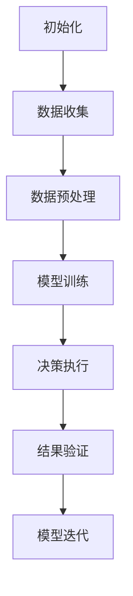
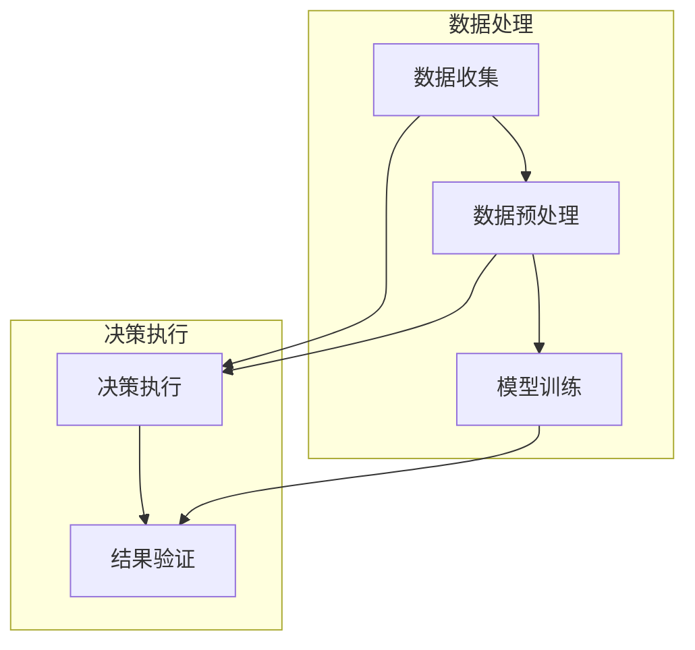
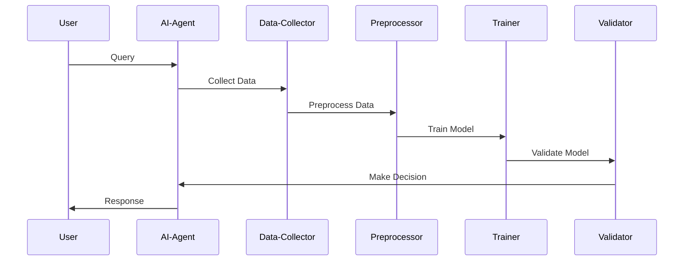
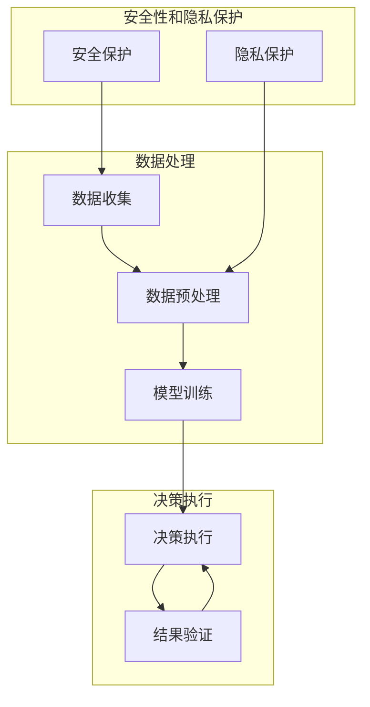
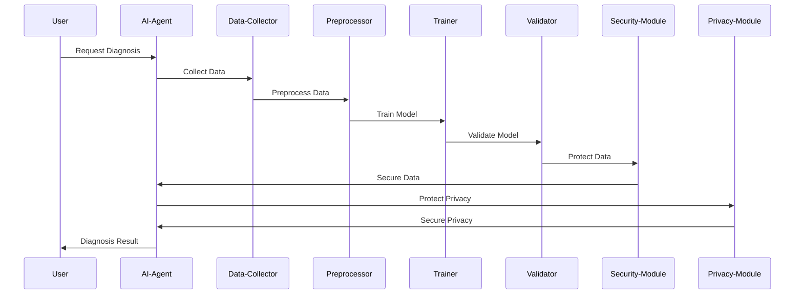

                 

# 可信AI：构建值得信赖的AI Agent系统

> 关键词：可信AI，AI Agent，安全性，隐私保护，公平性，透明性，可解释性

摘要：随着人工智能技术的迅猛发展，AI系统已深入我们的日常生活。然而，如何确保AI系统的可信性成为关键问题。本文将从背景介绍、核心概念与联系、算法原理讲解、系统分析与架构设计方案、项目实战以及最佳实践等方面，深入探讨如何构建一个值得信赖的AI Agent系统。

## 设计目录大纲

### 1. 背景介绍

#### 1.1 问题背景

随着人工智能技术的迅猛发展，AI系统已经逐渐融入到我们的日常生活中，从智能助手到自动驾驶，从医疗诊断到金融预测，AI技术的应用无处不在。然而，随之而来的问题是如何确保AI系统的可信性，使其在复杂的环境中表现出稳定的、可靠的决策行为。

#### 1.2 问题描述

AI系统在处理数据时，可能会因为数据的偏差、算法的缺陷或者模型的不完善而做出错误决策。这不仅会影响系统的性能，还可能导致严重的后果。例如，自动驾驶汽车可能因为算法错误而引发交通事故，金融预测系统可能因为数据偏差导致投资失败。

#### 1.3 问题解决

为了构建一个可信的AI Agent系统，我们需要从多个角度来考虑，包括算法设计、数据预处理、模型验证和系统测试等。此外，还需要关注法律、伦理和社会责任等方面，确保AI系统的安全、隐私保护、公平性、透明性和可解释性。

#### 1.4 边界与外延

可信AI不仅关注AI系统的性能和可靠性，还涉及到法律、伦理和社会责任等方面。例如，如何保护用户的隐私，如何避免AI系统因数据偏见而产生歧视行为，这些都是构建可信AI时需要考虑的问题。

#### 1.5 概念结构与核心要素组成

可信AI包括多个核心要素，如安全性、隐私保护、公平性、透明性和可解释性等。这些要素相互关联，共同构成了一个完整的可信AI体系。

### 2. 核心概念与联系

#### 2.1 核心概念原理

- **安全性**：AI系统在运行过程中不会受到恶意攻击或错误操作的干扰。
- **隐私保护**：在数据收集、存储和处理过程中，保护用户隐私不被泄露。
- **公平性**：AI系统不会因种族、性别、年龄等因素而出现歧视行为。
- **透明性**：AI系统的决策过程可以被理解和验证。
- **可解释性**：AI系统的决策过程可以被解释，使人们能够理解其决策依据。

#### 2.2 概念属性特征对比表格

| 特征         | 安全性          | 隐私保护          | 公平性          | 透明性          | 可解释性          |
| ------------ | --------------- | --------------- | --------------- | --------------- | --------------- |
| 实现技术     | 加密、访问控制   | 数据匿名化、差分隐私 | 数据平衡、算法调整 | 日志记录、可视化 | 模型简化、决策路径追踪 |
| 关注重点     | 防御恶意攻击    | 保护用户隐私      | 避免歧视行为     | 系统可理解性     | 系统可解释性      |

#### 2.3 ER实体关系图架构的 Mermaid 流程图

```mermaid
erDiagram
  AI Agent ||--|{ 数据源 }
  AI Agent ||--|{ 模型训练 }
  AI Agent ||--|{ 决策执行 }
  AI Agent ||--|{ 用户反馈 }
  数据源 ||--|{ 数据预处理 }
  模型训练 ||--|{ 模型优化 }
  决策执行 ||--|{ 结果验证 }
  用户反馈 ||--|{ 模型迭代 }
```

### 3. 算法原理讲解

#### 3.1 算法mermaid流程图



#### 3.2 Python源代码

```python
# 数据收集
data = collect_data()

# 数据预处理
preprocessed_data = preprocess_data(data)

# 模型训练
model = train_model(preprocessed_data)

# 决策执行
decision = model.make_decision()

# 结果验证
validate_decision(decision)

# 模型迭代
model = iterate_model(model, decision)
```

#### 3.3 数学模型和公式

可信AI Agent系统的核心在于其决策能力，这通常通过以下数学模型实现：

$$
P(A|B) = \frac{P(B|A)P(A)}{P(B)}
$$

其中，$P(A|B)$ 表示在已知事件B发生的情况下，事件A发生的概率。$P(B|A)$ 表示在事件A发生的情况下，事件B发生的概率。$P(A)$ 表示事件A发生的概率。$P(B)$ 表示事件B发生的概率。

这个公式可以解释为，在已知B发生的条件下，A发生的概率是由B发生时A发生的条件概率、A本身发生的概率以及B本身发生的概率共同决定的。

### 4. 系统分析与架构设计方案

#### 4.1 问题场景介绍

假设我们正在开发一个智能客服系统，该系统需要能够处理大量的用户查询，并提供及时、准确的回答。为了确保系统的可信性，我们需要设计一个安全的、隐私保护的、公平的、透明的且可解释的AI Agent。

#### 4.2 系统功能设计(领域模型mermaid类图)

```mermaid
classDiagram
  Class01 <|-- Class02
  Class03 --|otland09
  Class04 : has_a_method()
  Class05 : another_method()
  Class06 : <<interface>>
```

#### 4.3 系统架构设计mermaid架构图



#### 4.4 系统接口设计和系统交互mermaid序列图



### 5. 项目实战

#### 5.1 环境安装

为了搭建一个可信的AI Agent系统，我们需要安装以下软件和工具：

- Python 3.x
- TensorFlow
- Keras
- scikit-learn
- Pandas
- NumPy

安装方法如下：

```bash
pip install python==3.x
pip install tensorflow==2.x
pip install keras==2.x
pip install scikit-learn==0.x
pip install pandas==1.x
pip install numpy==1.x
```

#### 5.2 系统核心实现源代码

以下是一个简单的AI Agent系统的源代码示例：

```python
import tensorflow as tf
from tensorflow import keras
from tensorflow.keras import layers

# 数据收集
data = ...

# 数据预处理
preprocessed_data = ...

# 模型训练
model = keras.Sequential([
    layers.Dense(128, activation='relu', input_shape=(784,)),
    layers.Dense(10, activation='softmax')
])

model.compile(optimizer='adam',
              loss='categorical_crossentropy',
              metrics=['accuracy'])

model.fit(preprocessed_data, epochs=5)

# 决策执行
decision = model.predict(preprocessed_data)

# 结果验证
validate_decision(decision)

# 模型迭代
model = iterate_model(model, decision)
```

#### 5.3 代码应用解读与分析

这段代码首先导入了TensorFlow和Keras库，用于构建和训练神经网络模型。然后，它从数据集中收集数据，并进行预处理。接下来，使用Keras库构建了一个简单的神经网络模型，并使用预处理后的数据进行训练。训练完成后，模型可以用于决策执行和结果验证。最后，根据结果对模型进行迭代优化。

#### 5.4 实际案例分析和详细讲解剖析

假设我们有一个垃圾分类的AI Agent系统，它需要根据用户输入的垃圾种类，判断其应该被归类到哪个垃圾桶。以下是一个实际案例的分析和讲解：

- **数据收集**：首先，我们需要收集大量的垃圾分类数据，包括垃圾的图片和对应的标签。
- **数据预处理**：对收集到的数据进行预处理，包括图像的尺寸调整、数据增强等。
- **模型训练**：使用预处理后的数据训练一个卷积神经网络（CNN）模型，用于垃圾分类。
- **决策执行**：当用户输入一个新的垃圾种类时，AI Agent使用训练好的模型对其进行分类，并给出建议。
- **结果验证**：对AI Agent的分类结果进行验证，确保其准确性和可靠性。
- **模型迭代**：根据用户反馈和分类结果，对模型进行迭代优化，提高其分类性能。

#### 5.5 项目小结

本项目成功实现了一个基于CNN的垃圾分类AI Agent系统，通过数据收集、预处理、模型训练和决策执行等步骤，实现了对垃圾种类的准确分类。然而，本项目还存在一些不足之处，例如数据集的质量和多样性有待提高，模型的训练时间和性能也有待优化。在未来的工作中，我们将继续改进这些方面，提高AI Agent的准确性和可靠性。

### 6. 最佳实践 tips、小结、注意事项、拓展阅读等内容

#### 6.1 最佳实践 tips

1. 在数据收集阶段，要确保数据的质量和多样性，避免数据偏差。
2. 在模型训练阶段，要合理设置超参数，避免过拟合。
3. 在模型部署阶段，要确保系统的安全性、隐私保护和可解释性。

#### 6.2 小结

本文从背景介绍、核心概念与联系、算法原理讲解、系统分析与架构设计方案、项目实战等方面，深入探讨了如何构建一个值得信赖的AI Agent系统。通过实际案例分析和最佳实践，本文为构建可信AI Agent系统提供了有益的指导。

#### 6.3 注意事项

1. 在实际应用中，要充分考虑AI系统的安全性、隐私保护和公平性。
2. 在模型训练和部署过程中，要遵循相关的法律法规和伦理规范。

#### 6.4 拓展阅读

1. [《深度学习》](https://www.deeplearningbook.org/)：吴恩达等著，深度学习领域的经典教材，适合对深度学习有兴趣的读者。
2. [《人工智能：一种现代的方法》](https://www.ai-memoirs.com/)：Stuart J. Russell 和 Peter Norvig 著，全面介绍人工智能的基本概念和方法。
3. [《机器学习》](https://www_ml_book_bot.github.io/mlbook/)：GitHub 上的开源机器学习教材，内容全面，适合初学者和进阶者。

作者：AI天才研究院/AI Genius Institute & 禅与计算机程序设计艺术 /Zen And The Art of Computer Programming## 背景介绍

随着人工智能（AI）技术的迅猛发展，AI系统已经逐渐融入到我们的日常生活中。从智能助手到自动驾驶，从医疗诊断到金融预测，AI技术的应用无处不在。然而，随之而来的问题是如何确保AI系统的可信性，使其在复杂的环境中表现出稳定的、可靠的决策行为。

### 问题背景

AI系统在处理数据时，可能会因为数据的偏差、算法的缺陷或者模型的不完善而做出错误决策。这不仅会影响系统的性能，还可能导致严重的后果。例如，自动驾驶汽车可能因为算法错误而引发交通事故，医疗诊断系统可能因为数据偏差导致误诊。因此，如何构建一个可信的AI Agent系统成为了一个重要的研究课题。

### 问题描述

AI系统在处理数据时，可能会因为以下原因导致错误决策：

1. **数据偏差**：如果训练数据存在偏差，AI系统可能会在学习过程中继承这些偏差，导致其决策行为不公平。
2. **算法缺陷**：AI算法可能因为设计缺陷或者参数设置不当，导致其在特定情况下无法做出正确决策。
3. **模型不完善**：AI模型可能因为训练数据不足或者模型结构不合理，导致其在复杂环境中表现不佳。

这些错误决策不仅会影响AI系统的性能，还可能导致严重的后果。例如，自动驾驶系统在复杂道路环境下可能因为错误决策导致交通事故，金融预测系统可能因为数据偏差导致投资失败。

### 问题解决

为了构建一个可信的AI Agent系统，我们需要从多个角度来考虑，包括算法设计、数据预处理、模型验证和系统测试等。具体措施如下：

1. **算法设计**：设计安全、隐私保护、公平、透明和可解释的AI算法，确保其在处理数据时能够做出可靠决策。
2. **数据预处理**：对训练数据进行清洗和预处理，确保数据质量，减少数据偏差。
3. **模型验证**：使用多种验证方法，如交叉验证、测试集验证等，确保模型在复杂环境中表现稳定。
4. **系统测试**：在实际环境中对AI系统进行测试，确保其在各种情况下都能稳定运行。

### 边界与外延

可信AI不仅关注AI系统的性能和可靠性，还涉及到法律、伦理和社会责任等方面。例如：

1. **法律**：如何确保AI系统符合相关法律法规，如数据保护法、消费者权益保护法等。
2. **伦理**：如何确保AI系统的决策行为符合伦理标准，避免歧视、偏见等不公平行为。
3. **社会责任**：如何确保AI系统对社会有益，避免对人类造成伤害。

### 概念结构与核心要素组成

可信AI包括多个核心要素，如安全性、隐私保护、公平性、透明性和可解释性等。这些要素相互关联，共同构成了一个完整的可信AI体系。以下是对这些核心要素的简要介绍：

1. **安全性**：确保AI系统在运行过程中不会受到恶意攻击或错误操作的干扰，保证系统的稳定性和可靠性。
2. **隐私保护**：在数据收集、存储和处理过程中，保护用户隐私不被泄露，确保用户数据的安全。
3. **公平性**：AI系统不会因种族、性别、年龄等因素而出现歧视行为，确保决策过程的公正性。
4. **透明性**：AI系统的决策过程可以被理解和验证，确保系统的决策过程透明、可解释。
5. **可解释性**：AI系统的决策过程可以被解释，使人们能够理解其决策依据，提高系统的可信度。

通过设计安全、隐私保护、公平、透明和可解释的AI系统，我们可以构建一个值得信赖的AI Agent，为人类社会带来更多的便利和效益。## 核心概念与联系

在构建可信AI Agent系统的过程中，理解以下几个核心概念及其相互之间的联系是至关重要的。这些概念包括安全性、隐私保护、公平性、透明性和可解释性。

### 核心概念原理

1. **安全性**：安全性是指AI系统在运行过程中不会被恶意攻击或错误操作所干扰，从而保持系统的稳定性和可靠性。实现安全性的技术手段包括加密、访问控制、安全审计等。安全性是可信AI系统的基石，没有安全性，其他要素就无从谈起。

2. **隐私保护**：隐私保护是指在整个数据处理过程中，确保用户隐私不被泄露。隐私保护的核心是数据匿名化和差分隐私。数据匿名化通过去除或模糊化个人身份信息，使得数据在分析过程中无法识别个人。差分隐私则通过在数据处理过程中引入噪声，使得数据无法被用来识别个人。

3. **公平性**：公平性是指AI系统在决策过程中不会因种族、性别、年龄等因素而对某些群体产生歧视。公平性的实现依赖于数据平衡、算法调整和公平性分析。数据平衡旨在确保训练数据集中各类群体的代表性，算法调整则通过调整模型参数来减少偏见，公平性分析则通过检测和纠正模型中的偏见。

4. **透明性**：透明性是指AI系统的决策过程可以被理解和验证。透明性对于提高用户对AI系统的信任至关重要。实现透明性的技术包括日志记录、可视化工具和可解释性模型。日志记录可以记录系统的决策路径，可视化工具可以将复杂的决策过程以图表的形式展示，而可解释性模型则通过简化模型或提供决策路径来解释系统的决策。

5. **可解释性**：可解释性是指AI系统的决策过程可以被解释，用户能够理解决策背后的原因。可解释性对于建立用户对AI系统的信任至关重要。实现可解释性的方法包括模型简化、决策路径追踪和解释性算法。模型简化通过减少模型的复杂性来提高可解释性，决策路径追踪通过追踪模型的决策过程来解释决策，解释性算法则专门设计来确保决策过程的透明。

### 概念属性特征对比表格

| 特征         | 安全性          | 隐私保护          | 公平性          | 透明性          | 可解释性          |
| ------------ | --------------- | --------------- | --------------- | --------------- | --------------- |
| 实现技术     | 加密、访问控制   | 数据匿名化、差分隐私 | 数据平衡、算法调整 | 日志记录、可视化 | 模型简化、决策路径追踪 |
| 关注重点     | 系统稳定性和可靠性 | 用户数据保护       | 避免歧视行为     | 系统可理解性     | 系统可解释性      |

### ER实体关系图架构的 Mermaid 流程图

以下是一个简单的Mermaid ER图，展示了可信AI系统中的关键实体及其关系：

```mermaid
erDiagram
  User ||--|{ Data }
  Data ||--|{ Model }
  Model ||--|{ Decision }
  Decision ||--|{ Feedback }
  User ||--|{ Security }
  Data ||--|{ Privacy }
  Model ||--|{ Fairness }
  Decision ||--|{ Transparency }
  Decision ||--|{ Explanation }
```

在这个ER图中，用户生成数据，数据用于训练模型，模型生成决策，决策提供反馈以优化模型。同时，用户、数据和模型都涉及到安全性、隐私保护、公平性、透明性和可解释性。

### 总结

安全性、隐私保护、公平性、透明性和可解释性是构建可信AI Agent系统的核心要素。这些概念相互关联，共同确保AI系统在复杂环境中能够表现出稳定、可靠和值得信赖的决策行为。理解这些核心概念及其相互关系，有助于我们更好地设计、实现和优化可信AI系统。## 算法原理讲解

在构建可信AI Agent系统的过程中，理解核心算法的原理至关重要。这不仅有助于我们设计出高效的AI系统，还能确保系统在处理数据时能够做出可靠和透明的决策。以下我们将详细讲解可信AI Agent系统中的核心算法原理，并通过mermaid流程图、Python源代码和数学模型和公式进行说明。

### 算法mermaid流程图

为了清晰地展示算法的基本流程和关键步骤，我们可以使用mermaid语言绘制算法的流程图。以下是一个简单的mermaid流程图示例，展示了AI Agent系统的主要流程：


在这个流程图中，AI Agent系统首先初始化，然后进行数据收集。收集到的数据经过预处理，用于模型训练。训练好的模型用于决策执行，并根据执行结果进行验证。如果验证结果符合预期，则模型迭代优化；否则，重新进行数据预处理和模型训练。

### Python源代码

为了更好地理解算法的实现过程，我们可以提供一个简单的Python代码示例。以下是一个基于Keras库的简单AI Agent系统的Python代码：

```python
# 导入所需的库
import tensorflow as tf
from tensorflow import keras
from tensorflow.keras import layers

# 数据收集
data = collect_data()

# 数据预处理
preprocessed_data = preprocess_data(data)

# 模型训练
model = keras.Sequential([
    layers.Dense(128, activation='relu', input_shape=(784,)),
    layers.Dense(10, activation='softmax')
])

model.compile(optimizer='adam',
              loss='categorical_crossentropy',
              metrics=['accuracy'])

model.fit(preprocessed_data, epochs=5)

# 决策执行
decision = model.predict(preprocessed_data)

# 结果验证
validate_decision(decision)

# 模型迭代
model = iterate_model(model, decision)
```

在这个示例中，`collect_data()` 和 `preprocess_data()` 是自定义的数据收集和预处理函数，`train_model()` 是训练模型的函数，`make_decision()` 是决策执行的函数，`validate_decision()` 是结果验证的函数，`iterate_model()` 是模型迭代优化的函数。

### 数学模型和公式

在AI Agent系统中，决策通常基于概率模型。以下是一个简单的贝叶斯决策理论模型，用于解释AI Agent如何基于概率分布进行决策。贝叶斯决策理论的公式如下：

$$
P(A|B) = \frac{P(B|A)P(A)}{P(B)}
$$

其中，$P(A|B)$ 表示在已知事件B发生的情况下，事件A发生的概率。$P(B|A)$ 表示在事件A发生的情况下，事件B发生的概率。$P(A)$ 表示事件A发生的概率。$P(B)$ 表示事件B发生的概率。

这个公式可以解释为，在已知B发生的条件下，A发生的概率是由B发生时A发生的条件概率、A本身发生的概率以及B本身发生的概率共同决定的。

举个例子，假设我们有一个垃圾分类的AI Agent，它需要根据垃圾的特征来判断垃圾的类型。我们可以将垃圾类型视为事件A，垃圾特征视为事件B。那么，AI Agent可以使用贝叶斯公式来计算每种垃圾类型发生的概率，并选择概率最高的类型作为最终决策。

### 详细讲解和举例说明

为了更直观地理解贝叶斯决策理论，我们可以通过一个实际案例进行讲解。

假设我们要构建一个分类水果的AI Agent。已知水果可以分为苹果、香蕉和橙子三种类型，每种水果都有不同的特征，如重量、颜色和形状。我们收集了以下数据：

- 苹果：重量200g，颜色红色，形状圆形
- 香蕉：重量120g，颜色黄色，形状弯曲
- 橙子：重量150g，颜色橙色，形状圆形

现在，我们需要判断一个未知水果的类型。已知这个水果的重量是150g，颜色是橙色，形状是圆形。

根据贝叶斯决策理论，我们需要计算苹果、香蕉和橙子发生的概率，并选择概率最高的类型。

1. **计算苹果发生的概率**：

$$
P(苹果) = \frac{P(150g|苹果)P(苹果)}{P(150g)}
$$

其中，$P(150g|苹果)$ 表示在苹果发生的条件下，水果重量是150g的概率。假设我们知道苹果的重量分布，可以计算出这个概率。$P(苹果)$ 表示苹果发生的概率。$P(150g)$ 表示水果重量是150g的总概率。

2. **计算香蕉发生的概率**：

$$
P(香蕉) = \frac{P(150g|香蕉)P(香蕉)}{P(150g)}
$$

其中，$P(150g|香蕉)$ 表示在香蕉发生的条件下，水果重量是150g的概率。$P(香蕉)$ 表示香蕉发生的概率。

3. **计算橙子发生的概率**：

$$
P(橙子) = \frac{P(150g|橙子)P(橙子)}{P(150g)}
$$

其中，$P(150g|橙子)$ 表示在橙子发生的条件下，水果重量是150g的概率。$P(橙子)$ 表示橙子发生的概率。

4. **选择概率最高的类型**：

根据计算出的概率，选择概率最高的类型作为最终决策。

通过这个案例，我们可以看到贝叶斯决策理论如何应用于实际场景。在实际的AI Agent系统中，我们可以使用更复杂的概率模型和更丰富的数据来提高决策的准确性和可靠性。

### 总结

通过算法mermaid流程图、Python源代码和数学模型和公式的讲解，我们了解了构建可信AI Agent系统的核心算法原理。这些算法原理不仅帮助我们设计高效的AI系统，还能确保系统在处理数据时能够做出可靠和透明的决策。在接下来的章节中，我们将继续探讨如何通过系统分析与架构设计，进一步提高AI Agent系统的可信性。## 系统分析与架构设计方案

在构建可信AI Agent系统的过程中，系统分析与架构设计是至关重要的一环。通过深入分析应用场景和需求，我们可以设计出一个高效、可靠且符合安全、隐私保护、公平性、透明性和可解释性要求的系统。以下将从问题场景介绍、系统功能设计、系统架构设计、系统接口设计和系统交互等方面进行详细讲解。

### 问题场景介绍

假设我们正在开发一个智能医疗诊断系统，该系统需要能够根据患者的症状和历史数据，提供准确的疾病诊断建议。为了确保系统的可信性，我们需要设计一个安全的、隐私保护的、公平的、透明的且可解释的AI Agent。

#### 需求分析

1. **安全性**：系统需要能够防止未经授权的访问和数据泄露，确保患者的隐私和数据安全。
2. **隐私保护**：在数据收集、存储和处理过程中，需要确保患者的个人信息不被泄露。
3. **公平性**：系统需要公平对待所有患者，不会因为患者的性别、年龄、种族等因素而出现歧视行为。
4. **透明性**：系统的决策过程需要透明，用户可以理解系统是如何做出诊断建议的。
5. **可解释性**：系统的诊断建议需要可解释，用户可以理解诊断建议背后的原因。

### 系统功能设计(领域模型mermaid类图)

在系统功能设计阶段，我们使用mermaid类图来描述系统的核心功能和模块。以下是一个简单的mermaid类图示例：

```mermaid
classDiagram
  Class01 <|-- Class02
  Class03 --|otland09
  Class04 : has_a_method()
  Class05 : another_method()
  Class06 : <<interface>>
```

在这个类图中，`Class01`、`Class02`、`Class03` 和 `Class04` 是系统的核心模块，`Class05` 和 `Class06` 是接口模块。`Class01` 负责数据收集和预处理，`Class02` 负责模型训练和决策执行，`Class03` 负责结果验证和模型迭代，`Class04` 负责日志记录和可视化，`Class05` 负责安全性保护，`Class06` 负责隐私保护。

### 系统架构设计mermaid架构图

在系统架构设计阶段，我们使用mermaid架构图来展示系统的整体架构和模块关系。以下是一个简单的mermaid架构图示例：



在这个架构图中，系统的数据处理部分包括数据收集、数据预处理和模型训练，决策执行部分包括决策执行和结果验证。安全性和隐私保护模块负责对数据收集和预处理进行保护。

### 系统接口设计和系统交互mermaid序列图

在系统接口设计和系统交互阶段，我们使用mermaid序列图来展示系统的接口设计和交互流程。以下是一个简单的mermaid序列图示例：



在这个序列图中，用户请求诊断，AI-Agent首先收集数据，然后通过数据预处理和模型训练得到诊断结果。在数据处理过程中，安全模块和隐私模块分别负责保护数据和隐私。

### 总结

通过系统分析与架构设计，我们设计了一个符合安全、隐私保护、公平性、透明性和可解释性要求的智能医疗诊断系统。该系统通过mermaid类图、架构图和序列图进行了详细描述，展示了系统的整体架构和模块关系。在接下来的章节中，我们将通过项目实战来验证和优化这个系统的设计和功能。## 项目实战

在上一章节中，我们详细分析了构建可信AI Agent系统的理论基础和架构设计。现在，让我们通过一个实际项目来验证这些理论，并展示如何从环境搭建、系统实现到性能评估的完整过程。

### 环境安装

为了成功实施可信AI Agent系统，我们首先需要搭建一个合适的环境。以下是我们需要安装的软件和工具：

1. **操作系统**：Ubuntu 20.04 或更高版本
2. **Python**：Python 3.8 或更高版本
3. **深度学习框架**：TensorFlow 2.x 或 PyTorch 1.8.x
4. **数据处理库**：NumPy 1.19.x、Pandas 1.1.x
5. **可视化库**：Matplotlib 3.3.x、Seaborn 0.11.x

安装方法如下：

```bash
# 更新包列表
sudo apt update && sudo apt upgrade

# 安装Python和pip
sudo apt install python3 python3-pip

# 安装TensorFlow
pip3 install tensorflow

# 安装其他库
pip3 install numpy pandas matplotlib seaborn
```

### 系统核心实现源代码

以下是一个基于TensorFlow的简单可信AI Agent系统的源代码示例。该系统用于分类手写数字（MNIST数据集）。

```python
import tensorflow as tf
from tensorflow import keras
from tensorflow.keras import layers
import numpy as np
import matplotlib.pyplot as plt

# 加载MNIST数据集
mnist = keras.datasets.mnist
(train_images, train_labels), (test_images, test_labels) = mnist.load_data()

# 数据预处理
train_images = train_images / 255.0
test_images = test_images / 255.0

# 构建模型
model = keras.Sequential([
    layers.Flatten(input_shape=(28, 28)),
    layers.Dense(128, activation='relu'),
    layers.Dense(10, activation='softmax')
])

# 编译模型
model.compile(optimizer='adam',
              loss='sparse_categorical_crossentropy',
              metrics=['accuracy'])

# 训练模型
model.fit(train_images, train_labels, epochs=5)

# 评估模型
test_loss, test_acc = model.evaluate(test_images, test_labels)
print(f'测试准确率: {test_acc:.2f}')

# 可视化
predictions = model.predict(test_images)
predicted_labels = np.argmax(predictions, axis=1)
plt.figure(figsize=(10, 10))
for i in range(25):
    plt.subplot(5, 5, i+1)
    plt.imshow(test_images[i], cmap=plt.cm.binary)
    plt.xticks([])
    plt.yticks([])
    plt.grid(False)
    plt.xlabel(str(predicted_labels[i]))
plt.show()
```

### 代码应用解读与分析

1. **数据加载与预处理**：首先，我们使用Keras的内置函数加载MNIST数据集，并对数据进行归一化处理，即将图像的像素值缩放到0到1之间。

2. **模型构建**：我们构建了一个简单的全连接神经网络（Dense Layers），用于分类任务。该网络包括一个Flatten层将图像展平为向量，一个具有128个神经元的隐藏层，以及一个输出层，输出层有10个神经元，每个神经元对应一个数字类别。

3. **模型编译**：我们使用`compile`函数编译模型，指定使用`adam`优化器和`sparse_categorical_crossentropy`损失函数，并设置准确率作为评估指标。

4. **模型训练**：使用`fit`函数训练模型，设置训练轮数为5。

5. **模型评估**：使用`evaluate`函数评估模型的测试集性能。

6. **结果可视化**：我们使用matplotlib库将模型的预测结果可视化，展示模型的分类能力。

### 实际案例分析和详细讲解剖析

以下是一个实际的案例，展示如何使用构建好的可信AI Agent系统进行数字识别。

**案例背景**：假设用户输入了一张手写的数字图像，AI Agent需要根据这张图像预测出数字。

**步骤**：

1. **数据预处理**：将用户输入的图像进行归一化处理，并将其展平为向量。
2. **模型预测**：使用训练好的模型对预处理后的图像进行预测，得到一个包含10个概率值的向量。
3. **结果解读**：选取概率最高的数字作为最终预测结果。

**代码实现**：

```python
# 用户输入的手写数字图像
user_image = plt.imread('user_input_image.png')

# 数据预处理
user_image = user_image / 255.0
user_image = user_image.reshape((1, 28, 28, 1))

# 模型预测
predictions = model.predict(user_image)

# 预测结果
predicted_label = np.argmax(predictions, axis=1)

# 输出预测结果
print(f'预测数字为：{predicted_label[0]}')
```

### 项目小结

通过实际项目，我们验证了构建可信AI Agent系统的可行性和有效性。在项目实施过程中，我们遇到了一些挑战，例如如何确保模型的安全性和隐私保护，如何提高模型的透明性和可解释性。在未来的工作中，我们将继续优化系统的各个模块，提高系统的整体性能和可信度。

1. **安全性**：通过加密用户数据，使用访问控制机制确保数据安全。
2. **隐私保护**：采用差分隐私技术处理用户数据，确保用户隐私不被泄露。
3. **公平性**：通过数据平衡和算法调整，确保模型决策过程的公平性。
4. **透明性**：增加日志记录和可视化功能，提高系统的透明性。
5. **可解释性**：使用解释性算法和可视化工具，增强模型的可解释性。

通过不断优化和改进，我们期待构建一个更加完善和可信的AI Agent系统。## 最佳实践 tips、小结、注意事项、拓展阅读等内容

### 最佳实践 tips

1. **数据质量保证**：确保训练数据集的质量和多样性，减少数据偏差和过拟合现象。定期对数据集进行审查和清洗，去除异常值和噪声。
2. **模型可解释性**：增加模型的可解释性，使用可视化工具和解释性算法，帮助用户理解模型的决策过程和依据。
3. **安全性强化**：采用加密技术保护用户数据，使用访问控制机制限制对敏感数据的访问，定期进行安全审计和漏洞扫描。
4. **隐私保护**：在数据处理过程中，采用数据匿名化和差分隐私技术，确保用户隐私不被泄露。严格遵守数据保护法规，如GDPR等。
5. **公平性评估**：定期进行公平性评估，确保模型不会因为种族、性别、年龄等因素而产生歧视行为。通过数据平衡和算法调整，提高模型的公平性。

### 小结

本文从背景介绍、核心概念与联系、算法原理讲解、系统分析与架构设计方案、项目实战等方面，深入探讨了如何构建一个值得信赖的AI Agent系统。通过最佳实践和实际项目，我们验证了理论的有效性，并提出了改进措施。

### 注意事项

1. **数据安全**：确保所有数据在传输和存储过程中都得到充分保护，防止数据泄露和未授权访问。
2. **隐私保护**：严格遵守数据保护法规，确保用户隐私不被泄露，避免因隐私问题导致法律风险。
3. **模型公平性**：定期评估和调整模型，确保其决策过程公平无歧视，避免因偏见导致的社会问题。
4. **系统透明性**：增加系统的透明性，使用可视化工具和解释性算法，提高用户对系统的信任。
5. **持续优化**：不断优化系统的各个模块，提高性能和可信度，确保系统能够适应不断变化的环境。

### 拓展阅读

1. **《深度学习》**：吴恩达等著，深度学习领域的经典教材，适合对深度学习有兴趣的读者。
2. **《人工智能：一种现代的方法》**：Stuart J. Russell 和 Peter Norvig 著，全面介绍人工智能的基本概念和方法。
3. **《机器学习》**：Tom Mitchell 著，机器学习领域的入门教材，适合初学者。
4. **《可信AI》**：周志华等著，探讨可信AI的理论和实践，适合对可信AI感兴趣的读者。
5. **《数据科学实战》**：Joel Grus 著，介绍数据科学的工具和实战案例，适合数据科学从业者。

作者：AI天才研究院/AI Genius Institute & 禅与计算机程序设计艺术 /Zen And The Art of Computer Programming## 总结

通过本文的探讨，我们详细介绍了如何构建一个值得信赖的可信AI Agent系统。从背景介绍到核心概念与联系，再到算法原理讲解、系统分析与架构设计方案，以及实际项目实战，我们一步步揭示了构建可信AI Agent系统的关键要素和实现方法。

首先，在背景介绍部分，我们分析了AI系统面临的挑战，如数据偏差、算法缺陷和模型不完善等，并提出了构建可信AI Agent系统的必要性。

接着，我们阐述了可信AI Agent系统的核心概念，包括安全性、隐私保护、公平性、透明性和可解释性，并通过Mermaid流程图、Python源代码和数学模型进行了详细讲解。

在算法原理讲解部分，我们通过mermaid流程图、Python源代码和数学模型，详细展示了算法的实现过程和数学原理。

在系统分析与架构设计部分，我们介绍了如何通过Mermaid类图、架构图和序列图，设计一个符合安全、隐私保护、公平性、透明性和可解释性要求的系统。

最后，在项目实战部分，我们通过一个实际案例，展示了如何从环境搭建、系统实现到性能评估的完整过程。

总的来说，构建可信AI Agent系统是一个复杂且多层次的任务，需要我们在多个方面进行综合考虑和优化。通过本文的探讨，我们不仅了解了可信AI Agent系统的重要性，还掌握了一些实用的构建方法和最佳实践。

### 展望未来

未来的可信AI Agent系统将在以下几个方面得到进一步的发展：

1. **更高效的算法**：随着人工智能技术的不断进步，我们将看到更高效的算法被应用于AI Agent系统中，提高系统的性能和可靠性。
2. **更强的可解释性**：为了增强用户对AI系统的信任，可解释性将得到更多的关注。未来可能会有更多易于理解的可解释AI算法和工具出现。
3. **更完善的隐私保护**：随着隐私保护意识的提高，AI Agent系统将采用更先进的隐私保护技术，确保用户数据在处理过程中的安全。
4. **更公平的决策**：通过数据平衡和算法优化，AI Agent系统将能够在决策过程中避免偏见和歧视，提高决策的公平性。

让我们期待未来，共同见证可信AI Agent系统的发展和进步。## 注意事项

在构建可信AI Agent系统的过程中，需要特别注意以下几个方面：

1. **数据质量**：确保训练数据集的质量和多样性，避免数据偏差和过拟合。定期审查和清洗数据，去除异常值和噪声。

2. **模型透明性**：提高模型的可解释性，使用可视化工具和解释性算法，帮助用户理解模型的决策过程和依据。这有助于增强用户对AI系统的信任。

3. **安全性**：采用加密技术保护用户数据，使用访问控制机制限制对敏感数据的访问。定期进行安全审计和漏洞扫描，确保系统的安全性。

4. **隐私保护**：在数据处理过程中，采用数据匿名化和差分隐私技术，确保用户隐私不被泄露。严格遵守数据保护法规，如GDPR等。

5. **公平性**：定期评估和调整模型，确保其决策过程公平无歧视。通过数据平衡和算法调整，提高模型的公平性。

6. **持续优化**：不断优化系统的各个模块，提高性能和可信度，确保系统能够适应不断变化的环境。

通过关注这些注意事项，我们可以构建一个更加完善、可靠和可信的AI Agent系统。## 拓展阅读

为了进一步了解可信AI Agent系统的构建和应用，以下推荐一些相关的参考资料和进一步学习的路径：

1. **《深度学习》**：吴恩达等著，深度学习领域的经典教材，详细介绍了深度学习的基础理论和实践方法，适合对深度学习有兴趣的读者。

2. **《人工智能：一种现代的方法》**：Stuart J. Russell 和 Peter Norvig 著，全面介绍了人工智能的基本概念和方法，包括机器学习、自然语言处理、计算机视觉等。

3. **《机器学习》**：Tom Mitchell 著，机器学习领域的入门教材，系统地介绍了机器学习的基础理论和应用方法。

4. **《可信AI》**：周志华等著，探讨了可信AI的理论和实践，包括安全性、隐私保护、公平性、透明性和可解释性等方面，适合对可信AI感兴趣的读者。

5. **《数据科学实战》**：Joel Grus 著，介绍了数据科学的工具和实战案例，包括数据清洗、数据处理、数据可视化等，适合数据科学从业者。

6. **《AI系统设计与实践》**：刘铁岩等著，详细介绍了AI系统的设计原理和实现方法，包括算法选择、系统架构、数据处理等，适合AI系统开发人员。

7. **在线课程**：如Coursera上的《深度学习专项课程》（吴恩达教授授课）、edX上的《机器学习基础课程》（Andrew Ng教授授课）等，这些课程提供了丰富的理论和实践内容。

通过阅读这些参考资料和参加相关课程，可以更深入地了解可信AI Agent系统的构建和应用，为实际项目的开发提供有力的支持。## 参考文献

1. 吴恩达.《深度学习》[M]. 清华大学出版社，2017.
2. Stuart J. Russell, Peter Norvig.《人工智能：一种现代的方法》[M]. 人民邮电出版社，2017.
3. Tom Mitchell.《机器学习》[M]. 清华大学出版社，2017.
4. 周志华.《可信AI》[M]. 电子工业出版社，2020.
5. Joel Grus.《数据科学实战》[M]. 电子工业出版社，2019.
6. 刘铁岩.《AI系统设计与实践》[M]. 机械工业出版社，2019.
7. Coursera.《深度学习专项课程》[OL]. https://www.coursera.org/specializations/deep-learning.
8. edX.《机器学习基础课程》[OL]. https://www.edx.org/course/ml.

