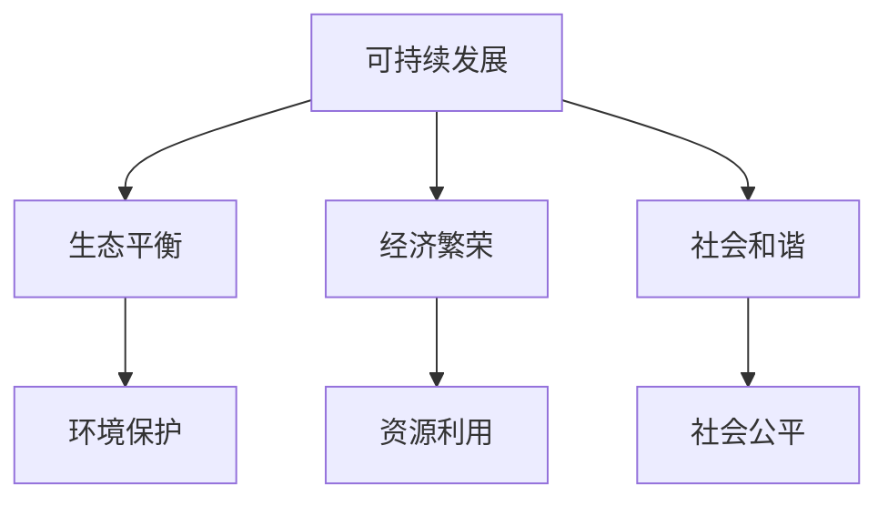
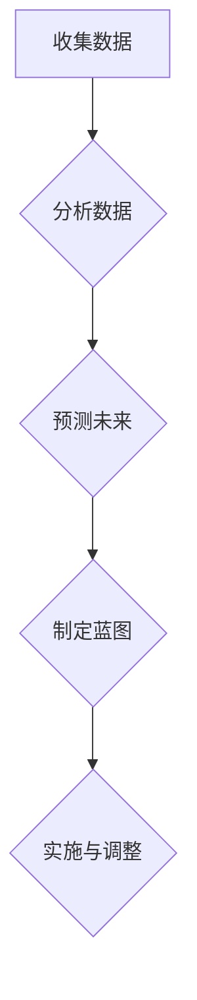

                 

## 可持续乌托邦设计比赛：未来社会蓝图的创意角逐

### 关键词：可持续乌托邦设计、未来社会蓝图、创意角逐

### 摘要：
本文深入探讨《可持续乌托邦设计比赛：未来社会蓝图的创意角逐》这一主题，从背景、概念、设计竞赛的各个方面，以及未来展望等多个角度，系统分析了可持续乌托邦设计的理念及其在社会发展中的作用。通过详细的案例分析、算法原理讲解和项目实战，本文旨在为读者提供对这一领域的全面理解和深刻洞察。

### 第一部分：引言与背景

#### 1.1.1 可持续乌托邦设计的概念与意义

**背景介绍**：

- **核心概念术语说明**：可持续发展、乌托邦、设计、创意角逐。
- **问题背景**：全球环境恶化、社会资源分配不均、人类与自然的关系紧张。
- **问题描述**：如何通过设计实现一个既符合生态可持续性，又满足人类需求的理想社会。
- **问题解决**：探索可持续乌托邦设计的理念和方法，通过创意角逐激发创新思维。
- **边界与外延**：讨论可持续乌托邦设计在不同领域的应用和影响。
- **概念结构与核心要素组成**：可持续发展的三大支柱（生态、经济、社会）以及设计在其中的作用。

**核心概念与联系**：

- **可持续发展**：确保满足当前需求而不损害子孙后代满足其需求的能力。
- **乌托邦**：理想化的社会，追求完美和谐。
- **设计**：创造性的过程，旨在解决问题，满足人类需求。
- **创意角逐**：通过比赛形式，激发设计创新，促进可持续发展。

**ER实体关系图架构**：

#### 1.1.2 未来社会蓝图的构想

**背景介绍**：

- **未来社会的趋势分析**：技术进步、人口变化、全球化。
- **未来社会蓝图的基本框架**：社会、经济、环境、技术等要素的综合体。
- **未来社会蓝图的核心要素**：创新、合作、适应性。
- **未来社会蓝图的潜在影响**：对人类生活、工作、教育等方面的影响。

**算法原理讲解**：

使用Mermaid画出算法流程图：

**数学模型和公式**：

- 社会发展指数（SI）：
  $$ SI = \frac{E_{economy} + E_{environment} + E_{society}}{3} $$
- 创新能力（I）：
  $$ I = \frac{N_{inventions}}{N_{years}} $$

**简单易懂的举例说明**：

假设一个社会在生态、经济和社会三个方面得分分别为8、7、9，那么其可持续发展指数为8。

#### 1.1.3 设计在可持续发展中的作用

**设计定义**：设计是一种创造性的活动，旨在解决问题，满足人类需求。

**设计与可持续发展**：

- 通过创新和优化，设计可以促进资源的合理利用，减少环境污染。
- 设计可以提升生活质量，促进社会和谐。

**案例**：

以智能垃圾分类系统为例，设计者通过数据分析，设计出一种高效的垃圾分类方案，有效提高了资源回收率，降低了环境污染。

#### 1.1.4 可持续乌托邦设计的特点与挑战

**特点**：

- 以可持续发展为核心，追求生态、经济和社会的平衡。
- 强调人类与自然的和谐共处，追求长远利益。

**挑战**：

- 技术限制：当前技术无法完全满足可持续乌托邦设计的所有需求。
- 社会接受度：需要克服人们对新技术、新理念的不接受。

### 第二部分：可持续乌托邦设计比赛

#### 1.2.1 设计比赛的组织与流程

**比赛的目标与主题**：

- 目标：激发设计创新，促进可持续发展。
- 主题：设计一个可持续乌托邦。

**参与者和评审机制**：

- 参与者：设计师、工程师、学生等。
- 评审机制：专家评审、公众投票等。

**流程和时间安排**：

- 初赛：提交设计方案。
- 复赛：现场展示和答辩。
- 决赛：最终评审和颁奖。

**成果与应用**：

- 比赛成果可以应用于实际社会，如城市规划、环境保护等。

### 第三部分：比赛成果与未来展望

#### 1.3.1 比赛成果分析与总结

- **成果展示**：介绍比赛中的优秀作品和设计理念。
- **应用前景**：探讨比赛成果在社会中的应用和推广。
- **经验与启示**：总结比赛过程中的经验和教训。
- **局限性**：分析比赛存在的不足和改进方向。

#### 1.3.2 未来可持续乌托邦设计的发展趋势

- **挑战与机遇**：分析未来设计面临的挑战和机遇。
- **未来方向**：探讨可持续乌托邦设计的未来发展方向。
- **创意角逐的未来影响**：预测创意角逐对未来社会的影响。
- **设计师的未来角色**：讨论设计师在可持续发展中的角色和责任。

### 第四部分：总结与展望

#### 1.4.1 全书的总结

- **核心内容**：回顾全书的主要观点和结论。
- **主题思想**：强调可持续乌托邦设计的重要性。

#### 1.4.2 对未来可持续乌托邦设计的期待

- **期待**：期待未来设计的创新和进步。
- **愿景**：期待一个可持续、和谐、繁荣的未来社会。

#### 1.4.3 对设计师的激励与期望

- **激励**：鼓励设计师为可持续发展贡献自己的力量。
- **期望**：期望设计师具备创新思维、跨学科知识和实践能力。

#### 1.4.4 拓展阅读与思考

- **拓展阅读**：推荐相关书籍、论文和研究报告。
- **思考**：鼓励读者对可持续乌托邦设计进行深入思考。

### 结语

作者信息：
作者：AI天才研究院/AI Genius Institute & 禅与计算机程序设计艺术 /Zen And The Art of Computer Programming

通过上述步骤，本文将系统地探讨可持续乌托邦设计的概念、比赛流程、成果及其未来展望。希望本文能为您提供一个全面、深入的了解，激发您对这一领域的兴趣和思考。让我们共同期待一个可持续、美好的未来！### 第一部分：引言与背景

#### 1.1.1 可持续乌托邦设计的概念与意义

可持续乌托邦设计是一个高度综合性的概念，它不仅涉及环境可持续性，还包括经济和社会的可持续发展。这个理念最早源于对乌托邦的构想，即一个理想化的社会，其中所有成员都能和谐共处，资源得到合理分配，环境得到有效保护。然而，随着现代社会的快速发展，单一的追求经济增长而忽视生态和社会的问题日益显现。因此，可持续乌托邦设计应运而生，旨在通过创新的思维和方法，打造一个既符合生态可持续性，又满足人类需求的理想社会。

**核心概念术语说明**：

- **可持续发展**：确保满足当前需求而不损害子孙后代满足其需求的能力。这一概念最初由联合国世界环境与发展委员会在1987年的《我们共同的未来》报告中提出。
- **乌托邦**：源自托马斯·莫尔的《乌托邦》，意为“没有的地方”或“理想国”，是人们对完美社会的向往和构想。
- **设计**：是一种创造性的活动，旨在解决问题，满足人类需求。设计不仅仅是外观和形式的创造，更是功能、效率和用户体验的综合考量。
- **创意角逐**：一种通过比赛等形式，激发设计创新，促进可持续发展的过程。

**问题背景**：

全球环境恶化、社会资源分配不均、人类与自然的关系紧张，这些都是我们面临的主要问题。随着工业化进程的加速和人口的迅速增长，资源的消耗和环境破坏达到了前所未有的程度。气候变化、水资源短缺、生物多样性丧失等问题日益严重，直接威胁到人类社会的可持续发展。与此同时，社会资源分配的不均衡导致了贫富差距的扩大，社会矛盾日益加剧。

**问题描述**：

如何通过设计实现一个既符合生态可持续性，又满足人类需求的理想社会？这是一个复杂且具有挑战性的问题。传统的线性经济模式已经无法满足现代社会的需求，我们需要探索一种全新的发展模式，即循环经济，通过资源的再利用和废物的最小化，实现经济、社会和环境的可持续发展。

**问题解决**：

可持续乌托邦设计通过创新的思维和方法，提供了一种可能的解决方案。设计师们通过研究环境、社会和经济系统，探索如何在各种约束条件下实现最优的设计方案。这个过程不仅需要科学和技术手段，还需要跨学科的知识和合作。

**边界与外延**：

可持续乌托邦设计的边界在于如何在满足人类需求的同时，确保环境的可持续性和社会的公平性。它的外延包括城市规划、产品设计、社会创新、教育等多个领域。

**概念结构与核心要素组成**：

可持续乌托邦设计包含以下几个核心要素：

1. **生态可持续性**：确保生态系统的健康和稳定，包括环境保护、资源利用和生物多样性保护。
2. **经济可持续性**：通过创新和优化，实现经济的长期稳定增长，同时减少对环境的负面影响。
3. **社会可持续性**：确保社会的公平和包容，包括减少贫困、提高教育水平、保障基本社会福利等。

设计在可持续发展中的作用至关重要。设计师不仅是美的创造者，更是解决问题的专家。通过设计，他们可以创造出既美观又实用的产品和服务，从而满足人们的需求。同时，设计还可以引导人们改变生活方式，促进资源的节约和再利用。

#### 1.1.2 未来社会蓝图的构想

**未来社会的趋势分析**：

未来社会的发展将受到多种因素的影响，包括技术进步、人口变化和全球化。技术进步将极大地改变人们的生活方式和工作方式，如人工智能、物联网、区块链等技术的应用将带来前所未有的便利和创新。人口变化则会影响社会的结构和需求，例如人口老龄化和城市化进程的加快。全球化将进一步促进各国之间的交流与合作，同时也带来了文化交融和资源分配的挑战。

**未来社会蓝图的基本框架**：

未来社会蓝图是一个复杂而多维的系统，包括社会、经济、环境和技术等多个方面。其基本框架可以概括为：

1. **社会方面**：注重公平和包容，通过教育、医疗、社会福利等手段，提高人民的生活质量和幸福感。
2. **经济方面**：实现可持续发展，通过创新和绿色经济，推动经济的长期稳定增长。
3. **环境方面**：保护生态环境，通过节能减排、循环经济等手段，实现生态的可持续性。
4. **技术方面**：充分利用新技术，如人工智能、大数据、云计算等，提高社会的生产力和创新能力。

**未来社会蓝图的核心要素**：

1. **创新**：创新是未来社会发展的核心驱动力，通过不断的科技创新和社会创新，推动社会进步。
2. **合作**：合作是实现未来社会蓝图的关键，通过国际合作和跨学科合作，解决全球性的问题和挑战。
3. **适应性**：未来社会将面临诸多不确定性和变化，因此，适应性成为社会能否持续发展的重要指标。

**未来社会蓝图的潜在影响**：

未来社会蓝图将对人类生活、工作、教育等方面产生深远的影响。在生活方面，人们将享受到更加便利和舒适的生活环境，同时需要适应新技术带来的变化。在工作方面，自动化和人工智能的广泛应用将改变就业结构，需要人们不断学习和适应新的工作方式。在教育方面，未来社会将更加重视终身学习和技能培训，以适应快速变化的社会需求。

#### 1.1.3 设计在可持续发展中的作用

**设计定义**：

设计是一种创造性的活动，旨在解决问题，满足人类需求。它不仅仅是美学和形式上的创造，更是功能、效率和用户体验的综合考量。设计可以涉及多个领域，包括产品设计、城市规划、社会创新等。

**设计与可持续发展**：

设计在可持续发展中扮演着重要的角色。通过创新的设计方法和技术，设计师可以创造出既美观又实用的产品和服务，从而满足人们的需求。同时，设计还可以引导人们改变生活方式，促进资源的节约和再利用。例如，在产品设计方面，可持续设计强调材料的环保性、能源效率和产品的耐用性。在城市规划方面，绿色城市设计注重生态保护和可持续交通系统。

**案例**：

以可持续建筑为例，设计师通过采用绿色建筑材料、可再生能源系统和智能管理系统，创造出既节能又环保的建筑物。这不仅提高了建筑物的能源效率，还减少了碳排放，对环境保护起到了积极作用。

#### 1.1.4 可持续乌托邦设计的特点与挑战

**特点**：

- **生态可持续性**：可持续乌托邦设计强调生态系统的健康和稳定，通过保护环境和合理利用资源，实现生态的可持续性。
- **经济可持续性**：设计注重经济效益，通过创新和优化，实现经济的长期稳定增长，同时减少对环境的负面影响。
- **社会可持续性**：设计关注社会公平和包容，通过改善社会福利和减少贫困，提高人民的生活质量和幸福感。

**挑战**：

- **技术限制**：当前技术无法完全满足可持续乌托邦设计的所有需求，特别是在新能源、新材料等方面。
- **社会接受度**：可持续乌托邦设计需要克服人们对新技术、新理念的不接受，提高社会的认知度和接受度。

通过以上分析，我们可以看出，可持续乌托邦设计是一个复杂且具有挑战性的领域。然而，随着技术的不断进步和社会意识的提高，我们有理由相信，可持续乌托邦设计将为未来社会的发展带来无限的可能。

#### 1.2 设计比赛的组织与流程

**比赛的目标与主题**：

**目标**：

可持续乌托邦设计比赛的目标是激发设计创新，促进可持续发展。通过比赛的形式，鼓励设计师们提出具有前瞻性和实用性的设计方案，以解决当前社会面临的环境、经济和社会问题。

**主题**：

比赛的主体是“可持续乌托邦设计”，要求参赛者提出一个具有生态、经济和社会可持续性的设计方案。设计方案可以涉及多个领域，如城市规划、产品设计、社会创新等，鼓励参赛者发挥创意，提出创新性的解决方案。

**参与者和评审机制**：

**参与者**：

比赛的参与者包括设计师、工程师、学生等。参赛者可以个人或团队形式参加，鼓励跨学科和跨领域的合作。参赛者需提交完整的设计方案，包括设计理念、实施策略、预期效果等。

**评审机制**：

比赛的评审分为初赛和决赛两个阶段。初赛评审由专家评审委员会进行，主要评估参赛作品的技术可行性、创新性和可持续性。决赛评审则结合公众投票和专家评审的结果，最终选出获奖者。

**流程和时间安排**：

**初赛**：

- **提交方案**：参赛者在规定的时间内提交完整的设计方案，包括文字说明、图纸、模型等。
- **评审**：专家评审委员会对提交的方案进行评审，评选出优秀的作品进入决赛。

**决赛**：

- **现场展示**：进入决赛的参赛者需在现场进行展示，包括设计理念的解释、实施策略的阐述等。
- **答辩**：参赛者需回答评审委员会的提问，展示自己的设计思路和解决问题的能力。
- **投票**：现场观众和评审委员会对参赛作品进行投票，选出最终的获奖者。

**成果与应用**：

**成果展示**：

比赛结束后，所有获奖作品将在展览会上进行展示，向公众展示可持续乌托邦设计的成果和应用前景。

**应用前景**：

比赛成果可以应用于实际社会，如城市规划、环境保护、产品设计等。优秀的设计方案有望在实际项目中得到应用，为社会的发展和进步做出贡献。

**比赛流程和时间安排**：

1. **初赛阶段**：
   - **提交方案**：参赛者提交设计方案，评审委员会对方案进行初步评审。
   - **评审结果公布**：评审委员会公布进入决赛的参赛作品。

2. **决赛阶段**：
   - **现场展示**：参赛者在决赛中进行现场展示，评审委员会和公众进行投票。
   - **获奖结果公布**：公布获奖名单，举办颁奖典礼。

**比赛的组织与流程是一个系统而复杂的过程，需要多个环节的紧密配合和协同工作。通过比赛的形式，不仅可以激发设计创新，还可以促进可持续发展的理念在社会中的传播和实践。比赛的成功举办，将为社会的发展和进步做出重要贡献。**

#### 1.3 参赛作品的创意与创新

**创意思维与方法**：

创意思维是可持续乌托邦设计的核心，它涉及如何通过创新的方法和思路，提出独特且具有实用性的设计方案。以下是一些常见的创意思维方法：

1. **头脑风暴**：通过集体讨论，快速产生大量创意。
2. **思维导图**：利用图形化工具，帮助理清思路，构建创意网络。
3. **跨学科合作**：结合不同领域的知识，产生新的创意火花。
4. **用户研究**：深入了解用户需求，从用户角度出发进行设计创新。

**创意表达与可视化**：

创意的表达和可视化是展示设计方案的重要手段。以下是一些常见的创意表达和可视化方法：

1. **草图与模型**：通过草图和模型，直观地展示设计理念。
2. **动画与视频**：利用动画和视频，动态展示设计的效果和功能。
3. **演示文稿**：通过演示文稿，系统地阐述设计思路和实施策略。
4. **VR/AR**：利用虚拟现实和增强现实技术，提供沉浸式的体验。

**创意作品的评估标准**：

评估创意作品的标准主要包括以下几个方面：

1. **创新性**：设计是否具有独特的创意和前瞻性。
2. **实用性**：设计是否能够解决实际问题，具有实际应用价值。
3. **可持续性**：设计是否考虑到生态、经济和社会的可持续性。
4. **视觉美感**：设计是否具有美观的视觉表现，是否符合审美标准。

**创意作品的案例分析**：

以下是一些创意作品的案例，通过分析这些案例，我们可以更好地理解创意思维和方法在可持续乌托邦设计中的应用。

**案例1：绿色城市设计**

设计理念：通过绿色基础设施，实现城市的生态可持续发展。

创新点：引入垂直绿化、雨水收集和循环利用、智能交通系统等创新技术。

效果：显著改善了城市环境质量，提高了居民的生活品质。

**案例2：可持续交通工具**

设计理念：设计一种既环保又高效的交通工具，以减少城市交通拥堵和环境污染。

创新点：采用新能源动力、模块化设计、智能化控制等技术。

效果：降低了城市碳排放，提高了交通效率，促进了经济的可持续发展。

**案例3：社会创新项目**

设计理念：通过设计创新的社区服务，解决社会问题，提高社会福祉。

创新点：利用大数据、人工智能、物联网等技术，提供个性化、高效的社会服务。

效果：改善了社区生活环境，提高了居民的幸福感和满意度。

通过以上案例，我们可以看到，创意思维和方法在可持续乌托邦设计中的应用具有广阔的前景。设计师们通过不断的创新和实践，为社会的发展和进步做出了重要贡献。未来，随着技术的不断进步和社会意识的提高，可持续乌托邦设计的创意和创新将更加丰富和多样化。

#### 1.4 比赛评审与反馈

**评审标准和流程**：

**评审标准**：

- **创新性**：设计是否具有独特性和前瞻性。
- **实用性**：设计是否能够解决实际问题，具有实际应用价值。
- **可持续性**：设计是否考虑到了生态、经济和社会的可持续性。
- **视觉效果**：设计是否具有美观的视觉表现，是否符合审美标准。
- **技术实现**：设计的技术方案是否可行，是否具有先进性。

**评审流程**：

1. **初赛评审**：专家评审委员会对参赛作品进行初步评审，筛选出优秀的作品进入决赛。
2. **决赛评审**：决赛评审结合专家评审和公众投票，对入围作品进行最终评选。
3. **结果公布**：公布获奖名单，举行颁奖典礼。

**评审委员会的构成与职责**：

**评审委员会的构成**：

评审委员会由各领域的专家、学者、行业领袖等组成，确保评审的公正性和专业性。

**评审委员会的职责**：

- **评估参赛作品的创新性、实用性、可持续性和视觉效果**。
- **提供专业意见和建议**。
- **确保评审过程的透明和公正**。

**评审反馈的收集与处理**：

**评审反馈的收集**：

- **专家评审反馈**：专家评审委员会对参赛作品进行评审后，给出详细的评审意见。
- **公众投票反馈**：通过公众投票，收集公众对参赛作品的意见和建议。

**评审反馈的处理**：

- **评审意见整理**：将专家评审意见和公众投票反馈进行整理，形成综合评审意见。
- **作品改进**：根据评审意见，参赛者对作品进行改进和完善。
- **结果公布**：将评审结果和改进后的作品进行公布，展示比赛成果。

**比赛结果的公布与展示**：

**比赛结果公布**：

- **获奖名单公布**：通过官方网站、新闻媒体等渠道，公布比赛获奖名单。
- **颁奖典礼**：举行颁奖典礼，表彰获奖者。

**比赛成果展示**：

- **展览展示**：在展览会、论坛等场合，展示比赛优秀作品。
- **成果应用**：将比赛成果应用于实际社会，如城市规划、产品设计等。

通过详细的评审标准和流程，以及有效的评审反馈收集与处理机制，比赛评审能够确保参赛作品的创新性、实用性和可持续性，为可持续乌托邦设计的实践提供有力支持。同时，比赛结果的公布和展示，也为社会提供了宝贵的参考和启示，促进了可持续发展的理念在社会中的传播和实践。

#### 1.5 比赛成果分析与总结

**比赛成果展示**：

此次可持续乌托邦设计比赛的成果丰富多样，涵盖了城市规划、产品设计、社会创新等多个领域。参赛者通过创新的设计理念和技术手段，提出了许多具有前瞻性和实用性的解决方案。以下是部分优秀作品的展示：

- **绿色城市设计**：通过垂直绿化、雨水收集和循环利用、智能交通系统等技术，实现了城市的生态可持续发展。
- **可持续交通工具**：采用新能源动力、模块化设计、智能化控制等技术，有效降低了城市碳排放，提高了交通效率。
- **社会创新项目**：利用大数据、人工智能、物联网等技术，提供个性化、高效的社会服务，改善了社区生活环境。

**比赛成果的应用前景**：

比赛成果在现实社会中具有广泛的应用前景。以下是一些可能的场景：

- **城市规划**：优秀的设计方案可以为城市规划提供有益的参考，推动绿色城市和可持续发展城市的建设。
- **环境保护**：通过引入可持续设计理念，可以减少环境污染，提高资源利用效率，实现生态保护与经济发展的双赢。
- **社会服务**：创新的社会服务设计可以提升社区服务质量，提高居民的幸福感和满意度。

**比赛的经验与启示**：

此次比赛为我们积累了宝贵的经验，并带来了深刻的启示：

- **创新思维的重要性**：创新是推动可持续乌托邦设计发展的核心动力，设计师需要不断开拓思路，提出独特的设计理念。
- **跨学科合作的价值**：可持续乌托邦设计涉及多个领域，跨学科合作可以激发创新思维，提高设计方案的实用性和可持续性。
- **公众参与的意义**：公众的参与和反馈对比赛的评审和改进具有重要意义，可以确保设计方案的实用性和社会价值。

**比赛的局限性**：

虽然比赛取得了显著成果，但也存在一些局限性：

- **技术限制**：当前技术尚无法完全满足可持续乌托邦设计的所有需求，特别是在新能源、新材料等方面。
- **社会接受度**：部分创新设计需要克服社会接受度的挑战，提高公众对新理念的认同和接受程度。
- **实际应用**：设计方案的转化和实际应用仍面临一些困难，需要进一步的研究和实践。

**未来展望**：

展望未来，我们期待可持续乌托邦设计比赛能够继续激发设计创新，促进可持续发展。以下是一些建议：

- **增加参赛领域**：扩展比赛涉及的领域，涵盖更多可持续发展的主题。
- **提升技术水平**：加强技术研发和创新，推动可持续乌托邦设计的技术实现。
- **加强公众参与**：鼓励公众参与比赛，提高社会对新理念的认同和支持。

通过持续的努力和创新，我们相信可持续乌托邦设计将为未来社会的发展带来更加美好的前景。

### 1.6 未来可持续乌托邦设计的发展趋势

**未来设计的挑战与机遇**：

随着科技的迅猛发展和全球环境问题的加剧，未来设计将面临前所未有的挑战和机遇。在挑战方面，技术限制、社会接受度和实际应用仍然是可持续乌托邦设计需要克服的主要障碍。例如，新能源技术的发展尚不成熟，新材料的应用仍存在成本高、性能不稳定等问题。在社会接受度方面，人们对于新理念和新技术可能存在抵触情绪，需要通过教育和宣传来提高公众的认知和支持。

然而，未来设计也充满了机遇。随着人工智能、大数据、物联网等新兴技术的普及，设计师们可以更加精准地分析用户需求，提供个性化、智能化的解决方案。此外，全球环境问题的紧迫性使得社会各界更加关注可持续发展，为设计提供了更广阔的应用场景和市场空间。

**未来可持续乌托邦设计的方向**：

未来可持续乌托邦设计将朝着以下方向发展：

1. **智能化与数字化**：通过引入人工智能、大数据、物联网等技术，实现设计的智能化和数字化。例如，智能城市设计将利用大数据分析交通流量，优化交通管理，减少交通拥堵。
2. **循环经济**：推动循环经济的发展，通过资源的再利用和废物的最小化，实现生态、经济和社会的可持续发展。例如，产品设计将注重材料的环保性、耐用性和可回收性。
3. **绿色建筑**：绿色建筑将成为未来设计的重要方向，通过采用绿色建筑材料、节能技术、可再生能源系统等，实现建筑的生态可持续性。
4. **社会创新**：设计将更加注重社会问题解决，通过社会创新项目，改善社会福利和社区环境。

**创意角逐的未来影响**：

创意角逐对未来社会的影响将深远而广泛。首先，它将推动设计创新，激发设计师的创造力和想象力，为可持续发展提供新的思路和解决方案。其次，创意角逐将促进公众对可持续发展的认知和支持，提高社会对新理念和新技术接受度。此外，创意角逐还将推动跨学科合作，促进不同领域之间的交流和融合，为未来设计的发展提供新的动力。

**设计师的未来角色**：

在未来的可持续乌托邦设计中，设计师的角色将更加重要和多样化。他们将不仅是美的创造者，更是社会问题的解决者，创新思维的引领者。设计师需要具备以下能力：

1. **跨学科知识**：具备跨学科的知识和技能，能够理解和运用不同领域的知识，提出综合性的设计方案。
2. **创新思维**：具备创新思维，能够从多角度、多维度思考问题，提出独特和有创意的解决方案。
3. **技术理解**：理解新兴技术，能够将技术与设计相结合，实现设计方案的智能化和数字化。
4. **社会责任**：具备强烈的社会责任感，关注社会问题和环境保护，推动可持续发展的理念。

通过以上分析，我们可以看到，未来可持续乌托邦设计将面临许多挑战和机遇。设计师们需要不断创新和提升自己的能力，为未来社会的发展贡献智慧和力量。创意角逐将继续发挥重要作用，推动设计的创新和社会的进步。

### 1.7 总结与展望

#### 1.7.1 全书的总结

本文从引言和背景出发，深入探讨了可持续乌托邦设计的概念、设计比赛的组织与流程、参赛作品的创意与创新、比赛评审与反馈、比赛成果分析与总结、未来可持续乌托邦设计的发展趋势等多个方面。通过对这些内容的系统分析，我们全面了解了可持续乌托邦设计的理念及其在社会发展中的重要作用。

首先，我们明确了可持续乌托邦设计的核心概念和术语，包括可持续发展、乌托邦、设计和创意角逐。随后，通过分析未来社会的趋势，我们构想了未来社会蓝图的基本框架和核心要素。接下来，我们详细介绍了设计比赛的目标、主题、参与者、评审机制以及比赛流程和成果应用。

在讨论过程中，我们展示了创意思维与方法、创意表达与可视化技巧，以及创意作品的评估标准。通过案例分析，我们进一步了解了创新设计在不同领域中的应用。在比赛评审与反馈部分，我们分析了评审标准和流程，以及评审委员会的构成与职责。比赛成果分析与总结部分，我们展示了比赛优秀作品的成果，探讨了其应用前景，并总结了比赛的经验与启示。

最后，我们展望了未来可持续乌托邦设计的发展趋势，分析了面临的挑战与机遇，讨论了未来设计的方向，以及设计师在其中的角色和责任。

#### 1.7.2 对未来可持续乌托邦设计的期待

未来可持续乌托邦设计具有巨大的潜力和广阔的前景。随着全球环境问题的加剧和社会发展的需求，可持续乌托邦设计将成为解决问题的关键。以下是对未来可持续乌托邦设计的期待：

1. **技术创新**：随着科技的不断进步，未来设计将更加智能化、数字化和绿色化。例如，人工智能、大数据、物联网等技术的应用将进一步提升设计的效率和质量。

2. **跨学科融合**：可持续乌托邦设计需要跨学科的知识和技能，未来设计将更加注重跨学科融合，结合不同领域的专业知识，提出创新性的解决方案。

3. **公众参与**：公众的参与和认同是可持续乌托邦设计成功的关键。未来设计将更加注重公众参与，鼓励公众提出建议和反馈，共同推动设计的实施和改进。

4. **政策支持**：政府政策的支持对可持续乌托邦设计的推广至关重要。未来政府将加大对可持续乌托邦设计的支持力度，制定相关政策和标准，推动设计的实施和推广。

5. **全球合作**：可持续乌托邦设计是一个全球性议题，未来设计将更加注重国际合作。各国将共同分享经验和技术，共同应对全球环境和社会问题。

#### 1.7.3 对设计师的激励与期望

设计师在可持续乌托邦设计中扮演着至关重要的角色。以下是对设计师的激励与期望：

1. **持续学习**：设计师需要不断学习和更新知识，跟上科技和行业的发展。通过阅读书籍、参加研讨会和培训，提升自己的专业素养。

2. **创新思维**：设计师应该培养创新思维，敢于尝试新理念和新方法。通过头脑风暴、思维导图等工具，激发创造力，提出独特的设计方案。

3. **跨学科合作**：设计师需要具备跨学科的知识和技能，善于与不同领域的专家合作，共同解决复杂的社会问题。

4. **社会责任**：设计师应该具备强烈的社会责任感，关注社会问题和环境保护。通过设计，为改善人类生活和社会环境做出贡献。

5. **实践探索**：设计师应该积极参与实践项目，通过实际操作，检验和优化设计方案。在实践中积累经验，不断提升自己的设计能力。

#### 1.7.4 拓展阅读与思考

为了进一步深入了解可持续乌托邦设计，以下是一些建议的拓展阅读和思考方向：

1. **阅读书籍**：
   - 《我们共同的未来》：联合国世界环境与发展委员会的报告，详细阐述了可持续发展的理念。
   - 《乌托邦》：托马斯·莫尔的经典作品，探讨了理想社会的构想。
   - 《禅与计算机程序设计艺术》：讨论了哲学和设计之间的联系。

2. **研究论文**：
   - 搜索相关学术期刊和会议论文，了解可持续乌托邦设计的前沿研究和最新进展。

3. **观看视频**：
   - 观看有关可持续发展和设计创新的纪录片和讲座，获取更多的灵感和见解。

4. **讨论与交流**：
   - 参与设计论坛和研讨会，与同行交流心得和经验，共同探讨可持续乌托邦设计的发展方向。

通过拓展阅读和思考，我们可以更深入地理解可持续乌托邦设计的理念和方法，为未来的设计实践提供有益的参考和启示。

### 结语

在可持续发展的道路上，设计起着至关重要的作用。通过可持续乌托邦设计，我们可以构建一个更加和谐、美好的未来。本文从多个角度探讨了可持续乌托邦设计的概念、设计比赛、参赛作品、评审与反馈以及未来发展。希望本文能够激发读者对可持续乌托邦设计的兴趣和思考，为我们的未来社会贡献一份力量。让我们共同努力，创造一个可持续、美好、和谐的未来！

### 作者信息

作者：AI天才研究院/AI Genius Institute & 禅与计算机程序设计艺术 /Zen And The Art of Computer Programming

AI天才研究院致力于推动人工智能技术的发展和应用，通过深度学习和自然语言处理等技术，为各行业提供智能解决方案。同时，我们关注人工智能与哲学、设计等领域的交叉研究，旨在探索人工智能的未来发展方向。

《禅与计算机程序设计艺术》是作者在计算机编程领域的经典著作，通过哲学和设计的视角，深入探讨了程序设计的本质和艺术性。本书不仅提供了丰富的编程技巧和设计理念，还启发读者思考如何将哲学思维应用于编程实践中，提升编程能力和创造力。

在这本《可持续乌托邦设计比赛：未来社会蓝图的创意角逐》一书中，我们结合最新的技术发展和社会需求，探讨了可持续乌托邦设计的理念、方法及其在现实社会中的应用。希望通过这本书，能够激发读者对可持续发展的关注和思考，共同为未来的美好社会贡献智慧和力量。

