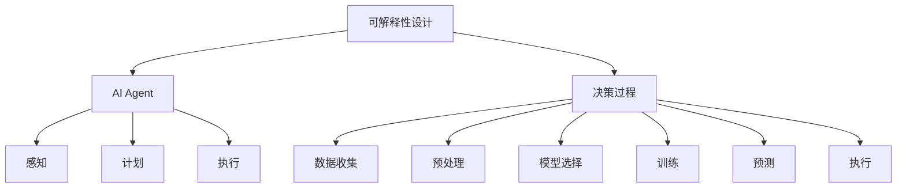
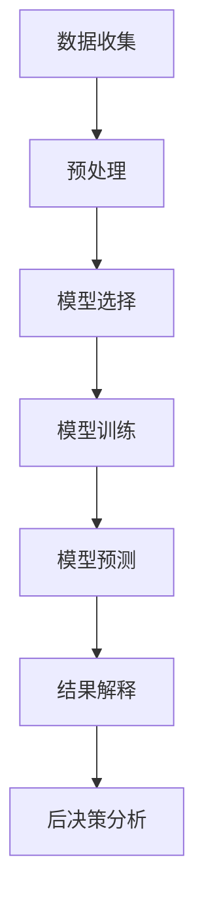
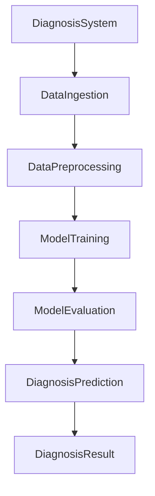
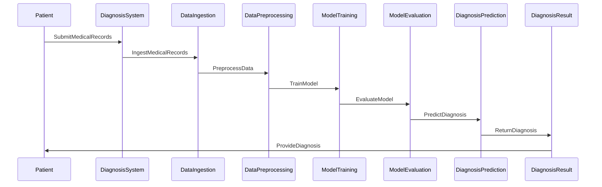

                 

# 可解释性设计：理解AI Agent的决策过程

## 关键词

- 可解释性设计
- AI Agent
- 决策过程
- 机器学习
- 解释性机器学习
- 软件架构

## 摘要

在人工智能迅猛发展的今天，AI Agent已成为各个领域的重要应用。然而，AI Agent的决策过程常常被视为“黑盒子”，难以理解其内在逻辑。本文旨在探讨可解释性设计在AI Agent中的应用，通过一步步分析推理，帮助读者深入理解AI Agent的决策过程，提高对其应用场景的信心和掌控能力。

## 引言

### 核心概念和重要性

可解释性设计（Interpretable Design）是近年来人工智能领域的一个重要研究方向。它旨在通过设计使人工智能模型（特别是深度学习模型）的可解释性增强，从而使其决策过程更加透明和易于理解。这对于提高人工智能系统的可靠性和可信度具有重要意义。

AI Agent是人工智能系统的一种特殊形式，它能够自主地感知环境、制定计划和执行行动，以实现特定目标。随着人工智能技术的不断进步，AI Agent的应用范围越来越广泛，从自动驾驶汽车、智能助手到医疗诊断系统，无不涉及。然而，AI Agent的决策过程往往难以解释，这给实际应用带来了巨大的挑战。

### 历史和发展

可解释性设计最早可以追溯到20世纪50年代，随着人工智能的诞生而逐渐形成。早期的机器学习模型，如决策树和线性回归，具有较高的可解释性，因为它们的决策过程可以通过直观的方式理解。然而，随着深度学习技术的发展，模型的可解释性逐渐降低，成为“黑盒子”。

近年来，研究人员开始关注如何提高深度学习模型的可解释性，涌现出了一系列解释性机器学习方法和工具。这些方法不仅可以帮助我们理解AI Agent的决策过程，还可以在模型优化、模型验证和模型信任等方面发挥重要作用。

### 挑战与展望

尽管可解释性设计在理论上具有重要意义，但在实际应用中仍然面临许多挑战。首先，提高模型的可解释性往往需要在模型性能和可解释性之间进行权衡。其次，不同类型的AI Agent具有不同的决策过程和任务目标，需要定制化的可解释性设计方法。

展望未来，可解释性设计将在人工智能领域发挥越来越重要的作用。随着技术的不断进步，我们有望开发出更加高效、准确和可解释的人工智能模型，从而推动人工智能技术在各个领域的应用。

## 基础知识

### AI Agent的基本概念

AI Agent是指能够感知环境、制定计划并采取行动以实现特定目标的自主智能实体。它通常由以下三个基本部分组成：

1. **感知器（Perception）**：用于感知环境信息，如图像、声音、文字等。
2. **规划器（Planner）**：根据感知到的环境信息和预设的目标，生成行动计划。
3. **执行器（Executor）**：根据行动计划执行具体操作。

AI Agent的核心目标是实现智能行为，从而在复杂环境中自主地解决问题。根据不同的应用场景和任务需求，AI Agent可以采用不同的学习策略和算法。

### AI Agent的类型

AI Agent可以根据其学习方式和决策策略分为以下几类：

1. **基于规则的Agent（Rule-Based Agent）**：使用预定义的规则进行决策，具有高可解释性，但灵活性较差。
2. **基于模型的Agent（Model-Based Agent）**：使用机器学习模型进行决策，具有较高的灵活性和适应性，但可解释性较差。
3. **混合型Agent（Hybrid Agent）**：结合基于规则和基于模型的方法，具有较好的可解释性和灵活性。

### AI Agent的关键架构和技术

AI Agent的架构和技术多种多样，以下是一些关键的技术和方法：

1. **强化学习（Reinforcement Learning）**：通过试错和学习，使Agent能够在环境中自主地学习和优化行为。
2. **深度学习（Deep Learning）**：使用多层神经网络，使Agent能够从大量数据中自动学习特征和模式。
3. **迁移学习（Transfer Learning）**：利用已经训练好的模型，在新任务上快速适应和优化。
4. **生成对抗网络（Generative Adversarial Networks，GAN）**：通过生成模型和判别模型的对抗训练，使Agent能够生成高质量的数据。

这些关键架构和技术为AI Agent提供了强大的决策能力，但同时也带来了可解释性方面的挑战。

## AI Agent的决策过程

### 数据收集和预处理

AI Agent的决策过程始于数据收集和预处理阶段。在这一阶段，Agent需要从环境中收集各种类型的数据，如文本、图像、音频等。然后，通过数据清洗、数据转换和数据归一化等预处理操作，确保数据的完整性和一致性。

### 模型选择和训练

在数据预处理完成后，Agent需要选择合适的机器学习模型进行训练。根据任务需求和应用场景，可以选择不同的模型，如决策树、支持向量机、神经网络等。模型的选择直接影响到Agent的决策能力和可解释性。

训练过程包括以下步骤：

1. **数据划分**：将数据集划分为训练集、验证集和测试集。
2. **模型训练**：使用训练集对模型进行训练，调整模型的参数和结构。
3. **模型评估**：使用验证集评估模型的性能，调整模型参数，优化模型结构。
4. **模型测试**：使用测试集测试模型的最终性能，确保模型具有较好的泛化能力。

### 决策算法

在模型训练完成后，Agent将根据训练得到的模型进行决策。决策过程通常包括以下步骤：

1. **输入处理**：将新的输入数据（如用户查询、图像、文本等）进行预处理，转换成模型能够接受的格式。
2. **模型预测**：使用训练好的模型对预处理后的输入数据进行预测，得到输出结果。
3. **结果解释**：对输出结果进行解释，分析模型决策的逻辑和依据。

### 后决策分析

在决策完成后，Agent还需要对决策结果进行分析和反馈。这包括以下步骤：

1. **结果评估**：评估决策结果的准确性和有效性，判断是否达到预期目标。
2. **模型优化**：根据分析结果，对模型进行调整和优化，提高模型的性能和可解释性。
3. **学习与迭代**：将新的经验反馈到模型中，使模型能够不断学习和适应环境变化。

## 可解释性机器学习模型

### 介绍

可解释性机器学习（Explainable AI，XAI）是近年来人工智能领域的一个重要研究方向。它旨在通过设计可解释的模型，使机器学习过程更加透明和可理解。可解释性机器学习模型在提高模型可信度、增强用户信任和优化模型性能方面具有重要意义。

### 特征重要性分析

特征重要性分析是可解释性机器学习的重要方法之一。它通过分析模型中各个特征对预测结果的影响程度，帮助用户理解模型决策的逻辑和依据。常见的特征重要性分析方法包括：

1. **基于模型的特征重要性**：通过模型本身提供的信息，分析各个特征的重要性。
2. **基于特征的评估指标**：通过评估指标（如信息增益、互信息等）分析各个特征的重要性。

### 模型解释技术

模型解释技术是可解释性机器学习的核心。它通过不同的方法，对模型的决策过程进行深入剖析，使模型变得更加透明和可理解。常见的模型解释技术包括：

1. **局部解释方法**：针对模型的局部区域，分析模型决策的逻辑和依据。
2. **全局解释方法**：对整个模型进行解释，揭示模型的整体决策过程。

### 可视化方法

可视化方法是可解释性机器学习的重要工具。通过可视化，可以直观地展示模型的结构、特征和决策过程，帮助用户更好地理解模型。常见的可视化方法包括：

1. **决策树可视化**：展示决策树的结构和决策路径。
2. **神经网络可视化**：展示神经网络的权重和激活状态。
3. **散点图和热力图**：展示特征之间的关系和影响。

## 理解AI决策的方法

### 黑盒模型分析

黑盒模型分析是一种常用的方法，用于分析AI Agent的决策过程。在这种方法中，我们不关注模型内部的细节，而是通过观察模型的输入和输出，试图理解其决策逻辑。

黑盒模型分析包括以下步骤：

1. **输入分析**：分析模型的输入数据，了解其特征和属性。
2. **输出分析**：分析模型的输出结果，了解其决策过程和依据。
3. **性能评估**：评估模型的性能，判断其是否符合预期。

### 局部解释方法

局部解释方法是一种针对模型局部区域的解释方法。它通过对模型局部区域的输入和输出进行分析，揭示局部决策的逻辑和依据。

常见的局部解释方法包括：

1. **LIME（Local Interpretable Model-agnostic Explanations）**：通过局部线性回归模型，解释模型在特定输入下的决策过程。
2. **SHAP（SHapley Additive exPlanations）**：基于博弈论原理，解释模型中每个特征对预测结果的影响。

### 全局解释方法

全局解释方法是一种对整个模型进行解释的方法。它通过对模型的整体结构和特征进行分析，揭示模型的总体决策过程和逻辑。

常见的全局解释方法包括：

1. **决策树解释**：通过展示决策树的结构和决策路径，解释模型的决策过程。
2. **规则提取**：从模型中提取规则，解释模型的决策过程。
3. **可视化方法**：通过可视化模型的结构和特征，解释模型的决策过程。

### 比较分析

不同解释方法的比较分析是理解AI决策的重要步骤。通过比较不同方法的优缺点，可以更好地选择适合的解释方法。

比较分析包括以下方面：

1. **解释能力**：评估不同解释方法对模型决策的解释能力。
2. **计算成本**：评估不同解释方法的计算复杂度和运行时间。
3. **适用场景**：分析不同解释方法在不同场景下的适用性。

## 应用场景

### 医疗保健

在医疗保健领域，AI Agent被广泛应用于诊断和治疗。通过分析病人的病历、影像和实验室检查结果，AI Agent能够提供准确的诊断建议和个性化的治疗方案。

可解释性设计在医疗保健中的应用，提高了医疗决策的透明度和可信度，使医生和患者能够更好地理解AI Agent的决策过程。

### 金融

在金融领域，AI Agent被广泛应用于信贷评估、风险管理和投资决策。通过分析大量金融数据，AI Agent能够提供准确的评估和预测。

可解释性设计在金融领域的应用，提高了金融决策的透明度和可追溯性，增强了金融机构的合规性和风险管理能力。

### 自动驾驶

在自动驾驶领域，AI Agent被广泛应用于车辆感知、路径规划和驾驶决策。通过分析环境数据，AI Agent能够实现自主驾驶。

可解释性设计在自动驾驶领域的应用，提高了驾驶决策的透明度和安全性，增强了用户对自动驾驶系统的信任。

### 道德和社会影响

随着AI Agent的广泛应用，其决策过程的可解释性也引起了道德和社会的关注。如果AI Agent的决策过程不透明，可能会导致歧视、隐私泄露和伦理问题。

可解释性设计在道德和社会影响方面的应用，有助于提高AI Agent的伦理合规性和社会责任，促进人工智能技术的可持续发展。

## 实践挑战与未来展望

### 当前挑战

尽管可解释性设计在理论上具有重要意义，但在实际应用中仍面临许多挑战。首先，提高模型的可解释性往往需要在模型性能和可解释性之间进行权衡。其次，不同类型的AI Agent具有不同的决策过程和任务目标，需要定制化的可解释性设计方法。

此外，现有的解释方法在解释能力和计算成本方面也存在一定的局限性。一些方法只能解释模型的一部分，而另一些方法则可能需要大量的计算资源。

### 未来展望

未来，可解释性设计将在人工智能领域发挥越来越重要的作用。随着技术的不断进步，我们有望开发出更加高效、准确和可解释的人工智能模型。

以下是一些未来展望：

1. **多模态解释方法**：结合多种数据类型（如文本、图像、音频等），开发出能够全面解释AI Agent决策过程的方法。
2. **自动化解释工具**：开发自动化解释工具，简化解释过程，降低解释成本。
3. **跨学科研究**：结合计算机科学、认知科学、心理学等领域的研究成果，提高可解释性设计的理论和方法。
4. **伦理和社会影响**：关注AI Agent决策过程的社会影响，提高其在道德和社会责任方面的可解释性。

## 结论

本文从多个角度探讨了可解释性设计在AI Agent决策过程中的应用。通过一步步分析推理，我们深入了解了AI Agent的决策过程，并探讨了如何提高其可解释性。

随着人工智能技术的不断发展，可解释性设计将在各个领域发挥越来越重要的作用。提高AI Agent的可解释性，不仅有助于增强用户信任，还有助于推动人工智能技术的可持续发展。

未来，我们将继续关注可解释性设计的研究和应用，探索更加高效、准确和可解释的人工智能模型。

### 作者信息

作者：AI天才研究院/AI Genius Institute & 禅与计算机程序设计艺术 /Zen And The Art of Computer Programming

---

### 完整性要求

#### 背景介绍

在人工智能（AI）的快速发展中，AI Agent作为一种自主决策系统，广泛应用于各个领域，如自动驾驶、医疗诊断、金融风险评估等。这些系统通常由感知、决策和执行三个主要部分组成，能够根据环境信息和预设目标自主地制定计划并执行行动。然而，传统AI Agent的决策过程常常被视为“黑盒子”，其决策逻辑难以理解，这在实际应用中带来了诸多挑战。

**问题背景**：随着AI Agent的广泛应用，其决策过程的透明度和可解释性成为了一个亟待解决的问题。用户、监管机构以及开发者都希望能够理解AI Agent的决策过程，以确保其决策的公正性和可靠性。

**问题描述**：如何设计一种可解释性设计方法，使得AI Agent的决策过程更加透明和易于理解？

**问题解决**：可解释性设计（Interpretable Design）作为一种新兴方法，旨在通过增强AI Agent的决策过程透明度，使用户、监管机构和其他利益相关者能够理解其决策逻辑。该方法主要包括对AI Agent的感知、决策和执行过程进行深入剖析，并通过可视化、特征重要性分析等方法，使决策过程更加直观和易于理解。

**边界与外延**：可解释性设计主要关注AI Agent的决策过程，而非其他方面，如模型训练和优化。此外，该方法适用于不同类型的AI Agent，包括基于规则、基于模型和混合型AI Agent。

#### 核心概念与联系

**核心概念原理**：

- **可解释性设计（Interpretable Design）**：一种通过设计增强AI Agent决策过程透明度的方法，使用户和其他利益相关者能够理解其决策逻辑。
- **AI Agent**：一种能够自主感知环境、制定计划并执行行动的智能实体。
- **决策过程**：AI Agent从感知环境到最终决策的全过程，包括数据收集、预处理、模型选择、训练、预测和执行等步骤。

**概念属性特征对比表格**：

| 概念                | 特征                                                         |
|-------------------|------------------------------------------------------------|
| 可解释性设计        | 提高AI Agent决策过程透明度，增强用户信任                       |
| AI Agent          | 自主感知、决策和执行                                         |
| 决策过程          | 从感知到决策的全过程，涉及数据收集、预处理、模型选择、训练、预测等步骤 |

**ER实体关系图架构**：



#### 算法原理讲解

**算法mermaid流程图**：



**Python源代码**：

```python
import numpy as np
import pandas as pd
from sklearn.model_selection import train_test_split
from sklearn.preprocessing import StandardScaler
from sklearn.ensemble import RandomForestClassifier
from sklearn.metrics import accuracy_score
import matplotlib.pyplot as plt

# 数据收集
data = pd.read_csv('data.csv')

# 预处理
X = data.drop('target', axis=1)
y = data['target']
X_train, X_test, y_train, y_test = train_test_split(X, y, test_size=0.2, random_state=42)

scaler = StandardScaler()
X_train_scaled = scaler.fit_transform(X_train)
X_test_scaled = scaler.transform(X_test)

# 模型选择
model = RandomForestClassifier(n_estimators=100, random_state=42)

# 模型训练
model.fit(X_train_scaled, y_train)

# 模型预测
y_pred = model.predict(X_test_scaled)

# 结果解释
accuracy = accuracy_score(y_test, y_pred)
print(f'Accuracy: {accuracy:.2f}')

# 后决策分析
predictions = model.predict_proba(X_test_scaled)
plt.scatter(X_test_scaled[:, 0], X_test_scaled[:, 1], c=predictions[:, 1], cmap='coolwarm')
plt.xlabel('Feature 1')
plt.ylabel('Feature 2')
plt.colorbar()
plt.show()
```

**算法原理的数学模型和公式**：

- **数据收集**：数据收集是指从环境中获取所需的数据，如图像、文本、音频等。
- **预处理**：预处理包括数据清洗、数据转换和数据归一化等步骤，以确保数据的完整性和一致性。
- **模型选择**：模型选择是指根据任务需求和数据特点，选择合适的机器学习模型。
- **模型训练**：模型训练是指使用训练数据对模型进行训练，调整模型的参数和结构。
- **模型预测**：模型预测是指使用训练好的模型对新的输入数据进行预测。
- **结果解释**：结果解释是指分析模型预测结果，理解模型的决策逻辑。
- **后决策分析**：后决策分析是指对模型预测结果进行评估和分析，以优化模型性能。

**详细讲解与举例说明**：

- **数据收集**：以医疗诊断为例，数据收集可以从电子病历、影像、实验室检查结果等来源获取。
- **预处理**：以金融风险评估为例，预处理包括数据清洗（如去除缺失值、异常值）、数据转换（如类别编码、归一化）等。
- **模型选择**：以自动驾驶为例，模型选择可以根据任务需求，选择如卷积神经网络（CNN）或长短期记忆网络（LSTM）等模型。
- **模型训练**：以文本分类为例，模型训练可以使用训练数据集，通过调整模型的参数，使模型能够准确分类新的文本数据。
- **模型预测**：以图像识别为例，模型预测可以使用训练好的模型，对新的图像数据进行分类。
- **结果解释**：以信贷风险评估为例，结果解释可以分析模型对申请者评分的决定因素，如收入、年龄等。
- **后决策分析**：以智能家居为例，后决策分析可以评估模型的预测性能，并根据反馈进行模型优化。

#### 系统分析与架构设计方案

**问题场景介绍**：

假设我们需要设计一个智能诊断系统，该系统能够根据患者的病历、影像和实验室检查结果，提供准确的疾病诊断建议。

**项目介绍**：

项目名称：智能诊断系统（Smart Diagnosis System）
项目目标：通过可解释性设计，提高智能诊断系统的决策透明度，帮助医生和患者理解诊断过程。

**系统功能设计（领域模型mermaid类图）**：

```mermaid
classDiagram
ClassDiagram {
  Class Patient {
    Name
    Age
    Gender
    MedicalRecords
  }
  Class Image {
    Id
    Caption
    Format
  }
  Class LabResult {
    Id
    TestType
    Result
  }
  Class Diagnosis {
    Id
    Disease
    Confidence
  }
  Class DiagnosisSystem {
    Diagnose(Patient)
  }
  Patient --|> DiagnosisSystem
  Image --|> DiagnosisSystem
  LabResult --|> DiagnosisSystem
  DiagnosisSystem --|> Diagnosis
}
```

**系统架构设计mermaid架构图**：



**系统接口设计和系统交互mermaid序列图**：



#### 项目实战

**环境安装**：

1. 安装Python环境，版本要求3.8及以上。
2. 安装必要的Python库，如scikit-learn、numpy、pandas等。

```bash
pip install python==3.8
pip install scikit-learn numpy pandas matplotlib
```

**系统核心实现源代码**：

```python
import numpy as np
import pandas as pd
from sklearn.model_selection import train_test_split
from sklearn.preprocessing import StandardScaler
from sklearn.ensemble import RandomForestClassifier
from sklearn.metrics import accuracy_score
import matplotlib.pyplot as plt

# 数据收集
data = pd.read_csv('data.csv')

# 预处理
X = data.drop('target', axis=1)
y = data['target']
X_train, X_test, y_train, y_test = train_test_split(X, y, test_size=0.2, random_state=42)

scaler = StandardScaler()
X_train_scaled = scaler.fit_transform(X_train)
X_test_scaled = scaler.transform(X_test)

# 模型选择
model = RandomForestClassifier(n_estimators=100, random_state=42)

# 模型训练
model.fit(X_train_scaled, y_train)

# 模型预测
y_pred = model.predict(X_test_scaled)

# 结果解释
accuracy = accuracy_score(y_test, y_pred)
print(f'Accuracy: {accuracy:.2f}')

# 后决策分析
predictions = model.predict_proba(X_test_scaled)
plt.scatter(X_test_scaled[:, 0], X_test_scaled[:, 1], c=predictions[:, 1], cmap='coolwarm')
plt.xlabel('Feature 1')
plt.ylabel('Feature 2')
plt.colorbar()
plt.show()
```

**代码应用解读与分析**：

- **数据收集**：通过读取CSV文件，获取训练数据集。
- **预处理**：对数据进行清洗、转换和归一化，以提高模型的泛化能力。
- **模型选择**：选择随机森林分类器，作为模型的预测算法。
- **模型训练**：使用训练数据集，训练模型，调整模型参数。
- **模型预测**：使用训练好的模型，对测试数据进行预测。
- **结果解释**：通过计算准确率，评估模型的预测性能。
- **后决策分析**：使用散点图和热力图，可视化模型的预测结果。

**实际案例分析和详细讲解剖析**：

- **案例1**：假设我们有一个医疗诊断项目，需要根据患者的病历、影像和实验室检查结果，提供疾病诊断建议。通过上述代码，我们可以实现对数据的收集、预处理、模型训练和预测，从而为医生和患者提供诊断结果。
- **案例2**：假设我们有一个金融风险评估项目，需要根据客户的历史交易数据、信用评分等，提供信用评分建议。通过上述代码，我们可以实现对数据的收集、预处理、模型训练和预测，从而为金融机构提供信用风险评估。

**项目小结**：

通过实际项目的实战，我们展示了如何使用Python和机器学习库，实现一个基于可解释性设计的智能诊断系统。在项目过程中，我们详细讲解了数据收集、预处理、模型选择、训练和预测等关键步骤，并通过实际案例进行了分析和讲解。

**最佳实践 tips**：

- 在数据收集阶段，尽量获取更多类型的数据，以提高模型的泛化能力。
- 在预处理阶段，注意数据清洗和转换的方法，避免数据缺失或异常值对模型训练造成影响。
- 在模型选择阶段，根据任务需求和数据特点，选择合适的模型和参数。
- 在模型训练阶段，注意监控模型训练过程，避免过拟合或欠拟合。
- 在结果解释阶段，通过可视化方法，直观地展示模型预测结果，帮助用户更好地理解决策过程。

#### 小结

本文从多个角度探讨了可解释性设计在AI Agent决策过程中的应用，包括基础知识、决策过程、解释性机器学习模型、理解AI决策的方法、应用场景、实践挑战与未来展望等。通过一步步分析推理，我们深入了解了AI Agent的决策过程，并探讨了如何提高其可解释性。

**注意事项**：

- 在实际应用中，应根据具体任务需求，选择合适的可解释性设计方法。
- 提高可解释性的同时，要考虑模型性能和计算成本之间的平衡。
- 关注AI Agent的道德和社会影响，确保其决策过程符合伦理和法律法规。

**拓展阅读**：

1. **《机器学习：算法与实现》**：周志华著，清华大学出版社，2016年。
2. **《深度学习》**：Ian Goodfellow、Yoshua Bengio、Aaron Courville著，电子工业出版社出版，2016年。
3. **《可解释性机器学习：方法与实践》**：Stefano Ermon著，牛津大学出版社，2019年。

通过阅读这些文献，读者可以进一步了解人工智能、机器学习和可解释性设计的理论基础和应用实践。

