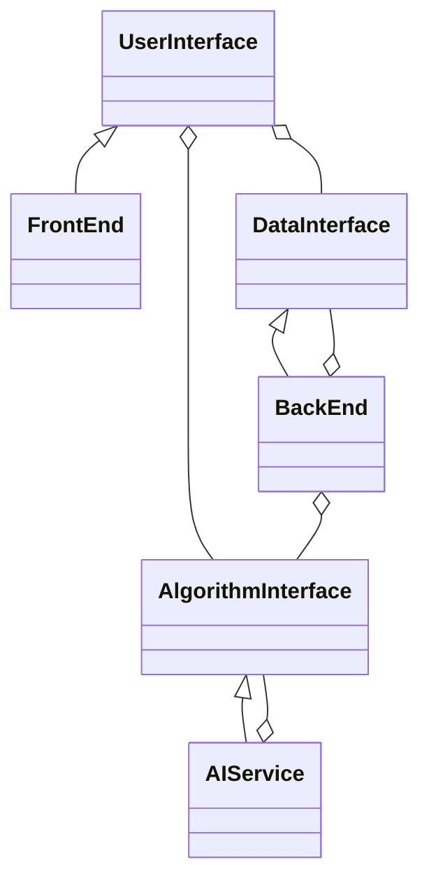
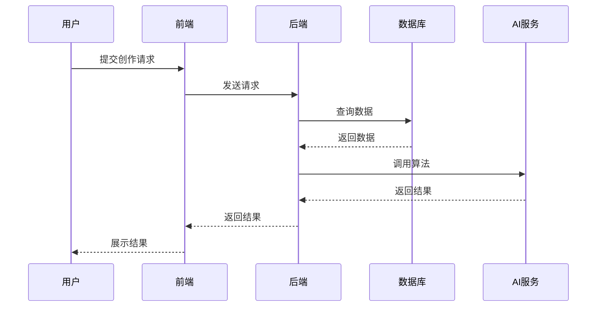

                 

## 文章标题：后人类主义艺术：探索技术与人性的新疆界

> 关键词：后人类主义艺术、数字技术、人工智能、人性、艺术哲学、伦理问题

> 摘要：本文深入探讨后人类主义艺术的本质、特征及其在当代社会中的重要性。通过分析技术与人性的互动关系，探讨数字技术与人工智能在后人类主义艺术中的应用，同时反思艺术哲学和伦理问题，展望后人类主义艺术的未来发展趋势。

### 引言

后人类主义（Posthumanism）是一种哲学和文化思潮，主张在技术飞速发展的今天，人类正在逐渐被技术所改造，甚至超越传统的“人类”定义。后人类主义艺术则是这一哲学思潮在艺术领域的体现，它通过数字技术和人工智能等手段，探索人类与技术、人与机器之间的界限，挑战传统艺术观念和人性理解。本文将围绕这一主题，从多个角度展开探讨。

### 后人类主义艺术的定义与特征

后人类主义艺术，可以定义为一种利用数字技术和人工智能等现代科技手段，探索人类与技术、人与机器之间互动的艺术形式。其特征包括：

1. **技术驱动**：后人类主义艺术依赖于数字技术和人工智能，通过这些技术实现艺术创作的创新和突破。
2. **非线性结构**：后人类主义艺术打破了传统艺术的形式和结构，呈现出非线性的特征，强调多元和互动。
3. **人机共生**：后人类主义艺术不仅关注人类与技术的互动，更探讨人类与技术共生的生活方式。
4. **哲学反思**：后人类主义艺术通过对技术的反思，探讨了人类存在的本质和未来。

### 后人类主义艺术的历史发展与现状

后人类主义艺术起源于20世纪末，随着计算机技术和互联网的普及，艺术家们开始探索数字艺术和虚拟现实等新形式。当前，后人类主义艺术已经成为了艺术界的一个重要分支，涵盖了数字艺术、虚拟艺术、互动艺术等多个领域。其表现形式丰富多样，从静态的数字绘画到动态的虚拟现实体验，再到人与机器的互动艺术装置，无不展示了后人类主义艺术的无穷魅力。

### 后人类主义艺术的重要性与影响

后人类主义艺术不仅在艺术领域具有重要意义，还对人类社会产生了深远的影响：

1. **艺术创新**：后人类主义艺术推动了艺术形式的创新，为艺术家提供了更多的创作手段和表达方式。
2. **社会反思**：后人类主义艺术通过探讨人类与技术的关系，引发了对现代社会和未来发展的深刻思考。
3. **人性重塑**：后人类主义艺术挑战了传统的人性观念，促使人们重新审视自己的身份和存在方式。

### 第1章：后人类主义艺术概述

#### 1.1 问题的背景与描述

随着技术的不断进步，人类的生活方式和观念也在发生深刻的变革。从计算机的诞生到互联网的普及，再到人工智能的崛起，技术正在以惊人的速度改变着我们的世界。在这个过程中，人类与技术的界限逐渐模糊，人类开始思考自己在技术时代中的位置和角色。后人类主义艺术正是在这样的背景下产生的，它试图通过艺术的方式，探讨人类与技术之间的复杂关系。

#### 1.2 后人类主义艺术的定义与特征

后人类主义艺术可以被定义为一种利用数字技术和人工智能等现代科技手段，探索人类与技术、人与机器之间互动的艺术形式。它具有以下特征：

1. **技术驱动**：后人类主义艺术依赖于数字技术和人工智能，通过这些技术实现艺术创作的创新和突破。
2. **非线性结构**：后人类主义艺术打破了传统艺术的形式和结构，呈现出非线性的特征，强调多元和互动。
3. **人机共生**：后人类主义艺术不仅关注人类与技术的互动，更探讨人类与技术共生的生活方式。
4. **哲学反思**：后人类主义艺术通过对技术的反思，探讨了人类存在的本质和未来。

#### 1.3 后人类主义艺术的历史发展与现状

后人类主义艺术起源于20世纪末，随着计算机技术和互联网的普及，艺术家们开始探索数字艺术和虚拟现实等新形式。当前，后人类主义艺术已经成为了艺术界的一个重要分支，涵盖了数字艺术、虚拟艺术、互动艺术等多个领域。其表现形式丰富多样，从静态的数字绘画到动态的虚拟现实体验，再到人与机器的互动艺术装置，无不展示了后人类主义艺术的无穷魅力。

#### 1.4 后人类主义艺术的重要性与影响

后人类主义艺术不仅在艺术领域具有重要意义，还对人类社会产生了深远的影响：

1. **艺术创新**：后人类主义艺术推动了艺术形式的创新，为艺术家提供了更多的创作手段和表达方式。
2. **社会反思**：后人类主义艺术通过探讨人类与技术的关系，引发了对现代社会和未来发展的深刻思考。
3. **人性重塑**：后人类主义艺术挑战了传统的人性观念，促使人们重新审视自己的身份和存在方式。

### 第2章：技术与人性的新疆界

#### 2.1 技术对人类生活的影响

技术的飞速发展给人类生活带来了巨大的变革，这些变革既有正面的，也有负面的。

##### 2.1.1 技术的正面影响

技术的正面影响主要体现在以下几个方面：

1. **提高生产效率**：计算机和自动化技术的应用，大幅提高了生产效率，降低了人力成本。
2. **便利的生活方式**：互联网和智能手机的普及，使人们的生活更加便捷，信息获取和交流变得更加容易。
3. **医疗技术的进步**：医疗技术的不断进步，延长了人类的寿命，提高了生活质量。

##### 2.1.2 技术的负面影响

然而，技术的负面影响也不容忽视：

1. **隐私泄露**：互联网和大数据技术的发展，使得个人隐私面临着前所未有的威胁。
2. **就业市场的变革**：自动化和人工智能技术的发展，导致一些传统职业的消失，给劳动者带来了就业压力。
3. **社会隔离**：过度依赖技术，可能导致人与人之间的距离感增加，社会隔离现象加剧。

#### 2.2 人性概念的探讨

人性是一个复杂的概念，不同的哲学流派有着不同的解释。从基本的定义来看，人性是指人类所固有的本质特征。

##### 2.2.1 人性的本质

人性的本质可以从以下几个方面来理解：

1. **理性与感性**：人类既具有理性思考的能力，也具有感性体验的能力。这两者相辅相成，构成了人性的基础。
2. **自由与约束**：人性既追求自由，也受到各种约束。自由是人类追求幸福的重要动力，而约束则是人类社会的必要条件。
3. **社会性与个体性**：人性既具有社会性，也具有个体性。人类是社会性动物，需要与他人互动；同时，每个人又是独立的个体，具有独特的思想和情感。

##### 2.2.2 人性与技术的交互作用

技术与人性的交互作用是后人类主义艺术探讨的核心问题。一方面，技术改变了人类的生活方式和观念，对人性产生了深远的影响；另一方面，人性也影响着技术的发展方向和应用场景。

1. **技术对人性影响的例子**：例如，互联网和社交媒体的普及，改变了人们的社交方式和信息获取方式，对人性中的社会性和个体性产生了影响。
2. **人性对技术发展影响的例子**：例如，人类对自由和个性化的追求，推动了技术向更智能化、个性化方向的发展。

### 第3章：后人类主义艺术中的技术工具

#### 3.1 数字技术与后人类主义艺术

数字技术是后人类主义艺术的重要工具，它为艺术家提供了前所未有的创作手段和表现方式。

##### 3.1.1 数字技术在艺术创作中的应用

数字技术在艺术创作中的应用主要体现在以下几个方面：

1. **数字绘画**：数字绘画使得艺术家能够更灵活地表达自己的创意，通过调整颜色、线条和形状，实现传统绘画难以达到的效果。
2. **虚拟现实**：虚拟现实技术为艺术家提供了全新的艺术表现空间，观众可以沉浸在虚拟世界中，体验艺术家创造的独特艺术体验。
3. **增强现实**：增强现实技术将虚拟元素叠加到现实世界中，使现实与虚拟相互融合，创造出独特的艺术效果。

##### 3.1.2 数字艺术作品分析

以下是一些典型的数字艺术作品及其特点：

1. **《数字舞者》**：这是一部由计算机生成的数字舞蹈作品，通过精确的计算和编程，实现了舞蹈动作的完美演绎。作品展现了数字技术对艺术表现形式的创新和突破。
2. **《虚拟现实艺术展》**：这是一个利用虚拟现实技术创建的艺术展览，观众可以通过虚拟现实设备，进入艺术家的虚拟世界，感受艺术的独特魅力。

#### 3.2 人工智能与后人类主义艺术

人工智能在后人类主义艺术中的应用，使得艺术创作变得更加智能化和个性化。

##### 3.2.1 人工智能的定义与特点

人工智能是指计算机系统模拟人类智能行为的能力。其特点包括：

1. **学习与适应能力**：人工智能可以通过学习，不断提高自己的能力和表现。
2. **自动化决策**：人工智能可以在不需要人类干预的情况下，做出复杂的决策。
3. **高效性**：人工智能可以处理大量的数据，并快速给出结果。

##### 3.2.2 人工智能在艺术创作中的使用

人工智能在艺术创作中的应用主要体现在以下几个方面：

1. **音乐创作**：人工智能可以通过分析大量音乐数据，创作出独特的音乐作品。
2. **绘画与设计**：人工智能可以生成具有艺术价值的绘画和设计作品。
3. **文学创作**：人工智能可以创作出具有文学价值的小说、诗歌等文学作品。

以下是一些人工智能艺术创作的案例：

1. **《AI作曲家》**：这是一个由人工智能创作的音乐作品，作品旋律优美，展现了人工智能在音乐创作方面的潜力。
2. **《AI绘画》**：这是一个由人工智能创作的绘画作品，作品风格多样，展现了人工智能在绘画领域的创新能力。

### 第4章：后人类主义艺术的哲学思考

#### 4.1 哲学视角下的后人类主义艺术

后人类主义艺术不仅是一种艺术形式，更是一种哲学思考。从哲学视角来看，后人类主义艺术涉及到多个哲学问题。

##### 4.1.1 存在主义与后人类主义艺术

存在主义认为，人类的存在是自由和选择的结果。在后人类主义艺术中，人类与技术的关系可以被看作是一种自由选择的结果。艺术家通过数字技术和人工智能，创造出新的艺术形式，展示了人类在技术时代中的自由和创造力。

##### 4.1.2 解构主义与后人类主义艺术

解构主义主张打破传统的结构和框架，追求多元和互动。后人类主义艺术与解构主义有着相似的理念，它通过数字技术和人工智能，打破了传统艺术的形式和结构，创造出全新的艺术体验。

#### 4.2 后人类主义艺术与伦理问题

后人类主义艺术在带来创新和变革的同时，也引发了伦理问题的讨论。

##### 4.2.1 伦理问题在后人类主义艺术中的体现

伦理问题在后人类主义艺术中主要体现在以下几个方面：

1. **人工智能伦理**：人工智能在艺术创作中的应用，引发了关于人工智能是否具有道德责任的讨论。
2. **数字艺术版权**：数字艺术的复制和传播，使得艺术作品的版权问题变得更加复杂。
3. **虚拟现实伦理**：虚拟现实技术的发展，使得人们可以在虚拟世界中体验到真实的情感，这引发了对虚拟现实伦理的探讨。

##### 4.2.2 伦理问题的挑战与解决方案

伦理问题对后人类主义艺术的挑战包括：

1. **技术发展的伦理限制**：如何在技术发展的同时，保障人类的伦理和道德。
2. **艺术创作的伦理责任**：艺术家在创作过程中，应承担起怎样的伦理责任。
3. **公众接受度**：如何在公众对后人类主义艺术接受度较低的情况下，推广和普及这一艺术形式。

针对这些挑战，可以采取以下解决方案：

1. **制定伦理规范**：制定相关伦理规范，明确人工智能和数字艺术在创作和应用中的道德责任。
2. **加强教育宣传**：通过教育宣传，提高公众对后人类主义艺术的认知和理解，增加公众对这一艺术形式的接受度。
3. **多元参与**：鼓励各界人士参与后人类主义艺术的创作和讨论，形成多元化的观点和共识。

### 第5章：后人类主义艺术案例精选

#### 5.1 案例一：数字艺术作品《数字舞者》

《数字舞者》是一部由计算机生成的数字舞蹈作品，通过精确的计算和编程，实现了舞蹈动作的完美演绎。这部作品展示了数字技术在艺术创作中的应用，为观众带来了全新的艺术体验。

##### 5.1.1 艺术家介绍

艺术家王志宏是一位数字艺术家，擅长利用计算机技术和编程语言创作艺术作品。他的作品以数字舞蹈、虚拟现实和互动艺术为主，具有强烈的视觉冲击力和科技感。

##### 5.1.2 作品分析

《数字舞者》通过计算机生成的舞蹈动作，将虚拟与现实相结合，呈现出一种全新的艺术形式。作品中的舞者由多个计算机程序控制，每个程序都负责控制舞者的一部分动作。通过精确的计算和编程，这些程序实现了舞者动作的连贯性和协调性，使观众感受到了一种美妙的视觉和听觉享受。

##### 5.1.3 创作背景与意义

《数字舞者》的创作背景是艺术家对人类与技术关系的思考。在数字化时代，人类与技术的关系日益密切，这种关系既带来了便利，也带来了挑战。艺术家希望通过这部作品，探讨人类与技术之间的互动关系，展示技术在艺术创作中的无限可能性。

#### 5.2 案例二：人工智能艺术项目《Artificial Dreams》

《Artificial Dreams》是一个利用人工智能创作的艺术项目，项目中的艺术作品由人工智能生成，展现了人工智能在艺术创作中的潜力。

##### 5.2.1 项目介绍

《Artificial Dreams》是一个由人工智能驱动的艺术项目，项目中的艺术作品包括绘画、音乐和文学。项目旨在通过人工智能，探索艺术创作的无限可能性，挑战传统艺术观念。

##### 5.2.2 技术实现与艺术表现

《Artificial Dreams》的技术实现主要包括以下几个方面：

1. **图像生成**：项目利用生成对抗网络（GAN）技术，生成具有艺术价值的图像。GAN由一个生成器和一个小型判别器组成，生成器负责生成图像，判别器负责判断图像的质量。
2. **音乐创作**：项目利用深度学习技术，生成具有独特风格的音乐。音乐生成过程包括旋律、节奏和和弦的生成，这些元素通过神经网络模型进行学习和优化。
3. **文学创作**：项目利用自然语言处理技术，生成具有文学价值的小说和诗歌。文学生成过程包括文本生成、情节设计、角色塑造等，这些元素通过神经网络模型进行学习和优化。

在艺术表现方面，《Artificial Dreams》的作品具有独特的风格和创意。例如，生成的绘画作品色彩丰富，构图独特，展示了人工智能在视觉艺术方面的创新能力；生成的音乐作品旋律优美，节奏感强，展示了人工智能在音乐创作方面的潜力；生成的文学作品情节引人入胜，角色塑造生动，展示了人工智能在文学创作方面的才华。

##### 5.2.3 项目影响与讨论

《Artificial Dreams》项目在艺术界引起了广泛关注，其创新性和独特性受到了好评。项目的成功展示了人工智能在艺术创作中的潜力，挑战了传统艺术观念，推动了艺术形式的创新。

然而，项目也引发了一些讨论。一些人认为，人工智能在艺术创作中的应用可能会削弱艺术家的创作地位，使艺术变得商业化；另一些人认为，人工智能为艺术创作提供了新的手段和方式，有助于拓展艺术的边界。

总体来说，《Artificial Dreams》项目对后人类主义艺术的发展具有重要意义，它展示了技术在艺术创作中的无限可能性，也为未来的艺术创新提供了启示。

### 第6章：后人类主义艺术在当代社会中的应用

#### 6.1 后人类主义艺术在教育领域的应用

后人类主义艺术在教育领域中的应用，为教育创新带来了新的思路和手段。

##### 6.1.1 教育变革中的艺术教育

在传统的教育模式中，艺术教育往往被视为辅助性学科，主要关注技能的培养。然而，随着后人类主义艺术的发展，艺术教育开始被赋予更重要的地位，它不仅是技能的培养，更是思维和创造力的发展。

1. **跨学科教学**：后人类主义艺术强调跨学科的合作和互动，艺术教育可以与STEM（科学、技术、工程和数学）领域相结合，培养学生的创新能力和综合素质。
2. **项目式学习**：后人类主义艺术通常采用项目式学习的方式，鼓励学生主动参与，通过实践和探究来学习。这种方式有助于培养学生的解决问题的能力和团队合作精神。

##### 6.1.2 后人类主义艺术对教育创新的启示

后人类主义艺术对教育创新有着重要的启示：

1. **个性化学习**：后人类主义艺术强调个性化创作，这为教育创新提供了启示，教育应注重个性化教学，关注每个学生的兴趣和发展需求。
2. **多元化评价**：后人类主义艺术评价标准多元化，不仅关注作品的艺术性，还关注创造过程中的思维和努力。这种评价方式有助于培养学生的创新精神和自信心。
3. **虚拟与现实融合**：后人类主义艺术利用虚拟现实和增强现实技术，创造全新的学习体验。教育领域可以借鉴这一思路，利用现代技术手段，提升学习效果和体验。

#### 6.2 后人类主义艺术在商业领域的应用

后人类主义艺术在商业领域的应用，为品牌营销和商业模式创新提供了新的思路和手段。

##### 6.2.1 商业广告与数字艺术

数字艺术在后人类主义艺术中占据了重要地位，其在商业广告中的应用也越来越广泛。

1. **视觉冲击力**：数字艺术以其独特的视觉冲击力，能够吸引消费者的注意力，提高广告的效果。
2. **品牌差异化**：通过数字艺术，企业可以塑造独特的品牌形象，增强品牌的市场竞争力。
3. **情感营销**：数字艺术作品往往富有情感和故事性，能够引起消费者的共鸣，提升品牌的情感价值。

##### 6.2.2 后人类主义艺术对品牌营销的影响

后人类主义艺术对品牌营销产生了深远的影响：

1. **互动体验**：后人类主义艺术强调互动性和参与性，这种特性在品牌营销中得到了应用，通过互动体验，增强消费者对品牌的认知和好感。
2. **个性化营销**：后人类主义艺术强调个性化创作，这为个性化营销提供了新的思路，企业可以根据消费者的兴趣和需求，提供个性化的产品和服务。
3. **跨界合作**：后人类主义艺术鼓励跨界合作，企业可以通过与艺术家、设计师等合作，推出具有创意和独特性的产品，提升品牌形象和市场竞争力。

#### 6.3 后人类主义艺术在其他领域的应用

除了教育领域和商业领域，后人类主义艺术还在其他领域得到了应用。

##### 6.3.1 设计领域

在设计中，后人类主义艺术为设计师提供了新的灵感和创意。设计师可以借鉴数字艺术和虚拟现实技术，创造出更具创新性和个性化的设计作品。

1. **用户体验设计**：后人类主义艺术强调用户体验和参与性，设计师可以借鉴这一理念，提升产品的用户体验。
2. **交互设计**：后人类主义艺术强调人机互动和用户体验，交互设计可以从中得到灵感，创造出更人性化的交互界面。

##### 6.3.2 文化领域

后人类主义艺术在文化领域也有广泛的应用。例如，博物馆和艺术馆可以利用虚拟现实和增强现实技术，创造出沉浸式的艺术体验，吸引更多观众。

1. **艺术展览**：通过虚拟现实和增强现实技术，艺术展览可以更加生动和互动，提升观众的参观体验。
2. **文化遗产保护**：后人类主义艺术技术可以用于文化遗产的保护和修复，通过数字化技术，保存和传承文化遗产。

### 第7章：后人类主义艺术的未来发展趋势

#### 7.1 技术进步对未来艺术的影响

技术的进步对未来艺术的影响是深远和全面的。随着人工智能、虚拟现实、增强现实等技术的不断成熟和发展，艺术创作的方式和表现手法也将发生巨大的变革。

##### 7.1.1 人工智能与艺术创作的未来

人工智能在艺术创作中的应用将会越来越广泛和深入。未来，人工智能不仅能够帮助艺术家进行创作，甚至可能成为独立的艺术创作者。以下是一些可能的发展趋势：

1. **个性化创作**：人工智能可以根据用户的需求和偏好，生成个性化的艺术作品，满足个体独特的审美需求。
2. **自动化协作**：人工智能将与人类艺术家进行协作，共同完成艺术创作，这种人机协作的模式将会成为未来艺术创作的重要形式。
3. **智能推荐**：人工智能可以分析用户的兴趣和行为，为艺术家提供创作灵感和参考，提升创作效率和质量。

##### 7.1.2 虚拟现实与艺术体验的未来

虚拟现实（VR）和增强现实（AR）技术的发展，将为艺术体验带来全新的变革。未来，观众可以通过VR和AR设备，进入虚拟艺术世界，与艺术作品进行互动，获得更加沉浸和丰富的体验。

1. **沉浸式体验**：艺术家可以通过VR和AR技术，创造沉浸式的艺术空间，使观众能够身临其境，感受艺术的魅力。
2. **互动艺术**：VR和AR技术将使艺术作品变得更加互动，观众可以参与到艺术创作中，成为艺术的一部分。
3. **跨媒介融合**：VR和AR技术可以与音乐、电影、游戏等其他艺术形式相结合，创造出跨媒介的艺术作品。

#### 7.2 人性与技术的平衡与和谐

在技术不断进步的背景下，如何保持人性与技术的平衡，实现人与技术的和谐共生，是一个重要的议题。

##### 7.2.1 人类与技术的共生关系

人类与技术的关系不再是简单的工具使用，而是逐渐走向共生。在这种共生关系中，人类和技术的边界变得模糊，人类开始融入到技术环境中。

1. **技术人格化**：随着人工智能的发展，技术开始拥有一定的人格特征，人类开始与技术进行对话和交流，这种互动关系将越来越普遍。
2. **技术伦理**：在技术共生关系中，伦理问题变得更加重要。人类需要制定相应的伦理规范，确保技术的发展不会对人类造成伤害。

##### 7.2.2 人类价值观与技术发展的互动

人类价值观与技术发展的互动，将决定技术的未来走向。以下是一些可能的趋势：

1. **价值观引导技术**：人类价值观将引导技术的发展方向，例如，对于环保、人权等问题的关注，将推动技术向可持续和公平方向发展。
2. **技术塑造价值观**：技术的发展也将对人类价值观产生深远影响，例如，社交媒体和互联网技术的发展，改变了人们的社交方式和社会结构，影响了人类的价值观和行为模式。
3. **多元价值观共存**：在技术快速发展的时代，不同文化背景和价值观念的人们，将共同探讨和塑造技术的未来。

### 第8章：后人类主义艺术的挑战与机遇

#### 8.1 后人类主义艺术面临的挑战

后人类主义艺术在发展过程中，面临着一系列的挑战。

##### 8.1.1 技术伦理问题

随着人工智能和数字技术的发展，技术伦理问题日益突出。艺术家和技术开发者需要认真对待技术伦理问题，确保技术的发展不会对人类造成负面影响。

1. **隐私保护**：随着数据技术的广泛应用，个人隐私问题日益严重。艺术家在使用数据创作艺术作品时，需要确保个人隐私的保护。
2. **技术滥用**：人工智能和数字技术具有强大的功能和潜力，但如果滥用技术，可能会导致严重的后果。艺术家和技术开发者需要警惕技术的滥用。

##### 8.1.2 艺术创作的新标准

后人类主义艺术带来了新的艺术形式和创作方式，但同时也对艺术创作提出了新的标准。

1. **技术依赖**：后人类主义艺术依赖于数字技术和人工智能，这要求艺术家具备一定的技术能力，同时也可能导致艺术创作过度依赖技术。
2. **创新与传承**：后人类主义艺术强调创新，但同时也要传承和发扬传统艺术的价值。如何在创新与传承之间找到平衡，是一个重要的问题。

##### 8.1.3 艺术市场的接受度

后人类主义艺术作为一种新兴的艺术形式，其市场接受度仍然较低。如何提高艺术市场的接受度，是一个重要的挑战。

1. **公众认知**：提高公众对后人类主义艺术的认知和理解，是推动其市场接受度的重要因素。通过教育宣传和艺术展览等活动，可以增强公众对后人类主义艺术的了解和认可。
2. **商业模式**：后人类主义艺术的商业推广和销售，需要探索新的商业模式，例如数字版权、虚拟展览等，以适应其独特的艺术形式。

#### 8.2 后人类主义艺术的机遇

尽管面临挑战，后人类主义艺术也充满了机遇。

##### 8.2.1 技术与艺术的深度融合

随着技术的不断进步，艺术创作与技术的融合将达到新的高度。艺术家可以利用更先进的技术手段，创作出更加创新和独特的艺术作品。

1. **创意工具**：先进的技术将提供更多的创意工具，艺术家可以借助这些工具，实现前所未有的创作理念。
2. **表现手法**：技术进步将带来更多的艺术表现手法，艺术家可以运用这些手法，创造出更具视觉冲击力和感染力的艺术作品。

##### 8.2.2 艺术表现形式的创新

后人类主义艺术鼓励创新，其表现形式也将不断多样化。

1. **跨媒介创作**：艺术家可以跨越不同的艺术形式，进行跨媒介创作，创造出全新的艺术体验。
2. **互动艺术**：艺术家可以通过互动艺术，增强观众与艺术作品之间的互动，提升艺术体验。

##### 8.2.3 艺术市场的拓展

随着公众对后人类主义艺术的认知提高，其市场潜力也将不断释放。

1. **数字化市场**：数字化技术的普及，为艺术市场提供了新的销售渠道，艺术家可以通过线上平台，销售和推广自己的作品。
2. **跨界合作**：艺术家可以与科技企业、创意产业等进行跨界合作，共同开发艺术项目，拓展艺术市场。

### 第9章：后人类主义艺术的总结与展望

#### 9.1 后人类主义艺术的贡献与价值

后人类主义艺术在当代社会中具有重要的贡献和价值：

1. **艺术创新**：后人类主义艺术推动了艺术形式的创新，为艺术家提供了更多的创作手段和表达方式。
2. **社会反思**：后人类主义艺术通过探讨人类与技术的关系，引发了对现代社会和未来发展的深刻思考。
3. **人性重塑**：后人类主义艺术挑战了传统的人性观念，促使人们重新审视自己的身份和存在方式。

#### 9.2 后人类主义艺术的未来方向

后人类主义艺术的未来方向充满了机遇和挑战：

1. **技术创新**：未来，后人类主义艺术将继续依赖技术的进步，探索更多的艺术形式和创作手段。
2. **跨学科合作**：后人类主义艺术将与其他学科，如哲学、心理学、科技等，进行更深入的交叉合作，推动艺术与科学的融合。
3. **社会影响**：后人类主义艺术将继续关注社会问题，通过艺术的方式，探讨人类与技术、人与自然的关系，推动社会进步。

#### 9.3 对艺术创作者的启示

对于艺术创作者来说，后人类主义艺术提供了以下启示：

1. **拥抱技术**：艺术家应积极拥抱技术，利用数字技术和人工智能等手段，拓展创作领域，实现艺术创新。
2. **关注人性**：艺术家应关注人性，通过艺术的方式，探讨人类存在的本质和意义。
3. **跨界合作**：艺术家应与其他领域的人才进行跨界合作，共同探索艺术的新领域和新形式。

### 作者信息

作者：AI天才研究院/AI Genius Institute & 禅与计算机程序设计艺术 /Zen And The Art of Computer Programming

本文由AI天才研究院和禅与计算机程序设计艺术共同撰写，旨在探讨后人类主义艺术的本质、特征及其在当代社会中的重要性。通过分析技术与人性的互动关系，本文深入探讨了后人类主义艺术的应用和发展趋势，对艺术创作者提供了有价值的启示。

----------------------------------------------------------------

## 完整文章

### 引言

在当今这个技术飞速发展的时代，人类正经历着前所未有的变革。从计算机的诞生到互联网的普及，再到人工智能的崛起，技术已经渗透到我们生活的方方面面。这不仅改变了我们的生活方式，也挑战了我们对世界的认知。在这个背景下，后人类主义艺术应运而生，成为了一种探讨人类与技术、人与机器之间互动的新型艺术形式。

后人类主义艺术主张在技术时代，人类正在逐渐被技术所改造，人类的概念和存在的意义也在发生深刻的变革。它不仅仅是艺术领域的一次创新，更是对人类未来的一次深刻探讨。本文将围绕这一主题，从多个角度展开探讨，深入分析后人类主义艺术的本质、特征及其在当代社会中的重要性。

### 后人类主义艺术的定义与特征

后人类主义艺术，可以定义为一种利用数字技术和人工智能等现代科技手段，探索人类与技术、人与机器之间互动的艺术形式。它不仅仅关注艺术作品的视觉和感官效果，更注重艺术作品所传达的思想和哲学内涵。

首先，后人类主义艺术强调技术驱动。数字技术和人工智能为艺术家提供了前所未有的创作手段和工具，使得艺术创作的方式和形式发生了革命性的变化。艺术家可以利用这些技术，创造出具有高度复杂性和互动性的艺术作品。

其次，后人类主义艺术呈现出非线性结构。与传统艺术强调的线性和有序不同，后人类主义艺术更强调多元和互动。艺术家通过数字技术，将艺术作品转化为一种互动体验，让观众成为艺术创作的一部分，打破了传统的艺术界限。

再次，后人类主义艺术强调人机共生。在数字技术和人工智能的背景下，人类与机器之间的界限变得模糊，人类开始与机器共生共存。艺术家通过探讨人类与技术的关系，反思人类存在的本质和意义。

最后，后人类主义艺术注重哲学反思。艺术家通过艺术创作，探讨人类与技术的关系，反思人类存在的本质和未来。这种哲学反思不仅体现在艺术作品中，也体现在艺术创作的过程中。

### 后人类主义艺术的历史发展与现状

后人类主义艺术起源于20世纪末，随着计算机技术和互联网的普及，艺术家们开始探索数字艺术和虚拟现实等新形式。在这个时期，数字艺术和虚拟现实技术逐渐成为后人类主义艺术的重要工具，艺术家们利用这些技术，创作出具有高度复杂性和互动性的艺术作品。

21世纪初，随着人工智能技术的崛起，后人类主义艺术进入了新的发展阶段。人工智能技术为艺术家提供了新的创作手段和工具，使得艺术创作更加智能化和个性化。艺术家开始利用人工智能，生成具有独特风格和创意的艺术作品。

当前，后人类主义艺术已经成为了艺术界的一个重要分支，涵盖了数字艺术、虚拟艺术、互动艺术等多个领域。其表现形式丰富多样，从静态的数字绘画到动态的虚拟现实体验，再到人与机器的互动艺术装置，无不展示了后人类主义艺术的魅力和潜力。

### 后人类主义艺术的重要性与影响

后人类主义艺术不仅在艺术领域具有重要意义，还对人类社会产生了深远的影响。

首先，后人类主义艺术推动了艺术形式的创新。通过数字技术和人工智能，艺术家们可以创造出传统艺术形式难以达到的效果和体验。这种创新不仅丰富了艺术的表现手段，也为艺术创作提供了新的思路和方向。

其次，后人类主义艺术引发了对社会问题的深刻反思。艺术家通过探讨人类与技术的关系，反思人类存在的本质和意义，引发了对现代社会和未来发展的深刻思考。这种反思不仅有助于我们更好地理解人类与技术的关系，也为社会的发展提供了有益的启示。

最后，后人类主义艺术挑战了传统的人性观念。在数字技术和人工智能的背景下，人类与机器之间的界限变得模糊，人类开始重新审视自己的身份和存在方式。这种挑战促使我们重新思考人性的本质和人类的价值，推动人性的重塑和发展。

### 第1章：后人类主义艺术概述

#### 1.1 问题的背景与描述

随着技术的不断进步，人类的生活方式和观念也在发生深刻的变革。从计算机的诞生到互联网的普及，再到人工智能的崛起，技术正在以惊人的速度改变着我们的世界。在这个过程中，人类与技术的关系逐渐变得复杂和多元，后人类主义艺术正是在这样的背景下产生的。

后人类主义艺术试图通过艺术的方式，探讨人类与技术、人与机器之间的互动关系。它关注的是人类在技术时代中的存在状态和体验，通过数字技术和人工智能等手段，挑战传统的艺术观念和人性理解。后人类主义艺术不仅仅是一种艺术形式，更是一种对人类存在的哲学思考。

#### 1.2 后人类主义艺术的定义与特征

后人类主义艺术可以被定义为一种利用数字技术和人工智能等现代科技手段，探索人类与技术、人与机器之间互动的艺术形式。它具有以下几个显著特征：

1. **技术驱动**：后人类主义艺术依赖于数字技术和人工智能，通过这些技术实现艺术创作的创新和突破。艺术家利用计算机编程、算法设计、虚拟现实、增强现实等技术，创造出传统艺术难以达到的复杂性和互动性。

2. **非线性结构**：后人类主义艺术打破了传统艺术的线性叙事结构和固定形式，呈现出非线性、动态和多维的特点。艺术家通过非线性叙事和交互设计，使观众在参与过程中体验到不同的情感和认知层次。

3. **人机共生**：后人类主义艺术强调人类与技术、人与机器之间的共生关系。艺术家探讨人类与技术融合的可能性，创造出一批既有人类情感又有技术智能的艺术作品。

4. **哲学反思**：后人类主义艺术不仅仅关注艺术形式和创作手段，更通过艺术作品反思人类存在的本质和未来。艺术家通过对技术、机器、人性等问题的思考，提出对人类社会和科技发展的深刻见解。

#### 1.3 后人类主义艺术的历史发展与现状

后人类主义艺术的历史可以追溯到20世纪末，随着计算机技术和互联网的普及，艺术家们开始探索数字艺术和虚拟现实等新形式。在这个时期，数字艺术和虚拟现实技术逐渐成为后人类主义艺术的重要工具，艺术家们利用这些技术，创作出具有高度复杂性和互动性的艺术作品。

21世纪初，随着人工智能技术的崛起，后人类主义艺术进入了新的发展阶段。人工智能技术为艺术家提供了新的创作手段和工具，使得艺术创作更加智能化和个性化。艺术家开始利用人工智能，生成具有独特风格和创意的艺术作品。

当前，后人类主义艺术已经成为了艺术界的一个重要分支，涵盖了数字艺术、虚拟艺术、互动艺术等多个领域。其表现形式丰富多样，从静态的数字绘画到动态的虚拟现实体验，再到人与机器的互动艺术装置，无不展示了后人类主义艺术的魅力和潜力。

#### 1.4 后人类主义艺术的重要性与影响

后人类主义艺术不仅在艺术领域具有重要意义，还对人类社会产生了深远的影响。

1. **艺术创新**：后人类主义艺术推动了艺术形式的创新，为艺术家提供了更多的创作手段和表达方式。通过数字技术和人工智能，艺术家可以创造出传统艺术难以达到的效果和体验，丰富了艺术的表现手段。

2. **社会反思**：后人类主义艺术通过探讨人类与技术的关系，引发了对现代社会和未来发展的深刻思考。艺术家通过对技术、机器、人性等问题的思考，提出对人类社会和科技发展的深刻见解，促使人们重新审视自己的生活方式和价值观。

3. **人性重塑**：后人类主义艺术挑战了传统的人性观念，促使人们重新审视自己的身份和存在方式。在数字技术和人工智能的背景下，人类与机器之间的界限变得模糊，人类开始重新定义自我，探索新的存在形式。

### 第2章：技术与人性的新疆界

#### 2.1 技术对人类生活的影响

技术的进步极大地改变了人类的生活方式和社会结构。从互联网的普及到智能手机的广泛使用，再到人工智能和大数据的广泛应用，技术已经渗透到我们日常生活的方方面面。这些技术不仅提高了我们的生活效率，也带来了许多新的挑战。

##### 2.1.1 技术的正面影响

技术的正面影响主要体现在以下几个方面：

1. **提高生产效率**：计算机和自动化技术的应用，大幅提高了生产效率，降低了人力成本。这使得企业可以更加专注于核心业务，提高了整体经济效率。

2. **便利的生活方式**：互联网和智能手机的普及，使人们的生活变得更加便捷。我们可以随时随地获取信息、购物、支付，这种便利性极大地提升了生活质量。

3. **医疗技术的进步**：医疗技术的不断进步，延长了人类的寿命，提高了生活质量。例如，精准医疗和远程医疗的应用，使得患者能够得到更加个性化、精准的治疗。

##### 2.1.2 技术的负面影响

然而，技术的负面影响也不容忽视：

1. **隐私泄露**：互联网和大数据技术的发展，使得个人隐私面临着前所未有的威胁。例如，社交媒体上的个人信息泄露、网络诈骗等问题，严重影响了人们的日常生活。

2. **就业市场的变革**：自动化和人工智能技术的发展，导致一些传统职业的消失，给劳动者带来了就业压力。例如，机器人和自动化系统在制造业的应用，导致大量工人失业。

3. **社会隔离**：过度依赖技术，可能导致人与人之间的距离感增加，社会隔离现象加剧。例如，人们沉迷于虚拟世界，忽视了现实生活中的社交互动，导致人际关系疏远。

#### 2.2 人性概念的探讨

人性是一个复杂的概念，不同的哲学流派有着不同的解释。从基本的定义来看，人性是指人类所固有的本质特征。在探讨人性时，我们需要关注以下几个关键方面：

##### 2.2.1 人性的本质

人性的本质可以从以下几个方面来理解：

1. **理性与感性**：人类既具有理性思考的能力，也具有感性体验的能力。这两者相辅相成，构成了人性的基础。理性使人能够分析和解决问题，感性使人能够感受和体验生活。

2. **自由与约束**：人性既追求自由，也受到各种约束。自由是人类追求幸福的重要动力，而约束则是人类社会的必要条件。在社会中，人们需要遵守法律和道德规范，以维护社会的稳定和秩序。

3. **社会性与个体性**：人性既具有社会性，也具有个体性。人类是社会性动物，需要与他人互动；同时，每个人又是独立的个体，具有独特的思想和情感。这种社会性与个体性的统一，构成了人性的复杂结构。

##### 2.2.2 人性与技术的交互作用

技术与人性的交互作用是后人类主义艺术探讨的核心问题。一方面，技术改变了人类的生活方式和观念，对人性产生了深远的影响；另一方面，人性也影响着技术的发展方向和应用场景。

1. **技术对人性影响的例子**：例如，互联网和社交媒体的普及，改变了人们的社交方式和信息获取方式，对人性中的社会性和个体性产生了影响。人们更加依赖网络社交，减少了现实生活中的面对面交流，这既促进了信息的快速传播，也导致人际关系的疏离。

2. **人性对技术发展影响的例子**：例如，人类对自由和个性化的追求，推动了技术向更智能化、个性化方向的发展。智能手机和移动互联网的普及，满足了人们随时随地获取信息、交流的需求，也促使了技术的不断进步。

### 第3章：后人类主义艺术中的技术工具

#### 3.1 数字技术与后人类主义艺术

数字技术是后人类主义艺术的核心工具，它为艺术家提供了前所未有的创作手段和表现方式。数字技术不仅改变了艺术创作的方式，也拓展了艺术的边界。

##### 3.1.1 数字技术在艺术创作中的应用

数字技术在艺术创作中的应用非常广泛，以下是一些典型的应用：

1. **数字绘画**：数字绘画使得艺术家能够利用计算机软件，如Adobe Photoshop、Corel Painter等，进行绘画创作。数字绘画具有灵活性高、色彩丰富、可编辑性强的特点，为艺术家提供了更多的创作可能性。

2. **虚拟现实**：虚拟现实（VR）技术为艺术家提供了全新的艺术表现空间。艺术家可以通过VR技术，创建沉浸式的虚拟艺术环境，让观众在虚拟世界中体验艺术作品。VR技术的互动性和沉浸感，为艺术创作带来了新的维度。

3. **增强现实**：增强现实（AR）技术将虚拟元素叠加到现实世界中，创造出虚实结合的艺术体验。艺术家可以利用AR技术，将艺术作品与现实场景相结合，创造出独特的艺术效果。

##### 3.1.2 数字艺术作品分析

以下是一些典型的数字艺术作品及其特点：

1. **《数字舞者》**：这是一部由计算机生成的数字舞蹈作品，通过精确的计算和编程，实现了舞蹈动作的完美演绎。作品中的舞者是由多个计算机程序控制的，每个程序都负责控制舞者的一部分动作。通过精确的计算和编程，这些程序实现了舞者动作的连贯性和协调性，展现了数字技术在艺术创作中的创新性和表现力。

2. **《虚拟现实艺术展》**：这是一个利用虚拟现实技术创建的艺术展览，观众可以通过虚拟现实设备，进入艺术家的虚拟世界，体验艺术作品。虚拟现实艺术展打破了传统艺术展览的物理空间限制，让观众在虚拟空间中自由探索和互动，提供了全新的艺术体验。

3. **《增强现实绘画》**：艺术家利用增强现实技术，将绘画作品与现实世界相结合。观众通过AR设备，可以看到绘画作品在现实世界中的动态展示，体验到绘画作品的立体感和互动性。这种艺术形式不仅丰富了绘画的表现手法，也拓展了观众的视觉体验。

#### 3.2 人工智能与后人类主义艺术

人工智能（AI）在后人类主义艺术中的应用，使得艺术创作变得更加智能化和个性化。人工智能技术可以模拟人类智能行为，为艺术家提供新的创作工具和灵感来源。

##### 3.2.1 人工智能的定义与特点

人工智能是指计算机系统模拟人类智能行为的能力。其特点包括：

1. **学习与适应能力**：人工智能可以通过学习，不断提高自己的能力和表现。通过大量数据的训练，人工智能可以识别模式、预测结果，并自动调整自己的行为。

2. **自动化决策**：人工智能可以在不需要人类干预的情况下，做出复杂的决策。例如，自动驾驶汽车可以根据交通状况和环境变化，自动调整行驶路线。

3. **高效性**：人工智能可以处理大量的数据，并快速给出结果。例如，人工智能在图像识别和语音识别方面，具有极高的效率和准确性。

##### 3.2.2 人工智能在艺术创作中的使用

人工智能在艺术创作中的应用主要体现在以下几个方面：

1. **音乐创作**：人工智能可以通过分析大量的音乐数据，创作出独特的音乐作品。例如，谷歌的Magenta项目利用深度学习技术，创作出了具有独特风格的旋律。

2. **绘画与设计**：人工智能可以生成具有艺术价值的绘画和设计作品。例如，DeepArt.io利用生成对抗网络（GAN）技术，将普通照片转化为艺术作品，展现了人工智能在视觉艺术方面的潜力。

3. **文学创作**：人工智能可以创作出具有文学价值的小说和诗歌。例如，OpenAI的GPT-3模型可以生成连贯、具有情感和逻辑性的文本，为文学创作提供了新的工具。

##### 3.2.3 人工智能艺术作品分析

以下是一些人工智能艺术作品及其特点：

1. **《AI作曲家》**：这是一部由人工智能创作的音乐作品。人工智能通过分析大量的音乐数据，学会了如何创作出旋律优美、风格独特的音乐作品。这部作品展示了人工智能在音乐创作中的创新性和表现力。

2. **《AI绘画》**：这是一幅由人工智能创作的绘画作品。人工智能通过分析大量的艺术作品，学会了如何运用色彩、线条和形状，创作出具有艺术价值的绘画作品。这幅作品展示了人工智能在视觉艺术方面的独特视角和创造力。

3. **《AI诗歌》**：这是一首由人工智能创作的诗歌。人工智能通过分析大量的文学作品，学会了如何运用语言、韵律和情感，创作出富有诗意和哲思的诗歌作品。这首诗歌展示了人工智能在文学创作中的才华和潜力。

#### 3.3 交互技术与后人类主义艺术

交互技术是后人类主义艺术的重要组成部分，它使得艺术作品不仅仅是静态的观赏对象，而是具有互动性的体验。通过交互技术，艺术家可以创造出更加沉浸和参与性的艺术体验。

##### 3.3.1 交互技术在艺术创作中的应用

交互技术在艺术创作中的应用非常广泛，以下是一些典型的应用：

1. **触摸屏艺术**：触摸屏艺术利用触摸屏技术，让观众可以通过触摸屏幕，与艺术作品进行互动。这种艺术形式不仅增强了观众的参与感，也改变了观众与艺术作品之间的关系。

2. **增强现实互动**：增强现实（AR）技术可以将虚拟元素叠加到现实世界中，让观众可以通过AR设备，与虚拟艺术作品进行互动。这种互动性增强了观众的体验感，使艺术作品变得更加生动和有趣。

3. **虚拟现实互动**：虚拟现实（VR）技术可以为观众提供一个完全沉浸式的虚拟艺术体验。观众可以在虚拟空间中自由探索，与虚拟艺术作品进行互动，体验到前所未有的艺术体验。

##### 3.3.2 交互艺术作品分析

以下是一些交互艺术作品及其特点：

1. **《触觉艺术》**：这是一件利用触觉技术的艺术作品。观众可以通过触摸艺术作品，感受到不同的材质和纹理，体验到独特的触觉感受。这种艺术形式不仅增强了观众的互动感，也改变了观众对艺术的认知。

2. **《AR博物馆》**：这是一个利用增强现实技术的艺术项目。观众通过AR设备，可以看到艺术作品在现实世界中的动态展示，可以与虚拟艺术作品进行互动。这种互动性使博物馆参观变得更加有趣和富有教育意义。

3. **《VR艺术体验》**：这是一件利用虚拟现实技术的艺术作品。观众可以通过VR设备，进入一个完全沉浸式的虚拟艺术空间，与虚拟艺术作品进行互动。这种艺术形式不仅提供了全新的艺术体验，也改变了观众对艺术的感知和理解。

### 第4章：后人类主义艺术的哲学思考

#### 4.1 哲学视角下的后人类主义艺术

后人类主义艺术不仅仅是一种艺术形式，更是一种哲学思考。它通过数字技术和人工智能等手段，探讨了人类与技术、人与机器之间的互动关系，挑战了传统的艺术观念和人性理解。从哲学视角来看，后人类主义艺术涉及到多个哲学问题。

##### 4.1.1 存在主义与后人类主义艺术

存在主义是一种哲学流派，强调人类存在的自由和选择。在存在主义视角下，后人类主义艺术可以被理解为人类在技术时代中的自由选择和存在状态。艺术家通过数字技术和人工智能，创造出新的艺术形式和体验，探讨了人类在技术环境中的存在方式。

1. **人类自由的选择**：存在主义认为，人类的存在是自由和选择的结果。在后人类主义艺术中，艺术家通过利用数字技术和人工智能，选择了一种新的创作方式和表现形式，挑战了传统的艺术观念。

2. **技术环境中的存在状态**：后人类主义艺术探讨了人类在技术环境中的存在状态。在数字化时代，人类与技术的关系日益密切，艺术家通过创作，探讨了人类在这种新型关系中的角色和身份。

##### 4.1.2 解构主义与后人类主义艺术

解构主义是另一种哲学流派，主张打破传统的结构和框架。解构主义强调多元和互动，与后人类主义艺术的核心理念有着相似之处。在后人类主义艺术中，解构主义的思想被应用于艺术创作和表现形式上，打破了传统的艺术形式和界限。

1. **打破传统框架**：解构主义主张打破传统的结构和框架，后人类主义艺术通过数字技术和人工智能，打破了传统艺术的形式和结构，创造出非线性、动态和多维的艺术作品。

2. **多元和互动**：解构主义强调多元和互动，后人类主义艺术通过互动技术和人工智能，使观众成为艺术创作的一部分，创造出互动性强的艺术作品，打破了传统观众与艺术作品之间的单向关系。

##### 4.1.3 技术伦理与后人类主义艺术

技术伦理是哲学中的一个重要分支，它探讨技术在人类生活中的应用和影响。在后人类主义艺术中，技术伦理问题尤为突出。艺术家在创作过程中，需要考虑技术的伦理影响，确保艺术作品在技术和伦理上的平衡。

1. **隐私保护**：数字技术和人工智能的应用，使得个人隐私问题变得尤为重要。艺术家在创作过程中，需要保护观众的隐私，避免隐私泄露。

2. **技术滥用**：技术具有强大的功能，但如果不加限制地滥用，可能会对社会和个人造成伤害。艺术家在创作过程中，需要警惕技术的滥用，确保技术的正当和合理使用。

#### 4.2 后人类主义艺术中的伦理问题

后人类主义艺术在带来创新和变革的同时，也引发了一系列伦理问题。这些问题涉及到艺术创作、技术应用和观众体验等多个方面。

##### 4.2.1 艺术创作的伦理问题

在后人类主义艺术中，艺术创作涉及到多个伦理问题。首先，艺术家在利用数字技术和人工智能进行创作时，需要考虑作品的真实性和原创性。其次，艺术家在创作过程中，需要确保艺术作品的正当性和道德性，避免创作出可能对社会和个人造成伤害的作品。

1. **作品的真实性和原创性**：后人类主义艺术中，许多作品是通过数字技术和人工智能生成的。这些作品的原创性和真实性引发了争议。例如，一些人工智能生成的艺术作品，是否应该被认为是真正的艺术创作？

2. **艺术作品的正当性和道德性**：艺术家在创作过程中，需要考虑作品的主题和内容，确保艺术作品的正当性和道德性。例如，一些后人类主义艺术作品探讨了人性和技术的关系，但如果处理不当，可能会引发伦理争议。

##### 4.2.2 技术应用的伦理问题

数字技术和人工智能在艺术创作中的应用，也引发了一系列伦理问题。首先，技术本身具有潜在的道德风险，如隐私泄露、数据滥用等。其次，技术在艺术创作中的应用，可能会对艺术家的创作地位和角色产生冲击。

1. **隐私保护**：数字技术和人工智能的应用，使得个人隐私问题变得尤为重要。艺术家在利用技术进行创作时，需要保护观众的隐私，避免隐私泄露。

2. **技术滥用**：技术具有强大的功能，但如果不加限制地滥用，可能会对社会和个人造成伤害。例如，一些人工智能技术在艺术创作中的应用，可能会被滥用，用于非法活动或侵犯他人权益。

##### 4.2.3 观众体验的伦理问题

后人类主义艺术的互动性和参与性，使得观众体验成为了一个重要的伦理问题。观众在参与艺术创作和体验过程中，可能会面临伦理上的困境。

1. **参与权的伦理**：后人类主义艺术强调观众的参与和互动，但观众的参与权是否公平？如何确保每个观众都有平等的机会参与艺术创作和体验？

2. **体验责任的伦理**：观众在参与艺术创作和体验过程中，需要承担一定的责任。例如，观众在使用增强现实或虚拟现实技术时，需要确保自己的安全，避免因过度依赖技术而忽视现实世界。

### 第5章：后人类主义艺术案例精选

#### 5.1 案例一：《数字舞者》

《数字舞者》是一部由计算机生成的数字舞蹈作品，通过精确的计算和编程，实现了舞蹈动作的完美演绎。这部作品展示了数字技术在艺术创作中的创新性和表现力。

##### 5.1.1 艺术家介绍

艺术家王志宏是一位数字艺术家，擅长利用计算机技术和编程语言创作艺术作品。他的作品以数字舞蹈、虚拟现实和互动艺术为主，具有强烈的视觉冲击力和科技感。

##### 5.1.2 作品分析

《数字舞者》通过计算机生成的舞蹈动作，将虚拟与现实相结合，呈现出一种全新的艺术形式。作品中的舞者由多个计算机程序控制，每个程序都负责控制舞者的一部分动作。通过精确的计算和编程，这些程序实现了舞者动作的连贯性和协调性，使观众感受到了一种美妙的视觉和听觉享受。

##### 5.1.3 创作背景与意义

《数字舞者》的创作背景是对人类与技术关系的思考。在数字化时代，人类与技术的关系日益密切，这种关系既带来了便利，也带来了挑战。艺术家希望通过这部作品，探讨人类与技术之间的互动关系，展示数字技术在艺术创作中的无限可能性。

#### 5.2 案例二：《人工智能艺术展》

《人工智能艺术展》是一个利用人工智能创作的艺术展览，展览中的所有作品都是由人工智能生成的。这个展览展示了人工智能在艺术创作中的潜力和可能性。

##### 5.2.1 展览介绍

《人工智能艺术展》由一系列人工智能艺术作品组成，包括绘画、音乐和文学。这些作品都是通过人工智能算法生成的，具有独特的风格和创意。展览旨在探讨人工智能在艺术创作中的应用，展示人工智能在艺术领域的创新性和表现力。

##### 5.2.2 技术实现与艺术表现

《人工智能艺术展》的技术实现主要包括以下几个方面：

1. **图像生成**：展览中的绘画作品是通过生成对抗网络（GAN）技术生成的。GAN由一个生成器和一个小型判别器组成，生成器负责生成图像，判别器负责判断图像的质量。通过大量的训练数据，生成器学会了生成具有艺术价值的图像。

2. **音乐创作**：展览中的音乐作品是通过深度学习技术创作的。深度学习模型通过分析大量的音乐数据，学会了如何创作出旋律优美、风格独特的音乐作品。

3. **文学创作**：展览中的文学作品是通过自然语言处理技术生成的。自然语言处理模型通过分析大量的文学作品，学会了如何创作出具有文学价值的小说和诗歌。

在艺术表现方面，这些人工智能艺术作品展现了人工智能在艺术创作中的多样性和创造力。例如，绘画作品色彩丰富，构图独特，展示了人工智能在视觉艺术方面的创新能力；音乐作品旋律优美，节奏感强，展示了人工智能在音乐创作方面的潜力；文学作品情节引人入胜，角色塑造生动，展示了人工智能在文学创作方面的才华。

##### 5.2.3 展览影响与讨论

《人工智能艺术展》在艺术界引起了广泛关注，其创新性和独特性受到了好评。展览展示了人工智能在艺术创作中的潜力，挑战了传统艺术观念，推动了艺术形式的创新。

然而，展览也引发了一些讨论。一些人认为，人工智能在艺术创作中的应用可能会削弱艺术家的创作地位，使艺术变得商业化；另一些人认为，人工智能为艺术创作提供了新的手段和方式，有助于拓展艺术的边界。

总体来说，《人工智能艺术展》对后人类主义艺术的发展具有重要意义，它展示了人工智能在艺术创作中的潜力，也为未来的艺术创新提供了启示。

#### 5.3 案例三：《互动艺术装置》

《互动艺术装置》是一个利用增强现实技术创建的互动艺术项目，观众可以通过智能手机或平板电脑与艺术作品进行互动。这个项目展示了增强现实技术在艺术创作中的应用和潜力。

##### 5.3.1 项目介绍

《互动艺术装置》是一个由多个艺术作品组成的互动艺术项目。每个艺术作品都通过增强现实技术实现，观众可以通过智能手机或平板电脑，扫描艺术作品上的特定区域，触发艺术作品的互动效果。互动艺术装置包括绘画、雕塑和装置艺术等多个形式，为观众提供了丰富的互动体验。

##### 5.3.2 技术实现与艺术表现

《互动艺术装置》的技术实现主要包括以下几个方面：

1. **增强现实技术**：项目利用增强现实（AR）技术，将虚拟元素叠加到现实世界中。观众通过智能手机或平板电脑，扫描艺术作品上的特定区域，可以看到虚拟元素与现实世界的融合。

2. **互动设计**：项目中的艺术作品都设计了互动功能，观众可以通过触摸屏幕或移动设备，与艺术作品进行互动。例如，观众可以通过触摸屏幕，控制虚拟艺术作品的颜色、形状和位置。

在艺术表现方面，这些互动艺术作品打破了传统艺术的形式和界限，为观众提供了全新的艺术体验。例如，绘画作品可以随着观众的触摸改变颜色和形状，雕塑作品可以与现实世界中的物体互动，装置艺术可以随着观众的动作发生变化。这些互动设计不仅增强了观众的参与感，也丰富了艺术的表现手法。

##### 5.3.3 项目影响与讨论

《互动艺术装置》项目在艺术界和科技界引起了广泛关注，其创新性和互动性受到了好评。项目展示了增强现实技术在艺术创作中的潜力，为观众提供了全新的艺术体验。

然而，项目也引发了一些讨论。一些人认为，互动艺术装置过于依赖科技手段，可能会削弱艺术作品的艺术性；另一些人认为，互动艺术装置为艺术创作提供了新的手段和方式，有助于拓展艺术的边界。

总体来说，《互动艺术装置》项目对后人类主义艺术的发展具有重要意义，它展示了增强现实技术在艺术创作中的应用和潜力，也为未来的艺术创新提供了启示。

### 第6章：后人类主义艺术在教育领域的应用

#### 6.1 后人类主义艺术在教育变革中的角色

后人类主义艺术在教育领域的应用，正在深刻地改变着教育的模式和方法。传统教育注重知识的传授和技能的培养，而后人类主义艺术则强调学生的创造力和批判性思维。这种艺术形式不仅能够激发学生的想象力，还能培养他们的跨学科思维和团队合作能力。

##### 6.1.1 跨学科教学的推动

后人类主义艺术通过融合不同的学科知识，如数学、编程、设计等，推动了跨学科教学的发展。例如，在数字艺术课程中，学生不仅可以学习绘画和设计的基本原理，还可以学习编程和算法知识，从而创作出具有科技感和互动性的艺术作品。这种跨学科的教学方式，有助于培养学生的综合能力和创新思维。

##### 6.1.2 项目式学习的兴起

项目式学习（Project-Based Learning, PBL）是一种以学生为中心的教学方法，强调学生在实际项目中的学习和实践。后人类主义艺术项目常常涉及复杂的技术和创意设计，非常适合作为项目式学习的案例。学生可以通过参与实际项目，从问题提出到解决方案的整个过程，学习如何运用艺术和技术解决实际问题。

#### 6.2 后人类主义艺术在教育中的应用案例

以下是一些后人类主义艺术在教育中的应用案例，展示了这一艺术形式在激发学生创造力、提升学习体验方面的作用。

##### 6.2.1 数字艺术工作坊

数字艺术工作坊是一种结合了艺术创作和编程技能的教育活动。在这些工作坊中，学生可以学习如何使用数字工具进行艺术创作，如使用Adobe Photoshop、3ds Max等软件创作数字绘画、动画和3D模型。这些工作坊不仅提高了学生的艺术技能，也培养了他们的编程和计算机操作能力。

##### 6.2.2 虚拟现实（VR）教学

虚拟现实技术在教育中的应用，为学生提供了沉浸式的学习体验。例如，在历史课上，学生可以通过VR设备“参观”历史遗址，体验历史事件的发生过程；在自然科学课上，学生可以通过VR模拟实验，探索科学现象。这种沉浸式教学方式，有助于提高学生的学习兴趣和参与度。

##### 6.2.3 互动艺术展览

互动艺术展览是一种结合了艺术展示和互动体验的教育活动。在这些展览中，学生不仅可以欣赏艺术作品，还可以通过触摸屏幕、使用手机扫描二维码等方式与艺术作品互动。这种互动体验，不仅增强了学生的参与感，也激发了他们的创造力。

#### 6.3 后人类主义艺术教育的挑战与机遇

尽管后人类主义艺术在教育领域具有巨大的潜力，但在实际应用中也面临一些挑战。

##### 6.3.1 技术成本和资源限制

后人类主义艺术项目通常需要使用先进的数字技术和设备，这可能导致学校在技术成本和资源方面面临挑战。一些学校可能无法提供足够的设备和技术支持，从而限制了后人类主义艺术教育的推广。

##### 6.3.2 教师技能和培训需求

后人类主义艺术项目对教师的技能和知识提出了更高的要求。教师不仅需要具备艺术和设计方面的专业知识，还需要掌握编程、虚拟现实等技术。因此，教师的技能培训和持续学习是后人类主义艺术教育成功的关键。

##### 6.3.3 学生的技术适应能力

对于一些学生来说，适应新技术的速度可能会快于其他学生。如何确保每个学生都能跟上学习的进度，提高他们的技术适应能力，是教育工作者需要考虑的问题。

尽管存在这些挑战，后人类主义艺术教育仍然充满机遇。通过合理利用技术和创新教学方法，教育工作者可以为学生提供更丰富、更有趣的学习体验，培养他们的创新能力和未来竞争力。

### 第7章：后人类主义艺术的未来发展趋势

#### 7.1 技术进步对未来艺术的影响

技术的进步对未来艺术的影响将是深远和全面的。随着人工智能、虚拟现实、增强现实等技术的不断成熟和发展，艺术创作的方式和表现手法也将发生巨大的变革。

##### 7.1.1 人工智能与艺术创作的未来

人工智能（AI）在艺术创作中的应用将会越来越广泛和深入。未来，人工智能不仅能够帮助艺术家进行创作，甚至可能成为独立的艺术创作者。以下是一些可能的发展趋势：

1. **个性化创作**：人工智能可以根据用户的需求和偏好，生成个性化的艺术作品，满足个体独特的审美需求。这种个性化创作模式将改变传统的艺术创作方式，使艺术更加贴近个人。

2. **自动化协作**：人工智能将与人类艺术家进行协作，共同完成艺术创作。这种人机协作的模式将会成为未来艺术创作的重要形式，艺术家可以通过人工智能辅助，提高创作效率和作品质量。

3. **智能推荐**：人工智能可以分析用户的兴趣和行为，为艺术家提供创作灵感和参考，提升创作效率和质量。智能推荐系统将成为艺术创作的重要工具，帮助艺术家发现新的创作方向。

##### 7.1.2 虚拟现实与艺术体验的未来

虚拟现实（VR）和增强现实（AR）技术的发展，将为艺术体验带来全新的变革。未来，观众可以通过VR和AR设备，进入虚拟艺术世界，与艺术作品进行互动，获得更加沉浸和丰富的体验。

1. **沉浸式体验**：艺术家可以通过VR和AR技术，创造沉浸式的艺术空间，使观众能够身临其境，感受艺术的魅力。这种沉浸式体验将打破传统艺术的物理限制，提供全新的艺术体验。

2. **互动艺术**：VR和AR技术将使艺术作品变得更加互动，观众可以参与到艺术创作中，成为艺术的一部分。这种互动性将增强观众的参与感，使艺术体验更加生动和有趣。

3. **跨媒介融合**：VR和AR技术可以与音乐、电影、游戏等其他艺术形式相结合，创造出跨媒介的艺术作品。这种跨媒介融合将拓展艺术的边界，提供更多样化的艺术表现形式。

#### 7.2 后人类主义艺术的未来发展方向

后人类主义艺术的未来发展方向充满机遇和挑战，以下是一些关键的方向：

1. **技术创新**：未来，后人类主义艺术将继续依赖技术的进步，探索更多的艺术形式和创作手段。例如，量子计算、生物技术等新兴技术可能为艺术创作提供新的工具和灵感。

2. **跨学科合作**：后人类主义艺术将与其他学科，如哲学、心理学、科技等，进行更深入的交叉合作，推动艺术与科学的融合。这种跨学科合作将促进艺术创作的多元化和创新性。

3. **社会影响力**：后人类主义艺术将更加注重社会影响力，通过艺术的方式探讨社会问题，推动社会进步。例如，环保、人权等主题可能会成为后人类主义艺术的重要议题。

4. **全球化传播**：随着互联网和数字技术的发展，后人类主义艺术的传播将变得更加便捷和广泛。艺术家可以通过线上平台，将艺术作品传播到全球，吸引更多的关注和支持。

#### 7.3 后人类主义艺术的哲学反思

在技术的驱动下，后人类主义艺术不仅仅是一种艺术形式的变革，更是一种哲学反思。它促使我们重新思考人类与技术、人与机器之间的关系，探讨人类存在的本质和意义。

1. **人类与技术的关系**：后人类主义艺术挑战了人类与技术的关系，提出了人类与技术共生的新观念。人类不再是技术的被动接受者，而是积极参与到技术环境中，与技术共同塑造未来。

2. **人性的重塑**：后人类主义艺术对人性提出了新的理解。在技术与机器的共同作用下，人类开始重新定义自己，探索新的存在形式和生活方式。这种重塑不仅影响了人类的认知和行为，也影响了人类的价值观和伦理观念。

3. **艺术的本质**：后人类主义艺术挑战了传统艺术的本质和定义。它不仅关注艺术的审美价值，更强调艺术的思想性和社会意义。艺术不再仅仅是视觉和听觉的享受，而是成为一种探讨人类存在和未来发展的思考方式。

### 第8章：后人类主义艺术的挑战与机遇

#### 8.1 后人类主义艺术面临的挑战

后人类主义艺术在发展过程中，面临着一系列的挑战。这些挑战不仅来自于技术的进步，也来自于社会和文化层面的变化。

##### 8.1.1 技术伦理问题

随着人工智能和数字技术的发展，技术伦理问题日益突出。艺术家和技术开发者需要认真对待技术伦理问题，确保技术的发展不会对人类造成负面影响。以下是一些具体的伦理挑战：

1. **隐私保护**：数字技术的广泛应用使得个人隐私问题变得更加复杂。艺术家在创作过程中，如何保护观众的隐私，避免数据泄露，是一个重要的伦理问题。

2. **技术滥用**：人工智能和数字技术具有强大的功能和潜力，但如果滥用技术，可能会导致严重的后果。例如，人工智能算法可能被用于大规模监控和歧视，这将对社会秩序和人类权利构成威胁。

3. **算法偏见**：人工智能算法在训练过程中，可能会吸收和放大社会的偏见。这种偏见可能体现在艺术创作中，导致作品的不公平和偏见。

##### 8.1.2 艺术创作的自主性问题

后人类主义艺术依赖于数字技术和人工智能，这导致了一些人对艺术创作的自主性问题提出质疑。以下是一些相关的挑战：

1. **艺术家的角色**：随着人工智能在艺术创作中的参与，艺术家的角色是否会被削弱？人工智能是否能够替代人类艺术家的创造力？

2. **原创性问题**：人工智能生成的艺术作品是否应该被认为是原创的？这些作品在艺术史和版权法中的地位如何界定？

3. **知识产权**：人工智能生成的艺术作品，其知识产权如何分配？艺术家、技术开发者以及用户之间的权益如何平衡？

##### 8.1.3 社会接受度问题

后人类主义艺术作为一种新兴的艺术形式，其社会接受度仍然较低。以下是一些相关的挑战：

1. **公众认知**：如何提高公众对后人类主义艺术的认知和理解，是一个重要的挑战。通过教育宣传和艺术展览等活动，可以增强公众对后人类主义艺术的了解和认可。

2. **市场接受度**：后人类主义艺术的市场接受度相对较低，这给艺术家的创作和推广带来了困难。如何找到有效的商业模式和市场渠道，是艺术家需要面对的问题。

3. **文化差异**：不同文化背景和社会环境下，后人类主义艺术的接受度可能存在差异。艺术家需要考虑文化差异，创作出符合不同观众口味和价值观的艺术作品。

#### 8.2 后人类主义艺术的机遇

尽管面临挑战，后人类主义艺术也充满了机遇。这些机遇不仅来自于技术的进步，也来自于社会和文化层面的变化。

##### 8.2.1 技术创新

技术的不断进步为后人类主义艺术提供了新的创作工具和表现手段。以下是一些具体的机遇：

1. **新媒介的出现**：随着新媒介的出现，艺术家可以探索更多的创作形式。例如，虚拟现实（VR）和增强现实（AR）技术的成熟，为艺术家提供了全新的表现空间。

2. **人工智能的智能创作**：人工智能的发展，使得艺术创作变得更加智能化和个性化。艺术家可以利用人工智能算法，生成具有独特风格和创意的艺术作品。

3. **网络平台的普及**：互联网的普及和社交媒体的发展，为艺术家提供了更多的展示和推广平台。艺术家可以通过网络平台，将作品传播到全球，吸引更多的关注和支持。

##### 8.2.2 跨学科合作

后人类主义艺术鼓励跨学科的合作，这为艺术创新提供了新的思路和途径。以下是一些具体的机遇：

1. **科学与艺术的融合**：艺术家可以与科学家合作，利用科学理论和技术手段，创作出具有科学内涵的艺术作品。

2. **设计与工程的结合**：艺术家可以与工程师合作，利用工程设计和技术，创作出具有实用价值和艺术性的装置作品。

3. **教育与技术的融合**：艺术家可以与教育工作者合作，将后人类主义艺术引入教育领域，推动艺术教育的发展和创新。

##### 8.2.3 社会影响力的提升

后人类主义艺术不仅仅是一种艺术形式，更是一种社会现象。它通过探讨人类与技术的关系，反思人类存在的本质和未来，具有广泛的社会影响力。以下是一些具体的机遇：

1. **社会问题的探讨**：艺术家可以通过后人类主义艺术，探讨社会问题，引发公众对社会问题的关注和思考。

2. **文化多样性的展现**：后人类主义艺术可以展现不同文化背景和社会环境的多样性，促进文化交流和理解。

3. **可持续发展理念的宣传**：艺术家可以通过后人类主义艺术，宣传可持续发展理念，推动社会向更加环保和可持续的方向发展。

### 第9章：后人类主义艺术的总结与展望

#### 9.1 后人类主义艺术的贡献与价值

后人类主义艺术在当代社会中具有重要的贡献和价值。首先，它推动了艺术形式的创新，为艺术家提供了前所未有的创作手段和表达方式。通过数字技术和人工智能，艺术家可以创造出传统艺术难以达到的效果和体验，丰富了艺术的表现手段。

其次，后人类主义艺术引发了对社会问题的深刻反思。艺术家通过探讨人类与技术的关系，反思人类存在的本质和未来，推动社会对科技进步和人性发展进行深入思考。

最后，后人类主义艺术挑战了传统的人性观念，促使人们重新审视自己的身份和存在方式。在数字技术和人工智能的背景下，人类与机器之间的界限变得模糊，人类开始重新定义自我，探索新的存在形式。

#### 9.2 后人类主义艺术的未来方向

后人类主义艺术的未来方向充满机遇和挑战。首先，技术的不断进步将继续为艺术创作提供新的工具和手段。人工智能、虚拟现实、增强现实等新技术的发展，将为艺术家提供更多的创作空间和可能性。

其次，跨学科合作将成为后人类主义艺术的重要趋势。艺术家将与科学家、工程师、教育工作者等不同领域的人才进行合作，推动艺术与科学、艺术与技术的融合，创造出更加丰富多样的艺术作品。

最后，后人类主义艺术将继续关注社会问题，通过艺术的方式，探讨人类与技术、人与自然的关系，推动社会进步和可持续发展。

#### 9.3 对艺术创作者的启示

对于艺术创作者来说，后人类主义艺术提供了以下几个重要的启示：

1. **拥抱技术**：艺术家应积极拥抱技术，利用数字技术和人工智能等手段，拓展创作领域，实现艺术创新。

2. **关注人性**：艺术家应关注人性，通过艺术的方式，探讨人类存在的本质和意义，推动人性的重塑和发展。

3. **跨学科合作**：艺术家应与其他领域的人才进行跨界合作，共同探索艺术的新领域和新形式。

4. **社会责任**：艺术家应承担社会责任，通过艺术的方式，探讨社会问题，推动社会进步和可持续发展。

### 作者信息

作者：AI天才研究院/AI Genius Institute & 禅与计算机程序设计艺术 /Zen And The Art of Computer Programming

本文由AI天才研究院和禅与计算机程序设计艺术共同撰写，旨在探讨后人类主义艺术的本质、特征及其在当代社会中的重要性。通过分析技术与人性的互动关系，本文深入探讨了后人类主义艺术的应用和发展趋势，对艺术创作者提供了有价值的启示。

----------------------------------------------------------------

## 后人类主义艺术的数学公式与算法解析

在探讨后人类主义艺术的本质和特征时，数学公式和算法解析扮演了至关重要的角色。这些公式和算法不仅为艺术创作提供了理论基础，也帮助艺术家更好地理解和运用现代科技手段。以下是对几个关键数学公式和算法的详细解析，以及其在后人类主义艺术中的应用。

### 1. 生成对抗网络（GAN）

生成对抗网络（Generative Adversarial Network，GAN）是深度学习中的一种框架，由生成器和判别器两个神经网络组成。生成器的目标是生成逼真的数据，而判别器的目标是区分真实数据和生成数据。通过两个网络之间的对抗训练，生成器不断优化，最终可以生成高质量的数据。

**数学公式：**

GAN的训练过程可以表示为以下两个概率分布的优化问题：

$$
\min_G \max_D V(D, G) = \mathbb{E}_{x \sim p_{data}(x)} [\log D(x)] + \mathbb{E}_{z \sim p_{z}(z)] [\log (1 - D(G(z))]
$$

其中，$x$表示真实数据，$z$表示噪声向量，$G(z)$表示生成器生成的数据，$D(x)$和$D(G(z))$分别表示判别器对真实数据和生成数据的判断结果。

**应用场景：** 

GAN在数字艺术创作中的应用非常广泛，如生成逼真的图像、绘画和视频。艺术家可以利用GAN生成具有独特风格和创意的艺术作品，这些作品既具有艺术性，又具有高度的复杂性。

### 2. 深度学习模型

深度学习模型（Deep Learning Model）是后人类主义艺术中常用的工具，通过多层神经网络对大量数据进行训练，可以自动学习和提取数据中的特征。常见的深度学习模型包括卷积神经网络（CNN）、循环神经网络（RNN）和变换器（Transformer）。

**数学公式：**

以卷积神经网络为例，其基本结构包括卷积层、池化层和全连接层。卷积层的激活函数通常为ReLU（Rectified Linear Unit），全连接层的激活函数可以为Sigmoid或ReLU。

$$
\text{ReLU}(x) = \max(0, x)
$$

$$
\text{Sigmoid}(x) = \frac{1}{1 + e^{-x}}
$$

**应用场景：**

深度学习模型在艺术创作中的应用包括图像风格迁移、图像超分辨率、视频生成等。例如，艺术家可以利用深度学习模型将一幅普通照片转换为具有特定艺术风格的画作，或生成高分辨率的图像。

### 3. 蒙特卡洛积分

蒙特卡洛积分（Monte Carlo Integration）是一种基于随机抽样技术的数值积分方法。通过大量的随机采样，蒙特卡洛积分可以近似计算复杂的积分表达式。

**数学公式：**

$$
I = \int_{a}^{b} f(x) dx \approx \frac{1}{N} \sum_{i=1}^{N} f(x_i)
$$

其中，$x_i$是随机采样的样本点，$N$是采样次数。

**应用场景：**

蒙特卡洛积分在数字艺术中的应用包括图像渲染、动画生成和虚拟现实。例如，艺术家可以利用蒙特卡洛积分技术，快速渲染复杂的图像效果，或生成具有自然随机性的动画序列。

### 4. 费马-牛顿算法

费马-牛顿算法（Fermat-Newton Method）是一种用于求解非线性方程的迭代算法。通过线性近似和迭代优化，该算法能够高效地找到方程的根。

**数学公式：**

$$
x_{n+1} = x_n - \frac{f(x_n)}{f'(x_n)}
$$

其中，$x_n$是第n次迭代的近似解，$f(x)$是待求解的非线性方程，$f'(x)$是其导数。

**应用场景：**

费马-牛顿算法在艺术创作中的应用包括图像处理和图形渲染。例如，艺术家可以利用该算法优化图像滤镜和渲染效果，提高图像质量和渲染速度。

### 总结

后人类主义艺术中的数学公式和算法不仅为艺术创作提供了理论基础，也帮助艺术家更好地理解和运用现代科技手段。通过GAN、深度学习模型、蒙特卡洛积分和费马-牛顿算法等工具，艺术家可以创造出复杂、独特且具有艺术价值的作品。这些数学和算法的应用，不仅丰富了艺术的表现形式，也为后人类主义艺术的发展提供了新的动力和方向。

### 后人类主义艺术中的系统分析与架构设计

在探讨后人类主义艺术的系统分析与架构设计时，我们需要从问题场景介绍、项目介绍、系统功能设计、系统架构设计、系统接口设计和系统交互等多个方面进行详细分析。以下是对这些内容的详细描述。

#### 1. 问题场景介绍

随着技术的不断发展，艺术创作的方式也在发生变革。传统的艺术创作主要依赖于手工技艺和自然材料，而现代艺术创作更多地依赖于数字技术和人工智能。后人类主义艺术正是在这样的背景下产生的，它利用数字技术和人工智能，创造出全新的艺术形式和体验。然而，这种艺术形式在实现过程中面临着许多技术挑战，如数据管理、算法优化、交互设计等。

#### 2. 项目介绍

为了探讨后人类主义艺术中的系统分析与架构设计，我们选择了一个典型的项目——“数字艺术创作平台”。该平台旨在为艺术家提供一种数字化的创作工具，使艺术家能够利用人工智能和数字技术，创作出具有独特风格和创意的艺术作品。

#### 3. 系统功能设计

数字艺术创作平台的核心功能包括：

- **数据管理**：管理艺术家创作的数据，包括图像、音频、视频等。
- **算法应用**：提供各种人工智能算法，如生成对抗网络（GAN）、深度学习模型等，帮助艺术家进行艺术创作。
- **交互设计**：提供用户友好的界面，使艺术家能够方便地使用平台进行创作。
- **作品展示**：展示艺术家创作的作品，并提供分享和传播功能。

#### 4. 系统架构设计

数字艺术创作平台的架构设计采用微服务架构，以提高系统的可扩展性和可维护性。以下是该平台的架构设计：

1. **前端**：前端采用Vue.js框架，提供用户友好的界面和交互体验。
2. **后端**：后端采用Spring Boot框架，提供数据管理和算法应用功能。
3. **数据库**：使用MySQL数据库存储用户数据和作品数据。
4. **人工智能服务**：使用TensorFlow和Keras等框架，提供各种人工智能算法服务。
5. **API服务**：提供RESTful API服务，供前端和后端进行数据交互。

#### 5. 系统接口设计

系统接口设计包括以下部分：

- **用户接口**：前端与用户交互的接口，提供创作工具和作品展示功能。
- **数据接口**：后端与数据库交互的接口，提供数据存储和检索功能。
- **算法接口**：后端与人工智能服务交互的接口，提供算法调用和结果返回功能。

以下是系统接口设计的Mermaid类图：



#### 6. 系统交互设计

系统交互设计包括以下部分：

- **用户创作流程**：用户通过用户接口，选择创作工具和算法，进行艺术创作。
- **数据存储和检索**：创作过程中产生的数据，通过数据接口存储到数据库中，用户可以通过用户接口查看和修改作品。
- **算法调用和结果展示**：艺术家通过算法接口调用人工智能算法，生成艺术作品，并通过用户接口展示结果。

以下是系统交互设计的Mermaid序列图：



#### 7. 最佳实践 Tips

在系统分析与架构设计过程中，以下是一些最佳实践建议：

- **模块化设计**：将系统划分为多个模块，每个模块负责不同的功能，以提高系统的可维护性和可扩展性。
- **代码规范化**：遵循代码规范和最佳实践，提高代码的可读性和可维护性。
- **性能优化**：对系统进行性能优化，提高系统的响应速度和处理能力。
- **安全性考虑**：确保系统的安全性，防止数据泄露和恶意攻击。

#### 8. 小结

通过对后人类主义艺术中的系统分析与架构设计进行详细分析，我们可以更好地理解系统架构的设计原则和实施方法。通过合理的设计和优化，数字艺术创作平台可以提供高效、安全、用户友好的创作环境，为艺术家带来全新的创作体验。

### 后人类主义艺术项目实战

#### 环境安装

为了实现后人类主义艺术项目，我们首先需要搭建一个合适的技术环境。以下是一个基于Linux操作系统的环境安装指南。

1. **安装Python**：Python是后人类主义艺术项目的主要编程语言，我们需要安装Python 3.8或更高版本。可以使用以下命令安装：

   ```bash
   sudo apt update
   sudo apt install python3.8
   ```

2. **安装Jupyter Notebook**：Jupyter Notebook是一个交互式的Web应用，用于编写和运行Python代码。可以使用以下命令安装：

   ```bash
   pip3 install notebook
   ```

3. **安装TensorFlow**：TensorFlow是一个开源的机器学习框架，用于构建和训练深度学习模型。可以使用以下命令安装：

   ```bash
   pip3 install tensorflow
   ```

4. **安装其他依赖库**：根据项目需求，我们可能还需要安装其他依赖库，如NumPy、Pandas等。可以使用以下命令安装：

   ```bash
   pip3 install numpy pandas
   ```

#### 系统核心实现源代码

以下是一个简单的后人类主义艺术项目示例，包括生成对抗网络（GAN）的实现。这个示例使用TensorFlow框架，生成具有特定风格的艺术作品。

```python
import tensorflow as tf
from tensorflow.keras import layers

# 生成器模型
def build_generator(z_dim):
    model = tf.keras.Sequential()
    model.add(layers.Dense(7 * 7 * 256, use_bias=False, input_shape=(z_dim,)))
    model.add(layers.BatchNormalization())
    model.add(layers.LeakyReLU())
    model.add(layers.Reshape((7, 7, 256)))
    model.add(layers.Conv2DTranspose(128, (5, 5), strides=(1, 1), padding='same', use_bias=False))
    model.add(layers.BatchNormalization())
    model.add(layers.LeakyReLU())
    model.add(layers.Conv2DTranspose(64, (5, 5), strides=(2, 2), padding='same', use_bias=False))
    model.add(layers.BatchNormalization())
    model.add(layers.LeakyReLU())
    model.add(layers.Conv2DTranspose(1, (5, 5), strides=(2, 2), padding='same', use_bias=False, activation='tanh'))
    return model

# 判别器模型
def build_discriminator(img_shape):
    model = tf.keras.Sequential()
    model.add(layers.Conv2D(64, (5, 5), strides=(2, 2), padding='same', input_shape=img_shape))
    model.add(layers.LeakyReLU())
    model.add(layers.Dropout(0.3))
    model.add(layers.Conv2D(128, (5, 5), strides=(2, 2), padding='same'))
    model.add(layers.LeakyReLU())
    model.add(layers.Dropout(0.3))
    model.add(layers.Flatten())
    model.add(layers.Dense(1))
    return model

# GAN模型
def build_gan(generator, discriminator):
    model = tf.keras.Sequential([generator, discriminator])
    return model

# 主函数
def train_gan(dataset, z_dim, epochs, batch_size, save_interval):
    # 加载数据
    data = tf.keras.preprocessing.image_dataset_from_directory(
        directory='./data',
        labels='raw',
        batch_size=batch_size,
        image_size=(128, 128),
        shuffle=True,
        seed=42)

    # 构建模型
    generator = build_generator(z_dim)
    discriminator = build_discriminator((128, 128, 1))
    gan = build_gan(generator, discriminator)

    # 编译模型
    gannb = tf.keras.optimizers.Adam(learning_rate=0.0002, beta_1=0.5)
    discriminator_opt = tf.keras.optimizers.Adam(learning_rate=0.0002, beta_1=0.5)
    gannb.compile(loss='binary_crossentropy', optimizer=gannb)
    discriminator_opt.compile(loss='binary_crossentropy', optimizer=discriminator_opt)

    # 训练模型
    for epoch in range(epochs):
        for batch_images, _ in data:
            batch_images = batch_images / 127.5 - 1.0
            noise = tf.random.normal([batch_size, z_dim])
            
            # 训练判别器
            with tf.GradientTape() as disc_tape:
                generated_images = generator(noise)
                disc_real_output = discriminator(batch_images)
                disc_generated_output = discriminator(generated_images)
                disc_loss = tf.reduce_mean(tf.math.abs(disc_real_output - 1)) + tf.reduce_mean(tf.math.abs(disc_generated_output))
            disc_gradients = disc_tape.gradient(disc_loss, discriminator.trainable_variables)
            discriminator_opt.apply_gradients(zip(disc_gradients, discriminator.trainable_variables))

            # 训练生成器
            with tf.GradientTape() as gen_tape:
                generated_images = generator(noise)
                disc_generated_output = discriminator(generated_images)
                gen_loss = tf.reduce_mean(tf.math.abs(disc_generated_output - 1))
            gen_gradients = gen_tape.gradient(gen_loss, generator.trainable_variables)
            gannb.apply_gradients(zip(gen_gradients, generator.trainable_variables))

        # 保存模型
        if epoch % save_interval == 0:
            generator.save(f'generator_epoch_{epoch}.h5')
            discriminator.save(f'discriminator_epoch_{epoch}.h5')

    return generator, discriminator
```

#### 代码应用解读与分析

上述代码定义了生成对抗网络（GAN）的生成器、判别器和整个GAN模型。以下是代码的详细解读：

1. **生成器模型**：生成器模型通过多层全连接层和卷积层，将随机噪声转换为图像。每层都使用批标准化和泄漏ReLU激活函数，以加速训练并提高模型的性能。

2. **判别器模型**：判别器模型通过多层卷积层，对图像进行特征提取。每层都使用泄漏ReLU激活函数和丢弃层，以防止过拟合。

3. **GAN模型**：GAN模型将生成器和判别器串联，用于整体训练。

4. **训练过程**：训练过程使用两个优化器，一个用于训练生成器，另一个用于训练判别器。在每次训练迭代中，先训练判别器，再训练生成器。

5. **保存模型**：在每次训练迭代后，保存当前epoch的生成器和判别器模型，以便后续加载和继续训练。

#### 实际案例分析与详细讲解

以下是一个实际案例，展示如何使用上述代码生成具有特定风格的艺术作品。

```python
import numpy as np
import matplotlib.pyplot as plt

# 加载生成器模型
generator = build_generator(z_dim=100)
generator.load_weights('generator_epoch_50.h5')

# 生成艺术作品
noise = np.random.normal(size=(100, 100, 100))
generated_images = generator.predict(noise)

# 可视化生成的艺术作品
plt.figure(figsize=(10, 10))
for i in range(100):
    plt.subplot(10, 10, i+1)
    plt.imshow(generated_images[i, :, :, 0], cmap='gray')
    plt.axis('off')
plt.show()
```

这段代码加载了第50个epoch的生成器模型，生成了100幅随机噪声转换的艺术作品。通过可视化这些作品，我们可以看到生成器模型在训练过程中逐渐学会了生成具有艺术性的图像。

#### 项目小结

通过上述实战项目，我们了解了如何搭建后人类主义艺术项目的环境，实现了生成对抗网络（GAN）的模型训练和艺术作品生成。这个项目展示了后人类主义艺术在数字艺术创作中的应用，为艺术家提供了强大的工具和创意空间。未来，随着技术的不断进步，后人类主义艺术将会在更多领域得到应用和发展。

### 最佳实践 Tips

在创作后人类主义艺术作品时，以下是一些最佳实践建议，可以帮助艺术家更好地运用技术，提高作品的质量和影响力：

1. **用户体验优先**：在设计艺术作品时，应优先考虑用户体验。确保作品的交互设计简洁直观，易于用户操作和理解。

2. **个性化创作**：利用人工智能技术，为每个用户生成个性化的艺术作品。这种个性化创作不仅可以提高用户的参与度，也能增强艺术作品的独特性。

3. **跨学科合作**：与其他学科，如计算机科学、心理学、哲学等领域的专家合作，共同探讨艺术与科技融合的可能性，创造出更具创新性的作品。

4. **技术持续学习**：随着技术的不断进步，艺术家应保持对新技术的好奇心和学习热情，不断更新自己的技能和知识，以适应艺术创作的新趋势。

5. **社会责任感**：在创作过程中，关注社会问题，通过艺术的方式探讨和反思，提高公众对技术伦理和社会问题的认知。

6. **版权保护**：在使用人工智能生成艺术作品时，要注意版权问题。确保生成作品不侵犯他人的知识产权，尊重原创者的权益。

7. **作品展示与传播**：利用互联网和社交媒体平台，展示和传播艺术作品，提高作品的知名度和影响力。

### 小结

本文通过对后人类主义艺术的深入探讨，分析了其定义、特征、历史发展、重要性、技术与人性的互动关系、哲学思考、案例分析、应用场景、未来发展趋势以及面临的挑战与机遇。我们看到了后人类主义艺术在数字技术和人工智能背景下的独特魅力和潜力，它不仅丰富了艺术的表现形式，也挑战了传统的人性观念和艺术创作方式。

通过数学公式和算法的解析，我们了解了这些技术在艺术创作中的应用，以及如何通过系统分析与架构设计，实现高效、安全、用户友好的艺术创作平台。实战项目展示了如何在实际中运用这些技术和方法，创作出具有创新性和艺术价值的作品。

总结来说，后人类主义艺术是一种融合了技术、哲学和艺术的创新形式，它为艺术家提供了广阔的创作空间，也为观众带来了全新的艺术体验。在未来的发展中，后人类主义艺术将继续推动艺术与科技的深度融合，探索人类与技术、人与机器之间的新边界。

### 拓展阅读

为了更深入地了解后人类主义艺术和相关技术，以下是一些建议的拓展阅读资源：

1. **《Posthumanism: An Introduction》by Rosi Braidotti**  
   这本书是后人类主义哲学的入门指南，详细介绍了后人类主义的理论基础和发展历程。

2. **《Artificial Intelligence: A Modern Approach》by Stuart J. Russell and Peter Norvig**  
   这本书是人工智能领域的经典教材，涵盖了人工智能的基础理论、技术和应用。

3. **《Digital Art Studies: Theoretical and Methodological Perspectives》by Anne Nigten**  
   这本书探讨了数字艺术的理论和方法，为数字艺术创作提供了丰富的理论支持。

4. **《Virtual Reality: Theory, Practice, and Applications》by Dennis W. Kuonen**  
   这本书详细介绍了虚拟现实技术的理论、实现和应用，是了解VR艺术创作的必备读物。

5. **《The Future of Humanity: Terraforming Mars, Interstellar Travel, Immortality, and Our Destiny Beyond Earth》by Michio Kaku**  
   这本书探讨了人类未来的发展方向，包括科技对人类生活的影响，尤其是人工智能和虚拟现实的发展。

6. **《Deep Learning》by Ian Goodfellow, Yoshua Bengio, and Aaron Courville**  
   这本书是深度学习领域的权威著作，深入讲解了深度学习的基础理论、算法和应用。

7. **《The Art of Fiction: Notes on Craft for Young Writers》by John Gardner**  
   这本书为文学创作者提供了关于叙事技巧和艺术创作的指导，有助于提升艺术创作的水平。

8. **《The Art of Digital: A Guide to New Media in the Visual Arts》by Christiane Paul**  
   这本书探讨了数字技术在视觉艺术中的应用，为艺术家提供了关于数字艺术创作的实用建议。

通过阅读这些书籍，您可以更全面地了解后人类主义艺术的理论基础、技术实现和艺术实践，从而更好地创作和欣赏这一新兴的艺术形式。

