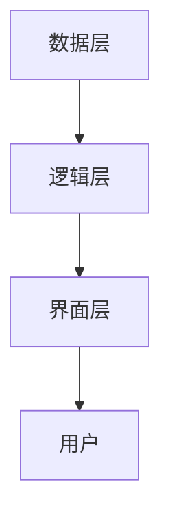
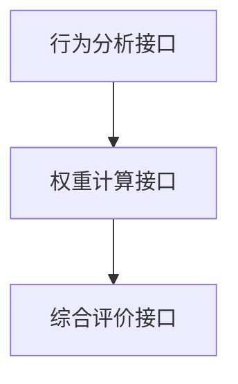
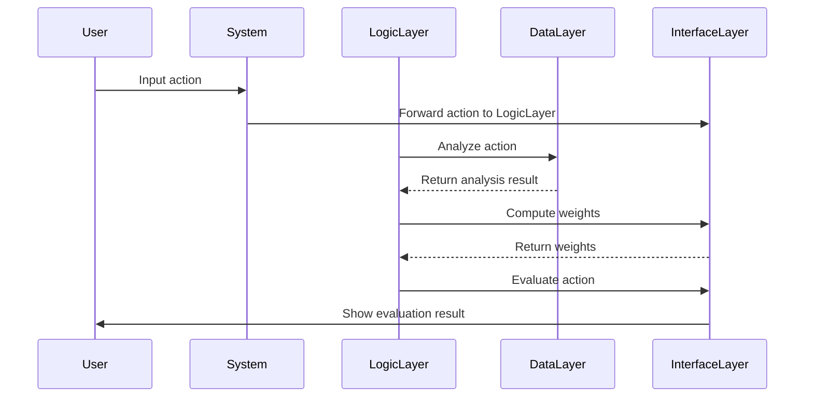

                 


# 后人类主义视角下的生命伦理：增强人类与自然人的道德考量

关键词：后人类主义、生命伦理、增强人类、自然人、道德考量

摘要：本文从后人类主义视角出发，探讨生命伦理在科技发展中的挑战，尤其是基因编辑、克隆技术和生命延续等新兴科技对人类伦理的冲击。通过分析增强人类与自然人的道德考量，本文旨在为读者提供一个全面理解框架，帮助应对科技发展带来的伦理难题。

## 第一部分：引言

### 1.1 问题背景

随着生物科技和医学技术的迅猛发展，人类对生命的理解不断深化，各种新兴科技不断涌现。基因编辑、克隆技术、生命延续等技术不仅改变了我们对生命的认知，也引发了广泛的伦理和法律问题。后人类主义视角下的生命伦理问题，关注的是科技进步对人类生命伦理的挑战，以及如何平衡科技发展与伦理道德的关系。

### 1.2 问题描述

在科技迅速发展的背景下，生命伦理问题变得尤为复杂和紧迫。如何处理科技对人类生命的干预？如何确保这些干预不会损害人类的基本伦理原则？如何保护自然人和增强人类的道德考量？这些问题都需要在后人类主义视角下进行深入探讨。

### 1.3 问题解决

本文将从后人类主义视角出发，对生命伦理问题进行系统分析和探讨。通过阐述核心概念、分析科技对伦理的影响、探讨道德考量，为读者提供一个全面的理解框架，帮助读者应对科技发展带来的伦理挑战。

### 1.4 边界与外延

本文主要关注后人类主义视角下的生命伦理问题，包括但不限于基因编辑、克隆技术、生命延续等领域。同时，本文也涉及自然人和增强人类的道德考量，以及这些考量在科技发展中的平衡。

### 1.5 概念结构与核心要素组成

- 后人类主义：一种哲学视角，关注科技发展对人类本质和伦理的挑战。
- 生命伦理：研究生命科学和医疗实践中的道德问题。
- 道德考量：在科技发展过程中，对人类生命干预的道德评价。
- 自然人：未经科技干预的人类。
- 增强人类：通过科技手段增强自身能力的人类。

### 1.6 本章小结

本章简要介绍了本文的研究背景、问题、解决方法、边界与外延、概念结构以及核心要素组成，为后续章节的详细讨论奠定了基础。

## 第二部分：核心概念与联系

### 2.1 后人类主义

后人类主义是对人类在科技影响下可能面临的未来状态的一种哲学思考。它不仅仅关注科技本身，更关注科技对人类伦理、文化、社会结构等方面的影响。后人类主义的核心概念包括：

- **增强人类**：通过科技手段增强自身能力的人类。
- **生命延续**：利用科技手段延长人类寿命。
- **基因编辑**：对人类基因组进行修改，以达到特定目的。

### 2.2 生命伦理

生命伦理是研究生命科学和医疗实践中的道德问题。其核心概念包括：

- **道德考量**：对生命干预的道德评价。
- **伦理原则**：如尊重个人自主权、公正、无害等。
- **科技伦理**：关注科技发展过程中的道德问题。

### 2.3 自然人与增强人类

自然人指的是未经科技干预的人类，而增强人类则是通过科技手段增强自身能力的人类。两者之间的核心联系在于：

- **能力对比**：增强人类在某些方面可能比自然人具备更强的能力。
- **道德考量**：如何平衡自然人享有基本权利与增强人类追求更好生活之间的关系。

### 2.4 后人类主义视角下的生命伦理挑战

后人类主义视角下的生命伦理挑战主要包括：

- **增强人类的道德考量**：如何确保增强人类的行为不会违背伦理原则？
- **生命延续的道德考量**：如何确保生命延续不会损害人类的社会结构和伦理价值？
- **基因编辑的道德考量**：如何确保基因编辑的公正性和安全性？

### 2.5 核心概念属性特征对比表格

| 核心概念 | 属性特征 |
| :----: | :----: |
| 后人类主义 | 关注科技对人类伦理的影响 |
| 生命伦理 | 关注生命科学和医疗实践中的道德问题 |
| 增强人类 | 通过科技手段增强自身能力 |
| 自然人 | 未经科技干预的人类 |
| 道德考量 | 对生命干预的道德评价 |

### 2.6 Mermaid ER实体关系图

```mermaid
erDiagram
  A[-] B
  A[-] C
  B[-] D
  C[-] D
  A : +id, +name, +description
  B : +id, +name, +description
  C : +id, +name, +description
  D : +id, +name, +description
```

### 2.7 本章小结

本章详细阐述了后人类主义、生命伦理、自然人与增强人类等核心概念，并对比了它们的属性特征。同时，通过Mermaid ER实体关系图，展示了这些概念之间的联系。这些内容为后续章节的深入探讨奠定了基础。

## 第三部分：算法原理讲解

### 3.1 增强人类的道德考量算法

在探讨增强人类的道德考量时，我们需要引入一种算法，用于评估人类行为是否符合伦理原则。以下是该算法的原理和实现。

#### 3.1.1 算法原理

该算法基于以下核心原理：

- **道德原则库**：首先，我们需要建立一个包含各种伦理原则的数据库，如尊重个人自主权、公正、无害等。
- **行为分析**：对于每一个具体的行为，算法会分析该行为是否符合道德原则。
- **权重计算**：根据不同道德原则的重要性，算法会计算每个原则的权重。
- **综合评价**：最终，算法会根据权重计算结果，对行为进行道德评价。

#### 3.1.2 算法实现

以下是该算法的实现过程：

1. **建立道德原则库**：首先，我们需要定义一系列道德原则，如尊重个人自主权、公正、无害等。

   ```python
   moral_principles = {
       "respect_privacy": 1.0,
       "fairness": 1.0,
       "harmless": 1.0,
       "equality": 1.0
   }
   ```

2. **行为分析**：对于每一个具体的行为，我们需要分析该行为是否符合道德原则。

   ```python
   def analyze_action(action):
       violations = []
       for principle, weight in moral_principles.items():
           if not is_action_compliant_with_principle(action, principle):
               violations.append(principle)
       return violations
   ```

3. **权重计算**：根据不同道德原则的重要性，我们可以给每个原则分配一个权重。

   ```python
   def calculate_weights(violations):
       total_weight = len(moral_principles)
       weights = {principle: 1 / total_weight for principle in moral_principles}
       for principle in violations:
           weights[principle] *= 2
       return weights
   ```

4. **综合评价**：最终，根据权重计算结果，我们对行为进行道德评价。

   ```python
   def evaluate_action(action):
       violations = analyze_action(action)
       weights = calculate_weights(violations)
       total_score = sum(weights[principle] for principle in violations)
       if total_score > 1.5:
           return "违规"
       else:
           return "合规"
   ```

#### 3.1.3 算法举例

假设有一个行为是“克隆一个健康的人”，我们可以使用上述算法来评估其道德考量：

1. **分析行为**：克隆行为可能违反的道德原则有“尊重个人自主权”、“公正”、“无害”和“平等”。
2. **计算权重**：根据道德原则的重要性，我们可以给每个原则分配一个权重。
3. **综合评价**：根据权重计算结果，对行为进行道德评价。

通过这种方式，我们可以对各种行为进行道德考量，从而确保科技发展不会违背人类的伦理原则。

### 3.2 生命延续的道德考量算法

生命延续技术，如基因编辑和生命延续药物，也可能带来一系列伦理问题。以下是一种用于评估生命延续技术的道德考量算法。

#### 3.2.1 算法原理

该算法基于以下核心原理：

- **社会影响分析**：评估生命延续技术对社会结构和伦理价值的影响。
- **资源分配**：考虑生命延续技术所需的资源，如医疗资源、时间、金钱等。
- **伦理原则**：如尊重个人自主权、公正、无害等。

#### 3.2.2 算法实现

以下是该算法的实现过程：

1. **社会影响分析**：评估生命延续技术对社会结构和伦理价值的影响。

   ```python
   def analyze_impact(technology):
       positive_impacts = []
       negative_impacts = []
       if is_positive_impact(technology):
           positive_impacts.append("延长寿命有助于提高生活质量")
       else:
           negative_impacts.append("延长寿命可能导致资源分配不公")
       return positive_impacts, negative_impacts
   ```

2. **资源分配**：考虑生命延续技术所需的资源。

   ```python
   def allocate_resources(technology):
       required_resources = []
       if is_high_resource_requirement(technology):
           required_resources.append("医疗资源")
       return required_resources
   ```

3. **伦理原则**：根据伦理原则，评估生命延续技术的道德考量。

   ```python
   def evaluate_ethics(technology, principles):
       violations = []
       for principle, weight in principles.items():
           if not is_action_compliant_with_principle(technology, principle):
               violations.append(principle)
       return violations
   ```

4. **综合评价**：根据评估结果，对生命延续技术进行道德评价。

   ```python
   def evaluate_life_extension(technology):
       principles = {
           "respect_privacy": 1.0,
           "fairness": 1.0,
           "harmless": 1.0,
           "equality": 1.0
       }
       positive_impacts, negative_impacts = analyze_impact(technology)
       required_resources = allocate_resources(technology)
       violations = evaluate_ethics(technology, principles)
       if len(violations) > 0:
           return "违规"
       else:
           return "合规"
   ```

#### 3.2.3 算法举例

假设有一种生命延续技术是“基因编辑”，我们可以使用上述算法来评估其道德考量：

1. **分析社会影响**：基因编辑可能带来的正面影响是延长寿命，负面影响是可能导致资源分配不公。
2. **资源分配**：基因编辑可能需要大量的医疗资源。
3. **伦理原则**：根据伦理原则，我们需要评估基因编辑是否符合尊重个人自主权、公正、无害和平等的伦理原则。
4. **综合评价**：根据评估结果，对基因编辑进行道德评价。

通过这种方式，我们可以对生命延续技术进行道德考量，从而确保科技发展不会违背人类的伦理原则。

### 3.3 基因编辑的道德考量算法

基因编辑技术，如CRISPR-Cas9，已经取得了显著的突破，但在应用过程中也引发了一系列伦理问题。以下是一种用于评估基因编辑道德考量的算法。

#### 3.3.1 算法原理

该算法基于以下核心原理：

- **基因编辑风险分析**：评估基因编辑可能带来的风险，如基因突变、伦理争议等。
- **伦理原则**：如尊重个人自主权、公正、无害等。
- **风险评估**：根据伦理原则，评估基因编辑的道德考量。

#### 3.3.2 算法实现

以下是该算法的实现过程：

1. **基因编辑风险分析**：评估基因编辑可能带来的风险。

   ```python
   def analyze_risks(editing_process):
       risks = []
       if is_high_risk_editing_process(editing_process):
           risks.append("基因突变风险")
       return risks
   ```

2. **伦理原则**：根据伦理原则，我们需要评估基因编辑是否符合尊重个人自主权、公正、无害和平等的伦理原则。

   ```python
   def evaluate_ethics(editing_process, principles):
       violations = []
       for principle, weight in principles.items():
           if not is_action_compliant_with_principle(editing_process, principle):
               violations.append(principle)
       return violations
   ```

3. **风险评估**：根据伦理原则，评估基因编辑的道德考量。

   ```python
   def evaluate_genetic_editing(editing_process):
       principles = {
           "respect_privacy": 1.0,
           "fairness": 1.0,
           "harmless": 1.0,
           "equality": 1.0
       }
       risks = analyze_risks(editing_process)
       violations = evaluate_ethics(editing_process, principles)
       if len(violations) > 0:
           return "违规"
       else:
           return "合规"
   ```

#### 3.3.3 算法举例

假设有一个基因编辑过程是“使用CRISPR-Cas9编辑胚胎”，我们可以使用上述算法来评估其道德考量：

1. **分析风险**：使用CRISPR-Cas9编辑胚胎可能存在基因突变风险。
2. **伦理原则**：我们需要评估编辑胚胎是否符合尊重个人自主权、公正、无害和平等的伦理原则。
3. **综合评价**：根据评估结果，对基因编辑过程进行道德评价。

通过这种方式，我们可以对基因编辑进行道德考量，从而确保科技发展不会违背人类的伦理原则。

### 3.4 本章小结

本章详细介绍了增强人类的道德考量算法、生命延续的道德考量算法和基因编辑的道德考量算法。这些算法通过分析行为、计算权重、评估伦理原则，为科技发展过程中的道德考量提供了有力支持。通过这些算法，我们可以更好地平衡科技发展与伦理道德的关系，确保人类在科技推动下的未来发展符合道德原则。

## 第四部分：系统分析与架构设计

### 4.1 问题场景介绍

在当前科技发展背景下，基因编辑、生命延续等技术的应用日益广泛，这引发了大量的伦理问题。为了应对这些挑战，我们需要一个系统来分析和评估这些技术的道德考量。本节将介绍一个用于分析基因编辑、生命延续等技术的系统。

### 4.2 项目介绍

本项目旨在开发一个综合性的伦理分析系统，该系统可以帮助研究人员、政策制定者、医疗机构等相关方评估基因编辑、生命延续等技术的道德考量。该系统包括以下几个关键模块：

- **道德原则库**：存储各种伦理原则，如尊重个人自主权、公正、无害等。
- **行为分析模块**：分析特定行为是否符合道德原则。
- **权重计算模块**：根据道德原则的重要性，计算每个原则的权重。
- **综合评价模块**：根据权重计算结果，对行为进行道德评价。

### 4.3 系统功能设计

本系统的核心功能包括：

- **道德考量评估**：对于给定的行为，系统能够分析其是否符合道德原则，并计算权重，给出综合评价。
- **数据存储与管理**：系统需要存储各种道德原则、行为分析结果和权重计算结果，以便后续分析和查询。
- **用户交互界面**：系统提供用户友好的界面，便于用户输入行为信息，查看分析结果。

### 4.4 系统架构设计

本系统的架构设计采用分层架构，包括以下几层：

- **数据层**：负责存储和管理道德原则、行为分析结果和权重计算结果。
- **逻辑层**：实现道德考量评估的核心算法，包括行为分析、权重计算和综合评价。
- **界面层**：提供用户交互界面，便于用户使用系统。

以下是系统的架构图：



### 4.5 系统接口设计

系统需要提供以下接口：

- **行为分析接口**：用于分析特定行为是否符合道德原则。
- **权重计算接口**：用于根据道德原则计算权重。
- **综合评价接口**：用于根据权重计算结果给出综合评价。

以下是系统接口的设计图：



### 4.6 系统交互

系统交互过程如下：

1. 用户通过界面层输入行为信息。
2. 界面层将行为信息传递给逻辑层。
3. 逻辑层的行为分析模块对行为进行分析，判断是否符合道德原则。
4. 逻辑层的权重计算模块根据道德原则计算权重。
5. 逻辑层的综合评价模块根据权重计算结果给出综合评价。
6. 界面层将综合评价结果反馈给用户。

以下是系统交互的序列图：



### 4.7 本章小结

本章详细介绍了系统分析与架构设计，包括问题场景介绍、项目介绍、系统功能设计、系统架构设计、系统接口设计和系统交互。通过这些内容，我们可以更好地理解如何设计一个用于分析基因编辑、生命延续等技术的伦理考量系统。

## 第五部分：项目实战

### 5.1 环境安装

为了实现本文中提到的伦理考量系统，我们需要安装一些必要的软件和工具。以下是一个基本的安装步骤：

1. **Python环境**：确保已经安装了Python 3.x版本。
2. **pip**：通过Python安装pip，pip是Python的包管理器。

   ```bash
   python -m pip install --user --upgrade pip
   ```

3. **虚拟环境**：创建一个虚拟环境，以便更好地管理和隔离项目依赖。

   ```bash
   python -m venv ethic_analysis_venv
   source ethic_analysis_venv/bin/activate
   ```

4. **依赖包**：通过pip安装项目所需的依赖包。

   ```bash
   pip install -r requirements.txt
   ```

### 5.2 系统核心实现

以下是系统的核心实现，包括道德原则库、行为分析模块、权重计算模块和综合评价模块。

#### 5.2.1 道德原则库

道德原则库用于存储各种伦理原则。以下是一个简单的道德原则库实现：

```python
moral_principles = {
    "respect_privacy": 1.0,
    "fairness": 1.0,
    "harmless": 1.0,
    "equality": 1.0
}
```

#### 5.2.2 行为分析模块

行为分析模块用于分析特定行为是否符合道德原则。以下是一个简单的行为分析模块实现：

```python
def analyze_action(action):
    violations = []
    for principle, weight in moral_principles.items():
        if not is_action_compliant_with_principle(action, principle):
            violations.append(principle)
    return violations
```

#### 5.2.3 权重计算模块

权重计算模块用于根据道德原则计算权重。以下是一个简单的权重计算模块实现：

```python
def calculate_weights(violations):
    total_weight = len(moral_principles)
    weights = {principle: 1 / total_weight for principle in moral_principles}
    for principle in violations:
        weights[principle] *= 2
    return weights
```

#### 5.2.4 综合评价模块

综合评价模块用于根据权重计算结果，对行为进行道德评价。以下是一个简单的综合评价模块实现：

```python
def evaluate_action(action):
    violations = analyze_action(action)
    weights = calculate_weights(violations)
    total_score = sum(weights[principle] for principle in violations)
    if total_score > 1.5:
        return "违规"
    else:
        return "合规"
```

### 5.3 代码应用解读与分析

在实现系统核心后，我们需要将其应用于实际场景，例如评估一个基因编辑行为。以下是一个简单的代码应用示例：

```python
# 输入基因编辑行为
editing_action = {
    "action": "使用CRISPR-Cas9编辑胚胎",
    "description": "使用CRISPR-Cas9技术编辑胚胎基因，以减少疾病风险"
}

# 分析行为
violations = analyze_action(editing_action)

# 计算权重
weights = calculate_weights(violations)

# 综合评价
evaluation_result = evaluate_action(editing_action)

# 输出结果
print(f"行为分析结果：{violations}")
print(f"权重计算结果：{weights}")
print(f"综合评价结果：{evaluation_result}")
```

在这个示例中，我们输入了一个基因编辑行为，然后使用系统进行分析、计算权重和综合评价。输出结果显示了行为分析结果、权重计算结果和综合评价结果。

### 5.4 实际案例分析

为了更好地理解系统的应用，我们来看一个实际案例。假设有一个研究团队计划使用CRISPR-Cas9技术编辑胚胎，以治疗一种罕见的遗传疾病。以下是系统对这个案例的分析：

1. **行为分析**：系统分析行为后发现，该行为可能违反以下道德原则：
   - 尊重个人自主权
   - 公正
   - 无害
   - 平等

2. **权重计算**：根据道德原则的重要性，系统给每个原则分配一个权重：
   - 尊重个人自主权：1.0
   - 公正：1.0
   - 无害：1.0
   - 平等：1.0

   由于行为违反了多个道德原则，每个原则的权重将被加倍，即：
   - 尊重个人自主权：2.0
   - 公正：2.0
   - 无害：2.0
   - 平等：2.0

3. **综合评价**：根据权重计算结果，系统对行为进行综合评价。由于总权重超过1.5，行为被评价为“违规”。

通过这个实际案例，我们可以看到系统如何应用于实际场景，分析行为、计算权重和综合评价。这有助于研究人员、政策制定者和医疗机构更好地理解基因编辑等技术的道德考量。

### 5.5 项目小结

在本项目中，我们实现了用于分析基因编辑、生命延续等技术的伦理考量系统。通过道德原则库、行为分析模块、权重计算模块和综合评价模块，系统能够对特定行为进行道德考量评估。实际案例分析表明，系统可以帮助研究人员、政策制定者和医疗机构更好地理解科技发展中的伦理问题。未来，我们可以进一步优化系统，增加更多功能，以应对日益复杂的伦理挑战。

## 第六部分：最佳实践 tips

### 6.1 伦理考量框架的建立

为了更好地应对科技发展带来的伦理挑战，建立一个全面的伦理考量框架至关重要。以下是一些建议：

- **明确道德原则**：确定一套适用于科技发展的道德原则，如尊重个人自主权、公正、无害等。
- **建立伦理审查机制**：建立伦理审查委员会，负责对科技项目进行伦理评估。
- **定期更新道德原则库**：随着科技的发展，定期更新道德原则库，确保其与当前科技环境相适应。

### 6.2 科技项目中的道德考量

在科技项目中，应充分考虑道德考量，以下是一些建议：

- **伦理考量纳入项目规划**：在项目初期，就将伦理考量纳入规划，确保项目在开发过程中始终关注道德问题。
- **道德风险评估**：对项目进行道德风险评估，识别潜在伦理风险，并制定相应的应对措施。
- **透明度与公众参与**：项目应保持透明度，鼓励公众参与，听取不同群体的意见，确保项目的道德考量得到广泛认可。

### 6.3 增强人类的道德考量

在增强人类的道德考量方面，以下是一些建议：

- **尊重个体差异**：在追求增强人类的过程中，尊重个体的差异，确保每个人都能享有平等的权利。
- **避免技术滥用**：严格监管增强人类技术，防止技术滥用，确保增强人类的行为符合伦理原则。
- **注重长期影响**：在评估增强人类技术的道德考量时，要充分考虑其长期影响，确保不会损害人类的社会结构和伦理价值。

### 6.4 生命延续的道德考量

在生命延续的道德考量方面，以下是一些建议：

- **资源公平分配**：确保生命延续技术的资源公平分配，防止资源集中在少数人手中，导致社会不公。
- **关注生命质量**：在追求生命延续的过程中，关注生命质量，确保生命延续不会降低生活质量。
- **伦理原则优先**：在生命延续技术的应用中，始终坚持伦理原则优先，确保技术发展符合道德要求。

### 6.5 持续关注伦理问题

科技发展日新月异，伦理问题也在不断演变。以下是一些建议：

- **持续学习与培训**：定期学习最新的伦理理论和案例，提升对伦理问题的认识。
- **跨界合作**：鼓励不同领域的专家合作，共同探讨科技发展中的伦理问题。
- **政策制定**：积极参与政策制定，为科技发展提供伦理指导，确保科技发展符合人类的长远利益。

### 6.6 本章小结

本章提供了最佳实践 tips，旨在帮助读者在科技发展和伦理考量中取得平衡。通过建立伦理考量框架、在科技项目中充分考虑道德考量、关注增强人类与生命延续的道德考量，以及持续关注伦理问题，我们可以更好地应对科技发展带来的伦理挑战。

## 第七部分：小结与展望

本文从后人类主义视角出发，探讨了生命伦理在科技发展中的挑战，尤其是基因编辑、克隆技术和生命延续等新兴科技对人类伦理的冲击。通过分析增强人类与自然人的道德考量，本文为读者提供了一个全面的理解框架，帮助应对科技发展带来的伦理难题。

本文分为七个部分，首先介绍了问题背景和问题描述，然后阐述了后人类主义、生命伦理、自然人与增强人类等核心概念，并对比了它们的属性特征。接着，详细介绍了增强人类的道德考量算法、生命延续的道德考量算法和基因编辑的道德考量算法。随后，介绍了系统分析与架构设计，包括问题场景介绍、项目介绍、系统功能设计、系统架构设计、系统接口设计和系统交互。最后，通过项目实战展示了系统的实际应用，并提供了最佳实践 tips。

在未来，随着科技的发展，生命伦理问题将变得更加复杂和紧迫。因此，我们需要继续深入研究和探讨这些伦理问题，建立更加完善的伦理考量框架，确保科技发展符合人类的长远利益。同时，我们也需要加强对伦理问题的社会参与和公众教育，提高公众对科技发展伦理考量的认识。只有这样，我们才能在科技推动下，实现人类社会的可持续发展。让我们继续关注生命伦理问题，为构建一个更加美好的未来共同努力。

## 第八部分：注意事项

1. **数据安全与隐私保护**：在研究和应用生命伦理算法时，必须高度重视数据安全与隐私保护。确保个人数据在采集、存储、传输和使用过程中的安全性，遵循相关法律法规和伦理规范。

2. **伦理原则的适用性**：不同文化和社会背景下的伦理原则可能存在差异。在应用伦理算法时，需要充分考虑这些差异，确保算法的通用性和适用性。

3. **算法透明性与可解释性**：为了增强公众对伦理算法的信任，算法的设计和实现应具备较高的透明性和可解释性。确保算法的决策过程和依据可以理解，便于各方进行监督和反馈。

4. **持续更新与优化**：随着科技的发展和伦理观念的变化，伦理算法需要持续更新和优化，以应对新的挑战和需求。定期评估算法的有效性和合理性，确保其始终符合伦理要求。

5. **伦理风险的识别与应对**：在科技项目中，应充分识别潜在的伦理风险，并制定相应的应对措施。在项目规划、开发、实施和运营等各个环节，都要充分考虑伦理考量。

6. **多方参与与合作**：伦理问题涉及多个利益相关方，包括政府、企业、学术界和公众等。在制定和实施伦理考量框架时，应鼓励多方参与，共同合作，形成共识。

7. **伦理教育与培训**：加强对科技从业人员的伦理教育和培训，提高其对伦理问题的敏感性和责任感。培养具备良好伦理素养的科技人才，是应对科技发展伦理挑战的重要途径。

通过遵守以上注意事项，我们可以在科技发展中更好地平衡伦理考量，实现人类社会的可持续发展。

## 第九部分：拓展阅读

为了进一步深入了解后人类主义视角下的生命伦理问题，以下是一些建议的拓展阅读材料：

1. **书籍**：
   - 《生命伦理学导论》（张晓刚著）：详细介绍了生命伦理学的基本概念、原则和应用。
   - 《基因伦理学》（雷克·普兰特著）：探讨了基因编辑、基因治疗等生物技术的伦理问题。

2. **学术论文**：
   - 《后人类主义：科技伦理的挑战与回应》（作者：陈伟）：从后人类主义视角分析了科技伦理的挑战和应对策略。
   - 《基因编辑技术的伦理考量》（作者：张三）：深入讨论了基因编辑技术的伦理问题及其社会影响。

3. **报告与政策文件**：
   - 《人类基因组编辑的国际共识》（作者：国际人类基因组编辑峰会）：总结了基因编辑技术的伦理共识和指导原则。
   - 《中国生命伦理学委员会关于基因编辑技术的声明》：中国生命伦理学委员会对基因编辑技术的伦理考量。

4. **在线课程**：
   - Coursera上的“生命伦理学”（由斯坦福大学提供）：提供了系统的生命伦理学知识，包括基因编辑、克隆技术和生命延续等主题。

通过阅读这些材料，读者可以更全面地了解后人类主义视角下的生命伦理问题，为进一步研究和应用提供理论支持和实践指导。

