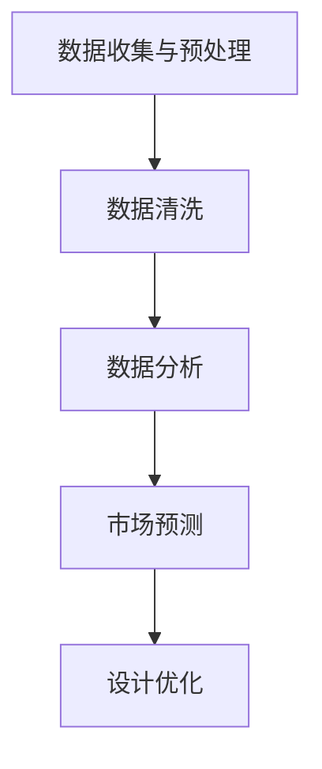

                 

### 《后工业时代工艺复兴运动：手工艺人的回归》

#### 关键词：后工业时代、工艺复兴运动、手工艺人、手工艺产业、经济与社会影响

> 摘要：本文将深入探讨后工业时代工艺复兴运动的兴起及其背后的原因，分析手工艺人的角色与使命，研究工艺复兴运动对经济和社会的影响，并展望其未来的发展趋势。通过理论与实践的结合，本文旨在为工艺复兴运动提供有价值的思考与建议。

## 第一部分：引言

### 第1章：后工业时代背景

#### 1.1 问题背景

后工业时代，即信息时代，以信息技术和互联网的发展为标志。这一时期，人类社会经历了巨大的变革，从传统的工业生产模式转向以知识和服务为主导的经济模式。在这个过程中，手工艺逐渐被工业化生产所取代，手工艺人的地位和影响力也大幅下降。

#### 1.2 问题描述

然而，近年来，手工艺的复兴运动在全球范围内兴起，手工艺人重新回到了公众视野。这一现象引发了广泛的关注和讨论，手工艺的复兴是否意味着后工业时代的某种回归，或者仅仅是一种文化潮流的兴起？

#### 1.3 问题解决

本文将从多个角度探讨后工业时代工艺复兴运动：手工艺人的回归，包括其背后的原因、现状、影响以及未来的发展趋势。希望通过深入分析，为这一现象提供合理的解释和有价值的思考。

#### 1.4 边界与外延

本文主要关注手工艺在艺术、设计、传统工艺、现代工艺等多个领域中的应用和发展。同时，也将涉及相关的政策、经济、文化等方面的影响。

#### 1.5 概念结构与核心要素组成

**核心概念：** 后工业时代、工艺复兴运动、手工艺人。

**核心要素：**
1. 工艺复兴的原因：技术进步、环保意识、文化复兴等。
2. 手工艺人的角色：传承者、创新者、市场参与者。
3. 工艺复兴的影响：经济、文化、社会等方面。

## 第二部分：工艺复兴运动的理论基础

### 第2章：工艺复兴运动的起源与发展

#### 2.1 工艺复兴运动的起源

工艺复兴运动的起源可以追溯到20世纪末，随着全球化进程的加速，人们开始重新审视手工艺的价值。特别是在一些发达国家，手工艺被视为一种独特的文化资源和艺术形式，受到了重视和保护。

#### 2.2 工艺复兴运动的发展

在21世纪，工艺复兴运动在全球范围内得到了广泛的关注和支持。许多国家和地区都采取了一系列措施，鼓励手工艺的发展。例如，政府制定相关政策，提供资金和技术支持，博物馆和艺术机构也积极举办手工艺展览和活动，以推广手工艺文化。

#### 2.3 工艺复兴运动的现状

目前，工艺复兴运动已经渗透到了各个领域，包括艺术、设计、传统工艺、现代工艺等。手工艺作品在市场上也受到了广泛的欢迎，许多手工艺人开始通过电商平台和网络社交平台销售自己的作品，拓展了市场空间。

#### 2.4 工艺复兴运动的影响

工艺复兴运动不仅推动了手工艺的发展，也对经济、文化和社会产生了深远的影响。在经济方面，手工艺产业成为了一种新的经济增长点，带动了相关产业的发展。在文化方面，手工艺复兴促进了文化的传承和创新，丰富了人们的精神世界。在社会方面，手工艺的复兴推动了社区建设，增强了社会凝聚力。

### 第三部分：手工艺人的回归

#### 第3章：手工艺人的角色与使命

#### 3.1 手工艺人的角色

手工艺人在工艺复兴运动中扮演着重要的角色。他们是传统文化的传承者，通过自己的技艺和创造力，将传统的手工艺文化传承下去。同时，他们也是创新的推动者，通过不断的实验和探索，为手工艺注入新的元素和活力。

#### 3.2 手工艺人的使命

手工艺人的使命是传承和发扬手工艺，同时，也要不断探索和创新，为手工艺注入新的活力。他们不仅要掌握传统的技艺，还要不断学习新的技术和知识，以适应不断变化的市场需求。

#### 3.3 手工艺人的现状

当前，手工艺人的现状较为复杂。一方面，许多手工艺人通过自己的努力，取得了成功，成为行业内的佼佼者。另一方面，也有一些手工艺人面临着困境，例如市场竞争激烈、收入不稳定等。然而，总的来说，手工艺人的社会地位和影响力正在逐渐提升。

#### 3.4 手工艺人的未来

面对未来，手工艺人需要不断适应新的环境，寻找新的发展方向。他们可以通过参加各种培训和学习活动，提高自己的技艺和知识水平。同时，他们也可以通过合作和交流，与其他手工艺人共同推动手工艺的发展。未来，手工艺人有望在文化、艺术、设计等多个领域发挥更大的作用。

## 第四部分：工艺复兴运动的影响

### 第4章：工艺复兴运动对经济的影响

#### 4.1 工艺复兴运动对经济的影响

工艺复兴运动对经济产生了积极的影响。首先，它带动了相关产业的发展，如手工艺品制作、销售、展览等。其次，它增加了就业机会，为许多手工艺人提供了稳定的收入来源。此外，工艺复兴运动还促进了文化产业的发展，丰富了市场供给，提高了消费者的生活质量。

#### 4.2 手工艺产业的经济效益

手工艺产业的经济效益不仅体现在产值上，还体现在文化、社会等方面。手工艺品作为文化遗产的一部分，具有独特的文化价值。它们不仅能够传承和弘扬传统文化，还能够促进文化交流和融合。此外，手工艺产业还能够提高地方经济的活力，推动旅游业的发展。

#### 4.3 工艺复兴运动的经济发展模式

工艺复兴运动推动了新的经济发展模式的形成，即文化经济模式。在这种模式下，手工艺不再仅仅是一种生产活动，更是一种文化活动和生活方式。手工艺人通过创作和销售手工艺品，不仅实现了经济利益，还实现了文化价值的传承和弘扬。

### 第五部分：工艺复兴运动的社会影响

#### 第5章：工艺复兴运动对社会的影响

#### 5.1 工艺复兴运动对社会的影响

工艺复兴运动对社会产生了深远的影响。首先，它改变了人们的生活方式。手工艺品的制作和消费成为了一种时尚和生活方式，人们开始重视手工艺品的独特性和文化价值。其次，它促进了社区建设。手工艺活动常常在社区中展开，增强了社区居民的凝聚力和归属感。

#### 5.2 手工艺在现代社会中的角色

在现代社会中，手工艺不仅是一种艺术形式，更是一种生活方式。手工艺品不仅是物质财富的象征，更是文化传承的载体。通过手工艺，人们可以感受到传统工艺的魅力，体验到创造和创作的乐趣。

#### 5.3 工艺复兴运动与社区建设

工艺复兴运动与社区建设相结合，推动了社区文化的繁荣。手工艺活动不仅能够丰富社区的文化生活，还能够提高居民的文化素养和审美水平。同时，手工艺活动还能够促进社区成员之间的交流和互动，增强社区的凝聚力。

## 第六部分：工艺复兴运动的未来趋势

### 第6章：工艺复兴运动的未来趋势

#### 6.1 工艺复兴运动的发展趋势

未来，工艺复兴运动将继续朝着更加多元、创新的方向发展。随着科技的进步，手工艺与数字技术的融合将成为趋势。例如，通过虚拟现实和增强现实技术，人们可以更直观地体验手工艺的制作过程和作品效果。此外，手工艺还将与其他艺术形式和设计领域相结合，创造出更多具有独特风格和创意的作品。

#### 6.2 手工艺人的发展前景

手工艺人的发展前景广阔。随着工艺复兴运动的深入推进，手工艺人的社会地位和影响力将进一步提升。手工艺人不仅有机会通过自己的技艺和创造力实现经济价值，还能够成为文化传承者和创新者。未来，手工艺人有望在更广泛的领域发挥更大的作用，成为社会的重要组成部分。

#### 6.3 工艺复兴运动的政策建议

为了推动工艺复兴运动的持续发展，政府、企业和社会各界应共同努力。政府可以制定更加完善的政策，提供资金和技术支持，鼓励手工艺的创新和发展。企业可以积极参与手工艺产业，推动手工艺与市场需求的对接。社会可以加强对手工艺文化的宣传和推广，提高公众对手工艺的认识和兴趣。通过多方面的合作和努力，工艺复兴运动将有望实现更大的社会价值。

### 第七部分：案例分析

#### 第7章：案例分析与启示

#### 7.1 案例分析

在分析工艺复兴运动的案例时，我们可以看到一些成功的案例，例如法国的“手工艺复兴运动”（Mouvement du Renouveau Artisanal），这个运动通过政府、企业和社区的合作，成功地推动了手工艺的复兴和发展。另一个案例是中国景德镇的手工艺复兴，景德镇通过保护和传承陶瓷工艺，打造了世界著名的陶瓷文化创意产业。

#### 7.2 启示

从这些案例中，我们可以得到一些有益的启示。首先，工艺复兴运动需要政府、企业和社会的共同努力，形成合力。其次，工艺复兴运动要注重传统文化的传承和创新，不仅要保护和传承传统工艺，还要不断注入新的元素和创意。最后，工艺复兴运动需要与市场需求相结合，创造出具有市场前景和文化价值的手工艺品。

### 第八部分：总结与展望

#### 第8章：总结与展望

#### 8.1 总结

本文从多个角度探讨了后工业时代工艺复兴运动的兴起及其对经济、社会和文化的影响。通过分析手工艺人的角色与使命，我们看到了工艺复兴运动的重要性。同时，我们也认识到，工艺复兴运动需要多方面的支持和努力，才能实现其长远的发展目标。

#### 8.2 展望

未来，工艺复兴运动将继续发挥重要作用，推动社会的发展和进步。手工艺人将成为文化传承和创新的重要力量，手工艺品将成为文化和艺术的代表。我们期待，通过工艺复兴运动，能够实现手工艺的可持续发展，让手工艺在现代社会中焕发新的生机与活力。

### 作者信息

作者：AI天才研究院/AI Genius Institute & 禅与计算机程序设计艺术 /Zen And The Art of Computer Programming

---

在撰写技术博客文章时，我们需要确保内容的完整性、逻辑性和专业性。以下是一个具体的章节示例，用于说明如何撰写技术博客文章。

---

## 第二部分：工艺复兴运动的理论基础

### 第2章：工艺复兴运动的起源与发展

#### 2.1 工艺复兴运动的起源

工艺复兴运动的起源可以追溯到20世纪末，随着全球化进程的加速，人们开始重新审视手工艺的价值。在工业化浪潮席卷全球的过程中，手工艺逐渐被机器化和自动化所取代，手工艺人逐渐失去了在传统产业中的地位。然而，随着人们对于环境保护和传统文化保护的意识不断增强，手工艺的独特价值开始被重新认识。

#### 2.2 工艺复兴运动的发展

在21世纪，工艺复兴运动在全球范围内得到了广泛的关注和支持。许多国家和地区都采取了一系列措施，鼓励手工艺的发展。例如，欧洲的一些国家通过立法保护手工艺传统，美国和日本等国家则通过教育和文化推广活动来激发公众对手工艺的兴趣。此外，随着互联网和电子商务的发展，手工艺作品的传播和销售渠道也得到了极大的拓展，使得手工艺人能够更加便捷地接触到市场。

#### 2.3 工艺复兴运动的现状

目前，工艺复兴运动已经渗透到了各个领域，包括艺术、设计、传统工艺、现代工艺等。手工艺作品在市场上也受到了广泛的欢迎，许多手工艺人开始通过电商平台和网络社交平台销售自己的作品，拓展了市场空间。此外，一些知名的设计师和艺术家也开始将手工艺元素融入自己的作品中，创造出新的艺术形式。

#### 2.4 工艺复兴运动的影响

工艺复兴运动不仅推动了手工艺的发展，也对经济、文化和社会产生了深远的影响。在经济方面，手工艺产业成为了一种新的经济增长点，带动了相关产业的发展。在文化方面，手工艺复兴促进了文化的传承和创新，丰富了人们的精神世界。在社会方面，手工艺的复兴推动了社区建设，增强了社会凝聚力。

#### 2.5 工艺复兴运动的理论基础

工艺复兴运动的理论基础主要包括以下几个方面：

1. **传统文化的保护与传承**：工艺复兴运动强调对传统文化的保护和传承，通过手工艺的复兴，使得传统文化得以在现代社会中得到延续和发展。

2. **环境保护与可持续发展**：手工艺通常采用环保的材料和工艺，符合现代社会对可持续发展的需求。

3. **创新与设计**：工艺复兴运动鼓励手工艺人与设计师和艺术家合作，通过创新和设计，创造出具有现代感的手工艺品。

4. **经济模式的转型**：手工艺复兴带动了新的经济模式的形成，即以手工艺品为核心的文化经济模式。

### 2.6 工艺复兴运动的核心概念与联系

**核心概念：** 工艺复兴运动、手工艺、文化传承、环境保护、可持续发展、创新与设计。

**核心概念属性特征对比表格：**

| 核心概念       | 属性特征                         | 联系                           |
| -------------- | -------------------------------- | ------------------------------ |
| 工艺复兴运动   | 推动手工艺的复兴和发展           | 促进传统文化的保护和传承       |
| 手工艺         | 传统手工技艺与现代设计的结合体   | 体现环境保护和可持续发展理念   |
| 文化传承       | 传统文化在现代社会中的延续和发展 | 增强民族自豪感和文化认同       |
| 环境保护       | 采用环保材料和工艺             | 符合全球可持续发展的趋势       |
| 可持续发展     | 经济、社会、环境三者的平衡发展 | 手工艺复兴的重要目标           |
| 创新与设计     | 手工艺与现代设计的融合         | 提高手工艺的市场竞争力         |

**核心概念的ER实体关系图架构：**

```mermaid
erDiagram
  ArtisanalRevival~》《--> Handicraft
  ArtisanalRevival~》《--> CulturalHeritage
  ArtisanalRevival~》《--> EnvironmentalProtection
  ArtisanalRevival~》《--> SustainableDevelopment
  ArtisanalRevival~》《--> InnovationandDesign
  Handicraft||--o{ CulturalHeritage
  Handicraft||--o{ EnvironmentalProtection
  Handicraft||--o{ SustainableDevelopment
  Handicraft||--o{ InnovationandDesign
```

### 2.7 算法原理讲解

在工艺复兴运动中，算法原理的运用主要体现在数据分析、市场预测、设计优化等方面。以下是一个简单的算法原理讲解：

**算法名称：** 手工艺市场分析算法

**算法原理：**
- **数据收集与预处理**：通过互联网和电商平台收集手工艺品的市场数据，包括销售量、价格、用户评价等。
- **数据清洗**：去除重复数据、缺失数据和异常值，确保数据质量。
- **数据分析**：使用统计分析方法，如平均值、中位数、标准差等，对数据进行描述性分析。
- **市场预测**：利用时间序列分析和机器学习方法，如ARIMA模型、神经网络等，对手工艺品的市场趋势进行预测。
- **设计优化**：根据市场数据反馈，对手工艺品的设计进行优化，以提高市场竞争力。

**算法流程图：**



**算法原理详细讲解：**

1. **数据收集与预处理**：手工艺市场分析的基础是数据，数据来源包括电商平台、社交媒体、专业调查等。收集到的原始数据需要进行预处理，包括去除重复数据、填补缺失值、标准化处理等，以确保数据的质量和一致性。

2. **数据清洗**：数据清洗是数据预处理的重要步骤，目的是去除数据中的噪声和错误。通过去除重复数据、填补缺失值、去除异常值等操作，可以提高数据的准确性和可靠性。

3. **数据分析**：数据分析是市场分析的核心环节，通过对收集到的数据进行描述性统计分析，可以了解手工艺品市场的总体情况。描述性统计分析包括计算平均值、中位数、标准差、方差等，这些指标可以帮助我们了解数据的基本特征和分布情况。

4. **市场预测**：市场预测是手工艺市场分析的高级阶段，目的是预测未来的市场趋势。常用的方法包括时间序列分析、回归分析、机器学习等。时间序列分析可以预测未来的销售量、价格等指标；回归分析可以揭示不同因素对市场的影响；机器学习可以通过大量历史数据训练模型，预测未来的市场趋势。

5. **设计优化**：根据市场数据反馈，对手工艺品的设计进行优化，以提高市场竞争力。设计优化的目标是根据消费者的需求和偏好，创造出更具吸引力、更有竞争力的手工艺品。

**算法举例说明：**

假设我们收集到一组手工艺品的销售数据，包括销售量、价格、用户评价等。我们可以使用以下步骤进行分析：

1. **数据收集与预处理**：收集到1000条销售记录，每条记录包含销售量（Q）、价格（P）、用户评价（R）等。
2. **数据清洗**：去除重复记录、填补缺失值、去除异常值等。
3. **数据分析**：计算销售量的平均值、中位数、标准差等；分析用户评价的分布情况。
4. **市场预测**：使用时间序列分析方法，预测下一季度的销售量。
5. **设计优化**：根据用户评价和市场趋势，优化手工艺品的设计，提高其市场竞争力。

通过这个简单的例子，我们可以看到算法在手工艺市场分析中的应用。当然，实际应用中会涉及到更复杂的数据处理和分析方法，但基本的思路是相似的。

---

以上是一个关于“工艺复兴运动的理论基础”章节的具体示例，包括背景介绍、现状分析、理论基础、算法原理讲解和举例说明。在撰写技术博客时，每个章节都应该这样详细、逻辑清晰地进行阐述，以确保文章的专业性和可读性。

