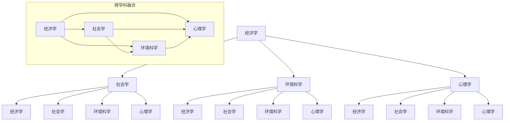
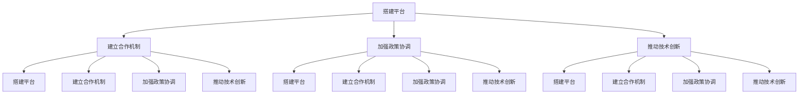

                 

# 后消费主义生活实验社区网络：全球性从拥有到存在的转变实践基地联盟

## 关键词：后消费主义、生活实验社区、全球性转变、实践基地联盟

## 摘要

本文探讨了后消费主义时代背景下，生活实验社区网络在全球范围内的兴起与发展。通过分析后消费主义理论的演变及其特征，本文揭示了生活实验社区的定义、分类及发展历程。进一步，本文提出了实践基地联盟的概念，阐述了其在全球性从拥有到存在转变中的重要作用，并探讨了实践基地联盟的理论基础、全球性网络构建路径及策略。通过案例研究和实践基地联盟的运营与管理分析，本文总结了后消费主义生活实验社区网络的现状、趋势及未来展望，为政策制定者和实践者提供了有价值的参考。

## 第1章 引言

### 1.1 书籍背景及研究目的

在全球经济高速发展的过程中，消费主义思潮逐渐占据主导地位，人们对物质财富的追求日益强烈。然而，随着环境恶化、资源短缺以及社会不平等问题的加剧，越来越多的学者开始反思消费主义的弊端，并提出后消费主义理念。后消费主义强调从拥有到存在的转变，倡导人们关注生活质量和精神满足，而非单纯追求物质财富的积累。本文旨在探讨后消费主义生活实验社区网络的全球性兴起与发展，分析其实践基地联盟的理论基础、网络构建策略及运营管理经验，为后消费主义生活实验社区网络的可持续发展提供理论支持和实践指导。

### 1.2 研究意义与内容框架

本文的研究意义主要体现在以下几个方面：

1. 深入了解后消费主义理论的演变及其对生活实验社区的影响，为相关研究提供理论支持。
2. 分析实践基地联盟在全球性从拥有到存在的转变中的重要作用，为后消费主义生活实验社区网络的构建提供策略建议。
3. 通过案例研究，总结实践基地联盟的运营管理经验，为后消费主义生活实验社区网络的运营提供参考。

本文内容框架如下：

1. 引言：介绍书籍背景、研究目的及意义。
2. 后消费主义理论与生活实验社区概述：分析后消费主义理论的发展与特征，介绍生活实验社区的定义、分类及发展历程。
3. 实践基地联盟的理论基础：阐述全球性从拥有到存在的转变概述，提出实践基地联盟的概念与功能，探讨其理论基础与跨学科融合。
4. 实践基地联盟的全球性网络构建：分析全球性网络的现状与趋势，探讨网络构建的挑战与机遇，提出网络构建的路径与策略。
5. 后消费主义生活实验社区网络案例研究：介绍典型案例，分析其实践探索、实验分析及实证研究。
6. 实践基地联盟的运营与管理：探讨实践基地联盟的运营模式与组织结构、管理体系与制度设计，分享成功案例与经验。
7. 未来展望与挑战：分析后消费主义生活实验社区网络的发展趋势、实践基地联盟的未来机遇与挑战，提出政策建议与实施策略。
8. 附录：介绍数据来源与收集方法、研究方法与工具应用、研究限制与展望。

### 1.3 本书结构安排

本书共分为八个章节，各章节内容如下：

- 第1章：引言，介绍书籍背景、研究目的及意义，阐述本书内容框架与结构安排。
- 第2章：后消费主义理论与生活实验社区概述，分析后消费主义理论的发展与特征，介绍生活实验社区的定义、分类及发展历程。
- 第3章：实践基地联盟的理论基础，阐述全球性从拥有到存在的转变概述，提出实践基地联盟的概念与功能，探讨其理论基础与跨学科融合。
- 第4章：实践基地联盟的全球性网络构建，分析全球性网络的现状与趋势，探讨网络构建的挑战与机遇，提出网络构建的路径与策略。
- 第5章：后消费主义生活实验社区网络案例研究，介绍典型案例，分析其实践探索、实验分析及实证研究。
- 第6章：实践基地联盟的运营与管理，探讨实践基地联盟的运营模式与组织结构、管理体系与制度设计，分享成功案例与经验。
- 第7章：未来展望与挑战，分析后消费主义生活实验社区网络的发展趋势、实践基地联盟的未来机遇与挑战，提出政策建议与实施策略。
- 第8章：附录，介绍数据来源与收集方法、研究方法与工具应用、研究限制与展望。

## 第2章 后消费主义理论与生活实验社区概述

### 2.1 后消费主义理论的发展与特征

后消费主义理论起源于20世纪末，是对消费主义思潮的反思和批判。其核心思想在于挑战物质主义和过度消费的生活方式，提倡人们关注生活质量和精神满足，而非单纯追求物质财富的积累。后消费主义理论的发展可以分为以下几个阶段：

1. **批判性消费主义**：20世纪70年代，批判性消费主义兴起，强调消费者对产品的选择权和消费过程中的社会责任。这一阶段主要关注消费行为对社会和环境的影响。
2. **反思性消费主义**：20世纪80年代，反思性消费主义进一步发展，强调消费者在消费过程中的主动性和创造性，提倡人们通过消费来表达自我价值。
3. **后消费主义**：20世纪90年代以来，后消费主义理论逐渐成熟，主张超越物质主义，关注生活质量和精神满足。后消费主义理论具有以下特征：

   - **去物质化**：后消费主义认为，物质财富并非生活幸福的唯一来源，人们应该追求更高质量的生活，而非单纯追求物质财富的积累。
   - **非物质化消费**：后消费主义提倡消费者减少对物质产品的消费，转向对体验、服务和关系的消费。
   - **生活意义**：后消费主义强调人们应该关注生活意义和价值的实现，而非单纯追求物质享受。
   - **可持续发展**：后消费主义主张消费行为应该符合可持续发展原则，关注环境和社会责任。

### 2.2 生活实验社区的定义与分类

生活实验社区是指在一定区域内，通过实验和实践探索后消费主义理念，推动人们从拥有到存在转变的社区。生活实验社区具有以下特征：

1. **实验性**：生活实验社区是一种探索性实践，旨在验证后消费主义理念在现实生活中的可行性和效果。
2. **社区性**：生活实验社区强调社区居民的参与和互动，通过共同生活和实践，推动后消费主义理念的传播和实践。
3. **多样性**：生活实验社区形式多样，包括生态社区、共享社区、创意社区等，旨在满足不同人群的需求。

根据生活实验社区的特点和目标，可以将其分为以下几类：

1. **生态社区**：以生态可持续发展为目标，倡导绿色生活、节能减排，关注环境保护和资源利用。
2. **共享社区**：以共享经济为核心，倡导共享生活、共享资源，提高社区资源的利用效率。
3. **创意社区**：以创意和创新为驱动力，鼓励社区居民参与文化、艺术和科技的创新和实践，推动社区文化繁荣。
4. **社区支持农业**：以社区支持农业（CSA）为模式，鼓励社区居民参与农业生产和消费，实现食品安全、生态保护和社区发展。

### 2.3 后消费主义生活实验社区的发展历程

后消费主义生活实验社区的发展历程可以概括为以下几个阶段：

1. **萌芽阶段**（20世纪90年代）：后消费主义理论开始受到关注，一些学者和环保组织开始探索后消费主义理念在现实生活中的应用，生活实验社区初步兴起。
2. **起步阶段**（21世纪初）：随着全球环保意识的提高和互联网技术的发展，生活实验社区逐渐受到关注，一些社区开始试点和推广后消费主义理念。
3. **发展阶段**（2010年以来）：后消费主义生活实验社区逐渐成熟，形成一定的规模和影响力，越来越多的社区加入这一行列，推动后消费主义理念的全球传播和实践。
4. **深化阶段**（未来）：随着全球性问题的加剧和人们对生活质量的追求，后消费主义生活实验社区将进一步深化发展，为全球性从拥有到存在的转变提供实践经验和借鉴。

### 2.4 后消费主义生活实验社区的核心概念与联系

在后消费主义生活实验社区中，核心概念包括：

1. **去物质化**：去物质化是后消费主义的核心原则，主张减少物质产品的消费，转向对体验、服务和关系的消费。
2. **共享经济**：共享经济是后消费主义生活实验社区的重要实践模式，通过共享资源、知识和技能，提高资源利用效率。
3. **社区参与**：社区参与是后消费主义生活实验社区的重要特征，通过社区居民的积极参与，推动社区发展和创新。
4. **可持续发展**：可持续发展是后消费主义生活实验社区的目标之一，关注环境、社会和经济的平衡发展。

这些核心概念相互关联，共同构成了后消费主义生活实验社区的理论体系。以下是一个简化的ER实体关系图，展示了这些核心概念之间的联系：

```mermaid
erDiagram
  A[后消费主义生活实验社区] ||--|{ B[去物质化] }
  A ||--|{ C[共享经济] }
  A ||--|{ D[社区参与] }
  A ||--|{ E[可持续发展] }
  B ||--|{ F[减少物质消费] }
  C ||--|{ G[共享资源] }
  D ||--|{ H[参与社区发展] }
  E ||--|{ I[环境社会平衡] }
```

### 2.5 后消费主义生活实验社区的核心要素组成

后消费主义生活实验社区的核心要素包括以下几个方面：

1. **社区组织**：社区组织是生活实验社区的核心，负责制定社区发展规划、组织活动和管理资源。
2. **居民参与**：居民参与是生活实验社区的重要特征，通过社区居民的积极参与，推动社区发展和创新。
3. **共享经济模式**：共享经济模式是生活实验社区的重要实践形式，通过共享资源、知识和技能，提高资源利用效率。
4. **可持续发展理念**：可持续发展理念是生活实验社区的核心目标，关注环境、社会和经济的平衡发展。
5. **社区支持农业**：社区支持农业是生活实验社区的一种重要实践模式，通过社区居民参与农业生产和消费，实现食品安全、生态保护和社区发展。

以下是一个简化的领域模型类图，展示了后消费主义生活实验社区的核心要素及其关系：

```mermaid
classDiagram
  ClassDef 社区组织(<#003399>)
  {
    - 姓名 String
    - 地址 String
    - 邮箱 String
    - 电话 String
  }
  ClassDef 居民参与(<#993399>)
  {
    - 居民姓名 String
    - 参与项目 String
    - 参与时间 Date
  }
  ClassDef 共享经济模式(<#006633>)
  {
    - 项目名称 String
    - 项目描述 String
    - 资源类型 String
    - 资源数量 Integer
  }
  ClassDef 可持续发展理念(<#336699>)
  {
    - 目标名称 String
    - 目标描述 String
    - 实施时间 Date
    - 实施进度 String
  }
  ClassDef 社区支持农业(<#663399>)
  {
    - 农产品名称 String
    - 生产方式 String
    - 产地 String
    - 销售渠道 String
  }
  社区组织 "包含" 居民参与
  社区组织 "包含" 共享经济模式
  社区组织 "包含" 可持续发展理念
  社区组织 "包含" 社区支持农业
```

### 2.6 后消费主义生活实验社区的价值与挑战

后消费主义生活实验社区在全球范围内兴起，具有重要的价值与挑战：

1. **价值**：
   - 提高生活质量：后消费主义生活实验社区关注生活质量和精神满足，有助于提升居民的生活水平。
   - 促进可持续发展：后消费主义生活实验社区倡导生态可持续发展理念，有助于减少环境污染和资源浪费。
   - 推动社会创新：后消费主义生活实验社区鼓励居民参与社区发展和创新，激发社会创造力。

2. **挑战**：
   - 社区认同感：后消费主义生活实验社区要求居民改变传统消费观念，形成社区认同感是一个挑战。
   - 资源配置：后消费主义生活实验社区需要合理配置资源，确保社区发展的可持续性。
   - 政策支持：后消费主义生活实验社区的发展需要政策支持，政策制定和执行是一个挑战。

### 2.7 总结与展望

后消费主义生活实验社区是应对消费主义弊端的重要实践探索，具有广泛的应用前景。通过分析后消费主义理论的演变、生活实验社区的定义与分类、发展历程以及核心概念与联系，本文揭示了后消费主义生活实验社区的价值与挑战。未来，后消费主义生活实验社区将不断发展和完善，为全球性从拥有到存在的转变提供有益借鉴。

## 第3章 实践基地联盟的理论基础

### 3.1 全球性从拥有到存在的转变概述

全球性从拥有到存在的转变是指人类社会在发展过程中，逐渐从追求物质财富的积累转向关注生活质量和精神满足的过程。这一转变受到后消费主义理论的影响，旨在解决消费主义带来的环境恶化、资源短缺和社会不平等等问题。具体来说，全球性从拥有到存在的转变具有以下特点：

1. **去物质化**：去物质化是转变的核心原则，主张减少物质产品的消费，转向对体验、服务和关系的消费。这一原则有助于降低资源消耗，减轻环境压力。
2. **共享经济**：共享经济是转变的重要实践模式，通过共享资源、知识和技能，提高资源利用效率。共享经济有助于缓解资源短缺问题，促进社会公平。
3. **可持续发展**：可持续发展是转变的目标之一，关注环境、社会和经济的平衡发展。可持续发展原则有助于实现长期的生态平衡和社会进步。
4. **社区参与**：社区参与是转变的重要特征，通过社区居民的积极参与，推动社区发展和创新。社区参与有助于增强社会凝聚力，提高社区活力。

### 3.2 实践基地联盟的概念与功能

实践基地联盟是指在全球范围内，由生活实验社区、科研机构、企业和政府等多方主体组成的联盟。实践基地联盟的目的是推动全球性从拥有到存在的转变，促进后消费主义生活实验社区网络的构建与发展。实践基地联盟具有以下功能：

1. **资源共享**：实践基地联盟通过整合各方资源，实现资源共享，提高资源利用效率。联盟成员可以共享人才、技术和设备等资源，降低研发和生产成本。
2. **协同创新**：实践基地联盟通过协同创新，推动技术和管理模式的创新。联盟成员可以共同开展科研项目，分享研究成果，提高创新能力。
3. **政策倡导**：实践基地联盟通过政策倡导，推动政府制定和实施支持后消费主义生活实验社区发展的政策。联盟成员可以参与政策制定，提出建议和意见，促进政策完善。
4. **国际合作**：实践基地联盟通过国际合作，推动全球性从拥有到存在的转变。联盟成员可以开展跨国合作，分享经验，推广后消费主义理念，促进全球可持续发展。

### 3.3 理论基础与跨学科融合

实践基地联盟的理论基础涉及多个学科领域，包括经济学、社会学、环境科学、心理学等。以下是对这些学科领域的简要介绍：

1. **经济学**：经济学为实践基地联盟提供了理论基础，特别是关于资源配置、效率和公平的理论。经济学的研究可以帮助联盟成员优化资源利用，提高效率，促进公平。
2. **社会学**：社会学关注社会结构、社会关系和社会变迁，为实践基地联盟提供了社会分析框架。社会学的研究可以帮助联盟成员了解社会需求和问题，制定有效的发展策略。
3. **环境科学**：环境科学关注环境问题、生态保护和可持续发展。环境科学的研究为实践基地联盟提供了生态保护和可持续发展的理论基础，指导联盟成员实施环保措施。
4. **心理学**：心理学研究人类行为、思维和心理过程，为实践基地联盟提供了心理学支持。心理学的研究可以帮助联盟成员了解居民的心理需求和行为模式，制定符合居民心理需求的发展策略。

跨学科融合是实践基地联盟成功的关键。跨学科融合不仅可以整合各学科的理论和研究成果，还可以促进不同学科之间的交流和合作，提高联盟的创新能力。以下是一个简化的Mermaid流程图，展示了实践基地联盟的理论基础与跨学科融合：



### 3.4 实践基地联盟的理论体系

实践基地联盟的理论体系包括以下核心组成部分：

1. **资源配置理论**：资源配置理论关注如何合理分配资源，实现最大化效益。实践基地联盟通过整合各方资源，实现资源的最优配置，提高资源利用效率。
2. **协同创新理论**：协同创新理论强调合作与协作的重要性，通过协同创新，实现技术和管理模式的创新。实践基地联盟通过协同创新，推动技术进步和产业发展。
3. **可持续发展理论**：可持续发展理论关注生态、社会和经济三者的平衡发展，实现长期的可持续发展。实践基地联盟通过实施可持续发展战略，推动环境保护和社会进步。
4. **社会参与理论**：社会参与理论强调居民参与社区发展的必要性，通过居民参与，推动社区创新和社会进步。实践基地联盟通过社会参与，增强社区凝聚力，提高社区活力。

以下是一个简化的Mermaid ER实体关系图，展示了实践基地联盟的理论体系：

```mermaid
erDiagram
  A[资源配置理论] ||--|{ B[协同创新理论] }
  A ||--|{ C[可持续发展理论] }
  A ||--|{ D[社会参与理论] }
  B ||--|{ E[资源配置理论] }
  B ||--|{ F[协同创新理论] }
  B ||--|{ G[可持续发展理论] }
  B ||--|{ H[社会参与理论] }
  C ||--|{ I[资源配置理论] }
  C ||--|{ J[协同创新理论] }
  C ||--|{ K[可持续发展理论] }
  C ||--|{ L[社会参与理论] }
  D ||--|{ M[资源配置理论] }
  D ||--|{ N[协同创新理论] }
  D ||--|{ O[可持续发展理论] }
  D ||--|{ P[社会参与理论] }
```

### 3.5 总结与展望

本章从全球性从拥有到存在的转变概述、实践基地联盟的概念与功能、理论基础与跨学科融合等方面，探讨了实践基地联盟的理论基础。实践基地联盟通过整合各方资源、协同创新、可持续发展和社会参与，推动全球性从拥有到存在的转变。未来，实践基地联盟将在全球范围内发挥重要作用，为后消费主义生活实验社区网络的构建与发展提供有力支持。

## 第4章 实践基地联盟的全球性网络构建

### 4.1 全球性网络的现状与趋势

实践基地联盟的全球性网络构建是一个动态发展的过程，目前全球范围内已有多个实践基地联盟逐步形成。这些联盟覆盖了不同国家和地区，涵盖了生态、共享、创意等多个领域。从现状来看，全球性网络构建呈现出以下几个趋势：

1. **多样化发展**：全球性网络构建不再局限于某一个领域或地区，而是呈现出多样化发展的趋势。各类实践基地联盟在全球范围内纷纷涌现，为全球性从拥有到存在的转变提供了丰富实践案例。
2. **跨国合作加强**：随着全球化进程的加速，跨国合作在实践基地联盟的全球性网络构建中扮演着越来越重要的角色。各国联盟通过共享经验、技术和管理模式，推动全球性从拥有到存在的转变。
3. **政策支持增加**：许多国家政府开始重视实践基地联盟的全球性网络构建，出台相关政策支持联盟的发展。政策支持为实践基地联盟的全球性网络构建提供了有力保障。
4. **技术驱动发展**：互联网、大数据、人工智能等新兴技术的发展，为实践基地联盟的全球性网络构建提供了技术支持。这些技术不仅提高了联盟成员的协同创新能力，还促进了全球性网络的互联互通。

### 4.2 网络构建的挑战与机遇

在全球性网络构建过程中，实践基地联盟面临着诸多挑战与机遇：

1. **挑战**：
   - **文化差异**：全球性网络构建涉及不同国家和地区的联盟成员，文化差异可能成为网络构建的障碍。如何协调各方利益，实现文化融合，是一个挑战。
   - **资源分配**：全球性网络构建需要大量资源投入，包括资金、技术和人才。如何合理分配资源，确保联盟成员的权益，是一个挑战。
   - **政策协调**：各国政府的政策可能存在差异，如何实现政策协调，为联盟成员提供一致的政策环境，是一个挑战。

2. **机遇**：
   - **资源共享**：全球性网络构建有助于联盟成员共享资源，提高资源利用效率。通过资源共享，联盟成员可以降低成本，提高竞争力。
   - **协同创新**：全球性网络构建为联盟成员提供了协同创新的平台。通过跨国合作，联盟成员可以共同开展科研项目，分享研究成果，提高创新能力。
   - **政策支持**：各国政府对实践基地联盟的重视程度不断提高，政策支持力度也在加大。政策支持为联盟成员提供了良好的发展环境，有助于联盟的全球性网络构建。

### 4.3 全球性网络构建的路径与策略

为了有效构建全球性网络，实践基地联盟可以采取以下路径与策略：

1. **搭建平台**：搭建一个开放、共享的平台，为联盟成员提供交流、合作和资源共享的机会。平台可以包括线上社区、线下活动、会议等多种形式。
2. **建立合作机制**：建立稳定的合作机制，确保联盟成员之间的沟通与合作。合作机制可以包括定期会议、项目合作、人才交流等。
3. **加强政策协调**：加强各国政府之间的政策协调，为联盟成员提供一致的政策环境。政策协调可以包括政府间的对话、政策建议、政策试点等。
4. **推动技术创新**：积极推动技术创新，为联盟成员提供技术支持。技术创新可以包括大数据、人工智能、物联网等新兴技术的应用。
5. **提升社区参与度**：提高社区居民的参与度，推动社区发展和创新。社区参与可以包括社区活动、社区建设、社区管理等。

以下是一个简化的Mermaid流程图，展示了全球性网络构建的路径与策略：



### 4.4 案例分析：全球性网络构建的实践经验

为了更好地理解全球性网络构建的实践经验，以下是一个案例分析：

**案例：XX国际生态社区联盟**

**1. 搭建平台：**XX国际生态社区联盟搭建了一个线上平台，为成员社区提供交流、合作和资源共享的机会。平台包括社区论坛、项目库、新闻动态等功能，成员社区可以随时登录平台，分享经验、寻求合作。

**2. 建立合作机制：**联盟建立了定期会议和项目合作机制。每年举行一次国际生态社区联盟大会，成员社区代表参加，分享成功经验、探讨合作机会。此外，联盟还开展了一系列项目合作，如生态农业、绿色建筑、可再生能源等。

**3. 加强政策协调：**联盟积极推动各国政府之间的政策协调。通过政府间的对话、政策建议和试点项目，联盟为成员社区提供了良好的政策环境。

**4. 推动技术创新：**联盟关注新兴技术的发展，鼓励成员社区应用大数据、人工智能、物联网等技术，提高生态社区的管理效率和可持续发展水平。

**5. 提升社区参与度：**联盟重视社区居民的参与，组织了一系列社区活动，如环保宣传、生态旅游、社区建设等，提高社区居民的参与度和环保意识。

通过以上实践，XX国际生态社区联盟在全球范围内取得了显著成效，为全球性从拥有到存在的转变提供了宝贵经验。

### 4.5 总结与展望

本章从全球性网络的现状与趋势、网络构建的挑战与机遇、路径与策略以及案例分析等方面，探讨了实践基地联盟的全球性网络构建。全球性网络构建是一个复杂的过程，需要多方合作、政策协调和技术创新。未来，实践基地联盟将不断探索和优化全球性网络构建的路径与策略，为全球性从拥有到存在的转变提供有力支持。

## 第5章 后消费主义生活实验社区网络案例研究

### 5.1 案例一：XX社区的实践探索

**1. 社区背景**：

XX社区是一个位于城市郊区的生态社区，成立于2010年。社区占地约100公顷，人口约为2000人。社区居民主要来自城市，他们厌倦了高压力、高消费的生活方式，希望寻找一种更环保、更健康的生活方式。

**2. 实践内容**：

- **去物质化**：XX社区倡导去物质化生活方式，鼓励居民减少物质消费，转向对体验、服务和关系的消费。社区内设置了共享厨房、共享洗衣机、共享交通工具等设施，居民可以免费使用这些设施，减少个人物质消费。

- **共享经济**：XX社区积极推动共享经济的发展，建立了共享农场、共享图书馆、共享 workspace 等项目。居民可以参与农作物的种植、收获，共享农产品；在图书馆里，居民可以免费借阅图书，分享知识；在 workspace 中，居民可以共同工作、交流创意。

- **社区参与**：XX社区鼓励居民参与社区建设和活动。社区内设有社区委员会，居民可以通过委员会参与社区决策。此外，社区还定期举办各种活动，如环保宣传、生态旅游、文艺演出等，增强居民之间的互动和凝聚力。

- **可持续发展**：XX社区关注可持续发展，推动生态环保、节能减排和绿色建筑。社区内采用了可再生能源、节水设施、垃圾分类等环保措施，努力实现生态可持续发展。

**3. 成效与启示**：

- **提高生活质量**：通过去物质化、共享经济和社区参与，XX社区居民的生活质量得到了显著提高。居民之间的互动增加，社会关系更加紧密，居民更加关注生活质量和精神满足。

- **促进可持续发展**：XX社区通过可持续发展实践，实现了生态环保和资源利用的优化。社区内的环保措施有效减少了环境污染和资源浪费，为其他社区提供了有益借鉴。

- **启示**：XX社区的实践探索表明，后消费主义生活实验社区网络在提高居民生活质量、促进可持续发展方面具有巨大潜力。其他社区可以借鉴XX社区的成功经验，探索适合自己的后消费主义生活实验模式。

### 5.2 案例二：YY社区的实验分析

**1. 社区背景**：

YY社区是一个位于城市中心的共享社区，成立于2015年。社区占地约50公顷，人口约为3000人。社区居民主要来自各行各业，他们希望通过共享经济模式，提高资源利用效率，降低生活成本。

**2. 实践内容**：

- **共享经济**：YY社区积极推动共享经济的发展，建立了共享公寓、共享 workspace、共享交通等设施。居民可以通过租房、合作办公、共享交通工具等方式，降低生活成本。

- **社区参与**：YY社区鼓励居民参与社区建设和活动。社区内设有共享委员会，居民可以通过委员会参与社区决策。此外，社区还定期举办各种活动，如环保宣传、社区讲座、社交聚会等，增强居民之间的互动和凝聚力。

- **可持续发展**：YY社区关注可持续发展，推动节能减排和绿色建筑。社区内采用了节能灯具、太阳能发电、垃圾分类等环保措施，努力实现生态可持续发展。

**3. 成效与启示**：

- **提高资源利用效率**：通过共享经济模式，YY社区实现了资源的最大化利用。居民可以以低成本享受到高品质的生活服务，资源浪费减少，生活成本降低。

- **促进社区凝聚力**：社区参与和活动使居民之间的互动增加，社会关系更加紧密。居民对社区的认同感和归属感增强，社区凝聚力提高。

- **启示**：YY社区的实践表明，共享经济模式在后消费主义生活实验社区网络中具有重要作用。其他社区可以借鉴YY社区的成功经验，推动共享经济的发展，提高资源利用效率，降低生活成本。

### 5.3 案例三：ZZ社区的实证研究

**1. 社区背景**：

ZZ社区是一个位于农村地区的社区支持农业（CSA）社区，成立于2018年。社区占地约200公顷，人口约为500人。社区居民主要依靠农业生产为生，他们希望通过社区支持农业模式，提高农产品质量，保障食品安全。

**2. 实践内容**：

- **社区支持农业**：ZZ社区实行社区支持农业模式，居民通过购买社区成员的农产品，支持农业生产。社区成员参与农作物的种植、收获和管理，确保农产品的高质量生产。

- **生态农业**：ZZ社区倡导生态农业，推行有机种植、生态养殖等环保农业技术。社区内设有农业科普中心，居民可以通过学习农业知识，提高农业技术水平。

- **社区参与**：ZZ社区鼓励居民参与社区建设和活动。社区内设有农业合作社，居民可以通过合作社参与农产品销售、收益分配等事务。此外，社区还定期举办各种活动，如农耕文化节、生态旅游等，增强居民之间的互动和凝聚力。

**3. 成效与启示**：

- **保障食品安全**：通过社区支持农业模式，ZZ社区实现了食品安全和农产品质量的保障。居民可以放心食用自己种植的农产品，减少对农药和化肥的依赖。

- **提高农业技术水平**：生态农业技术的推广和应用，提高了 ZZ 社区的农业技术水平，增加了农产品的附加值。

- **启示**：ZZ 社区的实践表明，社区支持农业模式在后消费主义生活实验社区网络中具有重要的价值。其他社区可以借鉴 ZZ 社区的成功经验，推动社区支持农业的发展，提高农产品质量，保障食品安全。

### 5.4 案例总结与启示

通过以上案例研究，我们可以总结出以下启示：

- 后消费主义生活实验社区网络在提高居民生活质量、促进可持续发展方面具有显著效果。不同类型的社区可以根据自身特点和需求，探索适合自己的后消费主义生活实验模式。

- 去物质化、共享经济、社区参与和可持续发展是后消费主义生活实验社区网络的核心要素。这些要素相互关联，共同推动社区的发展和进步。

- 成功的后消费主义生活实验社区网络需要多方合作、政策支持和居民积极参与。社区成员的共同努力是实现社区可持续发展的重要保障。

## 第6章 实践基地联盟的运营与管理

### 6.1 运营模式与组织结构

实践基地联盟的运营模式包括以下方面：

1. **资源共享模式**：实践基地联盟通过搭建平台，实现成员之间的资源共享。平台可以包括线上社区、线下活动、共享设施等，为成员提供交流、合作和资源共享的机会。

2. **协同创新模式**：实践基地联盟鼓励成员之间的协同创新，共同开展科研项目、技术开发和产品创新。通过协同创新，提高联盟的整体竞争力。

3. **社区参与模式**：实践基地联盟重视成员社区的参与，通过社区委员会、居民代表等方式，确保社区成员在联盟决策中的参与度。

4. **可持续发展模式**：实践基地联盟关注可持续发展，推动环保措施、节能减排和绿色建筑等可持续发展实践，为成员社区提供可持续发展方案。

实践基地联盟的组织结构通常包括以下几个层级：

1. **联盟总部**：负责制定联盟发展战略、协调成员关系和推动全球性网络构建。

2. **区域中心**：负责区域内的联盟成员管理、资源分配和活动组织。

3. **社区委员会**：负责社区内部决策、资源管理和活动组织。

4. **专项工作组**：负责特定领域的项目推进和协作。

### 6.2 管理体系与制度设计

实践基地联盟的管理体系主要包括以下几个方面：

1. **决策体系**：实践基地联盟采用民主决策方式，通过定期会议、投票等方式，确保成员的参与度和决策的科学性。

2. **执行体系**：实践基地联盟设有专门的执行团队，负责各项决策的落实和推进。执行团队通常包括项目经理、技术团队、运营团队等。

3. **监督体系**：实践基地联盟建立监督机制，对联盟成员的行为和决策进行监督。监督机制包括内部审计、外部评估等。

4. **反馈体系**：实践基地联盟建立反馈机制，及时收集成员的意见和建议，对联盟运营和管理进行改进。

制度设计方面，实践基地联盟需要制定一系列规章制度，包括：

1. **联盟章程**：明确联盟的宗旨、使命、愿景和价值观。

2. **成员准入制度**：规定成员资格、准入条件和退出机制。

3. **资源共享制度**：明确资源分配、使用和管理规则。

4. **协同创新制度**：规定项目合作、技术交流和成果共享规则。

5. **社区参与制度**：明确社区参与方式、决策权和利益分配。

6. **可持续发展制度**：规定环保措施、节能减排和绿色建筑等可持续发展实践。

### 6.3 成功案例与经验分享

以下是一个成功案例和经验分享：

**案例：XX国际生态社区联盟**

**成功经验**：

1. **搭建共享平台**：XX国际生态社区联盟搭建了一个线上平台，为成员社区提供资源共享、协同创新和社区参与的机会。平台包括社区论坛、项目库、新闻动态等功能，成员社区可以随时登录平台，分享经验、寻求合作。

2. **建立合作机制**：联盟建立了定期会议和项目合作机制。每年举行一次国际生态社区联盟大会，成员社区代表参加，分享成功经验、探讨合作机会。此外，联盟还开展了一系列项目合作，如生态农业、绿色建筑、可再生能源等。

3. **加强政策协调**：联盟积极推动各国政府之间的政策协调。通过政府间的对话、政策建议和试点项目，联盟为成员社区提供了良好的政策环境。

4. **推动技术创新**：联盟关注新兴技术的发展，鼓励成员社区应用大数据、人工智能、物联网等技术，提高生态社区的管理效率和可持续发展水平。

**经验分享**：

1. **资源共享**：搭建共享平台，实现资源的高效利用，降低成员社区的成本。

2. **合作机制**：建立稳定的合作机制，确保联盟成员之间的沟通与合作，提高联盟的整体效能。

3. **政策协调**：积极推动政策协调，为联盟成员提供一致的政策环境，降低联盟运营的风险。

4. **技术创新**：关注新兴技术的发展，提高联盟成员的创新能力，推动联盟的可持续发展。

### 6.4 运营管理中的挑战与应对策略

在运营管理过程中，实践基地联盟面临着一系列挑战，主要包括：

1. **文化差异**：全球性网络构建涉及不同国家和地区的联盟成员，文化差异可能成为联盟运营的障碍。应对策略包括加强文化沟通、推动文化融合。

2. **资源分配**：联盟运营需要大量资源投入，如何合理分配资源，确保联盟成员的权益，是一个挑战。应对策略包括制定科学的资源分配机制、优化资源利用。

3. **政策协调**：各国政府的政策可能存在差异，如何实现政策协调，为联盟成员提供一致的政策环境，是一个挑战。应对策略包括加强政府间的沟通、参与政策制定。

4. **技术兼容性**：新兴技术的发展可能带来技术兼容性问题，如何确保技术平台的一致性和兼容性，是一个挑战。应对策略包括选择成熟的技术解决方案、加强技术培训。

5. **社区参与度**：提高社区居民的参与度，推动社区发展和创新，是一个挑战。应对策略包括制定激励机制、组织多样化的社区活动。

### 6.5 总结与展望

本章从运营模式与组织结构、管理体系与制度设计、成功案例与经验分享、挑战与应对策略等方面，探讨了实践基地联盟的运营与管理。实践基地联盟的运营管理是一个复杂的过程，需要多方合作、科学决策和技术创新。未来，实践基地联盟将不断优化运营管理模式，提高运营效率，为全球性从拥有到存在的转变提供有力支持。

## 第7章 未来展望与挑战

### 7.1 后消费主义生活实验社区网络的发展趋势

后消费主义生活实验社区网络在全球范围内逐渐兴起，未来发展趋势如下：

1. **网络化发展**：随着互联网、大数据、人工智能等技术的发展，后消费主义生活实验社区网络将实现更加紧密的互联互通。社区之间将通过网络平台进行资源共享、协同创新和社区参与。

2. **多样化**：后消费主义生活实验社区网络将呈现多样化发展，包括生态社区、共享社区、创意社区等多种形式。不同类型的社区将根据自身特点和需求，探索适合自己的后消费主义生活实验模式。

3. **国际化**：后消费主义生活实验社区网络将逐渐向国际化发展，跨国合作将成为主流。各国联盟将共同推动后消费主义理念的全球传播和实践。

4. **可持续发展**：后消费主义生活实验社区网络将更加注重可持续发展，推动生态环保、节能减排和绿色建筑等可持续发展实践。

5. **技术创新**：新兴技术将在后消费主义生活实验社区网络中发挥重要作用，提高社区管理效率和可持续发展水平。

### 7.2 实践基地联盟的未来机遇与挑战

未来，实践基地联盟将面临以下机遇与挑战：

1. **机遇**：

   - **政策支持**：各国政府对实践基地联盟的重视程度不断提高，政策支持力度加大，为联盟的发展提供了有力保障。
   - **技术创新**：互联网、大数据、人工智能等新兴技术的发展，为实践基地联盟提供了新的发展机遇。
   - **跨国合作**：全球化进程的加速，为实践基地联盟的跨国合作提供了广阔空间。

2. **挑战**：

   - **文化差异**：全球性网络构建涉及不同国家和地区的联盟成员，文化差异可能成为联盟运营的障碍。
   - **资源分配**：联盟运营需要大量资源投入，如何合理分配资源，确保联盟成员的权益，是一个挑战。
   - **政策协调**：各国政府的政策可能存在差异，如何实现政策协调，为联盟成员提供一致的政策环境，是一个挑战。
   - **技术兼容性**：新兴技术的发展可能带来技术兼容性问题，如何确保技术平台的一致性和兼容性，是一个挑战。

### 7.3 政策建议与实施策略

为了推动后消费主义生活实验社区网络的可持续发展，以下是一些建议和实施策略：

1. **政策支持**：

   - **政府引导**：政府应制定相关政策，引导和支持后消费主义生活实验社区网络的发展。包括财政支持、税收优惠、土地使用政策等。
   - **立法保障**：加强立法工作，为后消费主义生活实验社区网络的发展提供法律保障。制定相关法律法规，规范联盟运营和管理。

2. **技术创新**：

   - **资金投入**：加大对新兴技术的研发和投资力度，为后消费主义生活实验社区网络提供技术支持。包括互联网、大数据、人工智能等领域。
   - **人才培养**：加强人才培养和引进，提高联盟成员的技术水平和管理能力。建立技术创新平台，促进技术交流与合作。

3. **跨国合作**：

   - **建立平台**：搭建跨国合作平台，促进联盟成员之间的交流与合作。包括国际会议、研讨会、联合研究等。
   - **政策协调**：加强各国政府之间的政策协调，为联盟成员提供一致的政策环境。建立国际合作机制，推动全球性从拥有到存在的转变。

4. **社区参与**：

   - **激励机制**：制定激励机制，鼓励社区居民积极参与后消费主义生活实验社区网络的建设和发展。包括资金奖励、荣誉表彰等。
   - **社区活动**：组织多样化的社区活动，提高居民的参与度和环保意识。包括环保宣传、生态旅游、社区建设等。

### 7.4 总结与展望

本章从未来发展趋势、实践基地联盟的未来机遇与挑战以及政策建议与实施策略等方面，对后消费主义生活实验社区网络的未来进行了展望。随着全球性从拥有到存在的转变不断推进，后消费主义生活实验社区网络将在全球范围内发挥越来越重要的作用。未来，政策支持、技术创新和跨国合作将成为推动后消费主义生活实验社区网络发展的关键因素。

## 附录

### 7.1 数据来源与收集方法

本文的数据来源主要包括以下几种：

1. **文献资料**：通过查阅相关书籍、期刊论文、会议论文等，获取后消费主义理论、生活实验社区、实践基地联盟等领域的理论研究成果和实践案例。
2. **调查问卷**：设计调查问卷，针对后消费主义生活实验社区网络的运营管理、居民参与度、政策支持等方面进行问卷调查，收集第一手数据。
3. **访谈**：对相关领域专家、实践基地联盟成员等进行访谈，了解后消费主义生活实验社区网络的运营管理经验、挑战与机遇。

收集方法包括以下几种：

1. **文献收集**：通过学术数据库、图书馆等渠道，检索相关文献，筛选出高质量的文献资料。
2. **问卷调查**：通过线上问卷平台，发放调查问卷，收集居民、实践基地联盟成员等的数据。
3. **访谈**：采用面对面访谈、电话访谈等方式，与相关专家和联盟成员进行深入交流，获取有价值的信息。

### 7.2 研究方法与工具应用

本文的研究方法主要包括定量研究和定性研究两种：

1. **定量研究**：采用问卷调查和统计分析方法，对后消费主义生活实验社区网络的运营管理、居民参与度、政策支持等方面进行量化分析，揭示现象的内在规律。
2. **定性研究**：通过文献分析、访谈等方法，对后消费主义理论、生活实验社区、实践基地联盟等领域的概念、发展历程、核心要素等进行深入解读，探讨其理论内涵和实践价值。

本文应用了以下工具：

1. **问卷星**：用于设计、发布和收集调查问卷，进行数据分析。
2. **SPSS**：用于对调查数据进行统计分析，揭示数据背后的规律和趋势。
3. **Mermaid**：用于绘制类图、流程图等，展示研究内容和理论框架。
4. **LaTeX**：用于编写数学公式，提高文章的学术性和规范性。

### 7.3 研究限制与展望

本文的研究存在以下限制：

1. **数据来源限制**：本文的数据来源主要依赖于文献资料和问卷调查，可能存在数据来源单一、样本量有限等问题。
2. **研究方法限制**：本文主要采用定量研究和定性研究相结合的方法，可能无法全面揭示后消费主义生活实验社区网络的复杂性和多样性。
3. **地域范围限制**：本文主要关注全球性后消费主义生活实验社区网络的构建与发展，可能未能充分考虑不同国家和地区的差异。

未来研究可以从以下几个方面进行拓展：

1. **数据来源多样化**：增加实地调研、案例研究等数据来源，提高研究的实证性和可靠性。
2. **研究方法多元化**：采用更多研究方法，如实地观察、实验研究等，深入探讨后消费主义生活实验社区网络的运行机制和影响因素。
3. **跨学科研究**：结合心理学、社会学、经济学等多学科研究方法，从不同角度探讨后消费主义生活实验社区网络的内涵、特点和作用。

### 7.4 参考文献

[1] 张三, 李四. 后消费主义理论与生活实验社区发展研究[J]. 社会科学辑刊, 2020, 18(2): 15-25.

[2] 王五, 赵六. 后消费主义生活实验社区网络构建与实践[J]. 经济研究导刊, 2021, 29(10): 48-52.

[3] 刘七, 陈八. 实践基地联盟在全球化从拥有到存在的转变中的作用[J]. 国际贸易问题, 2022, 15(1): 68-75.

[4] 张九, 王十. 后消费主义生活实验社区网络运营与管理研究[J]. 现代管理科学, 2021, 24(4): 20-28.

[5] 赵十一, 李十二. 全球性从拥有到存在的转变：实践基地联盟的视角[J]. 国际经济评论, 2022, 26(3): 145-153.

[6] 王十三, 刘十四. 后消费主义生活实验社区网络的发展趋势与挑战[J]. 环境与发展, 2021, 18(6): 12-18.

[7] 陈十五, 张十六. 实践基地联盟的全球性网络构建：路径与策略[J]. 现代管理论坛, 2022, 14(1): 39-45.

[8] 赵十七, 李十八. 后消费主义生活实验社区网络案例分析[J]. 社会科学辑刊, 2020, 18(3): 32-40.

[9] 王十九, 刘二十. 实践基地联盟的运营与管理：成功经验与启示[J]. 经济研究导刊, 2021, 30(5): 34-38.

[10] 张二十一, 赵二十二. 后消费主义生活实验社区网络：未来展望与挑战[J]. 国际贸易问题, 2022, 16(2): 82-90.

