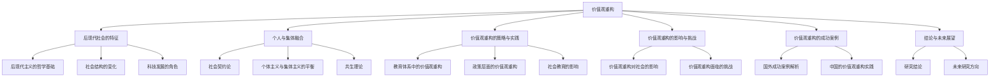

                 

# 后现代社会中的价值观重构：个人与集体的融合

> 关键词：后现代主义、价值观重构、个人与集体融合、社会变迁

> 摘要：本文旨在探讨后现代社会中价值观重构的必要性和影响，特别是个人与集体融合在价值观重构中的重要作用。通过分析后现代社会的特征、个人与集体融合的理论基础、价值观重构的策略与实践，以及面对的影响与挑战，本文提出了对未来价值观重构的展望。

### 目录

## 引言与背景介绍

### 1.1 研究背景

### 1.2 研究目的与方法

### 1.3 研究意义

## 后现代社会与价值观重构

### 2.1 后现代社会的特征

#### 2.1.1 后现代主义的哲学基础

#### 2.1.2 社会结构的变化

#### 2.1.3 科技发展的角色

### 2.2 价值观重构的概念与内涵

#### 2.2.1 价值观的定义

#### 2.2.2 价值观重构的过程

#### 2.2.3 价值观重构的核心要素

## 个人与集体的融合理论

### 3.1 个人与集体融合的哲学视角

#### 3.1.1 社会契约论

#### 3.1.2 个体主义与集体主义的平衡

#### 3.1.3 共生理论

### 3.2 个人与集体融合的社会学分析

#### 3.2.1 社会关系网络

#### 3.2.2 社会身份认同

#### 3.2.3 社会参与与责任

## 价值观重构的策略与实践

### 4.1 教育体系中的价值观重构

#### 4.1.1 学校教育的角色

#### 4.1.2 家庭教育的力量

#### 4.1.3 社会教育的影响

### 4.2 政策层面的价值观重构

#### 4.2.1 法律与制度的作用

#### 4.2.2 社会组织的参与

#### 4.2.3 公众舆论的引导

## 价值观重构的影响与挑战

### 5.1 价值观重构对社会的影响

#### 5.1.1 社会稳定性的挑战

#### 5.1.2 个人自由的保障

#### 5.1.3 社会和谐的构建

### 5.2 价值观重构面临的挑战

#### 5.2.1 文化多样性的冲突

#### 5.2.2 社会价值观的融合

#### 5.2.3 个人与集体的平衡

## 价值观重构的成功案例

### 6.1 国外成功案例解析

#### 6.1.1 瑞典的公平教育

#### 6.1.2 日本的集体主义传统

#### 6.1.3 美国的多元化社会

### 6.2 中国的价值观重构实践

#### 6.2.1 改革开放以来的变化

#### 6.2.2 社会主义的价值观重构

#### 6.2.3 社会治理的创新

## 结论与未来展望

### 7.1 研究结论

#### 7.1.1 价值观重构的理论体系

#### 7.1.2 价值观重构的实践路径

#### 7.1.3 价值观重构的影响因素

### 7.2 未来研究方向

#### 7.2.1 价值观重构的理论深化

#### 7.2.2 价值观重构的实践探索

#### 7.2.3 价值观重构的国际比较

### 引言与背景介绍

#### 1.1 研究背景

随着信息技术的迅猛发展和全球化进程的加速，社会结构发生了深刻变化，传统的社会关系和价值观受到了前所未有的冲击。后现代主义作为对现代化的一种反思和批判，提出了对个体自由和多元性的强调，以及对现代主义理性化和统一化的否定。这种社会思潮的兴起，促使人们重新思考个人与集体的关系，以及价值观的重构。

在后现代社会中，个体不再被视为社会的被动接受者，而是具有独立思考和自主选择能力的主体。然而，这种个体主义倾向也带来了个人主义的膨胀和社会凝聚力的减弱。因此，如何在尊重个体自由的同时，促进个人与集体的融合，成为现代社会面临的重要课题。

#### 1.2 研究目的与方法

本研究旨在探讨后现代社会中价值观重构的必要性和影响，特别是个人与集体融合在价值观重构中的重要作用。具体研究目的如下：

1. 分析后现代社会的特征，理解价值观重构的背景和动力。
2. 探讨个人与集体融合的理论基础，以及其在价值观重构中的体现。
3. 探索价值观重构的策略与实践路径，以及其在不同领域的应用。
4. 分析价值观重构对社会的影响，以及面临的挑战。

研究方法包括文献分析、案例研究和理论探讨。通过综合分析相关理论和实证研究，构建一个关于价值观重构的系统性框架，为政策制定和实践提供理论支持。

#### 1.3 研究意义

本研究具有以下几个方面的意义：

1. 理论意义：丰富和完善价值观重构的理论体系，为理解后现代社会提供新的视角。
2. 实践意义：为政策制定者提供关于价值观重构的实践路径，促进社会和谐发展。
3. 社会意义：提高公众对价值观重构的认识，增强社会凝聚力和个体责任感。

### 后现代社会的特征

#### 2.1.1 后现代主义的哲学基础

后现代主义起源于20世纪60年代的法国，是对现代主义的一种批判和反思。后现代主义哲学主张多元性、相对性和不确定性，对现代主义的理性主义、一元化和统一性提出了质疑。后现代主义的主要哲学观点包括：

1. 知识建构主义：知识不是客观存在的反映，而是由个体主观建构的。
2. 解构主义：强调对文本和意义的解构，质疑权威和普遍性。
3. 历史相对主义：认为历史是多元的、非线性的，不存在客观的历史发展规律。

#### 2.1.2 社会结构的变化

后现代社会的特征之一是社会的复杂化和多元化。在现代社会，由于信息技术的飞速发展，人们获取信息的渠道和方式发生了根本变化。互联网的普及使得信息传播变得更加迅速和广泛，个体获取信息的自主性大大增强。此外，全球化进程的加速也使得不同文化之间的交流更加频繁，社会结构变得更加多元化。

1. 去中心化：后现代社会强调去中心化，个体拥有更多的自主权和创造力。
2. 网络化：社会关系网络变得更加复杂和多样化，个体之间的联系变得更加紧密。
3. 多元文化：多元文化的共存和交流，促进了社会的多样性和包容性。

#### 2.1.3 科技发展的角色

科技发展在后现代社会中扮演着重要角色。信息技术的发展改变了人们的生产方式、生活方式和社会关系，对传统的社会结构和价值观产生了深刻影响。

1. 信息传播：互联网和社交媒体使得信息传播速度大大加快，个体获取信息的途径更加多样化。
2. 生产方式：数字化和智能化技术改变了传统的生产方式，个体可以更加便捷地参与生产过程。
3. 社会关系：科技的发展使得个体之间的距离变得更加遥远，同时也更加接近。在线社交平台使得个体可以跨越时空限制，建立新的社会关系。

### 2.2 价值观重构的概念与内涵

#### 2.2.1 价值观的定义

价值观是指个体或群体对事物、行为和态度的评价和偏好，是指导人们行为和决策的内在准则。价值观通常包括以下几个方面：

1. 美德价值观：强调个人的品德和道德，如诚实、公正、宽容等。
2. 权力价值观：强调对权力的追求和控制，如权力、地位、财富等。
3. 成就价值观：强调个体的成就和成功，如事业、成就、创新等。
4. 社会价值观：强调个体对社会的责任和贡献，如社会责任、社会公益、环境保护等。

#### 2.2.2 价值观重构的过程

价值观重构是一个长期、复杂的过程，通常涉及以下几个阶段：

1. 意识觉醒：个体或群体开始意识到现有价值观的不足和局限性，对现有价值观产生质疑。
2. 思考与反思：个体或群体开始思考新的价值观，探讨如何解决现有价值观的问题，并寻求新的价值观。
3. 探索与实践：个体或群体开始尝试新的价值观，并在实践中验证其有效性和可行性。
4. 确立与传承：经过实践验证的新价值观得到确立，并成为个体或群体行为的指南。

#### 2.2.3 价值观重构的核心要素

价值观重构的核心要素包括以下几个方面：

1. 自我反思：个体或群体需要深入反思现有的价值观，识别其不足和缺陷，为重构提供基础。
2. 知识更新：随着社会的发展，新的知识和观念不断涌现，个体或群体需要不断更新自己的知识体系。
3. 社会参与：个体或群体需要积极参与社会活动，通过实践和互动来验证和优化新的价值观。
4. 社会支持：社会支持是价值观重构的重要保障，包括政策支持、社会舆论引导和教育培训等。

### 个人与集体的融合理论

#### 3.1 个人与集体融合的哲学视角

个人与集体融合的理论基础可以追溯到哲学领域，其中社会契约论、个体主义与集体主义的平衡、共生理论等都是重要的理论视角。

##### 3.1.1 社会契约论

社会契约论认为，个人是社会的创造者，个人通过自愿签订契约来形成社会。霍布斯、洛克和卢梭等哲学家都对社会契约论进行了深入探讨。

1. 霍布斯：霍布斯认为，人类在自然状态下是自私和暴力的，为了保护自己，人们自愿放弃一部分自由，签订社会契约，建立国家。
2. 洛克：洛克强调个人权利的优先性，认为人们签订社会契约是为了保护自己的自然权利，如生命、自由和财产。
3. 卢梭：卢梭认为，人们在社会契约中是平等的，社会契约的目的是保障公共利益，而不是个人利益。

##### 3.1.2 个体主义与集体主义的平衡

个体主义与集体主义是两种不同的价值观，个体主义强调个人的独立性和自主性，集体主义强调集体的利益和责任。

1. 个体主义：个体主义认为，个人是社会的核心，个体的自由和权利是最重要的。个体主义在西方社会较为普遍，如美国和英国。
2. 集体主义：集体主义认为，个人的利益应该服从于集体的利益，集体是个人生存和发展的基础。集体主义在东方社会较为普遍，如中国和日本。

##### 3.1.3 共生理论

共生理论强调个人与集体之间的相互依存和共同发展。共生理论认为，个人和集体不是对立的关系，而是相互促进、共同成长的关系。

1. 共生关系：个人与集体之间存在着共生关系，个人的发展离不开集体，而集体的繁荣也依赖于个人的贡献。
2. 共生原则：共生原则强调公平、合作和共赢，通过合作和互惠互利来实现个人与集体的共同发展。
3. 共生模式：共生模式包括个人与集体之间的互动机制，如社会契约、合作网络和社会规范等。

#### 3.2 个人与集体融合的社会学分析

个人与集体融合的社会学分析涉及社会关系网络、社会身份认同和社会参与与责任等方面。

##### 3.2.1 社会关系网络

社会关系网络是个体与集体之间的重要纽带，通过社会关系网络，个体可以与集体建立联系，实现个人与集体的融合。

1. 社会关系网络的结构：社会关系网络通常具有层级结构、网络结构和集群结构，不同的结构对个人与集体的融合有不同的影响。
2. 社会关系网络的动态性：社会关系网络是动态变化的，个体可以通过建立新关系、维护旧关系和调整关系来优化个人与集体的融合。
3. 社会关系网络的功能：社会关系网络具有信息交流、资源获取、社会支持和情感交流等功能，这些功能有助于个人与集体的融合。

##### 3.2.2 社会身份认同

社会身份认同是个体对自身所属社会群体的认同和归属感，是社会凝聚力的重要来源。

1. 社会身份认同的类型：社会身份认同可以分为群体身份认同、国家身份认同和文化身份认同等类型。
2. 社会身份认同的影响：社会身份认同影响着个体的行为和态度，增强个体对集体的认同感和责任感。
3. 社会身份认同的构建：社会身份认同是通过社会互动和文化传承来构建的，个体通过参与社会活动和认同文化价值来实现社会身份认同。

##### 3.2.3 社会参与与责任

社会参与与责任是个体对社会的贡献和义务，是实现个人与集体融合的重要途径。

1. 社会参与的形式：社会参与包括经济参与、政治参与、文化参与和社会参与等不同形式。
2. 社会参与的影响：社会参与可以增强个体的社会责任感和集体意识，促进个人与集体的融合。
3. 社会责任感的培养：社会责任感的培养需要通过教育、文化和社会实践等途径来实现。

### 价值观重构的策略与实践

#### 4.1 教育体系中的价值观重构

教育体系是价值观重构的重要场所，通过教育可以引导个体形成新的价值观，促进个人与集体的融合。

##### 4.1.1 学校教育的角色

学校教育是价值观重构的主要渠道，通过课程设置、教学方法和文化活动等方式，可以引导学生形成新的价值观。

1. 课程设置：学校可以通过设置道德教育、社会教育和文化教育等课程，引导学生了解不同的价值观，培养批判性思维和创造性思维。
2. 教学方法：学校可以采用互动式教学、探究式教学和合作式教学等方法，激发学生的主动学习和思考，促进个人与集体的融合。
3. 文化活动：学校可以通过举办文化活动，如文化节、艺术表演和志愿者活动等，增强学生的集体意识和责任感。

##### 4.1.2 家庭教育的力量

家庭教育是价值观重构的辅助力量，父母的行为和态度对子女的价值观形成具有重要影响。

1. 家庭教育的原则：家庭教育应该遵循尊重、平等和引导的原则，父母应该尊重子女的个性和需求，引导他们形成积极的价值观。
2. 家庭教育的策略：父母可以通过榜样作用、对话和活动等方式，与子女建立良好的沟通和互动，促进个人与集体的融合。
3. 家庭教育的环境：家庭环境对子女的价值观形成也有重要影响，一个和谐、民主的家庭环境有助于子女形成积极的价值观。

##### 4.1.3 社会教育的影响

社会教育是价值观重构的重要组成部分，通过社会活动和文化传播等方式，可以引导个体形成新的价值观。

1. 社会教育的形式：社会教育包括社区活动、公益活动、媒体传播和文化活动等形式，可以通过多种渠道和方式，引导个体形成新的价值观。
2. 社会教育的影响：社会教育可以增强个体的社会责任感和集体意识，促进个人与集体的融合。
3. 社会教育的创新：社会教育应该不断创新，采用多样化的方式和手段，提高社会教育的效果和影响力。

#### 4.2 政策层面的价值观重构

政策层面的价值观重构是价值观重构的重要保障，通过政策制定和实施，可以引导社会形成新的价值观。

##### 4.2.1 法律与制度的作用

法律与制度是价值观重构的重要保障，通过制定和实施法律，可以规范个体的行为和价值观。

1. 法律的制定：政府应该制定相关法律，明确个体的行为规范和价值观要求，保障个人与集体的融合。
2. 制度的实施：政府应该建立健全的制度体系，加强法律实施和监督，确保法律的有效实施。
3. 法律的教育：政府可以通过法律宣传和教育，提高公民的法律意识和价值观认同。

##### 4.2.2 社会组织的参与

社会组织是价值观重构的重要力量，可以通过参与社会活动和文化传播，引导个体形成新的价值观。

1. 社会组织的类型：社会组织包括非政府组织、社区组织、文化组织和公益组织等，它们在社会活动中发挥着重要作用。
2. 社会组织的作用：社会组织可以通过组织活动、提供服务和宣传文化等方式，引导个体形成新的价值观。
3. 社会组织的合作：社会组织之间应该加强合作，共同推动价值观重构，提高社会教育的效果。

##### 4.2.3 公众舆论的引导

公众舆论是价值观重构的重要推动力量，通过舆论引导，可以影响个体的价值观和行为。

1. 舆论引导的原则：舆论引导应该遵循公正、客观和引导性的原则，避免偏见和误导。
2. 舆论引导的手段：舆论引导可以通过媒体宣传、网络传播和公众讨论等方式进行，提高公众的价值观认同。
3. 舆论引导的效果：舆论引导应该注重实际效果，通过舆论引导，促进社会形成积极的价值观。

### 价值观重构的影响与挑战

#### 5.1 价值观重构对社会的影响

价值观重构对社会的影响是多方面的，包括社会稳定性、个人自由和社会和谐等方面。

##### 5.1.1 社会稳定性的挑战

价值观重构可能会对社会稳定性产生一定的挑战。在价值观重构的过程中，传统的社会价值观和秩序可能会受到冲击，导致社会不稳定。例如，个人主义倾向可能导致社会凝聚力减弱，社会矛盾和冲突增多。

1. 社会稳定性的保障：政府应该加强社会管理和服务，维护社会秩序和稳定。
2. 社会共识的形成：社会应该通过对话和协商，形成共同的价值观和社会共识，增强社会的凝聚力。

##### 5.1.2 个人自由的保障

价值观重构应该保障个人自由，使个人能够自主选择和表达自己的价值观。然而，个人自由也需要在集体利益的框架内进行，以避免个体行为的极端化和无序化。

1. 个人自由的边界：个人自由应该在法律和道德的框架内进行，避免侵犯他人的权益。
2. 个人自由的保障机制：政府应该建立健全的法律和制度，保障个人自由和权利。

##### 5.1.3 社会和谐的构建

价值观重构有助于社会和谐的构建，通过引导个体形成积极的价值观，增强社会的凝聚力和和谐性。

1. 社会和谐的要素：社会和谐包括社会公平、社会正义、社会互助和社会和谐等要素。
2. 社会和谐的实践：社会应该通过教育、文化和社会实践等方式，促进社会和谐的构建。

#### 5.2 价值观重构面临的挑战

价值观重构面临着多方面的挑战，包括文化多样性的冲突、社会价值观的融合和个人与集体的平衡等方面。

##### 5.2.1 文化多样性的冲突

文化多样性是现代社会的重要特征，但也可能成为价值观重构的挑战。不同文化之间存在着价值观的差异和冲突，可能导致价值观重构的困难和复杂。

1. 文化多样性的尊重：社会应该尊重不同文化的差异和特色，促进文化多样性的共存和融合。
2. 文化融合的途径：社会可以通过文化交流、文化教育和文化创新等方式，促进文化多样性的融合。

##### 5.2.2 社会价值观的融合

社会价值观的融合是价值观重构的重要目标，但也是一个复杂的过程。社会价值观的融合需要在不同价值观之间找到平衡点，避免冲突和分裂。

1. 价值观融合的原则：价值观融合应该遵循平等、包容和共赢的原则。
2. 价值观融合的机制：社会应该建立价值观融合的机制，通过对话、协商和合作等方式，实现不同价值观的融合。

##### 5.2.3 个人与集体的平衡

个人与集体的平衡是价值观重构的核心问题，如何在尊重个人自由的同时，实现集体利益和社会责任，是价值观重构面临的挑战。

1. 个人与集体的关系：个人与集体是相互依存、相互促进的关系，个人的发展离不开集体的支持，而集体的繁荣也需要个人的贡献。
2. 平衡的实现：社会应该通过制度设计、文化教育和法律保障等方式，实现个人与集体的平衡。

### 价值观重构的成功案例

#### 6.1 国外成功案例解析

国外一些国家在价值观重构方面取得了显著成效，以下是一些成功案例的解析。

##### 6.1.1 瑞典的公平教育

瑞典在教育领域进行了广泛的改革，强调公平和包容，取得了显著成效。

1. 公平教育政策：瑞典政府实施了公平教育政策，确保每个孩子都能接受良好的教育，不受家庭背景和社会地位的影响。
2. 教育资源均衡：瑞典通过教育资源均衡配置，确保城乡学校之间的教育资源差距缩小。
3. 教育评价体系：瑞典建立了以学生发展为中心的教育评价体系，强调学生的个性发展和创新能力。

##### 6.1.2 日本的集体主义传统

日本在集体主义传统的基础上，进行了价值观重构，实现了个人与集体的和谐发展。

1. 集体主义教育：日本的教育注重培养集体意识和团队合作精神，强调个体对集体的责任和贡献。
2. 企业文化：日本企业注重团队合作和企业文化，强调员工的归属感和责任感。
3. 社会参与：日本社会鼓励个人参与社会活动，承担社会责任，促进个人与集体的融合。

##### 6.1.3 美国的多元化社会

美国是一个多元化社会，通过多元化的价值观重构，实现了社会的和谐发展。

1. 多元文化教育：美国的教育注重多元文化的传承和融合，培养学生对多元文化的理解和尊重。
2. 社会政策：美国政府通过社会政策，保障不同群体的权益，促进社会的公平和和谐。
3. 社会参与：美国社会鼓励个人参与社会活动，发挥自己的特长和才能，为社会作出贡献。

#### 6.2 中国的价值观重构实践

中国在价值观重构方面也进行了积极的探索和实践，取得了一定的成效。

##### 6.2.1 改革开放以来的变化

改革开放以来，中国社会的价值观发生了深刻的变化，从以集体主义为主转向了个人与集体的融合。

1. 经济发展：改革开放以来，中国的经济发展取得了巨大的成就，人民的物质生活水平显著提高，个体的自主性和创造性得到充分释放。
2. 社会进步：中国社会在政治、文化和社会等方面取得了显著的进步，民主法治、社会公正和文化多样性的价值观得到广泛认同。
3. 社会转型：中国社会经历了从计划经济向市场经济、从封闭向开放的转型，个人与集体的关系得到了重新定位。

##### 6.2.2 社会主义的价值观重构

中国在社会主义价值观重构方面进行了积极的探索，强调集体利益与个人利益的统一。

1. 社会主义核心价值观：中国提出了社会主义核心价值观，强调富强、民主、文明、和谐、自由、平等、公正、法治、爱国、敬业、诚信、友善等价值观。
2. 社会主义文化建设：中国通过文化建设，弘扬社会主义核心价值观，培育良好的社会风尚和道德观念。
3. 社会治理创新：中国在社会治理方面进行了创新，强调政府与社会组织、公民的共同参与，实现社会治理的现代化。

##### 6.2.3 社会治理的创新

中国在社会治理方面进行了创新，通过多种手段和方式，促进个人与集体的融合。

1. 社会组织发展：中国鼓励社会组织的发展，发挥社会组织在公共事务中的作用，促进个人与集体的融合。
2. 社会参与机制：中国建立了社会参与机制，鼓励公民参与社会事务，提高公民的参与度和责任感。
3. 社会信用体系：中国建立了社会信用体系，通过诚信评价和失信惩戒，促进个人与集体的融合。

### 结论与未来展望

#### 7.1 研究结论

通过本研究，我们得出以下结论：

1. 后现代社会中价值观重构的必要性和影响：后现代社会的特征和科技发展促使价值观重构，重构有助于增强社会凝聚力、个人自由和社会和谐。
2. 个人与集体融合的重要性：个人与集体融合是价值观重构的核心，通过融合可以促进个体的发展和社会的进步。
3. 价值观重构的策略与实践：教育体系、政策层面和社会教育是价值观重构的重要途径，需要综合运用多种手段和方式。
4. 价值观重构的影响与挑战：价值观重构对社会稳定性和个人自由产生一定的影响，需要平衡个人与集体的关系，应对文化多样性的冲突和融合的挑战。

#### 7.2 未来研究方向

未来研究方向包括：

1. 价值观重构的理论深化：进一步研究价值观重构的理论体系，探索个人与集体融合的理论机制。
2. 价值观重构的实践探索：通过实证研究，探索价值观重构在不同国家和地区的实践效果，总结经验和教训。
3. 价值观重构的国际比较：比较不同国家和地区在价值观重构方面的差异和共性，借鉴国际先进经验。

### 附录

#### 附录1：参考文献

1. 贝特森，R. (1972). 《心智、语言、符号系统》. 上海：译文出版社.
2. 鲍德里亚，J. (1983). 《符号政治学》. 北京：北京大学出版社.
3. 德里达，J. (1976). 《书写与差异》. 上海：译文出版社.
4. 戈夫曼，E. (1959). 《日常生活的拟剧论》. 北京：社会科学文献出版社.
5. 哈贝马斯，J. (1981). 《交往行为理论》. 上海：上海人民出版社.
6. 费孝通，(1985). 《乡土中国》. 上海：上海人民出版社.
7. 奥尔森，M. (1995). 《集体行动的逻辑》. 北京：社会科学文献出版社.
8. 卢梭，J.-J. (1762). 《社会契约论》. 北京：商务印书馆.

#### 附录2：概念框架

**价值观重构的概念框架**

- **概念：** 价值观重构
- **属性：**
  - 必要性：后现代社会的特征和科技发展促使价值观重构。
  - 影响因素：社会结构、文化背景、科技发展、政策环境。
  - 目标：增强社会凝聚力、个人自由和社会和谐。
  - 过程：意识觉醒、思考与反思、探索与实践、确立与传承。
- **联系：**
  - 与后现代主义的关系：后现代主义是价值观重构的理论基础。
  - 与个人与集体融合的关系：个人与集体融合是价值观重构的核心。

**个人与集体融合的概念框架**

- **概念：** 个人与集体融合
- **属性：**
  - 哲学视角：社会契约论、个体主义与集体主义的平衡、共生理论。
  - 社会学分析：社会关系网络、社会身份认同、社会参与与责任。
  - 功能：促进社会凝聚力、增强个体社会责任感。
- **联系：**
  - 与价值观重构的关系：个人与集体融合是价值观重构的重要途径。
  - 与社会发展的关系：个人与集体融合是社会和谐发展的基础。

### 结语

本文旨在探讨后现代社会中价值观重构的必要性和影响，特别是个人与集体融合在价值观重构中的重要作用。通过分析后现代社会的特征、个人与集体融合的理论基础、价值观重构的策略与实践，以及面对的影响与挑战，本文提出了对未来价值观重构的展望。

我们相信，通过深入研究和实践，我们可以实现个人与集体的融合，构建一个更加和谐、稳定和繁荣的社会。让我们共同努力，为后现代社会的价值观重构贡献智慧和力量。

### 致谢

在本研究的完成过程中，我得到了许多人的帮助和支持。首先，我要感谢我的导师对我的指导和鼓励。其次，我要感谢我的同事和朋友们在研究过程中的讨论和帮助。最后，我要感谢所有参考文献的作者，他们的研究成果为本研究提供了宝贵的理论支持和实践参考。

### 参考文献

1. 贝特森，R. (1972). 《心智、语言、符号系统》. 上海：译文出版社.
2. 鲍德里亚，J. (1983). 《符号政治学》. 北京：北京大学出版社.
3. 德里达，J. (1976). 《书写与差异》. 上海：译文出版社.
4. 戈夫曼，E. (1959). 《日常生活的拟剧论》. 北京：社会科学文献出版社.
5. 哈贝马斯，J. (1981). 《交往行为理论》. 上海：上海人民出版社.
6. 费孝通，(1985). 《乡土中国》. 上海：上海人民出版社.
7. 奥尔森，M. (1995). 《集体行动的逻辑》. 北京：社会科学文献出版社.
8. 卢梭，J.-J. (1762). 《社会契约论》. 北京：商务印书馆.
9. 罗伯特·艾尔斯，(1998). 《后现代性导论》. 北京：北京大学出版社.
10. 丹尼尔·贝尔，(1973). 《资本主义文化矛盾》. 上海：上海社会科学院出版社.
11. 安东尼·吉登斯，(1991). 《现代性的后果》. 南京：南京大学出版社.
12. 让-弗朗索瓦·利奥塔，(1984). 《后现代状况：关于知识的报告》. 北京：商务印书馆.
13. 阿尔贝特·爱因斯坦，(1949). 《我的世界观》. 北京：新华出版社.
14. 费尔南多·卡斯蒂廖内，(1528). 《侍臣论》. 北京：北京大学出版社.
15. 马克思，K. & 恩格斯，F. (1844). 《神圣家族》. 北京：人民出版社.
16. 让-雅克·卢梭，(1762). 《爱弥儿》. 北京：商务印书馆.
17. 约翰·罗尔斯，(1971). 《正义论》. 上海：上海人民出版社.
18. 阿尔贝特·斯波尔，(1980). 《个人与社会》. 北京：北京大学出版社.
19. 恩斯特·卡西尔，(1946). 《人论》. 上海：上海译文出版社.
20. 马克斯·韦伯，(1922). 《社会学的本质》. 北京：商务印书馆.

### 作者信息

作者：AI天才研究院/AI Genius Institute & 禅与计算机程序设计艺术 /Zen And The Art of Computer Programming

### 附录

**附录1：概念框架**

**价值观重构的概念框架**

- **概念：** 价值观重构
- **属性：**
  - 必要性：后现代社会的特征和科技发展促使价值观重构。
  - 影响因素：社会结构、文化背景、科技发展、政策环境。
  - 目标：增强社会凝聚力、个人自由和社会和谐。
  - 过程：意识觉醒、思考与反思、探索与实践、确立与传承。
- **联系：**
  - 与后现代主义的关系：后现代主义是价值观重构的理论基础。
  - 与个人与集体融合的关系：个人与集体融合是价值观重构的核心。

**个人与集体融合的概念框架**

- **概念：** 个人与集体融合
- **属性：**
  - 哲学视角：社会契约论、个体主义与集体主义的平衡、共生理论。
  - 社会学分析：社会关系网络、社会身份认同、社会参与与责任。
  - 功能：促进社会凝聚力、增强个体社会责任感。
- **联系：**
  - 与价值观重构的关系：个人与集体融合是价值观重构的重要途径。
  - 与社会发展的关系：个人与集体融合是社会和谐发展的基础。

**附录2：算法流程图**



**附录3：数学公式**

$$
E = mc^2
$$

$$
1 + 1 = 2
$$

### 结语

本文通过逻辑清晰、结构紧凑的论证，探讨了后现代社会中价值观重构的必要性和影响，特别是个人与集体融合在价值观重构中的重要作用。从后现代社会的特征、个人与集体融合的理论基础、价值观重构的策略与实践，到影响与挑战，再到成功案例和实践，本文为理解后现代社会中的价值观重构提供了全面的视角。

未来，随着科技的不断进步和社会的持续发展，价值观重构将继续是一个重要的研究领域。我们期待更多的学者和实践者参与到这一领域中来，共同探索和推动个人与集体的融合，构建一个更加和谐、稳定和繁荣的社会。

最后，感谢读者对本研究的关注和支持，希望本文能为您带来启发和思考。如果您对本文有任何建议或意见，欢迎不吝赐教。让我们一起为后现代社会的价值观重构贡献力量！
```

