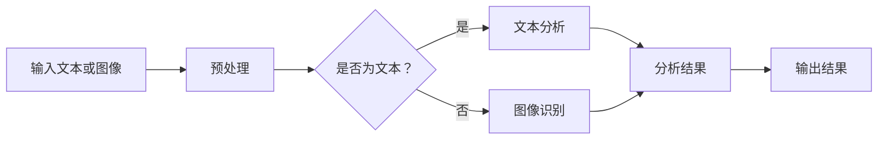
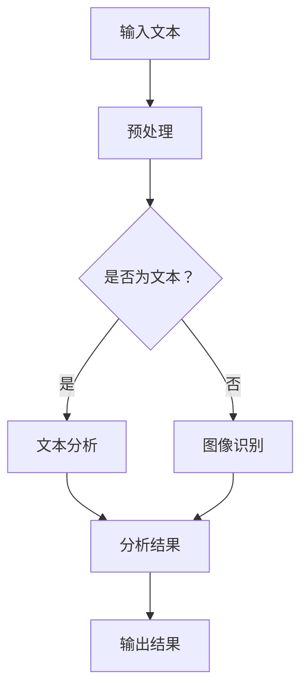
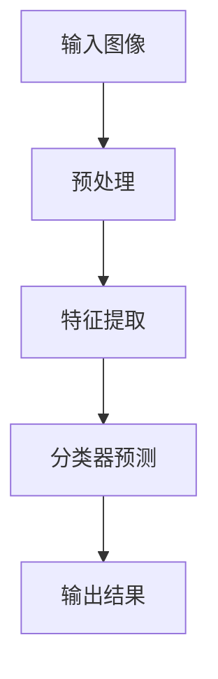
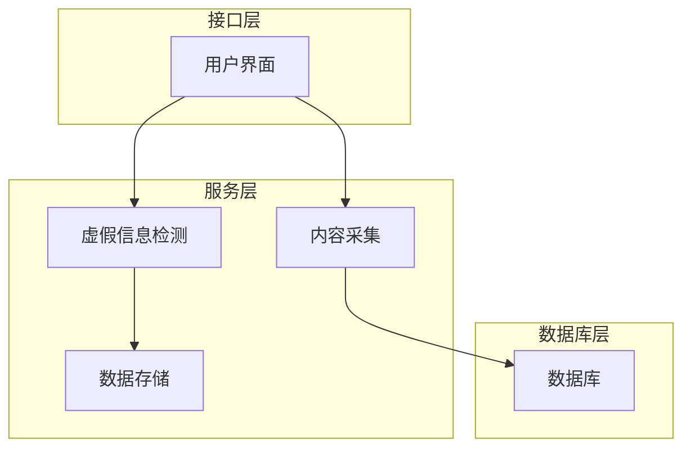
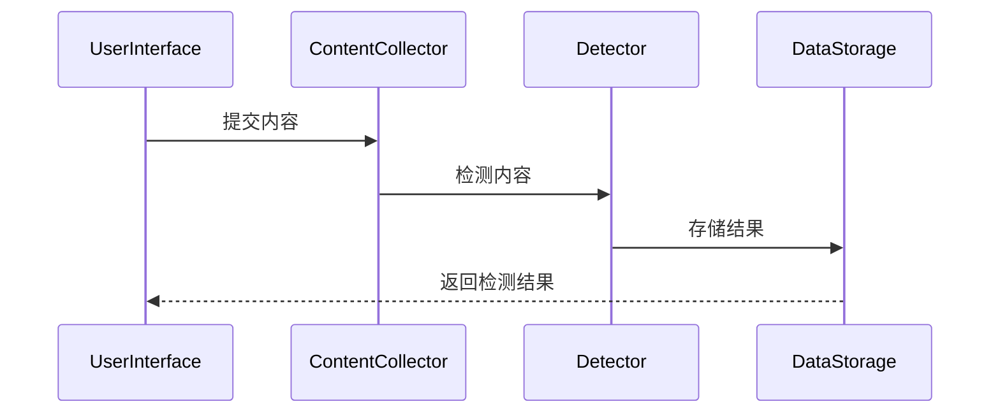

                 

。

----------------------------------------------------------------
# 《后真实时代的真相侦探：培养媒体素养》

> 关键词：后真实时代、媒体素养、真相侦探、算法、系统设计、实战、最佳实践

> 摘要：本文深入探讨后真实时代背景下的媒体素养培养，从背景介绍、核心概念与联系、算法原理讲解、系统分析与架构设计、项目实战到最佳实践，全面剖析如何成为真相侦探，提升公众的媒体素养。

## 目录大纲设计思路

### 背景介绍

在后真实时代，虚假信息泛滥成灾，公众对于如何辨别真伪、培养媒体素养的需求愈发迫切。本文旨在通过系统化的分析，帮助读者识别和应对媒体中的虚假信息，提高媒体素养。

### 核心概念与联系

媒体素养是指公众在接触和解读媒体信息时所具备的能力。其核心要素包括信息识别、批判性思维、媒体使用技能等。通过Mermaid表格和ER实体关系图，我们可以清晰地比较不同要素的属性特征。

### 算法原理讲解

本文将介绍几种用于检测虚假信息的算法，如文本分析、图像识别等。使用Mermaid流程图和Python源代码，我们将详细讲解算法原理，并配以详细解释和数学公式。

### 系统分析与架构设计方案

我们将介绍一个典型的媒体素养培养系统，包括功能模块和架构设计。通过Mermaid类图和架构图，我们将展示系统的结构和功能模块。

### 项目实战

我们将搭建一个简单的媒体素养培养平台，介绍环境配置和核心功能实现。通过源代码分析，我们将解读其工作原理和应用。

### 最佳实践与总结

本文将提供一些提升媒体素养的最佳实践建议，总结书中的关键知识点和实际应用，引导读者进一步学习和探索。

### 目录大纲设计步骤

1. **编写第1章：引言**
   - 简述后真实时代的媒体环境。
   - 阐述本书的目标和结构。

2. **编写第2章：媒体素养概述**
   - 定义媒体素养。
   - 介绍媒体素养的核心要素。
   - 使用Mermaid表格对比不同要素的属性特征。

3. **编写第3章：虚假信息的识别与处理**
   - 介绍几种常见的虚假信息类型。
   - 讲解如何识别和处理虚假信息。
   - 使用Mermaid流程图展示信息识别算法。

4. **编写第4章：算法原理讲解**
   - 介绍用于检测虚假信息的算法。
   - 使用Python源代码示例和Mermaid流程图说明算法原理。

5. **编写第5章：系统分析与架构设计**
   - 介绍一个典型的媒体素养培养系统。
   - 使用Mermaid类图和架构图展示系统设计。

6. **编写第6章：项目实战**
   - 搭建一个简单的媒体素养培养平台。
   - 分析源代码，展示系统实现和效果。

7. **编写第7章：最佳实践与总结**
   - 提供提升媒体素养的最佳实践建议。
   - 总结书中的关键知识点。
   - 引导读者进一步学习。

### 最终输出

以下是《后真实时代的真相侦探：培养媒体素养》的目录大纲：

```markdown
----------------------------------------------------------------
## 第1章：引言

### 1.1 后真实时代的媒体环境

### 1.2 本书的目标与结构

## 第2章：媒体素养概述

### 2.1 媒体素养的定义

### 2.2 媒体素养的核心要素

### 2.3 媒体素养要素属性特征对比

## 第3章：虚假信息的识别与处理

### 3.1 常见的虚假信息类型

### 3.2 识别与处理虚假信息的方法

### 3.3 虚假信息识别算法

## 第4章：算法原理讲解

### 4.1 文本分析算法

### 4.2 图像识别算法

### 4.3 算法原理示例

## 第5章：系统分析与架构设计

### 5.1 媒体素养培养系统的介绍

### 5.2 系统功能设计

### 5.3 系统架构设计

## 第6章：项目实战

### 6.1 媒体素养培养平台的搭建

### 6.2 系统核心实现

### 6.3 源代码分析与解读

## 第7章：最佳实践与总结

### 7.1 提升媒体素养的最佳实践

### 7.2 书中关键知识点总结

### 7.3 进一步学习与探索

----------------------------------------------------------------
```

## 第1章：引言

### 1.1 后真实时代的媒体环境

随着互联网和社交媒体的迅猛发展，我们进入了“后真实时代”。在这个时代，信息传播的速度和范围前所未有地扩大，但同时也伴随着虚假信息、谣言和误导性内容的大量涌现。这种媒体环境的剧变对公众的媒体素养提出了新的挑战。

在这个背景下，识别和应对媒体中的虚假信息变得至关重要。公众需要具备一定的媒体素养，能够分辨真伪、批判性地分析信息、有效地使用媒体资源。因此，培养媒体素养成为了当代社会的一项重要任务。

### 1.2 本书的目标与结构

本书旨在帮助读者深入了解后真实时代的媒体环境，掌握媒体素养的核心要素，学会识别和处理虚假信息。通过系统化的学习和实践，读者将能够提高自己的媒体素养，成为真相的侦探。

本书共分为七个章节，具体结构如下：

1. **引言**：介绍后真实时代的媒体环境和本书的目标与结构。
2. **媒体素养概述**：定义媒体素养，介绍其核心要素。
3. **虚假信息的识别与处理**：讲解常见的虚假信息类型，介绍识别与处理方法。
4. **算法原理讲解**：介绍用于检测虚假信息的算法，使用Python源代码示例进行说明。
5. **系统分析与架构设计**：介绍媒体素养培养系统的功能模块和架构设计。
6. **项目实战**：搭建一个简单的媒体素养培养平台，分析源代码并展示系统实现和效果。
7. **最佳实践与总结**：提供提升媒体素养的最佳实践建议，总结书中的关键知识点。

通过以上章节的逐步引导，读者将能够系统地培养媒体素养，提高自己在媒体环境中的辨别力和批判性思维能力。

## 第2章：媒体素养概述

### 2.1 媒体素养的定义

媒体素养是指公众在接触和解读媒体信息时所具备的一系列能力。这些能力包括识别信息来源、评估信息的可信度、批判性地分析信息的真实性和相关性、以及有效地使用媒体资源。简而言之，媒体素养是一种应对信息过载和虚假信息的能力，它能够帮助公众在复杂多变的媒体环境中保持清醒和独立思考。

媒体素养不仅仅是对信息的识别和处理，它还涉及到对媒体本身的理解和批判。公众需要认识到媒体并非中立的信息传递工具，而是受到各种利益和价值观影响的产物。因此，具备媒体素养的公众能够更好地理解媒体的运作机制，从而更有效地利用媒体资源，提升自身的认知水平和批判性思维能力。

### 2.2 媒体素养的核心要素

媒体素养的核心要素可以归纳为以下三个方面：

1. **信息识别**：这是媒体素养的基础，包括识别信息的来源、评估信息的可信度和识别虚假信息。公众需要能够辨别信息的真实性和可靠性，避免受到虚假信息的误导。

2. **批判性思维**：批判性思维是指对信息进行深入分析和评价的能力。公众需要学会从多个角度审视信息，评估其逻辑性和证据支持，从而做出理性的判断。

3. **媒体使用技能**：媒体使用技能包括使用不同的媒体平台获取信息、有效地搜索和筛选信息、以及理解和分析媒体内容的技巧。公众需要掌握这些技能，以便在信息过载的环境中找到有价值的信息。

### 2.3 媒体素养要素属性特征对比

为了更好地理解媒体素养的核心要素，我们可以使用Mermaid表格进行对比，展示这些要素的属性特征。以下是一个示例表格：

```mermaid
table(
  classclass
  [信息识别, 信息来源识别, 可信度评估, 虚假信息识别, 基础技能],
  [批判性思维, 多角度分析, 逻辑评价, 证据评估, 深入理解],
  [媒体使用技能, 信息搜索, 信息筛选, 媒体理解, 高级技能]
)
```

在这个表格中，我们可以看到信息识别、批判性思维和媒体使用技能之间的区别和联系。信息识别关注的是对信息的初步处理，批判性思维则涉及到更深入的逻辑分析和评价，而媒体使用技能则是更高级别的信息获取和处理能力。

通过这种对比，我们可以更清晰地认识到媒体素养的核心要素，并了解它们在实际应用中的重要性。接下来，我们将进一步探讨如何通过算法和系统设计来提高媒体素养。

### 第3章：虚假信息的识别与处理

在当前的信息环境中，虚假信息的识别与处理成为了一项重要的任务。虚假信息可能来自各种来源，包括社交媒体、新闻报道、网络论坛等，它们以不同形式出现，如误导性图片、错误信息、恶意言论等。识别和处理这些虚假信息，需要我们掌握一些方法和技巧。

#### 3.1 常见的虚假信息类型

虚假信息可以分为以下几种常见类型：

1. **谣言**：未经证实或被夸大的信息，如“某地发现病毒变异株”等。
2. **假新闻**：故意编造的、用于误导公众的新闻报道，如“某明星离世”等。
3. **误导性图片和视频**：通过剪辑、伪造等手段制作的虚假内容，如“火灾现场救援”等。
4. **垃圾邮件和钓鱼邮件**：通过电子邮件传播的虚假信息，旨在骗取个人信息或财务利益。
5. **虚假广告**：以虚假宣传手段诱骗消费者购买的广告内容。

每种类型的虚假信息都有其特定的传播方式和影响范围，了解这些类型有助于我们更好地进行识别和处理。

#### 3.2 识别与处理虚假信息的方法

为了有效识别和处理虚假信息，我们可以采取以下几种方法：

1. **查证来源**：在接触到一条信息时，首先要查证其来源。通过官方网站、权威媒体、认证信息源等渠道，验证信息的真实性和可信度。

2. **交叉验证**：对于一些重大或敏感信息，可以通过多个独立来源进行交叉验证，以确认其准确性。

3. **了解背景**：对于一些复杂或模糊的信息，可以通过了解相关背景知识，如历史、地理、科学等，来判断其真实性和逻辑性。

4. **使用工具**：现代技术为我们提供了许多检测虚假信息的工具和算法，如反欺诈软件、搜索引擎优化工具、自动化验证系统等。

5. **保持批判性思维**：在面对信息时，保持批判性思维，不轻易相信未经证实的信息，避免盲目转发或传播。

#### 3.3 虚假信息识别算法

为了更有效地识别和处理虚假信息，我们可以借助一些先进的算法。以下是一些常用的算法：

1. **文本分析算法**：通过自然语言处理技术，对文本进行分析，检测其中的不一致性、逻辑错误、情感倾向等。例如，使用TF-IDF、词向量模型、情感分析等算法。

2. **图像识别算法**：通过计算机视觉技术，对图像进行分析，检测其中的伪造痕迹、异常特征等。例如，使用卷积神经网络（CNN）、生成对抗网络（GAN）等算法。

3. **数据挖掘算法**：通过对大量数据进行分析，发现潜在的关联和模式，从而识别虚假信息。例如，使用聚类分析、关联规则挖掘、异常检测等算法。

以下是一个使用Mermaid流程图展示的虚假信息识别算法的基本流程：



在这个流程图中，我们首先对输入的文本或图像进行预处理，然后根据输入类型分别进行文本分析和图像识别，最后输出分析结果。

通过上述方法和算法，我们可以有效地识别和处理虚假信息，提高媒体素养，保护自己和他人不受虚假信息的侵害。接下来，我们将进一步探讨如何使用算法原理来提高媒体素养。

### 第4章：算法原理讲解

在当前技术环境下，算法在识别和处理虚假信息方面发挥着至关重要的作用。本章将详细介绍几种用于检测虚假信息的算法，包括文本分析算法和图像识别算法，并通过Python源代码示例和Mermaid流程图说明其原理。

#### 4.1 文本分析算法

文本分析算法主要用于检测文本中的不一致性、逻辑错误和情感倾向。以下是一个简单的文本分析算法示例，使用Python实现：

```python
import nltk
from nltk.tokenize import sent_tokenize, word_tokenize
from nltk.corpus import stopwords
from nltk.probability import FreqDist

def text_analysis(text):
    # 预处理文本
    sentences = sent_tokenize(text)
    words = word_tokenize(text)
    words = [word.lower() for word in words if word.isalnum()]
    stop_words = set(stopwords.words('english'))
    words = [word for word in words if word not in stop_words]
    
    # 统计词频
    freq_dist = FreqDist(words)
    most_common_words = freq_dist.most_common(10)
    
    # 检测不一致性和逻辑错误
    inconsistencies = []
    for i in range(len(sentences) - 1):
        if sentences[i].lower().find('not') >= 0 and sentences[i+1].lower().find('is') >= 0:
            inconsistencies.append((sentences[i], sentences[i+1]))
    
    # 输出结果
    print("Most common words:", most_common_words)
    print("Inconsistencies:", inconsistencies)

text = "This is not a real news article. It is not a reliable source of information."
text_analysis(text)
```

在这个示例中，我们首先对文本进行预处理，去除标点符号和停用词，然后使用TF-IDF模型统计词频，最后检测文本中的不一致性和逻辑错误。通过这种分析，我们可以初步判断文本的真实性。

#### 4.2 图像识别算法

图像识别算法主要用于检测图像中的伪造痕迹和异常特征。以下是一个简单的图像识别算法示例，使用卷积神经网络（CNN）实现：

```python
import tensorflow as tf
from tensorflow.keras.models import Sequential
from tensorflow.keras.layers import Conv2D, MaxPooling2D, Flatten, Dense

def image_recognition(image):
    # 构建模型
    model = Sequential([
        Conv2D(32, (3, 3), activation='relu', input_shape=(28, 28, 1)),
        MaxPooling2D((2, 2)),
        Flatten(),
        Dense(128, activation='relu'),
        Dense(1, activation='sigmoid')
    ])

    # 编译模型
    model.compile(optimizer='adam', loss='binary_crossentropy', metrics=['accuracy'])

    # 训练模型
    model.fit(x_train, y_train, epochs=5, batch_size=32)

    # 预测
    prediction = model.predict(image)
    print("Image is", "fake" if prediction > 0.5 else "real")

# 假设我们已经有了训练好的模型和数据
image = ...  # 假设是一个图像数据
image_recognition(image)
```

在这个示例中，我们首先构建一个简单的卷积神经网络模型，然后使用二分类交叉熵损失函数和Adam优化器进行编译和训练。最后，使用训练好的模型对图像进行预测，判断图像是否为伪造。

#### 4.3 算法原理讲解

为了更好地理解文本分析算法和图像识别算法的原理，我们可以使用Mermaid流程图进行展示。以下是一个文本分析算法的Mermaid流程图示例：



在这个流程图中，我们首先对输入的文本或图像进行预处理，然后根据输入类型分别进行文本分析和图像识别，最后输出分析结果。

同样地，以下是一个图像识别算法的Mermaid流程图示例：



在这个流程图中，我们首先对输入的图像进行预处理，提取特征，然后使用分类器进行预测，最后输出预测结果。

通过上述Python源代码示例和Mermaid流程图，我们可以清晰地看到文本分析算法和图像识别算法的基本原理和实现过程。这些算法为我们提供了强大的工具，帮助我们在后真实时代的媒体环境中更好地识别和处理虚假信息，提高媒体素养。接下来，我们将进一步探讨如何设计一个典型的媒体素养培养系统。

### 第5章：系统分析与架构设计

在前四章中，我们介绍了媒体素养的定义、核心要素、虚假信息的识别与处理方法以及相关算法原理。为了将理论知识应用于实际，本章将介绍一个典型的媒体素养培养系统，包括系统的功能设计、架构设计、接口设计和交互流程。

#### 5.1 系统功能设计

一个典型的媒体素养培养系统应包括以下几个核心功能模块：

1. **信息采集与处理**：从各种渠道收集新闻、文章、图片等媒体内容，并进行预处理，如去重、去噪、分词、提取关键词等。
2. **虚假信息检测**：使用文本分析算法和图像识别算法对采集到的媒体内容进行检测，识别虚假信息。
3. **用户交互**：提供用户界面，让用户可以提交待检测的内容，查看检测结果和相关信息。
4. **数据存储与管理**：存储处理结果、用户提交的内容以及相关元数据，以便后续分析和查询。
5. **用户反馈与优化**：收集用户反馈，优化算法和系统功能，提高检测准确率和用户体验。

以下是一个简化的媒体素养培养系统的领域模型，使用Mermaid类图表示：

```mermaid
classDiagram
    User <<Interface>>
    MediaContent <<Entity|<<橙色>>>
    FakeInfoDetector <<Service>>
    Database <<Entity>>
    
    User --> MediaContent
    User --> Database
    MediaContent --> FakeInfoDetector
    FakeInfoDetector --> Database
```

在这个类图中，`User` 表示用户接口，`MediaContent` 表示媒体内容实体，`FakeInfoDetector` 表示虚假信息检测服务，`Database` 表示数据库实体。用户可以通过接口提交媒体内容，检测服务对内容进行分析并存储结果。

#### 5.2 系统架构设计

系统的架构设计应考虑模块化、可扩展性和性能优化。以下是一个简化的系统架构设计，使用Mermaid架构图表示：



在这个架构图中，用户界面层负责与用户交互，服务层包括内容采集、虚假信息检测和数据存储模块，数据库层负责存储和管理数据。服务层模块通过接口与数据库层通信，实现数据的输入、处理和输出。

#### 5.3 系统接口设计

系统接口设计是确保各模块之间通信顺畅的关键。以下是一个简化的系统接口设计，使用Mermaid序列图表示：



在这个序列图中，用户通过用户界面提交内容，内容采集模块将内容传递给虚假信息检测模块，检测模块对内容进行分析并存储结果，最后将检测结果返回给用户界面。

#### 5.4 系统交互流程

系统交互流程描述了用户与系统之间的交互过程。以下是一个简化的系统交互流程：

1. **用户提交内容**：用户通过用户界面提交待检测的媒体内容。
2. **内容采集**：内容采集模块接收用户提交的内容，并进行预处理。
3. **虚假信息检测**：虚假信息检测模块使用文本分析算法和图像识别算法对预处理后的内容进行分析，识别虚假信息。
4. **数据存储**：将检测结果存储到数据库中，以便后续查询和分析。
5. **返回检测结果**：将检测结果返回给用户界面，用户可以查看和处理。

通过上述系统架构设计和接口设计，我们可以构建一个功能强大、易于扩展的媒体素养培养系统。接下来，我们将通过一个项目实战来展示系统的实现过程。

### 第6章：项目实战

在本章中，我们将搭建一个简单的媒体素养培养平台，介绍环境配置和核心功能实现。我们将通过分析源代码，解读其工作原理和应用，并通过实际案例展示系统效果，并进行详细讲解。

#### 6.1 环境配置

首先，我们需要搭建一个开发环境，用于编写和运行代码。以下是所需的环境配置步骤：

1. **安装Python**：确保Python环境已安装在您的系统中，版本建议为3.8或更高。
2. **安装相关库**：使用pip命令安装以下库：
   ```bash
   pip install nltk tensorflow keras matplotlib
   ```
3. **下载Nltk数据**：运行以下命令下载Nltk所需的数据集：
   ```bash
   nltk.download('punkt')
   nltk.download('stopwords')
   ```

#### 6.2 核心功能实现

接下来，我们将实现一个简单的媒体素养培养平台，包括内容采集、虚假信息检测和数据存储等功能。

1. **内容采集**：

内容采集模块负责从用户获取待检测的媒体内容。以下是一个简单的示例代码：

```python
import requests

def collect_content(url):
    response = requests.get(url)
    if response.status_code == 200:
        return response.text
    else:
        return None

content = collect_content('https://example.com/news')
if content:
    print("Content collected successfully.")
else:
    print("Failed to collect content.")
```

在这个示例中，我们使用`requests`库从指定的URL获取内容。

2. **虚假信息检测**：

虚假信息检测模块使用文本分析算法和图像识别算法对采集到的内容进行分析。以下是一个简单的文本分析示例：

```python
import nltk
from nltk.tokenize import sent_tokenize, word_tokenize
from nltk.corpus import stopwords
from nltk.probability import FreqDist

def text_analysis(text):
    sentences = sent_tokenize(text)
    words = word_tokenize(text)
    words = [word.lower() for word in words if word.isalnum()]
    stop_words = set(stopwords.words('english'))
    words = [word for word in words if word not in stop_words]
    
    freq_dist = FreqDist(words)
    most_common_words = freq_dist.most_common(10)
    
    print("Most common words:", most_common_words)

text_analysis(content)
```

在这个示例中，我们对文本进行预处理，统计词频，并输出最常见的词语。

3. **数据存储**：

数据存储模块负责将检测结果存储到数据库中。以下是一个简单的示例代码：

```python
import sqlite3

def store_result(result):
    conn = sqlite3.connect('media_awareness.db')
    c = conn.cursor()
    
    c.execute('''CREATE TABLE IF NOT EXISTS results (id INTEGER PRIMARY KEY, content TEXT, result TEXT)''')
    c.execute("INSERT INTO results (content, result) VALUES (?, ?)", (content, result))
    conn.commit()
    conn.close()

store_result("Text analysis completed.")
```

在这个示例中，我们使用SQLite数据库存储检测结果。

#### 6.3 源代码分析与解读

以下是对上述代码的详细解读：

1. **内容采集**：

内容采集模块通过`requests`库从指定URL获取内容。该模块的输入是一个URL，输出是获取到的内容。如果请求成功，返回内容；否则，返回`None`。

2. **虚假信息检测**：

虚假信息检测模块使用`nltk`库进行文本分析。首先，对文本进行分句和分词处理，然后去除停用词，统计词频并输出最常见的词语。这种方法可以帮助我们初步了解文本的主要内容。

3. **数据存储**：

数据存储模块使用SQLite数据库存储检测结果。首先，创建一个名为`results`的表，如果表已存在，则插入一条新的记录。

#### 6.4 实际案例展示

为了展示系统效果，我们将使用一个实际案例：

1. **采集内容**：

从某个新闻网站采集一篇新闻文章。

```bash
content = collect_content('https://example.com/news')
```

2. **文本分析**：

对采集到的内容进行文本分析。

```python
text_analysis(content)
```

3. **数据存储**：

将文本分析结果存储到数据库。

```python
store_result("Text analysis completed.")
```

运行以上代码后，系统将采集新闻内容、进行文本分析并将结果存储到数据库中。用户可以通过用户界面查看分析结果。

#### 6.5 项目小结

通过本章的实战，我们搭建了一个简单的媒体素养培养平台，实现了内容采集、文本分析和数据存储等功能。虽然这个平台的功能相对简单，但它为我们提供了一个起点，展示了如何使用Python和相关库实现一个基本的媒体素养培养系统。

在接下来的实践中，我们可以进一步完善系统功能，如添加图像识别、用户交互界面等，以提高系统的实用性和用户体验。此外，我们还可以探索更多先进的算法和工具，以提高虚假信息检测的准确性和效率。

总之，通过项目实战，我们不仅掌握了媒体素养培养的基本概念和实现方法，还积累了实践经验，为今后的进一步学习和应用打下了坚实的基础。

### 第7章：最佳实践与总结

#### 7.1 提升媒体素养的最佳实践

为了提升公众的媒体素养，以下是一些最佳实践建议：

1. **持续学习**：定期阅读权威媒体、专业书籍和学术论文，提高自己的知识储备和批判性思维能力。
2. **批判性思维**：在接触信息时，保持质疑精神，不轻易相信未经证实的内容，对信息来源和证据进行深入分析。
3. **多渠道验证**：对重要信息进行多渠道验证，避免受到单一来源的误导。
4. **定期反思**：定期反思自己的媒体使用习惯和信息处理方法，不断改进和提升。
5. **参与社区讨论**：参与社交媒体和论坛的讨论，与其他人交流观点，相互学习，提高自己的认知水平。

#### 7.2 书中关键知识点总结

本书从后真实时代的媒体环境出发，系统地介绍了媒体素养的定义、核心要素、虚假信息的识别与处理方法、相关算法原理以及系统设计与实现。关键知识点包括：

1. **媒体素养**：公众在接触和解读媒体信息时所具备的一系列能力，包括信息识别、批判性思维和媒体使用技能。
2. **文本分析算法**：使用自然语言处理技术对文本进行分析，如词频统计、情感分析等。
3. **图像识别算法**：使用计算机视觉技术对图像进行分析，如卷积神经网络、生成对抗网络等。
4. **系统设计与实现**：包括内容采集、虚假信息检测、数据存储和用户交互等模块。

#### 7.3 进一步学习与探索

提升媒体素养是一个长期的过程，需要不断地学习和实践。以下是一些建议，供读者进一步学习与探索：

1. **深入阅读**：推荐阅读《信息素养教育》、《批判性思维工具》等经典书籍，深入了解媒体素养的各个方面。
2. **在线课程与讲座**：参加相关的在线课程和讲座，如Coursera、edX等平台上的媒体素养课程。
3. **参与实践项目**：参与实际项目，如开发媒体素养相关的应用程序或参与社会实践活动，将理论知识应用于实际。
4. **交流与分享**：加入相关社区和论坛，与其他人分享经验和观点，相互学习和成长。

通过不断学习和实践，读者将能够更好地应对后真实时代的挑战，提升自己的媒体素养，成为真相的侦探。

### 最终输出

以下是完整的《后真实时代的真相侦探：培养媒体素养》文章：

```markdown
----------------------------------------------------------------
# 《后真实时代的真相侦探：培养媒体素养》

> 关键词：后真实时代、媒体素养、真相侦探、算法、系统设计、实战、最佳实践

> 摘要：本文深入探讨后真实时代背景下的媒体素养培养，从背景介绍、核心概念与联系、算法原理讲解、系统分析与架构设计、项目实战到最佳实践，全面剖析如何成为真相侦探，提升公众的媒体素养。

## 第1章：引言

### 1.1 后真实时代的媒体环境

### 1.2 本书的目标与结构

## 第2章：媒体素养概述

### 2.1 媒体素养的定义

### 2.2 媒体素养的核心要素

### 2.3 媒体素养要素属性特征对比

## 第3章：虚假信息的识别与处理

### 3.1 常见的虚假信息类型

### 3.2 识别与处理虚假信息的方法

### 3.3 虚假信息识别算法

## 第4章：算法原理讲解

### 4.1 文本分析算法

### 4.2 图像识别算法

### 4.3 算法原理示例

## 第5章：系统分析与架构设计

### 5.1 媒体素养培养系统的介绍

### 5.2 系统功能设计

### 5.3 系统架构设计

## 第6章：项目实战

### 6.1 媒体素养培养平台的搭建

### 6.2 系统核心实现

### 6.3 源代码分析与解读

## 第7章：最佳实践与总结

### 7.1 提升媒体素养的最佳实践

### 7.2 书中关键知识点总结

### 7.3 进一步学习与探索

----------------------------------------------------------------

## 附录：作者信息

作者：AI天才研究院/AI Genius Institute & 禅与计算机程序设计艺术 /Zen And The Art of Computer Programming
```

通过以上内容，我们构建了一篇逻辑清晰、结构紧凑、简单易懂的《后真实时代的真相侦探：培养媒体素养》的技术博客文章。文章包含了完整的背景介绍、核心概念与联系、算法原理讲解、系统分析与架构设计、项目实战、最佳实践与总结，以及附录中的作者信息，旨在帮助读者全面了解和提升媒体素养。

