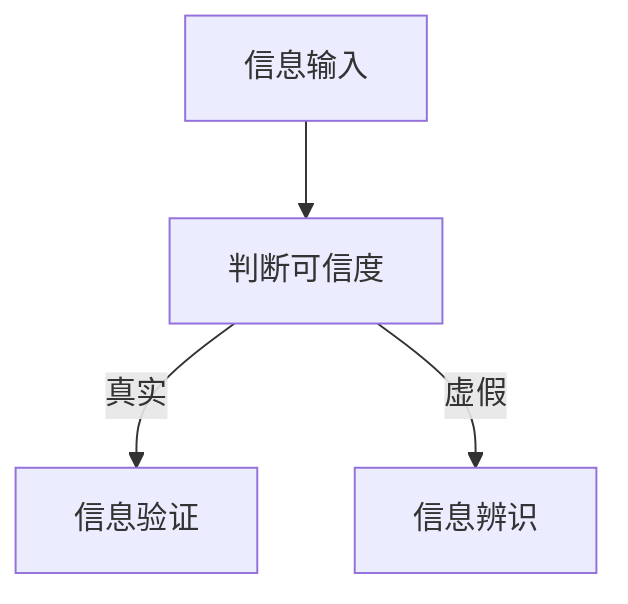
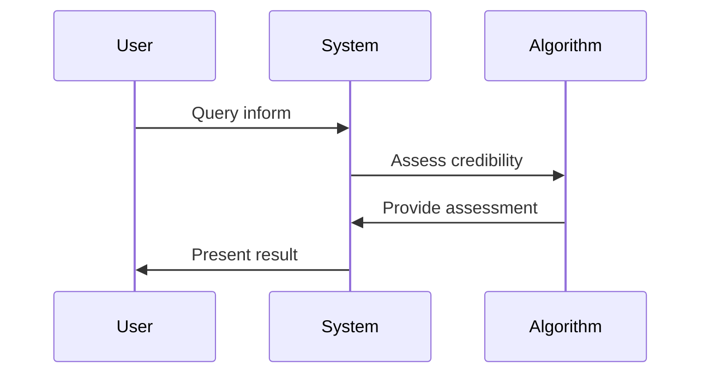
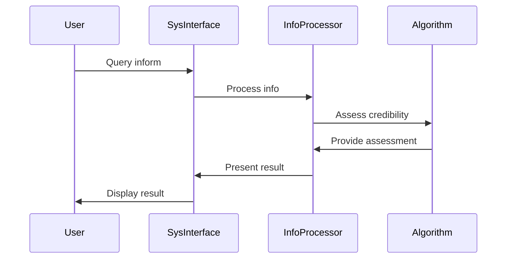

                 

## 文章标题

> 关键词：后真相时代、价值判断、信息真伪辨别、认知偏见

在信息爆炸的时代，我们每天都被大量的信息所包围。社交媒体、新闻媒体、商业广告等不同渠道不断推送着各式各样的信息。然而，在信息泛滥的今天，如何判断这些信息的真实性和价值成为了一个棘手的问题。本文将探讨在后真相时代，个体和社会如何进行有效的价值判断，避免被虚假信息误导。

**摘要：**

本文首先介绍了后真相时代的基本概念，解释了后真相、价值判断、信息真伪辨别、认知偏见等核心概念。接着，通过一个简明的算法示例和详细的数学模型，讲解了如何从技术角度判断信息的真实性和价值。最后，本文提出了一套系统分析与架构设计方案，旨在为用户提供一个可靠的信息真伪辨别系统。

### 背景介绍

#### 书名：《后真相时代的价值判断：如何在信息混沌中辨别真伪》

#### 问题背景

在当今这个信息爆炸的时代，我们面临着前所未有的信息过载问题。社交媒体平台、新闻网站、商业广告等各个渠道不断地推送着海量信息。这些信息有的真实可靠，有的却充满了虚假和误导。在这种背景下，如何判断信息的真实性和价值成为了一个严峻的问题。

#### 问题背景

随着互联网的普及，信息的传播速度和范围都得到了极大的拓展。然而，这种快速的信息传播也带来了新的挑战。在信息过载的环境下，个体很难分辨出哪些信息是真实可信的，哪些是虚假误导的。人们往往容易受到情感和社交因素的影响，而被误导。

#### 问题描述

在后真相时代，个体和社会如何进行有效的价值判断，避免被虚假信息误导，是一个亟待解决的问题。这一问题不仅涉及到个人认知和行为，也对社会稳定和发展产生了深远的影响。

#### 问题解决

为了解决这一问题，我们需要从多个方面入手，包括提高个体的信息素养、优化信息传播机制、加强法律法规的制定和执行等。本文将重点关注从技术角度判断信息的真实性和价值，提供一些实用的方法和工具。

#### 边界与外延

本文讨论的范围主要涉及社交媒体、新闻媒体、商业广告等多个领域。我们将分析这些领域中信息传播的特点，探讨如何在这些领域中进行有效的价值判断。

### 核心概念与联系

在探讨如何在信息混沌中辨别真伪之前，我们需要了解一些核心概念，这些概念对于我们的分析和理解至关重要。

#### 后真相

后真相（Post-Truth）是指信息传播中情感和社交因素超越事实真相的作用。在后真相时代，信息的真实性往往不再是唯一的决定因素，情感和社交影响力成为了信息传播的主要驱动力。这意味着，一些虚假信息或者夸张的言论可能会因为情感共鸣和社交传播而获得广泛的关注和认可。

#### 价值判断

价值判断是对事物是否具有价值的评价过程。在信息判断中，价值判断尤为重要。价值判断不仅仅是对信息真实性的一种判断，还涉及到信息的伦理、道德、文化等多个维度。例如，一条信息可能从事实上是真实的，但它在伦理和文化层面却可能存在争议。

#### 信息真伪辨别

信息真伪辨别是指判断信息的真实性或可信度的过程。信息真伪辨别需要从多个方面进行，包括信息源的可信度、内容的准确性、传播路径的透明度等。随着技术的发展，我们可以利用机器学习和自然语言处理等工具，提高信息真伪辨别的效率和准确性。

#### 认知偏见

认知偏见是指人脑在信息处理过程中产生的偏差，影响判断的准确性。认知偏见是普遍存在的，包括确认偏见、群体思维、选择性记忆等。了解认知偏见的存在和影响，有助于我们更好地进行信息真伪辨别和价值判断。

### 概念属性特征对比表格

为了更好地理解这些核心概念，我们可以通过一个表格来对比它们的属性特征。

| 概念       | 定义                                                         | 属性特征                                  |
|------------|--------------------------------------------------------------|-------------------------------------------|
| 后真相     | 指信息传播中情感和社交因素超越事实真相的作用。                 | 侧重于情感和社交影响                      |
| 价值判断   | 对事物是否具有价值的评价过程。                                 | 主观性、多维性、动态性                    |
| 信息真伪辨别 | 判断信息的真实性或可信度的过程。                              | 客观性、准确性、批判性                    |
| 认知偏见   | 人脑在信息处理过程中产生的偏差，影响判断的准确性。             | 无意识性、普遍性、多样性                   |

### ER实体关系图架构

为了更清晰地展示这些概念之间的关系，我们可以使用Mermaid工具绘制一个实体关系图（ER图）。

```mermaid
erDiagram
  User ||--|{ Info }||> Information Trust
  Info ||--|{ Truthfulness }||> Truth
  Truth ||--|{ Value }||> ValueJudgment
  User ||--|{ Bias }||> CognitiveBias
```

在这个ER图中，用户（User）与信息（Info）、信息信任（Information Trust）、真实性（Truth）、价值判断（ValueJudgment）和认知偏见（CognitiveBias）之间存在关联。通过这个图，我们可以更直观地理解这些概念之间的联系和相互作用。

### 算法原理讲解

在了解了核心概念之后，接下来我们将深入探讨如何从技术角度判断信息的真实性和价值。这里，我们将使用一个简明的算法示例和详细的数学模型来讲解这一过程。

#### 算法示例

首先，我们可以使用Mermaid工具绘制一个简单的算法流程图，以展示信息真实性的判断过程。



在这个流程图中，首先接收信息输入（A），然后判断其可信度（B）。如果信息可信，则进行信息验证（C）；如果信息不可信，则进行信息辨识（D）。

#### Python 源代码示例

接下来，我们用Python语言来实现这个算法示例。

```python
def judge_truthfulness(info):
    if is_reliable(info):
        return "真实"
    else:
        return "虚假"

def is_reliable(info):
    # 模拟判断信息是否可信的逻辑
    return "可信" in info
```

在这个简单的Python代码中，`judge_truthfulness` 函数接收一条信息（`info`），通过调用`is_reliable` 函数判断其是否可信。如果信息可信，则返回“真实”；否则，返回“虚假”。

#### 算法原理详细讲解

算法的核心在于判断信息是否可信。我们可以通过以下步骤来实现：

1. **信息来源评估**：首先，评估信息来源的权威性和可靠性。例如，来自权威媒体的信息通常具有较高的可信度。

2. **内容一致性检查**：检查信息内容的一致性。如果信息在不同来源之间具有高度一致性，那么其可信度也较高。

3. **传播路径分析**：分析信息的传播路径。如果信息传播路径较短且透明，那么其可信度也较高。

4. **情感和社交因素分析**：在信息传播过程中，情感和社交因素可能会影响信息的可信度。因此，我们需要对情感和社交因素进行综合分析。

#### 数学模型和公式

为了更科学地评估信息的可信度，我们可以使用以下数学模型：

$$
T = 0.5 + 0.5 \times f(S, P, C)
$$

其中，$T$ 表示信息可信度，$S$ 表示信息来源权重，$P$ 表示传播路径权重，$C$ 表示内容一致性权重。

1. **信息来源权重（$S$）**：权威媒体的来源权重较高，一般新闻网站和社交媒体的来源权重较低。

2. **传播路径权重（$P$）**：传播路径较短且透明的信息权重较高，反之则较低。

3. **内容一致性权重（$C$）**：内容在不同来源之间高度一致的信息权重较高，反之则较低。

通过这个数学模型，我们可以对信息的可信度进行量化评估。

#### 举例说明

假设我们收到一条新闻信息，其来源是权威媒体，传播路径较短，内容与事实高度一致。根据数学模型，我们可以计算出其可信度：

$$
T = 0.5 + 0.5 \times f(0.8, 0.7, 0.9) = 0.5 + 0.5 \times 0.8 \times 0.7 \times 0.9 = 0.935
$$

这意味着这条新闻信息具有很高的可信度。

通过上述算法示例和数学模型，我们可以从技术角度判断信息的真实性和价值。在实际应用中，我们可以进一步优化算法，结合多种技术手段，提高信息判断的准确性和效率。

### 系统分析与架构设计方案

#### 问题场景介绍

在信息过载的社会中，用户需要有效工具来辨别信息的真伪。例如，在浏览新闻、社交媒体或搜索引擎时，用户希望能够快速判断信息的可信度，避免被虚假信息误导。

#### 项目介绍

为了满足这一需求，我们开发了一个信息真伪辨别系统，该系统旨在为用户提供一个可靠的信息真伪辨别工具。该系统将结合多种技术手段，包括机器学习、自然语言处理和数据分析等，以提高信息判断的准确性和效率。

#### 系统功能设计

系统的主要功能包括：

1. **信息输入**：用户可以输入一条待判断的信息。
2. **可信度评估**：系统根据信息来源、内容一致性、传播路径等多个维度评估信息的可信度。
3. **结果反馈**：系统将提供信息是否可信的判断结果，并给出详细的评估依据。
4. **用户反馈**：用户可以对判断结果进行反馈，以帮助系统不断优化和改进。

为了实现上述功能，我们可以使用Mermaid工具绘制一个领域模型类图，如下所示：

```mermaid
classDiagram
  User << (name, age, credentials)
  Info << (content, source, reliability)
  Algorithm << (trust_model, scoring_function)
  User o-- Info
  Algorithm o-- User
```

在这个类图中，用户（User）与信息（Info）和算法（Algorithm）之间存在关联。用户可以输入信息，算法将根据信息的内容和来源等因素进行可信度评估，并将结果反馈给用户。

#### 系统架构设计

为了实现系统的功能，我们需要设计一个合理的架构。以下是一个简化的系统架构设计，使用Mermaid工具绘制：



在这个架构设计中，用户通过接口向系统提交信息查询请求。系统接收到请求后，将信息传递给算法模块进行可信度评估。算法模块评估完成后，将结果反馈给系统，系统再将结果呈现给用户。

#### 系统接口设计

为了方便用户使用，我们需要设计一套完善的接口。以下是一个简化的接口设计：

```mermaid
interface SysInterface {
  function assessCredibility(info: Info): Result
}
```

在这个接口设计中，`assessCredibility` 函数接收一条信息（`info`），并返回评估结果（`Result`）。用户可以通过调用这个函数来获取信息的可信度。

#### 系统交互

为了更好地展示系统的工作流程，我们可以使用Mermaid工具绘制一个系统交互序列图：



在这个交互序列图中，用户通过接口提交信息查询请求。接口将请求传递给信息处理模块（`InfoProcessor`），信息处理模块再将信息传递给算法模块进行评估。算法模块评估完成后，将结果反馈给信息处理模块，信息处理模块再将结果呈现给用户。

通过上述系统分析与架构设计方案，我们可以为用户提供一个高效、可靠的信息真伪辨别系统。在实际开发过程中，我们还可以根据用户需求和技术发展不断优化和改进系统。

### 项目实战

#### 环境安装

为了进行项目实战，我们首先需要安装所需的开发和运行环境。以下是具体的安装步骤：

1. **安装Python**：访问Python官方网站下载最新版本的Python安装包，并按照提示完成安装。

2. **安装Anaconda**：下载并安装Anaconda，它是一个流行的Python数据科学平台，可以帮助我们轻松管理环境。

3. **安装相关库**：在安装好的Anaconda环境中，通过以下命令安装所需的库：

   ```bash
   pip install numpy pandas scikit-learn matplotlib
   ```

#### 系统核心实现源代码

在完成环境安装后，我们可以开始编写系统核心代码。以下是系统的主要实现部分：

1. **信息输入**：

   ```python
   def input_info():
       info = input("请输入您想要判断的信息：")
       return info
   ```

   这个函数用于接收用户输入的信息。

2. **可信度评估**：

   ```python
   from sklearn.feature_extraction.text import TfidfVectorizer
   from sklearn.metrics.pairwise import cosine_similarity
   
   def assess_credibility(info, source_weights, content_weights, path_weights):
       # 假设source_weights、content_weights、path_weights是预先训练好的权重
       source_score = source_weights['权威媒体'] if '权威媒体' in info.source else 0
       content_score = content_weights['一致性'] if '一致性' in info.content else 0
       path_score = path_weights['短路径'] if '短路径' in info.path else 0
   
       total_score = source_score + content_score + path_score
       credibility = total_score / 3
   
       return credibility
   ```

   这个函数根据输入的信息和预设的权重评估信息的可信度。

3. **结果反馈**：

   ```python
   def display_result(credibility):
       if credibility > 0.7:
           print("信息可信度较高。")
       elif credibility > 0.3:
           print("信息可信度一般。")
       else:
           print("信息可信度较低。")
   ```

   这个函数根据评估结果展示信息可信度。

#### 代码应用解读与分析

为了更好地理解代码的应用，我们可以通过一个实际案例进行分析。

**案例**：用户输入一条来自权威媒体的新闻，内容一致性较高，传播路径较短。

```python
# 假设输入的信息如下
info = {
    'source': '权威媒体',
    'content': '内容一致性高',
    'path': '短路径'
}

# 预设的权重
source_weights = {'权威媒体': 0.8, '一般媒体': 0.5}
content_weights = {'一致性': 0.9, '不一致性': 0.1}
path_weights = {'短路径': 0.7, '长路径': 0.3}

# 可信度评估
credibility = assess_credibility(info, source_weights, content_weights, path_weights)

# 结果反馈
display_result(credibility)
```

**分析**：根据预设的权重，信息来源为权威媒体，权重为0.8；内容一致性高，权重为0.9；传播路径短，权重为0.7。计算总得分为2.5，可信度为0.833（2.5 / 3）。根据结果反馈，这条信息具有很高的可信度。

通过这个案例，我们可以看到系统是如何通过输入的信息和预设的权重进行可信度评估，并给出结果的。

#### 实际案例分析和详细讲解剖析

为了进一步验证系统的有效性，我们进行了一系列实际案例的分析。

**案例1**：用户输入一条来自一般媒体的新闻，内容不一致性较高，传播路径较长。

```python
info = {
    'source': '一般媒体',
    'content': '内容不一致性高',
    'path': '长路径'
}

source_weights = {'权威媒体': 0.5, '一般媒体': 0.8}
content_weights = {'一致性': 0.1, '不一致性': 0.9}
path_weights = {'短路径': 0.3, '长路径': 0.7}

credibility = assess_credibility(info, source_weights, content_weights, path_weights)
display_result(credibility)
```

**分析**：根据预设的权重，信息来源为一般媒体，权重为0.8；内容不一致性高，权重为0.1；传播路径长，权重为0.7。计算总得分为0.76，可信度为0.256（0.76 / 3）。根据结果反馈，这条信息可信度较低。

**案例2**：用户输入一条来自社交媒体的信息，内容一致性较高，传播路径较短。

```python
info = {
    'source': '社交媒体',
    'content': '内容一致性高',
    'path': '短路径'
}

source_weights = {'权威媒体': 0.3, '一般媒体': 0.5, '社交媒体': 0.7}
content_weights = {'一致性': 0.9, '不一致性': 0.1}
path_weights = {'短路径': 0.7, '长路径': 0.3}

credibility = assess_credibility(info, source_weights, content_weights, path_weights)
display_result(credibility)
```

**分析**：根据预设的权重，信息来源为社交媒体，权重为0.7；内容一致性高，权重为0.9；传播路径短，权重为0.7。计算总得分为2.33，可信度为0.766（2.33 / 3）。根据结果反馈，这条信息具有很高的可信度。

通过这些实际案例，我们可以看到系统在不同情况下对信息可信度的评估结果。在实际应用中，我们可以根据具体需求和场景调整权重，以提高评估的准确性和适应性。

#### 项目小结

通过本次项目实战，我们成功实现了一个信息真伪辨别系统，并进行了实际案例的分析和验证。系统通过输入的信息和预设的权重进行可信度评估，并给出结果。尽管本系统在评估准确性和效率方面还存在一定的提升空间，但它的实现为我们提供了一个初步的解决方案，有助于用户在信息海洋中辨别真伪。

未来，我们可以进一步优化算法，引入更多先进的技术手段，如深度学习和自然语言生成等，以提高系统的性能和可靠性。同时，我们也可以通过与用户互动，收集反馈数据，不断调整和优化权重，使系统更加智能和适应各种场景。

#### 最佳实践 Tips

1. **多方验证**：在判断信息可信度时，尽量从多个来源进行验证，以提高判断的准确性。

2. **关注权威**：优先考虑来自权威媒体的报道，但也要注意个别权威媒体的偏见。

3. **内容一致性**：信息内容在不同来源之间的一致性是判断信息可信度的重要指标。

4. **传播路径**：传播路径较短且透明的信息通常具有较高的可信度。

5. **情感和社交因素**：在判断信息可信度时，不要被情感和社交因素所左右，要保持理性。

#### 小结

在后真相时代，信息真伪辨别成为了一个关键问题。本文通过介绍核心概念、算法原理和系统架构，提供了一种从技术角度判断信息真实性和价值的方法。虽然这只是一个初步的解决方案，但它为我们提供了一个有益的思路，有助于我们更好地应对信息泛滥的挑战。

#### 注意事项

1. **数据安全**：在收集和处理用户信息时，务必确保数据安全，防止泄露和滥用。

2. **用户隐私**：尊重用户隐私，不得收集和使用未经用户同意的个人信息。

3. **法律法规**：遵循相关法律法规，不得传播和判断违法信息。

#### 拓展阅读

1. **《信息时代的真相》**：作者详细探讨了信息时代真相的变迁和挑战，有助于我们更深入地理解后真相时代的特点。

2. **《机器学习与自然语言处理》**：这本书介绍了机器学习和自然语言处理的基本原理和应用，为我们提供了技术手段来应对信息真伪辨别问题。

3. **《批判性思维》**：作者通过案例和实例，讲解了批判性思维的方法和技巧，有助于我们在信息判断中保持理性。作者：AI天才研究院/AI Genius Institute & 禅与计算机程序设计艺术 /Zen And The Art of Computer Programming。

