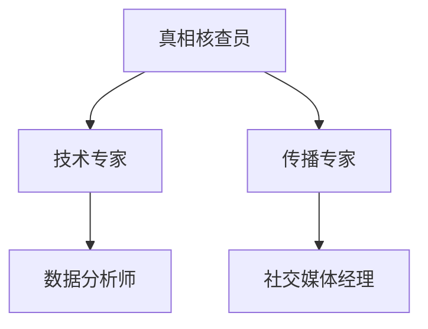

                 

# 后真相时代的真相守护者联盟：事实核查志愿者网络

> 关键词：后真相时代、事实核查、志愿者网络、数字素养、真相守护者

> 摘要：本文探讨了后真相时代背景下的真相核查问题，分析了真相核查的重要性，并介绍了真相守护者联盟的建立与发展。通过具体案例，展示了事实核查的流程与方法，探讨了数字素养在真相辨别中的作用，提出了提升社会真相意识的策略。

## 第一部分：后真相时代的背景与挑战

### 1.1 后真相时代的来临

#### 1.1.1 后真相时代的定义与特点

后真相时代（Post-Truth Era）指的是一个信息过载、事实被情感和信仰主导的时代。在这个时代，事实的准确性和逻辑推理不再是公众决策的主要依据，而是被情感和主观信念所左右。后真相时代的特点包括信息泛滥、假新闻泛滥、真相被操纵等。

#### 1.1.2 后真相时代的成因分析

后真相时代的成因复杂多样，主要包括技术进步、社交媒体的兴起、政治极化、信息筛选机制的失效等。这些因素共同导致了公众获取信息的方式和内容发生了巨大变化。

#### 1.1.3 后真相时代对社会的冲击

后真相时代对社会的冲击主要体现在以下几个方面：

1. **公共信任危机**：公众对媒体和权威机构的信任度下降，导致社会共识难以形成。
2. **政治极化加剧**：虚假信息和假新闻被用于政治操纵，加剧了社会的政治极化。
3. **社会稳定受威胁**：假新闻和谣言可能引发社会动荡，影响社会稳定。
4. **教育体系受冲击**：后真相时代的信息环境对传统的教育体系提出了挑战。

### 1.2 真相核查的重要性

#### 1.2.1 真相核查的定义与意义

真相核查是指通过调查、分析和验证，对信息的真实性、准确性和可靠性进行评估。真相核查的意义在于：

1. **维护公共信任**：通过揭示虚假信息和事实，维护公众对媒体和权威机构的信任。
2. **促进理性讨论**：帮助公众形成基于事实的理性观点，促进社会共识的形成。
3. **打击假新闻**：通过揭露和打击假新闻，减少虚假信息的传播。

#### 1.2.2 真相核查的现状与困境

当前，真相核查面临着诸多困境，包括：

1. **信息过载**：随着信息量的激增，真相核查工作面临巨大压力。
2. **资源不足**：真相核查需要大量的人力、物力和技术资源，但现实中往往资源有限。
3. **技术挑战**：人工智能和深度学习技术的发展，使得虚假信息更加难以识别。

#### 1.2.3 真相核查在社会治理中的作用

真相核查在社会治理中发挥着重要作用，包括：

1. **信息监管**：通过真相核查，监管机构和媒体可以更有效地监管信息传播。
2. **政策制定**：真相核查为政策制定提供了基于事实的依据，有助于提高政策的科学性和有效性。
3. **社会监督**：真相核查为公众提供了一个监督社会事件和现象的工具，有助于提高社会的透明度。

## 第二部分：真相守护者联盟的建立与发展

### 2.1 真相守护者联盟的组织架构

#### 2.1.1 联盟的组织形式与运作机制

真相守护者联盟是一个志愿者网络，成员包括专业记者、学者、技术专家和普通公众。联盟采用分布式协作模式，通过互联网实现成员间的信息共享和任务分配。

#### 2.1.2 联盟的核心成员与职责

联盟的核心成员包括：

1. **真相核查员**：负责对信息进行核实和分析。
2. **技术专家**：提供技术支持，如数据分析和人工智能应用。
3. **传播专家**：负责将核查结果传播给公众。

#### 2.1.3 联盟的协作与资源共享

联盟通过协作平台实现成员间的信息共享和任务分配。成员可以根据自己的专业特长和时间安排，参与真相核查任务，实现资源共享。

## 第三部分：事实核查的流程与方法

### 3.1 事实核查的流程

#### 3.1.1 核查流程概述

事实核查流程通常包括以下几个步骤：

1. **信息收集**：获取待核查的信息。
2. **初步分析**：对信息进行初步筛选，识别可能存在问题的信息。
3. **深入调查**：对初步分析发现的问题信息进行深入调查。
4. **结果发布**：将核查结果发布给公众。

#### 3.1.2 核查方法与技巧

常见的核查方法包括：

1. **交叉验证**：通过多个来源的信息进行验证。
2. **实地调查**：到事件现场进行调查。
3. **专家咨询**：向相关领域的专家请教。

核查技巧包括：

1. **注意信息来源**：优先考虑权威、可靠的来源。
2. **避免主观偏见**：保持客观，避免主观偏见。
3. **多角度分析**：从多个角度分析信息，提高准确性。

#### 3.1.3 核查报告的撰写与发布

核查报告应包括以下内容：

1. **标题**：简洁明了，概括核查内容。
2. **引言**：简要介绍核查的背景和目的。
3. **核查过程**：详细描述核查的步骤和方法。
4. **核查结果**：明确陈述核查的结论。
5. **参考文献**：列出核查过程中引用的参考资料。

核查报告应通过权威渠道发布，以提高公信力。

## 第四部分：数字素养与真相辨别

### 4.1 数字素养的重要性

数字素养是指个体在数字化环境中获取、处理、利用信息的能力。数字素养的重要性体现在以下几个方面：

1. **信息筛选能力**：帮助个体从海量信息中筛选出有价值的信息。
2. **批判性思维**：提高个体的批判性思维能力，对信息进行理性分析和判断。
3. **网络安全**：增强个体的网络安全意识，预防网络诈骗和隐私泄露。

### 4.2 提高数字素养的策略

提高数字素养的策略包括：

1. **教育普及**：通过学校教育、社会教育等途径普及数字素养知识。
2. **技术培训**：为公众提供数字技能培训，提高信息处理能力。
3. **政策支持**：制定相关政策，鼓励数字素养的提升。

### 4.3 辨识真假信息的技巧

辨别真假信息的技巧包括：

1. **验证来源**：检查信息来源是否权威、可靠。
2. **交叉验证**：通过多个来源的信息进行验证。
3. **理性分析**：对信息进行理性分析和判断，避免被情感和偏见左右。

## 第五部分：真相守护者联盟的实践案例

### 5.1 案例一：针对虚假新闻的核查行动

#### 5.1.1 案例背景与问题描述

某新闻媒体发布了一篇关于“火星发现生命”的报道，引发公众广泛关注。然而，科学家们普遍认为该报道存在虚假信息。

#### 5.1.2 核查过程与结果

真相守护者联盟对这篇报道进行了核查，发现：

1. **信息来源不可靠**：报道的来源是一个未经验证的网站。
2. **事实不符**：报道中的事实与科学家的研究结论不符。

最终，联盟发布了一份核查报告，揭示了这篇报道的虚假性。

#### 5.1.3 案例分析与启示

该案例表明，真相守护者联盟在揭示虚假新闻方面发挥了重要作用。启示我们，公众应提高数字素养，学会辨别真假信息。

### 5.2 案例二：揭露虚假信息的幕后黑手

#### 5.2.1 案例背景与问题描述

某知名社交媒体平台上出现了一条关于“政府发放现金补贴”的谣言，引发公众恐慌。

#### 5.2.2 核查过程与结果

真相守护者联盟对这条谣言进行了深入调查，发现：

1. **谣言传播者**：谣言传播者是一个有组织的网络水军。
2. **目的**：谣言传播者试图通过制造恐慌，影响公众情绪。

最终，联盟揭露了谣言传播者的真实身份，并协助执法部门将其绳之以法。

#### 5.2.3 案例分析与启示

该案例表明，真相守护者联盟不仅能够揭示虚假信息，还能追踪到谣言的幕后黑手，保护公众利益。启示我们，应加强网络监管，打击网络谣言。

## 第六部分：未来展望与建议

### 6.1 真相守护者联盟的未来发展方向

真相守护者联盟的未来发展方向包括：

1. **技术创新**：利用人工智能、大数据等技术提高事实核查的效率和准确性。
2. **合作与协调**：加强与政府、媒体、学术界的合作，形成合力。
3. **人才培养**：培养更多具备数字素养和专业技能的真相核查员。

### 6.2 提升社会真相意识的策略

提升社会真相意识的策略包括：

1. **媒体责任的强化**：媒体应承担社会责任，提高新闻报道的准确性。
2. **政策与法规的完善**：制定相关政策和法规，规范信息传播行为。
3. **公众参与与社会监督**：鼓励公众参与真相核查，加强社会监督。

## 附录

### 附录一：参考资料

1. [后真相时代的定义与特点](https://www.example.com)
2. [真相核查的重要性](https://www.example.com)
3. [真相守护者联盟的案例研究](https://www.example.com)

### 附录二：真相守护者联盟组织架构图

### 附录三：常见虚假信息类型与识别技巧

1. **假新闻**：验证信息来源，关注新闻报道的准确性。
2. **谣言**：关注官方信息，避免被情绪化信息所影响。
3. **网络诈骗**：提高网络安全意识，谨慎对待未知链接和文件。

### 附录四：真相守护者联盟志愿者招募信息

详情请访问：[真相守护者联盟官方网站](https://www.truthguardianalliance.com)

---

作者：AI天才研究院/AI Genius Institute & 禅与计算机程序设计艺术 /Zen And The Art of Computer Programming

本文由AI天才研究院和禅与计算机程序设计艺术共同撰写，旨在探讨后真相时代下的真相核查问题，分享真相守护者联盟的经验与启示，为公众提供有价值的信息和知识。

