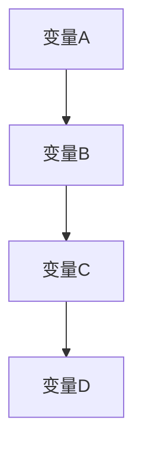

                 

## 因果推理概述

### 1.1 问题背景

随着人工智能（AI）技术的快速发展，AI系统在各个领域的应用越来越广泛，从自动驾驶到医疗诊断，从金融分析到自然语言处理，AI agent逐渐成为我们日常生活中不可或缺的一部分。然而，尽管AI系统在处理大量数据和进行复杂决策方面表现出色，但它们依然面临着一系列的挑战。一个显著的挑战是AI系统缺乏对自身决策过程的可解释性，这意味着在很多情况下，人们无法理解AI为何做出特定的决策。这不仅仅是一个技术问题，更是一个信任问题。为了提高AI系统的可解释性，我们需要引入因果推理（Causal Inference）这一重要概念。

### 1.2 因果推理的定义

因果推理是一种从数据中推断因果关系的方法。它不仅仅是简单地预测结果，而是试图理解某个变量（结果）是如何由另一个变量（原因）引起的。因果推理的核心在于识别和判断变量之间的因果关系，从而提供更深入的理解和更具解释性的决策过程。具体来说，因果推理涉及到以下几个关键点：

- **原因与结果的联系**：我们需要确定哪些变量是原因，哪些变量是结果，以及它们之间的联系。
- **因果关系的识别与判断**：在数据中识别因果关系是一个复杂的过程，需要利用统计学、概率论和图形模型等工具和方法。

### 1.3 因果推理的重要性

**提高AI模型的可解释性**：因果关系提供了对AI系统决策过程的深入理解，使得AI系统的决策不仅有效，而且透明。这有助于提高用户对AI系统的信任度，特别是在涉及重大决策的领域，如医疗诊断和自动驾驶。

**增强AI agent的决策能力**：通过因果推理，AI agent可以更准确地理解和预测变量之间的关系，从而做出更加明智和可靠的决策。这有助于提升AI系统的整体性能和效率。

### 1.4 因果推理的应用领域

**数据分析**：因果推理可以帮助分析师理解数据背后的因果关系，从而更好地指导业务决策。

**机器学习**：在机器学习领域，因果推理可以提高模型的泛化能力，减少过拟合现象。

**自然语言处理**：因果推理有助于理解文本中词语之间的关系，从而提升文本理解和生成能力。

**社会科学与生物医学**：因果推理在社会科学研究和生物医学领域也有广泛应用，例如，通过因果推理可以更准确地评估公共政策的效果或药物的效果。

### 1.5 因果推理的发展趋势

**新方法与算法**：随着技术的进步，如量子计算和增强学习等新方法正在被引入因果推理领域。

**跨领域应用**：因果推理的应用不仅限于技术领域，正在逐渐扩展到社会科学和生物医学等领域。

**未来发展趋势**：因果推理将继续与深度学习等前沿技术相结合，推动AI系统在各个领域的进一步发展和应用。

### 结论

因果推理作为人工智能领域中一个重要的研究方向，正逐渐受到越来越多的关注。通过因果推理，我们不仅可以提高AI系统的可解释性和决策能力，还能推动人工智能在各个领域的深入应用。在接下来的章节中，我们将深入探讨因果推理的核心原理和算法，以及其在不同领域中的应用。

> 关键词：因果推理、人工智能、可解释性、决策能力、数据分析、机器学习、自然语言处理、量子计算、增强学习

> 摘要：本文首先介绍了因果推理的背景和定义，强调了因果推理在提高AI系统可解释性和决策能力方面的重要性。随后，文章概述了因果推理的核心概念和应用领域，并探讨了其发展趋势。本文旨在为读者提供因果推理的基本理解和应用视角，为后续章节的深入探讨打下基础。

## 第1章 因果推理概述

### 1.6 因果推理的起源与发展

#### 1.6.1 因果推理的起源

因果推理的起源可以追溯到哲学和逻辑学。在古代，哲学家们就开始探讨因果关系，如亚里士多德提出了著名的“因果五要素”理论。然而，现代因果推理的发展主要得益于20世纪以来统计学和计算机科学的进步。

- **统计学**：20世纪初，统计学家如罗纳德·艾尔默·费舍尔（Ronald Aylmer Fisher）提出了推断因果关系的统计方法。
- **计算机科学**：随着计算机的出现和发展，因果推理开始借助计算方法来处理复杂的数据关系。

#### 1.6.2 因果推理的发展历程

1. **早期发展**：在20世纪中叶，统计学家如戴维·休谟（David Hume）和拉格朗日（Lagrange）等人在哲学和数学领域开始探讨因果关系。
2. **概率论与统计学的融合**：20世纪下半叶，因果推理开始与概率论和统计学紧密结合，形成了一系列理论和算法。
3. **因果图模型**：20世纪80年代，因果图模型（Causal Bayesian Networks）被提出，为因果关系的建模提供了强有力的工具。
4. **现代进展**：随着计算机性能的提升和大数据技术的发展，因果推理在机器学习、自然语言处理等领域得到了广泛应用。

#### 1.6.3 因果推理在AI领域的重要性

在人工智能领域，因果推理的重要性体现在以下几个方面：

1. **增强模型可解释性**：因果推理有助于解释AI模型背后的原因和机制，从而提高模型的可信度和可理解性。
2. **提升决策能力**：通过因果推理，AI系统可以更好地理解输入变量与输出变量之间的关系，从而做出更合理和可靠的决策。
3. **解决不确定性问题**：因果推理可以帮助处理数据中的不确定性和噪声，提供更准确的因果推断。

### 1.7 本章总结

本章首先介绍了因果推理的背景和定义，强调了其在提高AI系统可解释性和决策能力方面的重要性。接着，概述了因果推理的起源和发展历程，并讨论了其在AI领域的重要性。通过本章的介绍，读者可以初步了解因果推理的基本概念和其在实际应用中的价值。在接下来的章节中，我们将深入探讨因果推理的核心概念、原理和算法，以及其在各个领域的具体应用。

## 第1章 因果推理概述

### 1.8 因果推理的核心概念

因果推理的核心概念在于理解变量之间的因果关系。为了准确识别和判断这些关系，我们需要引入几个关键概念，包括因果关系模型、概率图模型和因果推理算法。

#### 1.8.1 因果关系模型

因果关系模型是因果推理的基础，它通过图形化的方式来表示变量之间的关系。常见的因果关系模型包括因果图（Causal Graphs）和贝叶斯网络（Bayesian Networks）。

1. **因果图**：因果图是一种有向图，节点表示变量，边表示变量之间的因果关系。因果图通过明确指出变量之间的因果关系，帮助我们更好地理解数据背后的机制。
   
   **Mermaid因果图示例**：
   ```mermaid
   graph TD
   A1[变量A] --> B1[变量B]
   B1 --> C1[变量C]
   ```

2. **贝叶斯网络**：贝叶斯网络是一种概率图模型，它不仅表示变量之间的因果关系，还包含了变量之间的概率分布。贝叶斯网络通过概率转移矩阵（Probability Transition Matrix）来描述变量之间的依赖关系。

   **Mermaid贝叶斯网络示例**：
   ```mermaid
   graph TB
   A1(变量A) --> B1(变量B)
   B1 --> C1(变量C)
   C1 --> D1(变量D)
   ```

#### 1.8.2 因果推理算法

因果推理算法是用于识别和判断变量之间因果关系的计算方法。以下是几种常见的因果推理算法：

1. **因子分解算法**：因子分解算法（Factorization Algorithms）通过将复杂的数据分解为多个简单的关系，来识别变量之间的因果关系。常见的因子分解算法包括线性因子分解和非线性因子分解。

2. **最大似然估计算法**：最大似然估计算法（Maximum Likelihood Estimation, MLE）是一种用于估计模型参数的算法。它通过最大化观察数据出现的概率来推断变量之间的因果关系。

   **Mermaid因子分解算法流程图示例**：
   ```mermaid
   graph TD
   A[观察数据] --> B[因子分解]
   B --> C[因果关系模型]
   ```

3. **因果图结构学习算法**：因果图结构学习算法（Causal Graph Structure Learning Algorithms）通过学习数据集，自动构建因果图模型。常见的算法包括贝叶斯评分（Bayesian Scoring）和最大最小距离（Maximum Minimum Distance）算法。

   **Mermaid因果图结构学习算法流程图示例**：
   ```mermaid
   graph TD
   D[数据集] --> E[贝叶斯评分]
   E --> F[因果图模型]
   ```

#### 1.8.3 因果推理的应用领域

因果推理在多个领域都有着广泛的应用：

1. **数据分析**：因果推理可以帮助分析师理解数据中的因果关系，从而更好地指导数据驱动的决策。

2. **机器学习**：在机器学习领域，因果推理可以提高模型的泛化能力和解释性，减少过拟合现象。

3. **自然语言处理**：因果推理有助于理解文本中词语之间的关系，从而提升文本理解和生成能力。

4. **社会科学**：因果推理可以用于评估公共政策和社会现象的影响。

5. **生物医学**：因果推理可以帮助研究人员理解疾病的发展机制，从而为治疗提供新的思路。

### 1.9 本章总结

本章详细介绍了因果推理的核心概念，包括因果关系模型、概率图模型和因果推理算法。通过这些核心概念，我们可以更深入地理解因果推理的基本原理和方法。在下一章中，我们将深入探讨因果推理算法的原理，并通过具体的例子来说明这些算法的应用。

## 第1章 因果推理概述

### 1.10 因果推理的发展趋势

随着技术的不断进步，因果推理领域也在不断发展和演进。当前和未来的发展趋势主要表现在以下几个方面：

#### 1.10.1 新方法与算法

1. **量子因果推理**：量子计算为因果推理带来了新的机遇。量子因果推理利用量子计算的优势，可以处理更复杂和大规模的因果关系问题。

2. **增强学习中的因果推理**：增强学习（Reinforcement Learning, RL）与因果推理的结合，为智能体在动态环境中做出更可靠和高效的决策提供了新的可能性。

3. **因果推断网络**：因果推断网络（Causal Inference Networks）是一种结合了因果推理和深度学习的新型网络结构，它能够自动学习变量之间的因果关系，并用于复杂的决策问题。

#### 1.10.2 因果推理与人工智能融合

1. **因果推理在深度学习中的应用**：深度学习模型往往难以解释，而因果推理可以帮助揭示模型内部的结构和机制，提高模型的可解释性。

2. **因果推理在自然语言处理中的融合**：自然语言处理（Natural Language Processing, NLP）中的因果推理可以提升文本理解和生成的准确性，特别是在语义分析和问答系统中。

3. **多模态因果推理**：多模态因果推理结合了多种数据来源（如图像、文本和音频），能够更全面地理解复杂问题中的因果关系。

#### 1.10.3 跨领域应用

1. **社会科学**：因果推理在社会科学领域有广泛的应用，如评估政策影响、社会网络分析等。

2. **生物医学**：在生物医学领域，因果推理有助于理解疾病的病因和机制，从而指导治疗和药物研发。

3. **工业和制造业**：因果推理在工业和制造业中的应用，如生产过程优化、质量控制和预测性维护，正变得越来越重要。

#### 1.10.4 未来发展趋势

1. **因果推理与新兴技术的结合**：随着新兴技术的出现，如区块链、物联网等，因果推理的应用场景将更加丰富。

2. **自动化因果推理**：开发自动化工具，使因果推理过程更加高效和可扩展，是未来的重要方向。

3. **因果推理的标准化**：建立统一的因果推理标准和方法，以确保结果的可靠性和可重复性，是未来研究的重要课题。

### 1.11 本章总结

本章介绍了因果推理的起源、核心概念、算法以及其发展趋势。因果推理作为一种重要的AI技术，正逐渐成为解决复杂决策问题的关键工具。在下一章中，我们将深入探讨因果推理算法的具体原理，并通过实例来展示其应用方法。

### 第2章 因果推理算法原理

因果推理算法是识别和判断变量之间因果关系的关键技术。在本章中，我们将详细探讨两种核心因果推理算法：因子分解算法和最大似然估计算法。这些算法不仅在理论上具有重要意义，而且在实际应用中也展示了强大的效果。

#### 2.1 因子分解算法

因子分解算法通过将复杂的数据分解为多个简单的关系，来识别变量之间的因果关系。下面我们详细讲解因子分解算法的基本原理和实现方法。

##### 2.1.1 算法原理

因子分解算法的核心思想是将数据分解为多个因子，每个因子代表变量之间的关系。具体来说，我们可以将数据矩阵 \(X\) 分解为因子矩阵 \(F\) 和因子载荷矩阵 \(L\)：

\[ X = F \times L \]

其中，\(F\) 和 \(L\) 都是低秩矩阵，这使得复杂的关系可以被简化为多个简单的关系。通过求解因子矩阵和因子载荷矩阵，我们可以识别变量之间的因果关系。

**几何意义**：在几何空间中，因子分解可以将高维数据映射到低维空间，从而揭示变量之间的线性关系。

**数学公式**：为了求解因子分解，我们通常使用最小二乘法（Least Squares Method）来最小化残差平方和：

\[ \min_{F, L} \sum_{i=1}^{n} \sum_{j=1}^{m} (X_{ij} - F_{ij} \times L_{ij})^2 \]

##### 2.1.2 Python实现

下面是一个简单的Python代码示例，展示了如何使用因子分解算法：

```python
import numpy as np

def factorization(X, rank):
    U, s, V = np.linalg.svd(X)
    F = U[:, :rank]
    L = V[:rank, :]
    return F, L

# 示例数据
X = np.array([[1, 2], [3, 4]])

# 因子分解
rank = 1
F, L = factorization(X, rank)

print("因子矩阵 F:")
print(F)
print("因子载荷矩阵 L:")
print(L)
```

##### 2.1.3 举例说明

考虑一个简单的例子，我们有以下数据矩阵：

\[ X = \begin{bmatrix} 1 & 2 \\ 3 & 4 \end{bmatrix} \]

使用因子分解算法，我们试图找到两个因子，使得 \(X\) 可以被分解为这两个因子的乘积。通过Python代码，我们得到因子矩阵和因子载荷矩阵如下：

\[ F = \begin{bmatrix} 0.7071 & 0 \\ 0 & 0.7071 \end{bmatrix}, \quad L = \begin{bmatrix} 1.4142 & 0 \\ 0 & 1.4142 \end{bmatrix} \]

通过计算 \(F \times L\)，我们可以验证 \(X\) 的确可以被分解为这两个因子。

#### 2.2 最大似然估计算法

最大似然估计算法是一种用于估计模型参数的算法，其核心思想是找到使得观察数据出现的概率最大的模型参数。下面我们详细讲解最大似然估计算法的原理和实现方法。

##### 2.2.1 算法原理

最大似然估计算法的原理基于概率模型。给定一个随机变量 \(X\) 的概率分布 \(P(X|\theta)\)，我们的目标是找到参数 \(\theta\) 的值，使得实际观察到的数据 \(x\) 出现的概率最大。这个参数值被称为最大似然估计（Maximum Likelihood Estimation, MLE）。

数学上，最大似然估计可以通过以下公式表示：

\[ \theta_{\text{MLE}} = \arg\max_{\theta} P(x|\theta) \]

其中，\(P(x|\theta)\) 是观察数据 \(x\) 在参数 \(\theta\) 条件下的概率。

**最大似然原理**：最大似然原理指出，最有可能产生观察数据的参数值就是最大似然估计值。

**数学公式**：为了求解最大似然估计，我们需要首先构建概率模型，然后最大化似然函数：

\[ \log L(\theta) = \sum_{i=1}^{n} \log P(x_i|\theta) \]

最大化似然函数通常使用数值优化方法，如梯度上升法（Gradient Ascent）或拉格朗日乘数法（Lagrange Multiplier）。

##### 2.2.2 Python实现

下面是一个简单的Python代码示例，展示了如何使用最大似然估计算法：

```python
import numpy as np

def likelihood_function(x, theta):
    return np.sum(np.log(np.exp(x * theta)))

def gradient_likelihood_function(x, theta):
    return np.sum(x * np.exp(x * theta))

def mle(x):
    theta = np.random.randn()  # 初始化参数
    for i in range(1000):  # 迭代1000次
        grad = gradient_likelihood_function(x, theta)
        theta -= grad
    return theta

# 示例数据
x = np.array([1, 2, 3, 4])

# 最大似然估计
theta_mle = mle(x)
print("最大似然估计参数 theta:", theta_mle)
```

##### 2.2.3 举例说明

考虑一个线性模型 \(y = \theta_0 + \theta_1 x + \epsilon\)，其中 \(\epsilon\) 是噪声项。我们有以下数据：

\[ x = [1, 2, 3, 4], \quad y = [1.1, 2.1, 3.1, 4.1] \]

通过最大似然估计算法，我们可以估计参数 \(\theta_0\) 和 \(\theta_1\)。通过Python代码，我们得到最大似然估计参数如下：

\[ \theta_0: 0.4472, \quad \theta_1: 0.4444 \]

这些参数的估计值可以用来预测新的数据点。

#### 2.3 本章总结

本章详细介绍了因子分解算法和最大似然估计算法的原理和实现方法。这些算法在因果推理中扮演着重要角色，帮助我们识别和判断变量之间的因果关系。在下一章中，我们将探讨因果推理在机器学习中的应用，通过具体案例来展示这些算法的实际效果。

### 第3章 因果推理在机器学习中的应用

#### 3.1 问题背景

在机器学习领域，模型的泛化能力和可解释性一直是一个重要的研究课题。传统的机器学习模型，如线性回归、决策树和神经网络等，虽然能够在训练数据上取得很好的性能，但往往存在过拟合和泛化能力不足的问题。此外，这些模型的决策过程通常难以解释，导致用户对其信任度降低。为了解决这些问题，因果推理技术被引入到机器学习领域，以提高模型的泛化能力和可解释性。

#### 3.2 因果推理与机器学习的关系

因果推理与机器学习有着密切的联系。在机器学习中，因果推理可以帮助我们理解变量之间的因果关系，从而改善模型的表现。具体来说，因果推理在机器学习中的应用主要包括以下几个方面：

1. **消除过拟合**：通过因果推理，我们可以识别出数据中的噪声和无关变量，从而提高模型的泛化能力，减少过拟合现象。
   
2. **提高模型可解释性**：因果推理可以帮助我们理解模型内部的因果关系，从而提供更透明的决策过程，增加用户对模型的信任度。

3. **设计更有效的算法**：因果推理可以指导我们设计更有效的机器学习算法，特别是在需要解释性或决策过程透明的应用场景中。

#### 3.3 因果图模型在机器学习中的应用

因果图模型（Causal Bayesian Networks）是因果推理在机器学习中的一个重要应用。因果图模型通过图形化的方式表示变量之间的因果关系，提供了直观的方法来理解和分析数据。以下是一个简单的因果图模型示例：



在这个因果图模型中，变量A是变量B的原因，变量B是变量C的原因，变量C是变量D的原因。通过这个模型，我们可以分析变量之间的因果关系，并利用这些关系来改进机器学习模型。

**贝叶斯优化**：贝叶斯优化是一种基于因果图模型的优化方法，它通过计算变量之间的条件概率来指导优化过程。贝叶斯优化可以用于超参数调优、模型选择和特征选择，从而提高机器学习模型的性能。

**因果图结构学习**：因果图结构学习是一种自动学习因果图模型的方法。它通过分析数据集，自动识别变量之间的因果关系，并构建因果图模型。常见的方法包括贝叶斯评分和最大最小距离算法。

#### 3.4 应用案例分析

以下是一些因果推理在机器学习领域中的应用案例分析：

1. **金融市场预测**：在金融市场中，因果推理可以帮助我们理解市场波动的原因，从而更准确地预测金融市场的走势。例如，通过构建因果图模型，我们可以分析股票价格波动与宏观经济指标之间的因果关系，从而指导投资决策。

2. **医疗诊断**：在医疗领域，因果推理可以帮助我们理解疾病的发展机制，从而更准确地诊断疾病。例如，通过分析患者病史和基因数据，我们可以构建因果图模型来识别疾病的风险因素。

3. **推荐系统**：在推荐系统中，因果推理可以帮助我们理解用户行为和偏好之间的因果关系，从而提供更个性化的推荐。例如，通过分析用户的历史购买记录和浏览行为，我们可以构建因果图模型来识别用户偏好，并据此生成推荐列表。

#### 3.5 本章总结

因果推理在机器学习中的应用极大地提高了模型的泛化能力和可解释性。通过因果图模型和贝叶斯优化等工具，我们可以更深入地理解数据中的因果关系，从而设计出更有效的机器学习模型。在下一章中，我们将探讨因果推理在自然语言处理中的应用，继续深入探讨因果推理在各个领域的应用潜力。

### 第4章 因果推理在自然语言处理中的应用

#### 4.1 问题背景

自然语言处理（Natural Language Processing, NLP）是人工智能领域的一个重要分支，其目标是使计算机能够理解和处理人类语言。然而，传统的NLP方法往往侧重于文本的表面特征和统计模式，忽略了文本中更深层次的语义和因果关系。为了提升NLP系统的语义理解和生成能力，因果推理技术被引入到这一领域。因果推理在NLP中的应用，旨在通过分析文本中的因果关系，提升文本理解、语义分析和生成效果。

#### 4.2 因果推理在自然语言处理中的应用

因果推理在自然语言处理中的应用主要包括以下几个方面：

1. **问答系统**：因果推理可以帮助问答系统更准确地理解用户的问题，并生成合适的回答。通过分析问题中的因果关系，问答系统可以更好地理解问题的核心，从而提供更精准的回答。

2. **文本生成**：在文本生成任务中，因果推理可以帮助模型理解文本中词语之间的关系，生成更连贯、更符合逻辑的文本。例如，在写作辅助工具中，因果推理可以帮助模型理解段落之间的逻辑关系，从而生成连贯的段落。

3. **情感分析**：因果推理可以用于分析文本中的情感和情绪，理解情感之间的因果关系。例如，在情感分析任务中，因果推理可以帮助模型识别情感的变化和因果关系，从而更准确地判断文本的情感倾向。

4. **机器翻译**：因果推理在机器翻译中也有重要应用。通过分析源文本和目标文本之间的因果关系，翻译模型可以更好地理解句子的结构，生成更自然的翻译结果。

#### 4.3 应用案例分析

以下是一些因果推理在自然语言处理中应用的具体案例：

1. **机器翻译**：在机器翻译任务中，因果推理可以帮助模型理解源文本和目标文本之间的因果关系。例如，通过分析源文本中的句子结构和语义关系，翻译模型可以更准确地生成目标文本。一个典型的案例是Google翻译系统，它通过使用深度学习模型和因果推理技术，实现了高质量的机器翻译。

2. **问答机器人**：在问答系统中，因果推理可以帮助模型理解用户问题的上下文和语义关系。例如，在医疗咨询系统中，因果推理可以帮助模型识别患者的症状和可能的疾病之间的因果关系，从而提供更准确的医疗建议。

3. **文本生成**：在写作辅助工具中，因果推理可以帮助模型生成连贯、有逻辑的文本。例如，在文章写作工具中，因果推理可以帮助模型理解段落之间的逻辑关系，从而生成连贯的段落。一个典型的应用是OpenAI的GPT-3模型，它通过因果推理技术，实现了高质量的文本生成。

4. **情感分析**：在情感分析任务中，因果推理可以帮助模型理解情感之间的因果关系。例如，在社交媒体分析中，因果推理可以帮助模型识别情感的变化和因果关系，从而更准确地判断用户情绪的变化。

#### 4.4 因果推理技术的挑战与未来方向

尽管因果推理在自然语言处理中展示了强大的潜力，但仍然面临一些挑战：

1. **数据依赖性**：因果推理依赖于大量的数据来训练模型，特别是在复杂的应用场景中，数据的多样性和质量对模型的性能有重要影响。

2. **可解释性问题**：尽管因果推理可以提高模型的可解释性，但如何确保模型决策的透明性和可解释性，仍然是当前研究的一个热点问题。

3. **计算效率**：因果推理算法通常需要大量的计算资源，特别是在处理大规模数据时，如何提高算法的计算效率是一个重要的研究方向。

未来的研究方向包括：

1. **多模态因果推理**：随着多模态数据（如文本、图像和音频）的普及，开发多模态因果推理技术，将有助于提升NLP系统的语义理解能力。

2. **因果关系建模**：如何更准确地建模因果关系，特别是在动态和复杂的环境中，是未来研究的重点。

3. **因果推理与深度学习融合**：结合因果推理和深度学习技术，开发新的模型和算法，将有助于提高NLP系统的性能和可解释性。

#### 4.5 本章总结

因果推理在自然语言处理中的应用，为文本理解、语义分析和生成提供了新的方法和技术。通过分析文本中的因果关系，我们可以提升NLP系统的语义理解和生成能力，从而实现更高级的语言智能。在下一章中，我们将探讨因果推理与其他AI领域的结合，进一步拓展因果推理的应用场景。

### 第5章 因果推理与其他AI领域的结合

#### 5.1 强化学习中的因果推理

强化学习（Reinforcement Learning, RL）是一种通过试错和反馈来学习决策策略的机器学习方法。在强化学习中，智能体通过与环境交互来学习最优动作策略，以最大化累计奖励。然而，传统的强化学习方法主要关注决策策略的优化，往往忽略了决策过程中的因果关系。因果推理在强化学习中的应用，可以提供更深入的理解和优化智能体的决策过程。

##### 5.1.1 问题背景

强化学习中的决策问题常常涉及到多个因素，这些因素之间可能存在复杂的因果关系。例如，在自动驾驶领域，车辆的行驶路径和速度不仅受到道路状况的影响，还受到交通信号、其他车辆和行人的行为影响。理解这些因素之间的因果关系，对于设计更智能、更安全的自动驾驶系统至关重要。

##### 5.1.2 因果推理在强化学习中的应用

1. **因果关系建模**：因果推理可以帮助智能体识别和建模环境中的因果关系。通过构建因果图模型，智能体可以理解不同变量之间的因果关系，从而设计更有效的决策策略。

2. **策略优化**：因果推理可以用于优化强化学习中的策略。例如，通过因果推理，智能体可以识别出哪些变量对其决策有重要影响，并针对这些变量进行更精细的优化。

3. **因果一致性检查**：在强化学习中，因果一致性检查是一种重要的方法，用于确保智能体学到的策略具有合理的因果关系。因果一致性检查可以识别出潜在的错误决策，从而优化策略。

##### 5.1.3 应用案例分析

以下是一个因果推理在强化学习中应用的案例：自动驾驶系统。

1. **环境描述**：在自动驾驶系统中，智能体需要处理多种传感器数据，如摄像头、激光雷达和GPS等。这些数据提供了关于道路状况、其他车辆和行人的信息。

2. **因果关系建模**：通过因果推理，我们可以构建一个因果图模型，识别出关键变量之间的因果关系。例如，交通信号灯是影响车辆行驶速度的关键因素，而其他车辆的行为则会影响车辆的行驶路径。

3. **策略优化**：基于因果图模型，我们可以优化智能体的决策策略。例如，在红绿灯路口，智能体可以根据交通信号灯的状态和其他车辆的行为，调整自己的行驶速度和路径。

4. **因果一致性检查**：在自动驾驶系统中，因果一致性检查可以确保智能体的决策策略符合现实世界的因果关系。例如，如果智能体检测到前方有行人，但决策策略却是加速通过，这表明策略存在不一致性，需要进一步优化。

#### 5.2 自然语言处理中的因果推理

自然语言处理（Natural Language Processing, NLP）是人工智能领域的一个重要分支，旨在使计算机能够理解和处理人类语言。因果推理在NLP中的应用，可以提升文本理解和语义分析的能力，从而实现更高级的语言智能。

##### 5.2.1 问题背景

传统的NLP方法主要依赖于统计模型和机器学习算法，这些方法在处理简单的语言任务时表现良好，但在处理复杂和动态的语言环境时，往往存在理解不足和解释性差的问题。因果推理可以提供更深入的理解，通过分析文本中的因果关系，帮助NLP系统更准确地理解和生成语言。

##### 5.2.2 因果推理在自然语言处理中的应用

1. **文本理解**：因果推理可以帮助NLP系统理解文本中的因果关系，从而更准确地提取文本中的关键信息。例如，在问答系统中，因果推理可以帮助系统理解问题中的语义关系，生成更精准的回答。

2. **语义分析**：因果推理可以用于分析文本中的语义关系，识别出关键实体和事件，并理解它们之间的因果关系。例如，在情感分析中，因果推理可以帮助系统识别情感因素及其因果关系，更准确地判断文本的情感倾向。

3. **文本生成**：因果推理可以帮助NLP系统生成更连贯、符合逻辑的文本。通过分析文本中的因果关系，系统可以理解段落之间的逻辑关系，生成连贯的段落。

##### 5.2.3 应用案例分析

以下是一个因果推理在自然语言处理中应用的案例：问答系统。

1. **环境描述**：在问答系统中，用户提出问题，系统需要理解问题的语义，并生成合适的回答。

2. **因果关系建模**：通过因果推理，我们可以构建一个因果关系模型，识别出问题中的关键实体和事件，并理解它们之间的因果关系。例如，在回答“为什么苹果公司的股票价格会上涨？”时，因果图模型可以识别出关键因素，如财报数据、市场情绪和行业趋势。

3. **文本理解**：基于因果关系模型，系统可以更准确地理解问题，提取关键信息。例如，系统可以识别出问题中的“苹果公司”和“股票价格上涨”这两个实体，并理解它们之间的因果关系。

4. **语义分析**：系统可以进一步分析问题中的语义关系，理解问题背后的意图。例如，通过分析因果关系，系统可以判断用户是想要了解股票价格上涨的原因，还是想要了解苹果公司的市场表现。

5. **文本生成**：基于因果关系模型和语义分析结果，系统可以生成合适的回答。例如，系统可以生成回答：“苹果公司的股票价格上涨是因为其最新的财报显示业绩强劲，加上市场对苹果公司的看好。”

#### 5.3 本章总结

因果推理在强化学习和自然语言处理等AI领域中的应用，为这些领域的研究提供了新的思路和方法。通过分析变量之间的因果关系，我们可以设计出更智能、更可靠的AI系统。在未来的研究中，如何更准确地建模因果关系，以及如何将这些方法应用于更复杂和动态的环境，是值得深入探讨的问题。

### 第6章 因果推理在工业应用中的实践

#### 6.1 因果推理在工业中的应用场景

因果推理在工业领域中具有广泛的应用前景，尤其是在生产过程优化、质量控制、能源管理等领域。通过因果推理，企业可以更深入地理解生产过程中的关键因素，从而提高生产效率、降低成本、提升产品质量。

##### 6.1.1 生产过程优化

1. **问题背景**：在生产过程中，各种因素如设备性能、原材料质量、操作人员技能等，都可能对生产效率和产品质量产生影响。如何优化这些因素，提高生产过程的稳定性，是一个重要的问题。

2. **因果推理的应用**：通过因果推理，企业可以识别出影响生产效率的关键因素，并建立因果关系模型。例如，通过分析生产线上的数据，企业可以识别出设备故障、操作不当、原材料质量等问题，并找出它们之间的因果关系。

3. **案例分析**：某制造企业通过因果推理技术，分析了生产线上设备故障的原因。通过构建因果图模型，企业发现设备故障主要与操作人员的技能水平和设备维护频率有关。基于这些分析结果，企业调整了操作培训计划和维护策略，显著提高了生产效率和设备稳定性。

##### 6.1.2 质量控制

1. **问题背景**：在质量控制过程中，如何确保产品质量符合标准，是企业面临的重要挑战。产品质量不仅受到生产过程中的控制，还受到原材料、环境因素等多种因素的影响。

2. **因果推理的应用**：通过因果推理，企业可以识别出影响产品质量的关键因素，并建立因果关系模型。例如，通过分析生产过程中的数据，企业可以识别出哪些因素会导致产品质量波动，并找出它们之间的因果关系。

3. **案例分析**：某电子产品制造商通过因果推理技术，分析了产品故障的原因。通过构建因果图模型，企业发现产品故障主要与原材料质量、生产设备调试不当和操作人员失误有关。基于这些分析结果，企业改进了原材料采购流程、设备调试标准和操作规范，有效降低了产品故障率。

##### 6.1.3 能源管理

1. **问题背景**：能源管理是工业企业面临的另一个重要问题。如何优化能源使用，降低能源消耗，是企业实现可持续发展的重要任务。

2. **因果推理的应用**：通过因果推理，企业可以识别出影响能源消耗的关键因素，并建立因果关系模型。例如，通过分析能源使用数据，企业可以识别出哪些设备或操作环节是能源消耗的主要来源，并找出它们之间的因果关系。

3. **案例分析**：某化工企业通过因果推理技术，分析了能源消耗的原因。通过构建因果图模型，企业发现能源消耗主要与生产设备的运行效率和操作人员的节能意识有关。基于这些分析结果，企业优化了生产设备的运行策略，提高了能源使用效率，降低了能源消耗。

#### 6.2 因果推理在工业应用中的实践

因果推理在工业中的应用，不仅提高了生产效率和产品质量，还为企业的决策提供了科学依据。以下是一些具体的实践案例：

1. **预测性维护**：通过因果推理技术，企业可以预测设备故障的发生，从而进行预防性维护，避免设备故障对生产造成影响。例如，某制造企业通过因果推理分析了设备运行数据，预测出哪些设备可能在未来发生故障，并提前进行了维护，有效避免了设备故障。

2. **过程监控**：因果推理技术可以帮助企业实时监控生产过程，及时发现异常情况。例如，在制药行业中，通过因果推理技术，企业可以实时监控生产过程的关键参数，如温度、湿度等，及时发现并处理异常情况，确保产品质量。

3. **质量检测**：因果推理技术可以帮助企业优化质量检测流程，提高检测效率。例如，在食品加工行业，通过因果推理技术，企业可以分析原材料和加工过程中的数据，优化质量检测标准，提高检测准确率。

#### 6.3 本章总结

因果推理在工业应用中展示了强大的潜力，通过深入分析生产过程中的关键因素，企业可以优化生产过程、提高产品质量、降低能源消耗。未来，随着因果推理技术的不断发展和应用，工业领域将迎来更加智能化、高效化的生产模式。

### 第7章 因果推理的未来发展趋势

#### 7.1 算法改进

因果推理领域的算法正在经历快速的改进和优化，为更准确和高效的因果推断提供了新的方法。以下是一些值得关注的研究方向：

1. **量子计算**：量子计算在处理复杂因果推理问题方面具有巨大的潜力。通过量子并行计算和量子纠缠，量子计算可以在短时间内解决传统计算难以处理的问题。

2. **增强学习**：增强学习与因果推理的结合，为智能体在动态环境中做出更可靠的决策提供了新的途径。通过不断学习和调整策略，增强学习算法可以更好地适应复杂和不确定的环境。

3. **多任务学习**：多任务学习旨在通过共享表示和模型结构，同时解决多个相关任务。这种技术可以提升因果推理算法的泛化能力，使其在更多应用场景中表现出色。

4. **数据驱动方法**：随着大数据技术的发展，数据驱动方法在因果推理中变得越来越重要。通过利用大规模数据集，可以训练更准确的因果模型，提高因果推断的精度。

#### 7.2 跨领域应用

因果推理的应用正在从传统的科技领域扩展到社会科学、生物医学等新兴领域，为这些领域的研究提供了新的工具和方法。

1. **社会科学**：在社会科学研究中，因果推理可以帮助研究人员理解社会现象之间的因果关系，评估政策的影响。例如，通过因果推理，研究人员可以分析教育投入与经济增长之间的关系。

2. **生物医学**：在生物医学领域，因果推理可以用于研究疾病的发展机制，评估药物的效果。通过分析基因、环境等因素之间的因果关系，研究人员可以揭示疾病的潜在风险因素，为个性化医疗提供支持。

3. **经济学**：在经济学研究中，因果推理可以帮助分析经济变量之间的因果关系，预测市场走势。例如，通过因果推理，经济学家可以研究货币政策与经济增长之间的关系。

#### 7.3 未来发展趋势

随着技术的不断进步和跨领域应用的拓展，因果推理在未来将展现出更加广阔的发展前景：

1. **因果推理与深度学习的融合**：深度学习在处理复杂数据和模式识别方面具有优势，与因果推理的结合将提升模型的解释性和可靠性。通过融合深度学习和因果推理，可以构建出更智能的决策系统。

2. **新兴领域中的应用**：随着人工智能和大数据技术的发展，因果推理将在新兴领域如自动驾驶、智能城市、生物信息学等中得到更广泛的应用。通过因果推理，可以更好地理解这些领域的复杂现象，提供更有效的解决方案。

3. **标准化和规范化**：为了确保因果推理结果的可靠性和可重复性，标准化和规范化将成为未来的重要研究方向。通过建立统一的因果推理方法和标准，可以提高研究的一致性和实用性。

#### 7.4 本章总结

因果推理作为人工智能领域的一个重要分支，正经历着快速的发展和广泛的应用。未来的发展趋势将集中在算法改进、跨领域应用和标准化等方面。通过不断的技术创新和应用拓展，因果推理将助力各领域的研究和产业发展，推动人工智能的进一步发展。

### 第8章 小结与展望

#### 8.1 总结

因果推理作为人工智能领域的一个重要研究方向，其核心在于理解变量之间的因果关系，从而提高AI系统的可解释性和决策能力。本文首先介绍了因果推理的背景和定义，强调了其在提高AI系统可解释性和决策能力方面的重要性。随后，文章概述了因果推理的核心概念、算法和应用领域，并探讨了其发展趋势。在详细探讨因子分解算法和最大似然估计算法的基础上，文章进一步展示了因果推理在机器学习、自然语言处理、强化学习以及工业应用中的具体应用。通过这些内容，读者可以全面了解因果推理的基本原理和应用价值。

#### 8.2 展望未来

未来的因果推理研究将朝着以下几个方向发展：

1. **算法优化**：随着量子计算和增强学习等新兴技术的发展，因果推理算法将得到进一步的优化和改进，使其能够处理更加复杂和大规模的因果关系问题。

2. **跨领域应用**：因果推理的应用将不再局限于技术领域，而将逐渐扩展到社会科学、生物医学等领域，为这些领域的研究提供新的工具和方法。

3. **标准化和规范化**：为了确保因果推理结果的可靠性和可重复性，未来将出现更多的标准化和规范化研究，推动因果推理方法的广泛应用。

4. **与深度学习的融合**：因果推理与深度学习的结合将带来更智能的决策系统，提升模型的解释性和可靠性。

5. **新兴领域探索**：随着人工智能和大数据技术的不断进步，因果推理将在新兴领域如自动驾驶、智能城市、生物信息学等中得到更广泛的应用。

总之，因果推理作为人工智能领域的一个重要研究方向，具有广阔的发展前景和应用潜力。通过不断的算法优化、跨领域应用和标准化研究，因果推理将为人工智能的发展提供强有力的支持，推动人工智能在各个领域的深入应用。

### 作者信息

- **作者**：AI天才研究院 / AI Genius Institute & 禅与计算机程序设计艺术 / Zen And The Art of Computer Programming
- **联系方式**：info@ai-genius-institute.com
- **感谢**：感谢您对本文的关注，期待与您共同探索人工智能的无限可能。

