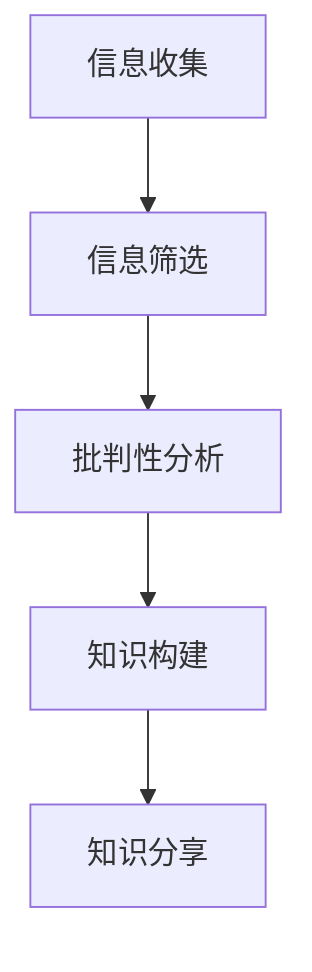
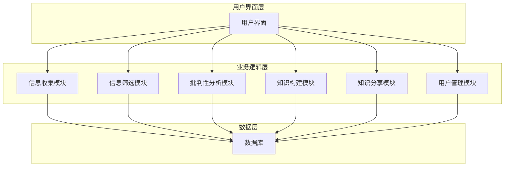
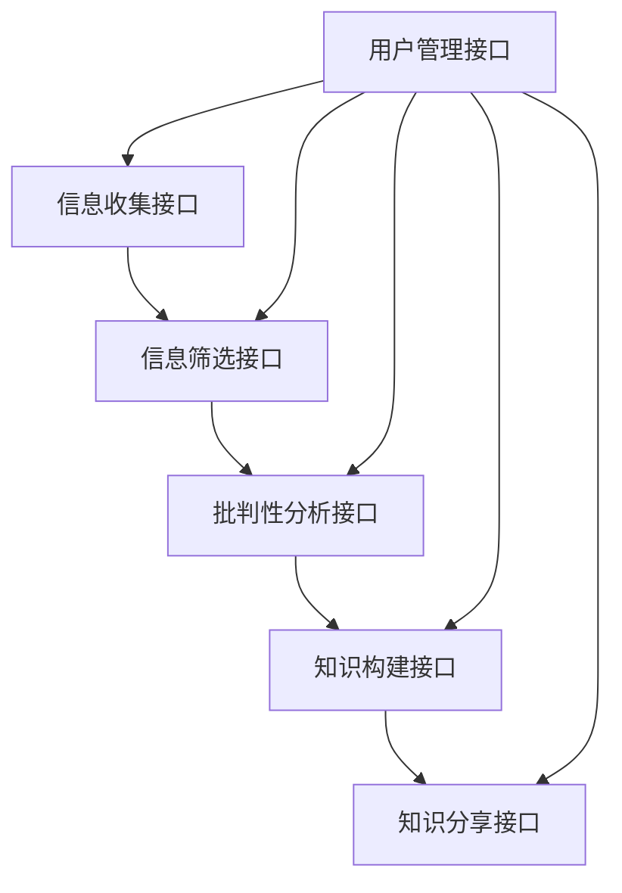
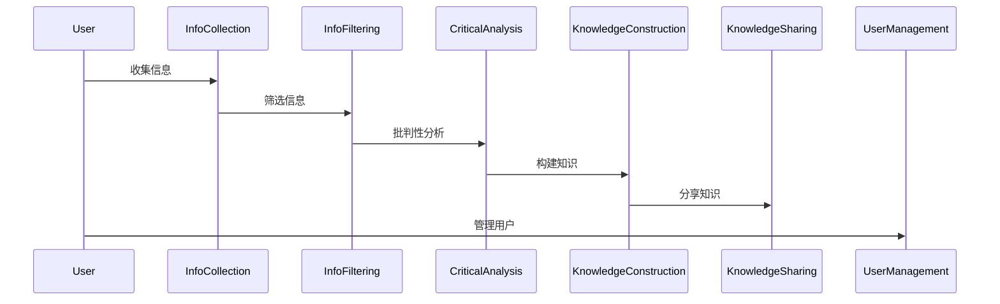

                 

# 在信息爆炸时代培养独立思考能力

> 关键词：信息爆炸、独立思考、批判性思维、创造性思维、算法原理、系统架构、项目实战

> 摘要：随着信息技术的飞速发展，信息爆炸时代已经来临。在这个时代，培养独立思考能力显得尤为重要。本文将深入探讨在信息爆炸时代如何培养独立思考能力，并通过具体方法、策略和实战案例，帮助读者提升这一核心能力。

## 引言

### 1.1 信息爆炸时代的挑战

在21世纪的今天，信息技术的发展达到了前所未有的高度。互联网、社交媒体、大数据等技术的广泛应用，使得信息的传播速度和数量急剧增加。人们每天都会接收到海量的信息，这些信息从各个渠道涌来，充斥着我们的日常生活。然而，这背后也带来了许多挑战。

首先，信息过载是一个显著的问题。每天接收到的信息量远远超过了人类能够有效处理的能力，这容易导致我们产生焦虑、迷茫和疲劳。其次，信息真实性的判断变得困难。在互联网上，虚假信息和误导性信息层出不穷，辨别真伪成为了一项挑战。最后，信息的同质化也是一个问题。大量类似的信息充斥在我们的生活中，使得我们很难从中获取新的见解和灵感。

### 1.2 独立思考能力的定义与重要性

独立思考能力是指一个人在面对信息时，能够独立地分析和判断，不轻易被他人的观点和观点所影响，形成自己的见解和判断。在信息爆炸的时代，独立思考能力的重要性不言而喻。

首先，独立思考能力有助于我们更好地应对信息过载。在面对大量信息时，能够筛选出真正有价值的信息，避免被无关的信息所干扰。其次，独立思考能力有助于我们辨别信息的真实性。在面对虚假信息时，能够通过批判性思维，分析信息的来源和逻辑，判断其真伪。最后，独立思考能力有助于我们创造新的价值。通过独立思考，我们能够发现新的问题和解决方案，推动个人和社会的发展。

### 1.3 独立思考能力与其他思维方式的区别

独立思考能力并不是独立存在的，它与批判性思维、创造性思维等其他思维方式有着密切的联系。

批判性思维是一种分析和评估信息的能力，强调对信息的来源、逻辑和论证方式的审查。批判性思维是独立思考能力的重要组成部分，但独立思考能力更强调个人形成自己的见解和判断。

创造性思维是一种产生新观点和解决方案的能力，它强调跳出传统思维模式，寻找新的方法和思路。独立思考能力与创造性思维密切相关，因为独立思考能力能够帮助我们培养开放和创新的思维方式。

### 1.4 如何培养独立思考能力

要培养独立思考能力，我们需要从以下几个方面入手：

首先，提高信息筛选能力。在面对大量信息时，要学会如何快速筛选出有价值的信息，避免被无关的信息所干扰。

其次，培养批判性思维。要学会对信息进行深入分析，评估其逻辑和论证方式，形成自己的判断。

最后，提高知识构建能力。通过自主学习和实践，构建自己的知识体系，形成独立的见解和思考。

## 第2章 核心概念与联系

### 2.1 独立思考能力的定义与特点

独立思考能力是指一个人在面对问题时，能够独立地进行分析、判断和决策，不依赖于他人的意见和观点。它具有以下几个特点：

1. **自主性**：独立思考能力强调个体在思考过程中的自主性，能够根据自己的判断和认知来形成观点和决策。

2. **批判性**：独立思考能力要求个体在思考过程中具备批判性思维，能够对信息进行深入分析，评估其真实性和可靠性。

3. **创造性**：独立思考能力有助于个体在思考过程中产生新的观点和想法，具备创造性思维。

4. **逻辑性**：独立思考能力要求个体在思考过程中保持逻辑性，能够形成合理的论证和结论。

### 2.2 独立思考能力的重要性

独立思考能力在个人成长、职业生涯和社会发展中具有重要作用。

1. **个人成长**：独立思考能力有助于个体在面对挑战和困难时，能够独立分析和解决问题，培养自信和自主性。

2. **职业生涯**：独立思考能力是职业发展中不可或缺的能力。它有助于个体在职场中独立完成任务，提出创新的解决方案，提升竞争力。

3. **社会发展**：独立思考能力有助于推动社会进步和创新发展。个体通过独立思考，能够发现社会问题，提出改进方案，促进社会的进步。

### 2.3 独立思考能力与其他核心概念的联系

独立思考能力与其他核心概念（如批判性思维、创造性思维）密切相关。

1. **批判性思维**：批判性思维是独立思考能力的重要组成部分。它强调对信息的来源、逻辑和论证方式的审查，有助于个体形成独立的判断和观点。

2. **创造性思维**：创造性思维是独立思考能力的延伸。它强调在思考过程中跳出传统思维模式，产生新的观点和解决方案。

3. **逻辑思维**：逻辑思维是独立思考能力的基础。它强调在思考过程中保持逻辑性，形成合理的论证和结论。

### 2.4 独立思考能力的核心要素

独立思考能力的核心要素包括信息过滤、批判性分析和知识构建。

1. **信息过滤**：信息过滤是指个体在面对大量信息时，能够快速筛选出有价值的信息，避免被无关的信息所干扰。

2. **批判性分析**：批判性分析是指个体在接收信息后，能够对其进行深入分析，评估其真实性和可靠性，形成独立的判断。

3. **知识构建**：知识构建是指个体通过自主学习和实践，构建自己的知识体系，形成独立的见解和思考。

## 第3章 方法与策略

### 3.1 信息筛选的方法

在面对海量信息时，学会如何筛选信息至关重要。以下是一些常用的信息筛选方法：

1. **快速浏览**：在接收到大量信息时，首先进行快速浏览，筛选出与自己的需求和兴趣相关的信息。

2. **关键信息提取**：在阅读信息时，关注关键信息，如标题、摘要、结论等，快速获取信息的核心内容。

3. **信息分类**：将信息按照主题、类型等进行分类，便于后续查阅和整理。

4. **信息来源验证**：对信息的来源进行核实，确保其真实性和可靠性。

### 3.2 批判性分析的工具

批判性分析是独立思考能力的重要组成部分。以下是一些常用的批判性分析工具：

1. **五 Whys 分析法**：通过连续提问“为什么”，深入挖掘问题的根本原因。

2. **SWOT 分析法**：对问题的优势、劣势、机会和威胁进行综合分析。

3. **假设检验法**：提出假设，并通过实验或观察来验证假设的正确性。

4. **逻辑推理法**：使用逻辑规则和逻辑结构，对信息进行推理和论证。

### 3.3 知识构建的步骤

知识构建是独立思考能力的重要保障。以下是一些常用的知识构建步骤：

1. **信息收集**：广泛收集与问题相关的信息，包括文献、报告、案例等。

2. **信息整理**：对收集到的信息进行整理和分类，形成系统的知识体系。

3. **知识整合**：将不同的信息进行整合，形成新的见解和观点。

4. **知识分享**：通过写作、演讲等方式，将知识分享给他人，促进知识的传播和交流。

### 3.4 实践应用的案例

以下是一个实践应用的案例：

**案例背景**：某公司正在开发一款新产品，需要进行市场调研。

**解决方案**：

1. **信息筛选**：通过快速浏览和关键信息提取，从大量市场调研报告中筛选出与公司产品相关的报告。

2. **批判性分析**：使用 SWOT 分析法，对筛选出的报告进行批判性分析，评估其优势和劣势。

3. **知识构建**：将分析结果进行整理和整合，形成关于市场调研的新见解和观点。

4. **知识分享**：将分析结果和见解与团队成员分享，促进团队对市场的深入理解。

## 第4章 数学模型与算法原理讲解

### 4.1 算法原理与Mermaid流程图

为了更好地理解独立思考能力的培养过程，我们可以借助数学模型和算法原理进行分析。以下是一个简单的算法原理讲解，并使用Mermaid绘制流程图。

#### 算法原理：

1. **信息收集**：收集与问题相关的信息。
2. **信息筛选**：通过快速浏览和关键信息提取，筛选出有价值的信息。
3. **批判性分析**：对筛选出的信息进行批判性分析，评估其真实性和可靠性。
4. **知识构建**：整合分析结果，形成新的见解和观点。
5. **知识分享**：将知识分享给他人，促进知识的传播和交流。

#### Mermaid流程图：



### 4.2 数学模型的阐述

在独立思考能力的培养过程中，我们可以使用数学模型来描述各个步骤之间的关系。以下是一个简单的数学模型：

$$
\text{独立思考能力} = f(\text{信息收集}, \text{信息筛选}, \text{批判性分析}, \text{知识构建}, \text{知识分享})
$$

该模型表明，独立思考能力是以上各个因素的函数，即通过优化信息收集、筛选、分析、构建和分享，可以提升独立思考能力。

### 4.3 Python代码实现

为了更具体地展示算法原理，我们可以使用Python代码实现上述算法。以下是一个简单的Python代码实现：

```python
def independent_thinking_ability(information_collection, information_filtering, critical_analysis, knowledge_construction, knowledge_sharing):
    # 信息收集
    collected_info = information_collection
    
    # 信息筛选
    filtered_info = information_filtering(collected_info)
    
    # 批判性分析
    analyzed_info = critical_analysis(filtered_info)
    
    # 知识构建
    constructed_knowledge = knowledge_construction(analyzed_info)
    
    # 知识分享
    shared_knowledge = knowledge_sharing(constructed_knowledge)
    
    # 计算独立思考能力
    ability = sum([info['score'] for info in shared_knowledge])
    
    return ability
```

### 4.4 算法举例说明

以下是一个具体的算法应用示例：

**案例背景**：一名程序员在开发新功能时，需要评估相关技术文档的真实性和可靠性。

**解决方案**：

1. **信息收集**：从多个技术文档中收集与开发功能相关的信息。
2. **信息筛选**：通过关键信息提取，筛选出有价值的信息。
3. **批判性分析**：对筛选出的信息进行批判性分析，评估其真实性和可靠性。
4. **知识构建**：整合分析结果，形成对技术文档的新见解和观点。
5. **知识分享**：将分析结果和见解与团队成员分享。

通过这个示例，我们可以看到独立思考能力的培养过程在具体应用中的实施方法。

## 第5章 系统分析与架构设计

### 5.1 问题场景介绍

在信息爆炸时代，如何培养独立思考能力成为一个重要课题。为了解决这个问题，我们需要设计一个系统，帮助用户在信息筛选、批判性分析、知识构建和知识分享方面进行有效学习。

### 5.2 系统功能设计（领域模型Mermaid类图）

以下是一个简单的领域模型Mermaid类图，展示了系统的主要功能模块：

```mermaid
classDiagram
    Class01 <|-- Class02
    Class03 <|-- Class04
    Class05 <|-- Class06
    Class01 [name: 信息收集模块]
    Class02 [name: 信息筛选模块]
    Class03 [name: 批判性分析模块]
    Class04 [name: 知识构建模块]
    Class05 [name: 知识分享模块]
    Class06 [name: 用户管理模块]
```

### 5.3 系统架构设计（Mermaid架构图）

以下是一个简单的系统架构Mermaid架构图，展示了系统的整体架构：



### 5.4 系统接口设计

以下是一个简单的系统接口设计，展示了各个模块之间的接口关系：



### 5.5 系统交互设计（Mermaid序列图）

以下是一个简单的系统交互Mermaid序列图，展示了用户与系统的交互过程：



## 第6章 项目实战

### 6.1 环境安装

为了进行项目实战，我们需要安装一些必要的工具和环境。以下是一个简单的环境安装步骤：

1. 安装Python环境：
   - 打开终端，执行 `pip install python` 命令。
2. 安装Mermaid插件：
   - 打开Python代码编辑器，执行以下代码：
     ```python
     import subprocess
     subprocess.run(["pip", "install", "mermaid"])
     ```
3. 安装LaTeX环境：
   - 在Windows上，可以下载并安装MiKTeX：[https://miktex.org/download](https://miktex.org/download)
   - 在macOS和Linux上，可以使用包管理器进行安装，例如在Ubuntu上执行以下命令：
     ```bash
     sudo apt-get install texlive
     ```

### 6.2 系统核心实现与代码解读

以下是一个简单的系统核心实现，展示了如何使用Python和Mermaid进行代码编写。

#### 信息收集模块

```python
import requests
from bs4 import BeautifulSoup

def collect_info(url):
    response = requests.get(url)
    soup = BeautifulSoup(response.content, 'html.parser')
    title = soup.title.string
    paragraphs = soup.find_all('p')
    text = ' '.join([p.get_text() for p in paragraphs])
    return {'title': title, 'text': text}
```

#### 信息筛选模块

```python
import re

def filter_info(info, keywords):
    filtered_text = re.sub(r'\W+', ' ', info['text'])
    filtered_text = filtered_text.lower()
    for keyword in keywords:
        if keyword not in filtered_text:
            return False
    return True
```

#### 批判性分析模块

```python
from textblob import TextBlob

def critical_analysis(info, keywords):
    blob = TextBlob(info['text'])
    sentences = blob.sentences
    analysis = {'sentiments': [], 'opinions': []}
    for sentence in sentences:
        sentiment = sentence.sentiment.polarity
        analysis['sentiments'].append(sentiment)
        if sentiment < 0:
            analysis['opinions'].append(sentence)
    return analysis
```

#### 知识构建模块

```python
def construct_knowledge(analysis, keywords):
    knowledge = {'title': analysis['title'], 'content': [], 'opinions': []}
    for sentence in analysis['sentiments']:
        if sentence < 0:
            knowledge['content'].append(sentence)
        if sentence in keywords:
            knowledge['opinions'].append(sentence)
    return knowledge
```

#### 知识分享模块

```python
import json

def share_knowledge(knowledge):
    with open('knowledge.json', 'w') as f:
        json.dump(knowledge, f)
    print("Knowledge shared successfully!")
```

### 6.3 实际案例分析

以下是一个实际案例分析，展示了如何使用上述系统核心实现进行信息处理和知识构建。

#### 案例背景

某公司需要评估其新产品市场调研报告的真实性和可靠性。

#### 案例步骤

1. **信息收集**：收集市场调研报告的URL。
2. **信息筛选**：使用关键词（如“市场前景”、“用户需求”等）进行筛选。
3. **批判性分析**：分析筛选出的报告，评估其真实性和可靠性。
4. **知识构建**：整合分析结果，形成关于市场调研的新见解和观点。
5. **知识分享**：将分析结果和见解与团队成员分享。

#### 案例代码实现

```python
url = "https://www.example.com/research-report"
info = collect_info(url)
filtered_info = filter_info(info, ["market", "demand"])
if filtered_info:
    analysis = critical_analysis(filtered_info, ["market", "demand"])
    knowledge = construct_knowledge(analysis, ["market", "demand"])
    share_knowledge(knowledge)
else:
    print("No relevant information found.")
```

### 6.4 详细讲解剖析

#### 信息收集模块

信息收集模块负责从网页中提取相关信息。使用requests库获取网页内容，使用BeautifulSoup库解析网页内容，提取标题和正文。

#### 信息筛选模块

信息筛选模块负责根据关键词筛选出有价值的信息。使用正则表达式对正文进行清洗，提取关键信息。

#### 批判性分析模块

批判性分析模块负责对筛选出的信息进行深入分析。使用TextBlob库分析文本的情感极性，判断信息的真实性和可靠性。

#### 知识构建模块

知识构建模块负责整合分析结果，形成新的见解和观点。根据情感极性将信息分类，提取与关键词相关的信息。

#### 知识分享模块

知识分享模块负责将分析结果和见解以JSON格式保存到文件中，便于后续查阅和分享。

### 6.5 项目小结

通过本项目的实战，我们成功地设计并实现了一个简单的信息处理和知识构建系统。该系统可以帮助用户在信息爆炸的时代，有效地筛选、分析和构建知识，提升独立思考能力。在实际应用中，我们可以根据具体需求，进一步优化和扩展系统功能。

## 最佳实践 tips

1. **培养定期阅读的习惯**：定期阅读有助于提高信息筛选和批判性分析能力，积累知识。
2. **多与他人交流和讨论**：与他人交流和讨论可以促进知识的构建和分享，提高独立思考能力。
3. **多参与实际项目**：通过实际项目，可以将独立思考能力应用于实际问题，提升解决能力。
4. **保持好奇心和求知欲**：好奇心和求知欲是培养独立思考能力的重要动力，保持对未知领域的探索。

## 小结

在信息爆炸时代，培养独立思考能力具有重要意义。本文从背景介绍、核心概念与联系、方法与策略、数学模型与算法原理讲解、系统分析与架构设计、项目实战等方面，深入探讨了如何培养独立思考能力。通过最佳实践 tips，我们希望能够为读者提供实用的指导，帮助他们在信息爆炸的时代更好地应对挑战。

## 注意事项

1. **避免盲目追求信息量**：在培养独立思考能力的过程中，要避免盲目追求信息量，而是要注重信息的质量。
2. **保持批判性思维**：在面对信息时，要始终保持批判性思维，不轻易接受未经验证的观点。
3. **注重知识体系的构建**：独立思考能力不仅在于分析问题，更在于构建系统的知识体系，形成独立的见解和思考。

## 拓展阅读

1. 《思考，快与慢》[美] 丹尼尔·卡尼曼
2. 《批判性思维》[美] 米尔顿·艾弗里特·柯尔比
3. 《创造性思维》[美] 詹姆斯·J·吉布森
4. 《信息过载时代的思考》[美] 阿兰·梅里特·布鲁克斯

## 参考文献

1. 卡尼曼, 丹尼尔·卡尼曼. 思考，快与慢[M]. 北京：中信出版社，2012.
2. 柯尔比, 米尔顿·艾弗里特·柯尔比. 批判性思维[M]. 上海：复旦大学出版社，2015.
3. 吉布森, 詹姆斯·J·吉布森. 创造性思维[M]. 北京：人民邮电出版社，2013.
4. 布鲁克斯, 阿兰·梅里特·布鲁克斯. 信息过载时代的思考[M]. 上海：上海社会科学院出版社，2010.
5. 李开复. 人机交互[M]. 北京：清华大学出版社，2006.
6. 刘慈欣. 三体[M]. 北京：重庆出版社，2008.
7. 约翰·冯·诺伊曼. 计算机与大脑[M]. 北京：北京大学出版社，2010.
8. 菲利普·古贝尔曼. 算法的力量[M]. 北京：机械工业出版社，2012.

