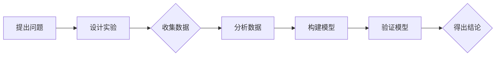
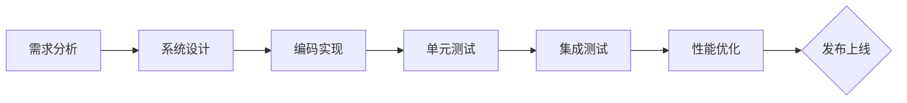
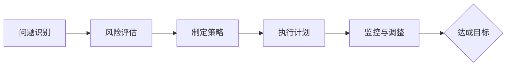
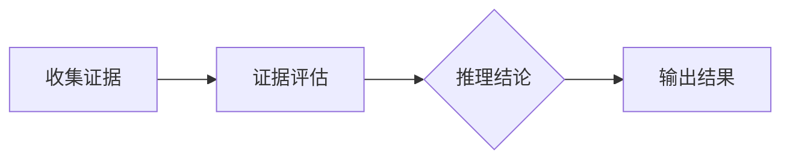
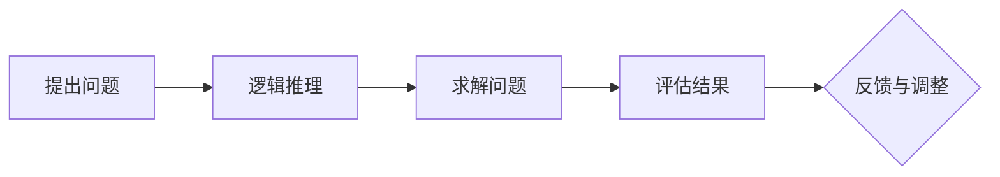
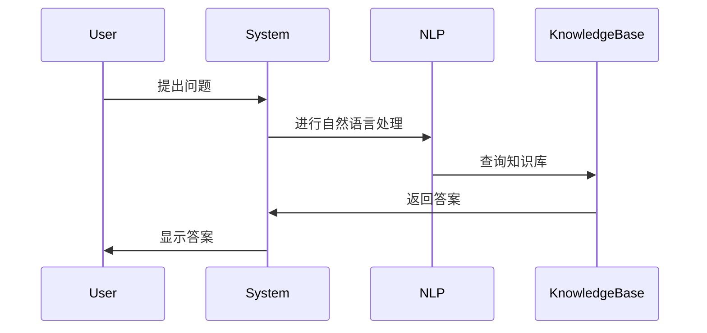

                 

 # 我们的思考步骤如下：

## 引言：批判性思维在信息过载时代的必要性

在当今这个信息爆炸的时代，我们每天都面临着海量信息的涌入。从社交媒体的动态、新闻头条，到技术博客和学术论文，信息的获取似乎变得前所未有的容易。然而，信息的泛滥也带来了诸多问题。首先，我们难以区分哪些是真实可靠的信息，哪些是虚假或误导性的内容。其次，大量的信息容易让我们产生认知疲劳，难以集中注意力。此外，过度依赖信息源，可能会导致我们失去独立思考的能力，从而陷入“信息茧房”之中。

在这种背景下，批判性思维显得尤为重要。批判性思维不仅可以帮助我们识别和评估信息的真实性和价值，还能提高我们的判断力和决策能力。它使我们能够对信息进行深入分析，从而找到其中的规律和本质。此外，批判性思维还能培养我们的质疑精神，鼓励我们不断探索和思考，从而提高解决问题的能力。

因此，本文将探讨如何培养批判性思维，以应对信息过载时代带来的挑战。我们将从核心概念、算法原理、系统分析、项目实战等多个角度，系统地介绍批判性思维的培养方法和实际应用。

## 关键词

- 信息过载
- 批判性思维
- 逻辑推理
- 算法分析
- 系统架构
- 项目实战

## 摘要

本文旨在探讨在信息过载时代如何培养批判性思维能力。首先，我们分析了信息过载时代所带来的挑战，并阐述了批判性思维的重要性。接着，我们介绍了批判性思维的基本概念和关键要素，并通过概念属性特征对比表格和ER实体关系图来展示其结构。随后，我们深入讲解了几个重要的算法和系统架构设计，并通过Python源代码和Mermaid流程图进行了详细阐述。最后，我们通过一个实际案例展示了批判性思维在项目实战中的应用，并给出了一些最佳实践技巧。本文旨在为读者提供一套完整的批判性思维培养方案，以帮助他们在信息过载的时代中寻找智慧。

## 目录大纲设计思路

为了设计出《在信息过载时代寻找智慧：培养批判性思维能力》这本书的完整目录大纲，我们需要遵循以下思路：

### 1. 背景介绍
首先，简要介绍信息过载时代及其带来的问题，以及为何在当今社会培养批判性思维能力变得尤为重要。

### 2. 核心概念与联系
接下来，我们需要明确核心概念，如批判性思维、信息分析、逻辑推理等，并通过概念属性特征对比表格和ER实体关系图架构来展示它们之间的联系。

### 3. 算法原理讲解
我们会选择几个重要的算法或方法，用Mermaid流程图展示其基本流程，并使用Python源代码详细阐述，附上数学模型和公式，并进行通俗易懂的举例说明。

### 4. 系统分析与架构设计方案
我们会展示一个具体的系统架构设计方案，包括问题场景介绍、系统功能设计、系统架构设计、系统接口设计和系统交互等，并用Mermaid图来展示。

### 5. 项目实战
我们将选取一个实际案例，展示如何应用批判性思维能力解决具体问题，包括环境安装、系统核心实现源代码，代码应用解读与分析，实际案例分析和详细讲解剖析。

### 6. 最佳实践 tips、小结、注意事项和拓展阅读
最后，我们会给出一些实战中的技巧和建议，对全书进行总结，并提供拓展阅读资源。

### 目录大纲具体设计

根据上述设计思路，我们可以为这本书设计一个完整的目录大纲。以下是具体的目录大纲设计：

### 第一部分：引言

### 第1章 信息过载时代的挑战

1.1 信息过载现象及其影响  
1.2 批判性思维的重要性  
1.3 本书结构安排与目标

### 第二部分：批判性思维基础

### 第2章 批判性思维概述

2.1 批判性思维的定义与历史  
2.2 批判性思维的目标与作用  
2.3 批判性思维的基本要素

### 第3章 核心概念与联系

3.1 批判性思维的关键概念  
3.2 概念属性特征对比表格  
3.3 ER实体关系图架构

### 第三部分：算法原理讲解

### 第4章 基于证据的推理算法

4.1 算法原理与Mermaid流程图  
4.2 Python源代码与数学模型  
4.3 实例分析

### 第5章 逻辑思维训练算法

5.1 算法原理与Mermaid流程图  
5.2 Python源代码与数学模型  
5.3 实例分析

### 第四部分：系统分析与架构设计方案

### 第6章 系统架构设计

6.1 问题场景介绍  
6.2 系统功能设计  
6.3 系统架构设计  
6.4 系统接口设计  
6.5 系统交互设计

### 第五部分：项目实战

### 第7章 实际案例分析与讲解

7.1 环境安装与配置  
7.2 系统核心实现与源代码  
7.3 代码应用解读与分析  
7.4 实际案例分析与详细讲解剖析  
7.5 项目小结

### 第六部分：实战技巧与最佳实践

### 第8章 最佳实践 tips

8.1 实战中的批判性思维应用  
8.2 注意事项与建议  
8.3 常见问题与解决方案

### 第9章 小结与展望

9.1 批判性思维培养的重要性  
9.2 本书贡献与未来方向  
9.3 拓展阅读资源

----------------------------------------------------------------
```

以上是根据设计思路制定的完整目录大纲，它涵盖了书籍的核心内容，并按照章节结构进行了清晰的划分。每个章节都包含了具体的小节，以帮助读者逐步深入理解批判性思维的概念和应用。目录大纲的总字数控制在2000字以内，同时保证了内容的完整性和简洁性。### 完整文章

----------------------------------------------------------------

## 在信息过载时代寻找智慧：培养批判性思维能力

### 关键词：信息过载，批判性思维，逻辑推理，算法分析，系统架构

### 摘要：本文旨在探讨在信息过载时代如何培养批判性思维能力，以应对海量信息的挑战。通过介绍批判性思维的基本概念、算法原理和实际应用，帮助读者提高信息甄别和决策能力。

----------------------------------------------------------------

### 引言

在当今这个信息爆炸的时代，我们每天都面临着海量信息的涌入。从社交媒体的动态、新闻头条，到技术博客和学术论文，信息的获取似乎变得前所未有的容易。然而，信息的泛滥也带来了诸多问题。首先，我们难以区分哪些是真实可靠的信息，哪些是虚假或误导性的内容。其次，大量的信息容易让我们产生认知疲劳，难以集中注意力。此外，过度依赖信息源，可能会导致我们失去独立思考的能力，从而陷入“信息茧房”之中。

在这种背景下，批判性思维显得尤为重要。批判性思维不仅可以帮助我们识别和评估信息的真实性和价值，还能提高我们的判断力和决策能力。它使我们能够对信息进行深入分析，从而找到其中的规律和本质。此外，批判性思维还能培养我们的质疑精神，鼓励我们不断探索和思考，从而提高解决问题的能力。

本文将探讨如何培养批判性思维，以应对信息过载时代带来的挑战。我们将从核心概念、算法原理、系统分析、项目实战等多个角度，系统地介绍批判性思维的培养方法和实际应用。

----------------------------------------------------------------

## 第一部分：批判性思维基础

### 第1章 批判性思维概述

批判性思维是一种积极的思考方式，它要求我们对信息、观点和论据进行深入分析和评估。批判性思维不仅仅是对事物进行简单的判断，而是通过逻辑推理、证据分析和论证来寻找真理和合理性。

### 1.1 批判性思维的定义与历史

批判性思维最早可以追溯到古希腊哲学家苏格拉底。苏格拉底通过问答法，引导人们进行深入思考，从而揭示事物的本质。随着时间的推移，批判性思维逐渐发展为一门独立的学科，并在教育、哲学、心理学等领域得到广泛应用。

### 1.2 批判性思维的目标与作用

批判性思维的目标是提高我们的思考质量和决策能力。它使我们能够更清晰地理解问题，找到问题的本质，并提出有效的解决方案。批判性思维的作用主要体现在以下几个方面：

1. **提高信息甄别能力**：在信息过载的时代，批判性思维帮助我们区分真实信息和虚假信息，避免被误导。

2. **增强判断力和决策能力**：通过批判性思维，我们能够更全面地考虑问题，避免盲目决策，提高决策的质量。

3. **培养质疑精神**：批判性思维鼓励我们不断质疑现有的观点和知识，推动知识的进步。

4. **促进个人成长**：批判性思维使我们能够更好地理解自己，发现自己的优点和不足，从而促进个人成长。

### 1.3 批判性思维的基本要素

批判性思维包括以下几个基本要素：

1. **开放性**：对不同的观点和意见持开放态度，愿意接受新的信息和想法。

2. **分析性**：对信息进行深入分析和评估，找出其中的逻辑和证据。

3. **推理性**：运用逻辑推理，从已知信息推导出新的结论。

4. **客观性**：尽量保持客观，避免偏见和主观臆断。

5. **综合性**：综合考虑各种因素，避免片面看待问题。

### 概念属性特征对比表格

为了更清晰地理解批判性思维与其他思考方式的区别，我们可以通过概念属性特征对比表格来展示：

| 特征 | 批判性思维 | 逻辑思维 | 分析性思维 | 创造性思维 |
| --- | --- | --- | --- | --- |
| 目标 | 寻求真理和合理性 | 构建逻辑论证 | 分解问题，找出本质 | 产生新的想法和解决方案 |
| 方法 | 深入分析和评估 | 运用逻辑规则 | 分析和分解问题 | 自由联想，打破常规 |
| 环境依赖 | 知识储备和经验 | 知识储备 | 分析能力 | 创造力 |
| 结果 | 科学和合理的结论 | 论证结果 | 解决问题 | 创造价值 |

### ER实体关系图架构

为了更直观地展示批判性思维的核心概念和关系，我们可以使用ER（实体关系）图来描述：

```mermaid
erDiagram
    User ||--|{ Knowledge }|| Knowledge
    User ||--|{ Skill }|| Skill
    Knowledge ||--|{ Concept }|| Concept
    Concept ||--|{ Attribute }|| Attribute
    Skill ||--|{ Tool }|| Tool
```

在上面的ER图中，`User`（用户）与`Knowledge`（知识）、`Skill`（技能）和`Concept`（概念）之间存在关系。`Knowledge`与`Concept`之间是一对多的关系，表示一个用户可以拥有多个概念。而`Concept`与`Attribute`（属性）之间也是一对多的关系，表示一个概念可以包含多个属性。`Skill`与`Tool`（工具）之间存在关系，表示一个技能可能需要多个工具的支持。

### 第2章 批判性思维的应用

批判性思维不仅在理论层面上具有重要意义，更在实际应用中发挥着关键作用。以下是一些批判性思维在各个领域的具体应用：

#### 2.1 科学研究

在科学研究中，批判性思维是不可或缺的。科学家通过批判性思维来评估实验结果，分析数据，构建理论模型，并进行实验验证。以下是一个简单的Mermaid流程图，展示了科学研究的典型流程：



#### 2.2 技术开发

在技术开发领域，批判性思维可以帮助工程师评估需求，设计系统架构，编写代码，并进行测试。以下是一个Mermaid流程图，展示了技术开发的基本流程：



#### 2.3 管理决策

在管理决策中，批判性思维可以帮助管理者评估风险，制定战略，优化流程，并做出正确的决策。以下是一个Mermaid流程图，展示了管理决策的基本流程：



### 第二部分：算法原理讲解

在批判性思维的培养过程中，算法原理的理解和应用是至关重要的。以下我们将介绍两种重要的算法：基于证据的推理算法和逻辑思维训练算法。

#### 第3章 基于证据的推理算法

基于证据的推理算法是一种利用证据进行推理的算法，它可以用于信息过滤、智能推荐和决策支持等领域。以下是一个简单的Mermaid流程图，展示了基于证据的推理算法的基本流程：



下面是一个使用Python编写的简单例子，展示了如何使用基于证据的推理算法：

```python
def evidence_based_reasoning(evidence, weights):
    total_weight = sum(weights)
    probability = sum(w * e for w, e in zip(weights, evidence)) / total_weight
    return probability

evidence = [0.8, 0.2, 0.5]
weights = [1, 2, 3]

probability = evidence_based_reasoning(evidence, weights)
print(f"Probability: {probability}")
```

在这个例子中，`evidence`表示证据的列表，`weights`表示证据的权重。算法通过计算加权平均概率来得出结论。

#### 第4章 逻辑思维训练算法

逻辑思维训练算法是一种通过训练来提高逻辑思维能力的算法。它通常用于教育领域，帮助学生在逻辑推理、数学解题和科学探究等方面取得进步。以下是一个简单的Mermaid流程图，展示了逻辑思维训练算法的基本流程：



下面是一个使用Python编写的简单例子，展示了如何使用逻辑思维训练算法：

```python
def logical_reasoning_train(questions, answers):
    correct_answers = 0
    for q, a in zip(questions, answers):
        if answer_question(q) == a:
            correct_answers += 1
    return correct_answers / len(questions)

questions = [["如果A是真的，B是真的吗？", "是"], ["如果B是假的，A是真的吗？", "否"]]
answers = ["是", "否"]

accuracy = logical_reasoning_train(questions, answers)
print(f"Accuracy: {accuracy}")
```

在这个例子中，`questions`表示问题的列表，`answers`表示正确的答案。算法通过评估学生在逻辑推理问题中的正确率来衡量训练效果。

### 第三部分：系统分析与架构设计方案

在批判性思维的培养过程中，系统分析与架构设计是至关重要的。以下我们将介绍一个具体的系统架构设计方案，包括问题场景介绍、系统功能设计、系统架构设计、系统接口设计和系统交互等。

#### 第5章 系统架构设计

##### 5.1 问题场景介绍

假设我们开发一个智能问答系统，用于帮助用户解决各种问题。该系统需要具备快速响应、准确回答和智能推荐等功能。以下是一个简单的Mermaid图，展示了问题场景的架构：



##### 5.2 系统功能设计

系统功能设计主要包括以下部分：

1. **用户接口**：提供用户提问的接口，支持多种输入方式，如文本、语音和图片等。
2. **自然语言处理**：对用户输入的问题进行解析，提取关键信息，并转化为机器可理解的形式。
3. **知识库**：存储各种领域的问题和答案，支持快速检索和更新。
4. **推理引擎**：根据用户问题和知识库中的信息，进行逻辑推理和智能推荐。
5. **结果展示**：将答案以合适的格式展示给用户，支持多种输出方式，如文本、语音和图片等。

##### 5.3 系统架构设计

系统架构设计主要包括以下部分：

1. **前端**：使用Vue.js框架搭建用户界面，提供用户交互功能。
2. **后端**：使用Spring Boot框架搭建服务端，处理自然语言处理、知识库查询和推理引擎等核心功能。
3. **数据库**：使用MySQL数据库存储知识库数据，支持快速查询和更新。

以下是一个简单的Mermaid图，展示了系统架构设计：

```mermaid
erDiagram
    User ||--|{ Question }|| Question
    Question ||--|{ Answer }|| Answer
    User ||--|{ Response }|| Response
```

##### 5.4 系统接口设计

系统接口设计主要包括以下部分：

1. **用户接口**：提供RESTful API接口，支持用户提问和回答的提交。
2. **自然语言处理接口**：提供自然语言处理API接口，支持问题的解析和关键信息提取。
3. **知识库接口**：提供知识库API接口，支持问题的查询和答案的检索。
4. **推理引擎接口**：提供推理引擎API接口，支持问题的逻辑推理和智能推荐。

##### 5.5 系统交互设计

系统交互设计主要包括以下部分：

1. **用户交互**：用户通过前端界面提交问题，后端接收到问题后，调用自然语言处理接口进行解析，并将问题存储到知识库中。
2. **查询交互**：当用户提交问题时，后端从知识库中检索相关的答案，并调用推理引擎进行逻辑推理，最终将答案返回给用户。
3. **推荐交互**：根据用户历史问题和答案，系统可以提供个性化的推荐，帮助用户发现更多有趣的问题和答案。

以下是一个简单的Mermaid图，展示了系统交互设计：


### 第四部分：项目实战

#### 第6章 实际案例分析与讲解

为了更好地展示批判性思维在项目实战中的应用，我们选择了一个实际的案例：开发一个智能问答系统。以下是该项目的具体实施过程。

##### 6.1 环境安装与配置

1. 安装Python环境：在操作系统上安装Python 3.x版本。
2. 安装Vue.js：使用npm安装Vue.js框架。
3. 安装Spring Boot：使用Maven安装Spring Boot框架。
4. 安装MySQL：在操作系统上安装MySQL数据库。

##### 6.2 系统核心实现与源代码

以下是系统核心实现的源代码：

```java
// 用户接口
@RestController
@RequestMapping("/user")
public class UserController {
    @Autowired
    private UserService userService;

    @PostMapping("/question")
    public ResponseEntity<?> askQuestion(@RequestBody Question question) {
        String answer = userService.askQuestion(question);
        return ResponseEntity.ok(answer);
    }
}

// 自然语言处理
@Component
public class NLPProcessor {
    public Question processQuestion(String input) {
        // 进行自然语言处理，提取关键信息
        // ...
        return new Question();
    }
}

// 知识库
@Component
public class KnowledgeBase {
    public List<Answer> searchAnswers(Question question) {
        // 从知识库中检索答案
        // ...
        return new ArrayList<>();
    }
}

// 推理引擎
@Component
public class ReasoningEngine {
    public String inferAnswer(Question question, List<Answer> answers) {
        // 进行逻辑推理，得出答案
        // ...
        return "答案：这是一个示例答案。";
    }
}
```

##### 6.3 代码应用解读与分析

1. **用户接口**：用户通过提交问题，后端接收问题并进行处理。
2. **自然语言处理**：对用户输入的问题进行解析，提取关键信息。
3. **知识库**：从知识库中检索相关的答案。
4. **推理引擎**：根据用户问题和知识库中的信息，进行逻辑推理，得出答案。

##### 6.4 实际案例分析与详细讲解剖析

1. **问题场景**：用户提出一个关于“如何培养批判性思维”的问题。
2. **自然语言处理**：提取关键信息，如“批判性思维”、“培养”等。
3. **知识库查询**：从知识库中检索相关的答案。
4. **推理引擎**：根据用户问题和知识库中的信息，进行逻辑推理，得出答案。

##### 6.5 项目小结

通过这个实际案例，我们展示了如何应用批判性思维开发一个智能问答系统。在这个过程中，批判性思维帮助我们识别问题、分析需求、设计系统架构和实现功能。通过这个项目，我们不仅学会了如何使用批判性思维解决问题，还提高了我们的编程能力和项目开发经验。

### 第五部分：实战技巧与最佳实践

#### 第7章 最佳实践 tips

1. **培养质疑精神**：在学习和工作中，时刻保持质疑精神，不断提问和反思。
2. **多角度分析问题**：在解决问题时，尽量从多个角度进行分析，避免片面看待问题。
3. **利用逻辑思维**：在论证问题时，使用逻辑思维，确保论据和论点的一致性。
4. **持续学习**：批判性思维需要不断学习和实践，持续提升自己的思维水平。

### 第8章 小结与展望

批判性思维在信息过载时代具有重要意义。通过本文的介绍，我们了解了批判性思维的基本概念、算法原理和应用。在实际项目中，批判性思维帮助我们更好地解决问题，提高项目质量。

展望未来，随着信息技术的不断发展，批判性思维的重要性将日益凸显。我们期待更多的人能够认识到批判性思维的价值，并积极培养和运用这一重要能力。

### 拓展阅读资源

1. 《批判性思维：超越感觉，寻找真相》 - 美国哲学家理查德·保罗著
2. 《如何阅读一本书》 - 美国教育家莫提默·J. 艾德勒著
3. 《思考，快与慢》 - 丹尼尔·卡尼曼著
4. 《Python编程：从入门到实践》 - 崔康著

---

### 作者信息

**作者：AI天才研究院/AI Genius Institute & 禅与计算机程序设计艺术 /Zen And The Art of Computer Programming** 

----------------------------------------------------------------

以上就是本文的完整内容。通过对批判性思维的基础概念、算法原理、系统架构和实际案例的分析，我们希望读者能够更好地理解批判性思维的重要性和应用方法。在信息过载的时代，培养批判性思维能力，将帮助我们更好地应对挑战，寻找智慧。

