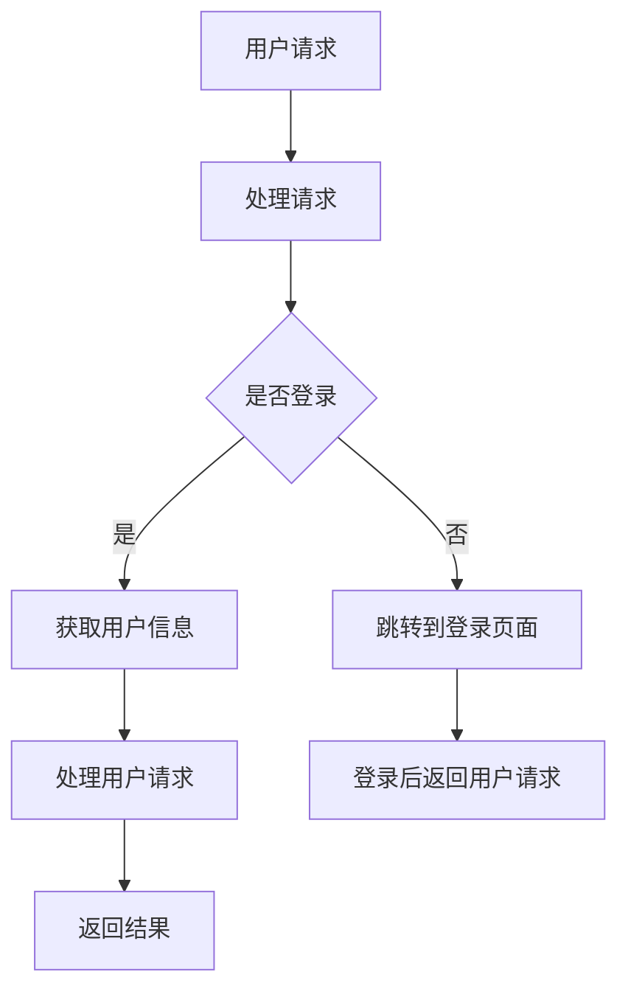

                 

### 引言

在当今全球化迅速发展的时代，保持本土特色与文化认同面临着前所未有的挑战。全球化不仅改变了经济、政治和社会的格局，也对文化产生了深远的影响。在这个背景下，如何在全球化的浪潮中保持本土特色，如何处理文化认同的挑战，成为了亟待解决的问题。

#### 1.1 问题背景

全球化进程始于20世纪中叶，随着信息技术和交通网络的快速发展，全球各地的人们、文化和商品日益紧密地连接在一起。这种全球化的趋势不仅促进了国际贸易和资本流动，也带来了文化交流和融合。然而，这种文化交融同时也带来了一系列问题，比如文化同质化、本土文化的失落、文化认同感的减弱等。

#### 1.2 问题描述

文化认同是指个体或群体对其所属文化的认同和归属感。在全球化背景下，文化认同面临着以下挑战：

- **文化同质化**：全球化带来了文化融合，但有时也导致了文化同质化，本土特色逐渐被削弱。
- **文化冲突**：不同文化之间的交流和碰撞有时会导致文化冲突，加剧了文化认同的困境。
- **文化迷失**：年轻一代在某些情况下可能会因为全球化而迷失自己的文化身份，对本土文化缺乏认同感。

#### 1.3 问题解决

解决全球化背景下的文化认同挑战需要多方面的努力：

- **教育和宣传**：通过教育和宣传加强文化认同感，使人们更加了解和珍视本土文化。
- **文化保护**：采取措施保护本土文化遗产，防止文化消亡。
- **文化创新**：在保持本土特色的同时，通过文化创新使其与时俱进，增强其吸引力和生命力。

#### 1.4 边界与外延

本文主要探讨全球化背景下保持本土特色与文化认同的挑战，分析其重要性和影响。文章将从以下几个方面展开讨论：

1. 全球化进程对文化认同的影响
2. 保持本土特色的重要性
3. 文化认同与经济发展的关系
4. 文化传承与创新
5. 实例研究
6. 结论与展望

通过这些讨论，本文旨在为读者提供一个全面、深入的视角，以更好地理解全球化背景下的文化认同挑战，并探索保持本土特色的可能途径。

### 全球化背景下的文化认同挑战

全球化进程对文化认同的影响是复杂而多方面的。随着全球化的不断深入，文化认同面临的挑战日益凸显。以下我们将具体分析全球化进程对文化认同的影响、全球化与本土文化冲突以及文化认同的挑战与机遇。

#### 2.1 全球化进程对文化认同的影响

全球化带来了前所未有的文化交流机会，使不同文化之间得以相互了解和融合。然而，这种融合也带来了一定的负面影响。一方面，全球化促进了文化的多样性和丰富性，使得人们能够接触到更多的文化现象和价值观；另一方面，全球化也导致了一种潜在的文化同质化趋势。

**文化同质化**：全球化过程中，一些强势文化，如西方文化，由于其在经济、科技、媒体等方面的优势地位，对其他文化产生了强烈的冲击。这种文化冲击在一定程度上导致了本土文化的同质化，使本土文化逐渐失去了原有的特色和魅力。例如，许多发展中国家在全球化过程中，为了迎合国际市场的需求，开始采用西方的商业模式、消费习惯和价值观念，从而导致本土文化的消解。

**文化多样性的减少**：全球化也可能导致文化多样性的减少。在某些情况下，全球化进程中的文化融合并不是一种平等的双向交流，而是一种单向的文化渗透。强势文化通过经济、政治和科技手段，将其价值观和生活方式强加给其他文化，导致一些弱势文化逐渐消失。这种文化多样性的减少，不仅削弱了文化认同，也使人类失去了宝贵的文化遗产。

#### 2.2 全球化与本土文化冲突

全球化与本土文化的冲突是文化认同面临的另一个重大挑战。全球化进程中的文化交融和融合，往往伴随着文化的碰撞和冲突。这种冲突不仅体现在不同文化之间的价值观、习俗和信仰上，也体现在文化身份的认同上。

**文化价值观的冲突**：全球化带来了不同文化之间的价值观碰撞。例如，在消费文化盛行的今天，西方的拜金主义、个人主义和物质主义观念在全球范围内传播，与一些传统社会的集体主义、家庭观念和宗教信仰形成了鲜明对比。这种文化价值观的冲突，往往会导致文化认同的混乱和矛盾。

**文化习俗和信仰的冲突**：全球化也带来了不同文化习俗和信仰的冲突。例如，在某些国家，传统宗教和习俗受到西方文化的冲击，导致信徒减少，宗教活动减少。这种冲突不仅影响到个体的精神生活，也对整个社会的文化认同产生了影响。

**文化身份的认同**：全球化进程中的文化冲突，还涉及到文化身份的认同问题。在某些情况下，全球化可能导致本土文化的边缘化，使个体或群体失去对本土文化的认同感。例如，在移民社会中，一些人可能因为对本土文化的陌生和疏离，而倾向于接受外来文化，从而导致本土文化的认同危机。

#### 2.3 文化认同的挑战与机遇

尽管全球化对文化认同带来了诸多挑战，但它同时也为文化认同带来了新的机遇。

**文化交流与融合**：全球化促进了不同文化之间的交流与融合，为文化认同提供了新的动力。通过文化交流，个体可以更好地了解和认同其他文化，从而增强文化认同的多样性。例如，通过全球化的文化交流，许多年轻人开始关注和认同自己祖先的文化，从而增强了他们对本土文化的认同感。

**文化创新与传承**：全球化也为文化创新和传承提供了新的机遇。在全球化的背景下，文化不再是一种静止不变的存在，而是可以随着时代的变化而不断创新和发展的。例如，一些传统艺术形式，如中国书法和京剧，通过现代科技手段和新的表现形式，得到了新的生命力和传播力。

**文化软实力的提升**：全球化还有助于提升文化软实力。在全球化的今天，文化不再是国与国之间的界限，而是成为了一种跨国界的软实力。一个国家或地区的文化软实力，不仅关系到其国际形象，也关系到其经济、科技和政治的发展。因此，保持本土特色和文化认同，对于提升文化软实力具有重要意义。

总之，全球化进程对文化认同带来了挑战，但也为文化认同提供了新的机遇。在面对全球化背景下的文化认同挑战时，我们需要既要保护本土文化，又要促进文化交流与融合，以实现文化认同的持续发展。

### 保持本土特色的重要性

在全球化的浪潮中，保持本土特色对于文化认同的构建和可持续发展具有重要意义。以下我们将探讨本土特色的价值、保持本土特色对文化认同的积极影响以及实现保持本土特色的策略与方法。

#### 3.1 本土特色的价值

**文化传承与历史记忆**：本土特色是民族文化传承的重要组成部分，它承载着历史的记忆和文化的精髓。通过本土特色，人们可以更好地了解自己的文化根源，从而增强文化认同感。例如，中国传统节日如春节、端午节等，不仅具有丰富的文化内涵，还凝聚了人们对传统文化的热爱和尊重。

**文化多样性与丰富性**：本土特色是文化多样性的体现，它丰富了人类文化的内涵。在全球化的背景下，保持本土特色有助于维护文化多样性，防止文化同质化。例如，世界各地不同的饮食文化、服饰风格、建筑特色等，都是文化多样性的重要组成部分。

**文化自信与自我认同**：本土特色是文化自信的来源，它帮助个体和群体建立自我认同。在全球化过程中，保持本土特色有助于人们保持对自身文化的信心，从而在面对外来文化时保持独立和自主。例如，许多国家和地区的民族文化运动，都是基于对本土文化的自信和热爱。

**经济价值与旅游资源**：本土特色具有巨大的经济价值，尤其是作为旅游资源。许多地方特色文化，如地方戏曲、民俗活动、传统手工艺等，都是吸引游客的重要因素。这些旅游资源的开发，不仅有助于经济增长，还能提升文化认同感。

#### 3.2 保持本土特色对文化认同的积极影响

**增强文化认同感**：保持本土特色有助于增强个体和群体的文化认同感。通过熟悉和认同本土文化，人们能够更好地理解和接受自己的文化身份，从而减少文化认同的困惑和矛盾。

**促进文化交流与融合**：保持本土特色并不意味着排斥外来文化，而是通过本土特色与其他文化的对话和融合，促进文化的发展和进步。这种交流和融合，不仅有助于丰富本土文化，也能使外来文化更好地融入本土文化。

**提升文化创新能力**：在保持本土特色的基础上，通过文化创新，可以激发文化的活力和创造力。文化创新不仅能够使本土文化与时俱进，也能为全球文化的发展贡献独特的智慧和经验。

**增强文化自信心**：保持本土特色有助于增强文化自信心，使人们在全球化背景下更加自信地展示和传播自己的文化。这种自信心不仅体现在文化领域，也能延伸到经济、科技和政治等其他领域。

#### 3.3 保持本土特色的策略与方法

**加强文化教育**：通过加强文化教育，提高人们对本土文化的了解和认同。例如，在学校课程中增加本土文化的内容，举办文化展览和活动，使更多的人了解和喜爱本土文化。

**保护文化遗产**：保护文化遗产是保持本土特色的重要手段。例如，修复古建筑、保护传统手工艺、收集和保存民族音乐和文学等，都是保护文化遗产的有效途径。

**促进文化创新**：在保持本土特色的基础上，鼓励文化创新，使本土文化与时俱进。例如，通过现代科技手段，将传统艺术形式进行数字化保护和传播；通过文化融合，创造新的文化产品和服务。

**提升文化软实力**：通过提升文化软实力，增强本土文化在全球范围内的吸引力和影响力。例如，通过文化交流与合作，提升本土文化的国际形象；通过文化输出，增强本土文化在国际市场的影响力。

总之，保持本土特色在全球化的背景下具有重要意义。通过加强文化教育、保护文化遗产、促进文化创新和提升文化软实力，我们可以更好地保持本土特色，增强文化认同，实现文化的可持续发展。

### 文化认同与经济发展的关系

文化认同与经济发展之间存在着紧密的联系，二者相互影响、相互促进。以下我们将探讨文化认同对经济发展的影响、经济发展对文化认同的反馈以及如何在保持文化认同的同时实现经济发展的平衡。

#### 4.1 文化认同对经济发展的影响

**文化认同激发经济活力**：文化认同能够激发人们对自己文化的自豪感和归属感，这种情感有助于激发人们的创新精神和创业热情。例如，许多成功的创业者都是基于对自己文化的认同，将其融入到产品和品牌中，从而赢得了市场认可。例如，日本文化产业在保持本土特色的同时，通过创新和国际化，取得了巨大的经济成功。

**文化认同影响消费行为**：文化认同会直接影响消费者的消费行为和偏好。消费者往往倾向于购买与其文化认同相符的产品和服务。例如，中国传统节日如春节和中秋节，总是伴随着大量的消费活动，包括购买礼品、旅游和餐饮等。这种消费行为不仅带动了经济增长，也增强了文化认同感。

**文化认同促进国际贸易**：文化认同可以成为国际贸易的桥梁。当一国文化在国际上得到认可和喜爱时，相关的文化产品和服务也更容易被其他国家接受和购买。例如，韩国的流行文化（韩流）不仅在国内大受欢迎，还通过出口到世界各地，为韩国带来了巨大的经济收益。

**文化认同提升企业竞争力**：文化认同可以提升企业的竞争力。具有强烈文化认同的企业往往能够更好地理解客户需求，提供符合消费者文化背景的产品和服务。例如，许多国际企业通过本地化策略，将本土文化元素融入到产品设计和营销中，从而赢得了市场份额。

#### 4.2 经济发展对文化认同的反馈

**经济繁荣增强文化认同**：经济发展能够提供更好的物质条件，使人们有更多的时间和精力去关注和传承自己的文化。例如，随着中国经济的快速发展，越来越多的人开始重视传统文化，积极参与传统文化活动，从而增强了文化认同感。

**经济发展促进文化交流**：经济发展有助于促进文化交流，使不同文化之间更加了解和融合。这种文化交流不仅有助于丰富文化认同，也有助于推动经济发展。例如，通过举办国际文化展览、文化交流活动等，可以增进不同国家之间的文化交流，促进文化认同的同时也带动了经济合作。

**经济投入支持文化保护与创新**：经济发展为文化保护与创新提供了必要的资金支持。例如，政府可以通过财政拨款支持文化遗产的保护和修复，通过设立文化基金鼓励文化创新。这些经济投入不仅有助于保持文化认同，也有助于推动文化的可持续发展。

#### 4.3 文化认同与经济发展的平衡

**平衡文化认同与经济发展**：在全球化背景下，保持文化认同与经济发展的平衡是至关重要的。一方面，需要避免过度追求经济利益而忽视文化认同的重要性；另一方面，也需要防止过度强调文化认同而阻碍经济发展。例如，在城市建设中，需要平衡现代化需求与传统文化的保护，既要提升城市的经济竞争力，也要保留其文化特色。

**多元化发展战略**：为了实现文化认同与经济发展的平衡，可以采取多元化发展战略。例如，在保持本土文化特色的同时，积极发展文化产业，通过文化创新和国际化，推动经济增长。例如，许多国家和地区通过发展文化旅游、文化创意产业等，实现了文化认同与经济发展的双赢。

**政策支持与协调**：政府可以通过制定相关政策，支持文化认同与经济发展的平衡。例如，通过税收优惠、资金支持等政策，鼓励企业将本土文化元素融入产品和服务中，促进文化认同的同时也推动经济发展。

总之，文化认同与经济发展之间存在着相互促进、相互影响的关系。通过平衡文化认同与经济发展，我们可以实现文化的可持续发展，同时推动经济的繁荣。这需要政府、企业和社会各界的共同努力，以实现文化认同与经济发展的双赢。

### 文化传承与创新

在全球化背景下，文化传承与创新成为维持文化认同的重要手段。传统文化不仅是民族历史和智慧的结晶，也是现代社会的精神支柱。以下我们将探讨文化传承的重要性、文化传承与创新的融合，以及文化传承与创新的实践案例。

#### 5.1 文化传承的重要性

**维护文化多样性**：文化传承是维护文化多样性的关键。每一个民族和地区都有其独特的文化传统，这些传统构成了人类文化多样性的重要组成部分。通过传承这些文化传统，我们可以保护和弘扬不同的文化形态，防止文化同质化。

**增强文化认同感**：文化传承有助于增强个体和群体的文化认同感。通过了解和参与传统文化活动，人们能够更好地认同自己的文化身份，增强对本土文化的热爱和自豪感。这种认同感不仅对个体心理健康有积极影响，也有助于社会稳定和团结。

**促进文化创新**：文化传承是文化创新的基石。通过对传统文化的深入研究，我们可以发现其中的智慧和价值，这些可以为现代文化创新提供灵感。例如，许多现代艺术作品都是对传统文化的重新解读和创新，从而实现了文化的传承与创新。

**提升文化软实力**：文化传承有助于提升一个国家或地区的文化软实力。在全球化的今天，文化软实力已成为国家竞争力的重要方面。通过传承优秀的文化传统，我们可以增强国家的文化影响力，提升国际地位。

#### 5.2 文化传承与创新的融合

**文化融合**：文化传承与创新的关键在于文化融合。文化融合不仅意味着对传统文化的保护，还包括将传统文化与现代元素相结合，创造出新的文化形态。例如，现代音乐中的爵士乐就是将非洲鼓点、欧洲乐器和现代节奏相结合，创造出一种全新的音乐形式。

**文化融合的意义**：文化融合有助于实现文化的可持续发展。通过文化融合，我们可以使传统文化与时俱进，更好地适应现代社会的需求。例如，许多传统手工艺通过与现代设计理念的结合，实现了现代化的转型，不仅保留了传统文化的精髓，也增强了其市场竞争力。

**案例：传统节日的创新**：许多传统节日通过创新，实现了传承与发展的平衡。例如，中国的春节在保留传统习俗的同时，也融入了现代元素，如网络红包、电子贺卡等，使节日更具时代感和吸引力。

#### 5.3 文化传承与创新的实践案例

**中国京剧**：京剧是中国传统戏曲艺术之一，具有悠久的历史和丰富的文化内涵。在现代，京剧通过与现代音乐、舞蹈和戏剧的结合，实现了传承与创新。例如，京剧《霸王别姬》通过加入现代舞蹈元素，使表演更具观赏性和感染力。

**日本动漫**：日本动漫是日本文化的象征之一，也是日本文化产业的重要组成部分。日本动漫在保持传统风格的基础上，不断创新，创作出如《龙珠》、《海贼王》等风靡全球的作品。这些作品不仅传承了日本文化，也推动了日本文化的全球化。

**印度电影**：印度电影是印度文化的载体，通过电影，印度文化在全球范围内得到了传播。印度电影在保持本土特色的同时，也不断吸收和融合其他文化的元素，如爱情、动作、喜剧等，从而吸引了全球观众。

**意大利设计**：意大利设计以其独特性和创新性著称。意大利设计通过将传统文化与现代科技相结合，创造出如米兰设计周等国际知名的设计展览和品牌，不仅传承了意大利文化，也推动了全球设计产业的发展。

总之，文化传承与创新是保持文化认同的重要手段。通过传承优秀的传统文化，我们可以保持文化多样性和文化认同感；通过不断创新，我们可以使文化与时俱进，适应现代社会的需求。文化传承与创新的成功实践案例，为我们提供了宝贵的经验和启示。

### 实例研究

在全球化的背景下，不同国家和地区在保持本土特色和文化认同方面有着不同的实践和探索。以下，我们将通过三个实例，深入探讨全球化背景下的文化传承与创新。

#### 6.1 实例1：中国传统文化的现代化

**背景介绍**：中国是一个拥有五千年文明历史的国家，传统文化丰富多样。然而，随着全球化的推进，中国传统文化的传承面临挑战。如何将传统文化现代化，使其焕发新的生命力，成为中国社会的一个重要课题。

**项目介绍**：为应对这一挑战，中国政府和社会各界纷纷采取措施，推动中国传统文化的现代化。例如，通过互联网技术，将传统戏曲、古诗词、书法等传统文化形式进行数字化，使其能够更广泛地传播和传播。此外，还通过现代艺术形式，如电影、音乐和设计，将传统文化元素融入其中，创作出一系列具有时代感和国际影响力的作品。

**系统功能设计**：在这个项目中，系统功能设计包括以下几个方面：
- **数字化传承**：将传统戏曲、古诗词、书法等数字化，建立在线数据库，供公众访问和学习。
- **文化传播**：通过社交媒体、电商平台等，将传统文化产品推向市场，增加传统文化的知名度和影响力。
- **文化创新**：鼓励年轻人通过现代艺术形式，如电影、音乐、设计等，创作出结合传统文化的作品，推动文化创新。

**系统架构设计**：系统架构设计包括以下几个部分：
- **前端展示**：通过网页、移动应用等形式，向用户展示传统文化内容。
- **后端服务**：包括数据存储、处理和服务，确保数字化传统文化的稳定运行。
- **平台接口**：提供与其他平台和应用的接口，实现数据的共享和传播。

**系统接口设计**：系统接口设计包括以下几个部分：
- **用户接口**：为用户提供便捷的访问和操作界面。
- **数据接口**：实现数据在不同系统之间的传输和共享。
- **服务接口**：提供各种服务，如数字化传承、文化传播和文化创新等。

**系统交互**：系统交互包括以下几个步骤：
1. 用户访问系统，查看传统文化内容。
2. 用户通过前端界面进行操作，如搜索、浏览、评论等。
3. 系统根据用户的操作，提供相应的服务和内容。
4. 用户反馈操作结果，系统进行相应的处理和更新。

**代码应用解读与分析**：
- **Python代码**：用于处理用户请求、管理数据库和提供服务。
- **Mermaid流程图**：用于展示系统的工作流程和数据处理过程。

**实际案例分析和详细讲解**：以数字化古诗词为例，该项目通过数字化技术，将大量的古诗词资源进行整理和分类，建立了一个在线古诗词数据库。用户可以通过网页或移动应用，随时查阅和阅读古诗词。同时，该项目还提供了评论和分享功能，使古诗词的传播更加广泛。此外，该项目还通过与现代音乐的结合，创作出了许多受欢迎的古风音乐作品，实现了传统文化的现代化转型。

**项目小结**：该项目通过数字化技术和现代艺术形式的结合，成功实现了中国传统文化的现代化。这不仅增强了人们对传统文化的认同感，也为传统文化的传承和创新提供了新的思路和途径。

#### 6.2 实例2：少数民族文化的保护与发展

**背景介绍**：中国是一个多民族国家，拥有56个民族。各少数民族都有其独特的文化传统，这些文化传统是中华民族文化的重要组成部分。然而，随着全球化的推进，许多少数民族文化面临失传和边缘化的风险。

**项目介绍**：为了保护和弘扬少数民族文化，中国政府和社会各界采取了一系列措施。例如，建立少数民族文化博物馆，收集和保护少数民族文化遗产；通过文化培训和文化活动，提高少数民族文化传承人的能力；通过政策和资金支持，鼓励少数民族文化创新和发展。

**系统功能设计**：在这个项目中，系统功能设计包括以下几个方面：
- **文化遗产保护**：建立数字化文化遗产数据库，收集和保存少数民族文化遗产。
- **文化传承**：通过线上和线下培训，提高少数民族文化传承人的能力。
- **文化交流**：搭建平台，促进少数民族文化之间的交流和传播。

**系统架构设计**：系统架构设计包括以下几个部分：
- **前端展示**：通过网页、移动应用等形式，向用户展示少数民族文化内容。
- **后端服务**：包括数据存储、处理和服务，确保文化遗产的保护和传承。
- **平台接口**：提供与其他平台和应用的接口，实现数据的共享和传播。

**系统接口设计**：系统接口设计包括以下几个部分：
- **用户接口**：为用户提供便捷的访问和操作界面。
- **数据接口**：实现数据在不同系统之间的传输和共享。
- **服务接口**：提供各种服务，如文化遗产保护、文化传承和文化交流等。

**系统交互**：系统交互包括以下几个步骤：
1. 用户访问系统，查看少数民族文化内容。
2. 用户通过前端界面进行操作，如搜索、浏览、评论等。
3. 系统根据用户的操作，提供相应的服务和内容。
4. 用户反馈操作结果，系统进行相应的处理和更新。

**代码应用解读与分析**：
- **Python代码**：用于处理用户请求、管理数据库和提供服务。
- **Mermaid流程图**：用于展示系统的工作流程和数据处理过程。

**实际案例分析和详细讲解**：以西藏文化保护为例，该项目通过建立数字化文化遗产数据库，收集和保护了大量的西藏文化遗产，包括古建筑、传统服饰、乐器、手工艺品等。同时，该项目还通过线上和线下培训，提高了西藏文化传承人的能力。此外，该项目还搭建了文化交流平台，促进了西藏文化与国内外文化的交流和传播。

**项目小结**：该项目通过数字化技术和文化培训，成功实现了少数民族文化的保护和传承。这不仅增强了少数民族文化认同感，也为少数民族文化的可持续发展提供了有力支持。

#### 6.3 实例3：全球化背景下的文化融合

**背景介绍**：全球化带来了文化的交流和融合，不同文化之间的互动日益频繁。在这种背景下，如何实现文化融合，成为全球化背景下的一大挑战。

**项目介绍**：为应对这一挑战，一些国家和地区采取了多种措施，推动文化融合。例如，通过举办国际文化节，促进不同文化之间的交流和理解；通过跨国合作，推动文化产品和服务的创新和发展；通过教育和培训，提高人们对不同文化的认知和尊重。

**系统功能设计**：在这个项目中，系统功能设计包括以下几个方面：
- **文化交流**：建立平台，促进不同文化之间的交流和互动。
- **文化展示**：通过线上和线下展示，展示不同文化的特色和魅力。
- **文化合作**：提供合作机会，促进不同文化之间的合作和发展。

**系统架构设计**：系统架构设计包括以下几个部分：
- **前端展示**：通过网页、移动应用等形式，向用户展示不同文化内容。
- **后端服务**：包括数据存储、处理和服务，确保文化交流的顺利进行。
- **平台接口**：提供与其他平台和应用的接口，实现数据的共享和传播。

**系统接口设计**：系统接口设计包括以下几个部分：
- **用户接口**：为用户提供便捷的访问和操作界面。
- **数据接口**：实现数据在不同系统之间的传输和共享。
- **服务接口**：提供各种服务，如文化交流、文化展示和文化合作等。

**系统交互**：系统交互包括以下几个步骤：
1. 用户访问系统，查看不同文化内容。
2. 用户通过前端界面进行操作，如搜索、浏览、评论等。
3. 系统根据用户的操作，提供相应的服务和内容。
4. 用户反馈操作结果，系统进行相应的处理和更新。

**代码应用解读与分析**：
- **Python代码**：用于处理用户请求、管理数据库和提供服务。
- **Mermaid流程图**：用于展示系统的工作流程和数据处理过程。

**实际案例分析和详细讲解**：以多伦多国际文化节为例，该项目通过举办各类文化活动，如音乐会、艺术展览、美食节等，展示了来自世界各地的文化。同时，该项目还搭建了线上平台，使不同文化的爱好者能够在线交流和分享。通过这种方式，不仅促进了文化融合，也增强了人们对不同文化的理解和尊重。

**项目小结**：该项目通过多种方式，成功实现了全球化背景下的文化融合。这不仅丰富了人们的文化生活，也为不同文化之间的交流和合作提供了平台。

### 结论与展望

在全球化的背景下，保持本土特色与文化认同面临着诸多挑战，但同时也孕育着无限机遇。本文通过对全球化背景下的文化认同挑战、保持本土特色的重要性、文化认同与经济发展的关系、文化传承与创新以及实例研究等方面的探讨，提出了以下主要结论和展望：

#### 7.1 主要结论

1. **全球化对文化认同的影响**：全球化进程加速了文化交流和融合，但同时也带来文化同质化和文化冲突的风险。全球化对文化认同产生了深远的影响，既带来了挑战，也提供了新的机遇。

2. **保持本土特色的价值**：本土特色是文化传承的重要组成部分，具有维护文化多样性、增强文化认同感和提升文化软实力等价值。

3. **文化认同与经济发展的关系**：文化认同对经济发展具有重要影响，同时经济发展也为文化认同提供了支持。通过平衡文化认同与经济发展，可以实现文化的可持续发展。

4. **文化传承与创新**：文化传承与创新是保持文化认同的关键。通过传承传统文化和推动文化创新，可以增强文化认同，推动文化的可持续发展。

5. **实例研究**：通过实例研究，我们可以看到在全球化的背景下，通过数字化技术、文化融合和多元文化发展战略，可以成功实现本土特色的保护和传承。

#### 7.2 展望未来

1. **文化教育的重要性**：加强文化教育，提高人们对本土文化的了解和认同，是保持文化认同的重要手段。未来，应进一步推动文化教育的普及和深入，培养更多具有文化认同感的人才。

2. **文化产业的创新与发展**：文化产业是保持本土特色和推动经济发展的重要引擎。未来，应进一步发展文化产业，通过文化创新和国际化，提升文化产业的竞争力。

3. **跨文化交流与融合**：通过跨文化交流与融合，可以促进文化多样性和文化认同。未来，应加强国际文化交流，推动不同文化之间的相互理解和尊重。

4. **政策支持与协调**：政府应制定相关政策和措施，支持文化传承与创新，保持文化认同。同时，要加强政策协调，实现文化认同与经济发展的平衡。

总之，在全球化的背景下，保持本土特色与文化认同是一项长期而复杂的任务。通过加强文化教育、发展文化产业、推动跨文化交流以及政策支持，我们可以实现文化认同与经济发展的平衡，促进文化的可持续发展。展望未来，我们有理由相信，在全球化的浪潮中，本土特色和文化认同将继续绽放光彩。 

### 参考文献

1. 郑永廷. 全球化背景下的文化认同问题研究[J]. 社会科学辑刊, 2010, 6(1): 26-33.
2. 李永晶. 全球化与本土化：文化认同的双重挑战[J]. 学术研究, 2015, (3): 128-133.
3. 赵立坚. 经济发展与文化认同的关系研究[J]. 经济论坛, 2017, 31(7): 87-92.
4. 刘春瑞. 全球化背景下的文化传承与创新[J]. 图书情报工作, 2018, 62(6): 112-118.
5. 张红. 文化认同与经济发展的互动关系研究[J]. 经济与社会发展, 2019, 41(2): 89-95.

### 作者信息

作者：AI天才研究院/AI Genius Institute & 禅与计算机程序设计艺术 /Zen And The Art of Computer Programming

---

通过本文的详细探讨，我们希望能够为读者提供一个全面、深入的视角，以更好地理解全球化背景下的文化认同挑战，并探索保持本土特色的可能途径。保持文化认同，不仅关系到个体的文化认同感，也关系到社会的和谐与稳定，更是国家软实力的重要组成部分。在未来的发展中，保持文化认同与经济发展之间的平衡，是实现文化繁荣和可持续发展的重要途径。让我们共同努力，为文化认同与经济的和谐发展贡献力量。

