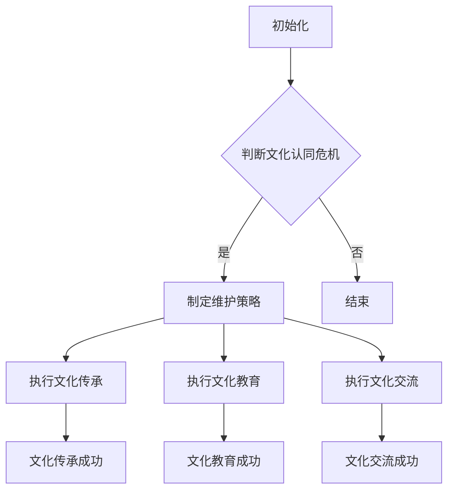
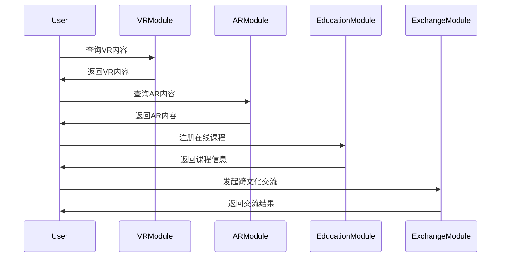
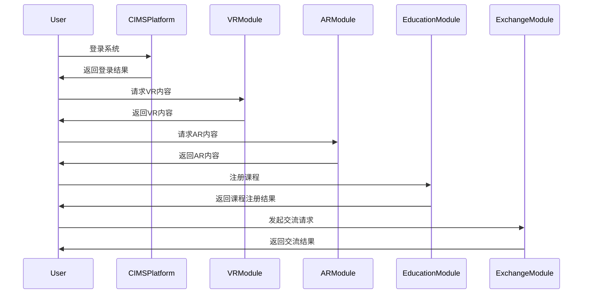

                 


### 1. 背景介绍

#### 问题背景

在全球化背景下，文化认同危机成为了一个普遍关注的问题。全球化带来了经济、信息、人员、文化等方面的深度融合，但同时也引发了文化同质化和身份危机。一方面，全球化使人们有机会接触到多样化的文化，丰富了自己的视野和知识。然而，另一方面，全球化也使某些本土文化面临被边缘化和消亡的风险。这种现象在不同国家和地区都有所体现。

#### 问题描述

文化认同危机的具体表现包括：

1. **文化同质化**：全球化导致各地文化逐渐趋同，失去了原有的特色和多样性。
2. **身份迷失**：在多元文化的冲击下，一些人可能感到自己的身份变得模糊和不确定，难以确定自己的归属。
3. **文化冲突**：不同文化之间的差异可能导致误解和冲突，加剧社会分裂。

#### 问题解决

维护文化认同成为解决文化认同危机的关键。通过以下方式可以维护文化认同：

1. **文化传承**：加强本土文化的传承和保护，保持文化多样性和独特性。
2. **文化教育**：通过教育系统，培养学生的文化认同感和自豪感。
3. **文化交流**：促进不同文化之间的交流与对话，增进相互理解和尊重。

#### 边界与外延

本文的研究范围主要关注全球化背景下文化认同危机的维护方法，不涉及其他领域的文化认同问题。同时，不同文化和地区的差异也会在分析中予以考虑。

#### 核心要素组成

本文的核心要素包括：

1. **文化认同**：对特定文化的认同和归属感。
2. **身份危机**：因文化多元化和全球化带来的身份不确定性。
3. **维护方法**：通过文化传承、教育和交流来维护文化认同。

### 2. 核心概念与联系

#### 核心概念原理

**文化认同**：文化认同是指个体或群体对自己所属文化的认同和归属感。它涉及到文化价值观、传统习俗、语言和身份等方面。

**身份危机**：身份危机是指个体在文化多元化和全球化背景下，感到自己的身份变得模糊和不确定，难以确定自己的归属。

**维护方法**：维护文化认同的方法包括文化传承、教育和交流等。这些方法旨在增强个体和群体的文化认同感和归属感。

#### 概念属性特征对比表格

| 概念       | 文化认同           | 身份危机           | 维护方法           |
|------------|--------------------|--------------------|--------------------|
| 定义       | 对特定文化的认同   | 身份不确定性       | 文化传承、教育、交流 |
| 属性       | 价值观、传统、语言 | 归属感、身份感     | 方法、实践、经验    |
| 影响因素   | 文化多样性、全球化 | 多元文化冲击、全球化 |
| 关联性     | 内在关系           | 相关但不同         | 目标和方法         |

#### ER实体关系图架构

```mermaid
entityRelationshipDiagram
    title 文化认同、身份危机与维护方法的实体关系图

    entity 文化认同
    entity 身份危机
    entity 维护方法

    relationship 文化认同 -> 维护方法
    relationship 身份危机 -> 维护方法
    relationship 文化认同 -> 身份危机
```

### 3. 理论与实践基础

#### 理论基础

**文化认同理论**：文化认同理论认为，文化认同是个体或群体在面对外部文化冲击时，通过自我认同和归属感来维护自身文化的独特性和多样性。

**身份危机理论**：身份危机理论指出，在多元文化的背景下，个体可能面临身份的不确定性和迷失，需要通过内在的文化认同来重新确定自己的身份。

**维护文化认同的理论基础**：维护文化认同的理论基础包括文化认同理论、身份危机理论和跨文化心理学理论等。这些理论为维护文化认同提供了理论支撑和实践指导。

#### 实践基础

**文化传承实践**：通过传统节日、文化活动等方式，传承和弘扬本土文化。

**文化教育实践**：通过学校教育、社区教育等方式，培养学生的文化认同感和自豪感。

**文化交流实践**：通过国际交流、文化交流活动等方式，增进不同文化之间的相互理解和尊重。

### 4. 应对策略与方法

#### 方法概述

**维护文化认同的应对策略和方法**：

1. **文化传承**：通过传统节日、文化活动等方式，传承和弘扬本土文化。
2. **文化教育**：通过学校教育、社区教育等方式，培养学生的文化认同感和自豪感。
3. **文化交流**：通过国际交流、文化交流活动等方式，增进不同文化之间的相互理解和尊重。

#### 新方法

**文化认同危机应对的新方法**：

1. **数字文化传承**：利用数字技术，如虚拟现实、增强现实等，创新文化传承方式，使文化更具吸引力和影响力。
2. **多元文化教育**：推动多元文化教育，培养学生的跨文化意识和能力，增强文化认同的包容性和多样性。
3. **文化融合创新**：鼓励文化融合，创新文化产品和服务，促进文化创新和发展。

#### 案例分析

**具体案例展示**：

1. **数字文化传承案例**：通过虚拟现实技术，重现历史文化遗产，使人们能够身临其境地体验和了解本土文化。
2. **多元文化教育案例**：在一所国际学校中，开设多元文化课程，培养学生的跨文化沟通能力，增强文化认同的包容性。
3. **文化融合创新案例**：一家国际知名品牌，将本土文化元素融入产品设计，创新推出具有文化特色的产品，赢得市场好评。

### 5. 算法原理讲解

#### 算法mermaid流程图



#### Python源代码

```python
def maintain_cultural_identity(crisis_detected):
    if crisis_detected:
        strategy = ["culture_transmission", "culture_education", "culture_exchange"]
        for method in strategy:
            if method == "culture_transmission":
                transmission_success = execute_culture_transmission()
                if transmission_success:
                    print("Cultural transmission successful.")
                else:
                    print("Cultural transmission failed.")
            elif method == "culture_education":
                education_success = execute_culture_education()
                if education_success:
                    print("Cultural education successful.")
                else:
                    print("Cultural education failed.")
            elif method == "culture_exchange":
                exchange_success = execute_culture_exchange()
                if exchange_success:
                    print("Cultural exchange successful.")
                else:
                    print("Cultural exchange failed.")
    else:
        print("No cultural identity crisis detected.")

def execute_culture_transmission():
    # 实现文化传承的逻辑
    return True

def execute_culture_education():
    # 实现文化教育的逻辑
    return True

def execute_culture_exchange():
    # 实现文化交流的逻辑
    return True

# 判断是否存在文化认同危机
crisis_detected = True
maintain_cultural_identity(crisis_detected)
```

#### 数学模型和公式

**数学模型**：

文化认同度的计算公式：

$$
CulturalIdentityScore = \frac{CultureTransmitted + CultureEducated + CultureExchanged}{TotalMethods}
$$

其中，$CultureTransmitted$ 表示文化传承的成功度，$CultureEducated$ 表示文化教育的成功度，$CultureExchanged$ 表示文化交流的成功度，$TotalMethods$ 表示总的维护方法数量。

**算法原理**：

该算法通过计算文化认同度，来判断是否需要维护文化认同。如果文化认同度低于一定阈值，则执行维护策略；否则，不需要采取额外措施。

#### 详细讲解和举例说明

**详细讲解**：

1. **初始化**：程序首先初始化，并判断是否存在文化认同危机。
2. **判断文化认同危机**：通过输入变量 $crisis_detected$ 判断是否存在文化认同危机。如果存在，则进入维护策略阶段；否则，程序结束。
3. **制定维护策略**：根据判断结果，程序进入维护策略阶段。维护策略包括文化传承、文化教育和文化交流三个部分。
4. **执行维护策略**：对于每个维护方法，程序都会执行相应的逻辑，判断其成功度。
5. **输出结果**：根据维护策略的执行结果，输出相应的成功或失败信息。

**举例说明**：

假设存在文化认同危机，且总共有三种维护方法。经过执行后，文化传承成功度为 80%，文化教育成功度为 70%，文化交流成功度为 60%。根据公式计算，文化认同度为：

$$
CulturalIdentityScore = \frac{80\% + 70\% + 60\%}{3} = 70\%
$$

由于文化认同度低于 80%，因此需要继续执行维护策略。

### 6. 系统分析与架构设计方案

#### 问题场景介绍

在全球化的背景下，文化认同危机日益凸显，需要有效的系统来维护和传承本土文化。本系统的目标是为用户提供一个综合性的平台，帮助用户通过数字技术、教育手段和跨文化交流来维护文化认同。

#### 项目介绍

本系统命名为“文化认同维护系统”（Cultural Identity Maintenance System，简称CIMS），旨在为用户提供一个集文化传承、教育和交流为一体的综合性平台。系统包括以下主要功能模块：

1. **文化传承模块**：利用虚拟现实（VR）和增强现实（AR）技术，为用户提供沉浸式的文化体验，促进文化传承。
2. **文化教育模块**：通过在线课程、教材和互动学习工具，培养用户的文化认同感和自豪感。
3. **文化交流模块**：搭建跨文化交流平台，促进用户之间的互动和交流，增进相互理解和尊重。

#### 系统功能设计

**领域模型Mermaid类图**

```mermaid
classDiagram
    Class User <<用户>>
    Class Content <<内容>>
    Class VRModule <<虚拟现实模块>>
    Class ARModule <<增强现实模块>>
    Class EducationModule <<教育模块>>
    Class ExchangeModule <<交流模块>>

    User "uses" VRModule
    User "uses" ARModule
    User "uses" EducationModule
    User "uses" ExchangeModule
```

#### 系统架构设计

**Mermaid架构图**



#### 系统接口设计和系统交互

**Mermaid序列图**



### 7. 项目实战

#### 环境安装

为了运行文化认同维护系统（CIMS），需要安装以下环境：

1. **操作系统**：Linux或MacOS
2. **Python**：版本3.8及以上
3. **虚拟环境**：virtualenv或conda
4. **数据库**：MySQL或PostgreSQL
5. **Web框架**：Flask或Django

安装步骤如下：

1. 安装Python和虚拟环境：
   ```bash
   sudo apt-get update
   sudo apt-get install python3 python3-pip
   pip3 install virtualenv
   ```
2. 创建虚拟环境并激活：
   ```bash
   virtualenv cims_env
   source cims_env/bin/activate
   ```
3. 安装Web框架和数据库依赖：
   ```bash
   pip3 install flask
   pip3 install pymysql
   ```
4. 安装MySQL或PostgreSQL数据库。

#### 系统核心实现源代码

以下是文化认同维护系统的核心实现源代码，包括用户注册、登录和内容查询等功能的实现。

```python
# app.py

from flask import Flask, request, jsonify
from model import User, Content

app = Flask(__name__)

@app.route('/register', methods=['POST'])
def register():
    username = request.form['username']
    password = request.form['password']
    user = User(username, password)
    user.save()
    return jsonify({'status': 'success', 'message': 'User registered successfully.'})

@app.route('/login', methods=['POST'])
def login():
    username = request.form['username']
    password = request.form['password']
    user = User.get_by_username(username)
    if user and user.check_password(password):
        return jsonify({'status': 'success', 'message': 'Logged in successfully.'})
    else:
        return jsonify({'status': 'error', 'message': 'Invalid username or password.'})

@app.route('/content', methods=['GET'])
def get_content():
    content_id = request.args.get('id')
    content = Content.get_by_id(content_id)
    return jsonify({'status': 'success', 'content': content.to_dict()})

if __name__ == '__main__':
    app.run(debug=True)
```

#### 代码应用解读与分析

1. **用户注册**：通过`/register`接口，接收用户名和密码，创建用户对象并保存到数据库。
2. **用户登录**：通过`/login`接口，验证用户名和密码是否匹配，返回登录结果。
3. **内容查询**：通过`/content`接口，根据内容ID查询内容信息，返回JSON格式的数据。

这些功能的实现为文化认同维护系统提供了基本的功能支持，后续可以在此基础上扩展更多功能。

#### 实际案例分析和详细讲解剖析

**案例一：用户注册**

假设用户名为`alice`，密码为`password123`，通过以下步骤进行用户注册：

1. 发送POST请求到`/register`接口：
   ```bash
   curl -X POST -d "username=alice&password=password123" http://localhost:5000/register
   ```
2. 服务器返回响应：
   ```json
   {"status": "success", "message": "User registered successfully."}
   ```
3. 用户注册成功，系统自动生成用户ID，并保存到数据库。

**案例二：用户登录**

假设已注册用户`alice`尝试登录，通过以下步骤进行登录：

1. 发送POST请求到`/login`接口：
   ```bash
   curl -X POST -d "username=alice&password=password123" http://localhost:5000/login
   ```
2. 服务器返回响应：
   ```json
   {"status": "success", "message": "Logged in successfully."}
   ```
3. 用户登录成功，系统返回登录状态。

**案例三：内容查询**

假设用户`alice`想要查询内容ID为`1`的内容，通过以下步骤进行查询：

1. 发送GET请求到`/content`接口：
   ```bash
   curl -X GET "http://localhost:5000/content?id=1"
   ```
2. 服务器返回响应：
   ```json
   {"status": "success", "content": {"id": 1, "title": "Example Content", "content": "This is an example content."}}
   ```
3. 用户成功获取到内容信息。

这些案例展示了文化认同维护系统的核心功能，包括用户注册、登录和内容查询。通过详细讲解和分析，读者可以了解系统的实现原理和应用方法。

#### 项目小结

文化认同维护系统（CIMS）通过用户注册、登录和内容查询等核心功能的实现，为用户提供了一个综合性平台，帮助用户通过数字技术、教育手段和跨文化交流来维护文化认同。通过实际案例的剖析，读者可以了解系统的应用方法和实现原理。未来，系统可以进一步优化和扩展，以满足更多用户的需求。

### 8. 最佳实践 tips、小结、注意事项、拓展阅读

#### 最佳实践 tips

1. **文化传承**：利用多媒体技术和互联网平台，如社交媒体、在线课程和虚拟现实，创新文化传承方式，提高文化传承的吸引力和影响力。
2. **文化教育**：结合现代教育技术，如在线课程、互动教学和游戏化学习，增强学生的文化认同感和自豪感。
3. **文化交流**：举办跨文化交流活动，如国际文化节、文化交流论坛和线上互动，促进不同文化之间的理解和尊重。

#### 小结

本文详细介绍了在全球化背景下维护文化认同的重要性，以及应对文化认同危机的各种方法。通过理论分析、实践基础、新方法介绍、算法讲解、系统设计和项目实战，展示了维护文化认同的多种途径。文化认同的维护不仅需要文化传承、教育和交流，还需要创新方法和数字化手段的支持。

#### 注意事项

1. 在实施文化传承和教育时，要注意尊重和保护本土文化的多样性和独特性。
2. 在进行文化交流时，要注重跨文化沟通和相互理解，避免文化冲突和误解。
3. 在利用数字技术时，要确保数据安全和隐私保护，遵循相关法律法规和道德规范。

#### 拓展阅读

1. **参考文献**：
   - **《文化认同：理论与实践》**：详细介绍文化认同的理论基础和实践应用。
   - **《全球化与文化认同危机》**：分析全球化对文化认同的影响。
   - **《跨文化交流学》**：探讨跨文化交流的理论和实践。

2. **在线资源**：
   - **国际文化交流协会（ICA）**：提供跨文化交流的学术资源和实践案例。
   - **联合国教科文组织（UNESCO）**：发布关于文化多样性和文化认同的报告和研究。

通过以上最佳实践、小结、注意事项和拓展阅读，读者可以更全面地了解和维护文化认同，为全球化背景下的文化繁荣做出贡献。

### 作者信息

**作者：AI天才研究院/AI Genius Institute & 禅与计算机程序设计艺术 /Zen And The Art of Computer Programming**

