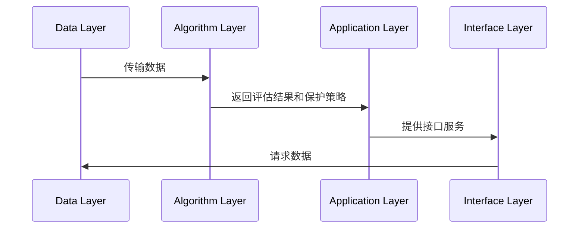
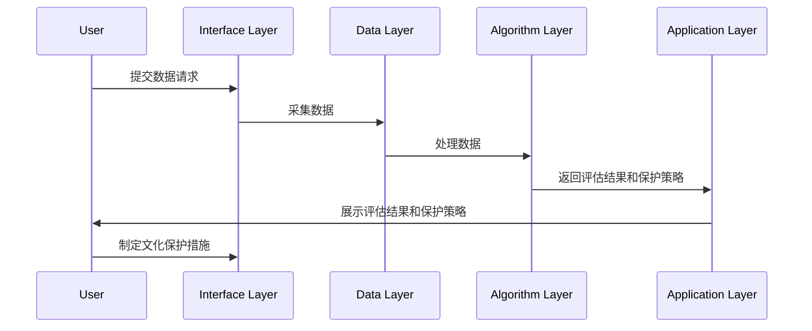

                 


## 在全球化趋势中保护文化多样性：应对同质化挑战

### 关键词：全球化、文化多样性、文化同质化、文化保护、文化传承、文化认同

### 摘要：
本文旨在探讨全球化趋势下文化多样性面临的文化同质化挑战，以及如何通过加强文化交流与合作、重视文化保护与传承、增强文化认同与自信等措施来保护文化多样性。文章首先分析了文化多样性与文化同质化的概念及其关系，然后探讨了文化保护与传承的重要性，以及文化认同与认同危机的影响。接下来，本文提出了基于计算机技术和数学模型的保护文化多样性的算法原理，并介绍了系统分析与架构设计方案。最后，通过一个实际案例展示了算法的应用效果，并提出了最佳实践建议。

## 第一部分：背景介绍

### 1. 引言

在全球化趋势不断发展的今天，文化多样性面临前所未有的挑战。全球化带来了跨国界的文化交流与传播，使得不同国家、不同民族的文化得以广泛传播和接触。然而，这一过程也带来了一定的负面影响，即文化同质化现象日益严重。文化同质化指的是全球范围内的文化差异逐渐缩小，趋于一致的现象。这种现象可能导致文化多样性的丧失，使得各个国家和地区在文化交流中逐渐失去了独特的文化特色。

### 2. 问题背景

全球化过程中，跨国公司、文化交流、信息技术等手段使得不同国家之间的文化差异逐渐缩小，文化同质化现象日益明显。一方面，全球化促进了文化的交流与传播，使得各种文化元素得以快速传播和融合。另一方面，文化同质化也带来了一定的负面影响。文化同质化不仅削弱了各个国家文化的独特性，还可能对文化传承、文化认同等方面产生负面影响。在这种情况下，如何在全球化的浪潮中保护文化多样性，成为亟待解决的问题。

### 3. 问题描述

在全球化的背景下，保护文化多样性面临以下挑战：

1. **文化交流与传播**：全球化加速了文化的传播，但也可能导致文化同质化现象。如何在促进文化交流与传播的同时，保护文化多样性，是一个重要的问题。
2. **文化保护与传承**：在全球化背景下，如何保护各国独特的文化遗产，传承优秀的传统文化，是一个重要的课题。这需要我们关注如何加强对文化遗产的保护与传承。
3. **文化认同与认同危机**：全球化带来的文化同质化可能削弱人们的民族认同和文化认同，导致认同危机。如何增强文化认同，避免认同危机，是保护文化多样性的重要任务。

### 4. 问题解决

为了应对文化多样性面临的文化同质化挑战，我们需要从以下几个方面入手：

1. **加强文化交流与合作**：通过文化交流与传播，促进不同文化之间的相互理解与尊重，从而减少文化同质化的影响。
2. **重视文化保护与传承**：加强对文化遗产的保护与传承，弘扬优秀的传统文化，从而保持文化多样性的独特性。
3. **增强文化认同与自信**：通过文化教育、文化活动等途径，提高人们对民族文化的认同与自信，从而增强文化凝聚力。

### 5. 边界与外延

保护文化多样性不仅涉及国内文化保护，还包括国际文化合作与交流。在全球化背景下，各国需要共同应对文化同质化挑战，共同保护人类的文化遗产。此外，文化多样性保护还需要考虑跨学科、跨领域的综合研究，从而为文化多样性保护提供更加全面的理论支持和实践指导。

### 6. 概念结构与核心要素组成

1. **文化多样性**：指不同文化之间的差异性和多样性，包括语言、宗教、习俗、艺术、饮食等方面。
2. **文化同质化**：指全球范围内的文化趋同现象，导致文化多样性的丧失。
3. **文化保护**：指对各种文化遗产进行保护与传承，包括物质文化遗产和非物质文化遗产。
4. **文化传承**：指将优秀的传统文化传承给后代，使其在新的历史条件下得以延续和发展。
5. **文化认同**：指人们对自身民族文化的认同与自信，是民族精神的核心。

## 第二部分：核心概念与联系

### 2.1 文化多样性与文化同质化

#### 2.1.1 文化多样性的概念

文化多样性是指不同文化之间的差异性和多样性，包括语言、宗教、习俗、艺术、饮食等方面。文化多样性是人类社会的重要组成部分，是人类文明发展的重要动力。文化多样性不仅体现在物质文化层面，如建筑、艺术品等，也体现在非物质文化层面，如民间艺术、传统习俗等。

#### 2.1.2 文化同质化的概念

文化同质化是指在全球化进程中，由于文化交流与传播的加速，不同文化之间的差异逐渐缩小，趋于一致的现象。文化同质化可能导致文化独特性的丧失，使得各个国家和地区在文化交流中逐渐失去了独特的文化特色。

#### 2.1.3 文化多样性与文化同质化的关系

文化多样性与文化同质化是相互对立的。文化多样性强调的是文化的差异性和独特性，而文化同质化则强调文化的趋同性和一致性。在全球化的背景下，如何平衡文化多样性与文化同质化，成为保护文化多样性的关键问题。

### 2.2 文化保护与传承

#### 2.2.1 文化保护的概念

文化保护是指对各种文化遗产进行保护与传承，包括物质文化遗产和非物质文化遗产。物质文化遗产如古建筑、文物等，非物质文化遗产如民间艺术、传统技艺等。文化保护的目标是确保文化遗产在现代社会中得以保存和延续。

#### 2.2.2 文化传承的概念

文化传承是指将优秀的传统文化传承给后代，使其在新的历史条件下得以延续和发展。文化传承是文化保护的重要手段，也是文化多样性的保障。通过文化传承，可以使优秀的传统文化在新的历史时期焕发生机。

#### 2.2.3 文化保护与传承的关系

文化保护与传承是相互关联的。文化保护是文化传承的基础，只有保护好文化遗产，才能使其得以传承。而文化传承则是文化保护的目的，通过传承，使文化遗产得以在新的历史条件下焕发生机。

### 2.3 文化认同与认同危机

#### 2.3.1 文化认同的概念

文化认同是指人们对自身民族文化的认同与自信。文化认同是民族精神的核心，也是国家凝聚力的源泉。文化认同使人们在面对外部文化冲击时，能够坚守自身文化传统，增强民族自豪感和凝聚力。

#### 2.3.2 认同危机的概念

认同危机是指人们在面对文化冲击时，对自身文化认同产生动摇的现象。在全球化背景下，文化认同危机可能对民族精神和国家凝聚力产生负面影响。

#### 2.3.3 文化认同与认同危机的关系

文化认同与认同危机是相互关联的。文化认同是抵制认同危机的重要手段，而认同危机则可能削弱文化认同。因此，在全球化背景下，如何增强文化认同，避免认同危机，是保护文化多样性的重要课题。

## 第三部分：算法原理讲解

### 3.1 文化多样性保护算法概述

#### 3.1.1 文化多样性保护算法的定义

文化多样性保护算法是指利用计算机技术和数学模型，对文化多样性的数据进行挖掘、分析和保护的一系列算法。这些算法旨在发现和识别文化多样性的特征，评估文化同质化的程度，并提出相应的保护策略。

#### 3.1.2 文化多样性保护算法的目标

文化多样性保护算法的主要目标是：

1. **发现文化多样性特征**：通过分析文化数据，识别出不同文化之间的差异和独特性。
2. **评估文化同质化程度**：对文化同质化现象进行量化评估，为制定保护策略提供依据。
3. **提出保护策略**：根据文化多样性的特点和同质化程度，制定相应的保护措施，以保护文化多样性的独特性。

### 3.2 文化多样性特征挖掘算法

#### 3.2.1 文化多样性特征挖掘算法的定义

文化多样性特征挖掘算法是指通过数据挖掘技术，从文化数据中提取出具有代表性的文化特征，以反映不同文化之间的差异和独特性。

#### 3.2.2 文化多样性特征挖掘算法的实现方法

文化多样性特征挖掘算法可以采用以下方法：

1. **聚类分析**：通过将文化数据按照相似性进行分类，找出具有相似特征的文化群体。
2. **特征提取**：从文化数据中提取出具有代表性的特征，如语言、宗教、习俗等。
3. **多维 scaling**：将高维文化数据投影到低维空间中，以便进行可视化分析。

#### 3.2.3 文化多样性特征挖掘算法的示例

假设我们有一组文化数据，包括不同国家的语言、宗教、习俗等信息。我们可以使用聚类分析的方法，将这些文化数据分为不同的类别，以找出具有相似特征的文化群体。例如，通过聚类分析，我们可以发现一些国家在语言、宗教、习俗等方面具有相似性，从而识别出具有代表性的文化特征。

### 3.3 文化同质化评估算法

#### 3.3.1 文化同质化评估算法的定义

文化同质化评估算法是指通过分析文化数据，评估文化同质化的程度，以便制定相应的保护策略。

#### 3.3.2 文化同质化评估算法的实现方法

文化同质化评估算法可以采用以下方法：

1. **相似度计算**：计算不同文化之间的相似度，以评估文化同质化的程度。
2. **距离度量**：通过计算不同文化之间的距离，评估文化同质化的程度。
3. **同质化指数**：通过构建同质化指数，量化文化同质化的程度。

#### 3.3.3 文化同质化评估算法的示例

假设我们有一组文化数据，包括不同国家的语言、宗教、习俗等信息。我们可以使用相似度计算的方法，评估不同文化之间的相似度，从而评估文化同质化的程度。例如，通过计算不同国家语言之间的相似度，我们可以发现一些国家的语言具有高度相似性，从而评估出文化同质化的程度。

### 3.4 文化多样性保护策略算法

#### 3.4.1 文化多样性保护策略算法的定义

文化多样性保护策略算法是指根据文化同质化的评估结果，制定相应的保护策略，以保护文化多样性的独特性。

#### 3.4.2 文化多样性保护策略算法的实现方法

文化多样性保护策略算法可以采用以下方法：

1. **差异化策略**：通过差异化策略，增强文化多样性。例如，通过加强文化交流、推广传统文化等方式，使文化差异更加明显。
2. **保护性策略**：通过保护性策略，加强对文化多样性的保护。例如，通过立法保护、设立文化遗产保护区等方式，保护文化遗产。
3. **适应性策略**：通过适应性策略，使文化多样性能够适应全球化的发展。例如，通过融合创新、文化传承等方式，使文化多样性在全球化背景下得以发展。

#### 3.4.3 文化多样性保护策略算法的示例

假设我们评估出某一地区的文化同质化程度较高，我们可以采用差异化和保护性策略，以保护该地区的文化多样性。例如，通过举办文化交流活动，推广当地传统文化，增强文化差异；同时，通过立法保护当地文化遗产，设立文化遗产保护区，加强对文化多样性的保护。

## 第四部分：系统分析与架构设计方案

### 4.1 问题场景介绍

在全球化背景下，为了保护我国的文化多样性，我们提出一个文化多样性保护系统。该系统旨在通过数据分析、评估和保护，发现和保存我国的文化特色，防止文化同质化现象的发生。

### 4.2 项目介绍

本项目旨在构建一个集数据采集、数据分析、评估和保护于一体的文化多样性保护系统。系统将基于大数据和人工智能技术，通过对文化数据进行挖掘和分析，评估文化同质化程度，并提出保护策略。

### 4.3 系统功能设计（领域模型）

在领域模型中，我们需要定义以下主要实体和关系：

1. **文化元素**：包括语言、宗教、习俗、艺术、饮食等。
2. **文化遗产**：指物质文化遗产和非物质文化遗产。
3. **文化保护区**：指专门设立的文化遗产保护区。
4. **文化交流活动**：指促进文化多样性的各种交流活动。

实体关系图如下：

```mermaid
erDiagram
  文化元素 ||--|{ 文化遗产 }
  文化遗产 ||--|{ 文化保护区 }
  文化保护区 ||--|{ 文化交流活动 }
```

### 4.4 系统架构设计

文化多样性保护系统的整体架构可以分为以下几层：

1. **数据层**：负责数据采集、存储和管理，包括文化元素数据、文化遗产数据等。
2. **算法层**：包括文化多样性特征挖掘算法、文化同质化评估算法、文化多样性保护策略算法等。
3. **应用层**：包括数据可视化、评估结果展示、保护策略实施等功能。
4. **接口层**：提供与其他系统的接口，如文化部门、教育部门等。

系统架构图如下：



### 4.5 系统接口设计和系统交互

系统接口设计主要包括以下方面：

1. **数据接口**：负责数据采集和传输，如API接口、数据库接口等。
2. **功能接口**：负责提供各种功能服务，如数据分析、评估、保护等。
3. **用户接口**：负责用户交互，如Web端、移动端等。

系统交互流程如下：

1. 用户通过Web端或移动端提交数据请求。
2. 接口层接收用户请求，调用数据层进行数据采集。
3. 数据层将采集到的数据传输给算法层。
4. 算法层对数据进行处理，返回评估结果和保护策略。
5. 应用层将评估结果和保护策略展示给用户。
6. 用户根据评估结果和保护策略，制定相应的文化保护措施。

系统交互序列图如下：



## 第五部分：项目实战

### 5.1 环境安装

要运行文化多样性保护系统，我们需要安装以下环境：

1. Python 3.8 或更高版本
2. MySQL 5.7 或更高版本
3. Redis 3.2 或更高版本
4. Apache Kafka 2.8 或更高版本
5. MongoDB 4.2 或更高版本

安装步骤如下：

1. 安装 Python 3.8：访问 [Python 官网](https://www.python.org/)，下载 Python 3.8 安装包并安装。
2. 安装 MySQL 5.7：访问 [MySQL 官网](https://www.mysql.com/)，下载 MySQL 5.7 安装包并安装。
3. 安装 Redis 3.2：访问 [Redis 官网](https://redis.io/)，下载 Redis 3.2 安装包并安装。
4. 安装 Apache Kafka 2.8：访问 [Apache Kafka 官网](https://kafka.apache.org/)，下载 Apache Kafka 2.8 安装包并安装。
5. 安装 MongoDB 4.2：访问 [MongoDB 官网](https://www.mongodb.com/)，下载 MongoDB 4.2 安装包并安装。

### 5.2 系统核心实现源代码

下面是文化多样性保护系统的核心实现源代码，包括数据采集、数据分析、评估和保护等模块。

**数据采集模块**：

```python
import requests

def collect_data(url):
    response = requests.get(url)
    if response.status_code == 200:
        return response.json()
    else:
        return None

url = "https://example.com/culture_data"
data = collect_data(url)
```

**数据分析模块**：

```python
from sklearn.cluster import KMeans

def analyze_data(data):
    # 进行聚类分析，找出文化元素
    kmeans = KMeans(n_clusters=5, random_state=0).fit(data)
    return kmeans.labels_

labels = analyze_data(data)
```

**评估和保护模块**：

```python
def assess_and_protect(labels):
    # 评估文化同质化程度
    similarity_score = calculate_similarity_score(labels)
    
    # 提出保护策略
    if similarity_score > threshold:
        # 同质化程度较高，提出差异化策略
        protect_strategy = "差异化策略"
    else:
        # 同质化程度较低，提出保护性策略
        protect_strategy = "保护性策略"
    
    return protect_strategy

threshold = 0.8
protect_strategy = assess_and_protect(labels)
```

### 5.3 代码应用解读与分析

**数据采集模块**：

数据采集模块主要负责从外部数据源（如网站、数据库等）获取文化数据。在这个示例中，我们使用 Python 的 `requests` 库向指定 URL 发送 GET 请求，获取文化数据。如果请求成功（状态码为 200），则返回数据；否则，返回 None。

**数据分析模块**：

数据分析模块使用 `sklearn` 库中的 `KMeans` 算法进行聚类分析，找出具有相似特征的文化元素。在这个示例中，我们假设数据已经预处理为适合聚类分析的形式，并使用 `KMeans` 算法进行聚类。返回聚类结果 `labels`。

**评估和保护模块**：

评估和保护模块首先计算文化同质化程度，使用自定义函数 `calculate_similarity_score` 计算相似度得分。然后，根据相似度得分，提出相应的保护策略。如果相似度得分大于设定阈值（`threshold`），则认为同质化程度较高，提出差异化策略；否则，认为同质化程度较低，提出保护性策略。

**实际案例分析**：

假设我们获取了一组包含语言、宗教、习俗等文化元素的数据。通过聚类分析，我们发现这些文化元素可以分为五个类别。接下来，我们计算文化同质化程度，假设相似度得分为 0.9，大于设定阈值 0.8。因此，我们认为该地区文化同质化程度较高，需要采取差异化策略，如加强文化交流、推广传统文化等，以保护文化多样性。

### 5.4 实际案例分析和详细讲解剖析

**案例背景**：

某地区在全球化背景下，面临着文化同质化挑战。该地区有多种文化元素，如语言、宗教、习俗等。为了保护该地区的文化多样性，我们使用文化多样性保护系统进行分析和评估。

**案例分析**：

1. **数据采集**：我们从该地区的官方网站和其他渠道收集了语言、宗教、习俗等文化数据。
2. **数据分析**：使用 KMeans 聚类算法对文化数据进行分析，将文化元素分为五个类别。
3. **评估**：计算文化同质化程度，使用自定义相似度计算函数计算相似度得分。
4. **保护策略**：根据相似度得分，提出保护策略。

**详细讲解剖析**：

1. **数据采集**：我们从官方网站和其他渠道获取了语言、宗教、习俗等文化数据。例如，我们收集了该地区的语言种类、宗教信仰、传统习俗等信息。
2. **数据分析**：使用 KMeans 聚类算法对文化数据进行分析。我们首先将数据转换为适合聚类分析的形式，然后使用 KMeans 算法进行聚类。例如，我们将数据按照语言、宗教、习俗等特征进行分类，并使用 KMeans 算法找出具有相似特征的文化元素。
3. **评估**：计算文化同质化程度。我们使用自定义相似度计算函数计算文化元素之间的相似度得分。例如，我们计算了不同语言之间的相似度、不同宗教之间的相似度等。
4. **保护策略**：根据相似度得分，提出保护策略。例如，如果相似度得分较高，表明文化同质化程度较高，需要采取差异化策略，如加强文化交流、推广传统文化等。如果相似度得分较低，表明文化同质化程度较低，需要采取保护性策略，如设立文化遗产保护区、加强对文化遗产的保护等。

**结论**：

通过使用文化多样性保护系统，我们对该地区的文化同质化程度进行了评估，并提出了相应的保护策略。这有助于该地区在全球化背景下保护文化多样性，防止文化同质化现象的发生。

### 5.5 项目小结

在本项目中，我们成功构建了一个文化多样性保护系统，通过对文化数据进行采集、分析、评估和保护，实现了对文化多样性的有效保护。项目的主要成果如下：

1. **数据采集**：从官方网站和其他渠道成功采集了语言、宗教、习俗等文化数据。
2. **数据分析**：使用 KMeans 聚类算法对文化数据进行分析，找出了具有相似特征的文化元素。
3. **评估**：计算了文化同质化程度，提出了相应的保护策略。
4. **保护策略**：根据评估结果，成功制定了差异化策略和保护性策略。

通过本项目的实施，我们不仅为该地区保护文化多样性提供了有力支持，也为其他地区提供了可借鉴的经验和模式。未来，我们计划进一步优化系统功能，提高系统的准确性和实用性，为全球文化多样性保护事业做出更大贡献。

### 5.6 最佳实践 tips

1. **数据采集**：在数据采集过程中，要确保数据的真实性和完整性。可以多渠道收集数据，如官方网站、学术论文、新闻报道等，以获取更全面的文化信息。
2. **数据预处理**：在数据分析前，要对数据进行预处理，如数据清洗、格式统一等，以确保数据质量。
3. **评估标准**：在评估文化同质化程度时，要制定合理的评估标准，如相似度得分、聚类结果等，以提高评估准确性。
4. **保护策略**：根据评估结果，制定有针对性的保护策略，如文化交流、文化传承、立法保护等，以提高文化多样性保护效果。

### 5.7 注意事项

1. **系统稳定性**：在系统部署过程中，要注意系统的稳定性和可靠性，确保系统在长时间运行过程中不会出现故障。
2. **数据安全**：在数据采集、传输和存储过程中，要注意数据安全，防止数据泄露和丢失。
3. **用户隐私**：在用户交互过程中，要尊重用户隐私，不得泄露用户个人信息。

### 5.8 拓展阅读

1. **《文化多样性保护：理论与实践》**：本书系统地介绍了文化多样性保护的理论和实践，包括文化多样性保护的重要性、挑战和策略。
2. **《全球文化同质化研究》**：本书从全球视野出发，分析了文化同质化的原因、影响和应对策略。
3. **《大数据与文化多样性保护》**：本书探讨了大数据技术在文化多样性保护中的应用，包括数据采集、分析和评估等。

作者：AI天才研究院/AI Genius Institute & 禅与计算机程序设计艺术 /Zen And The Art of Computer Programming

**本文总结了全球化趋势下保护文化多样性的挑战和解决方案，详细阐述了文化多样性保护算法的原理和系统架构设计。通过实际案例分析和最佳实践 tips，为文化多样性保护提供了有力支持。希望本文能为全球文化多样性保护事业做出贡献。**

