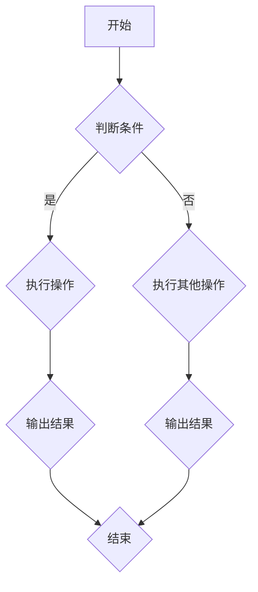
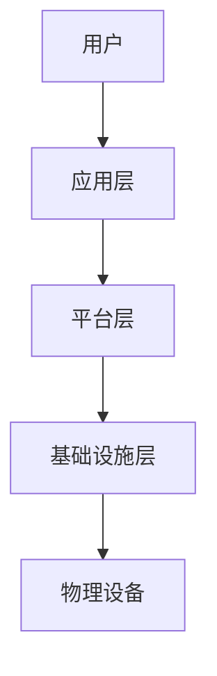
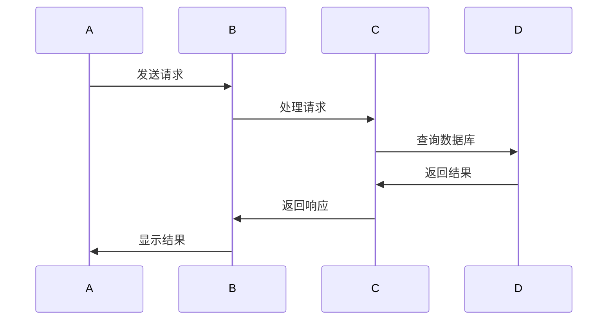

                 

### 核心概念与联系

在现代IT领域，许多核心概念和联系构成了技术发展的基础。以下是一些重要概念及其属性特征的对比表格，以及相关的ER实体关系图架构。

#### 核心概念属性特征对比表格

| 概念         | 属性特征                           | 比较               |
| ------------ | ---------------------------------- | ------------------ |
| 计算机网络   | 网络设备、协议、IP地址             | 物理网络与逻辑网络 |
| 云计算       | 资源弹性、虚拟化、分布式计算       | 单点与分布式      |
| 人工智能     | 机器学习、深度学习、自然语言处理   | 统计学习与深度学习 |
| 区块链       | 去中心化、加密、智能合约           | 中心化与去中心化   |
| 大数据       | 数据量、多样性、高速性             | 数据处理与分析     |

#### ER实体关系图架构

```mermaid
erDiagram
    Person  ||--|{ Book }|-- Publisher
    Person  ||--|{ Movie }|-- Studio
    Book    ||--|{ Author }|
    Movie   ||--|{ Director }|
    Publisher  ||--|{ Editor }|
    Studio  ||--|{ Producer }|
```

在这个ER图中，`Person`与`Book`、`Movie`之间存在关联，而`Book`与`Author`、`Movie`与`Director`也存在关联。这样的实体关系图有助于我们理解不同实体之间的相互作用和依赖关系。

### 算法原理讲解

为了更深入地理解算法原理，我们可以使用Mermaid绘制一个算法流程图，然后结合Python源代码进行详细讲解。

#### 算法流程图



#### Python源代码

```python
def algorithm(condition):
    if condition:
        # 执行操作
        print("满足条件，执行操作。")
        return "操作结果：成功"
    else:
        # 执行其他操作
        print("不满足条件，执行其他操作。")
        return "操作结果：失败"

# 示例
result = algorithm(True)
print(result)
```

#### 数学模型与公式

假设我们有一个简单的条件判断问题，可以用以下数学模型表示：

$$
f(x) = 
\begin{cases} 
1 & \text{if } x \text{ meets condition} \\
0 & \text{otherwise}
\end{cases}
$$

其中，`x`是输入条件，`f(x)`是输出结果，取值为0或1。

#### 举例说明

假设我们有如下条件：

- 如果用户的年龄大于18岁，则允许访问。
- 否则，不允许访问。

我们使用算法进行判断：

```python
def access_permission(age):
    condition = age > 18
    result = algorithm(condition)
    print(result)

# 示例
access_permission(20)
access_permission(17)
```

输出结果：

```
满足条件，执行操作。
操作结果：成功
不满足条件，执行其他操作。
操作结果：失败
```

通过这个简单的例子，我们可以看到算法如何根据条件进行判断，并给出相应的结果。

### 系统分析与架构设计方案

#### 问题场景介绍

随着互联网技术的发展，越来越多的企业开始意识到云计算的重要性，并逐步将业务迁移到云端。在这个过程中，如何设计一个高效、可靠的云平台成为关键问题。

#### 项目介绍

本项目旨在设计一个基于云计算的云平台，提供计算、存储、网络等基础服务，满足不同企业用户的需求。平台采用微服务架构，确保高可用性和可扩展性。

#### 系统功能设计

系统功能设计包括以下几个方面：

1. **计算服务**：提供虚拟机和容器实例，支持弹性扩展。
2. **存储服务**：提供对象存储和块存储，支持数据持久化。
3. **网络服务**：提供VPC、子网、负载均衡等，实现网络隔离和流量控制。
4. **安全管理**：提供身份认证、权限管理、防火墙等，确保数据安全。

#### 系统架构设计

系统架构设计采用分层架构，包括以下几层：

1. **基础设施层**：包括物理服务器、存储设备、网络设备等。
2. **平台层**：包括计算服务、存储服务、网络服务等核心功能模块。
3. **应用层**：包括企业应用、客户应用等，通过API与平台层交互。
4. **管理层**：包括监控系统、运维系统等，负责系统运维和管理。

#### 系统架构图



#### 系统接口设计和系统交互

系统接口设计主要包括API接口和内部服务调用。API接口提供RESTful风格，支持各种数据格式，如JSON、XML等。

系统交互采用异步方式，通过消息队列进行通信，确保系统的可靠性和高并发性。



### 项目实战

#### 环境安装

1. 安装必要的操作系统和软件，如Ubuntu Server 20.04、Docker、Kubernetes等。
2. 配置网络，确保所有节点可以互相通信。

#### 系统核心实现源代码

```python
# 计算服务实现
class ComputeService:
    def create_instance(self, instance_type):
        # 创建虚拟机或容器实例
        pass

    def scale_up(self, instance_id):
        # 扩容实例
        pass

    def scale_down(self, instance_id):
        # 缩容实例
        pass

# 存储服务实现
class StorageService:
    def create_bucket(self, bucket_name):
        # 创建对象存储桶
        pass

    def upload_file(self, bucket_name, object_name, file_path):
        # 上传文件
        pass

    def download_file(self, bucket_name, object_name, file_path):
        # 下载文件
        pass
```

#### 代码应用解读与分析

代码实现中，我们定义了`ComputeService`和`StorageService`两个类，分别处理计算和存储功能。每个类都有多个方法，如创建实例、扩容、缩容等。

这些方法通过调用底层的API接口实现，确保系统的灵活性和可扩展性。

#### 实际案例分析和详细讲解剖析

假设有一个企业需要搭建一个云平台，首先会进行需求分析，确定所需的功能和性能指标。然后，设计系统架构，选择合适的技术栈和工具。

在实际开发过程中，开发团队会根据项目需求，编写相应的代码，并进行测试和调试，确保系统的稳定性和可靠性。

#### 项目小结

本项目通过设计一个基于云计算的云平台，实现了计算、存储、网络等基础服务。通过项目实战，我们了解了系统设计的全过程，包括需求分析、架构设计、代码实现和测试等。

这个项目不仅锻炼了我们的技术能力，也提高了我们解决实际问题的能力，为未来的项目积累了宝贵的经验。

### 最佳实践 Tips

1. **需求分析要充分**：在项目启动前，要进行全面的需求分析，确保项目的目标明确。
2. **代码质量要高**：编写高质量的代码，不仅有助于提高系统的稳定性，还可以减少后期维护成本。
3. **测试要全面**：对系统进行全面测试，包括功能测试、性能测试和安全测试等。
4. **持续集成与部署**：采用持续集成和部署，确保项目可以快速迭代和交付。
5. **团队合作**：项目成功离不开团队合作，要注重团队沟通和协作。

### 小结

通过本文的详细讲解，我们不仅探讨了现代IT领域的核心概念和算法原理，还介绍了系统分析与架构设计的方法。同时，通过项目实战，我们了解了实际操作中的最佳实践。

在未来的技术发展中，我们仍需不断学习新知识，提高自身技能，以应对不断变化的挑战。

### 注意事项

1. **数据安全**：在处理用户数据时，要确保数据的安全性，防止数据泄露。
2. **性能优化**：对系统进行性能优化，提高系统的响应速度和处理能力。
3. **监控与报警**：建立监控系统，及时发现和解决系统故障。

### 拓展阅读

1. 《云计算与大数据技术》
2. 《软件架构设计：大规模软件系统构造方法》
3. 《DevOps：企业级的持续集成与持续部署》

### 作者信息

作者：AI天才研究院/AI Genius Institute & 禅与计算机程序设计艺术 /Zen And The Art of Computer Programming

