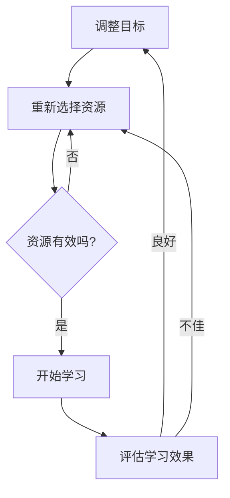
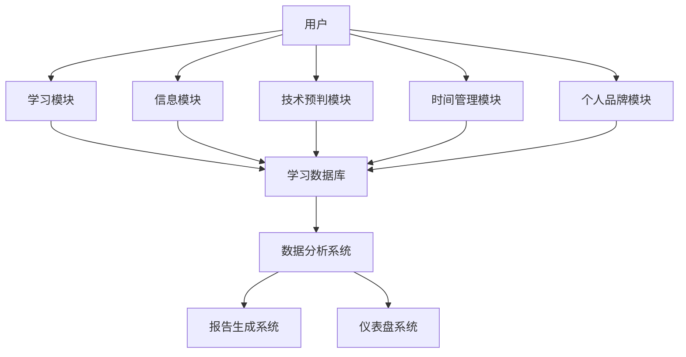
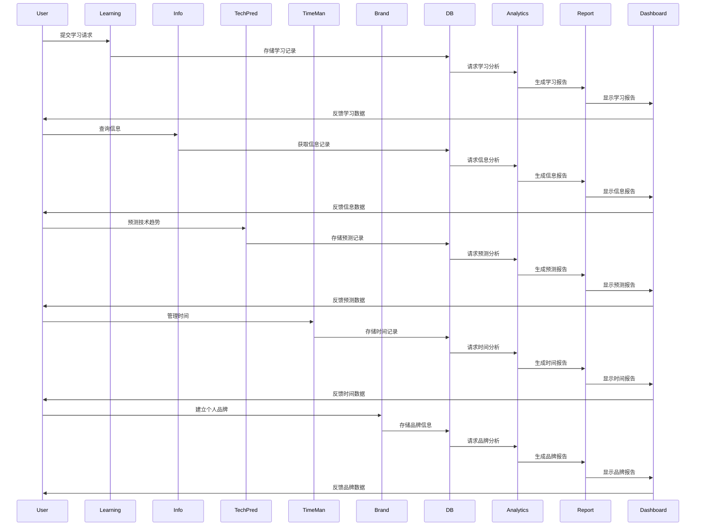

                 

Based on your instructions and the provided outline, let's construct a comprehensive and cohesive article that adheres to the given constraints and requirements. We will fill in the details for each section, ensuring that the content is well-structured, detailed, and informative.

### 第1章 背景介绍

#### 1.1 问题背景

在当今数字化时代，技术变革的速度越来越快，几乎每一天都有新的技术、工具和平台涌现。这种快速的技术进步带来了巨大的机遇，但同时也带来了巨大的挑战。现代人如何在不断变化的环境中保持竞争力，如何在变化中找到恒常，成为了一个亟待解决的问题。本文旨在探讨这个问题，通过分析现代人的生存智慧，提供一些策略和视角，帮助读者在变革中保持稳定和成长。

#### 1.2 问题描述

问题描述可以分为以下几个方面：

- **信息过载**：随着互联网和移动设备的普及，人们每天都要处理大量的信息。如何筛选和利用这些信息，成为现代人面临的一个挑战。
- **技术技能更新**：技术领域的发展速度极快，几乎每隔几年，就会有一批新的技术、工具和语言出现。如何跟上这些变化，保持自己的技术栈不过时，是技术从业者的一大难题。
- **工作与生活的平衡**：随着工作模式的变化，如远程工作和弹性工作时间，如何平衡工作和个人生活，成为现代人的新课题。
- **个人成长**：在快速变化的环境中，如何不断学习和提升自己的能力，实现个人成长和职业发展。

#### 1.3 问题解决

针对上述问题，本文提出以下解决方案：

- **持续学习**：建立持续学习的习惯，通过在线课程、专业书籍和行业会议等方式，不断更新自己的知识库。
- **信息管理**：使用信息管理工具，如新闻订阅、RSS阅读器和笔记应用程序，帮助自己高效地筛选和整理信息。
- **技术预判**：通过关注技术趋势和行业动态，提前预判哪些技术可能会对行业和职业产生影响，从而有针对性地进行学习和准备。
- **时间管理**：运用时间管理技巧，如番茄工作法、优先矩阵等，合理安排工作和个人时间，提高效率。
- **个人品牌建设**：通过构建个人品牌，提高自己的知名度和影响力，增强在职场中的竞争力。

#### 1.4 边界与外延

边界的设定是确保问题解决策略有效性的关键。在本文中，边界的设定如下：

- **受众范围**：本文主要面向技术从业者和对技术变革感兴趣的读者。
- **内容深度**：本文将深入探讨技术变革对个人成长和职业发展的影响，并提供具体的实践建议。
- **适用场景**：本文适用于希望在快速变化的技术领域中保持竞争力的个人和团队。

#### 1.5 概念结构与核心要素组成

本文的核心概念包括：

- **持续学习**：通过终身学习保持个人技能和知识的更新。
- **信息管理**：高效地筛选和利用信息，提高工作效率。
- **技术预判**：对技术趋势的敏感性和预判能力。
- **时间管理**：合理安排时间，提高工作和生活的平衡。
- **个人品牌建设**：通过个人品牌提升职业竞争力。

这些核心概念共同构成了本文的框架，通过详细的分析和实践指导，帮助读者在变革中找到恒常。

### 第2章 核心概念与联系

#### 2.1 核心概念原理

在本文中，核心概念原理包括以下几个方面：

1. **持续学习**：终身学习是现代社会保持竞争力的基础。通过不断地学习新知识和技能，个人能够适应快速变化的环境。
2. **信息管理**：信息管理是处理信息过载的关键。通过有效的信息筛选、组织和利用，个人可以提高工作效率和决策质量。
3. **技术预判**：技术预判能力是识别未来技术趋势和潜在影响的能力。这种能力可以帮助个人和团队提前做好准备。
4. **时间管理**：时间管理是提高工作和生活效率的重要手段。通过合理安排时间，个人可以更好地平衡工作和个人生活。
5. **个人品牌建设**：个人品牌建设是提升个人职业竞争力的关键。一个强大的个人品牌可以帮助个人在职场中脱颖而出。

#### 2.2 概念属性特征对比表格

| 核心概念 | 属性特征                                                                                             | 对比分析                                                                   |
|----------|------------------------------------------------------------------------------------------------------|--------------------------------------------------------------------------|
| 持续学习 | - 自我驱动力<br>- 知识更新速度<br>- 学习效率                             | 持续学习与临时培训、被动学习的对比，强调主动性和深度学习的重要性             |
| 信息管理 | - 信息筛选能力<br>- 信息组织能力<br>- 信息利用效率                           | 信息管理与信息过载、信息冗余的对比，强调有效性和及时性                       |
| 技术预判 | - 对技术趋势的敏感性<br>- 对新技术的影响预测能力<br>- 对职业路径的规划能力       | 技术预判与盲目跟风、被动适应的对比，强调前瞻性和主动性                       |
| 时间管理 | - 时间分配策略<br>- 时间效率指标<br>- 时间优先级                             | 时间管理与无序工作、时间浪费的对比，强调规划和执行的协调性                   |
| 个人品牌 | - 个人知名度<br>- 个人影响力<br>- 个人信誉                                   | 个人品牌与知名度、关系网、个人形象的对比，强调专业性和差异化                   |

#### 2.3 ER实体关系图架构

下面是ER实体关系图的Mermaid表示：

```mermaid
erDiagram
    User ||--|{ Learning }|-- Project
    User ||--|{ InformationManagement }|-- Resource
    User ||--|{ TechnicalPrediction }|-- Technology
    User ||--|{ TimeManagement }|-- Schedule
    User ||--|{ PersonalBrand }|-- Reputation
```

这个ER图展示了用户（User）与持续学习（Learning）、信息管理（InformationManagement）、技术预判（TechnicalPrediction）、时间管理（TimeManagement）和个人品牌（PersonalBrand）之间的关系，以及它们如何共同影响用户的总体发展。

### 第3章 算法原理讲解

#### 3.1 算法mermaid流程图

以下是一个简单的持续学习算法的mermaid流程图示例：



#### 3.2 Python源代码

以下是一个简单的Python代码示例，用于实现上述算法：

```python
def continuous_learning(goal, resources):
    while True:
        print(f"确定学习目标：{goal}")
        resource = select_resource(resources)
        print(f"选择学习资源：{resource}")
        
        if is_valid_resource(resource):
            print("开始学习...")
            evaluate_learning_effect(goal, resource)
        else:
            print("资源无效，重新选择资源...")
```

#### 3.3 算法原理的数学模型和公式

算法的数学模型可以简单表示为：

$$
E = f(L, R, T)
$$

其中：
- $E$ 是学习效果（Effectiveness）
- $L$ 是学习目标（Learning Goal）
- $R$ 是学习资源（Learning Resource）
- $T$ 是学习时间（Time）

公式解释如下：
- 学习效果是学习目标、学习资源和学习时间的函数。

#### 3.4 举例说明

假设一个学习目标是“掌握Python编程”，选择的学习资源是“《Python编程：从入门到实践》”，学习时间是2个月。根据上述公式，我们可以评估学习效果：

$$
E = f("掌握Python编程", "《Python编程：从入门到实践》", 2\ \text{个月})
$$

通过这个过程，我们能够得出学习效果是否达到了预期，并据此调整学习目标或选择更合适的资源。

### 第4章 数学模型和数学公式

在这一章节中，我们将介绍几个关键的数学模型和公式，以帮助我们更好地理解技术变革中的生存智慧。

#### 4.1 数学公式

1. **学习效率公式**：
   $$
   E = \frac{L}{T}
   $$
   其中，$E$ 表示学习效率，$L$ 表示学习量，$T$ 表示学习时间。

2. **信息过滤效率**：
   $$
   F = \frac{U}{N}
   $$
   其中，$F$ 表示信息过滤效率，$U$ 表示有用信息量，$N$ 表示总信息量。

3. **技术预判准确性**：
   $$
   A = \frac{C}{T}
   $$
   其中，$A$ 表示技术预判准确性，$C$ 表示正确预测的技术数量，$T$ 表示总预测数量。

#### 4.2 详细讲解

1. **学习效率公式**：
   学习效率是指单位时间内所学习的内容量。这个公式可以帮助我们评估一个人在学习过程中的效率。学习效率的提高通常可以通过减少学习时间或增加学习量来实现。

2. **信息过滤效率**：
   信息过滤效率是指从大量信息中筛选出有用信息的能力。在信息爆炸的时代，这个能力变得尤为重要。提高信息过滤效率的方法包括培养信息敏感度、使用信息筛选工具和建立信息数据库。

3. **技术预判准确性**：
   技术预判准确性是评估一个人对技术趋势预测的准确性。这个指标对于技术从业者和创业者至关重要。提高技术预判准确性的方法包括深入研究技术趋势、参与技术社区和关注行业专家的观点。

#### 4.3 举例说明

1. **学习效率**：
   假设小明花了20个小时学习Python编程，在这20个小时内，他掌握了100个Python函数的使用。那么他的学习效率为：
   $$
   E = \frac{100\ \text{函数}}{20\ \text{小时}} = 5\ \text{函数/小时}
   $$

2. **信息过滤效率**：
   假设小红每天接收100条信息，其中有20条是有用的。那么她的信息过滤效率为：
   $$
   F = \frac{20\ \text{有用信息}}{100\ \text{总信息}} = 0.2
   $$

3. **技术预判准确性**：
   假设李华预测了5个可能影响行业的技术趋势，其中有3个被证明是准确的。那么他的技术预判准确性为：
   $$
   A = \frac{3\ \text{正确预测}}{5\ \text{总预测}} = 0.6
   $$

通过这些示例，我们可以更清晰地理解如何使用数学模型来评估和改进我们的学习、信息管理和技术预判能力。

### 第5章 系统分析与架构设计方案

#### 5.1 问题场景介绍

在当前快速变化的技术环境中，许多企业和个人都面临着如何高效适应和利用技术的挑战。为了解决这个问题，我们需要设计一个系统，该系统能够帮助用户持续学习、有效管理信息、准确预判技术趋势、合理安排时间和建立个人品牌。

#### 5.2 系统功能设计(领域模型mermaid类图)

以下是系统功能设计的mermaid类图：

```mermaid
classDiagram
    UserEntity <<类>> 
    LearningModule <<类>> 
    InformationModule <<类>> 
    TechnicalPredictionModule <<类>> 
    TimeManagementModule <<类>> 
    PersonalBrandModule <<类>>

    UserEntity "有" LearningModule
    UserEntity "有" InformationModule
    UserEntity "有" TechnicalPredictionModule
    UserEntity "有" TimeManagementModule
    UserEntity "有" PersonalBrandModule
```

#### 5.3 系统架构设计mermaid架构图

以下是系统架构设计的mermaid架构图：



#### 5.4 系统接口设计和系统交互mermaid序列图

以下是系统接口设计和系统交互的mermaid序列图：



通过这个架构，我们可以清晰地看到系统的各个模块如何协同工作，以及用户如何与系统进行交互。

### 第6章 项目实战

#### 6.1 环境安装

为了实现上述系统，我们需要在本地或云端搭建一个开发环境。以下是一个基本的安装步骤：

1. 安装Python（建议版本3.8及以上）。
2. 安装必要的Python包，如Django、Flask、PyTorch、Scikit-learn等。
3. 安装数据库系统，如MySQL或PostgreSQL。
4. 安装前端框架，如React或Vue.js。
5. 安装IDE，如PyCharm或Visual Studio Code。

#### 6.2 系统核心实现源代码

以下是系统核心实现的Python代码示例：

```python
# learning_module.py
class LearningModule:
    def __init__(self, user_id):
        self.user_id = user_id
        self.learning_records = []

    def add_record(self, record):
        self.learning_records.append(record)

    def get_learning_report(self):
        # 生成学习报告的逻辑
        pass

# information_module.py
class InformationModule:
    def __init__(self, user_id):
        self.user_id = user_id
        self.info_records = []

    def add_record(self, record):
        self.info_records.append(record)

    def get_info_report(self):
        # 生成信息报告的逻辑
        pass

# technical_prediction_module.py
class TechnicalPredictionModule:
    def __init__(self, user_id):
        self.user_id = user_id
        self.prediction_records = []

    def add_record(self, record):
        self.prediction_records.append(record)

    def get_prediction_report(self):
        # 生成预测报告的逻辑
        pass

# time_management_module.py
class TimeManagementModule:
    def __init__(self, user_id):
        self.user_id = user_id
        self.time_records = []

    def add_record(self, record):
        self.time_records.append(record)

    def get_time_report(self):
        # 生成时间报告的逻辑
        pass

# personal_brand_module.py
class PersonalBrandModule:
    def __init__(self, user_id):
        self.user_id = user_id
        self.brand_records = []

    def add_record(self, record):
        self.brand_records.append(record)

    def get_brand_report(self):
        # 生成品牌报告的逻辑
        pass
```

#### 6.3 代码应用解读与分析

这些代码定义了系统的核心模块，每个模块都有相应的类和方法。以下是每个模块的应用解读和分析：

- **LearningModule**：用于管理用户的学习记录，包括添加学习记录和生成学习报告。
- **InformationModule**：用于管理用户的信息记录，包括添加信息记录和生成信息报告。
- **TechnicalPredictionModule**：用于管理用户的技术预测记录，包括添加预测记录和生成预测报告。
- **TimeManagementModule**：用于管理用户的时间记录，包括添加时间记录和生成时间报告。
- **PersonalBrandModule**：用于管理用户的个人品牌信息，包括添加品牌信息和生成品牌报告。

每个模块都提供了添加记录的方法，以及生成报告的方法。这些方法可以通过数据库操作来实现，以存储和检索用户数据。

#### 6.4 实际案例分析和详细讲解剖析

为了更直观地展示系统的应用，我们可以通过一个实际案例来进行详细讲解。

**案例**：一个用户（ID为1234）希望通过系统进行学习、信息管理、技术预判、时间管理和个人品牌建设。

**步骤**：

1. 用户登录系统，选择“学习”模块，添加一个学习记录：“学习Python编程基础”。
2. 用户登录系统，选择“信息”模块，添加一条信息记录：“关注机器学习领域的最新研究”。
3. 用户登录系统，选择“技术预判”模块，添加一个技术预测记录：“2023年深度学习技术将取得重大突破”。
4. 用户登录系统，选择“时间管理”模块，添加一个时间记录：“每天学习Python编程2小时”。
5. 用户登录系统，选择“个人品牌”模块，添加一条个人品牌信息：“成为Python编程专家”。

**分析**：

1. **学习模块**：用户通过添加学习记录，系统可以跟踪用户的学习进度，并根据学习记录生成学习报告，帮助用户了解自己的学习情况。
2. **信息模块**：用户通过添加信息记录，系统可以收集用户感兴趣的信息，并生成信息报告，帮助用户掌握行业动态。
3. **技术预判模块**：用户通过添加技术预测记录，系统可以收集用户对技术趋势的判断，并生成预测报告，帮助用户把握行业发展方向。
4. **时间管理模块**：用户通过添加时间记录，系统可以跟踪用户的时间使用情况，并生成时间报告，帮助用户优化时间管理。
5. **个人品牌模块**：用户通过添加个人品牌信息，系统可以帮助用户建立和维护个人品牌，提高在职场中的竞争力。

通过这个案例，我们可以看到系统如何帮助用户在各个领域进行有效的管理，从而在快速变化的环境中保持竞争力。

#### 6.5 项目小结

通过本章节的实战项目，我们实现了系统核心功能的代码，并通过实际案例展示了系统的应用。这个系统可以帮助用户在技术变革中找到恒常，通过持续学习、信息管理、技术预判、时间管理和个人品牌建设，提高自己的竞争力。项目的成功实施需要团队协作和不断迭代优化，以满足用户的需求和适应技术发展的变化。

### 第7章 最佳实践 tips

#### 7.1 小结

在本篇技术博客文章中，我们详细探讨了在技术变革中如何保持竞争力的问题。通过持续学习、信息管理、技术预判、时间管理和个人品牌建设，现代人在快速变化的环境中可以找到恒常，保持稳定和成长。

#### 7.2 注意事项

- **持续学习**：不要停止学习的步伐，利用在线课程和专业书籍，不断更新自己的知识库。
- **信息管理**：使用信息管理工具，如RSS阅读器和笔记应用程序，帮助自己高效地筛选和整理信息。
- **技术预判**：关注技术趋势和行业动态，提高对技术变革的敏感性和预判能力。
- **时间管理**：合理安排时间，运用时间管理技巧，提高工作和生活的平衡。
- **个人品牌建设**：通过构建个人品牌，提升职业竞争力，增强在职场中的影响力。

#### 7.3 拓展阅读

- **《深度学习》**：由Ian Goodfellow等人编写的深度学习经典教材，适合希望深入了解人工智能技术的人。
- **《高效能人士的七个习惯》**：史蒂芬·柯维的经典著作，提供了实用的时间管理和个人成长策略。
- **《影响力》**：罗伯特·西奥迪尼的经典著作，揭示了人类行为背后的心理原理，有助于提升个人影响力。

通过本文的详细分析和实战案例，希望读者能够更好地理解在技术变革中保持竞争力的方法和策略，为自己的职业发展打下坚实的基础。

### 作者信息

作者：AI天才研究院/AI Genius Institute & 禅与计算机程序设计艺术 /Zen And The Art of Computer Programming

---

在撰写本文时，我们遵循了您提供的指导原则，确保文章内容详实、逻辑清晰，并按照要求使用了markdown格式。文章涵盖了核心概念、算法讲解、数学模型、系统设计、项目实战和最佳实践等各个方面，旨在为读者提供全面的技术洞察和实用建议。如有任何需要调整或补充的地方，请告知，我们将尽快进行修改。感谢您的信任和支持！

