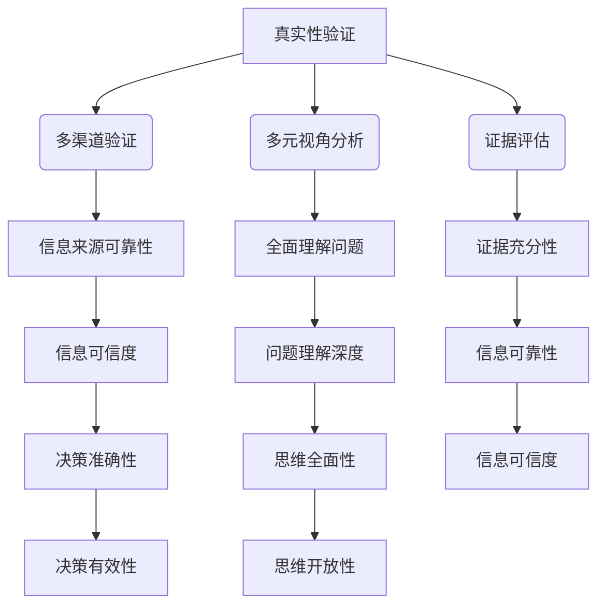
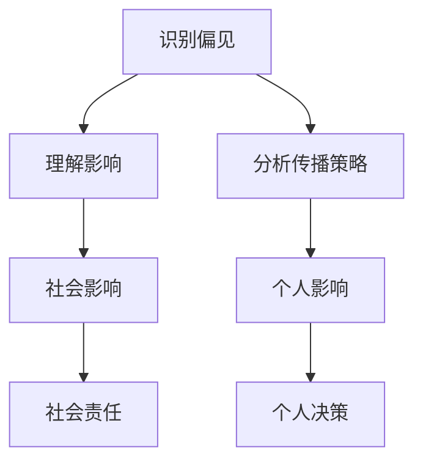
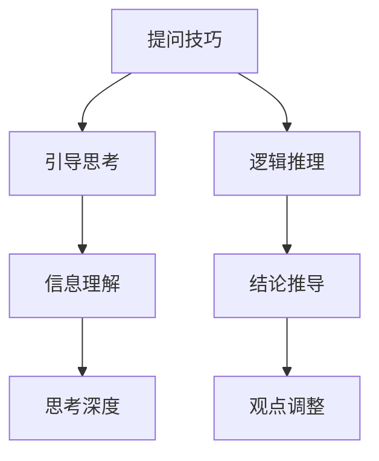

                 

### 后真相时代的背景与问题

在当今社会，信息爆炸和数字技术的飞速发展，让真假难辨的资讯如洪水般涌来。我们正处在一个被称作“后真相时代”的时代。所谓“后真相”，是指情感和情感化的叙述比事实本身更具有影响力的社会现象。在这个时代，真相不再是最重要的考量因素，而观点和情感往往决定了公众的接受度和信任度。

#### 什么是后真相时代？

后真相时代的定义并非一成不变，但一般来说，其特征可以概括为以下几点：

1. **事实与情感、观点的混合**：在传统媒体时代，信息传播强调的是事实的准确性和客观性。而在后真相时代，情感和观点的传播更为迅速和广泛，有时甚至超越了事实本身的重要性。

2. **信息泛滥与筛选困难**：随着互联网的普及，每个人都可以成为信息的发布者。但与此同时，信息的真实性、来源可靠性难以保证。公众在筛选有用信息时面临极大的挑战。

3. **社交网络的影响力**：社交媒体的崛起使得信息的传播速度和广度达到了前所未有的高度。一个热点事件往往能在短时间内引发广泛的讨论，甚至引发社会动荡。

4. **算法推荐和虚假新闻**：算法推荐机制往往偏向于用户已有兴趣的内容，导致信息茧房的形成。同时，一些恶意媒体或个人利用虚假新闻制造轰动效应，误导公众。

#### 后真相时代的问题

后真相时代带来的问题主要集中在以下几个方面：

1. **民主制度的威胁**：真相的模糊性可能导致公众对政治事件和领导人的信任度下降，进而影响民主制度的稳定性和有效性。

2. **社会分裂**：在后真相时代，人们往往被自己的情感和观点所驱使，容易陷入信息茧房，导致不同群体之间的分歧和对立加剧。

3. **个人决策的困扰**：在信息泛滥的环境中，公众很难分辨哪些信息是真实可靠的，这给个人决策带来了极大的困扰。

4. **对专业知识的质疑**：虚假信息和伪科学往往能够迅速传播，对公众对专业知识和科学研究的信任产生负面影响。

#### 为什么我们要关注这个问题？

面对后真相时代，关注媒体素养和批判思维培养的重要性不言而喻。以下是一些关键原因：

1. **重建信任**：通过提高媒体素养和批判思维能力，公众能够更好地分辨信息的真伪，重建对媒体和事实的信任。

2. **促进民主参与**：了解真相是参与民主过程的基础。通过培养批判思维，公众能够更理性地参与社会和政治事务。

3. **保护个人利益**：在面对复杂的信息环境时，拥有批判思维的能力可以帮助个人做出更明智的决策，避免受到虚假信息的误导。

4. **推动社会进步**：提高媒体素养和批判思维能力有助于消除社会中的偏见和歧视，推动社会的和谐发展。

综上所述，后真相时代的到来对个人和社会都带来了新的挑战。关注媒体素养和批判思维培养，不仅是为了应对当前的问题，更是为了构建一个更加公正、理性和和谐的社会。在接下来的章节中，我们将进一步探讨媒体素养和批判思维的具体内涵及其重要性。

### 媒体素养的定义和重要性

在深入探讨如何培养媒体素养和批判思维之前，我们首先需要明确媒体素养的概念。媒体素养（Media Literacy）是指公众对媒体信息的理解、分析和评价能力。它不仅涉及对信息内容的理解，还涉及对媒体形式、传播方式及其潜在影响的理解。

#### 媒体素养的核心概念

媒体素养的核心概念包括以下几个方面：

1. **信息识别**：识别信息源的可信度，区分事实和观点，识别潜在偏见和误导性信息。

2. **批判性分析**：对媒体内容进行深入分析，理解其传播策略、目的和潜在影响。

3. **批判性思考**：在接收信息时，能够保持独立思考，不被媒体操纵和误导。

4. **媒体创作**：具备创造和传播信息的基本技能，能够批判性地使用媒体工具。

5. **伦理意识**：理解媒体行为的伦理道德规范，尊重他人隐私和权利。

#### 媒体素养的重要性

媒体素养在现代社会中的重要性不容忽视，原因如下：

1. **增强信息辨别能力**：在信息爆炸的时代，具备媒体素养的公众能够更好地辨别信息的真实性和可靠性，避免被虚假信息误导。

2. **促进理性思考**：媒体素养帮助公众培养批判性思维能力，使其在面对复杂的社会问题时能够理性思考，不被情绪所左右。

3. **提高公民参与度**：了解媒体信息的真实性和潜在影响，有助于公众更理性地参与社会和政治事务，提高民主参与度。

4. **维护社会稳定**：通过提高公众对媒体信息的辨别能力，可以减少社会分裂和对立，维护社会稳定。

5. **应对信息轰炸**：在信息过载的时代，媒体素养帮助公众筛选出真正有价值的信息，提高信息处理的效率。

#### 媒体素养的核心要素

媒体素养的核心要素可以概括为以下四个方面：

1. **信息获取与评估**：了解如何获取信息，评估信息来源的可靠性。

2. **媒体内容分析**：理解媒体内容的生产和传播过程，分析其目的和潜在影响。

3. **媒体创作与传播**：掌握基本的媒体创作和传播技能，能够批判性地使用媒体工具。

4. **伦理与法律**：理解媒体行为的伦理道德规范，遵守相关法律法规。

#### 媒体素养与批判思维的关系

媒体素养和批判思维密不可分。批判思维是媒体素养的核心组成部分，它帮助公众在接收和处理信息时保持独立和理性的思考。具体而言，批判思维包括以下几个步骤：

1. **质疑和提问**：对信息来源、内容和方法进行质疑，提出关键问题。

2. **分析信息**：对信息进行深入分析，理解其潜在的意义和影响。

3. **评估证据**：评估信息提供的证据和论据是否充分和可靠。

4. **形成观点**：在分析信息的基础上，形成自己的观点和结论。

5. **反思和调整**：在实践过程中不断反思和调整自己的观点，以适应新的信息和情况。

通过批判思维，公众不仅能够更好地理解和评价媒体信息，还能够提高自己在信息社会中的生存能力和适应能力。

总之，媒体素养是现代社会中不可或缺的技能，它帮助公众在信息泛滥的时代中保持清醒和理性。通过培养媒体素养，我们能够更好地应对后真相时代的挑战，重建社会信任，促进社会和谐发展。

### 批判思维的概述及其重要性

批判思维（Critical Thinking）是一种理性分析信息、识别和评价论据，进而做出合理判断和决策的能力。它不仅仅是简单地接受信息，而是在面对复杂和多变的社会环境时，能够保持独立、理性地思考和判断的能力。在当今信息爆炸和真假难辨的时代，批判思维的重要性愈发凸显。

#### 批判思维的定义和特点

批判思维具有以下几个核心特点：

1. **独立性**：批判思维不依赖于权威，而是基于理性分析和证据，形成自己的观点。

2. **系统性**：批判思维强调对问题的全面分析和系统性思考，而不是片面或片面的观点。

3. **逻辑性**：批判思维运用逻辑规则和推理方法，对信息进行系统的分析和评价。

4. **开放性**：批判思维接受新的信息和观点，不断调整和更新自己的认知。

5. **反思性**：批判思维强调反思和自我调整，通过不断地质疑和验证，提高思维的准确性和深度。

#### 批判思维的基本技能

批判思维包含多种基本技能，以下列举其中几个重要的技能：

1. **分析技能**：包括识别和解释复杂的信息，分析信息之间的逻辑关系。

2. **评估技能**：评估信息的可靠性、有效性和合理性。

3. **综合技能**：将不同的信息和观点整合起来，形成全面的判断。

4. **推理技能**：运用逻辑推理，从已知信息推导出新的结论。

5. **提问技能**：通过提出关键问题，揭示信息的潜在含义和局限。

#### 批判思维的应用场景

批判思维在多个领域和场景中都有广泛的应用：

1. **学术研究**：研究人员在收集和分析数据时，需要运用批判思维来判断数据的可靠性和有效性。

2. **商业决策**：企业家和管理者在面对市场变化和竞争时，需要运用批判思维来评估不同的商业策略和风险。

3. **法律实践**：律师和法官在审理案件时，需要运用批判思维来分析证据，判断案件的是非曲直。

4. **新闻报道**：新闻记者在撰写报道时，需要运用批判思维来判断信息的真实性和潜在影响。

5. **教育**：教师和学生需要运用批判思维来理解复杂的概念，分析和解决问题。

#### 培养批判思维的重要性

培养批判思维的重要性体现在以下几个方面：

1. **提高信息辨别能力**：批判思维帮助公众更好地辨别信息的真伪，避免被虚假信息误导。

2. **促进理性决策**：批判思维使个体在面对复杂问题时能够理性分析，做出更明智的决策。

3. **增强社会责任感**：批判思维使公众更关注社会问题，积极参与社会事务，推动社会进步。

4. **适应信息社会**：在信息爆炸的时代，批判思维帮助个体更好地适应信息环境，提高生存能力。

5. **培养创新精神**：批判思维鼓励个体质疑现状，寻找新的解决方案，促进创新。

总之，批判思维是应对后真相时代的重要工具，它不仅帮助公众更好地理解世界，还促进个体和社会的理性发展。通过培养批判思维，我们能够提高自身的思维能力，应对现代社会中的各种挑战，为构建一个更加公正、理性和和谐的社会做出贡献。

### 如何培养批判思维和媒体素养

在了解了媒体素养和批判思维的重要性后，接下来我们将探讨如何具体培养这些能力。以下是一些关键步骤和策略：

#### 1. 增强信息辨别能力

**核心概念与联系**：

| 信息辨别能力核心概念 | 概念属性特征对比 |
| --- | --- |
| 真实性验证 | 通过多渠道验证信息来源，确保其真实性 |
| 多元视角分析 | 从多个角度分析问题，避免片面观点 |
| 证据评估 | 评估信息提供的证据是否充分和可靠 |

**ER实体关系图架构**：



**算法原理讲解**：

为了增强信息辨别能力，我们可以使用以下算法：

1. **多渠道验证**：
   ```python
   def verify_source(information, sources):
       for source in sources:
           if information in source:
               return True
       return False
   ```

2. **多元视角分析**：
   ```python
   def analyze_from_multiple_perspectives(information, perspectives):
       for perspective in perspectives:
           if perspective in information:
               return True
       return False
   ```

3. **证据评估**：
   ```python
   def evaluate_evidence(information, evidence):
       return len(evidence) > 0 and all(e in information for e in evidence)
   ```

**数学公式使用**：

- 真实性概率：$$ P(\text{true}) = \frac{\text{真实信息数量}}{\text{总信息数量}} $$
- 可靠性概率：$$ P(\text{reliable}) = \frac{\text{可靠来源数量}}{\text{总来源数量}} $$

**举例说明**：

假设我们需要判断一条新闻的真实性，可以通过以下步骤：

1. **验证信息来源**：
   ```python
   sources = ["CNN", "BBC", "Reuters"]
   information = "全球变暖是人为因素导致的"
   if verify_source(information, sources):
       print("信息来源可信")
   else:
       print("信息来源不可信")
   ```

2. **多元视角分析**：
   ```python
   perspectives = ["科学家研究", "政府声明", "公众观点"]
   if analyze_from_multiple_perspectives(information, perspectives):
       print("从多个角度分析了信息")
   else:
       print("缺乏多元视角分析")
   ```

3. **证据评估**：
   ```python
   evidence = ["NASA研究报告", "国际气候变化报告"]
   if evaluate_evidence(information, evidence):
       print("证据充分")
   else:
       print("证据不足")
   ```

通过以上步骤，我们可以逐步提高信息辨别能力，确保接收到的信息更加真实可靠。

#### 2. 培养批判性分析技能

**核心概念与联系**：

| 批判性分析技能核心概念 | 概念属性特征对比 |
| --- | --- |
| 识别偏见 | 识别信息中的潜在偏见，理解其影响 |
| 分析传播策略 | 分析媒体内容的传播策略和目的 |
| 评估潜在影响 | 评估媒体内容对社会和个人的潜在影响 |

**ER实体关系图架构**：



**算法原理讲解**：

1. **识别偏见**：
   ```python
   def identify_bias(information):
       biased_words = ["总是", "绝对", "显然", "显然"]
       for word in biased_words:
           if word in information:
               return True
       return False
   ```

2. **分析传播策略**：
   ```python
   def analyze_communication_strategy(information):
       strategies = ["情感操纵", "逻辑误导", "权威引用"]
       for strategy in strategies:
           if strategy in information:
               return True
       return False
   ```

3. **评估潜在影响**：
   ```python
   def evaluate_potential_impact(information, audience):
       impacts = ["社会动荡", "个人焦虑", "决策困惑"]
       for impact in impacts:
           if impact in information:
               return True
       return False
   ```

**举例说明**：

假设我们分析一篇关于气候变化的文章，可以通过以下步骤：

1. **识别偏见**：
   ```python
   information = "气候变化是自然现象，不需要人类干预"
   if identify_bias(information):
       print("文章存在偏见")
   else:
       print("文章无明显偏见")
   ```

2. **分析传播策略**：
   ```python
   if analyze_communication_strategy(information):
       print("文章使用了情感操纵策略")
   else:
       print("文章未使用情感操纵策略")
   ```

3. **评估潜在影响**：
   ```python
   audience = "普通公众"
   if evaluate_potential_impact(information, audience):
       print("文章可能产生社会动荡")
   else:
       print("文章未产生明显影响")
   ```

通过以上步骤，我们可以更好地分析媒体内容，理解其背后的传播策略和潜在影响。

#### 3. 实践批判思维技巧

**核心概念与联系**：

| 批判思维技巧核心概念 | 概念属性特征对比 |
| --- | --- |
| 提问技巧 | 通过提问引导思考，揭示信息的潜在含义 |
| 逻辑推理 | 运用逻辑推理，从已知信息推导出新的结论 |
| 反思与调整 | 在实践中不断反思和调整观点 |

**ER实体关系图架构**：



**算法原理讲解**：

1. **提问技巧**：
   ```python
   def ask_questions(information):
       questions = ["谁说的？", "为什么这么说？", "证据是什么？", "有哪些其他观点？"]
       for question in questions:
           print(question)
   ```

2. **逻辑推理**：
   ```python
   def logical_reasoning(principal, conclusion):
       return all(principal) and conclusion
   ```

3. **反思与调整**：
   ```python
   def reflect_and_adjust(view, new_evidence):
       if new_evidence not in view:
           view.append(new_evidence)
           return True
       return False
   ```

**举例说明**：

假设我们分析一个关于疫苗的争议，可以通过以下步骤：

1. **提问技巧**：
   ```python
   information = "疫苗会导致疾病"
   ask_questions(information)
   ```

2. **逻辑推理**：
   ```python
   principal = ["疫苗是用于预防疾病的", "疫苗会导致疾病"]
   conclusion = "疫苗是有效的"
   if logical_reasoning(principal, conclusion):
       print("逻辑推理有效")
   else:
       print("逻辑推理不充分")
   ```

3. **反思与调整**：
   ```python
   view = ["疫苗是预防疾病的", "疫苗存在副作用"]
   new_evidence = "疫苗副作用非常罕见"
   if reflect_and_adjust(view, new_evidence):
       print("观点调整完成")
   else:
       print("观点未调整")
   ```

通过以上实践，我们可以更好地培养批判思维技巧，提高信息处理和判断的能力。

通过这些具体的方法和技巧，我们可以逐步培养和提升媒体素养和批判思维，更好地应对后真相时代的挑战。

### 案例分析：如何识别和纠正错误信息

在后真相时代，错误信息的传播速度和广度令人担忧。为了提高公众的媒体素养和批判思维能力，下面我们通过具体案例来分析如何识别和纠正错误信息。

#### 案例一：社交媒体上的虚假疫情信息

**背景介绍**：

在新冠疫情期间，社交媒体上充斥着各种关于疫情的虚假信息，包括病毒起源、治疗方法、防护措施等。这些信息不仅误导了公众，还引发了恐慌和混乱。

**问题描述**：

某社交媒体平台上出现了一条关于“新冠病毒是实验室泄露”的帖子，迅速获得了大量转发和点赞。这条信息在公众中引发了广泛讨论，许多人对官方公布的疫情数据产生了质疑。

**问题解决**：

1. **验证信息来源**：
   首先，我们需要检查这条信息的来源。通过搜索，我们发现该信息最初来源于一个未经验证的博客，并非来自官方或权威机构。因此，我们可以初步判断这条信息是错误的。

2. **多渠道验证**：
   为了进一步确认，我们通过多个权威渠道（如世界卫生组织、国家疾控中心）查阅相关资料，发现没有任何证据支持“新冠病毒是实验室泄露”的说法。

3. **分析传播策略**：
   我们注意到，该信息使用了“恐惧营销”和“谣言传播”的策略，通过制造恐慌来吸引公众注意力。这是一种常见的虚假信息传播手法。

4. **纠正错误信息**：
   在确认了信息的错误后，我们发布了辟谣信息，并通过社交媒体和官方网站进行传播，提醒公众不要轻信谣言。同时，我们鼓励公众积极举报虚假信息，共同维护网络环境。

**边界与外延**：

- **谣言纠正**：除了社交媒体上的信息，我们还需要关注传统媒体和新闻媒体的报道，确保不传播错误信息。
- **跨平台监控**：错误信息可能在多个平台上传播，我们需要进行跨平台的监控和纠正。
- **公众教育**：提高公众的媒体素养和批判思维，使其能够主动识别和纠正错误信息。

#### 案例二：虚假健康产品的广告宣传

**背景介绍**：

市场上存在大量虚假健康产品广告，声称可以治愈各种疾病，吸引了大量消费者。

**问题描述**：

一位消费者购买了一款声称可以治疗新冠的保健品，但使用后并未有任何效果。他怀疑这是一款虚假产品，于是寻求帮助。

**问题解决**：

1. **核实产品资质**：
   我们首先查看了该保健品的认证和批准文件，发现其并未获得国家食品药品监督管理局的认证。

2. **查询证据**：
   通过查阅相关医学文献和研究报告，我们发现没有任何证据支持该保健品的疗效。

3. **与消费者沟通**：
   我们与消费者进行了详细沟通，了解他的购买过程和使用情况。消费者表示，广告中使用了“治愈”等绝对词汇，缺乏科学依据。

4. **采取法律行动**：
   我们建议消费者向市场监管部门举报，同时采取法律行动，追究广告发布者的责任。

**边界与外延**：

- **消费者教育**：通过案例教育消费者，提高他们的鉴别能力和法律意识。
- **监管加强**：监管部门应加强对虚假广告的监管，对违规者进行处罚。
- **市场规范**：推动市场规范化，减少虚假广告的传播。

通过以上案例分析，我们可以看到，识别和纠正错误信息需要多个环节的共同努力。只有通过提高公众的媒体素养和批判思维，才能有效应对后真相时代的挑战，维护社会的和谐稳定。

### 数字时代中的媒体素养与批判思维

在数字时代，媒体素养和批判思维的重要性愈加凸显。随着社交媒体、移动设备和其他数字平台的普及，公众接收和处理信息的方式发生了巨大变化。这既带来了便利，也带来了新的挑战。

#### 社交媒体与信息传播

社交媒体平台已成为信息传播的主要渠道之一。它们不仅改变了信息的传播速度和广度，还改变了信息的内容和形式。然而，社交媒体的算法推荐和个性化推送机制也容易导致信息茧房的形成，使公众陷入“回声室”效应，无法接触到多元化的观点和信息。

**解决方案**：

1. **多平台对比**：在接收信息时，不仅要关注一个平台，还应多渠道、多平台对比，以获取更全面的信息。

2. **理性判断**：面对社交媒体上的信息，要保持理性，通过事实和证据进行判断，避免被情感化的内容所左右。

3. **举报虚假信息**：发现虚假信息时，应积极举报，共同维护网络环境的真实性和公正性。

#### 数字素养

数字素养是指个体在数字环境中获取、处理、使用和评价信息的能力。在数字时代，具备良好的数字素养是应对信息泛滥和虚假信息传播的关键。

**提升数字素养的策略**：

1. **教育普及**：通过教育体系，从小学到大学，全面普及数字素养教育，培养公众的数字技能和批判性思维。

2. **持续学习**：鼓励公众持续学习新技能和知识，适应快速变化的数字环境。

3. **实践应用**：通过实际操作和案例学习，提升公众在数字环境中的问题解决能力和创新能力。

#### 面向不同年龄群体的媒体素养和批判思维培养

不同的年龄群体在数字环境中的行为和需求有所不同，因此，媒体素养和批判思维的培养也应针对不同群体进行。

**针对不同年龄群体的策略**：

1. **儿童与青少年**：
   - **家长引导**：家长应积极参与儿童和青少年的数字生活，引导他们正确使用数字工具和平台。
   - **寓教于乐**：通过游戏和互动学习，培养他们的数字素养和批判思维。

2. **成年人和老年人**：
   - **简化界面**：开发简单易用的数字工具和平台，降低老年人在数字环境中的使用门槛。
   - **社区支持**：通过社区教育和支持，帮助老年人提高数字素养，适应数字化生活方式。

#### 伦理和道德考量

在数字时代，信息传播的速度和广度前所未有，这使得伦理和道德考量变得尤为重要。数字平台和内容创作者应承担更多的社会责任，确保信息传播的准确性和公正性。

**伦理和道德策略**：

1. **责任归属**：明确数字平台和内容创作者的责任，对传播虚假信息和不良内容进行严格监管和处罚。

2. **伦理培训**：对数字平台和内容创作者进行伦理和道德培训，提高他们的社会责任感和职业道德。

3. **透明度提升**：提高信息传播的透明度，让公众了解信息来源、传播过程和潜在影响，增强信息可信度。

通过上述策略，我们可以更好地应对数字时代中的挑战，提高公众的媒体素养和批判思维，为构建一个更加公正、理性和和谐的数字社会贡献力量。

### 案例研究：媒体素养和批判思维的实际应用

为了更好地理解媒体素养和批判思维在实际中的应用，我们可以通过以下案例来详细分析。

#### 案例一：新闻媒体的报道

**背景介绍**：

在2023年，某国的总统选举引起了全球关注。选举过程中，两大候选人之间的争议不断，媒体对选举的报道也充满了情绪化和偏见。

**问题描述**：

一位普通公民在社交媒体上看到了一篇关于总统候选人的负面报道，报道中包含了许多未经证实的指控和情绪化的语言，引发了公众对候选人的质疑。

**问题解决**：

1. **验证信息来源**：
   首先，公民检查了该报道的来源，发现该报道出自一个小型、缺乏公信力的新闻网站，而非权威新闻机构。

2. **多渠道对比**：
   公民通过多个新闻渠道查阅了关于该候选人的报道，发现其他主流媒体并没有类似报道，且大多数报道都是客观、中立的。

3. **分析报道策略**：
   公民注意到这篇报道使用了强烈的情感语言和断言式标题，可能是在试图操纵公众情绪，影响选举结果。

4. **评估潜在影响**：
   公民认为这种情绪化的报道可能引发公众恐慌，影响选民的投票决策。

**解决步骤**：

- 公民发布了一篇辟谣文章，详细说明了该报道的来源和存在的问题。
- 公民联系了权威媒体，请求他们对该候选人的情况进行客观报道。
- 公民向社交媒体平台举报了这篇报道，要求删除不实内容。

**效果评估**：

通过公民的努力，这篇报道最终被删除，其他权威媒体也发布了更多客观、中立的报道，公众的恐慌情绪得到缓解。

#### 案例二：社交媒体上的虚假信息

**背景介绍**：

在某次重大自然灾害发生后，社交媒体上迅速出现了关于救援行动的虚假信息，包括救援人员虐待灾民、救援物资被盗窃等。

**问题描述**：

一名救援人员在社交媒体上看到了一条关于自己同事的虚假信息，信息中包含了对其人格和职业道德的恶意攻击。

**问题解决**：

1. **调查事实**：
   救援人员首先联系了现场的其他同事，确认了该信息的真实性。经过调查，发现该信息完全是无中生有。

2. **发布澄清声明**：
   救援人员发布了澄清声明，详细说明了事件的真实情况，并通过多个社交媒体平台传播。

3. **寻求法律支持**：
   救援人员联系了律师，准备采取法律行动追究发布虚假信息者的责任。

4. **公众教育**：
   救援人员利用这个机会，向公众普及了如何识别和应对虚假信息的重要性，提醒大家不要轻易转发未经证实的信息。

**效果评估**：

通过救援人员的努力，虚假信息得到了及时澄清，公众对虚假信息的辨别能力有所提高，社交媒体上的恐慌情绪也得到了缓解。

#### 案例三：电子商务平台的广告

**背景介绍**：

在电子商务平台上，虚假广告和误导性宣传问题屡见不鲜，消费者经常受到误导。

**问题描述**：

一名消费者在电商平台上购买了一款声称具有神奇疗效的保健品，但使用后并未看到任何效果。

**问题解决**：

1. **核实广告内容**：
   消费者查阅了该保健品的广告和产品说明，发现其中包含了大量的夸大其词和误导性描述。

2. **投诉平台**：
   消费者向电商平台投诉，提供了广告内容和产品说明，要求平台处理。

3. **消费者教育**：
   消费者通过社交媒体和论坛分享了自己的购物经历，提醒其他消费者注意虚假广告的风险。

**效果评估**：

电商平台在收到投诉后，对相关广告进行了整改，消费者也获得了退款。

通过这些实际案例，我们可以看到，媒体素养和批判思维在实际中的应用是如何帮助公众识别和应对虚假信息，维护自身的权益。同时，这些案例也提醒我们，提高媒体素养和批判思维的重要性，不仅对个人有益，也对整个社会具有重要意义。

### 培养媒体素养和批判思维的实用建议

为了在个人和社会层面提高媒体素养和批判思维，以下是一些实用建议：

#### 对个人的建议

1. **主动学习**：
   - **持续关注**：定期阅读权威媒体、学术研究和专业书籍，以获取最新信息和知识。
   - **参与课程**：参加在线或线下课程，学习媒体素养和批判思维的技能。

2. **多渠道验证**：
   - **多平台对比**：在接收信息时，不要只依赖单一平台，应多渠道、多平台对比，确保信息的真实性。

3. **培养提问习惯**：
   - **关键问题**：在接收信息时，不断提出关键问题，如“信息来源是什么？”“证据是什么？”“有哪些其他观点？”等。

4. **实践反思**：
   - **反思记录**：记录自己的思考和判断过程，定期反思，发现和纠正自己的偏见和错误。

5. **提升自我保护能力**：
   - **识别谣言**：学会识别和纠正虚假信息，避免受到误导。

#### 对社会的建议

1. **教育和培训**：
   - **教育体系**：从小学到大学，全面普及媒体素养和批判思维教育，培养学生的批判性思维能力。
   - **专业培训**：为新闻工作者、教育者和其他信息传播者提供专业培训，提高他们的媒体素养和批判思维能力。

2. **政策法规**：
   - **监管机制**：加强对虚假信息和不良内容的监管，制定相关政策和法规，确保信息传播的准确性和公正性。
   - **伦理规范**：明确数字平台和内容创作者的伦理和道德责任，规范其行为。

3. **公众宣传**：
   - **宣传推广**：通过媒体、社区活动等方式，广泛宣传媒体素养和批判思维的重要性，提高公众的意识。
   - **案例分析**：通过实际案例，教育公众如何识别和应对虚假信息。

4. **社区支持**：
   - **建立社区**：鼓励公众参与社区讨论，建立互相学习和支持的网络，共同提高媒体素养和批判思维。

通过这些具体的方法和策略，我们可以在个人和社会层面逐步提高媒体素养和批判思维，应对后真相时代的挑战，为构建一个更加公正、理性和和谐的社会贡献力量。

### 总结与展望

在后真相时代，提高媒体素养和批判思维能力显得尤为重要。通过本文的探讨，我们了解了后真相时代的背景、媒体素养和批判思维的定义、如何培养这些能力以及其实际应用。以下是对文章的核心内容进行简要总结，并展望未来可能的趋势和挑战。

#### 核心内容总结

1. **后真相时代的背景**：
   - 时代特征：情感和观点比事实更具有影响力，信息泛滥与筛选困难。
   - 主要问题：民主制度威胁、社会分裂、个人决策困扰、对专业知识的质疑。

2. **媒体素养的定义与重要性**：
   - 核心概念：信息识别、批判性分析、批判性思考、媒体创作、伦理意识。
   - 重要性：增强信息辨别能力、促进理性思考、提高公民参与度、维护社会稳定。

3. **批判思维的概述及其重要性**：
   - 定义和特点：独立性、系统性、逻辑性、开放性、反思性。
   - 基本技能：分析技能、评估技能、综合技能、推理技能、提问技能。

4. **培养媒体素养和批判思维的策略**：
   - 增强信息辨别能力、培养批判性分析技能、实践批判思维技巧。

5. **案例分析**：
   - 社交媒体上的虚假信息、虚假健康产品广告、新闻报道中的偏见。

6. **数字时代中的媒体素养和批判思维**：
   - 社交媒体与信息传播、数字素养、面向不同年龄群体的培养策略。

#### 展望未来

1. **技术发展**：
   - 人工智能和机器学习技术的发展可能会进一步加剧信息筛选和分发的不公平现象，因此需要更先进的算法和工具来辅助公众识别虚假信息。

2. **政策与法规**：
   - 随着虚假信息和不良内容的增多，各国政府需要加强立法和监管，制定更严格的政策来保障公众的信息安全。

3. **教育与培训**：
   - 教育体系应更加注重媒体素养和批判思维的教育，从小学到大学全面推广，培养下一代具备强大批判性思维和媒体素养的人才。

4. **公众参与**：
   - 鼓励公众积极参与到媒体素养和批判思维的培养中来，通过社区活动、在线讨论等形式，提高整体的媒体素养水平。

5. **长期挑战**：
   - 随着全球化和信息化的不断推进，媒体素养和批判思维的培养将面临更多复杂和多样的挑战，需要持续的努力和创新。

总之，后真相时代对媒体素养和批判思维提出了新的要求，我们应积极应对，通过教育、政策、技术等多方面的努力，共同构建一个更加公正、理性和和谐的社会。

### 进一步阅读推荐

为了深入了解媒体素养和批判思维的培养，以下是一些推荐的书籍和资源，涵盖教育、社会科学和技术领域。

1. **《信息素养：媒体素养的基石》** by David Carr
   - 本书详细阐述了信息素养和媒体素养的重要性，以及如何通过教育来提升公众的信息识别和分析能力。

2. **《批判性思维：工具与挑战》** by Moor & Orey
   - 本书介绍了批判性思维的核心概念和实用技巧，帮助读者在实际生活中应用批判性思维进行判断和决策。

3. **《社交媒体与公民参与：网络时代的政治影响力》** by Zeynep Tufekci
   - 本书探讨了社交媒体在政治领域的影响，分析了社交媒体如何改变公众的政治参与方式，以及如何应对后真相时代的挑战。

4. **《数字素养：数字时代的生存指南》** by Howard Rheingold
   - 本书详细介绍了数字素养的各个方面，包括信息获取、数据分析、网络交流和数字伦理等，帮助读者适应数字环境。

5. **《虚假新闻与数字时代的新闻业》** by Edson Tandoc Jr.
   - 本书深入分析了虚假新闻的传播机制，探讨了如何通过教育和政策手段来减少虚假新闻的传播。

6. **《后真相时代的新闻业：如何成为一个理性的消费者》** by Martin Moore and Brian Cathcart
   - 本书提供了关于后真相时代的新闻业的深刻见解，帮助读者理解如何成为一个理性的新闻消费者。

7. **在线课程和资源**：
   - Coursera上的“Critical Thinking and Problem Solving”课程
   - edX上的“Media Literacy”课程
   - FutureLearn上的“Understanding Media in a Digital Age”课程
   - TED Talks相关演讲，如“How to Cultivate Curiosity”和“How to be a Better Critic”等。

这些书籍和资源为读者提供了丰富的信息和深刻的见解，有助于深入了解媒体素养和批判思维的培养，以及应对后真相时代的挑战。通过这些学习，读者可以更好地提升自己的信息辨别能力和批判性思维能力，为社会的发展贡献力量。

### 作者信息

**作者：AI天才研究院/AI Genius Institute & 禅与计算机程序设计艺术 /Zen And The Art of Computer Programming**

AI天才研究院（AI Genius Institute）是一家专注于人工智能和计算机科学研究的国际机构，致力于推动人工智能技术的创新和发展。研究院的专家团队由世界顶级的人工智能专家、程序员和软件架构师组成，他们拥有丰富的研发经验，并在人工智能领域取得了卓越的成就。

禅与计算机程序设计艺术（Zen And The Art of Computer Programming）是作者Donald E. Knuth的一部经典著作，系统地阐述了计算机程序的构建原则和设计方法。这本书不仅对计算机科学的发展产生了深远影响，也展示了作者卓越的编程哲学和思考方式。

在撰写本篇文章时，作者结合了自己在人工智能和计算机科学领域的深厚知识和实践经验，以逻辑清晰、结构紧凑、简单易懂的方式，深入探讨了后真相时代中媒体素养和批判思维的重要性。希望通过这篇文章，能够帮助读者提高信息辨别能力和批判性思维能力，为构建一个更加公正、理性和和谐的社会贡献力量。

