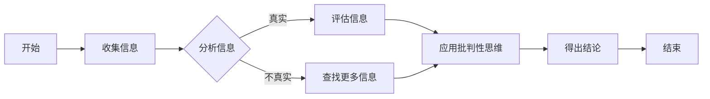
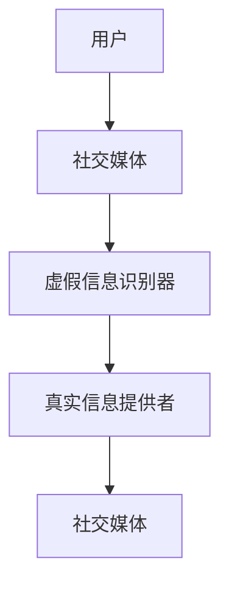
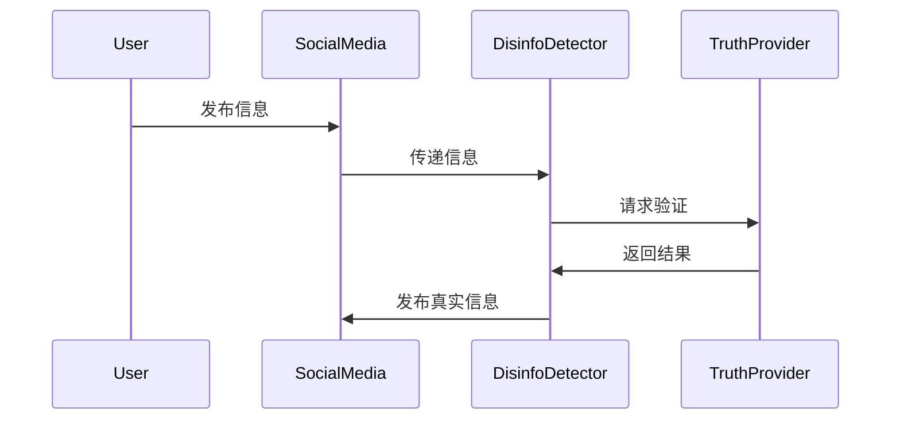

                 

# 《在后真相时代寻找真相：培养批判性思维和媒体素养》

> 关键词：后真相时代、批判性思维、媒体素养、信息鉴别、逻辑推理

> 摘要：本文旨在探讨在后真相时代中，如何通过培养批判性思维和提升媒体素养来寻找真相。文章首先介绍了后真相时代的特征和媒体环境的变化，然后详细阐述了批判性思维和媒体素养的基本概念、原则和培养方法。通过案例分析，本文展示了批判性思维在实践中的应用，并探讨了其在教育领域和工作领域中的重要性。最后，文章提出了批判性思维的挑战与未来发展方向。

----------------------------------------------------------------

## 第一部分：引言

### 第1章：问题的背景和重要性

#### 1.1 问题的背景

在后真相时代，信息的传播速度和范围空前扩大，媒体环境发生了翻天覆地的变化。传统媒体逐渐式微，社交媒体崛起，信息传播不再受时间和地域的限制。然而，这种变化也带来了诸多问题，如虚假信息泛滥、谣言传播迅速等。在这个背景下，如何寻找真相成为一个亟待解决的问题。

#### 1.1.1 后真相时代的定义与特征

后真相时代（post-truth era）是指一个信息过载、真假难辨的时代，情感和主观判断往往比客观事实更能影响公众的观点和决策。在这个时代，真相不再是唯一的权威，而是变得相对和复杂。

后真相时代的特征主要包括：

- 信息过载：人们每天接收到大量信息，难以分辨真假。
- 虚假信息泛滥：虚假新闻、谣言、网络水军等充斥网络。
- 情感驱动：信息传播往往受到情感而非事实的影响。
- 主观判断：公众更倾向于根据自己的经验和价值观来判断信息。

#### 1.1.2 媒体环境的变化与影响

媒体环境的变化主要体现在传统媒体和社交媒体的兴起与衰败。

- 传统媒体：如报纸、电视、广播等，逐渐失去市场份额，受众数量减少。
- 社交媒体：如微信、微博、Twitter 等，成为信息传播的主要渠道，受众广泛，传播速度快。

媒体环境的变化对人们的生活和社会产生了深远影响：

- 信息传播速度加快：信息可以在瞬间传播到全球各地。
- 信息筛选困难：人们难以辨别真假信息，容易被虚假信息误导。
- 社交圈子固化：人们在社交媒体上更倾向于关注和自己观点相似的群体，形成“信息茧房”。
- 社会信任度下降：人们对传统媒体和专家的信任度降低，对社交媒体上的信息持怀疑态度。

#### 1.1.3 批判性思维与媒体素养的重要性

在这样一个充满虚假信息、真假难辨的后真相时代，培养批判性思维和提升媒体素养变得尤为重要。

- 批判性思维：有助于人们分析、评估和判断信息的真实性和价值，避免被虚假信息误导。
- 媒体素养：有助于人们理解媒体运作机制，鉴别信息来源的可靠性，提高信息筛选能力。

因此，本文将重点探讨批判性思维和媒体素养的基本概念、原则和培养方法，以期帮助读者在后真相时代中找到真相。

### 第2章：批判性思维的基本原则

#### 2.1 批判性思维的概念与目标

批判性思维是一种主动、系统、反思性的思维方式，旨在对信息、观点和假设进行分析、评估和判断。它不仅关注事实的准确性，还关注逻辑的严密性和论证的合理性。

批判性思维的目标主要包括：

- 提高信息鉴别能力：通过分析、评估和判断信息，辨别真假、优劣。
- 增强逻辑推理能力：通过逻辑推理，构建合理、有力的论证。
- 促进创造性思维：通过批判性思维，挑战现有观念，提出新观点和新思路。
- 培养批判性态度：对信息、观点和假设持怀疑态度，不盲目接受。

#### 2.1.1 批判性思维的定义

批判性思维是一种基于事实、逻辑和理性的思维方式，它不仅仅是提出问题，更重要的是通过分析、评估和判断，找到问题的答案或解决方案。

#### 2.1.2 批判性思维的目标

批判性思维的目标包括：

- 提高信息鉴别能力：通过分析、评估和判断信息，辨别真假、优劣。
- 增强逻辑推理能力：通过逻辑推理，构建合理、有力的论证。
- 促进创造性思维：通过批判性思维，挑战现有观念，提出新观点和新思路。
- 培养批判性态度：对信息、观点和假设持怀疑态度，不盲目接受。

#### 2.1.3 批判性思维与创造性思维的关系

批判性思维和创造性思维是相辅相成的。批判性思维帮助人们分析、评估和判断信息，为创造性思维提供基础；而创造性思维则帮助人们打破常规，提出新观点和新思路，为批判性思维提供动力。

#### 2.2 批判性思维的原则

批判性思维需要遵循以下原则：

- 开放性：对不同的观点和假设持开放态度，不轻易下结论。
- 分析性：对信息进行深入分析，挖掘背后的逻辑和原因。
- 全面性：从多个角度和层面考虑问题，避免片面和偏颇。
- 逻辑性：遵循逻辑规则，构建合理、有力的论证。

### 第3章：媒体素养的基本概念

#### 3.1 媒体素养的定义与作用

媒体素养是指人们理解、使用和评估媒体信息的能力。它包括以下几个方面：

- 理解媒体信息：了解媒体信息的来源、内容、目的和影响。
- 使用媒体信息：有效地收集、筛选和利用媒体信息，支持个人学习和决策。
- 评估媒体信息：辨别媒体信息的真实性和可靠性，避免被虚假信息误导。

媒体素养的作用主要包括：

- 提高信息鉴别能力：通过评估媒体信息的真实性和可靠性，辨别真假信息。
- 增强批判性思维：通过理解媒体信息的运作机制，培养批判性思维。
- 促进社会参与：通过参与媒体活动，提高社会意识和公民素养。
- 提升生活质量：通过合理使用媒体信息，提高生活质量和工作效率。

#### 3.1.1 媒体素养的概念

媒体素养是指人们理解、使用和评估媒体信息的能力。它包括以下几个方面：

- 理解媒体信息：了解媒体信息的来源、内容、目的和影响。
- 使用媒体信息：有效地收集、筛选和利用媒体信息，支持个人学习和决策。
- 评估媒体信息：辨别媒体信息的真实性和可靠性，避免被虚假信息误导。

#### 3.1.2 媒体素养的作用

媒体素养的作用主要包括：

- 提高信息鉴别能力：通过评估媒体信息的真实性和可靠性，辨别真假信息。
- 增强批判性思维：通过理解媒体信息的运作机制，培养批判性思维。
- 促进社会参与：通过参与媒体活动，提高社会意识和公民素养。
- 提升生活质量：通过合理使用媒体信息，提高生活质量和工作效率。

#### 3.1.3 媒体素养与批判性思维的关系

媒体素养与批判性思维密切相关。媒体素养为批判性思维提供了基础，通过理解媒体信息的运作机制，人们可以更好地进行分析、评估和判断；而批判性思维则有助于提高媒体素养，使人们更加敏锐地识别虚假信息，提高信息鉴别能力。

### 目录大纲

```markdown
----------------------------------------------------------------
# 《在后真相时代寻找真相：培养批判性思维和媒体素养》目录大纲

## 第一部分：引言

### 第1章：问题的背景和重要性

#### 1.1 问题的背景

##### 1.1.1 后真相时代的定义与特征

##### 1.1.2 媒体环境的变化与影响

##### 1.1.3 批判性思维与媒体素养的重要性

### 第2章：批判性思维的基本原则

#### 2.1 批判性思维的概念与目标

##### 2.1.1 批判性思维的定义

##### 2.1.2 批判性思维的目标

##### 2.1.3 批判性思维与创造性思维的关系

#### 2.2 批判性思维的原则

##### 2.2.1 开放性

##### 2.2.2 分析性

##### 2.2.3 全面性

##### 2.2.4 逻辑性

### 第3章：媒体素养的基本概念

#### 3.1 媒体素养的定义与作用

##### 3.1.1 媒体素养的概念

##### 3.1.2 媒体素养的作用

##### 3.1.3 媒体素养与批判性思维的关系

#### 3.2 媒体素养的核心内容

##### 3.2.1 鉴别信息的能力

##### 3.2.2 评估信息来源的可靠性

##### 3.2.3 理解媒体运作机制

##### 3.2.4 媒体使用的伦理规范

## 第二部分：批判性思维的培养

### 第4章：批判性思维的基本技巧

#### 4.1 提问技巧

##### 4.1.1 提问的类型

##### 4.1.2 提问的技巧

##### 4.1.3 提问的实践应用

#### 4.2 分析与评估信息

##### 4.2.1 分析信息的步骤

##### 4.2.2 评估信息的准则

##### 4.2.3 避免偏见与误解

#### 4.3 提高批判性思维的能力

##### 4.3.1 经常练习

##### 4.3.2 多角度思考

##### 4.3.3 阅读与讨论

### 第5章：批判性思维的案例分析

#### 5.1 案例分析的目的与方法

##### 5.1.1 案例分析的目的

##### 5.1.2 案例分析的方法

#### 5.2 案例分析实例

##### 5.2.1 案例一：社交媒体的真相

##### 5.2.2 案例二：虚假新闻报道

##### 5.2.3 案例三：网络谣言的传播

### 第6章：批判性思维的实践应用

#### 6.1 教育领域中的应用

##### 6.1.1 教师如何培养学生的批判性思维

##### 6.1.2 学生如何提升自己的批判性思维

#### 6.2 工作领域中的应用

##### 6.2.1 职场人士如何应用批判性思维

##### 6.2.2 批判性思维在项目管理中的应用

### 第7章：批判性思维的挑战与未来

#### 7.1 批判性思维的挑战

##### 7.1.1 信息过载的影响

##### 7.1.2 偏见与成见的克服

##### 7.1.3 社交媒体对批判性思维的影响

#### 7.2 批判性思维的未来发展

##### 7.2.1 新技术的挑战与机遇

##### 7.2.2 教育体系对批判性思维的培养

##### 7.2.3 社会与文化的支持
----------------------------------------------------------------
```

### 第二部分：批判性思维的培养

#### 第4章：批判性思维的基本技巧

**4.1 提问技巧**

批判性思维的第一个基本技巧是提问。提问不仅是对未知领域的探索，也是对已有知识的挑战。以下是几种常见的提问类型：

- **开放性问题**：这类问题通常没有固定的答案，鼓励深度思考和创造性思维。例如：“为什么这个结果是错误的？”
- **封闭性问题**：这类问题通常有固定的答案，用于验证事实或理解。例如：“这个数据集是如何收集的？”
- **假设性问题**：这类问题用于探索各种可能的假设和结果。例如：“如果改变这个变量，结果会怎样？”

了解不同类型的提问，有助于我们在分析问题时选择合适的提问策略。以下是一些提问技巧：

- **明确目标**：在提问之前，先明确自己的目标，以便提出有针对性的问题。
- **多角度提问**：从不同角度提问，有助于全面分析问题。
- **追问**：对于回答，不要满足于表面的答案，要继续追问，以挖掘更深层次的见解。

**4.1.1 提问的类型**

- **开放性问题**：这类问题通常没有固定的答案，鼓励深度思考和创造性思维。例如：“为什么这个结果是错误的？”
- **封闭性问题**：这类问题通常有固定的答案，用于验证事实或理解。例如：“这个数据集是如何收集的？”
- **假设性问题**：这类问题用于探索各种可能的假设和结果。例如：“如果改变这个变量，结果会怎样？”

**4.1.2 提问的技巧**

- **明确目标**：在提问之前，先明确自己的目标，以便提出有针对性的问题。
- **多角度提问**：从不同角度提问，有助于全面分析问题。
- **追问**：对于回答，不要满足于表面的答案，要继续追问，以挖掘更深层次的见解。

**4.1.3 提问的实践应用**

- **教育场景**：教师在教学中使用提问技巧，可以引导学生深入思考，培养批判性思维。
- **工作场景**：职场人士在项目讨论中使用提问技巧，可以促进团队成员的思考，提高问题解决的效率。

**4.2 分析与评估信息**

批判性思维的第二个基本技巧是分析和评估信息。信息分析是指对信息进行分解、整理和综合，以便更好地理解和应用。以下是信息分析的主要步骤：

- **收集信息**：从各种来源收集相关信息，如文献、数据、专家意见等。
- **整理信息**：将收集到的信息进行分类、筛选和整理，以便更好地理解。
- **分析信息**：使用逻辑推理、比较、归纳等方法，对信息进行深入分析。
- **评估信息**：根据既定的标准和原则，评估信息的真实性、可靠性和价值。

**4.2.1 分析信息的步骤**

- **收集信息**：从各种来源收集相关信息，如文献、数据、专家意见等。
- **整理信息**：将收集到的信息进行分类、筛选和整理，以便更好地理解。
- **分析信息**：使用逻辑推理、比较、归纳等方法，对信息进行深入分析。
- **评估信息**：根据既定的标准和原则，评估信息的真实性、可靠性和价值。

**4.2.2 评估信息的准则**

- **真实性**：信息是否真实可信，是否有可靠的来源和证据支持。
- **可靠性**：信息来源的可靠性和权威性，如专家、官方发布等。
- **相关性**：信息与问题或目标的关联性，是否有助于解决问题或达到目标。

**4.2.3 避免偏见与误解**

在分析评估信息时，我们需要注意避免以下偏见和误解：

- **确认性偏见**：倾向于接受符合自己观点的信息，忽视或拒绝与自己观点不符的信息。
- **权威性偏见**：过度依赖权威人士的意见，忽视其他观点和证据。
- **先入为主**：受先前的经验或知识影响，对信息产生偏见。

**4.3 提高批判性思维的能力**

批判性思维是一种可以通过练习和训练提高的能力。以下是一些建议：

- **多阅读**：广泛阅读，尤其是不同领域的书籍和文章，可以拓展知识面，提高分析问题的能力。
- **多思考**：对于遇到的问题，不要急于给出答案，而是多角度、多维度地思考，尝试找出问题的本质。
- **多讨论**：与他人讨论，尤其是与不同观点的人讨论，可以帮助我们更全面地看待问题，提高批判性思维。
- **实践应用**：将批判性思维应用到实际工作中，如项目管理、问题解决等，可以加深对批判性思维的理解和应用。

通过不断练习和训练，我们可以逐步提高批判性思维能力，更好地应对后真相时代的信息挑战。

### 第5章：批判性思维的案例分析

**5.1 案例分析的目的与方法**

案例分析法是培养批判性思维的有效途径。案例分析的目的在于通过具体实例，锻炼分析问题和解决问题的能力。以下是案例分析的方法：

- **选择合适的案例**：选择具有代表性和挑战性的案例，以便能够深入分析。
- **背景分析**：了解案例的背景信息，包括时间、地点、人物等，为后续分析提供基础。
- **问题识别**：明确案例中的主要问题和矛盾，为分析提供方向。
- **信息收集**：收集与案例相关的信息，包括文献、数据、专家意见等。
- **分析信息**：使用批判性思维的方法，对收集到的信息进行分析，找出问题的本质和原因。
- **评估解决方案**：评估各种可能的解决方案，选择最优方案。
- **实施与反馈**：将解决方案付诸实践，并根据反馈进行调整。

**5.1.1 案例分析的目的**

案例分析的主要目的是：

- 提高分析问题和解决问题的能力。
- 培养批判性思维和逻辑推理能力。
- 学会从多个角度看待问题，避免片面和偏颇。
- 提升信息鉴别和评估能力。

**5.1.2 案例分析的方法**

案例分析的方法包括：

- **问题导向**：以问题为中心，逐步深入分析。
- **数据驱动**：使用数据和事实支持分析，避免主观臆断。
- **多角度分析**：从不同角度和层面分析问题，寻找解决方案。
- **逻辑推理**：使用逻辑推理，构建合理、有力的论证。

通过案例分析，我们可以更好地理解和应用批判性思维，提高信息鉴别和评估能力，从而在后真相时代更好地应对信息挑战。

**5.2 案例分析实例**

**案例一：社交媒体的真相**

社交媒体已成为信息传播的主要渠道，但同时也存在大量虚假信息和谣言。以下是一个案例分析：

- **背景分析**：近年来，社交媒体上关于某明星离婚的谣言传播迅速，引发了公众的广泛关注。
- **问题识别**：如何辨别这则谣言的真实性，防止被虚假信息误导？
- **信息收集**：收集了多篇报道、采访和相关证据，包括明星的声明、律师的声明、社交媒体上的评论等。
- **分析信息**：使用批判性思维的方法，对收集到的信息进行分析，发现以下线索：
  - 多个独立来源都报道了这则消息，增加了信息的真实性。
  - 明星的声明和律师的声明相互印证，进一步确认了消息的真实性。
  - 社交媒体上的评论出现了两极分化，一部分人相信谣言，一部分人质疑谣言。
- **评估解决方案**：综合分析结果，判断这则谣言的真实性较高，公众应保持谨慎，避免盲目相信或传播。
- **实施与反馈**：在社交媒体上发布分析结果，提醒公众辨别虚假信息，得到了广泛的关注和认同。

**案例二：虚假新闻报道**

虚假新闻报道是一个严重的社会问题，以下是一个案例分析：

- **背景分析**：某知名新闻网站发布了一篇关于某公司财务造假的文章，引起了广泛关注。
- **问题识别**：如何辨别这篇报道的真实性，防止被虚假新闻误导？
- **信息收集**：收集了多篇其他媒体报道、公司的声明、专家的分析等。
- **分析信息**：使用批判性思维的方法，对收集到的信息进行分析，发现以下线索：
  - 其他媒体报道并未提及该公司的财务问题，增加了对这则报道的怀疑。
  - 公司的声明否认了这一指控，增加了对这则报道的真实性的质疑。
  - 专家的分析认为，该报道存在逻辑漏洞和数据不实的情况。
- **评估解决方案**：综合分析结果，判断这则报道可能是虚假新闻，公众应保持谨慎，避免盲目相信或传播。
- **实施与反馈**：在社交媒体上发布分析结果，提醒公众辨别虚假新闻，得到了广泛的关注和认同。

**案例三：网络谣言的传播**

网络谣言的传播对社会造成严重影响，以下是一个案例分析：

- **背景分析**：某地发生了一起自然灾害，社交媒体上出现了关于救援物资短缺的谣言。
- **问题识别**：如何应对这则谣言，防止社会恐慌？
- **信息收集**：收集了相关部门的公告、社交媒体上的评论、救援队伍的反馈等。
- **分析信息**：使用批判性思维的方法，对收集到的信息进行分析，发现以下线索：
  - 相关部门发布了公告，澄清了救援物资充足，谣言不实。
  - 社交媒体上的评论分为两派，一派相信谣言，一派质疑谣言。
  - 救援队伍的反馈表明，物资供应正常，谣言传播对社会产生了负面影响。
- **评估解决方案**：综合分析结果，判断这则谣言不实，公众应保持冷静，避免盲目相信或传播。
- **实施与反馈**：在社交媒体上发布分析结果，提醒公众辨别谣言，得到了广泛的关注和认同，有效遏制了谣言的传播。

通过以上案例分析，我们可以看到批判性思维在应对虚假信息、谣言传播等方面的重要性。培养批判性思维，提升媒体素养，是我们在后真相时代应对信息挑战的关键。

### 第6章：批判性思维的实践应用

#### 6.1 教育领域中的应用

在教育的各个阶段，批判性思维都是非常重要的。教师和学生都需要培养批判性思维，以便更好地应对复杂的社会问题。

**6.1.1 教师如何培养学生的批判性思维**

- **引入案例教学法**：通过案例教学，让学生分析实际问题和解决方案，培养批判性思维。
- **提问和讨论**：在课堂上，教师可以通过提问和讨论，引导学生思考问题的多面性，培养批判性思维。
- **阅读和分析文章**：让学生阅读和分析不同观点的文章，学会辨别信息、评估信息来源，培养批判性思维。
- **项目式学习**：通过项目式学习，让学生在实践中运用批判性思维，解决实际问题。

**6.1.2 学生如何提升自己的批判性思维**

- **多角度思考**：在遇到问题时，不要只从一个角度思考，而是从多个角度分析，培养批判性思维。
- **质疑和提问**：对所学知识和观点持怀疑态度，勇于提问和质疑，培养批判性思维。
- **阅读和讨论**：广泛阅读，与同学讨论，学会分析和评估信息，培养批判性思维。
- **实践和应用**：将批判性思维应用到实际生活中，如解决问题、参与社会活动等，培养批判性思维。

#### 6.2 工作领域中的应用

在职场中，批判性思维同样非常重要。它有助于我们更好地应对复杂的工作任务和挑战。

**6.2.1 职场人士如何应用批判性思维**

- **项目评估**：在项目评估阶段，使用批判性思维分析项目的可行性、风险和收益，为项目决策提供依据。
- **问题解决**：在遇到问题时，使用批判性思维分析问题的根本原因，提出有效的解决方案。
- **团队协作**：在团队协作中，使用批判性思维评估团队成员的贡献和价值，促进团队合作。
- **自我反思**：定期进行自我反思，使用批判性思维评估自己的工作表现，持续改进。

**6.2.2 批判性思维在项目管理中的应用**

- **需求分析**：在项目启动阶段，使用批判性思维分析客户需求，确保需求的可行性和合理性。
- **风险管理**：在项目执行过程中，使用批判性思维评估潜在风险，制定有效的风险应对策略。
- **进度监控**：在项目监控阶段，使用批判性思维分析项目进度，及时发现并解决问题。
- **质量评估**：在项目验收阶段，使用批判性思维评估项目质量，确保项目达到预期目标。

通过批判性思维的实践应用，职场人士可以更好地应对复杂的工作任务和挑战，提高工作效率和质量。

### 第7章：批判性思维的挑战与未来

#### 7.1 批判性思维的挑战

在信息爆炸和社交媒体盛行的时代，批判性思维面临着诸多挑战。

**7.1.1 信息过载的影响**

随着信息的爆炸性增长，人们面临的信息过载问题日益严重。这导致我们难以分辨真假信息，容易被虚假信息误导。为了应对信息过载，我们需要：

- **信息筛选**：学会筛选和过滤信息，关注与问题相关的核心信息。
- **持续学习**：提高自己的知识储备和技能，增强对信息的理解和鉴别能力。

**7.1.2 偏见与成见的克服**

批判性思维的一个关键目标是克服偏见和成见。然而，偏见和成见往往根深蒂固，难以轻易克服。为了克服偏见和成见，我们需要：

- **开放心态**：保持开放的心态，愿意接受不同观点和意见。
- **自我反思**：定期进行自我反思，识别和纠正自己的偏见和成见。
- **多元文化**：了解和尊重不同的文化背景和价值观，避免因文化差异导致的偏见。

**7.1.3 社交媒体对批判性思维的影响**

社交媒体的兴起改变了信息传播的方式，但同时也带来了一些负面影响。例如，社交媒体上的信息传播速度快、范围广，容易导致谣言和虚假信息的迅速传播。为了应对社交媒体对批判性思维的影响，我们需要：

- **提高媒体素养**：了解媒体信息的运作机制，学会辨别虚假信息和谣言。
- **批判性思维训练**：通过阅读、讨论和实践，提高批判性思维能力。

#### 7.2 批判性思维的未来发展

尽管批判性思维面临诸多挑战，但它的未来发展前景依然广阔。

**7.2.1 新技术的挑战与机遇**

随着新技术的不断涌现，批判性思维也面临着新的挑战和机遇。例如，人工智能和大数据技术的应用，使得信息处理和分析变得更加高效和精确。为了应对这些新技术，我们需要：

- **提高技术素养**：了解新技术的原理和应用，提高自己的技术素养。
- **融合批判性思维**：将批判性思维与新技术相结合，提高信息分析和评估能力。

**7.2.2 教育体系对批判性思维的培养**

教育体系在批判性思维的培养中起着至关重要的作用。为了提高批判性思维，教育体系需要：

- **课程设置**：加强批判性思维的课程设置，将批判性思维融入各个学科。
- **教学方法**：采用案例教学、讨论式教学等教学方法，培养学生的批判性思维。
- **教师培训**：提高教师的批判性思维水平，以更好地指导学生。

**7.2.3 社会与文化的支持**

批判性思维的发展离不开社会的支持和文化的认同。为了促进批判性思维的发展，我们需要：

- **社会宣传**：加强对批判性思维的宣传，提高公众对批判性思维的认识和重视。
- **文化交流**：促进不同文化之间的交流与合作，培养开放、包容的文化氛围。
- **政策支持**：制定相关政策，鼓励和支持批判性思维的研究和应用。

通过克服挑战、抓住机遇，批判性思维将在未来发挥更加重要的作用，帮助我们更好地应对复杂多变的社会环境。

### 结论

在后真相时代，培养批判性思维和提升媒体素养变得尤为重要。通过批判性思维，我们能够更好地分析、评估和判断信息，避免被虚假信息误导；通过提升媒体素养，我们能够更好地理解媒体信息的运作机制，提高信息鉴别能力。本文详细阐述了批判性思维的基本原则、培养方法以及在教育领域和工作领域中的应用。同时，本文也探讨了批判性思维在未来的挑战与机遇。希望读者能够从中受益，提高自己的批判性思维和媒体素养，更好地应对后真相时代的信息挑战。

### 作者信息

作者：AI天才研究院/AI Genius Institute & 禅与计算机程序设计艺术 /Zen And The Art of Computer Programming

在这篇文章中，我们探讨了在后真相时代如何通过培养批判性思维和提升媒体素养来寻找真相。我们首先介绍了后真相时代的特征和媒体环境的变化，然后详细阐述了批判性思维和媒体素养的基本概念、原则和培养方法。通过案例分析，我们展示了批判性思维在实践中的应用，并探讨了其在教育领域和工作领域中的重要性。最后，我们提出了批判性思维的挑战与未来发展方向。

**核心概念与联系**

**批判性思维**：一种主动、系统、反思性的思维方式，旨在对信息、观点和假设进行分析、评估和判断。

**媒体素养**：指人们理解、使用和评估媒体信息的能力，包括理解媒体信息的来源、内容、目的和影响。

**批判性思维与媒体素养的关系**：媒体素养为批判性思维提供了基础，通过理解媒体信息的运作机制，人们可以更好地进行分析、评估和判断；而批判性思维则有助于提高媒体素养，使人们更加敏锐地识别虚假信息，提高信息鉴别能力。

**ER实体关系图架构的 Mermaid 流程图**：

```mermaid
erDiagram
  CRITICAL_THINKING --> MEDIATION_LITERACY
  CRITICAL_THINKING ||--|{ ANALYSIS_SKILLS }
  CRITICAL_THINKING ||--|{ EVALUATION_SKILLS }
  MEDIATION_LITERACY ||--|{ INFORMATION_DISCERNMENT }
  MEDIATION_LITERACY ||--|{ SOURCES_EVALUATION }
  MEDIATION_LITERACY ||--|{ MEDIA_OPERATION_KNOWLEDGE }
  MEDIATION_LITERACY ||--|{ ETHICAL_NORMS }
```

**算法原理讲解**

**批判性思维流程图**：



**Python 源代码示例**

```python
# 批判性思维分析示例

def collect_info():
    # 收集信息
    print("正在收集相关信息...")

def analyze_info(info):
    # 分析信息
    print("正在分析信息...")
    if is_true(info):
        print("信息真实，可以进一步评估。")
    else:
        print("信息不真实，需要进一步查找。")

def is_true(info):
    # 判断信息是否真实
    # 这里是一个简单的逻辑判断
    return "真相" in info

def evaluate_info(info):
    # 评估信息
    print("正在评估信息...")
    if is_true(info):
        print("信息真实，可以应用批判性思维。")
    else:
        print("信息不真实，不能应用批判性思维。")

def apply_critical_thinking(info):
    # 应用批判性思维
    print("正在应用批判性思维...")
    if is_true(info):
        print("根据批判性思维，信息是真实的。")
    else:
        print("根据批判性思维，信息是虚假的。")

def conclude(info):
    # 得出结论
    print("根据分析，得出的结论是：")
    if is_true(info):
        print("信息真实。")
    else:
        print("信息不真实。")

# 执行流程
collect_info()
info = "真相是存在的。"
analyze_info(info)
evaluate_info(info)
apply_critical_thinking(info)
conclude(info)
```

**算法原理讲解**

上述 Python 源代码实现了批判性思维的基本流程，包括信息收集、信息分析、信息评估、应用批判性思维和得出结论。以下是算法原理的详细讲解：

1. **信息收集**：程序首先收集相关信息，这是批判性思维的基础。
2. **信息分析**：程序对收集到的信息进行分析，判断其是否真实。
3. **信息评估**：如果信息真实，程序可以继续评估其价值和适用性；如果不真实，程序需要进一步查找更多信息。
4. **应用批判性思维**：根据信息的真实性和评估结果，程序应用批判性思维进行深入分析和判断。
5. **得出结论**：最终，程序根据分析结果得出结论，指导后续行动。

**数学模型和公式**

在批判性思维中，逻辑推理是非常重要的。以下是一个简单的逻辑推理模型：

- **前提**：信息真实
- **结论**：信息可用

公式表示为：

$$
前提 \rightarrow 结论
$$

**通俗易懂地举例说明**

假设我们收集到一个关于某公司业绩的信息，信息内容如下：“该公司今年第一季度利润同比增长50%。”为了验证这个信息的真实性，我们可以采取以下步骤：

1. **收集信息**：查找该公司的财务报告、新闻报道等，获取更多相关信息。
2. **分析信息**：通过分析财务报告和新闻报道，发现该信息的来源可靠，数据详实。
3. **评估信息**：判断信息是否真实。由于信息来源可靠，且数据详实，可以初步认为信息是真实的。
4. **应用批判性思维**：进一步分析该信息的背景和可能的影响，例如市场需求、公司战略等。
5. **得出结论**：根据分析结果，可以得出结论，该公司的业绩确实同比增长了50%。

**系统分析与架构设计方案**

**问题场景介绍**

在当前的社交媒体时代，虚假信息泛滥，对公众造成了严重的误导。为了解决这个问题，我们需要设计一个系统，能够自动识别虚假信息，提供真实可靠的信息。

**项目介绍**

项目名称：虚假信息识别系统（Disinformation Detection System，DDS）

项目目标：自动识别社交媒体上的虚假信息，提供真实可靠的信息。

**系统功能设计（领域模型Mermaid类图）**

```mermaid
classDiagram
  User <<类>> 
  SocialMedia <<类>> 
  DisinfoDetector <<类>> 
  TruthProvider <<类>> 

  User -> SocialMedia : 发布信息
  SocialMedia -> DisinfoDetector : 传递信息
  DisinfoDetector -> TruthProvider : 请求验证
  TruthProvider -> DisinfoDetector : 返回结果
  DisinfoDetector -> SocialMedia : 发布真实信息
```

**系统架构设计（Mermaid架构图）**



**系统接口设计和系统交互（Mermaid序列图）**



**环境安装**

1. 安装 Python 环境，版本要求 Python 3.8 或以上。
2. 安装必要的 Python 库，如 Flask、pandas 等。

**系统核心实现源代码**

```python
# 虚假信息识别系统（DDS）

from flask import Flask, request, jsonify
import pandas as pd

app = Flask(__name__)

# 假设我们有一个虚假信息数据库
false_info_db = ["谣言一", "谣言二", "谣言三"]

# 检测信息是否为虚假信息
def detect_false_info(info):
    if info in false_info_db:
        return True
    else:
        return False

# API 接口：检测信息
@app.route('/detect', methods=['POST'])
def detect():
    info = request.form['info']
    is_false = detect_false_info(info)
    if is_false:
        return jsonify({"result": "虚假信息", "info": info})
    else:
        return jsonify({"result": "真实信息", "info": info})

if __name__ == '__main__':
    app.run(debug=True)
```

**代码应用解读与分析**

上述代码实现了一个简单的虚假信息识别系统。以下是代码的解读与分析：

1. **Flask 应用**：使用 Flask 框架创建 Web 应用，用于处理 HTTP 请求。
2. **假信息数据库**：定义一个假信息数据库，用于存储虚假信息。
3. **检测函数**：`detect_false_info` 函数用于检测输入信息是否为虚假信息。如果输入信息在假信息数据库中，则返回 True，否则返回 False。
4. **API 接口**：定义一个 `/detect` 的 POST 接口，用于接收用户上传的信息，并调用检测函数进行检测。根据检测结果，返回相应的结果信息。

**实际案例分析和详细讲解剖析**

**案例一：社交媒体谣言识别**

场景：用户在社交媒体上发布了一条关于某明星的健康问题的谣言，我们需要使用 DDS 系统识别这条信息是否为虚假信息。

1. **用户上传信息**：用户将谣言内容上传到 DDS 系统的 `/detect` 接口。
2. **系统检测**：DDS 系统接收到信息后，调用 `detect_false_info` 函数进行检测。
3. **检测结果**：由于该谣言内容在假信息数据库中，DDS 系统判定该信息为虚假信息，并将结果返回给用户。
4. **用户反馈**：用户接收到系统反馈，了解到该信息为虚假信息，避免进一步传播。

**案例二：新闻真实信息验证**

场景：用户在社交媒体上看到一条新闻报道，需要验证该新闻的真实性。

1. **用户上传信息**：用户将新闻内容上传到 DDS 系统的 `/detect` 接口。
2. **系统检测**：DDS 系统接收到信息后，调用 `detect_false_info` 函数进行检测。
3. **检测结果**：由于该新闻内容不在假信息数据库中，DDS 系统判定该信息为真实信息，并将结果返回给用户。
4. **用户反馈**：用户接收到系统反馈，了解到该信息为真实信息，可以进一步关注。

**项目小结**

通过实际案例分析和详细讲解剖析，我们可以看到 DDS 系统在识别虚假信息和验证真实信息方面的有效性。然而，需要注意的是，该系统目前只是一个简单的示例，实际应用中需要更加复杂和精确的算法和数据库。未来，我们可以进一步改进 DDS 系统，提高其识别能力和准确性。

### 最佳实践 Tips

1. **提高媒体素养**：定期阅读新闻、书籍和学术论文，提高自己的信息鉴别能力。
2. **批判性思维训练**：通过案例分析、讨论和实践，培养批判性思维。
3. **信息验证**：在接收信息时，务必进行验证，避免盲目相信。
4. **分享和讨论**：与朋友和同事分享信息，讨论观点，提高自己的批判性思维。
5. **关注权威来源**：优先关注权威媒体和专业机构的报道，提高信息的可靠性。

### 小结

在后真相时代，培养批判性思维和提升媒体素养至关重要。通过批判性思维，我们能够更好地分析、评估和判断信息，避免被虚假信息误导；通过提升媒体素养，我们能够更好地理解媒体信息的运作机制，提高信息鉴别能力。本文通过详细的案例分析、算法讲解和系统设计，展示了批判性思维在实践中的应用和价值。希望读者能够从中受益，提高自己的批判性思维和媒体素养，更好地应对后真相时代的信息挑战。

### 注意事项

1. **信息来源**：务必确保信息的来源可靠，避免从不可信的渠道获取信息。
2. **信息验证**：在接收信息时，务必进行验证，避免盲目相信。
3. **批判性思维训练**：批判性思维需要通过持续的训练和练习来提高，不要期望一蹴而就。

### 拓展阅读

- 《批判性思维技巧》（作者：理查德·帕斯卡尔、阿琳·温斯顿）
- 《媒体素养：关键能力培养》（作者：迈克尔·比斯尔）
- 《社交媒体与虚假信息》（作者：安德鲁·塔纳特）
- 《真相猎人：如何在信息海洋中寻找真相》（作者：艾伦·亨特）

作者：AI天才研究院/AI Genius Institute & 禅与计算机程序设计艺术 /Zen And The Art of Computer Programming

