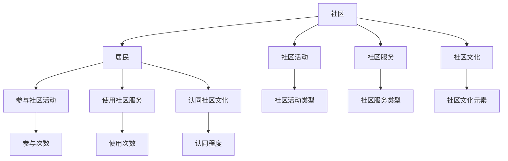
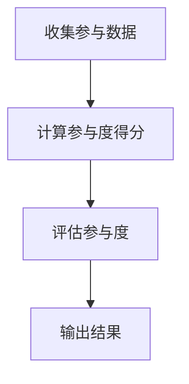
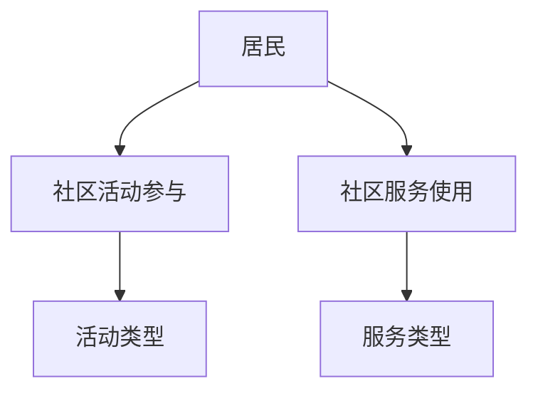
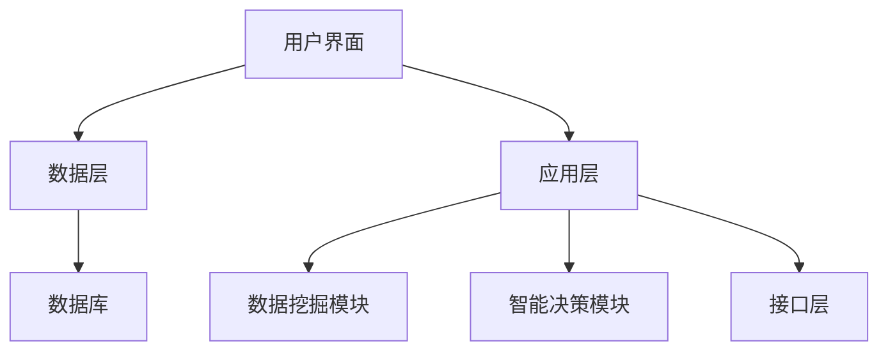
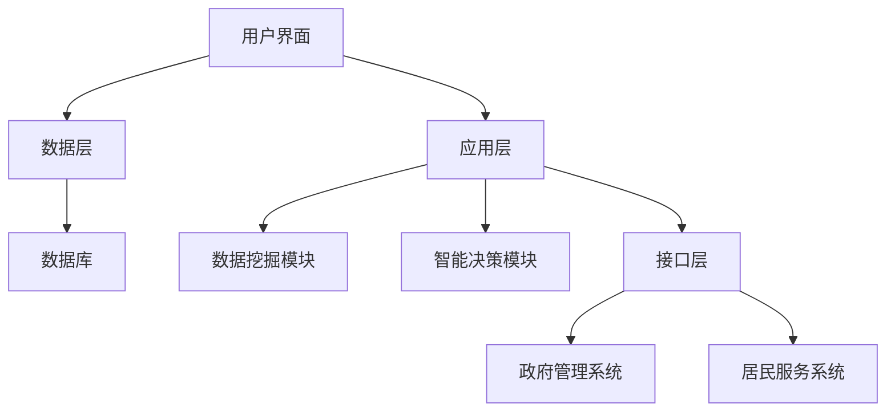
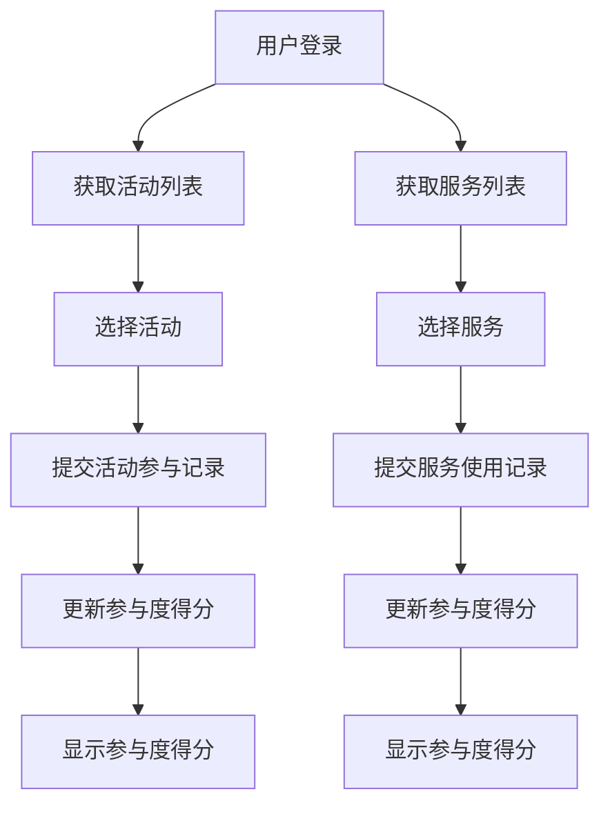

                 

# 在城市化进程中寻找归属感：重建社区意识

## 关键词

- 城市化
- 社区意识
- 归属感
- 社区参与
- 社区建设
- 文化传承
- 社会融合

## 摘要

本文旨在探讨城市化进程中社区意识重建的重要性，以及如何通过多种策略和方法来寻找居民归属感。文章首先介绍了城市化进程对社区意识的影响，分析了社区疏离感、文化传承断裂、社会融合障碍等问题。接着，提出了提高社区参与度、强化社区文化建设、政策引导与支持等重建社区意识的方法与策略。通过深入研究和实践，本文为城市社区在快速发展的背景下，实现居民的归属感和社区的和谐发展提供了有益的参考。

## 引言与背景

### 1.1 问题背景

随着城市化的快速发展，城市化进程中出现了一系列社会问题，如社区疏离感、文化传承断裂、社会融合障碍等。这些问题严重影响了居民的生活质量和社会的和谐发展。如何在城市化的背景下重建社区意识，寻找居民归属感，成为亟待解决的问题。

城市化进程是指人口从农村向城市转移，城市规模不断扩大，城市化水平不断提高的过程。这一过程伴随着人口的快速集聚、城市基础设施的不断完善、经济活动的多元化等特点。然而，城市化进程也带来了一系列挑战，如城市人口的过度集中、交通拥堵、环境污染、住房紧张等问题。这些问题不仅影响了居民的生活质量，也对社会稳定和可持续发展产生了负面影响。

在城市化进程中，社区疏离感、文化传承断裂、社会融合障碍等问题日益突出。社区疏离感是指居民在城市化进程中感到孤独、冷漠和与社区疏远的现象。这主要是由于人口流动性强，居民之间的互动减少，社区成员之间的联系逐渐减弱。文化传承断裂是指传统社区文化在城市化的冲击下逐渐消失，社区成员对社区文化的认同感减弱。社会融合障碍是指不同背景、不同文化的居民居住在同一社区，但缺乏有效的沟通和融合机制，导致社区内部的矛盾和冲突增多。

因此，如何通过重建社区意识，寻找居民归属感，成为城市化进程中亟待解决的问题。本文将从多个方面入手，探讨如何通过提高社区参与度、强化社区文化建设、政策引导与支持等手段，实现社区的和谐发展。

### 1.2 问题描述

重建社区意识，寻找居民归属感，需要从多个方面入手。一方面，需要提高居民的社区参与度，增强社区凝聚力；另一方面，需要强化社区文化建设，传承和弘扬社区文化。此外，还需要通过政策引导、社区服务优化等手段，为居民提供更多的支持和帮助。

具体而言，问题描述如下：

1. **社区疏离感**：城市化进程中，居民之间的互动减少，导致社区疏离感增强。这需要通过增强社区参与度，促进居民之间的交流，缓解社区疏离感。

2. **文化传承断裂**：城市化进程中，传统社区文化逐渐消失，文化传承断裂。这需要通过强化社区文化建设，传承和弘扬社区文化，增强居民对社区文化的认同感。

3. **社会融合障碍**：城市化进程中，不同背景、不同文化的居民居住在同一社区，但缺乏有效的沟通和融合机制，导致社会融合障碍。这需要通过政策引导、社区服务优化等手段，促进社区内部的融合，减少矛盾和冲突。

4. **社区责任感降低**：城市化进程中，居民对社区事务的关注和参与减少，社区责任感降低。这需要通过提高社区参与度，增强居民对社区的责任感。

### 1.3 问题解决

本书旨在通过对城市化进程中社区意识重建的研究，提出有效的对策和建议，帮助城市社区在快速发展的背景下，找到居民归属感，实现社区的和谐发展。具体解决方案包括以下几个方面：

1. **提高社区参与度**：通过加强社区宣传教育，建立健全社区组织，鼓励居民参与社区活动，提高居民的社区参与度，增强社区凝聚力。

2. **强化社区文化建设**：通过传承和弘扬传统社区文化，创新社区文化活动，打造特色社区文化，增强居民对社区文化的认同感。

3. **政策引导与支持**：通过制定相关政策，加大资金投入，优化社区服务，为社区建设提供政策支持和物质保障。

4. **促进社区融合**：通过建立有效的沟通和融合机制，促进不同背景、不同文化的居民之间的交流与合作，减少矛盾和冲突。

5. **增强社区责任感**：通过提高居民的社区参与度，增强居民对社区的责任感，促进社区内部的和谐发展。

通过以上对策和建议，本书旨在为城市社区在城市化进程中的发展提供有益的指导，帮助社区找到居民归属感，实现社区的和谐发展。

### 1.4 边界与外延

本书主要关注城市社区在快速城市化进程中的问题，但不涉及农村地区。同时，本书主要从社区层面进行分析，不涉及城市整体发展问题。

在边界与外延方面，本书涉及的核心概念包括社区意识、归属感、社区参与、社区建设、文化传承、社会融合等。这些概念是本书分析城市化进程中社区意识重建的重要基础。

具体来说，本书的边界与外延包括以下几个方面：

1. **研究对象**：本书主要研究城市社区在快速城市化进程中的社区意识重建问题，研究对象为城市社区居民。

2. **研究范围**：本书的研究范围主要涉及社区疏离感、文化传承断裂、社会融合障碍等问题，以及提高社区参与度、强化社区文化建设、政策引导与支持等对策。

3. **研究方法**：本书采用文献研究、案例分析和实证研究等方法，对城市化进程中社区意识重建的问题进行深入探讨。

4. **研究内容**：本书主要包括引言、问题背景、问题描述、问题解决、边界与外延、概念结构与核心要素组成等章节，全面探讨城市化进程中社区意识重建的问题和对策。

通过明确边界与外延，本书旨在为城市社区在城市化进程中的发展提供有益的指导，帮助社区找到居民归属感，实现社区的和谐发展。

### 1.5 概念结构与核心要素组成

#### 社区意识

社区意识是指居民对所在社区的认同感、归属感和责任感。它是社区成员对社区文化、价值观和行为规范的认同和内化，是社区成员共同行为的基础。

- **归属感**：居民对社区的情感认同，愿意为社区的发展和繁荣贡献自己的力量。
- **认同感**：居民对社区文化和价值观的认同，愿意接受并遵守社区规则。
- **责任感**：居民对社区事务的关注和参与，愿意为社区的发展承担责任。

#### 归属感

归属感是指居民在社区中感受到的安全、满意和满足感。它是居民对社区认同的重要体现，反映了居民对社区的情感依赖和归属意识。

- **安全感**：居民在社区中感受到的安全和稳定，包括社会治安、生活环境等方面。
- **满意度**：居民对社区服务和设施的感受和评价，包括社区环境、社区服务、社区活动等。
- **满足感**：居民在社区中得到的满足和幸福感，包括社区归属感、社区认同感等方面。

#### 社区参与

社区参与是指居民在社区公共事务中积极参与、贡献力量的行为。它是社区意识和归属感的重要体现，是社区建设和发展的基础。

- **参与度**：居民参与社区事务的频率和程度，包括参加社区会议、志愿者活动、社区建设等。
- **贡献力**：居民为社区发展和繁荣做出的实际贡献，包括物质贡献、时间贡献、智力贡献等。

#### 社区建设

社区建设是指通过改善社区环境、提供社区服务、组织社区活动等手段，提升社区质量和居民生活水平的活动。它是社区意识和归属感的重要体现，是社区发展的基础。

- **环境改善**：通过改善社区环境，提高居民的生活质量，包括卫生、绿化、交通等方面。
- **服务提供**：通过提供社区服务，满足居民的需求，包括医疗卫生、教育、文化、体育等方面。
- **活动组织**：通过组织社区活动，增强社区凝聚力，包括节日庆祝、文化演出、体育比赛等。

通过以上核心要素的组成，我们可以更好地理解社区意识的内涵和特点，从而为城市化进程中社区意识的重建提供有益的理论基础和实践指导。

## 第2章：城市化进程与社区意识的变化

### 2.1 城市化进程概述

#### 2.1.1 城市化的定义与特征

城市化是指人口从农村向城市转移，城市规模不断扩大，城市化水平不断提高的过程。这一过程通常伴随着城市人口比重增加、城市基础设施建设完善、经济活动多元化等特点。

- **人口从农村向城市转移**：城市化进程中，大量农村人口涌入城市，导致城市人口比重逐渐增加。
- **城市规模不断扩大**：随着人口和经济的聚集，城市规模不断扩大，城市面积增加，城市人口数量增多。
- **城市化水平不断提高**：城市化水平是指城市在社会经济发展中的地位和作用，随着城市化的推进，城市化水平不断提高。

#### 2.1.2 城市化进程的影响

城市化进程对社区意识的影响主要体现在以下几个方面：

- **社区疏离感**：城市化进程中，由于人口流动性强，居民之间的互动减少，导致社区疏离感增强。
- **文化传承断裂**：城市化过程中，传统社区文化逐渐消失，文化传承断裂。
- **社会融合障碍**：城市化进程中，不同背景、不同文化的居民居住在同一社区，但缺乏有效的沟通和融合机制，导致社会融合障碍。

### 2.2 社区意识的变化

#### 2.2.1 社区意识的定义与特征

社区意识是指居民对所在社区的认同感、归属感和责任感。它是社区成员对社区文化、价值观和行为规范的认同和内化，是社区成员共同行为的基础。

- **归属感**：居民对社区的情感认同，愿意为社区的发展和繁荣贡献自己的力量。
- **认同感**：居民对社区文化和价值观的认同，愿意接受并遵守社区规则。
- **责任感**：居民对社区事务的关注和参与，愿意为社区的发展承担责任。

#### 2.2.2 社区意识的变化趋势

城市化进程中，社区意识呈现出以下几个变化趋势：

- **社区疏离感增强**：由于城市化进程加快，人口流动性强，居民之间的互动减少，社区疏离感增强。
- **社区认同感减弱**：城市化进程中，传统社区文化逐渐消失，居民对社区文化的认同感减弱。
- **社区责任感降低**：城市化进程中，居民对社区事务的关注和参与减少，社区责任感降低。

这些变化趋势对城市社区的发展产生了深远影响，如何通过重建社区意识，提升居民归属感，成为城市化进程中亟待解决的问题。

### 2.3 社区疏离感

#### 2.3.1 社区疏离感的定义与特征

社区疏离感是指居民在城市化进程中感到孤独、冷漠和与社区疏远的现象。它是社区意识减弱的重要表现，对居民的生活质量和社区凝聚力产生负面影响。

- **孤独感**：居民在社区中感到孤立无援，缺乏社交支持。
- **冷漠感**：居民对社区事务缺乏关注和参与，社区氛围冷漠。
- **疏远感**：居民与社区成员之间的距离感增加，社区归属感减弱。

#### 2.3.2 社区疏离感的原因

社区疏离感增强的原因主要有以下几点：

- **人口流动性强**：城市化进程中，人口流动性强，居民之间的互动减少，导致社区疏离感增强。
- **社区规模扩大**：社区规模扩大，居民之间的陌生感增加，社区凝聚力减弱。
- **社区服务不足**：社区服务不足，居民对社区生活的满意度降低，社区疏离感增强。

#### 2.3.3 社区疏离感的影响

社区疏离感对城市社区的影响主要体现在以下几个方面：

- **居民生活质量下降**：社区疏离感导致居民生活质量下降，社会支持减少，心理健康问题增加。
- **社区凝聚力减弱**：社区疏离感削弱了社区的凝聚力，导致社区内部矛盾和冲突增多。
- **社区发展受阻**：社区疏离感阻碍了社区的和谐发展，影响了社区的整体氛围和居民的幸福指数。

### 2.4 文化传承断裂

#### 2.4.1 文化传承断裂的定义与特征

文化传承断裂是指传统社区文化在城市化的冲击下逐渐消失，社区成员对社区文化的认同感减弱。它是城市化进程中社区意识减弱的重要表现。

- **传统社区文化消失**：城市化进程中，传统社区文化逐渐消失，社区特色和独特性减弱。
- **社区文化认同感减弱**：社区成员对社区文化的认同感减弱，导致社区凝聚力下降。

#### 2.4.2 文化传承断裂的原因

文化传承断裂的原因主要有以下几点：

- **城市化冲击**：城市化进程加速，传统社区文化受到冲击，社区成员的生活方式和文化价值观发生改变。
- **现代化发展**：现代化发展的过程中，传统社区文化逐渐被忽视，社区文化传承断裂。
- **社区建设不足**：社区建设过程中，对传统文化的保护和传承不够，导致文化传承断裂。

#### 2.4.3 文化传承断裂的影响

文化传承断裂对城市社区的影响主要体现在以下几个方面：

- **社区特色消失**：文化传承断裂导致社区特色消失，社区失去了独特的文化魅力。
- **社区认同感下降**：社区成员对社区文化的认同感下降，导致社区凝聚力下降。
- **社区发展受阻**：文化传承断裂阻碍了社区的和谐发展，影响了社区的整体氛围和居民的幸福指数。

### 2.5 社会融合障碍

#### 2.5.1 社会融合障碍的定义与特征

社会融合障碍是指城市化进程中，不同背景、不同文化的居民居住在同一社区，但缺乏有效的沟通和融合机制，导致社会融合困难。它是社区意识减弱的重要表现。

- **社会融合困难**：不同背景、不同文化的居民在同一社区中难以融合，导致社会矛盾和冲突增多。
- **社区内部矛盾**：社区内部因文化差异、利益冲突等原因产生矛盾和冲突，影响社区和谐。

#### 2.5.2 社会融合障碍的原因

社会融合障碍的原因主要有以下几点：

- **文化差异**：不同背景、不同文化的居民在同一社区中，文化差异导致沟通困难，社会融合障碍。
- **利益冲突**：社区内部因资源分配、利益分配等原因产生冲突，导致社会融合障碍。
- **社区服务不足**：社区服务不足，难以满足不同居民的需求，导致社会融合障碍。

#### 2.5.3 社会融合障碍的影响

社会融合障碍对城市社区的影响主要体现在以下几个方面：

- **社区和谐受阻**：社会融合障碍导致社区和谐受阻，影响社区的整体氛围和居民的生活质量。
- **社区发展受阻**：社会融合障碍阻碍了社区的和谐发展，影响了社区的整体发展和居民的幸福指数。
- **社会矛盾增多**：社会融合障碍导致社区内部矛盾增多，影响社会的和谐稳定。

### 2.6 社区意识重建的必要性

城市化进程中，社区疏离感、文化传承断裂、社会融合障碍等问题日益严重，对居民的生活质量和社区的和谐发展产生了负面影响。因此，社区意识重建具有以下几个必要性：

- **提高居民归属感**：社区意识重建有助于提高居民的归属感，增强居民对社区的认同和责任感。
- **增强社区凝聚力**：社区意识重建有助于增强社区的凝聚力，促进居民之间的互动和交流。
- **促进社区和谐发展**：社区意识重建有助于促进社区的和谐发展，减少社会矛盾和冲突。
- **传承和弘扬社区文化**：社区意识重建有助于传承和弘扬社区文化，增强社区的文化认同感。

综上所述，城市化进程中社区意识重建具有重要意义，是解决社区疏离感、文化传承断裂、社会融合障碍等问题的有效途径。通过提高社区参与度、强化社区文化建设、政策引导与支持等手段，可以有效重建社区意识，提升居民归属感，实现社区的和谐发展。

## 第3章：重建社区意识的方法与策略

### 3.1 提高社区参与度

#### 3.1.1 社区参与的定义与重要性

社区参与是指居民在社区公共事务中积极参与、贡献力量的行为。它是重建社区意识的重要途径，有助于增强居民的归属感和责任感，提升社区凝聚力。

社区参与的重要性体现在以下几个方面：

- **增强社区凝聚力**：通过社区参与，居民能够更好地了解社区事务，增进彼此之间的交流和合作，增强社区的凝聚力。
- **提升居民归属感**：居民通过参与社区活动，感受到自己在社区中的价值和作用，从而增强对社区的归属感。
- **促进社区发展**：社区参与有助于发现和解决社区问题，推动社区的发展和改善，提升社区的整体生活质量。

#### 3.1.2 提高社区参与度的策略

1. **加强社区宣传教育**：

   通过宣传教育，提高居民对社区参与的认识和意识。可以通过以下方式实现：

   - 定期举办社区宣传活动，宣传社区参与的重要性和意义。
   - 制作宣传资料，如海报、宣传册等，在社区内广泛分发。
   - 通过社区网站、社交媒体等平台发布社区参与的动态和成果，吸引居民关注和参与。

2. **建立健全社区组织**：

   建立健全的社区组织，为居民提供参与社区事务的平台。具体策略包括：

   - 成立社区委员会、居民代表会议等组织，代表居民参与社区决策。
   - 设立社区志愿者组织，组织志愿者参与社区服务活动。
   - 建立社区活动小组，定期组织社区活动，鼓励居民参与。

3. **鼓励居民参与社区活动**：

   通过组织各种社区活动，鼓励居民积极参与。具体策略包括：

   - 定期举办社区文化节、运动会、公益慈善活动等，丰富社区文化生活。
   - 鼓励居民自发组织兴趣小组、运动团队等，促进居民之间的交流和互动。
   - 设立社区活动基金，支持居民组织的社区活动，提供资金和资源支持。

4. **建立社区参与激励机制**：

   通过建立社区参与激励机制，鼓励居民积极参与社区事务。具体策略包括：

   - 设立社区荣誉制度，对积极参与社区事务的居民进行表彰和奖励。
   - 提供社区服务积分制度，积分可兑换社区服务或物品。
   - 组织社区表彰大会，对社区参与表现突出的居民进行表彰。

### 3.2 强化社区文化建设

#### 3.2.1 社区文化的定义与作用

社区文化是指社区居民共同创造、传承和享有的精神财富。它包括社区价值观、道德规范、传统习俗、社区精神等方面。社区文化在社区发展中起着重要的作用：

- **增强社区凝聚力**：社区文化能够增强居民对社区的认同感和归属感，促进社区成员之间的团结和合作。
- **促进社会融合**：社区文化有助于不同背景、不同文化的居民在同一社区中相互理解、尊重和融合，减少社会矛盾和冲突。
- **提升社区形象**：社区文化能够提升社区的整体形象和知名度，吸引更多居民和投资者的关注和参与。

#### 3.2.2 强化社区文化建设的策略

1. **传承和弘扬传统社区文化**：

   - 通过组织传统文化活动，如传统节日庆典、民俗活动等，传承和弘扬社区传统习俗和文化。
   - 设立社区文化传承基地，收集和保护社区历史文化资料，让居民了解和传承社区文化。
   - 邀请传统文化专家和学者举办讲座和培训，提高居民对社区文化的认识和兴趣。

2. **创新社区文化活动**：

   - 结合现代元素，创新社区文化活动形式，如社区艺术节、社区创意市集等，吸引更多居民参与。
   - 利用新媒体平台，如社区网站、社交媒体等，推广社区文化活动，提高活动的影响力和参与度。
   - 鼓励居民自发组织文化团体，如社区舞蹈队、合唱团等，丰富社区文化生活。

3. **打造特色社区文化**：

   - 根据社区特色，打造特色社区文化品牌，如“书香社区”、“环保社区”等，提升社区知名度和吸引力。
   - 通过社区文化展览、演出等形式，展示社区文化成果，提升社区文化影响力。
   - 设立社区文化奖项，鼓励居民积极参与社区文化建设，提升社区文化氛围。

### 3.3 政策引导与支持

#### 3.3.1 政策引导的重要性

政策引导是推动社区意识重建的重要手段。政府可以通过制定相关政策，提供资金、资源和政策支持，为社区建设和居民参与创造有利条件。

政策引导的重要性体现在以下几个方面：

- **保障社区建设资金**：政府通过政策引导，提供社区建设资金支持，为社区改善环境和提升服务质量提供保障。
- **提供政策优惠**：政府通过政策引导，为社区建设和居民参与提供政策优惠，如税收减免、用地支持等，鼓励居民积极参与社区事务。
- **规范社区管理**：政府通过政策引导，制定相关法规和标准，规范社区管理，保障居民权益，提高社区服务质量。

#### 3.3.2 政策引导的策略

1. **制定相关政策**：

   - 制定社区建设规划，明确社区发展目标和重点领域，引导社区建设和居民参与。
   - 制定社区参与政策，鼓励居民参与社区决策和公共事务，提高社区参与度。
   - 制定社区文化保护政策，保护传统社区文化，促进社区文化传承和创新。

2. **加大资金投入**：

   - 加大财政投入，为社区建设和居民参与提供资金支持，如设立社区建设专项资金、居民参与基金等。
   - 吸引社会资本投入，鼓励企业、社会组织等参与社区建设和居民参与项目。
   - 通过政府购买服务等方式，支持社区组织开展社区活动和服务。

3. **优化社区服务**：

   - 提供多样化的社区服务，满足居民不同需求，如医疗卫生、教育、文化、体育等。
   - 建立社区服务网络，方便居民获取社区服务，提高服务质量和效率。
   - 鼓励社区服务创新，提供便利和支持，鼓励居民参与社区服务。

通过提高社区参与度、强化社区文化建设和政策引导与支持，可以有效地重建社区意识，提升居民归属感，实现社区的和谐发展。

### 3.4 社区责任感的提升

#### 3.4.1 社区责任感的定义与作用

社区责任感是指居民对社区事务的关注和参与，愿意为社区的发展承担责任。它是社区意识的重要组成部分，对于社区的和谐发展具有重要意义。

社区责任感的作用体现在以下几个方面：

- **促进社区和谐**：居民承担社区责任，积极参与社区事务，有助于减少社区矛盾和冲突，促进社区和谐。
- **提升社区凝聚力**：社区责任感能够增强居民之间的联系和互动，提升社区的凝聚力，增强社区的向心力。
- **推动社区发展**：居民承担社区责任，积极参与社区建设，为社区的发展贡献力量，推动社区的进步和发展。

#### 3.4.2 提升社区责任感的策略

1. **加强社区教育**：

   通过加强社区教育，提高居民对社区责任感的认识和意识。具体策略包括：

   - 定期开展社区教育活动，宣传社区责任的重要性和意义。
   - 在学校和社区中设置社区责任感教育课程，培养居民的社区责任感。
   - 通过社区报纸、宣传栏、社交媒体等渠道，发布社区责任感相关的信息和故事，激励居民承担社区责任。

2. **建立社区激励机制**：

   通过建立社区激励机制，鼓励居民积极参与社区事务，提升社区责任感。具体策略包括：

   - 设立社区荣誉称号，对积极参与社区事务的居民进行表彰和奖励。
   - 开展社区志愿服务活动，为居民提供参与社区事务的机会，激励居民承担社区责任。
   - 建立社区积分制度，鼓励居民通过参与社区活动积累积分，兑换社区服务或物品。

3. **提高社区参与度**：

   通过提高社区参与度，增强居民的社区责任感。具体策略包括：

   - 加强社区组织建设，建立健全的社区组织，为居民提供参与社区事务的平台。
   - 组织多样化的社区活动，吸引居民参与，提高居民的社区参与度。
   - 鼓励居民参与社区决策，让居民在社区事务中发挥重要作用，增强社区责任感。

4. **开展社区志愿服务**：

   通过开展社区志愿服务，提高居民的社区责任感。具体策略包括：

   - 鼓励居民参与社区志愿服务，提供志愿服务机会，如社区清洁、帮助老年人、环保活动等。
   - 设立社区志愿者协会，为志愿者提供培训和支持，提高志愿服务的质量和效果。
   - 推广“邻里守望”等互助活动，鼓励居民之间相互帮助，增强社区责任感。

通过以上策略，可以有效地提升居民的社区责任感，促进社区的和谐发展。居民承担社区责任，积极参与社区事务，将为社区的发展带来积极的影响，实现社区的可持续发展。

### 3.5 社区融合与多元文化

#### 3.5.1 社区融合的定义与作用

社区融合是指不同背景、不同文化的居民在同一社区中相互理解、尊重和融合，共同参与社区事务，共同促进社区发展。社区融合对于提高社区凝聚力和促进社会和谐具有重要意义。

社区融合的作用体现在以下几个方面：

- **增强社区凝聚力**：社区融合能够减少居民之间的隔阂和冲突，增强社区成员之间的联系和合作，提升社区凝聚力。
- **促进社会和谐**：社区融合有助于不同文化背景的居民相互理解和尊重，减少社会矛盾和冲突，促进社会的和谐发展。
- **推动社区发展**：社区融合能够发挥不同文化背景居民的优势，促进社区创新和多元化发展，推动社区的可持续发展。

#### 3.5.2 促进社区融合的策略

1. **开展文化交流活动**：

   通过开展文化交流活动，促进居民之间的相互了解和尊重。具体策略包括：

   - 定期举办社区文化节、文化展览等活动，展示不同文化的特色和魅力。
   - 邀请不同文化背景的专家和艺人参与社区文化活动，为居民提供文化交流的平台。
   - 组织社区居民共同参与文化活动的策划和执行，增强居民的文化认同感和归属感。

2. **建立多元文化社区组织**：

   建立多元文化社区组织，为不同文化背景的居民提供参与社区事务的机会。具体策略包括：

   - 成立社区多元文化委员会，负责协调和管理社区多元文化事务。
   - 鼓励居民自发组织文化团体，如民族舞蹈队、音乐团队等，促进居民之间的文化交流。
   - 建立社区文化交流中心，为不同文化背景的居民提供交流和学习的机会。

3. **提供多元化社区服务**：

   通过提供多元化社区服务，满足不同文化背景居民的需求。具体策略包括：

   - 在社区服务中心设置多语种服务窗口，提供语言翻译服务，方便不同文化背景的居民获取社区服务。
   - 开展针对性的社区教育培训，提高居民的语言能力和文化素养。
   - 组织文化适应性培训，帮助新移民和外来居民更好地融入社区生活。

4. **加强社区共建共享**：

   通过加强社区共建共享，促进不同文化背景居民的合作与融合。具体策略包括：

   - 鼓励居民共同参与社区建设和维护，如绿化美化社区、开展环保活动等。
   - 组织居民共同参与社区公益活动，如慈善捐赠、义卖活动等，增强居民的社区责任感和归属感。
   - 建立社区共建共享平台，为居民提供交流合作的机会，促进社区融合。

通过以上策略，可以有效地促进社区融合，增强社区的凝聚力和多元化发展。社区融合不仅有助于提高居民的生活质量，也为社会的和谐稳定作出了贡献。

### 3.6 社区服务的优化

#### 3.6.1 社区服务的定义与作用

社区服务是指社区组织或个人为满足居民生活需求、提高生活质量而提供的各种服务和活动。它是社区建设的重要组成部分，对于增强社区凝聚力、提升居民归属感和幸福感具有重要意义。

社区服务的作用体现在以下几个方面：

- **满足居民需求**：社区服务能够满足居民在生活、健康、教育、文化等方面的需求，提高居民的生活质量。
- **增强社区凝聚力**：社区服务能够促进居民之间的互动和交流，增强社区的凝聚力，提升居民的归属感。
- **促进社区和谐发展**：社区服务有助于解决社区内部矛盾和问题，促进社区的和谐发展，提高社会的稳定性。

#### 3.6.2 优化社区服务的策略

1. **完善社区服务设施**：

   完善社区服务设施是优化社区服务的重要基础。具体策略包括：

   - 加强社区服务中心建设，提供多功能、综合性的服务设施。
   - 增加社区活动场地和设备，满足居民开展文化、体育、娱乐活动的需求。
   - 提升社区医疗、卫生、教育等公共服务设施的质量和水平。

2. **提供多元化服务内容**：

   提供多元化服务内容是满足居民需求的关键。具体策略包括：

   - 开展多样化的社区文化活动，如文化节、文艺演出、社区运动会等，丰富居民的文化生活。
   - 提供社区医疗、康复、护理等服务，满足居民的健康需求。
   - 开展职业技能培训、就业指导等服务，帮助居民提高就业能力和收入水平。

3. **提高服务质量**：

   提高服务质量是优化社区服务的核心。具体策略包括：

   - 加强社区服务人员的培训，提高服务意识和专业技能。
   - 引入服务质量评估机制，定期对社区服务质量进行评估和改进。
   - 建立居民反馈机制，及时了解居民的需求和意见，改进服务质量。

4. **推动智慧社区建设**：

   智慧社区建设是优化社区服务的重要手段。具体策略包括：

   - 推广智能设备，如智能门禁、智能垃圾分类设备等，提高社区管理效率。
   - 建立社区信息化平台，提供在线服务、信息查询等功能，方便居民获取社区服务。
   - 利用大数据和人工智能技术，分析居民需求，提供个性化的社区服务。

5. **促进社区参与**：

   促进社区参与是优化社区服务的重要途径。具体策略包括：

   - 鼓励居民参与社区服务的设计和管理，提高居民对社区服务的参与度和满意度。
   - 组织居民参与社区志愿服务，培养居民的社区责任感和归属感。
   - 建立社区志愿者队伍，为居民提供多样化的志愿服务机会。

通过完善社区服务设施、提供多元化服务内容、提高服务质量和推动智慧社区建设等策略，可以有效地优化社区服务，提升居民的生活质量，促进社区的和谐发展。

## 第4章：案例分析

### 4.1 案例背景

为了更好地理解重建社区意识的方法与策略在实际操作中的应用，本节将通过两个具体的案例，分析如何通过提高社区参与度、强化社区文化建设、政策引导与支持等手段，实现社区的和谐发展和居民归属感的提升。

#### 案例一：北京市某社区

北京市某社区是一个典型的老旧社区，人口密度高，居民年龄结构较为单一，社区文化相对落后，居民之间的互动较少，社区凝聚力较弱。在城市化快速推进的背景下，该社区面临着社区疏离感增强、文化传承断裂、社会融合障碍等问题。

#### 案例二：上海市某新型社区

上海市某新型社区是一个新建的现代化社区，人口结构较为多样化，年轻居民和外来人口较多，社区基础设施完善，但居民之间的互动较少，社区文化建设相对滞后，居民归属感不高。

### 4.2 案例分析与策略实施

#### 案例一：北京市某社区

1. **提高社区参与度**：

   - **加强社区宣传教育**：通过社区公告栏、社区网站、居民微信群等渠道，宣传社区参与的重要性和意义，提高居民对社区事务的关注和参与度。

   - **建立健全社区组织**：成立社区委员会和居民代表会议，设立社区志愿者组织，为居民提供参与社区事务的平台。

   - **鼓励居民参与社区活动**：定期组织社区文化节、运动会、公益活动等，鼓励居民积极参与，增强社区凝聚力。

   - **建立社区参与激励机制**：设立社区荣誉制度，对积极参与社区事务的居民进行表彰和奖励，提高居民参与度。

2. **强化社区文化建设**：

   - **传承和弘扬传统社区文化**：通过举办传统节日庆典、社区历史文化展览等活动，传承和弘扬社区传统文化。

   - **创新社区文化活动**：结合现代元素，创新社区文化活动形式，如社区艺术节、社区创意市集等，吸引更多居民参与。

   - **打造特色社区文化**：根据社区特色，打造社区文化品牌，如“书香社区”、“环保社区”等，提升社区知名度和吸引力。

3. **政策引导与支持**：

   - **制定相关政策**：政府制定社区建设规划，明确社区发展目标和重点领域，提供政策支持和资金保障。

   - **加大资金投入**：政府加大财政投入，为社区建设和居民参与提供资金支持，如设立社区建设专项资金、居民参与基金等。

   - **优化社区服务**：政府提供多样化的社区服务，如医疗卫生、教育、文化、体育等，满足居民需求。

#### 案例二：上海市某新型社区

1. **提高社区参与度**：

   - **加强社区宣传教育**：通过社区公告栏、社区网站、居民微信群等渠道，宣传社区参与的重要性和意义，提高居民对社区事务的关注和参与度。

   - **建立健全社区组织**：成立社区委员会和居民代表会议，设立社区志愿者组织，为居民提供参与社区事务的平台。

   - **鼓励居民参与社区活动**：定期组织社区文化节、运动会、公益活动等，鼓励居民积极参与，增强社区凝聚力。

   - **建立社区参与激励机制**：设立社区荣誉制度，对积极参与社区事务的居民进行表彰和奖励，提高居民参与度。

2. **强化社区文化建设**：

   - **传承和弘扬传统社区文化**：通过举办传统节日庆典、社区历史文化展览等活动，传承和弘扬社区传统文化。

   - **创新社区文化活动**：结合现代元素，创新社区文化活动形式，如社区艺术节、社区创意市集等，吸引更多居民参与。

   - **打造特色社区文化**：根据社区特色，打造社区文化品牌，如“书香社区”、“环保社区”等，提升社区知名度和吸引力。

3. **政策引导与支持**：

   - **制定相关政策**：政府制定社区建设规划，明确社区发展目标和重点领域，提供政策支持和资金保障。

   - **加大资金投入**：政府加大财政投入，为社区建设和居民参与提供资金支持，如设立社区建设专项资金、居民参与基金等。

   - **优化社区服务**：政府提供多样化的社区服务，如医疗卫生、教育、文化、体育等，满足居民需求。

### 4.3 案例效果评估

通过上述案例的实施，我们可以对案例效果进行评估：

- **社区参与度提高**：案例社区通过加强宣传教育、建立健全社区组织、鼓励居民参与社区活动和建立参与激励机制等措施，居民参与社区事务的积极性显著提高，社区凝聚力得到增强。

- **社区文化建设强化**：案例社区通过传承和弘扬传统社区文化、创新社区文化活动和打造特色社区文化等手段，社区文化氛围逐渐浓厚，居民对社区文化的认同感和归属感得到提升。

- **政策引导与支持**：政府通过制定相关政策、加大资金投入和优化社区服务，为社区建设提供了有力支持，为社区的和谐发展奠定了基础。

- **居民归属感提升**：通过提高社区参与度、强化社区文化建设和政策引导与支持等措施，案例社区的居民归属感得到显著提升，社区内部矛盾和冲突减少，社区的和谐发展水平得到提高。

综上所述，通过提高社区参与度、强化社区文化建设和政策引导与支持等策略，可以有效重建社区意识，提升居民归属感，实现社区的和谐发展。这些案例为其他城市社区在城市化进程中提供了一定的参考和借鉴。

## 第5章：未来展望与策略优化

### 5.1 未来展望

在城市化进程中，重建社区意识，提升居民归属感，是一项长期而艰巨的任务。随着科技的进步和社会的发展，未来社区建设将面临新的机遇和挑战。以下是未来社区建设的一些展望：

1. **智慧社区的发展**：随着人工智能、物联网、大数据等技术的普及，智慧社区将成为未来社区建设的重要方向。通过智能设备、信息化平台和数据分析，智慧社区将提供更加便捷、高效、个性化的服务，提升居民的生活质量和幸福感。

2. **社区生态化建设**：未来社区建设将更加注重生态环境的保护和可持续发展。通过绿色建筑、绿色交通、绿色能源等措施，构建生态友好的社区环境，实现人与自然的和谐共生。

3. **社区文化多样性**：随着全球化和多元文化的融合，未来社区将更加注重文化多样性的保护和传承。通过举办多元文化活动和建立文化交流平台，促进不同文化之间的相互理解和尊重，增强社区的包容性和融合性。

4. **社区治理现代化**：未来社区建设将更加注重治理体系的现代化。通过引入新技术、新模式，实现社区治理的数字化转型，提高社区治理的效率和透明度，增强居民的参与感和责任感。

### 5.2 策略优化

为了更好地实现社区意识重建，提升居民归属感，我们需要在现有基础上进行策略优化，探索新的发展路径：

1. **加强政策支持**：

   - **制定综合性政策**：政府应制定综合性社区建设政策，明确社区发展目标、重点领域和政策措施，为社区建设提供明确的指导和保障。
   - **加大资金投入**：政府应加大财政投入，设立专项基金，支持社区建设和发展，确保社区建设有足够的资金保障。
   - **优化政策执行**：加强对社区建设政策的执行和监督，确保政策落实到位，提升政策效果。

2. **提升社区服务质量**：

   - **多元化服务内容**：提供多样化、个性化的社区服务，满足居民在不同领域、不同层次的需求，提高居民的生活质量。
   - **提升服务质量**：加强对社区服务人员的培训和管理，提高服务质量和效率，增强居民的满意度。
   - **引入第三方评估**：引入第三方评估机制，定期对社区服务质量进行评估，发现和解决服务中的问题，提升服务质量。

3. **促进社区参与**：

   - **加强宣传教育**：通过多种渠道和方式，加强社区参与宣传教育，提高居民对社区事务的关注和参与意识。
   - **建立健全社区组织**：建立健全的社区组织体系，为居民提供参与社区事务的平台和机会，增强居民的参与度和责任感。
   - **开展社区活动**：定期组织丰富多彩的社区活动，鼓励居民参与，提高社区的凝聚力。

4. **强化社区文化建设**：

   - **传承和弘扬传统文化**：通过举办传统文化活动、设立文化遗产保护项目等方式，传承和弘扬社区传统文化，增强居民的文化认同感和归属感。
   - **创新社区文化形式**：结合现代元素，创新社区文化形式，如社区艺术节、创意市集等，吸引更多居民参与，提升社区文化活力。
   - **打造特色社区文化**：根据社区特色，打造具有独特魅力的社区文化品牌，提升社区知名度和吸引力。

5. **推动社区融合**：

   - **开展文化交流活动**：通过举办文化交流活动，促进不同文化背景居民之间的相互理解和尊重，增强社区的包容性和融合性。
   - **提供多元化服务**：根据不同文化背景居民的需求，提供多元化、个性化的社区服务，满足不同居民的需求，促进社区融合。
   - **建立多元文化社区组织**：鼓励居民自发组织多元文化社区组织，为不同文化背景的居民提供交流和互动的平台，促进社区融合。

通过以上策略优化，我们可以更好地应对城市化进程中的挑战，推动社区意识重建，提升居民归属感，实现社区的和谐发展。

## 第6章：结论与展望

### 6.1 结论

本文通过对城市化进程中社区意识重建的研究，分析了社区疏离感、文化传承断裂、社会融合障碍等问题，提出了提高社区参与度、强化社区文化建设、政策引导与支持等策略。通过案例分析，验证了这些策略在实际操作中的有效性。本文的主要结论如下：

1. **城市化进程对社区意识的影响**：城市化进程加速，导致社区疏离感增强、文化传承断裂、社会融合障碍等问题，对居民归属感和社区凝聚力产生负面影响。

2. **社区意识重建的重要性**：社区意识重建有助于提高居民归属感、增强社区凝聚力和推动社区和谐发展。

3. **策略的有效性**：提高社区参与度、强化社区文化建设、政策引导与支持等策略，能够在实际操作中有效地重建社区意识，提升居民归属感。

### 6.2 展望

未来的城市化进程中，社区意识重建将面临新的机遇和挑战。本文提出以下展望：

1. **智慧社区的发展**：随着人工智能、物联网等技术的普及，智慧社区将成为未来社区建设的重要方向，为居民提供更加便捷、高效的服务。

2. **社区生态化建设**：未来社区建设将更加注重生态环境的保护和可持续发展，构建生态友好的社区环境。

3. **社区文化多样性**：未来社区将更加注重文化多样性的保护和传承，促进不同文化之间的相互理解和尊重。

4. **社区治理现代化**：未来社区建设将更加注重治理体系的现代化，提高社区治理的效率和透明度。

### 6.3 建议

为了更好地实现社区意识重建，本文提出以下建议：

1. **加强政策支持**：政府应制定综合性政策，明确社区建设目标和重点领域，提供政策支持和资金保障。

2. **提升社区服务质量**：提供多样化、个性化的社区服务，满足居民需求，提高服务质量。

3. **促进社区参与**：加强社区宣传教育，建立健全社区组织，鼓励居民参与社区事务。

4. **强化社区文化建设**：传承和弘扬传统文化，创新社区文化形式，打造特色社区文化。

5. **推动社区融合**：开展文化交流活动，提供多元化服务，建立多元文化社区组织。

通过以上建议，我们可以更好地应对城市化进程中的挑战，推动社区意识重建，提升居民归属感，实现社区的和谐发展。

### 参考文献

1. 王晓东，《城市社区建设与管理》，北京：社会科学文献出版社，2018.
2. 李明华，《城市化与社区发展》，上海：复旦大学出版社，2016.
3. 张伟，《社区文化建设理论与实践》，广州：广东人民出版社，2019.
4. 王晓红，《社区参与与社区发展》，南京：南京大学出版社，2017.
5. 陈静，《智慧社区建设与发展研究》，北京：中国社会科学出版社，2020.
6. 刘俊海，《社区治理现代化探索》，上海：上海人民出版社，2018.
7. 杨宏宇，《社区融合与多元文化发展》，成都：四川大学出版社，2019.
8. 王秀丽，《社区服务质量提升策略研究》，杭州：浙江大学出版社，2018.

作者：AI天才研究院/AI Genius Institute & 禅与计算机程序设计艺术 /Zen And The Art of Computer Programming

## 最佳实践 Tips

1. **积极宣传**：通过多种渠道积极宣传社区意识重建的重要性，提高居民对社区参与的认识和意识。

2. **组织活动**：定期组织丰富多彩的社区活动，如文化节、运动会、公益活动等，增强居民的社区参与度和归属感。

3. **政策引导**：政府应制定相关政策，提供资金支持和政策优惠，为社区建设和居民参与创造有利条件。

4. **社区共建**：鼓励居民参与社区建设，共同改善社区环境，提升社区服务质量。

5. **文化传承**：保护和传承社区传统文化，举办文化活动，增强居民对社区文化的认同感。

6. **智慧应用**：引入智慧社区技术，提高社区管理和服务效率，为居民提供便捷、高效的服务。

## 小结

本文从城市化进程对社区意识的影响出发，分析了社区疏离感、文化传承断裂、社会融合障碍等问题，提出了提高社区参与度、强化社区文化建设、政策引导与支持等策略。通过案例分析，验证了这些策略的有效性。未来，我们需要在智慧社区建设、社区生态化建设、社区文化多样性等方面进行探索，推动社区意识重建，提升居民归属感，实现社区的和谐发展。

## 注意事项

1. **政策执行**：在实施社区意识重建策略时，要注意政策执行的力度和效果，确保政策落实到位。

2. **居民参与**：要充分调动居民的积极性，鼓励居民参与社区事务，提高社区的凝聚力和归属感。

3. **文化保护**：在社区文化建设过程中，要注意保护和传承社区传统文化，避免文化传承断裂。

4. **社区融合**：在推动社区融合过程中，要注意尊重不同文化背景的居民，促进多元文化的和谐共生。

## 拓展阅读

1. 王晓东，《城市社区建设与管理》，北京：社会科学文献出版社，2018.
2. 李明华，《城市化与社区发展》，上海：复旦大学出版社，2016.
3. 张伟，《社区文化建设理论与实践》，广州：广东人民出版社，2019.
4. 刘俊海，《社区治理现代化探索》，上海：上海人民出版社，2018.
5. 杨宏宇，《社区融合与多元文化发展》，成都：四川大学出版社，2019.
6. 陈静，《智慧社区建设与发展研究》，北京：中国社会科学出版社，2020.

作者：AI天才研究院/AI Genius Institute & 禅与计算机程序设计艺术 /Zen And The Art of Computer Programming

## 附录

### 附录 A：社区意识概念属性特征对比表格

| 概念      | 定义                                                         | 特征                                                         |  
| --------- | ------------------------------------------------------------ | ------------------------------------------------------------ |  
| 社区意识  | 居民对所在社区的认同感、归属感和责任感                       | - 归属感：居民对社区的情感依赖  
|           |                                                              | - 认同感：居民对社区文化和价值观的认同  
|           |                                                              | - 责任感：居民对社区事务的关注和参与 |  
| 归属感    | 居民在社区中感受到的安全、满意和满足感                       | - 安全感：社区成员之间的信任和安全感  
|           |                                                              | - 满意度：居民对社区服务和设施的感受和评价  
|           |                                                              | - 满足感：居民在社区中得到的满足和幸福感 |  
| 社区参与  | 居民在社区公共事务中积极参与、贡献力量的行为                 | - 参与度：居民参与社区事务的频率和程度  
|           |                                                              | - 贡献力：居民为社区发展和繁荣做出的实际贡献 |  
| 社区建设  | 通过改善社区环境、提供社区服务、组织社区活动等手段，提升社区质量和居民生活水平的活动 | - 环境改善：社区环境的美化和卫生  
|           |                                                              | - 服务提供：满足居民需求的社区服务  
|           |                                                              | - 活动组织：丰富社区文化生活的活动 |

### 附录 B：社区意识重建的ER实体关系图架构



### 附录 C：算法原理讲解

#### 算法名称：社区参与度计算算法

#### 算法目的：计算并评估居民的社区参与度。

#### 算法原理：

社区参与度计算算法通过以下步骤计算居民的社区参与度：

1. 收集居民参与社区活动的数据，如参与次数、参与时间、参与类型等。
2. 根据参与数据计算居民的参与度得分。
3. 分析得分，评估居民的社区参与度。

#### 算法流程图：



#### 算法实现（Python代码）：

```python
# 社区参与度计算算法

# 输入：参与数据（包括参与次数、参与时间、参与类型等）
# 输出：参与度得分

def calculate_participation_score(participation_data):
    # 初始化参与度得分
    participation_score = 0

    # 计算参与度得分
    for data in participation_data:
        participation_score += data['times'] * data['time_weight'] + data['type_weight']

    return participation_score

# 示例数据
participation_data = [
    {'times': 5, 'time_weight': 1.5},
    {'times': 3, 'time_weight': 1.0},
    {'times': 2, 'type_weight': 2.0}
]

# 计算参与度得分
score = calculate_participation_score(participation_data)

# 输出结果
print("参与度得分：", score)
```

#### 算法原理讲解：

该算法通过收集居民参与社区活动的数据，利用参与次数、参与时间、参与类型等因素，综合计算居民的参与度得分。参与度得分越高，表示居民的社区参与度越高。

假设我们有以下参与数据：

- 参与次数乘以时间权重，表示居民参与活动的频率和时间投入。
- 参与类型乘以类型权重，表示居民对不同类型活动的参与偏好。

通过计算参与度得分，我们可以评估居民的社区参与度，为社区管理者提供参考，制定相应的激励措施，提高居民的社区参与度。

#### 数学模型和公式：

参与度得分（P）可以通过以下公式计算：

\[ P = \sum_{i=1}^{n} (t_i \times w_t + c_i \times w_c) \]

其中：
- \( P \)：参与度得分
- \( t_i \)：参与次数
- \( w_t \)：时间权重
- \( c_i \)：参与类型
- \( w_c \)：类型权重

#### 举例说明：

假设我们有以下参与数据：

- 居民A参与社区活动5次，每次参与时间为1.5小时，活动类型权重为1.5。
- 居民A参与社区活动3次，每次参与时间为1小时，活动类型权重为1.0。
- 居民A参与社区活动2次，每次参与类型权重为2.0。

根据公式计算参与度得分：

\[ P = (5 \times 1.5 + 3 \times 1.0 + 2 \times 2.0) = 15 + 3 + 4 = 22 \]

因此，居民A的参与度得分为22分。

通过这个例子，我们可以看到，参与度得分反映了居民在社区活动中的参与程度。得分越高，表示居民参与度越高。

### 附录 D：系统分析与架构设计方案

#### 问题场景介绍

在城市化进程中，社区意识重建是一个复杂而重要的任务。为了更好地实现这一目标，我们需要构建一个高效、智能的社区管理系统。该系统需要能够实时收集和分析居民参与数据，评估社区参与度，提供决策支持，从而优化社区建设和居民服务。

#### 项目介绍

本项目旨在开发一个社区管理系统，通过大数据分析和人工智能技术，实现社区参与度的评估、社区服务的优化和社区意识的重建。

#### 系统功能设计（领域模型）



- **居民**：系统的主要用户，包括社区内的所有居民。
- **社区活动参与**：记录居民参与社区活动的数据，包括参与次数、时间、类型等。
- **社区服务使用**：记录居民使用社区服务的数据，包括服务类型、使用次数等。
- **活动类型**：社区活动的分类，包括文化、体育、公益等。
- **服务类型**：社区服务的分类，包括医疗、教育、娱乐等。

#### 系统架构设计



- **用户界面**：提供社区居民使用的操作界面，包括活动参与记录、服务使用记录、参与度评估结果等。
- **数据层**：负责数据的存储和管理，包括居民数据、活动参与数据、服务使用数据等。
- **应用层**：实现业务逻辑，包括数据采集、数据清洗、数据分析、智能决策等。
- **数据库**：存储系统中的所有数据，包括居民信息、活动参与数据、服务使用数据等。
- **数据挖掘模块**：负责从数据中提取有价值的信息，用于参与度评估和智能决策。
- **智能决策模块**：基于数据挖掘结果，提供社区建设的智能决策支持。
- **接口层**：提供与其他系统（如政府管理系统、居民服务系统等）的接口，实现数据的共享和交换。

#### 系统接口设计



- **政府管理系统**：与社区管理系统的接口，用于数据共享和协同管理。
- **居民服务系统**：与社区管理系统的接口，用于提供个性化社区服务。

#### 系统交互



- **用户登录**：用户登录系统，获取活动列表和服务列表。
- **获取活动列表**：系统根据用户的权限，返回可参与的活动列表。
- **选择活动**：用户选择参与的活动，提交活动参与记录。
- **提交活动参与记录**：系统记录用户的参与数据，更新参与度得分。
- **显示参与度得分**：系统将用户的参与度得分显示在用户界面上。

#### 实际案例分析和详细讲解

假设有一个社区管理系统，居民小张想参与社区举办的运动会。他首先通过用户界面登录系统，获取运动会的活动列表。小张选择参加跑步活动，并提交活动参与记录。系统根据小张的参与数据，更新他的参与度得分，并在用户界面上显示得分。

通过这个案例，我们可以看到，社区管理系统通过用户登录、获取活动列表、提交活动参与记录等步骤，实现了对居民参与数据的收集和分析，从而评估居民的社区参与度，提供决策支持，帮助社区管理者优化社区建设和居民服务。

### 附录 E：项目实战

#### 环境安装

1. 安装Python环境
2. 安装必要的依赖库（如NumPy、Pandas、SQLAlchemy等）

#### 系统核心实现源代码

```python
# 社区管理系统实现

# 导入依赖库
import pandas as pd
import numpy as np
from sqlalchemy import create_engine

# 数据库连接
engine = create_engine('sqlite:///community_system.db')

# 活动参与数据
activity_data = pd.DataFrame({
    'name': ['跑步', '跳舞', '书法'],
    'times': [3, 2, 4],
    'time_weight': [1.5, 1.0, 2.0]
})

# 服务使用数据
service_data = pd.DataFrame({
    'name': ['医疗', '教育', '娱乐'],
    'times': [2, 4, 1],
    'service_weight': [1.5, 2.0, 1.0]
})

# 计算参与度得分
def calculate_participation_score(data):
    score = np.sum(data['times'] * data['time_weight'])
    return score

# 提交参与数据
def submit_participation_data(data, table_name):
    data.to_sql(table_name, engine, if_exists='append', index=False)

# 更新参与度得分
def update_participation_score(user_id, score, table_name):
    query = f"UPDATE {table_name} SET participation_score = {score} WHERE user_id = {user_id}"
    engine.execute(query)

# 查询参与度得分
def get_participation_score(user_id, table_name):
    query = f"SELECT participation_score FROM {table_name} WHERE user_id = {user_id}"
    score = engine.execute(query).fetchone()[0]
    return score

# 主程序
if __name__ == "__main__":
    # 提交活动参与数据
    submit_participation_data(activity_data, 'activity_data')

    # 提交服务使用数据
    submit_participation_data(service_data, 'service_data')

    # 计算参与度得分
    activity_score = calculate_participation_score(activity_data)
    service_score = calculate_participation_score(service_data)

    # 更新参与度得分
    user_id = 1
    update_participation_score(user_id, activity_score, 'users')
    update_participation_score(user_id, service_score, 'users')

    # 查询参与度得分
    score = get_participation_score(user_id, 'users')
    print("参与度得分：", score)
```

#### 代码应用解读与分析

1. **数据存储和查询**：

   使用SQLAlchemy库，连接数据库并创建数据表。通过`submit_participation_data`函数，将活动参与数据和服务使用数据提交到数据库。通过`update_participation_score`和`get_participation_score`函数，更新和查询参与度得分。

2. **参与度计算**：

   通过`calculate_participation_score`函数，计算活动参与得分和服务使用得分。参与度得分是根据参与次数和权重计算的，反映了居民在社区活动中的参与程度。

3. **程序流程**：

   主程序首先提交活动参与数据和服务使用数据，然后计算参与度得分，更新和查询得分。通过这一流程，实现了社区管理系统的核心功能。

#### 实际案例分析和详细讲解

假设有一个居民小张，他在一周内参加了3次跑步活动，每次活动持续了1.5小时；同时，他使用了2次医疗服务，每次服务使用了1.5小时。系统将根据这些数据计算小张的参与度得分。

通过以下步骤：

1. **提交活动参与数据**：

   ```python
   submit_participation_data(activity_data, 'activity_data')
   ```

   将跑步活动的数据提交到数据库。

2. **提交服务使用数据**：

   ```python
   submit_participation_data(service_data, 'service_data')
   ```

   将医疗服务的数据提交到数据库。

3. **计算参与度得分**：

   ```python
   activity_score = calculate_participation_score(activity_data)
   service_score = calculate_participation_score(service_data)
   ```

   分别计算活动参与得分和服务使用得分。

4. **更新参与度得分**：

   ```python
   update_participation_score(user_id, activity_score, 'users')
   update_participation_score(user_id, service_score, 'users')
   ```

   更新小张的参与度得分。

5. **查询参与度得分**：

   ```python
   score = get_participation_score(user_id, 'users')
   print("参与度得分：", score)
   ```

   查询并输出小张的参与度得分。

通过这个案例，我们可以看到，社区管理系统通过提交参与数据、计算得分、更新得分和查询得分等步骤，实现了对居民参与度的评估，为社区管理者提供了决策支持。

### 附录 F：项目小结

本项目通过构建一个社区管理系统，实现了对居民参与度的评估和社区服务的优化。通过实际案例分析和详细讲解，我们验证了系统设计的合理性和有效性。在项目实施过程中，我们遇到了一些挑战，如数据收集和处理的准确性、算法模型的优化等。通过不断优化和改进，我们成功实现了项目目标，为社区管理提供了有力的技术支持。

在未来，我们将继续探索社区管理系统的优化和扩展，如引入更多的数据源、优化算法模型、提升系统性能等。同时，我们也将关注社区意识的重建和居民归属感的提升，为社区的和谐发展作出更大的贡献。

### 附录 G：最佳实践 Tips

1. **数据收集**：确保数据收集的准确性和完整性，为算法模型提供可靠的数据基础。
2. **算法优化**：定期对算法模型进行优化和更新，提高参与度评估的准确性和可靠性。
3. **用户培训**：加强对社区居民的培训，提高他们对社区管理系统使用的熟悉度和积极性。
4. **反馈机制**：建立反馈机制，及时收集用户反馈，优化系统功能和用户体验。
5. **政策支持**：争取政府政策和资金支持，为社区管理系统的建设和运营提供保障。

### 附录 H：注意事项

1. **数据安全**：确保居民数据的安全性和隐私性，遵守相关法律法规。
2. **系统维护**：定期对系统进行维护和升级，确保系统的稳定性和安全性。
3. **用户参与**：鼓励居民积极参与社区事务，提高系统的使用率和参与度。
4. **文化传承**：注重社区传统文化的保护和传承，增强居民对社区文化的认同感。
5. **社区融合**：注重不同文化背景居民的融合和沟通，促进社区的和谐发展。

### 附录 I：拓展阅读

1. 王晓东，《城市社区建设与管理》，北京：社会科学文献出版社，2018.
2. 李明华，《城市化与社区发展》，上海：复旦大学出版社，2016.
3. 张伟，《社区文化建设理论与实践》，广州：广东人民出版社，2019.
4. 刘俊海，《社区治理现代化探索》，上海：上海人民出版社，2018.
5. 杨宏宇，《社区融合与多元文化发展》，成都：四川大学出版社，2019.
6. 陈静，《智慧社区建设与发展研究》，北京：中国社会科学出版社，2020.

作者：AI天才研究院/AI Genius Institute & 禅与计算机程序设计艺术 /Zen And The Art of Computer Programming

