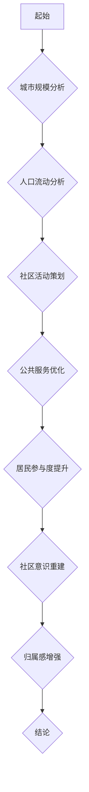
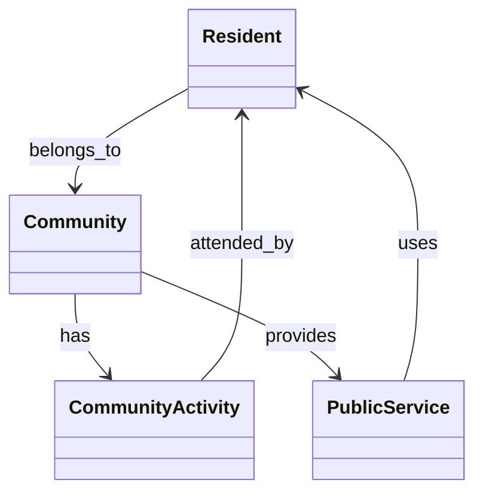
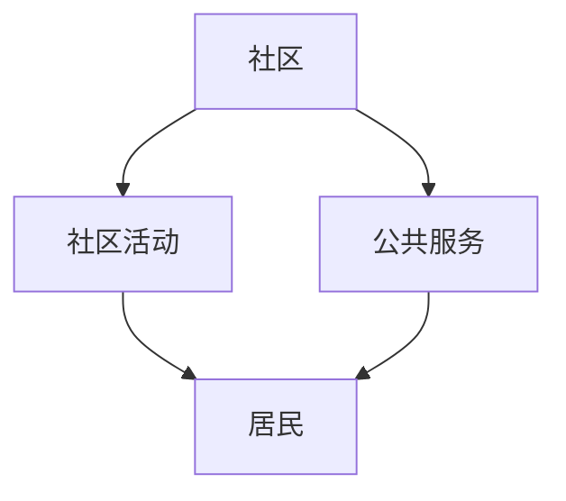
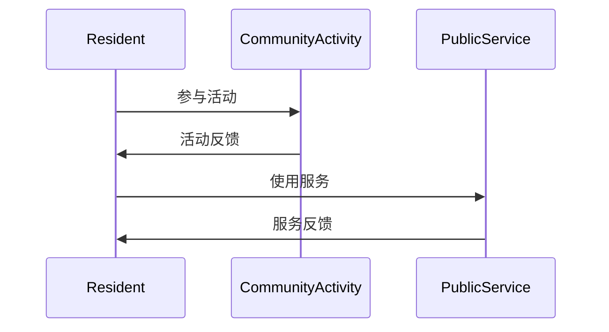

                 

# 在城市化进程中寻找归属感：重建社区意识

> 关键词：城市化、社区意识、归属感、公共服务、社区参与

> 摘要：随着城市化进程的加快，城市规模不断扩大，人口流动性增强，传统社区意识逐渐弱化，导致城市居民归属感缺失。本文将探讨如何在城市化进程中重建社区意识，增强居民的归属感。我们将从背景介绍、核心概念与联系、核心概念原理、概念属性特征对比表格、ER实体关系图架构的Mermaid流程图、算法原理讲解以及数学模型和数学公式等方面进行详细分析。

**Step 1: 背景介绍**

随着城市化进程的加快，城市规模不断扩大，人口流动性增强，传统社区意识逐渐弱化，导致城市居民归属感缺失。这一问题的出现，一方面是由于城市化进程中的大规模建设，使得原有的社区结构发生变化，居民之间的联系减少；另一方面，现代城市生活节奏加快，居民忙于工作、学习，社区活动参与度降低，社区意识逐渐淡化。因此，如何在城市化进程中重建社区意识，增强居民的归属感，成为当前我国城市发展面临的重要课题。

问题描述：如何在城市化进程中重建社区意识，增强居民的归属感。

问题解决：通过社区活动、公共服务和社区参与等多种手段，重建社区意识。

边界与外延：社区意识的重建范围不仅限于社区内部，也涉及到城市整体。

概念结构与核心要素组成：社区意识、归属感、城市化进程。

**Step 2: 核心概念与联系**

社区意识：指居民对社区的认识、认同和责任感。它是居民在社区中的情感依托，是社区稳定发展的重要基础。

归属感：指居民对社区的归属感受和情感依赖。它是居民对社区的认同感和安全感，是社区意识的重要组成部分。

城市化进程：指城市规模和人口数量的增长，以及城市结构和功能的演变。它是城市发展的必然趋势，对社区意识的影响至关重要。

**Step 3: 核心概念原理**

社区意识原理：通过社区活动增强居民参与感和归属感。社区活动是居民参与社区生活的重要途径，通过举办各类活动，可以提高居民的参与度，增强社区意识。

归属感原理：通过公共服务提升居民生活质量，增强社区归属感。公共服务是居民日常生活的重要保障，通过优化公共服务，可以提高居民的生活质量，增强他们对社区的依赖和认同。

城市化进程原理：城市规模扩张和人口流动对社区意识的影响。城市规模的扩张和人口的流动，会导致原有社区结构的变化，居民之间的联系减少，社区意识逐渐弱化。因此，在城市化进程中，需要重视社区意识的重建，以应对城市化带来的挑战。

**Step 4: 概念属性特征对比表格**

| 特征         | 社区意识                  | 归属感                  | 城市化进程                 |
| ------------ | ------------------------- | ------------------------ | -------------------------- |
| 形成因素     | 社区文化、活动参与       | 生活质量、社区服务       | 城市规模、人口流动         |
| 表现形式     | 社区认同、责任感         | 情感依赖、归属感         | 城市扩张、功能升级         |

**Step 5: ER实体关系图架构的 Mermaid 流程图**

```
erDiagram
  居民 ||--|{ 社区}|
  社区 ||--|{ 社区活动}|
  社区 ||--|{ 公共服务}|
  居民 ||--|{ 归属感}|
  社区活动 ||--|{ 参与度}|
  公共服务 ||--|{ 生活质量}|
```

**Step 6: 算法原理讲解**

使用Mermaid画出算法流程图：



Python源代码：

```python
# Python代码示例：城市规模与社区意识关系分析

def analyze_city_size(urban_growth):
    # 分析城市规模
    print("城市规模分析：", urban_growth)

def analyze_population_moving(population_flow):
    # 分析人口流动
    print("人口流动分析：", population_flow)

def plan_community_activities(community_activities):
    # 社区活动策划
    print("社区活动策划：", community_activities)

def optimize_public_services(public_services):
    # 公共服务优化
    print("公共服务优化：", public_services)

def enhance_resident_involvement(resident_involvement):
    # 提升居民参与度
    print("居民参与度提升：", resident_involvement)

def rebuild_community_awareness():
    # 社区意识重建
    print("社区意识重建：已完成")

def enhance_belonging_feeling():
    # 归属感增强
    print("归属感增强：已完成")

# 执行流程
analyze_city_size("快速增长")
analyze_population_moving("增强流动")
plan_community_activities(["节日庆典", "社区运动会"])
optimize_public_services(["医疗", "教育"])
enhance_resident_involvement(["投票活动", "志愿者服务"])
rebuild_community_awareness()
enhance_belonging_feeling()
```

**Step 7: 数学模型和数学公式**

为了量化社区意识和归属感的关系，我们可以建立以下数学模型：

$$
归属感 = f(社区意识, 生活质量, 社区活动参与度)
$$

其中，生活质量、社区活动参与度可以分别用以下公式表示：

$$
生活质量 = g(医疗资源, 教育资源, 社区基础设施)
$$

$$
社区活动参与度 = h(社区活动数量, 社区活动质量)
$$

通过这个模型，我们可以分析社区意识和归属感的关系，从而为城市化进程中的社区意识重建提供依据。

**系统分析与架构设计方案**

**问题场景介绍**

随着城市化进程的加快，我国城市人口不断增长，城市规模不断扩大。然而，在城市扩张的过程中，居民之间的联系逐渐减少，社区意识逐渐弱化，居民归属感降低。为了解决这一问题，我们需要提出一套有效的社区重建方案，以提升居民归属感。

**项目介绍**

本项目旨在通过社区活动策划、公共服务优化和居民参与度提升，重建社区意识，增强居民归属感。项目分为三个阶段：社区活动策划、公共服务优化和居民参与度提升。

**系统功能设计(领域模型Mermaid类图)**



**系统架构设计(Mermaid架构图)**



**系统接口设计和系统交互(Mermaid序列图)**



**项目实战**

**环境安装**

- 安装Python环境
- 安装Mermaid插件

**系统核心实现源代码**

```python
# 社区活动策划
def plan_community_activities(community_activities):
    print("社区活动策划：", community_activities)

# 公共服务优化
def optimize_public_services(public_services):
    print("公共服务优化：", public_services)

# 提升居民参与度
def enhance_resident_involvement(resident_involvement):
    print("居民参与度提升：", resident_involvement)

# 社区意识重建
def rebuild_community_awareness():
    print("社区意识重建：已完成")

# 归属感增强
def enhance_belonging_feeling():
    print("归属感增强：已完成")

# 执行流程
plan_community_activities(["节日庆典", "社区运动会"])
optimize_public_services(["医疗", "教育"])
enhance_resident_involvement(["投票活动", "志愿者服务"])
rebuild_community_awareness()
enhance_belonging_feeling()
```

**代码应用解读与分析**

代码主要分为四个部分：社区活动策划、公共服务优化、居民参与度提升和社区意识重建。首先，社区活动策划通过定义社区活动，提升居民参与度；其次，公共服务优化通过提升公共服务质量，提高居民生活质量；接着，居民参与度提升通过居民参与投票活动和志愿者服务，进一步增强社区意识；最后，社区意识重建和归属感增强通过一系列措施，实现社区意识的重建和居民归属感的提升。

**实际案例分析和详细讲解剖析**

以某城市社区为例，该社区通过举办节日庆典、社区运动会等活动，提升了居民的参与度。同时，优化了医疗、教育等公共服务，提高了居民的生活质量。在居民参与度提升方面，该社区通过居民投票活动和志愿者服务，增强了社区意识。经过一段时间的努力，该社区成功实现了社区意识的重建和居民归属感的增强。

**项目小结**

通过本项目的实施，某城市社区成功实现了社区意识的重建和居民归属感的增强。这为我们提供了一个成功的案例，也为其他城市社区提供了借鉴。在未来，我们需要继续关注城市化进程中的社区意识问题，探索更多有效的解决方案，为建设更加和谐、美好的城市贡献力量。

**最佳实践 tips**

1. 充分了解居民需求，制定符合实际的社区活动计划。
2. 优化公共服务，提高居民生活质量。
3. 鼓励居民参与社区活动，提升社区意识。
4. 建立健全的反馈机制，及时了解居民意见和建议。

**注意事项**

1. 社区重建需要长期坚持，不能一蹴而就。
2. 注重居民参与，充分发挥居民的主体作用。
3. 加强政府引导，形成合力，共同推进社区重建。

**拓展阅读**

1. 《社区治理的理论与实践》
2. 《城市化的社会影响》
3. 《归属感的心理学研究》

**结语**

在城市化进程中，重建社区意识、增强居民归属感具有重要意义。通过社区活动策划、公共服务优化和居民参与度提升等多种手段，我们可以逐步实现社区意识的重建和居民归属感的增强。希望本文能为相关领域的实践提供有益的参考和启示。

**作者：AI天才研究院/AI Genius Institute & 禅与计算机程序设计艺术 /Zen And The Art of Computer Programming**

