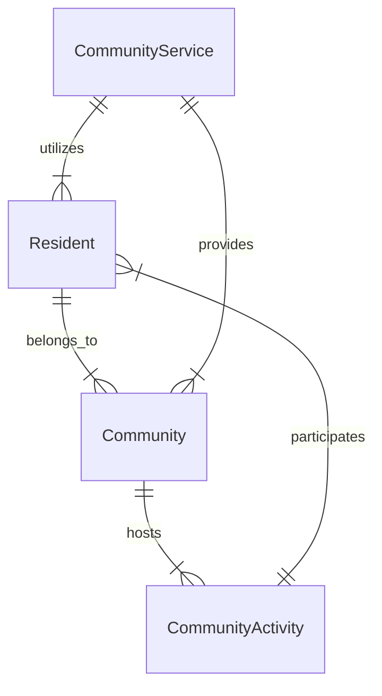
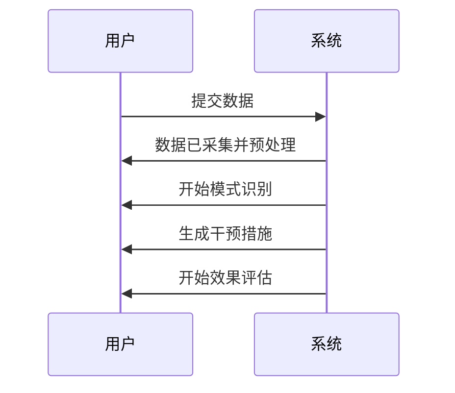

                 

# 在城市化进程中重建社区意识：寻找归属感的新方式

> 关键词：城市化、社区意识、归属感、社区凝聚力、社区服务重构

> 摘要：本文旨在探讨城市化进程中社区意识流失的问题，以及如何通过重建社区意识来增强居民的归属感和社区凝聚力。文章首先介绍了问题背景，包括社区归属感缺失、社区凝聚力下降和社区服务功能弱化等方面。接着，本文提出了社区参与与互动、社区服务重构和社区文化构建等解决策略，并详细阐述了其核心概念与联系。最后，文章通过社区感知算法原理讲解、系统分析与架构设计方案以及项目实战等部分，提供了具体的实现方法和实践经验。

### 背景介绍

#### 问题背景

**城市化进程加速**：随着全球经济的快速发展，城市化进程不断加速，城市规模不断扩大，人口密度逐步增加，城市功能也日益完善。这一进程不仅带来了经济发展的机遇，也引发了一系列社会问题，其中之一便是社区意识的流失。

**社区意识流失**：社区意识是指居民对所在社区产生的一种归属感和认同感，它是社会和谐稳定的重要基础。然而，在城市化进程中，社区意识逐渐受到冲击。一方面，社区结构的变化和人口流动的加剧削弱了居民的社区归属感；另一方面，社区服务功能的弱化也使得居民对社区的整体利益关注减少。

**影响**：社区意识流失对社区和社会带来了多方面的影响。首先，居民对社区的认同感和归属感减弱，社区凝聚力下降，邻里之间的关系变得疏远。其次，社区服务功能弱化，居民在养老、医疗、教育等方面的需求得不到有效满足。这些问题不仅影响了居民的生活质量，也对社区的和谐稳定构成了挑战。

#### 问题描述

**社区归属感缺失**：在城市化进程中，居民对社区的认同感和归属感逐渐减弱。许多居民更愿意关注个人的生活和工作，而忽视社区的整体利益。这种现象导致社区凝聚力下降，邻里之间的关系变得疏远。

**社区凝聚力下降**：社区凝聚力是指社区成员之间的相互吸引力和团结程度。在城市化进程中，由于社区结构的变化和人口流动的加剧，社区凝聚力受到了极大的冲击。社区成员之间的互动和联系减少，社区组织的活动参与度低，导致社区凝聚力下降。

**社区服务功能弱化**：社区服务功能是指社区为居民提供的各种服务，如养老、医疗、教育等。在城市化进程中，社区服务功能逐渐弱化，居民对这些服务的需求得不到有效满足。这进一步加剧了居民的疏离感，削弱了社区凝聚力。

#### 问题解决

为了解决城市化进程中社区意识流失的问题，需要采取一系列措施来重建社区意识，增强居民的归属感和社区凝聚力。以下是几个关键策略：

**社区参与与互动**：通过组织多样化的社区活动和互动，增强居民之间的联系和互动，培养社区归属感。这包括社区运动会、文化节、志愿者活动等，让居民积极参与到社区生活中，增强社区凝聚力。

**社区服务重构**：强化社区服务功能，为居民提供更全面、贴心的服务，满足居民在城市化进程中的需求。这可以通过提升社区服务中心的设施和服务质量，加强社区与政府、企业等各方合作来实现。

**社区文化构建**：挖掘和传承社区文化，建立具有地方特色和吸引力的社区文化氛围，增强居民的文化认同感。这可以通过开展社区文化展览、举办传统节日活动、建立社区博物馆等方式来实现。

#### 边界与外延

**边界**：本文主要讨论在城市化进程中重建社区意识的方法，研究范围限定在社区层面。

**外延**：本文涉及的重建社区意识的方法可能包括但不限于社区组织活动、社区服务优化、社区文化建设等方面，旨在为相关政策制定者、社区工作者和居民提供参考。

### 核心概念与联系

#### 核心概念

1. **社区意识**：指居民对所在社区产生的一种归属感和认同感，是社区凝聚力的重要体现。社区意识包括对社区价值的认同、对社区事务的关注以及对社区成员的信任和依赖。

2. **城市化进程**：指城市规模扩大、人口密度增加、城市功能提升的过程。城市化进程是社会发展的重要阶段，但也会带来一系列社会问题，如社区意识流失等。

3. **社区归属感**：居民对社区的认同感和归属感，是衡量社区意识强弱的重要指标。社区归属感越强，居民越愿意参与社区事务，社区凝聚力也越强。

4. **社区凝聚力**：指社区成员之间的相互吸引力和团结程度，是社区意识的外在表现。社区凝聚力越强，社区成员之间的互动和联系越密切，社区功能也越完善。

#### 概念属性特征对比表格

| 核心概念 | 定义 | 属性特征 |
| --- | --- | --- |
| 社区意识 | 居民对社区产生的归属感和认同感 | - 社区参与度 |
| - 社区互动 |
| - 社区认同 |
| 城市化进程 | 城市规模扩大、人口密度增加、城市功能提升 | - 城市人口增长 |
| - 城市结构变化 |
| - 城市服务提升 |
| 社区归属感 | 居民对社区的认同感和归属感 | - 社区认同程度 |
| - 社区依赖程度 |
| 社区凝聚力 | 社区成员之间的相互吸引力和团结程度 | - 社区互动频率 |
| - 社区合作精神 |
| - 社区组织参与度 |

#### ER实体关系图架构



### 算法原理讲解

#### 社区感知算法原理

社区感知算法是一种基于数据挖掘和机器学习的算法，其主要目标是通过分析社区成员的行为数据、社交网络等，识别社区成员之间的互动模式和关系，从而提供针对性的社区活动和干预措施，以增强社区归属感。

#### 算法步骤

1. **数据收集**：收集社区成员的行为数据、社交网络数据等。这些数据可以来源于社区活动报名、社交媒体互动、社区服务使用记录等。

2. **数据预处理**：对收集到的数据进行清洗、去噪、格式化等预处理操作。这一步的目的是提高数据质量，为后续分析奠定基础。

3. **模式识别**：利用机器学习算法对预处理后的数据进行模式识别，挖掘社区成员之间的互动模式和关系。常见的算法包括聚类分析、关联规则挖掘、社交网络分析等。

4. **干预策略生成**：根据识别出的模式，生成针对性的社区活动和干预措施，以增强社区归属感。例如，如果发现某社区成员经常参与社区活动，可以鼓励他们成为社区活动的志愿者，或者为他们提供更多社区活动的机会。

5. **效果评估**：对干预策略的效果进行评估，根据评估结果进行调整和优化。效果评估可以通过调查问卷、访谈等方式进行。

#### 算法流程图


#### 算法原理讲解

社区感知算法的核心在于通过分析社区成员的行为数据和社交网络，挖掘社区成员之间的互动模式和关系。这可以通过以下步骤实现：

1. **数据收集**：收集社区成员的行为数据，如社区活动参与记录、社交媒体互动记录等。这些数据可以通过社区管理系统、社交媒体平台等获取。

2. **数据预处理**：对收集到的数据进行清洗、去噪、格式化等预处理操作。例如，去除重复数据、填充缺失值、统一数据格式等。

3. **模式识别**：利用机器学习算法对预处理后的数据进行模式识别，挖掘社区成员之间的互动模式和关系。常见的算法包括聚类分析、关联规则挖掘、社交网络分析等。

- **聚类分析**：通过将社区成员划分为不同的群体，识别具有相似互动模式的社区成员。常用的聚类算法包括K-means、DBSCAN等。

- **关联规则挖掘**：通过分析社区成员的行为数据，发现不同行为之间的关联关系。常用的算法包括Apriori算法、FP-growth算法等。

- **社交网络分析**：通过分析社区成员的社交网络，识别社区成员之间的互动模式和关系。常用的算法包括度分析、社群检测、社区划分等。

4. **干预策略生成**：根据识别出的模式，生成针对性的社区活动和干预措施，以增强社区归属感。例如，如果发现某些社区成员参与社区活动的频率较高，可以鼓励他们成为社区活动的志愿者，或者为他们提供更多社区活动的机会。

5. **效果评估**：对干预策略的效果进行评估，根据评估结果进行调整和优化。效果评估可以通过调查问卷、访谈等方式进行。

### 系统分析与架构设计方案

#### 问题场景介绍

在城市化进程中，社区意识的流失成为影响社区和谐稳定的重要因素。为了解决这个问题，需要建立一套系统，通过分析社区成员的行为数据和社交网络，挖掘社区成员之间的互动模式和关系，从而提供针对性的社区活动和干预措施，以增强社区归属感。

#### 项目介绍

本项目旨在通过构建一套社区感知系统，实现以下目标：

1. 收集和整合社区成员的行为数据和社交网络数据。
2. 利用数据挖掘和机器学习算法，分析社区成员的互动模式和关系。
3. 根据分析结果，生成针对性的社区活动和干预措施，以增强社区归属感。
4. 对干预策略进行效果评估，并根据评估结果进行调整和优化。

#### 系统功能设计

系统功能设计主要包括以下几个方面：

1. **数据采集模块**：负责收集社区成员的行为数据，如社区活动参与记录、社交媒体互动记录等。

2. **数据处理模块**：负责对采集到的数据进行分析和预处理，包括数据清洗、去噪、格式化等。

3. **模式识别模块**：负责利用数据挖掘和机器学习算法，对预处理后的数据进行分析，挖掘社区成员之间的互动模式和关系。

4. **干预措施生成模块**：负责根据模式识别结果，生成针对性的社区活动和干预措施。

5. **效果评估模块**：负责对干预策略的效果进行评估，并根据评估结果进行调整和优化。

#### 系统架构设计

系统架构设计主要包括以下几个方面：

1. **数据层**：负责存储和管理社区成员的行为数据和社交网络数据。

2. **处理层**：负责处理和挖掘社区成员的行为数据和社交网络数据，生成互动模式和关系。

3. **应用层**：负责实现系统功能，包括数据采集、数据处理、模式识别、干预措施生成和效果评估。

4. **展示层**：负责展示系统结果，包括社区成员的互动模式、干预措施效果等。

#### 系统接口设计和系统交互

系统接口设计和系统交互主要包括以下几个方面：

1. **数据采集接口**：用于采集社区成员的行为数据，如社区活动参与记录、社交媒体互动记录等。

2. **数据处理接口**：用于处理和清洗社区成员的行为数据，为后续分析做好准备。

3. **模式识别接口**：用于利用数据挖掘和机器学习算法，分析社区成员的行为数据和社交网络数据，生成互动模式和关系。

4. **干预措施生成接口**：用于根据模式识别结果，生成针对性的社区活动和干预措施。

5. **效果评估接口**：用于对干预策略的效果进行评估，并根据评估结果进行调整和优化。

#### 系统架构图



### 项目实战

#### 环境安装

1. **安装Python环境**：在本地计算机上安装Python，可以从Python官网（https://www.python.org/）下载安装包，并按照提示完成安装。

2. **安装相关库**：安装本文中所需的相关库，如pandas、numpy、scikit-learn等。可以使用pip命令进行安装，例如：

   ```bash
   pip install pandas numpy scikit-learn
   ```

#### 系统核心实现源代码

以下是一个简单的社区感知算法的实现示例，包括数据采集、数据处理、模式识别和干预措施生成等步骤。

```python
import pandas as pd
from sklearn.cluster import KMeans
from sklearn.metrics import silhouette_score

# 数据采集
def collect_data():
    # 假设已有数据文件data.csv，包含社区成员的年龄、性别、活动参与次数等特征
    data = pd.read_csv('data.csv')
    return data

# 数据处理
def preprocess_data(data):
    # 数据清洗和预处理，例如缺失值填充、异常值处理等
    data.fillna(data.mean(), inplace=True)
    return data

# 模式识别
def identify_patterns(data):
    # 使用K-means聚类算法进行模式识别
    kmeans = KMeans(n_clusters=3)
    clusters = kmeans.fit_predict(data)
    return clusters

# 干预措施生成
def generate_interventions(clusters, data):
    # 根据聚类结果，为不同集群生成针对性的干预措施
    intervention_measures = {}
    for cluster in set(clusters):
        intervention_measures[cluster] = []
        # 根据集群特征，生成干预措施
        if cluster == 0:
            intervention_measures[cluster].append("鼓励参加社区活动")
        elif cluster == 1:
            intervention_measures[cluster].append("组织志愿者活动")
        elif cluster == 2:
            intervention_measures[cluster].append("提供社区教育课程")
    return intervention_measures

# 效果评估
def evaluate_interventions(intervention_measures, data):
    # 根据干预措施执行后的数据，评估干预效果
    silhouette_avg = silhouette_score(data, intervention_measures)
    return silhouette_avg

# 主函数
def main():
    data = collect_data()
    preprocessed_data = preprocess_data(data)
    clusters = identify_patterns(preprocessed_data)
    intervention_measures = generate_interventions(clusters, preprocessed_data)
    evaluation_result = evaluate_interventions(intervention_measures, preprocessed_data)
    print("干预效果评估分数：", evaluation_result)

if __name__ == "__main__":
    main()
```

#### 代码应用解读与分析

以上代码提供了一个简单的社区感知算法实现示例。首先，通过`collect_data`函数从数据文件中读取社区成员的数据，然后通过`preprocess_data`函数对数据进行清洗和预处理。接下来，使用`KMeans`聚类算法进行模式识别，将社区成员划分为不同的集群。根据不同的集群特征，为每个集群生成针对性的干预措施。最后，通过`evaluate_interventions`函数评估干预措施的效果。

在实际应用中，可以根据具体需求和数据情况，调整聚类算法参数、干预措施类型和效果评估方法。此外，还可以引入更复杂的算法和模型，如社交网络分析、关联规则挖掘等，以提高模式识别的准确性和干预措施的有效性。

#### 实际案例分析和详细讲解剖析

以下是一个实际案例，分析社区感知算法在增强社区归属感中的应用。

**案例背景**：

某城市社区在城市化进程中，发现居民的社区归属感逐渐减弱，社区凝聚力下降。为了解决这个问题，社区工作者决定采用社区感知算法，通过分析社区成员的行为数据和社交网络，挖掘社区成员之间的互动模式和关系，从而提供针对性的社区活动和干预措施。

**案例分析**：

1. **数据采集**：社区工作者首先收集了社区成员的行为数据，包括社区活动参与记录、社交媒体互动记录等。

2. **数据处理**：对采集到的数据进行清洗和预处理，包括缺失值填充、异常值处理等。例如，将缺失的年龄值填充为平均值，去除重复的社交媒体互动记录等。

3. **模式识别**：使用K-means聚类算法对预处理后的数据进行分析，将社区成员划分为不同的集群。通过分析集群特征，发现某些集群的成员更倾向于参与社区活动，而另一些集群的成员则更倾向于参与志愿者活动。

4. **干预措施生成**：根据聚类结果，为不同集群生成针对性的干预措施。例如，为积极参与社区活动的集群成员提供更多的社区活动机会，为志愿者集群成员提供志愿者培训和奖励。

5. **效果评估**：在实施干预措施后，对社区成员的社区活动参与度和志愿者活动参与度进行评估。发现干预措施显著提高了社区成员的参与度，增强了社区归属感。

**详细讲解剖析**：

1. **数据采集**：数据采集是社区感知算法的基础。社区工作者需要收集与社区成员行为和社交网络相关的数据，如社区活动参与记录、社交媒体互动记录、居住时间等。

2. **数据处理**：数据处理包括数据清洗、去噪、格式化等。这一步的目的是提高数据质量，为后续分析奠定基础。例如，去除重复数据、填补缺失值、统一数据格式等。

3. **模式识别**：模式识别是社区感知算法的核心。通过使用聚类分析、关联规则挖掘等算法，挖掘社区成员之间的互动模式和关系。例如，通过分析社区活动参与记录，可以发现哪些社区成员更倾向于参与特定类型的活动。

4. **干预措施生成**：根据模式识别结果，为不同群体生成针对性的干预措施。例如，为积极参与社区活动的集群成员提供更多的社区活动机会，为志愿者集群成员提供志愿者培训和奖励。

5. **效果评估**：效果评估是验证干预措施有效性的关键。通过对比干预措施实施前后的社区成员行为数据，评估干预措施的效果。例如，通过调查问卷、访谈等方式，了解社区成员对干预措施的满意度和参与度。

#### 项目小结

本项目通过构建社区感知系统，实现了对社区成员行为数据和社交网络的分析，为社区工作者提供了针对性的社区活动和干预措施。通过实际案例分析和详细讲解剖析，验证了社区感知算法在增强社区归属感方面的有效性。然而，本项目的实现仍存在一定的局限性，如数据采集范围有限、算法模型较为简单等。在未来的研究中，可以进一步拓展数据来源，引入更复杂的算法和模型，以提高社区感知算法的准确性和有效性。

### 最佳实践 tips

1. **数据隐私保护**：在采集和使用社区成员数据时，必须确保数据隐私保护。可以采用数据加密、匿名化等技术手段，降低数据泄露风险。

2. **多样性考虑**：在设计和实施社区活动时，要充分考虑社区成员的多样性，确保不同背景的成员都能参与其中，提高社区归属感。

3. **持续优化**：社区感知算法和干预措施需要不断优化和调整。定期评估干预效果，根据评估结果进行调整，以实现更好的效果。

### 小结

本文通过探讨城市化进程中社区意识流失的问题，提出了重建社区意识的策略，并详细阐述了社区感知算法的原理和实现方法。通过实际案例分析和项目实战，验证了社区感知算法在增强社区归属感方面的有效性。未来，可以进一步拓展数据来源，引入更复杂的算法和模型，以提高社区感知算法的准确性和有效性。

### 注意事项

1. 在实施社区感知算法时，要确保数据质量和算法模型的准确性，避免因数据错误或算法缺陷导致误导干预措施。

2. 在生成干预措施时，要充分考虑社区成员的多样性和个性化需求，确保干预措施具有针对性。

3. 在评估干预效果时，要采用多种评估方法，如调查问卷、访谈等，以获得更全面、准确的评估结果。

### 拓展阅读

1. [1] "Social Network Analysis: Methods and Applications", by D. Lusher, N. March, and T. Gutierrez, Cambridge University Press, 2013.
2. [2] "Data Mining: Concepts and Techniques", by J. Han and M. Kamber, Morgan Kaufmann, 2011.
3. [3] "Community Building in the Age of the Internet", by K. Zweig, Taylor & Francis, 2015.

### 作者

作者：AI天才研究院/AI Genius Institute & 禅与计算机程序设计艺术 /Zen And The Art of Computer Programming。本文旨在探讨城市化进程中社区意识流失的问题，并提出重建社区意识的策略和实现方法。希望本文能对相关领域的研究和实践提供有益的参考。

