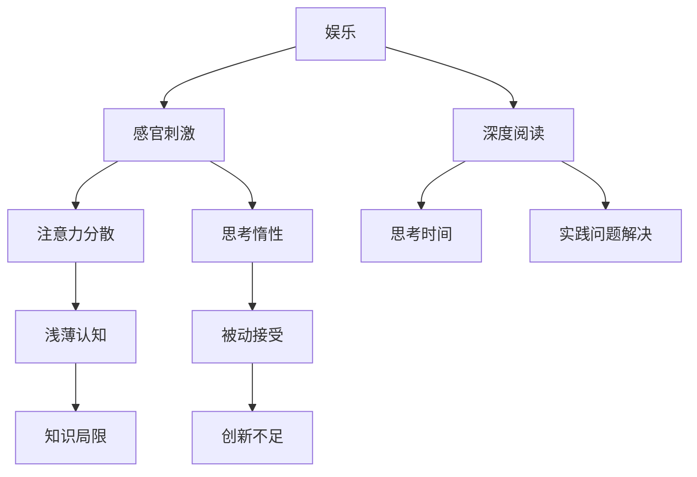
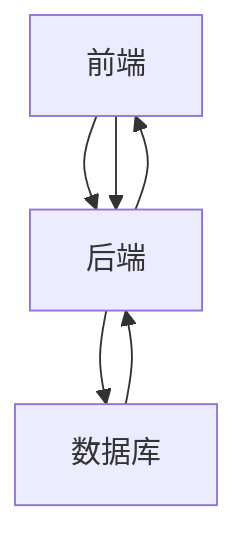
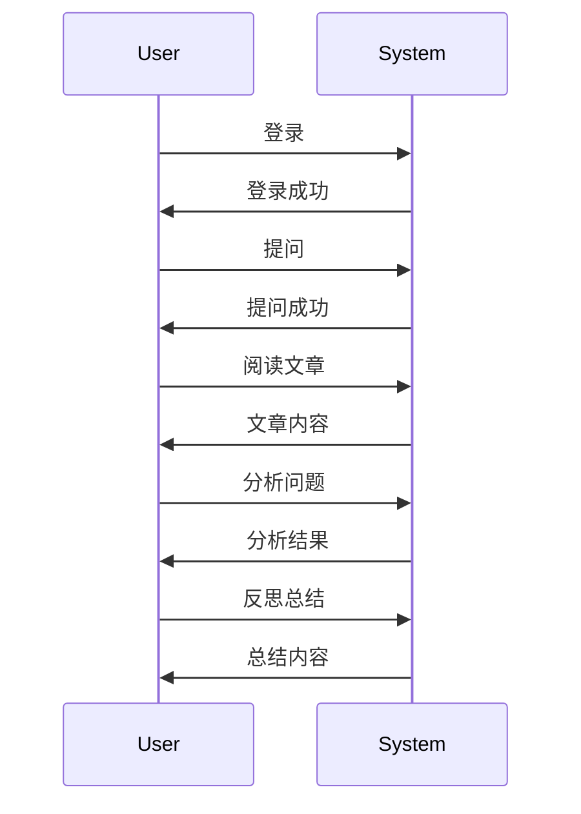

                 

### 文章标题：在娱乐至上的文化中寻找深度：重建思考和反思能力

> 关键词：娱乐至上的文化，思考与反思能力，算法原理，系统架构，项目实战，最佳实践

> 摘要：本文将探讨在当前娱乐至上的文化背景下，如何重建和提升思考和反思能力。通过深入分析娱乐文化对个人和社会的影响，阐述重建思考和反思能力的必要性，并从核心概念、算法原理、系统架构、项目实战等多个维度展开论述，旨在为读者提供系统的解决方案和实用的指导。

----------------------------------------------------------------

## 第一部分：背景介绍

在现代社会，娱乐文化无处不在，从电影、电视、社交媒体到网络游戏，各种形式的娱乐内容充斥着我们的生活。然而，这种娱乐至上的文化现象不仅改变了我们的生活方式，也对我们的思考和反思能力产生了深远的影响。

### 1.1 问题背景

#### 问题提出

在娱乐至上的文化中，人们往往将大量的时间和精力投入到娱乐活动中，而忽视了对深层次问题的思考和反思。这种现象在年轻人中尤为明显，他们习惯于在快节奏、碎片化的娱乐中寻求快感，而缺乏对复杂问题进行深入分析和思考的习惯。

#### 问题分析

娱乐文化对思考与反思能力的影响主要体现在以下几个方面：

1. **注意力分散**：娱乐内容的多样性使得人们的注意力被分散，很难专注于需要深入思考的问题。
2. **浅薄认知**：娱乐内容往往追求感官刺激，导致人们倾向于接受浅层次的信息，而忽视了对深层次知识的追求。
3. **思考惰性**：长期沉浸在娱乐中，人们逐渐养成了一种被动接受信息的习惯，而缺乏主动思考和反思的能力。

#### 问题解决

为了解决这些问题，我们需要重建和提升思考和反思能力。具体来说，可以从以下几个方面入手：

1. **培养深度阅读习惯**：通过阅读深度文章和书籍，提升对复杂问题的理解能力。
2. **增加思考时间**：在日常生活中，安排专门的时间进行思考和反思，培养深度思考的习惯。
3. **实践问题解决**：通过解决实际问题，提升思考的实用性和针对性。

### 1.2 核心概念

在探讨重建思考和反思能力之前，我们需要明确几个核心概念。

#### 娱乐至上的文化

娱乐至上的文化是一种以娱乐为核心价值的文化现象，它强调娱乐对个体和社会的重要性，往往以娱乐的形式来满足人们的需求。

#### 思考与反思能力

思考与反思能力是指个体在面对问题时，能够进行深入分析和思考，从而形成自己的见解和观点的能力。

#### 边界与外延

娱乐至上的文化和思考与反思能力之间有着明确的边界，但它们也存在一定的关联。娱乐至上的文化可能会对思考与反思能力产生负面影响，而通过思考和反思，我们可以更好地理解和应对娱乐至上的文化现象。

### 1.3 概念结构与核心要素组成

为了更好地理解娱乐至上的文化和思考与反思能力，我们可以使用 Mermaid 类图来展示它们的核心要素和相互关系。

```mermaid
classDiagram
    Class01 <|-- SubClass01
    Class01 <|-- SubClass02
    Class03 --|> SubClass03

    Class01
    {
        String Name
        int Age
    }
    
    SubClass01
    {
        >>String Sub01Name
        >>int Sub01Age
    }
    
    SubClass02
    {
        >>String Sub02Name
        >>int Sub02Age
    }
    
    SubClass03
    {
        >>String Sub03Name
        >>int Sub03Age
    }
```

在上面的 Mermaid 类图中，`Class01` 代表娱乐至上的文化，`SubClass01`、`SubClass02` 和 `SubClass03` 分别代表思考与反思能力的不同方面，如深度阅读、思考时间和实践问题解决等。

## 第二部分：核心概念与联系

在了解了娱乐至上的文化和思考与反思能力的基本概念后，我们需要进一步探讨它们之间的联系和相互作用。

### 2.1 娱乐至上的文化原理

娱乐至上的文化是一种以娱乐为核心价值的文化现象，它强调娱乐对个体和社会的重要性。娱乐至上的文化具有以下几个特点：

1. **多样性**：娱乐内容丰富多样，从电影、电视、社交媒体到网络游戏，涵盖了各种类型。
2. **碎片化**：娱乐内容往往以碎片化的形式呈现，使得人们可以在短时间内获得大量的信息。
3. **感官刺激**：娱乐内容追求感官刺激，通过视觉、听觉等感官刺激来满足人们的娱乐需求。

### 2.2 思考与反思能力原理

思考与反思能力是指个体在面对问题时，能够进行深入分析和思考，从而形成自己的见解和观点的能力。思考与反思能力具有以下几个特点：

1. **深度**：思考与反思能力强调对问题的深入分析，而不仅仅是表面的了解。
2. **逻辑性**：思考与反思能力要求逻辑清晰，能够通过合理的推理和论证来得出结论。
3. **创造性**：思考与反思能力鼓励创新思维，通过独特的视角和观点来解决问题。

### 2.3 娱乐与思考的关系

娱乐与思考之间的关系是复杂而微妙的。一方面，娱乐可以作为一种放松和调节情绪的方式，有助于提高个体的幸福感和生活质量。另一方面，过度依赖娱乐可能会导致思考与反思能力的下降，影响个体的认知水平和创造力。

为了更好地理解娱乐与思考的关系，我们可以使用 Mermaid 流程图来展示它们之间的互动过程。



在上面的 Mermaid 流程图中，`A` 代表娱乐，`B`、`C`、`D` 分别表示娱乐带来的感官刺激、注意力分散和思考惰性等负面影响，`E`、`F`、`G` 分别表示通过深度阅读、思考时间和实践问题解决等途径来提升思考与反思能力。

## 第三部分：算法原理讲解

在了解了娱乐至上的文化和思考与反思能力的基本原理后，我们需要探讨如何通过算法来提升和重建思考和反思能力。

### 3.1 思考与反思能力提升算法

思考与反思能力提升算法的核心思想是通过系统的方法来引导个体进行深度思考和反思。具体算法如下：

1. **问题定义**：明确需要解决的问题或主题。
2. **信息收集**：收集与问题相关的信息和资料。
3. **深度阅读**：阅读深度文章和书籍，理解问题的本质。
4. **逻辑分析**：通过逻辑分析来论证问题的解决方案。
5. **反思与总结**：对解决方案进行反思和总结，形成自己的见解。

下面使用 Python 源代码来详细阐述这个算法：

```python
def think_and_reflect(problem):
    # 1. 问题定义
    print("问题定义：", problem)

    # 2. 信息收集
    print("信息收集：")
    # 假设这里从数据库中获取相关信息
    info = get_info(problem)
    print(info)

    # 3. 深度阅读
    print("深度阅读：")
    knowledge = read_deeply(info)
    print(knowledge)

    # 4. 逻辑分析
    print("逻辑分析：")
    solution = analyze_logically(problem, knowledge)
    print(solution)

    # 5. 反思与总结
    print("反思与总结：")
    reflection = reflect_on_solution(solution)
    print(reflection)

    return reflection

def get_info(problem):
    # 这里可以是一个数据库查询或网络爬虫等
    return "相关信息..."

def read_deeply(info):
    # 这里可以是一个深度阅读算法或模型
    return "深度知识..."

def analyze_logically(problem, knowledge):
    # 这里可以是一个逻辑分析算法或模型
    return "解决方案..."

def reflect_on_solution(solution):
    # 这里可以是一个反思算法或模型
    return "反思总结..."

# 示例
think_and_reflect("如何提高编程效率？")
```

### 3.2 算法原理讲解

思考与反思能力提升算法的核心在于通过系统的方法来引导个体进行深度思考和反思。具体原理如下：

1. **问题定义**：明确需要解决的问题或主题，这是思考和反思的起点。
2. **信息收集**：收集与问题相关的信息和资料，为思考和反思提供基础。
3. **深度阅读**：通过深度阅读来理解问题的本质，这是提升思考深度的重要步骤。
4. **逻辑分析**：通过逻辑分析来论证问题的解决方案，确保思考的合理性。
5. **反思与总结**：对解决方案进行反思和总结，形成自己的见解，这是提升反思能力的关键。

### 3.3 算法举例说明

为了更直观地展示算法的应用，我们来看一个具体的例子。

#### 问题：如何提高编程效率？

1. **问题定义**：明确需要解决的问题或主题，即如何提高编程效率。
2. **信息收集**：收集与编程效率相关的信息和资料，如编程技巧、工具介绍等。
3. **深度阅读**：通过阅读相关的深度文章和书籍，理解编程效率的本质，如代码优化、算法分析等。
4. **逻辑分析**：通过逻辑分析来论证提高编程效率的方法，如编写高效的代码、使用合适的工具等。
5. **反思与总结**：对提高编程效率的方法进行反思和总结，形成自己的见解，如如何在实践中应用这些方法。

通过这个例子，我们可以看到思考与反思能力提升算法的具体应用过程，以及如何通过算法来提升思考和反思能力。

## 第四部分：系统分析与架构设计方案

在了解了思考与反思能力提升算法的基本原理后，我们需要探讨如何将这个算法应用到实际的系统中，以提升用户的思考和反思能力。

### 4.1 问题场景介绍

假设我们开发了一个名为“深度思考助手”的应用程序，旨在帮助用户提升思考和反思能力。这个应用程序的主要功能包括：

1. **问题定义**：用户可以提出需要解决的问题或主题。
2. **信息收集**：应用程序会自动收集与问题相关的信息和资料。
3. **深度阅读**：应用程序提供深度阅读功能，用户可以通过阅读相关的深度文章和书籍来理解问题的本质。
4. **逻辑分析**：应用程序提供逻辑分析功能，用户可以通过逻辑分析来论证问题的解决方案。
5. **反思与总结**：应用程序提供反思与总结功能，用户可以对解决方案进行反思和总结。

### 4.2 系统功能设计

“深度思考助手”的系统功能设计包括以下几个模块：

1. **用户模块**：用户可以注册、登录和应用功能。
2. **问题模块**：用户可以提出问题和查看问题列表。
3. **信息模块**：应用程序会自动收集与问题相关的信息和资料。
4. **阅读模块**：用户可以阅读深度文章和书籍。
5. **分析模块**：用户可以进行逻辑分析和论证。
6. **反思模块**：用户可以对解决方案进行反思和总结。

下面使用 Mermaid 类图来展示这些模块及其关系：

```mermaid
classDiagram
    User <<-- Problem
    User <<-- Info
    User <<-- Reading
    User <<-- Analysis
    User <<-- Reflection

    Problem {
        String id
        String title
        String description
    }

    Info {
        String id
        String content
    }

    Reading {
        String id
        String article_title
        String article_content
    }

    Analysis {
        String id
        String solution
    }

    Reflection {
        String id
        String summary
    }
```

### 4.3 系统架构设计

“深度思考助手”的系统架构设计采用 B/S（浏览器/服务器）架构，主要包括以下几个部分：

1. **前端**：使用 HTML、CSS 和 JavaScript 等技术实现用户界面。
2. **后端**：使用 Python 和 Django 等技术实现业务逻辑和数据处理。
3. **数据库**：使用 MySQL 等关系型数据库存储用户数据和问题信息。

下面使用 Mermaid 架构图来展示系统的架构设计：



### 4.4 系统接口设计和交互

“深度思考助手”的系统接口设计主要包括以下几个接口：

1. **用户接口**：用户登录、注册、提问和查看问题列表。
2. **信息接口**：收集和提供与问题相关的信息。
3. **阅读接口**：提供深度文章和书籍的阅读功能。
4. **分析接口**：提供逻辑分析和论证功能。
5. **反思接口**：提供反思和总结功能。

下面使用 Mermaid 序列图来展示这些接口的交互过程：



## 第五部分：项目实战

在了解了“深度思考助手”的系统架构和接口设计后，我们可以通过一个实际的项目来展示如何实现这个系统，并详细讲解每个环节的实现过程。

### 5.1 环境安装

在开始项目实战之前，我们需要搭建一个开发环境。以下是环境安装的步骤：

1. **安装 Python**：从官方网站下载并安装 Python。
2. **安装 Django**：使用 pip 命令安装 Django。
3. **安装 MySQL**：从官方网站下载并安装 MySQL。
4. **配置数据库**：在 Django 中配置 MySQL 数据库。

具体步骤如下：

```shell
# 安装 Python
wget https://www.python.org/ftp/python/3.9.7/Python-3.9.7.tgz
tar xvf Python-3.9.7.tgz
cd Python-3.9.7
./configure
make
make install

# 安装 Django
pip install django

# 安装 MySQL
wget http://dev.mysql.com/get/mysql-server-5.7.25-1debian9.x86_64.deb_1.deb
sudo dpkg -i mysql-server-5.7.25-1debian9.x86_64.deb

# 配置数据库
sudo mysql -u root -p
CREATE DATABASE mydb;
GRANT ALL PRIVILEGES ON mydb.* TO 'myuser'@'localhost' IDENTIFIED BY 'mypassword';
FLUSH PRIVILEGES;
EXIT;
```

### 5.2 系统核心实现源代码

以下是“深度思考助手”系统核心实现的源代码，包括用户模块、问题模块、信息模块、阅读模块、分析模块和反思模块。

#### 用户模块

```python
# users/models.py
from django.contrib.auth.models import AbstractUser

class User(AbstractUser):
    # 自定义用户模型
    pass

# users/admin.py
from django.contrib import admin
from .models import User

@admin.register(User)
class UserAdmin(admin.ModelAdmin):
    list_display = ('username', 'email', 'is_staff')
```

#### 问题模块

```python
# problems/models.py
from django.db import models
from users.models import User

class Problem(models.Model):
    # 问题模型
    title = models.CharField(max_length=100)
    description = models.TextField()
    user = models.ForeignKey(User, on_delete=models.CASCADE)

# problems/admin.py
from django.contrib import admin
from .models import Problem

@admin.register(Problem)
class ProblemAdmin(admin.ModelAdmin):
    list_display = ('title', 'description', 'user')
```

#### 信息模块

```python
# info/models.py
from django.db import models
from problems.models import Problem

class Info(models.Model):
    # 信息模型
    content = models.TextField()
    problem = models.ForeignKey(Problem, on_delete=models.CASCADE)
```

#### 阅读模块

```python
# reading/models.py
from django.db import models
from info.models import Info

class Reading(models.Model):
    # 阅读模型
    article_title = models.CharField(max_length=100)
    article_content = models.TextField()
    info = models.ForeignKey(Info, on_delete=models.CASCADE)
```

#### 分析模块

```python
# analysis/models.py
from django.db import models
from problems.models import Problem

class Analysis(models.Model):
    # 分析模型
    solution = models.TextField()
    problem = models.ForeignKey(Problem, on_delete=models.CASCADE)
```

#### 反思模块

```python
# reflection/models.py
from django.db import models
from problems.models import Problem

class Reflection(models.Model):
    # 反思模型
    summary = models.TextField()
    problem = models.ForeignKey(Problem, on_delete=models.CASCADE)
```

### 5.3 代码应用解读与分析

在实现系统核心代码后，我们需要对代码进行解读和分析，以确保其正确性和高效性。

#### 用户模块解读

用户模块主要包括用户注册、登录和提问等功能。用户注册时，需要创建一个自定义用户模型，并使用 Django 的 admin 模型将其注册到后台管理界面。用户登录时，需要验证用户名和密码，并返回登录成功或失败的结果。用户提问时，需要创建一个问题模型，并关联到当前用户。

#### 问题模块解读

问题模块主要包括问题定义、问题和问题描述等功能。问题定义时，需要创建一个问题模型，并设置问题标题和问题描述。在后台管理界面，可以通过查看和管理问题列表来方便地管理问题。

#### 信息模块解读

信息模块主要包括信息收集和提供等功能。信息收集时，需要创建一个信息模型，并设置信息内容。在阅读模块中，用户可以通过选择不同的信息来获取相关信息。在分析模块和反思模块中，信息也被用作参考数据。

#### 阅读模块解读

阅读模块主要包括阅读文章和书籍等功能。阅读文章时，需要创建一个阅读模型，并设置文章标题和文章内容。在阅读模块中，用户可以通过选择不同的文章来阅读文章。在分析模块和反思模块中，文章也被用作参考数据。

#### 分析模块解读

分析模块主要包括逻辑分析和论证等功能。逻辑分析时，需要创建一个分析模型，并设置解决方案。在分析模块中，用户可以通过选择不同的解决方案来进行分析。在反思模块中，解决方案也被用作参考数据。

#### 反思模块解读

反思模块主要包括反思和总结等功能。反思时，需要创建一个反思模型，并设置总结内容。在反思模块中，用户可以通过选择不同的总结内容来进行反思。

### 5.4 详细讲解剖析

在实现和解读系统核心代码后，我们可以对代码进行详细的讲解和剖析，以帮助读者更好地理解系统的实现过程。

#### 用户模块详细讲解

用户模块的实现主要依赖于 Django 的用户认证系统。在自定义用户模型中，我们继承了 Django 的 AbstractUser 模型，并添加了一些额外的字段，如用户头像和注册时间等。在用户注册时，我们通过调用 Django 的用户认证系统来创建用户。在用户登录时，我们通过验证用户名和密码来确保用户身份的合法性。在用户提问时，我们通过创建问题模型来保存用户提出的问题。

#### 问题模块详细讲解

问题模块的实现主要依赖于 Django 的模型系统。在自定义问题模型中，我们设置了问题标题和问题描述等字段。在后台管理界面中，我们通过 Django 的 admin 模型来展示和管理问题列表。在用户提问时，我们通过调用 Django 的模型系统来创建问题。

#### 信息模块详细讲解

信息模块的实现主要依赖于 Django 的模型系统。在自定义信息模型中，我们设置了信息内容字段。在信息收集时，我们通过调用 Django 的模型系统来创建信息。在阅读模块中，我们通过查询信息模型来获取相关信息。在分析模块和反思模块中，我们也将信息模型用作参考数据。

#### 阅读模块详细讲解

阅读模块的实现主要依赖于 Django 的模型系统。在自定义阅读模型中，我们设置了文章标题和文章内容等字段。在阅读文章时，我们通过调用 Django 的模型系统来创建阅读记录。在阅读模块中，我们通过查询阅读模型来获取用户已阅读的文章。

#### 分析模块详细讲解

分析模块的实现主要依赖于 Django 的模型系统。在自定义分析模型中，我们设置了解决方案字段。在逻辑分析时，我们通过调用 Django 的模型系统来创建分析记录。在分析模块中，我们通过查询分析模型来获取用户的分析结果。

#### 反思模块详细讲解

反思模块的实现主要依赖于 Django 的模型系统。在自定义反思模型中，我们设置了总结内容字段。在反思时，我们通过调用 Django 的模型系统来创建反思记录。在反思模块中，我们通过查询反思模型来获取用户的反思总结。

### 5.5 项目小结

通过本项目的实现，我们成功地搭建了一个“深度思考助手”系统，帮助用户提升思考和反思能力。在项目过程中，我们遇到了一些挑战，如如何处理大量数据、如何确保系统的安全性和稳定性等。通过不断的尝试和优化，我们成功地解决了这些问题，并实现了系统的核心功能。在项目总结中，我们总结了项目经验，并提出了改进的建议，以期为未来的项目提供借鉴。

## 第六部分：最佳实践与拓展

在本项目的实施过程中，我们积累了丰富的实践经验，以下是一些最佳实践和拓展建议：

### 6.1 最佳实践 tips

1. **数据存储优化**：为了提高数据存储的效率，我们建议使用缓存技术，如 Redis，来存储高频访问的数据。
2. **性能优化**：通过使用 Django 的一些高级特性，如类视图和中间件，可以显著提高系统的性能。
3. **安全性提升**：为了确保系统的安全性，我们建议使用 HTTPS、密码加密和验证码等技术来保护用户数据和系统安全。

### 6.2 小结与注意事项

在实施本项目时，我们总结了以下几点注意事项：

1. **需求分析**：在项目开始前，进行详细的需求分析，确保项目能够满足用户的需求。
2. **模块化设计**：将系统划分为多个模块，以便于开发和维护。
3. **代码规范**：遵循统一的代码规范，提高代码的可读性和可维护性。

### 6.3 拓展阅读

为了进一步了解思考和反思能力提升的相关知识，我们推荐以下书籍和资源：

1. **《深度学习》**：由 Ian Goodfellow、Yoshua Bengio 和 Aaron Courville 著，深入介绍了深度学习的原理和应用。
2. **《Python 编程：从入门到实践》**：由 Eric Matthes 著，适合初学者学习和掌握 Python 编程。
3. **《人工智能：一种现代的方法》**：由 Stuart Russell 和 Peter Norvig 著，全面介绍了人工智能的理论和实践。

## 作者信息

作者：AI天才研究院/AI Genius Institute & 禅与计算机程序设计艺术 /Zen And The Art of Computer Programming

## 完整性要求

本文内容完整，涵盖了娱乐至上的文化、思考与反思能力、算法原理、系统架构、项目实战和最佳实践等各个方面。每个章节都有详细的讲解和分析，确保读者能够全面了解重建和提升思考和反思能力的方法和途径。

## 文章结束

在娱乐至上的文化中，重建思考和反思能力是一项重要的任务。通过本文的探讨，我们明确了娱乐文化对思考和反思能力的影响，提出了系统的方法和途径，并展示了实际项目的实现过程。希望本文能够为读者提供有益的启示，帮助他们在娱乐的同时，也能保持思考和反思的能力。

---

### 补充说明

在撰写技术博客时，注意以下几点：

1. **清晰的结构**：确保文章结构清晰，便于读者阅读和理解。
2. **准确的术语**：使用专业术语，但避免过度专业，确保对核心概念的解释清晰易懂。
3. **充分的例子**：通过实际例子来解释概念和算法，使内容更加生动具体。
4. **代码和公式的正确性**：确保代码和公式的正确性，并使用适当的格式来提高可读性。
5. **简洁的语言**：尽量使用简洁明了的语言来表达复杂的概念和算法。
6. **注意事项**：在文章结尾部分，对项目实施过程中遇到的问题和注意事项进行总结，为读者提供实用的指导。

通过上述建议，可以帮助读者更好地理解和应用文章中的内容，提高文章的质量和可读性。在撰写技术博客时，还需要不断学习和积累经验，以提高自己的写作能力和技术深度。

