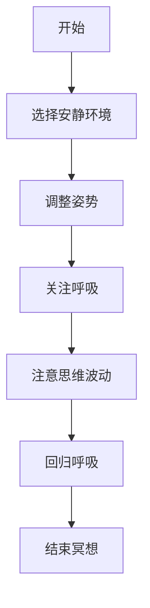
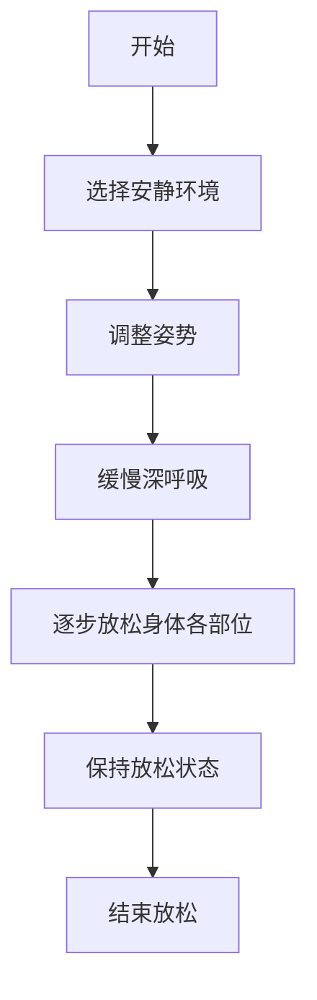
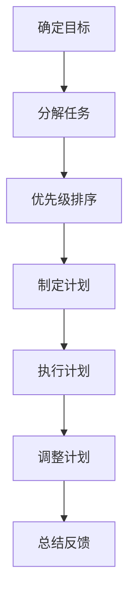
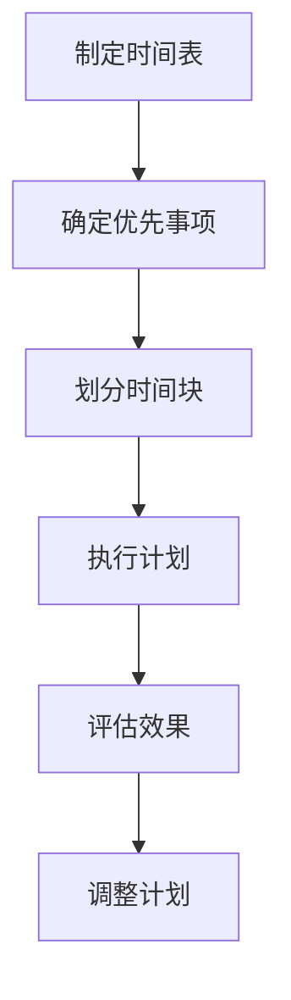
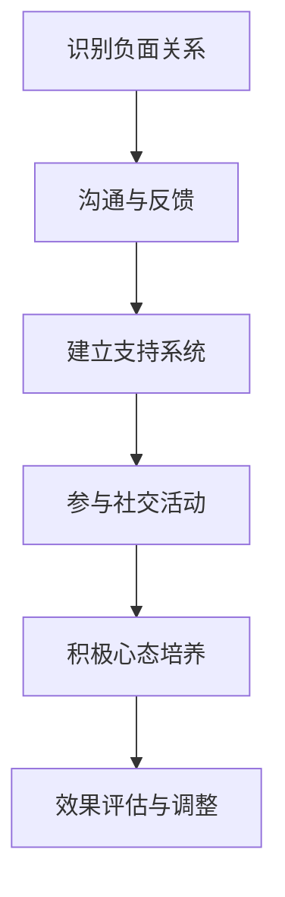
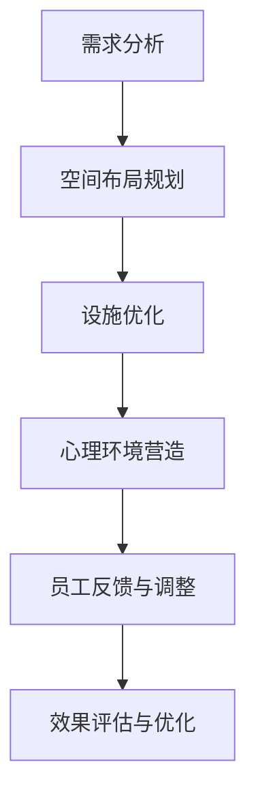

                 

# 在快节奏社会中cultivate内心平静：应对焦虑的策略

## 关键词

快节奏社会、内心平静、焦虑、策略、心理、行为、环境

## 摘要

随着现代社会的快速发展和生活节奏的加快，人们面临着前所未有的压力和焦虑。本文从技术视角出发，探讨了在快节奏社会中培养内心平静的必要性和方法。通过逻辑清晰、结构紧凑的章节设计，本文详细介绍了应对焦虑的核心策略，包括心理策略、行为策略和环境策略，并通过实际案例解析和实战指导，为读者提供了一套实用且系统的解决方案。

----------------------------------------------------------------

### 第一部分：问题背景与核心概念

## 第1章：问题的提出与背景

### 1.1 快节奏社会下的焦虑现状

在当今社会，快节奏的生活方式已经成为一种普遍现象。城市化进程、信息化技术的发展、工作压力的增大等因素，使得人们在日常生活中承受着巨大的压力。据相关调查显示，超过60%的成年人表示经常感到焦虑，这一比例在年轻人和职场人士中更为显著。焦虑不仅仅是一种心理感受，它还会影响个体的身体健康、工作效率和生活质量。例如，长期处于焦虑状态的人更容易患上心脏病、高血压、失眠等疾病，同时，焦虑还会削弱人们的认知能力，影响判断力和决策能力。

### 1.2 焦虑的定义与分类

焦虑是一种复杂的情绪体验，通常表现为紧张、不安、恐惧和无助。从心理学的角度来看，焦虑可以分为以下几个类别：

1. **急性焦虑**：通常与特定的触发事件相关，如面试、考试、演讲等。
2. **慢性焦虑**：长期持续的一种焦虑状态，可能与生活压力、人际关系、工作环境等因素有关。
3. **广泛性焦虑障碍（GAD）**：一种持续性的焦虑状态，通常伴随着过度担心、紧张和恐惧。
4. **社交焦虑障碍**：在社交场合中表现出过度紧张和恐惧，担心自己成为他人关注的焦点。

### 1.3 焦虑对个人和社会的影响

焦虑不仅对个人生活产生负面影响，也对整个社会造成一定程度的困扰。个人层面的影响包括：

- **身心健康**：长期焦虑可能导致心脏病、高血压、消化不良等健康问题。
- **工作效率**：焦虑会分散注意力，影响工作效率和创造力。
- **生活质量**：焦虑可能导致失眠、食欲不振等，影响生活质量。

在社会层面，焦虑的影响更加深远：

- **生产效率**：企业员工焦虑增加会导致生产效率下降，增加企业成本。
- **社会和谐**：个人焦虑可能会转化为对社会的不满和抵触情绪，影响社会和谐。

### 1.4 内心平静的概念

内心平静是指个体在心理和情绪上达到一种稳定、宁静的状态。这种状态不仅有助于缓解焦虑，还能提高生活质量和工作效率。内心平静的重要性体现在以下几个方面：

- **情绪调节**：内心平静有助于个体更好地应对负面情绪，保持心理平衡。
- **身心健康**：内心平静有助于降低心脏病、高血压等疾病的风险。
- **工作效率**：内心平静的个体通常更专注、更富有创造力，工作效率更高。

## 第2章：核心概念与联系

### 2.1 内心平静的概念

内心平静是指个体在心理和情绪上达到一种稳定、宁静的状态。这种状态不仅有助于缓解焦虑，还能提高生活质量和工作效率。内心平静的重要性体现在以下几个方面：

- **情绪调节**：内心平静有助于个体更好地应对负面情绪，保持心理平衡。
- **身心健康**：内心平静有助于降低心脏病、高血压等疾病的风险。
- **工作效率**：内心平静的个体通常更专注、更富有创造力，工作效率更高。

### 2.2 应对焦虑的策略分类

应对焦虑的策略可以分为三大类：心理策略、行为策略和环境策略。

#### 心理策略

心理策略主要通过改变思维方式和认知模式来缓解焦虑。以下是一些常见的心理策略：

1. **正念冥想**：通过专注于当下的呼吸和感受，减少对过去和未来的担忧。
2. **认知重构**：通过识别和改变负面思维模式，例如将“我做不到”改为“我可以尝试”。

#### 行为策略

行为策略通过改变行为习惯和生活方式来缓解焦虑。以下是一些常见的行为策略：

1. **活动管理**：合理安排工作和休息，避免过度劳累。
2. **时间管理**：有效规划时间，减少因时间紧迫而引起的焦虑。

#### 环境策略

环境策略通过改善生活和工作环境来缓解焦虑。以下是一些常见的环境策略：

1. **社交环境优化**：与积极的朋友和家人相处，减少负面社交影响。
2. **工作环境设计**：创造一个舒适、有序的工作环境，提高工作效率。

### 2.3 各策略的属性特征对比表格

| 策略类型 | 特征属性 |
| :--: | :--: |
| 心理策略 | 通过改变思维方式和认知模式来缓解焦虑 |
| 行为策略 | 通过改变行为习惯和生活方式来缓解焦虑 |
| 环境策略 | 通过改善生活和工作环境来缓解焦虑 |

### 2.4 内心平静与焦虑策略的ER实体关系图

```mermaid
erDiagram
  Person ||--|{ Anxiety } : has
  Person ||--|{ InnerPeace } : has
  Anxiety ||--|{ PsychologicalStrategy } : uses
  Anxiety ||--|{ BehavioralStrategy } : uses
  Anxiety ||--|{ EnvironmentalStrategy } : uses
  PsychologicalStrategy ||--|{ MindfulnessMeditation } : includes
  PsychologicalStrategy ||--|{ CognitiveRestructuring } : includes
  BehavioralStrategy ||--|{ ActivityManagement } : includes
  BehavioralStrategy ||--|{ TimeManagement } : includes
  EnvironmentalStrategy ||--|{ SocialEnvironmentOptimization } : includes
  EnvironmentalStrategy ||--|{ WorkEnvironmentDesign } : includes
```

在上面的ER实体关系图中，`Person`实体表示个体，`Anxiety`实体表示焦虑，`InnerPeace`实体表示内心平静。焦虑与心理策略、行为策略和环境策略之间是“使用”关系，心理策略包括正念冥想和认知重构，行为策略包括活动管理和时间管理，环境策略包括社交环境优化和工作环境设计。

通过上述的核心概念与联系介绍，读者可以更好地理解焦虑和内心平静的基本概念，以及各种应对策略的分类和特点。接下来，我们将详细探讨每种策略的具体方法和实践技巧。

----------------------------------------------------------------

### 第二部分：应对焦虑的策略讲解

## 第3章：心理策略

心理策略是应对焦虑的重要手段，主要通过改变思维方式和认知模式来缓解焦虑。以下将介绍两种常用的心理策略：正念冥想和深度放松。

### 3.1 正念冥想

#### 3.1.1 正念冥想原理与流程图

正念冥想是一种基于佛教传统的心理训练方法，旨在帮助个体集中注意力，减少对过去和未来的担忧。其基本原理是通过对当前感官体验的关注，实现心理的宁静和平静。

以下是正念冥想的流程图：



#### 3.1.2 正念冥想的数学模型和公式

正念冥想的数学模型可以看作是一个关于注意力分配的问题。假设个体在冥想过程中，注意力可以看作是一个连续的变量，记为\(A(t)\)，其中\(t\)表示时间。冥想的目标是使\(A(t)\)尽可能长时间地保持在关注呼吸的区间。

数学模型可以表示为：
\[ \max_{t} \int_{0}^{T} A(t) dt \]

其中，\(T\)是冥想的总时间。

#### 3.1.3 案例分析与举例说明

张先生是一位职场人士，他经常因为工作压力大而感到焦虑。在朋友的推荐下，他开始尝试正念冥想。起初，他很难集中注意力，常常被杂念打断。但通过坚持练习，他逐渐掌握了冥想的技巧。

一个月后，张先生发现自己对工作的焦虑感明显减轻，工作效率也有所提高。他在日记中记录到，冥想让他学会了如何在繁忙的工作中保持冷静，专注于当前任务。

### 3.2 深度放松

#### 3.2.1 深度放松原理与流程图

深度放松是一种通过放松身体和思维来缓解焦虑的方法。其原理是通过缓慢的呼吸和放松肌肉，使身体和大脑进入一种放松状态。

以下是深度放松的流程图：



#### 3.2.2 深度放松的数学模型和公式

深度放松的数学模型可以看作是一个关于能量消耗和恢复的平衡问题。假设个体在放松过程中，能量消耗和恢复的速率分别为\(C(t)\)和\(R(t)\)，其中\(t\)表示时间。放松的目标是使能量消耗和恢复达到平衡，从而使个体保持放松状态。

数学模型可以表示为：
\[ \min_{t} \int_{0}^{T} |C(t) - R(t)| dt \]

#### 3.2.3 案例分析与举例说明

李小姐是一名高中生，由于学习压力过大，她经常感到焦虑和失眠。在老师的建议下，她开始尝试深度放松。起初，她很难入睡，但通过坚持练习，她逐渐掌握了放松的技巧。

一个学期后，李小姐发现她的睡眠质量明显提高，白天精神状态也变得更加饱满。她在日记中写道，深度放松让她学会了如何在紧张的学习生活中找到平衡，从而更好地应对压力。

通过以上两个案例，我们可以看到心理策略在缓解焦虑方面的实际效果。接下来，我们将介绍行为策略，帮助读者在日常生活中更好地管理时间和活动，从而减轻焦虑。

----------------------------------------------------------------

## 第4章：行为策略

行为策略是通过改变日常行为习惯和生活方式来缓解焦虑的有效方法。以下将介绍两种常用的行为策略：活动管理和时间管理。

### 4.1 活动管理

#### 4.1.1 活动管理原理与流程图

活动管理是一种通过合理安排工作和休息，避免过度劳累的方法。其原理是通过科学的规划和执行，使个体能够更高效地完成工作，同时保持良好的身心状态。

以下是活动管理的流程图：



#### 4.1.2 活动管理的数学模型和公式

活动管理的数学模型可以看作是一个关于任务优先级和资源分配的问题。假设个体有多个任务需要完成，每个任务都有其重要性和紧急性，记为\(I_i\)和\(E_i\)，其中\(i\)表示任务序号。活动管理的目标是最大化任务完成效果，同时保持身心健康。

数学模型可以表示为：
\[ \max_{i} \frac{I_i}{E_i} \]

#### 4.1.3 案例分析与举例说明

王先生是一家公司的项目经理，工作繁忙且压力大。为了更好地管理活动，他开始使用活动管理策略。首先，他将所有任务按照重要性和紧急性进行排序，然后制定了一个详细的计划。

通过科学的任务分配和执行，王先生发现工作效率显著提高，同时压力也明显减轻。他分享到，活动管理让他学会了如何合理分配时间和精力，从而更好地平衡工作与生活。

### 4.2 时间管理

#### 4.2.1 时间管理原理与流程图

时间管理是一种通过有效规划时间，减少因时间紧迫而引起的焦虑的方法。其原理是通过合理安排每天的时间，使个体能够充分利用时间，避免因拖延和浪费时间而导致的焦虑。

以下是时间管理的流程图：



#### 4.2.2 时间管理的数学模型和公式

时间管理的数学模型可以看作是一个关于时间分配和效率的问题。假设个体每天有24小时，每个小时都有其特定的用途，记为\(T_i\)，其中\(i\)表示时间序号。时间管理的目标是最大化利用时间，同时保持身心健康。

数学模型可以表示为：
\[ \max_{i} T_i \]

#### 4.2.3 案例分析与举例说明

赵小姐是一名大学新生，她发现自己经常因为时间管理不当而感到焦虑。为了改善这一情况，她开始学习时间管理策略。首先，她制定了一份详细的时间表，将每天的时间划分为学习、休闲和休息三个部分。

通过科学的时间管理，赵小姐发现她的学习效率显著提高，同时生活也变得更加有条不紊。她分享到，时间管理让她学会了如何合理分配时间，从而更好地应对学习和生活的挑战。

通过以上行为策略的介绍，我们可以看到它们在缓解焦虑方面的实际效果。在接下来的章节中，我们将探讨环境策略，帮助读者改善生活和工作环境，进一步减轻焦虑。

----------------------------------------------------------------

## 第5章：环境策略

环境策略是通过改变生活和工作环境来缓解焦虑的有效方法。以下将介绍两种常用的环境策略：社交环境优化和工作环境设计。

### 5.1 社交环境优化

#### 5.1.1 社交环境优化原理与流程图

社交环境优化是一种通过改善人际关系和社交氛围，减轻焦虑的方法。其原理是通过积极的社交互动和有效沟通，建立和谐的人际关系，从而减少焦虑源。

以下是社交环境优化的流程图：



#### 5.1.2 社交环境优化的数学模型和公式

社交环境优化的数学模型可以看作是一个关于社交网络和信任度的问题。假设个体在社交网络中有\(N\)个节点，每个节点代表一个社交对象，节点之间的连接强度表示信任度和关系亲密程度。社交环境优化的目标是增加节点之间的信任度和连接强度，从而减少社交焦虑。

数学模型可以表示为：
\[ \max_{i,j} T_{ij} \]

其中，\(T_{ij}\)表示节点\(i\)和节点\(j\)之间的信任度。

#### 5.1.3 案例分析与举例说明

刘先生在工作中遇到了人际关系问题，导致他经常感到焦虑和压力。为了改善这一情况，他开始学习社交环境优化策略。首先，他识别出与自己在工作中产生负面影响的同事，然后通过积极的沟通和反馈，尝试改善关系。

经过一段时间的努力，刘先生发现他与同事之间的关系明显改善，焦虑感也显著减轻。他分享到，社交环境优化让他学会了如何处理人际关系，从而在工作和生活中更加自信和快乐。

### 5.2 工作环境设计

#### 5.2.1 工作环境设计原理与流程图

工作环境设计是一种通过改善工作场所的物理和心理环境，减轻焦虑的方法。其原理是通过合理布局、优化设施和提供舒适的工作空间，提高工作效率和员工满意度，从而减少工作压力和焦虑。

以下是工作环境设计的流程图：



#### 5.2.2 工作环境设计的数学模型和公式

工作环境设计的数学模型可以看作是一个关于空间利用和员工满意度的问题。假设工作环境中包含多个功能区域，每个区域都有其特定的功能和要求，记为\(F_i\)，其中\(i\)表示区域序号。工作环境设计的目标是最大化员工满意度，同时提高工作效率。

数学模型可以表示为：
\[ \max_{i} S_i \]

其中，\(S_i\)表示员工对区域\(i\)的满意度。

#### 5.2.3 案例分析与举例说明

张女士是一家公司的办公室经理，她发现公司的办公环境存在问题，导致员工工作效率低下，焦虑感增加。为了改善这一情况，她开始学习工作环境设计策略。首先，她进行了需求分析，了解员工的具体需求和意见。

通过一系列的调整和优化，张女士发现员工的满意度显著提高，工作效率也有所提升。她分享到，工作环境设计让她学会了如何创建一个舒适、高效的工作环境，从而帮助员工减轻焦虑，提高整体工作质量。

通过以上环境策略的介绍，我们可以看到它们在缓解焦虑方面的实际效果。在接下来的章节中，我们将通过具体案例解析和实战指导，帮助读者更好地应用这些策略，实现内心平静。

----------------------------------------------------------------

## 第6章：实战案例解析

### 6.1 案例一：职场人士的焦虑应对

#### 6.1.1 案例背景

李华是一名软件工程师，在一家互联网公司工作。由于公司业务繁忙，他经常需要加班，面对大量的代码审查和项目压力，李华逐渐感到焦虑和疲惫。这种状态不仅影响了他的工作效率，还对他的身体健康产生了负面影响。李华希望通过一些策略来缓解自己的焦虑。

#### 6.1.2 实施策略

1. **心理策略**：

   - **正念冥想**：李华每天早上花10分钟进行正念冥想，通过专注于呼吸和当下的感受，减少对工作的焦虑。
   - **认知重构**：李华开始记录自己的负面思维，并通过认知重构将其转化为积极的态度，例如将“我无法完成这么多工作”改为“我可以一步步完成这些任务”。

2. **行为策略**：

   - **活动管理**：李华制定了一份详细的任务清单，将任务按照重要性和紧急性进行排序，确保能够高效地完成任务。
   - **时间管理**：李华使用时间管理工具，如番茄钟，将工作时间划分为25分钟的工作周期和5分钟的休息时间，提高工作效率。

3. **环境策略**：

   - **社交环境优化**：李华主动与同事交流，建立了一个支持系统，通过分享工作压力和寻求建议，减轻了焦虑。
   - **工作环境设计**：李华与公司沟通，改善了办公室的布局和工作条件，例如增加植物、优化照明和噪音控制，创造了一个更加舒适的工作环境。

#### 6.1.3 案例结果与反思

通过一段时间的实施，李华发现他的焦虑感明显减轻，工作效率也有所提高。他能够在更加平静和专注的状态下完成工作，并且与同事的关系也得到了改善。李华在反思中提到，心理策略和行为策略帮助他更好地管理压力，而环境策略则为他创造了一个更加有利于工作的物理和心理环境。

### 6.2 案例二：学生的焦虑调节

#### 6.2.1 案例背景

小张是一名高中生，面临高考的压力，他经常感到焦虑和紧张。由于学习任务繁重，他甚至出现了失眠和食欲不振的情况。小张希望通过一些策略来调节自己的焦虑，以便更好地应对高考。

#### 6.2.2 实施策略

1. **心理策略**：

   - **深度放松**：小张每天晚上花15分钟进行深度放松练习，通过缓慢的呼吸和放松肌肉，使身体和大脑进入放松状态。
   - **积极心态培养**：小张开始记录自己的积极体验和成功经历，通过回顾和肯定自己的成就，增强自信心。

2. **行为策略**：

   - **活动管理**：小张制定了详细的学习计划，将学习任务分解为小目标，每天逐步完成，避免因任务过多而感到焦虑。
   - **时间管理**：小张使用时间表来规划每天的学习和生活时间，确保有足够的时间进行休息和娱乐。

3. **环境策略**：

   - **社交环境优化**：小张与家人和朋友保持良好的沟通，分享自己的学习压力和焦虑，得到了他们的支持和理解。
   - **工作环境设计**：小张在自己的学习空间中增加了植物和装饰，创造了一个舒适的学习环境，有助于提高学习效率。

#### 6.2.3 案例结果与反思

经过一段时间的实践，小张的焦虑感明显减轻，他的学习状态也得到了改善。他能够更加专注地学习，睡眠质量也有所提高。小张在反思中提到，心理策略和行为策略帮助他更好地管理学习和生活，而环境策略则为他创造了一个更加有利于学习的环境。

通过以上两个案例，我们可以看到，不同的个体在应对焦虑时可以采用不同的策略，但核心目标都是实现内心平静。在实际应用中，读者可以根据自己的情况选择和调整策略，找到最适合自己的应对方法。

----------------------------------------------------------------

## 第7章：个人实践指导

### 7.1 实践准备

在开始实践应对焦虑的策略之前，个人需要做好充分的准备。以下是一些建议：

1. **自我评估**：了解自己的焦虑源和表现，明确需要解决的问题。
2. **制定计划**：根据自己的需求和实际情况，制定一份详细的实践计划，包括具体的目标和时间表。
3. **心理准备**：保持积极的心态，愿意尝试不同的策略，并给予自己足够的时间和空间来实践。
4. **资源准备**：准备一些辅助工具，如时间管理软件、冥想应用程序、阅读材料等。

### 7.2 实践步骤

1. **选择策略**：根据个人情况和需求，选择合适的心理策略、行为策略和环境策略。
2. **逐步实施**：按照实践计划的安排，逐步实施所选策略，不要急于求成，要给自己足够的时间来适应和调整。
3. **记录反馈**：在实践过程中，记录自己的感受和进展，包括哪些策略有效，哪些需要改进。
4. **调整策略**：根据记录的反馈，适时调整策略，确保实践计划能够持续有效地执行。

### 7.3 实践反馈与调整

1. **定期反馈**：每周或每月进行一次自我评估，总结实践效果，发现问题和不足。
2. **调整计划**：根据反馈结果，调整实践计划，优化策略组合，确保实践效果最大化。
3. **持续学习**：保持对心理学、时间管理和环境设计等相关知识的学习，不断提升应对焦虑的能力。

通过以上实践指导，读者可以更好地将所学策略应用于实际生活中，实现内心的平静和安宁。

----------------------------------------------------------------

### 第四部分：总结与拓展

## 第8章：总结与反思

在快节奏的社会中，焦虑已成为普遍现象，严重影响了人们的身心健康和生活质量。本文通过详细的章节设计和案例解析，介绍了应对焦虑的三大策略：心理策略、行为策略和环境策略。我们总结如下：

1. **心理策略**：正念冥想和深度放松通过调节情绪和心态，帮助个体达到内心平静。
2. **行为策略**：活动管理和时间管理通过合理安排工作和休息，提高工作效率，减轻焦虑。
3. **环境策略**：社交环境优化和工作环境设计通过改善人际关系和工作条件，创造有利于缓解焦虑的环境。

通过实践这些策略，个体可以在快节奏的社会中找到内心的平静，提高生活质量和工作效率。

## 第9章：注意事项与拓展阅读

在实施应对焦虑的策略时，以下注意事项值得关注：

1. **个性化策略**：每个人的焦虑源和应对方式不同，需要根据个人情况制定个性化的策略。
2. **持续性**：缓解焦虑不是一蹴而就的过程，需要持续的努力和练习。
3. **专业咨询**：在严重焦虑情况下，建议寻求专业心理咨询师的帮助。

拓展阅读方面，可以参考以下书籍和资源：

1. **《焦虑症的自救》**：大卫·伯恩斯著，提供详细的焦虑应对方法。
2. **《时间管理的艺术》**：艾伦·拉金著，详细介绍了时间管理的实践技巧。
3. **《正念：一种全新的生活方式》**：乔·卡巴金著，介绍正念冥想的原理和实践方法。

通过总结与反思，以及拓展阅读，读者可以更深入地理解和应用应对焦虑的策略，实现长期的内心平静和幸福。

----------------------------------------------------------------

### 作者信息

**作者：AI天才研究院/AI Genius Institute & 禅与计算机程序设计艺术 /Zen And The Art of Computer Programming**

本文由AI天才研究院与《禅与计算机程序设计艺术》的作者共同撰写，旨在为读者提供关于如何在快节奏社会中培养内心平静的实用策略。通过逻辑清晰、结构紧凑的章节设计和案例解析，本文帮助读者更好地应对焦虑，实现身心和谐。希望本文能为您的心理健康带来积极的影响。

