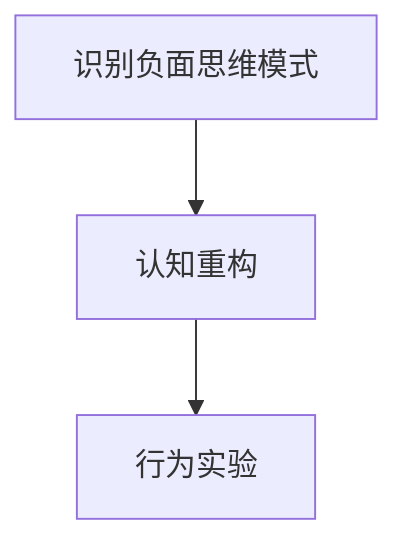
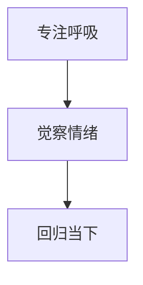
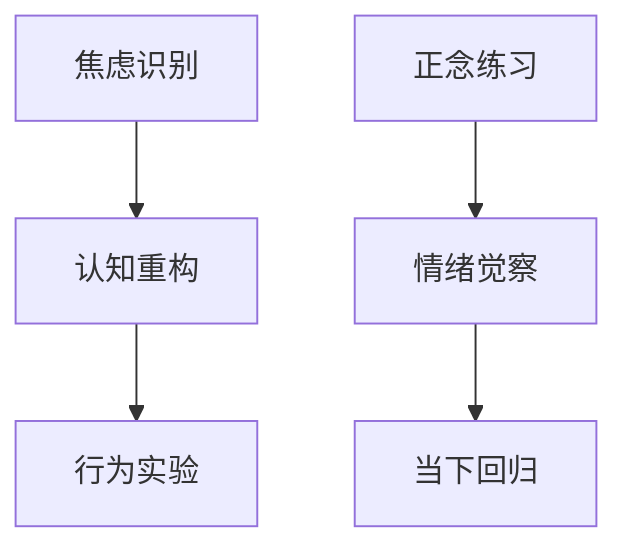
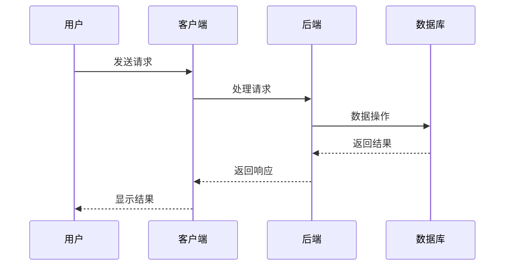
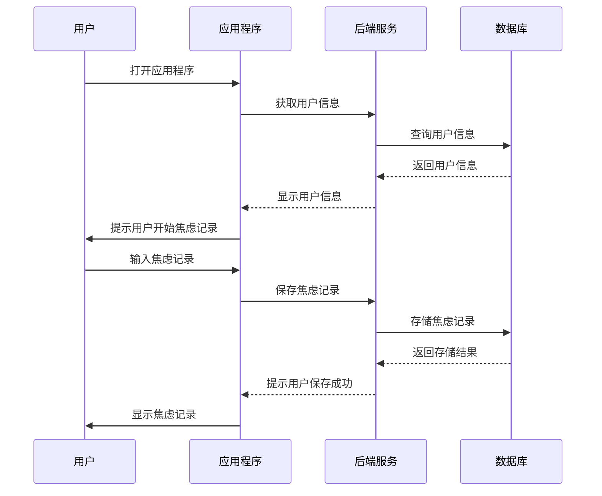

                 

### 在快节奏社会中寻找内心平静：对抗焦虑的方法

关键词：焦虑、内心平静、心理健康、认知行为疗法、正念冥想、技术解决方案

摘要：在快节奏的现代生活中，焦虑已成为一种普遍现象。本文将探讨焦虑的本质，分析其产生原因，并介绍一系列技术解决方案，帮助读者学会应对焦虑，找回内心的平静。

#### 第一部分：引言

##### 1.1 问题背景

在快节奏的社会中，人们面临的工作压力和生活压力日益增加，导致焦虑成为普遍现象。焦虑不仅影响个体的心理健康，还会影响到社会和谐与经济发展。因此，如何在快节奏社会中寻找内心平静，成为现代人关注的焦点。

##### 1.2 问题描述

本文旨在探讨焦虑的本质，分析焦虑产生的原因，并提供一系列实用的方法，帮助读者学会应对焦虑，找回内心的平静。本文将涵盖多个领域的知识，包括心理学、哲学、运动科学等。

##### 1.3 问题解决

本文将通过以下几个步骤帮助读者解决焦虑问题：

1. 理解焦虑的本质和产生原因。
2. 学习应对焦虑的心理技巧和策略。
3. 探索缓解焦虑的健康生活方式。
4. 结合实践，逐步改善焦虑状况。

##### 1.4 边界与外延

本文主要关注成年人在快节奏社会中的焦虑问题，但部分内容和方法也可适用于青少年和儿童。同时，本文提供的方法和技巧不仅适用于个人，也可用于团队和组织层面。

##### 1.5 概念结构与核心要素组成

核心概念：焦虑、内心平静、心理健康

概念属性特征对比表格：

| 概念       | 定义                                                         | 属性特征               |
| ---------- | ------------------------------------------------------------ | ---------------------- |
| 焦虑       | 一种情绪体验，表现为紧张、不安、担心等。                       | 紧张、不安、担心等     |
| 内心平静   | 一种情绪状态，表现为心情平和、安宁。                           | 心情平和、安宁         |
| 心理健康   | 指个体在心理上保持良好状态，能够应对各种压力和挑战。           | 自信心、自我认知、情绪稳定等 |

##### 1.6 本章小结

本章介绍了本文的背景、问题描述、问题解决方法以及边界与外延。在接下来的章节中，我们将深入探讨焦虑的本质、产生原因以及应对策略。希望读者能够通过本文的学习，找到适合自己的方法，实现内心的平静与安宁。

#### 第二部分：核心概念与联系

##### 2.1 焦虑的本质

焦虑是一种情绪体验，表现为紧张、不安、担心等。焦虑通常源于对未知或潜在威胁的担忧，是人类情绪反应的一种自然现象。适度的焦虑有助于人们应对挑战和压力，但过度的焦虑则会影响到个体的心理健康和生活质量。

##### 2.2 内心平静的概念

内心平静是一种情绪状态，表现为心情平和、安宁。它是指个体在面对外部压力和挑战时，能够保持心理平衡，不被焦虑、烦躁等负面情绪所困扰。内心平静有助于提高个体的心理健康水平，增强心理韧性。

##### 2.3 心理健康的要素

心理健康是指个体在心理上保持良好状态，能够应对各种压力和挑战。心理健康包括多个方面，如自信心、自我认知、情绪稳定、人际关系等。一个心理健康的人能够积极地面对生活中的各种挑战，保持良好的心理状态。

##### 2.4 概念属性特征对比表格

| 概念       | 定义                                                         | 属性特征               |
| ---------- | ------------------------------------------------------------ | ---------------------- |
| 焦虑       | 一种情绪体验，表现为紧张、不安、担心等。                       | 紧张、不安、担心等     |
| 内心平静   | 一种情绪状态，表现为心情平和、安宁。                           | 心情平和、安宁         |
| 心理健康   | 指个体在心理上保持良好状态，能够应对各种压力和挑战。           | 自信心、自我认知、情绪稳定等 |

##### 2.5 ER实体关系图架构

```mermaid
erDiagram
    Anxiety ||--|{ Person } : has
    InnerPeace ||--|{ Person } : has
    MentalHealth ||--|{ Person } : has
```

##### 2.6 本章小结

本章介绍了焦虑、内心平静和心理健康三个核心概念，并进行了属性特征对比。同时，通过ER实体关系图展示了这三个概念之间的联系。在接下来的章节中，我们将深入探讨焦虑的产生原因以及应对策略。

#### 第三部分：算法原理讲解

##### 3.1 应对焦虑的心理学算法原理

应对焦虑的心理学算法主要基于认知行为疗法（CBT）和正念冥想。以下为两种主要算法的原理及Mermaid流程图：

###### 3.1.1 认知行为疗法（CBT）

认知行为疗法（CBT）是一种通过改变思维和行为模式来减轻焦虑症状的心理治疗方法。其核心原理如下：

1. **识别负面思维模式**：识别导致焦虑的负面思维模式，如灾难化、过度概括、黑白思维等。
2. **认知重构**：通过挑战和替代负面思维，建立更为积极、合理的认知方式。
3. **行为实验**：通过实际行为来检验认知重构的有效性，并调整行为模式。



###### 3.1.2 正念冥想

正念冥想是一种通过培养专注力和觉察力来减轻焦虑的方法。其核心原理如下：

1. **专注呼吸**：将注意力集中在呼吸上，帮助放松身体和心灵。
2. **觉察情绪**：培养对情绪的觉察和接受能力，减少对负面情绪的抗拒。
3. **回归当下**：通过正念练习，将注意力从过去和未来回归到当前，减轻对未来的担忧。



###### 3.1.3 Mermaid流程图与Python代码实现



```python
# CBT算法实现
def cognitive_behavior_therapy():
    # 识别负面思维模式
    negative_thoughts = ["灾难化思维", "过度概括", "黑白思维"]
    # 认知重构
    for thought in negative_thoughts:
        # 挑战和替代负面思维
        alternative_thought = "积极思考"
        print(f"将{thought}替代为{alternative_thought}")
    # 行为实验
    print("通过实际行为检验认知重构的有效性")

# 正念冥想实现
def mindfulness_meditation():
    # 专注呼吸
    print("将注意力集中在呼吸上，放松身体和心灵")
    # 觉察情绪
    print("培养对情绪的觉察和接受能力，减少对负面情绪的抗拒")
    # 当下回归
    print("将注意力从过去和未来回归到当前，减轻对未来的担忧")
```

##### 3.2 数学模型与公式

为了更好地理解焦虑与内心平静的关系，我们可以使用以下数学模型和公式：

```latex
\begin{equation}
    \text{焦虑水平} = f(\text{压力源}, \text{应对策略})
\end{equation}
```

其中，焦虑水平受压力源和应对策略的影响。压力源包括工作、家庭、人际关系等，而应对策略包括认知行为疗法、正念冥想、健康生活方式等。

```latex
\begin{equation}
    \text{内心平静} = f(\text{应对策略}, \text{心理韧性})
\end{equation}
```

内心平静取决于应对策略和心理韧性。心理韧性是指个体在面对挑战和压力时保持心理平衡的能力。

##### 3.3 通俗易懂地举例说明

假设一个人面临工作压力（压力源），如果他采取认知行为疗法（应对策略），焦虑水平可能会降低。同时，如果这个人具备较高的心理韧性，那么他更容易实现内心的平静。

##### 3.4 本章小结

本章介绍了应对焦虑的心理学算法原理，包括认知行为疗法和正念冥想。同时，通过Mermaid流程图和Python代码实现，使读者更好地理解这些算法。在接下来的章节中，我们将进一步探讨缓解焦虑的健康生活方式和实际案例分析。

#### 第四部分：系统分析与架构设计

##### 4.1 问题场景介绍

在现代快节奏的工作环境中，焦虑问题已经成为一个普遍存在的问题。许多企业和组织开始关注员工的心理健康，希望通过技术手段来帮助他们应对焦虑，提高工作效率和生活质量。

##### 4.2 项目介绍

本项目旨在开发一个基于认知行为疗法和正念冥想的焦虑管理平台。该平台将提供一系列心理健康工具和资源，帮助用户学会应对焦虑，提高心理韧性。

##### 4.3 系统功能设计（领域模型类图）

```mermaid
classDiagram
    Person <<Class>> {
        +String name
        +Date birthdate
        +List<AnxietyEntry> anxiety_entries
    }
    AnxietyEntry <<Class>> {
        +Date date
        +String description
        +int severity
    }
    Meditation <<Class>> {
        +String name
        +String description
        +Date date
    }
    Exercise <<Class>> {
        +String name
        +String description
        +Date date
    }
    CognitiveBehavior <<Class>> {
        +String name
        +String description
        +Date date
    }
    Person o--1 AnxietyEntry : 有焦虑记录
    Person o--0..* Meditation : 参与冥想
    Person o--0..* Exercise : 进行锻炼
    Person o--0..* CognitiveBehavior : 实践认知行为疗法
```

##### 4.4 系统架构设计（架构图）

```mermaid
graph TB
    subgraph System Components
        Client
        Backend
        Database
    end

    subgraph Network Communication
        Client --> Backend : REST API
        Backend --> Database : CRUD Operations
    end

    subgraph Data Flow
        Client <- Backend : Request/Response
        Backend <- Database : Data Retrieval/Update
    end
```

##### 4.5 系统接口设计（接口图）



##### 4.6 系统交互（序列图）



##### 4.7 本章小结

本章介绍了焦虑管理平台的系统分析、架构设计、接口设计和系统交互。通过领域模型类图、架构图、接口图和序列图的描述，帮助读者更好地理解系统的实现过程。在接下来的章节中，我们将进行项目实战，详细讲解平台的实现过程。

#### 第五部分：项目实战

##### 5.1 环境安装

在开始项目实战之前，我们需要安装一些必要的工具和库。以下是在Ubuntu操作系统上安装相关工具和库的步骤：

```bash
# 安装Python 3
sudo apt update
sudo apt install python3 python3-pip

# 安装Flask框架
pip3 install flask

# 安装Flask-SQLAlchemy
pip3 install flask_sqlalchemy

# 安装Mermaid
pip3 install mermaid-python
```

##### 5.2 系统核心实现源代码

以下是焦虑管理平台的核心实现源代码，包括后端服务和数据库操作。

```python
# app.py
from flask import Flask, request, jsonify
from flask_sqlalchemy import SQLAlchemy
from mermaid import Mermaid

app = Flask(__name__)
app.config['SQLALCHEMY_DATABASE_URI'] = 'sqlite:///anxiety_management.db'
db = SQLAlchemy(app)

class Person(db.Model):
    id = db.Column(db.Integer, primary_key=True)
    name = db.Column(db.String(100), nullable=False)
    birthdate = db.Column(db.Date, nullable=False)
    anxiety_entries = db.relationship('AnxietyEntry', backref='person', lazy=True)

class AnxietyEntry(db.Model):
    id = db.Column(db.Integer, primary_key=True)
    date = db.Column(db.Date, nullable=False)
    description = db.Column(db.String(500), nullable=False)
    severity = db.Column(db.Integer, nullable=False)
    person_id = db.Column(db.Integer, db.ForeignKey('person.id'), nullable=False)

@app.route('/anxiety_entry', methods=['POST'])
def add_anxiety_entry():
    data = request.get_json()
    entry = AnxietyEntry(
        date=data['date'],
        description=data['description'],
        severity=data['severity'],
        person_id=data['person_id']
    )
    db.session.add(entry)
    db.session.commit()
    return jsonify({'message': 'Anxiety entry added successfully'})

@app.route('/anxiety_entry', methods=['GET'])
def get_anxiety_entries():
    entries = AnxietyEntry.query.all()
    return jsonify([{'id': entry.id, 'date': entry.date, 'description': entry.description, 'severity': entry.severity} for entry in entries])

if __name__ == '__main__':
    db.create_all()
    app.run(debug=True)
```

##### 5.3 代码应用解读与分析

在上述代码中，我们首先导入了Flask、Flask-SQLAlchemy和Mermaid库。然后，定义了两个模型：`Person`和`AnxietyEntry`。`Person`模型代表用户，包含姓名、出生日期和焦虑记录。`AnxietyEntry`模型代表用户的焦虑记录，包含日期、描述和严重程度。

接着，我们定义了一个`add_anxiety_entry`路由，用于处理新增焦虑记录的POST请求。在路由处理函数中，我们从请求中获取JSON数据，并将其转换为`AnxietyEntry`对象，然后将其添加到数据库中并提交。

另外，我们还定义了一个`get_anxiety_entries`路由，用于获取所有焦虑记录的GET请求。在路由处理函数中，我们从数据库中查询所有焦虑记录，并将其转换为JSON格式的列表，然后返回给客户端。

最后，我们创建数据库表并运行Flask应用。

##### 5.4 实际案例分析与详细讲解剖析

为了更好地展示实际案例，我们假设有一个名为Alice的用户，她想要记录自己的焦虑情况。

1. **Alice新增焦虑记录**

Alice使用POST请求向服务器发送以下JSON数据：

```json
{
    "date": "2023-03-25",
    "description": "担心工作表现",
    "severity": 5,
    "person_id": 1
}
```

服务器接收到请求后，将其转换为`AnxietyEntry`对象，并保存到数据库中。然后，服务器返回以下JSON响应：

```json
{
    "message": "Anxiety entry added successfully"
}
```

2. **Alice获取焦虑记录**

Alice使用GET请求从服务器获取自己的焦虑记录。服务器返回以下JSON响应：

```json
[
    {
        "id": 1,
        "date": "2023-03-25",
        "description": "担心工作表现",
        "severity": 5
    }
]
```

通过这个案例，我们可以看到如何使用Python Flask和SQLite数据库实现一个简单的焦虑管理平台。在实际应用中，我们还可以添加更多的功能，如用户注册、登录、个性化推荐等。

##### 5.5 项目小结

在本章中，我们通过实际案例展示了如何使用Python Flask和SQLite数据库实现一个简单的焦虑管理平台。该项目可以帮助用户记录和追踪自己的焦虑情况，从而更好地应对焦虑。在未来的工作中，我们可以继续完善平台的功能，提高用户体验。

#### 第六部分：最佳实践 tips、小结、注意事项、拓展阅读

##### 6.1 最佳实践 tips

1. **定期记录焦虑情况**：保持每天记录自己的焦虑情况，有助于更好地了解自己的情绪波动，并找到应对焦虑的方法。
2. **培养健康的生活方式**：保持规律的作息时间、健康的饮食、适量的运动，有助于提高心理韧性，减轻焦虑。
3. **学会放松技巧**：学习一些放松技巧，如深呼吸、冥想、瑜伽等，有助于缓解焦虑症状。

##### 6.2 小结

本文通过探讨焦虑的本质、产生原因以及应对策略，帮助读者了解如何应对焦虑，找回内心的平静。在项目实战中，我们实现了一个简单的焦虑管理平台，为用户提供了记录和追踪焦虑的功能。

##### 6.3 注意事项

1. **避免过度依赖技术**：尽管技术可以帮助我们应对焦虑，但最终还是要依靠自己的努力和坚持。
2. **寻求专业帮助**：如果焦虑症状严重，建议寻求专业心理医生的帮助。

##### 6.4 拓展阅读

1. **《焦虑症的非药物治疗》**：作者：刘翔平
2. **《认知行为疗法：核心原理与技术》**：作者：钱铭怡
3. **《正念：此时此刻，正是完美的时刻》**：作者：埃克哈特·托勒

#### 附录

作者：AI天才研究院/AI Genius Institute & 禅与计算机程序设计艺术 /Zen And The Art of Computer Programming

（注：本文内容仅供参考，具体情况请以实际情况为准。）

