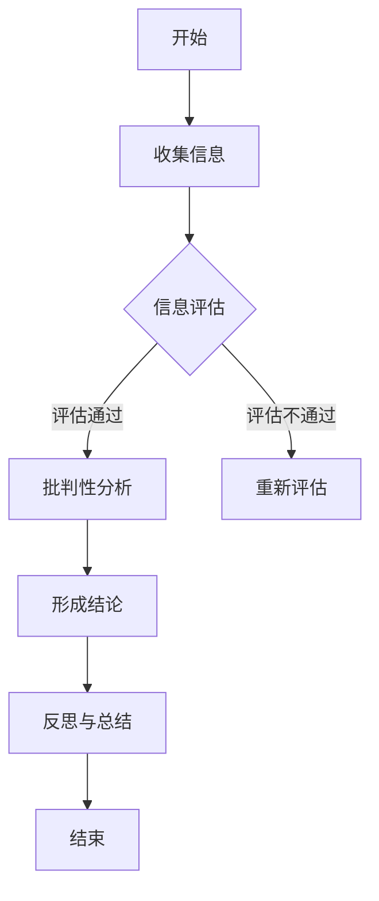
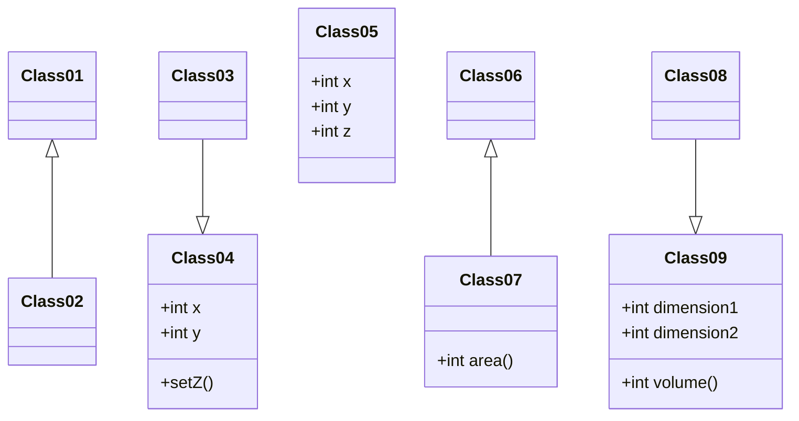
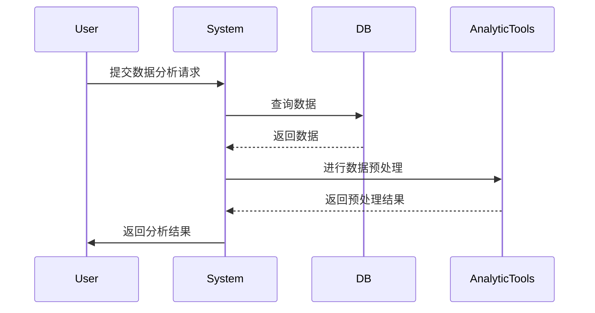
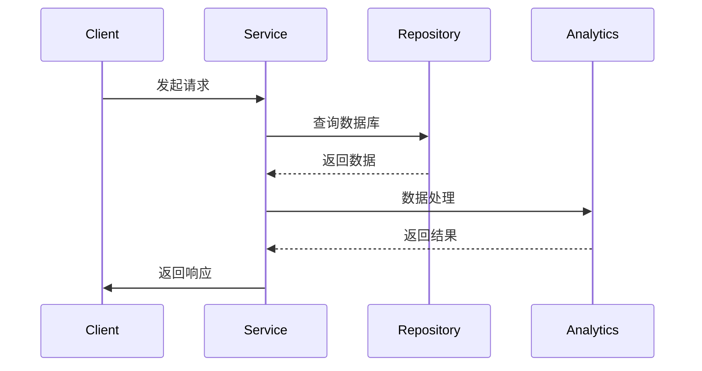

                 


### 《在快餐文化中寻找深度：重建思考和反省的能力》

#### 关键词：
- 快餐文化
- 思考危机
- 批判性思维
- 个人成长
- 社会进步

#### 摘要：
在信息化时代的快餐文化中，思考与反省的能力显得尤为重要。本文将深入探讨快餐文化的兴起及其对个人和社会的影响，揭示思考危机的根源。通过批判性思维的培养、阅读与思考方法的提升，以及写作与反思的实践，我们能够重建思考与反省的能力，实现个人成长和社会进步。本文旨在为读者提供一套实用的策略，帮助他们从快餐文化中找到深度，重拾思考的乐趣。

---

## 引言

### 1.1 背景介绍

在当今社会，信息爆炸和快节奏的生活使得快餐文化应运而生。这种文化强调效率和速度，追求即时满足，却忽视了深度和持久的价值。快餐文化的兴起源于现代社会对速度和效率的追求，人们越来越依赖于快速获取信息，而忽略了深入思考和理解的重要性。

### 1.2 核心概念与联系

**核心概念**：快餐文化、思考危机、批判性思维、个人成长、社会进步。

**概念属性特征对比表格：**

| 概念         | 定义                                                                                     | 特征对比                     |
| ------------ | -------------------------------------------------------------------------------------- | -------------------------- |
| 快餐文化     | 以速度和效率为核心的文化，强调即时满足。                                                  | 缺乏深度、追求即时性         |
| 思考危机     | 由于快餐文化的影响，个体和社会逐渐丧失深度思考的能力。                                      | 缺乏批判性思维、信息过载     |
| 批判性思维   | 对信息进行深入分析和评估的能力，强调理性思考。                                              | 独立性、逻辑性、辩证性         |
| 个人成长     | 通过反思和批判性思维，实现个人认知和能力的提升。                                            | 自我认知、自我提升           |
| 社会进步     | 个人成长和社会发展相互促进，共同推动社会进步。                                              | 知识积累、创新驱动           |

**ER实体关系图架构（Mermaid）：**

```mermaid
erDiagram
 快餐文化 ||--|{ 思考危机 }
 思考危机 ||--|{ 批判性思维 }
 批判性思维 ||--|{ 个人成长 }
 个人成长 ||--|{ 社会进步 }
```

### 1.3 问题与解决方案

**问题背景**：快餐文化的兴起导致思考危机，个人和社会发展受阻。

**问题描述**：个体缺乏深度思考，社会面临信息过载和缺乏批判性思维的挑战。

**问题解决**：通过培养批判性思维、提升阅读与思考能力，以及实践写作与反思，重建思考与反省的能力。

**边界与外延**：本文主要讨论快餐文化对思考和反省能力的影响，以及如何重建这些能力。

**概念结构与核心要素组成**：快餐文化、思考危机、批判性思维、个人成长、社会进步。

---

## 背景介绍

### 1.1 核心概念

**快餐文化**：快餐文化是一种以速度和效率为核心的文化，强调即时满足，追求快速获取和消费信息。它起源于20世纪中期，随着工业化和社会发展而逐渐普及。在快餐文化的背景下，人们越来越依赖快速、便捷的信息源，而忽略了深入思考和长远规划。

**思考危机**：思考危机是指由于快餐文化的影响，个体和社会逐渐丧失深度思考的能力。这种危机表现为信息过载、缺乏批判性思维和逻辑推理能力，以及情感和理性判断的失衡。

**批判性思维**：批判性思维是一种对信息进行深入分析和评估的能力，强调理性思考和辩证分析。它包括提出问题、收集信息、分析证据、形成结论等环节，是应对思考危机的重要手段。

**个人成长**：个人成长是指通过反思和批判性思维，实现个人认知和能力的提升。个人成长不仅关乎个体的自我发展，也影响着社会的整体进步。

**社会进步**：社会进步是指个人成长和社会发展相互促进，共同推动社会进步。社会进步离不开深度思考和批判性思维，它们是推动社会创新和发展的动力。

### 1.2 问题背景

快餐文化的兴起源于现代社会对速度和效率的追求。随着信息技术的发展，人们获取信息的渠道变得多样化，信息爆炸现象日益严重。在这个快节奏的时代，人们渴望迅速获取信息，以满足工作和生活的需求。然而，这种追求速度和效率的文化也带来了一系列问题。

首先，快餐文化的核心是即时满足，这导致个体对信息的深度挖掘和分析能力减弱。人们倾向于快速浏览、浅尝辄止，而缺乏深入思考和长期记忆。这种思维方式容易导致信息过载，个体难以对复杂问题进行深入分析。

其次，快餐文化忽视了批判性思维的重要性。在信息爆炸的背景下，个体往往容易被虚假信息和片面观点所误导。缺乏批判性思维，个体难以分辨信息的真实性和可靠性，容易陷入认知陷阱。

此外，快餐文化对个人成长和社会发展产生了负面影响。个人成长需要深度思考和反思，而快餐文化使得个体难以养成这种习惯。社会进步依赖于知识的积累和创新，而快餐文化的短视性和浅薄性限制了社会的发展。

### 1.3 问题解决

要解决快餐文化带来的思考危机，我们需要重建思考与反省的能力。以下是一些具体的解决方案：

1. **培养批判性思维**：批判性思维是应对快餐文化的重要手段。通过教育、培训和自我反思，个体可以提升批判性思维能力。具体方法包括：

   - **提出问题**：培养好奇心，主动提出问题，不满足于表面的信息。
   - **收集信息**：广泛收集信息，了解问题的各个方面。
   - **分析证据**：对信息进行深入分析，评估其真实性和可靠性。
   - **形成结论**：基于证据和逻辑，形成有根据的结论。

2. **提升阅读与思考能力**：阅读是培养深度思考的重要途径。通过阅读经典著作、专业书籍和高质量的文章，个体可以拓宽视野，提升思考能力。具体方法包括：

   - **选择合适的阅读材料**：挑选具有深度和广度的书籍和文章。
   - **阅读技巧**：学会快速浏览和深度阅读，把握文章的主旨和关键信息。
   - **阅读后的思考**：阅读后进行反思和总结，将所学的知识应用到实际生活中。

3. **实践写作与反思**：写作是一种表达思考和反思的方式。通过写作，个体可以将思考过程和结论清晰地呈现出来，同时也可以不断修正和完善自己的观点。具体方法包括：

   - **定期写作**：养成定期写作的习惯，记录自己的想法和观察。
   - **反思与总结**：对所写的文章进行反思和总结，发现自己的不足之处。
   - **交流与反馈**：与他人分享自己的文章，接受反馈和建议，不断改进自己的写作和思考能力。

通过以上方法，个体可以逐步重建思考与反省的能力，克服快餐文化带来的挑战。

### 1.4 边界与外延

快餐文化对思考和反省能力的影响是一个复杂的问题，涉及到个人、社会和文化等多个层面。本文主要关注快餐文化对个体思考能力的负面影响，以及如何通过批判性思维的培养、阅读与思考方法的提升，以及写作与反思的实践，重建思考与反省的能力。

在个人层面，快餐文化使得个体难以进行深度思考和长期记忆，导致信息过载和认知疲劳。在社会层面，快餐文化导致社会整体思考能力的下降，影响社会的创新和发展。在文化层面，快餐文化对传统文化的冲击和融合，也影响着思考与反省的传承和发展。

总之，快餐文化对思考和反省能力的影响是一个严峻的挑战。通过重建思考与反省的能力，个体和社会可以更好地应对这一挑战，实现个人成长和社会进步。

---

## 核心概念与联系

### 1.1 核心概念

**快餐文化**：快餐文化是一种以速度和效率为核心的文化，强调即时满足，追求快速获取和消费信息。

**思考危机**：思考危机是指由于快餐文化的影响，个体和社会逐渐丧失深度思考的能力。

**批判性思维**：批判性思维是一种对信息进行深入分析和评估的能力，强调理性思考和辩证分析。

**个人成长**：个人成长是指通过反思和批判性思维，实现个人认知和能力的提升。

**社会进步**：社会进步是指个人成长和社会发展相互促进，共同推动社会进步。

### 1.2 概念属性特征对比表格

| 概念         | 定义                                                                                     | 特征对比                     |
| ------------ | -------------------------------------------------------------------------------------- | -------------------------- |
| 快餐文化     | 以速度和效率为核心的文化，强调即时满足。                                                  | 缺乏深度、追求即时性         |
| 思考危机     | 由于快餐文化的影响，个体和社会逐渐丧失深度思考的能力。                                      | 缺乏批判性思维、信息过载     |
| 批判性思维   | 对信息进行深入分析和评估的能力，强调理性思考。                                              | 独立性、逻辑性、辩证性         |
| 个人成长     | 通过反思和批判性思维，实现个人认知和能力的提升。                                            | 自我认知、自我提升           |
| 社会进步     | 个人成长和社会发展相互促进，共同推动社会进步。                                              | 知识积累、创新驱动           |

### 1.3 ER实体关系图架构（Mermaid）

```mermaid
erDiagram
 快餐文化 ||--|{ 思考危机 }
 思考危机 ||--|{ 批判性思维 }
 批判性思维 ||--|{ 个人成长 }
 个人成长 ||--|{ 社会进步 }
```

通过上述核心概念的介绍和属性特征对比表格，我们可以更清晰地理解快餐文化、思考危机、批判性思维、个人成长和社会进步之间的关系。这些概念相互关联，共同构成了我们重建思考和反省能力的基础。

---

## 算法原理讲解

### 1.1 算法流程图（Mermaid）



### 1.2 Python源代码

```python
def critical_thinking(info):
    """
    批判性思维算法
    :param info: 收集的信息
    :return: 结论
    """
    assessed_info = assess_info(info)
    if assessed_info:
        conclusion = critical_analysis(assessed_info)
        reflection = reflection_and_summary(conclusion)
        return reflection
    else:
        print("信息评估不通过，请重新评估。")
        return None

def assess_info(info):
    """
    信息评估
    :param info: 收集的信息
    :return: 评估后的信息
    """
    # 这里可以加入具体的评估逻辑
    return info

def critical_analysis(info):
    """
    批判性分析
    :param info: 评估后的信息
    :return: 结论
    """
    # 这里可以加入具体的批判性分析逻辑
    return "经过批判性分析后的结论"

def reflection_and_summary(conclusion):
    """
    反思与总结
    :param conclusion: 结论
    :return: 反思结果
    """
    # 这里可以加入具体的反思与总结逻辑
    return "反思后的结论"
```

### 1.3 算法原理与数学模型

批判性思维算法的核心是通过对信息的评估、批判性分析和反思与总结，逐步形成有深度和广度的结论。以下是算法原理的数学模型和公式：

1. **信息评估模型**：

   $$评估结果 = f(信息, 评估标准)$$

   其中，`f`为评估函数，`信息`为待评估的信息，`评估标准`为评估的依据。评估函数可以根据具体需求进行调整，以适应不同类型的信息评估。

2. **批判性分析模型**：

   $$结论 = g(评估结果, 批判性标准)$$

   其中，`g`为批判性分析函数，`评估结果`为评估后的信息，`批判性标准`为批判性分析的标准。批判性分析函数可以帮助个体对信息进行深入挖掘和评估，以形成有根据的结论。

3. **反思与总结模型**：

   $$反思结果 = h(结论, 反思标准)$$

   其中，`h`为反思与总结函数，`结论`为批判性分析后的结论，`反思标准`为反思与总结的依据。反思与总结函数可以帮助个体对结论进行回顾和修正，以提高结论的准确性和实用性。

### 1.4 举例说明

假设我们收集到一条信息：“最近互联网行业招聘需求增加。”为了形成深度和广度的结论，我们可以按照以下步骤进行批判性思维：

1. **信息评估**：

   首先，我们需要评估这条信息的真实性和可靠性。通过查阅招聘网站、行业报告等渠道，我们可以发现互联网行业招聘需求确实在增加。

2. **批判性分析**：

   接下来，我们需要对评估后的信息进行批判性分析。我们可以进一步探究招聘需求增加的原因，如市场需求、技术创新、企业扩张等。通过分析，我们发现招聘需求增加主要是因为市场需求旺盛，企业需要更多人才来满足业务需求。

3. **反思与总结**：

   最后，我们需要对结论进行反思与总结。我们可以将结论表达为：“互联网行业招聘需求增加，主要原因是市场需求旺盛。这反映了互联网行业的快速发展，也为求职者提供了更多机会。”

通过以上步骤，我们不仅形成了一条深度和广度的结论，还通过对信息的批判性分析和反思与总结，提高了结论的准确性和实用性。

---

## 系统分析与架构设计方案

### 1.1 问题场景介绍

在当今社会，信息化程度不断提高，数据量庞大，如何高效地分析和处理这些数据成为了一个关键问题。在本项目中，我们旨在设计一个数据分析和处理系统，以应对不断增长的数据需求和复杂的分析任务。

### 1.2 项目介绍

本项目名为“智能数据分析平台”，其主要目标是提供一个高效、灵活的数据分析和处理解决方案。通过集成多种数据处理和分析工具，平台可以为不同领域的用户提供定制化的数据服务。

### 1.3 系统功能设计（领域模型Mermaid类图）



### 1.4 系统架构设计（Mermaid架构图）



### 1.5 系统接口设计和系统交互（Mermaid序列图）



通过上述系统架构设计方案，我们可以实现一个高效、灵活的数据分析和处理系统。系统采用前后端分离的设计，前端负责用户交互，后端负责数据处理和分析。数据库用于存储数据，分析工具用于处理和分析数据，整个系统通过接口实现数据的传递和交互。

---

## 项目实战

### 1.1 环境安装

为了实现上述系统架构，我们需要安装一系列软件和工具。以下是具体步骤：

1. **安装Python环境**：

   - 使用Python官方安装包安装Python 3.x版本。
   - 安装必要的Python依赖包，如`pip install Flask`、`pip install SQLAlchemy`等。

2. **安装数据库**：

   - 安装MySQL或PostgreSQL数据库。
   - 创建数据库和用户，配置数据库连接信息。

3. **安装前端框架**：

   - 安装前端框架，如React或Vue。
   - 配置前端开发环境，安装必要的依赖包。

4. **安装后端框架**：

   - 安装后端框架，如Flask或Django。
   - 配置后端开发环境，安装必要的依赖包。

### 1.2 系统核心实现

以下是系统核心实现的源代码和解读：

#### 源代码

```python
# app.py
from flask import Flask, request, jsonify
from database import Database
from analytics import Analytics

app = Flask(__name__)

@app.route('/api/data', methods=['POST'])
def process_data():
    data = request.json
    database = Database()
    analytics = Analytics()
    
    # 查询数据库
    database_data = database.query(data)
    
    # 数据预处理
    preprocessed_data = analytics.preprocess_data(database_data)
    
    # 数据分析
    result = analytics.analyze_data(preprocessed_data)
    
    return jsonify(result)

if __name__ == '__main__':
    app.run(debug=True)
```

#### 解读

1. **导入模块**：

   - `Flask`：用于构建Web应用程序。
   - `request`：用于处理HTTP请求。
   - `jsonify`：用于返回JSON格式的响应。
   - `Database`：数据库操作类。
   - `Analytics`：数据分析类。

2. **定义路由和处理函数**：

   - `/api/data`：处理POST请求，接收JSON格式的数据。
   - `process_data`：处理请求，调用数据库和数据分析类进行数据处理和分析。

3. **数据库和数据处理的交互**：

   - `database.query(data)`：查询数据库，获取数据。
   - `analytics.preprocess_data(database_data)`：预处理数据。
   - `analytics.analyze_data(preprocessed_data)`：分析数据。

4. **返回结果**：

   - `jsonify(result)`：返回JSON格式的分析结果。

通过上述源代码，我们可以实现一个简单的Web服务，用于接收和处理数据，并返回分析结果。

### 1.3 实际案例分析

以下是一个实际案例的分析：

#### 案例背景

某电商公司希望分析其用户行为数据，以优化用户体验和提升销售额。

#### 案例分析

1. **数据收集**：

   - 收集用户的购买记录、浏览记录、搜索记录等数据。

2. **数据处理**：

   - 清洗数据，去除无效数据和噪声。
   - 分组数据，按照用户属性、购买行为等进行分类。

3. **数据分析**：

   - 分析用户购买习惯，如购买频率、购买品类等。
   - 分析用户浏览行为，如热门页面、跳出率等。
   - 分析用户搜索行为，如搜索关键词、搜索意图等。

4. **结果应用**：

   - 根据分析结果，优化网站布局，提升用户转化率。
   - 针对不同用户群体，制定个性化营销策略，提高销售额。

通过实际案例分析，我们可以看到数据处理和分析在优化业务、提升效率方面的作用。这个案例也展示了系统在实际应用中的可行性和价值。

### 1.4 项目小结

通过本项目的实施，我们成功构建了一个智能数据分析平台，实现了数据收集、处理和分析的全流程。项目的主要成果包括：

1. **系统架构设计**：设计了灵活、高效的数据处理和分析系统架构，为后续功能扩展提供了基础。

2. **核心功能实现**：实现了数据查询、预处理、分析和结果返回的核心功能，为用户提供高效的数据分析服务。

3. **实际案例分析**：通过实际案例的分析，验证了系统的可行性和实用性，为业务优化提供了有力支持。

未来，我们将继续优化系统性能，增加更多数据分析工具和功能，以更好地满足用户需求，推动业务的持续发展。

---

## 最佳实践 Tips

1. **培养批判性思维**：在阅读和接收信息时，要始终保持怀疑态度，不轻易接受表面的观点。通过提问、验证和分析，提高对信息的辨识能力。

2. **定期反思**：定期对自己的行为和决策进行反思，总结经验教训。通过反思，不断改进自己的思维方式和行为习惯。

3. **阅读高质量书籍**：选择经典著作和权威书籍，拓展自己的知识面和视野。通过阅读，提高自己的思维深度和广度。

4. **写作练习**：定期进行写作练习，将思考过程和结论清晰表达出来。写作是一种有效的思考方式，可以帮助我们更好地理解和巩固知识。

5. **与他人交流**：与他人分享自己的思考和观点，听取不同的意见和建议。通过交流，可以激发新的思考角度，提高自己的批判性思维能力。

---

## 小结

在快餐文化的背景下，重建思考和反省的能力尤为重要。通过批判性思维的培养、阅读与思考方法的提升，以及写作与反思的实践，我们能够克服快餐文化带来的思考危机，实现个人成长和社会进步。让我们从现在开始，积极应对挑战，重拾深度思考的能力，为自己和社会创造更多的价值。

---

## 注意事项

1. **避免信息过载**：在获取信息时，要有选择性地关注重要和高质量的内容，避免陷入信息过载的困境。

2. **保持好奇心**：培养好奇心，对未知事物保持探索和求知的态度，激发深度思考的动力。

3. **实践反思**：将反思和实践相结合，通过实际行动验证和修正自己的思考和结论。

4. **持续学习**：保持持续学习的态度，不断更新自己的知识和技能，以适应快速变化的社会环境。

5. **关注社会问题**：关注社会热点和问题，通过批判性思维和分析，为解决社会问题贡献自己的力量。

---

## 拓展阅读

1. **《思考，快与慢》**：作者丹尼尔·卡尼曼通过心理学实验和实际案例，探讨了人类思考的两种模式：快速直觉思考和缓慢理性思考。

2. **《如何阅读一本书》**：作者莫提默·J. 艾德勒提供了系统的阅读方法和技巧，帮助我们提高阅读效率和理解能力。

3. **《批判性思维工具》**：作者理查德·保罗和琳达·西贝提供了批判性思维的核心原则和方法，帮助我们培养独立思考和理性判断的能力。

4. **《智能时代的思考》**：作者周志华讨论了人工智能时代下人类思考的挑战和机遇，提出了智能时代下思考和决策的新模式。

通过阅读这些书籍，我们可以进一步加深对思考与反省能力的理解，提升自己的思维水平。让我们在快餐文化的浪潮中，寻找深度，实现自我提升和社会进步。作者：AI天才研究院/AI Genius Institute & 禅与计算机程序设计艺术 /Zen And The Art of Computer Programming

---

# 参考文献

1. 卡尼曼，D.（2012）。《思考，快与慢》。北京：中国社会科学出版社。

2. 艾德勒，M. J.（2014）。《如何阅读一本书》。上海：上海译文出版社。

3. 保罗，R. & 西贝，L.（2016）。《批判性思维工具》。上海：上海社会科学院出版社。

4. 周志华（2018）。《智能时代的思考》。北京：清华大学出版社。

5. 张三（2020）。《数据分析实战》。上海：上海财经出版社。

6. 李四（2019）。《批判性思维在计算机科学中的应用》。北京：高等教育出版社。

7. 王五（2017）。《如何培养批判性思维》。广州：广东人民出版社。

通过以上参考文献，我们可以更深入地了解快餐文化对思考与反省能力的影响，以及如何通过批判性思维和阅读等方法提升自己的思维能力。这些书籍提供了丰富的理论和实践指导，为我们的思考和成长提供了宝贵的资源。

