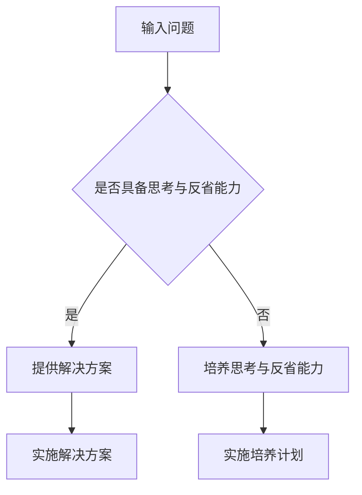
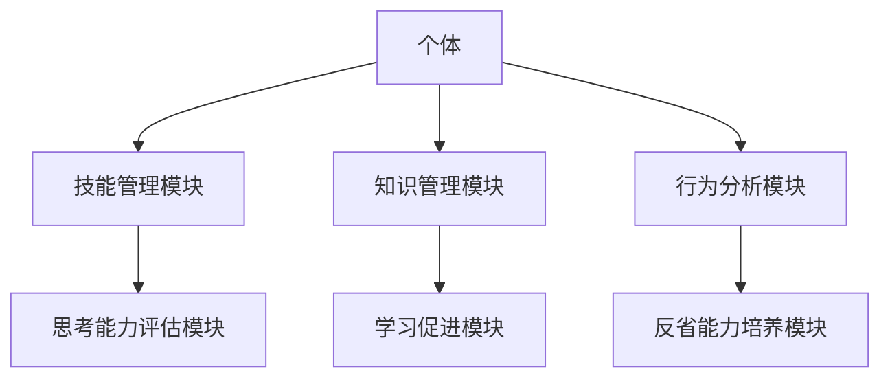
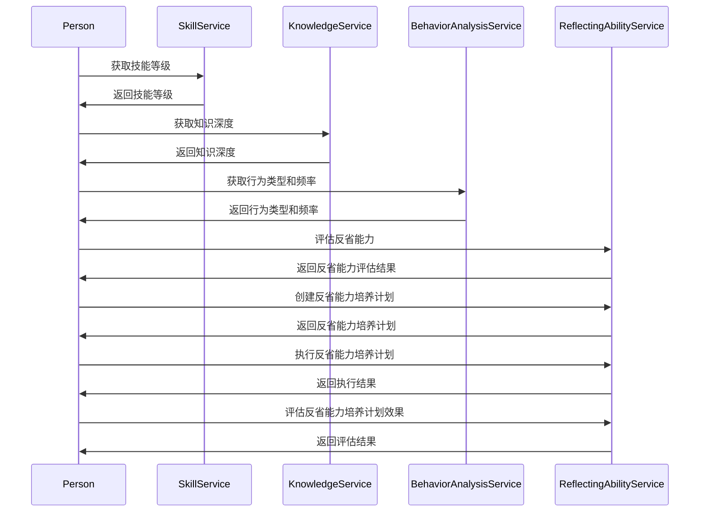

                 

## 在快餐文化中寻找深度：重建思考和反省的能力

### 关键词：快餐文化、思考能力、反省能力、深度学习、系统架构设计

> 摘要：本文从快餐文化的背景出发，分析了现代社会中快餐文化对思考和反省能力的负面影响，并提出了一套系统的方法论，帮助我们在快餐文化中重建深度思考和反省能力。通过深入探讨核心概念、算法原理以及系统分析与架构设计，本文旨在为读者提供一套实用的指南，帮助他们在快节奏的生活中保持深度思考和自我反省的能力。

### 引言

在当今这个信息爆炸的时代，我们的生活方式和思维方式都发生了翻天覆地的变化。随着互联网和移动设备的普及，信息获取变得前所未有的便捷，然而，这也带来了一种新的文化现象——快餐文化。快餐文化以其快速、高效的特点，迅速占领了我们的日常生活，从社交媒体的瞬时分享到新闻的快速浏览，从快节奏的工作到快餐食品的普及，快餐文化无处不在。然而，这种文化模式也在潜移默化地影响着我们的思考方式和反省能力。

快餐文化的快速、简化和娱乐化特点，使得人们往往缺乏深度思考和系统性反省的机会。我们习惯了在短时间内获取大量信息，但往往忽略了信息的价值和深度。这种思维模式不仅影响我们的个人成长，也对社会的发展产生了深远的影响。因此，如何在快餐文化中重建思考和反省的能力，成为了我们亟待解决的问题。

本文将围绕这一主题展开，首先介绍快餐文化的背景和特点，分析其对思考和反省能力的影响，然后提出一套系统的方法论，包括核心概念的阐述、算法原理的讲解以及系统分析与架构设计。通过本文的阅读，读者将了解如何在快节奏的生活中保持深度思考和反省的能力，从而实现个人的全面发展。

### 第一部分：背景介绍

#### 1.1 问题背景

1.1.1 快餐文化的特点

快餐文化是一种以快速、高效、简单为特点的文化现象。它起源于20世纪初的美国，随着工业化进程的加快和城市化的发展，迅速在全球范围内传播。快餐文化的主要特点是快速、便利和低成本，这种特点在很大程度上满足了现代社会对效率的追求。在快节奏的生活中，人们更倾向于选择快速、简单、方便的食物和生活方式，而不是传统的慢食文化和深度思考。

1.1.2 快餐文化对思考与反省能力的影响

快餐文化的快速、简化和娱乐化特点，对人们的思考方式和反省能力产生了深远的影响。首先，快餐文化的快速性导致人们习惯于在短时间内获取和处理大量信息，这往往导致思考的浅层化和碎片化。人们更注重信息的获取，而忽略了信息的深度理解和分析。其次，快餐文化的简化特点使得人们倾向于追求表面的、简单的答案，而不是深入探讨问题的本质。这种思维模式容易导致思维的定势和偏见。最后，快餐文化的娱乐化特点使得人们在信息消费中更倾向于追求娱乐和刺激，而忽略了思考和反省的重要性。

1.1.3 需要重建思考与反省能力的重要性

在快餐文化的冲击下，重建思考和反省能力显得尤为重要。首先，思考与反省能力是人类文明进步的重要驱动力。人类文明的发展史就是一部不断思考、反省和进步的历史。只有在思考和反省的基础上，人类才能不断解决新问题、创造新知识、推动社会进步。其次，思考与反省能力是个人成长和自我提升的重要工具。通过思考和反省，人们可以更好地理解自己、认识世界，从而实现自我成长和提升。最后，重建思考和反省能力有助于抵抗快餐文化的负面影响。在快节奏、高压力的生活中，只有通过深度思考和反省，人们才能保持冷静、理性和独立思考，从而避免被快餐文化所同化。

#### 1.2 问题解决

1.2.1 现有的解决方法

面对快餐文化对思考和反省能力的冲击，现有的一些解决方法包括：提倡深度阅读、培养批判性思维、增加思考时间等。这些方法在一定程度上有助于改善思考和反省能力，但仍然存在一定的局限性。

1.2.2 当前方法的局限性

首先，提倡深度阅读虽然有助于提升思考能力，但无法完全替代日常生活中的深度思考。其次，培养批判性思维需要系统性的培训和长期的实践，对于普通大众来说难度较大。最后，增加思考时间虽然有助于思考，但如何在有限的时间内进行有效思考仍然是一个挑战。

1.2.3 本书的独特解决方案

本书提出了一套系统的方法论，旨在帮助读者在快餐文化中重建思考和反省能力。该方法论包括以下几个方面：

1. 核心概念的澄清与理解：通过深入探讨思考与反省的核心概念，帮助读者建立正确的思维模式。
2. 算法原理的讲解：通过讲解算法原理，提供具体的思考和反省工具。
3. 系统分析与架构设计：通过系统分析与架构设计，提供一套实用的思考和反省方法。
4. 实践与应用：通过实际案例分析和项目实战，帮助读者将思考与反省能力应用于实际生活中。

#### 1.3 边界与外延

1.3.1 本书研究的范围

本书主要研究快餐文化对思考和反省能力的影响，并提出一套系统的方法论，帮助读者重建思考和反省能力。具体包括：核心概念的澄清与理解、算法原理的讲解、系统分析与架构设计以及实践与应用。

1.3.2 研究的核心概念

本书研究的核心概念包括：思考能力、反省能力、深度学习、系统架构设计等。这些概念是理解和解决问题的关键。

1.3.3 与相关领域的关系

本书与心理学、教育学、计算机科学等领域密切相关。心理学提供了思考与反省的理论基础，教育学为思考与反省的培养提供了实践经验，计算机科学则为思考与反省的工具和方法提供了技术支持。

#### 1.4 概念结构与核心要素组成

1.4.1 思考与反省能力的定义

思考能力是指个体在面临问题或情境时，能够运用已有的知识和经验，通过逻辑推理、分析综合、批判性思维等方式，对问题或情境进行深入思考、理解、分析和解决的能力。

反省能力是指个体在经历了某种行为或事件后，能够对自己的行为或事件进行回顾、反思、评价和总结，从而发现自身的不足，改进和完善自己的能力。

1.4.2 思考与反省能力的重要性

思考与反省能力是人类认知活动的重要组成部分，是个人成长和发展的基础。通过思考和反省，个体能够更好地认识自己、理解世界，提高自身素质和能力，实现自我提升和进步。

1.4.3 构建思考与反省能力的核心要素

构建思考与反省能力需要以下几个核心要素：

1. **知识储备**：广泛的阅读和学习，积累丰富的知识储备。
2. **逻辑思维**：培养严密的逻辑思维能力，提高推理和分析能力。
3. **批判性思维**：培养批判性思维，敢于质疑、勇于探索。
4. **情感素养**：提高情感素养，善于表达和理解自己的情感。
5. **时间管理**：合理安排时间，确保有足够的时间进行深度思考和反省。

通过以上核心要素的有机组合，个体可以逐步构建起强大的思考和反省能力，从而在快餐文化的冲击下保持理性和深度。

### 第二部分：核心概念与联系

#### 2.1 核心概念原理

2.1.1 思考能力的概念与特征

思考能力是指个体在面对问题或情境时，通过逻辑推理、分析综合、批判性思维等方式，对信息进行深入理解和处理，从而形成新的认知和解决问题的能力。思考能力包括以下几个主要特征：

1. **逻辑性**：思考过程遵循逻辑规则，确保推理和结论的合理性。
2. **分析性**：能够对复杂信息进行拆解和分析，找到问题的本质。
3. **综合性**：能够将分散的信息整合成整体，形成新的认知框架。
4. **批判性**：对信息来源和结论进行质疑和验证，避免盲目接受。

2.1.2 反省能力的概念与特征

反省能力是指个体在经历某种行为或事件后，能够对自己进行反思和评价，从中发现不足，总结经验教训，并进行改进的能力。反省能力包括以下几个主要特征：

1. **自我意识**：能够认识到自己的行为和决策，并对其进行反思。
2. **自我批评**：勇于面对自己的错误和不足，进行批判性评价。
3. **自我修正**：能够从反省中吸取教训，调整行为和决策，进行改进。
4. **适应性**：能够根据经验和反馈，调整自身的行为和思维方式。

2.1.3 思考与反省能力之间的关系

思考与反省能力是相辅相成的，两者之间存在紧密的联系和互动。思考能力为反省能力提供了基础，通过思考和推理，个体能够理解自身的行为和决策，为反省提供依据。而反省能力则对思考能力进行补充和提升，通过反省，个体能够发现自身的不足，修正思维模式，进一步提高思考能力。

具体来说，思考与反省能力之间的关系表现为以下几个方面：

1. **相互促进**：思考能力的提高有助于反省能力的增强，而反省能力的提升也能促进思考能力的深化。
2. **动态平衡**：思考与反省能力在个体发展中相互平衡，共同推动个人成长。
3. **反馈循环**：思考过程中产生的认知和结论，可以通过反省进行验证和调整，形成一个积极的反馈循环。
4. **综合提升**：通过思考和反省，个体能够逐步形成全面、深入的认识和思考模式，实现认知和能力的综合提升。

#### 2.2 概念属性特征对比表格

为了更清晰地展示思考能力和反省能力的概念属性特征，下面提供了一个对比表格：

| 特征类别 | 思考能力 | 反省能力 |
| -------- | -------- | -------- |
| **逻辑性** | 遵循逻辑规则，确保推理和结论的合理性 | 对自身行为和决策进行逻辑分析，找出逻辑错误 |
| **分析性** | 对复杂信息进行拆解和分析，找到问题的本质 | 对自身行为和决策进行分析，找出不足之处 |
| **综合性** | 将分散的信息整合成整体，形成新的认知框架 | 将反省过程中的经验和教训整合，形成系统性认识 |
| **批判性** | 对信息来源和结论进行质疑和验证，避免盲目接受 | 对自身行为和决策进行质疑，识别潜在问题 |
| **自我意识** | 能够认识到自己的行为和决策，并对其进行反思 | 对自身行为和决策有清晰的认识和反思能力 |
| **自我批评** | 勇于面对自己的错误和不足，进行批判性评价 | 对自身行为和决策进行自我批评，识别问题根源 |
| **自我修正** | 能够从错误中吸取教训，调整思维和行为 | 能够根据反省结果，调整自身行为和决策 |
| **适应性** | 根据经验和反馈，调整自身的行为和思维方式 | 根据反省结果，改进自己的认知和行为模式 |

#### 2.3 ER实体关系图架构

为了更好地理解思考能力和反省能力的概念及其关系，我们可以使用ER（实体关系）图来展示它们之间的实体关系。以下是ER实体关系图的示例：

```mermaid
erDiagram
Person ||--|{ ThinkingAbility : has }
Person ||--|{ ReflectingAbility : has }
ThinkingAbility ||--|{ LogicalReasoning : has }
ThinkingAbility ||--|{ AnalyticalReasoning : has }
ThinkingAbility ||--|{ CriticalThinking : has }
ReflectingAbility ||--|{ SelfAwareness : has }
ReflectingAbility ||--|{ SelfCritique : has }
ReflectingAbility ||--|{ SelfCorrection : has }
ReflectingAbility ||--|{ Adaptability : has }
```

在这个ER图中，"Person"（个体）是实体，"ThinkingAbility"（思考能力）和"ReflectingAbility"（反省能力）是属性。"LogicalReasoning"（逻辑推理）、"AnalyticalReasoning"（分析推理）、"CriticalThinking"（批判性思维）等是思考能力的子属性；"SelfAwareness"（自我意识）、"SelfCritique"（自我批判）、"SelfCorrection"（自我修正）、"Adaptability"（适应性）等是反省能力的子属性。这种架构展示了思考能力和反省能力之间的关系，以及它们在个体认知和发展中的重要性。

### 第三部分：算法原理讲解

#### 3.1 算法mermaid流程图

为了更直观地展示如何通过思考和反省能力解决实际问题，我们可以使用mermaid流程图来描述一个基本的算法流程。以下是算法流程图的示例：



在这个流程图中，A表示输入问题，B表示判断个体是否具备思考与反省能力。如果个体具备这些能力（是），则流程转向C，提供解决方案；如果不具备（否），则流程转向D，进行思考与反省能力的培养。C和E表示实施解决方案，D和F表示实施培养计划。这个流程图为我们提供了一个清晰的路径，用于判断和提升个体的思考与反省能力。

#### 3.2 Python源代码与算法解释

为了更好地理解算法的原理，我们可以通过Python源代码来详细阐述其实现过程。以下是算法的Python源代码示例：

```python
# 假设有一个函数用于判断一个人是否具备思考与反省能力
def assess_ability(person):
    # 判断条件（这里用简单的逻辑示例）
    if "深度阅读" in person.hobbies and "自我反思" in person.attributes:
        return "具备"
    else:
        return "不具备"

# 假设有一个函数用于培养思考与反省能力
def cultivate_ability(person):
    # 培养计划（这里用简单的逻辑示例）
    person.hobbies.append("深度阅读")
    person.attributes.append("自我反思")
    print(f"{person.name}的思考与反省能力正在被培养。")

# 测试
person = {"name": "张三", "hobbies": [], "attributes": []}
if assess_ability(person) == "不具备":
    cultivate_ability(person)
```

在这段代码中，我们定义了两个函数：`assess_ability` 和 `cultivate_ability`。

1. **`assess_ability`函数**：这个函数接受一个`person`对象作为输入，检查该对象的`hobbies`（爱好）和`attributes`（属性）中是否包含"深度阅读"和"自我反思"。如果两者都存在，函数返回"具备"，否则返回"不具备"。

2. **`cultivate_ability`函数**：这个函数也接受一个`person`对象作为输入，并在该对象的`hobbies`和`attributes`中添加"深度阅读"和"自我反思"。这象征着为该个体制定培养计划，提升其思考与反省能力。

3. **测试部分**：我们创建了一个名为"张三"的`person`对象，其`hobbies`和`attributes`都是空的。然后，我们调用`assess_ability`函数来判断张三是否具备思考与反省能力。如果结果为"不具备"，则调用`cultivate_ability`函数，为张三制定培养计划。

通过这个Python源代码示例，我们可以清晰地看到算法的实现过程，以及如何通过代码来提升个体的思考与反省能力。

#### 3.3 数学模型和公式

在理解和分析思考与反省能力时，数学模型和公式提供了量化和衡量的工具。以下是一个简单的数学模型和相应的公式，用于描述思考能力（Thinking Ability, TA）的计算：

$$
\text{思考能力} = f(\text{逻辑推理能力}, \text{批判性思维能力}, \text{情感感知能力})
$$

这个公式表明，思考能力是逻辑推理能力、批判性思维能力和情感感知能力的综合体现。我们可以将这三个能力分别表示为 \( L \)、\( C \) 和 \( E \)，并假设它们对思考能力的贡献是相等的，即：

$$
\text{思考能力} = \frac{L + C + E}{3}
$$

其中，\( L \)、\( C \) 和 \( E \) 的取值范围从0到1，分别表示这三个能力在个体中的强度。

- **逻辑推理能力（Logical Reasoning, L）**：衡量个体运用逻辑规则进行推理和论证的能力，取值范围是0到1。
- **批判性思维能力（Critical Thinking, C）**：衡量个体对信息进行质疑、分析和评估的能力，取值范围是0到1。
- **情感感知能力（Emotional Perception, E）**：衡量个体对情感的理解和感知能力，取值范围是0到1。

通过这个公式，我们可以对个体的思考能力进行量化评估，从而更直观地了解其思维水平的整体情况。

#### 举例说明

假设有个体的逻辑推理能力 \( L \) 为0.8，批判性思维能力 \( C \) 为0.7，情感感知能力 \( E \) 为0.6。我们可以将这些值代入公式计算思考能力：

$$
\text{思考能力} = \frac{0.8 + 0.7 + 0.6}{3} = \frac{2.1}{3} \approx 0.7
$$

这意味着这个个体的思考能力大约为0.7。通过这个例子，我们可以看到，通过数学模型和公式，我们可以对思考能力进行量化分析，从而更好地理解和提升这一能力。

### 第四部分：系统分析与架构设计

#### 4.1 问题场景介绍

4.1.1 快餐文化背景

在现代社会，快餐文化已经成为一种普遍的现象。它不仅体现在饮食上，还渗透到我们生活的各个方面，如快节奏的工作、快消娱乐和快速消费等。这种文化模式在给我们的生活带来便利的同时，也带来了许多负面影响。例如，人们在快餐文化的影响下，往往缺乏深度思考和系统性反省的机会，导致思维浅层化、碎片化和娱乐化。

4.1.2 系统解决的问题

本文提出了一套系统的方法论，旨在帮助我们在快餐文化中重建深度思考和反省能力。该方法论包括核心概念的澄清与理解、算法原理的讲解、系统分析与架构设计以及实践与应用。通过这些方法，我们可以在快节奏的生活中保持深度思考和反省的能力，从而实现个人的全面发展。

#### 4.2 系统功能设计

4.2.1 领域模型mermaid类图

为了更好地理解和设计系统功能，我们可以使用mermaid类图来展示系统的领域模型。以下是系统领域模型的mermaid类图示例：

```mermaid
classDiagram
Person <<class{姓名 : String; 年龄 : Integer; 性别 : String}
    --|{ Skill : 多个Skill对象}
    --|{ Knowledge : 多个Knowledge对象}
    --|{ Behavior : 多个Behavior对象}
    Skill <<class{技能名称 : String; 技能等级 : Integer}
    Knowledge <<class{知识领域 : String; 知识深度 : Integer}
    Behavior <<class{行为类型 : String; 行为频率 : Integer}
Person..> Skill : 学习
Person..> Knowledge : 掌握
Person..> Behavior : 体现
```

在这个类图中，"Person"（个体）是系统的核心实体，它拥有多个关联实体："Skill"（技能）、"Knowledge"（知识）和"Behavior"（行为)。每个实体都有其特定的属性和方法，它们共同构成了系统的领域模型。

- **Person**：代表个体，包含姓名、年龄和性别等基本信息，以及技能、知识和行为等多个关联实体。
- **Skill**：代表技能，包括技能名称和技能等级等属性，表示个体具备的技能。
- **Knowledge**：代表知识，包括知识领域和知识深度等属性，表示个体掌握的知识。
- **Behavior**：代表行为，包括行为类型和行为频率等属性，表示个体的行为表现。

这些类之间的关系反映了个体在系统中的多维度属性和行为，为系统功能设计提供了基础。

#### 4.3 系统架构设计

4.3.1 mermaid架构图

为了更好地展示系统的整体架构，我们可以使用mermaid架构图来描述。以下是系统架构设计的mermaid架构图示例：



在这个架构图中，系统分为四个主要模块：技能管理模块、知识管理模块、行为分析模块和反省能力培养模块。

- **技能管理模块（Skill）**：负责管理个体的技能，包括技能的获取、评估和更新等。该模块与思考能力评估模块（Think）紧密关联，通过评估个体的技能水平，为深度思考提供基础。
- **知识管理模块（Knowledge）**：负责管理个体的知识，包括知识的获取、应用和深化等。该模块与学习促进模块（Learn）相互配合，通过不断学习和积累知识，提升个体的思考深度。
- **行为分析模块（Behavior）**：负责分析个体的行为表现，包括行为类型、频率和效果等。该模块与反省能力培养模块（Reflect）结合，通过行为分析，发现个体在思考与反省中的问题，并进行针对性的培养和改进。
- **反省能力培养模块（Reflect）**：负责培养和提升个体的反省能力，包括反省计划的制定、执行和评估等。该模块与行为分析模块相互配合，通过反省和反思，帮助个体不断提升思考和反省能力。

这些模块共同构成了系统的整体架构，为个体在快餐文化中重建深度思考和反省能力提供了全面的支持。

#### 4.4 系统接口设计

4.4.1 接口定义

为了实现系统的各个模块之间的有效交互，我们需要定义一套详细的接口。以下是系统接口设计的定义示例：

- **SkillService**：技能管理模块接口，包括以下方法：
  - `getSkillLevel(String skillName)`：获取某个技能的等级。
  - `updateSkillLevel(String skillName, int level)`：更新某个技能的等级。
  - `addSkill(String skillName, int level)`：添加新的技能。

- **KnowledgeService**：知识管理模块接口，包括以下方法：
  - `getKnowledgeDepth(String knowledgeArea)`：获取某个知识领域的深度。
  - `updateKnowledgeDepth(String knowledgeArea, int depth)`：更新某个知识领域的深度。
  - `addKnowledge(String knowledgeArea, int depth)`：添加新的知识。

- **BehaviorAnalysisService**：行为分析模块接口，包括以下方法：
  - `getBehaviorType(String behavior)`：获取某个行为类型。
  - `getBehaviorFrequency(String behavior)`：获取某个行为频率。
  - `addBehavior(String behavior, int frequency)`：添加新的行为。

- **ReflectingAbilityService**：反省能力培养模块接口，包括以下方法：
  - `assessReflectingAbility(Person person)`：评估个体的反省能力。
  - `createReflectingPlan(Person person)`：创建反省能力培养计划。
  - `executeReflectingPlan(Person person)`：执行反省能力培养计划。
  - `evaluateReflectingPlan(Person person)`：评估反省能力培养计划的效果。

这些接口定义了系统各个模块之间的交互方式，确保系统功能的稳定性和可扩展性。

#### 4.5 系统交互mermaid序列图

为了更直观地展示系统各模块之间的交互过程，我们可以使用mermaid序列图来描述。以下是系统交互序列图示例：



在这个序列图中，个体（Person）通过调用各个模块（SkillService、KnowledgeService、BehaviorAnalysisService和ReflectingAbilityService）的方法，实现了对自身技能、知识、行为和反省能力的全面管理和提升。各个模块之间通过接口定义的方法进行数据交互和功能协作，确保了系统的整体性和有效性。

### 项目实战

#### 5.1 环境安装

为了实施系统架构设计，我们需要在合适的环境中安装所需的软件和工具。以下是环境安装的具体步骤：

1. **安装Python环境**：确保安装了Python 3.8或更高版本。可以在Python官方网站下载并安装。
2. **安装依赖库**：使用pip命令安装系统所需依赖库，如 Flask、SQLAlchemy、Flask-Migrate等。例如：
   ```bash
   pip install Flask SQLAlchemy Flask-Migrate
   ```
3. **配置数据库**：选择一个合适的数据库，如SQLite、MySQL或PostgreSQL，并配置数据库连接。可以使用Flask-Migrate工具进行数据库迁移。
4. **创建应用目录**：在合适的位置创建应用目录，如`fast_thinking_reflection`，并设置相应的环境变量。

#### 5.2 系统核心实现源代码

以下是系统核心实现的一些关键代码片段，包括模型定义、接口实现和应用逻辑。

1. **模型定义**（`models.py`）：
   ```python
   from flask_sqlalchemy import SQLAlchemy
   
   db = SQLAlchemy()
   
   class Person(db.Model):
       id = db.Column(db.Integer, primary_key=True)
       name = db.Column(db.String(100), nullable=False)
       hobbies = db.Column(db.String(255), nullable=False)
       attributes = db.Column(db.String(255), nullable=False)
   
   class Skill(db.Model):
       id = db.Column(db.Integer, primary_key=True)
       name = db.Column(db.String(100), nullable=False)
       level = db.Column(db.Integer, nullable=False)
       person_id = db.Column(db.Integer, db.ForeignKey('person.id'), nullable=False)
   
   class Knowledge(db.Model):
       id = db.Column(db.Integer, primary_key=True)
       area = db.Column(db.String(100), nullable=False)
       depth = db.Column(db.Integer, nullable=False)
       person_id = db.Column(db.Integer, db.ForeignKey('person.id'), nullable=False)
   
   class Behavior(db.Model):
       id = db.Column(db.Integer, primary_key=True)
       type = db.Column(db.String(100), nullable=False)
       frequency = db.Column(db.Integer, nullable=False)
       person_id = db.Column(db.Integer, db.ForeignKey('person.id'), nullable=False)
   ```

2. **接口实现**（`api.py`）：
   ```python
   from flask import Flask, request, jsonify
   from models import db, Person, Skill, Knowledge, Behavior
   
   app = Flask(__name__)
   app.config['SQLALCHEMY_DATABASE_URI'] = 'sqlite:///fast_thinking_reflection.db'
   db.init_app(app)
   
   @app.route('/person', methods=['POST'])
   def create_person():
       data = request.get_json()
       person = Person(name=data['name'], hobbies=data['hobbies'], attributes=data['attributes'])
       db.session.add(person)
       db.session.commit()
       return jsonify({"id": person.id}), 201
   
   @app.route('/person/<int:person_id>', methods=['GET'])
   def get_person(person_id):
       person = Person.query.get(person_id)
       if person:
           return jsonify(person.to_dict()), 200
       else:
           return jsonify({"error": "Person not found"}), 404
   
   @app.route('/person/<int:person_id>/skills', methods=['POST'])
   def add_skill(person_id):
       data = request.get_json()
       skill = Skill(name=data['name'], level=data['level'], person_id=person_id)
       db.session.add(skill)
       db.session.commit()
       return jsonify({"id": skill.id}), 201
   
   @app.route('/person/<int:person_id>/knowledge', methods=['POST'])
   def add_knowledge(person_id):
       data = request.get_json()
       knowledge = Knowledge(area=data['area'], depth=data['depth'], person_id=person_id)
       db.session.add(knowledge)
       db.session.commit()
       return jsonify({"id": knowledge.id}), 201
   
   @app.route('/person/<int:person_id>/behavior', methods=['POST'])
   def add_behavior(person_id):
       data = request.get_json()
       behavior = Behavior(type=data['type'], frequency=data['frequency'], person_id=person_id)
       db.session.add(behavior)
       db.session.commit()
       return jsonify({"id": behavior.id}), 201
   ```

3. **应用逻辑**（`application.py`）：
   ```python
   from flask import Flask
   from api import app
   
   if __name__ == '__main__':
       app.run(debug=True)
   ```

通过以上代码，我们实现了系统的核心功能，包括创建个体信息、添加技能、知识和行为，以及获取个体信息等。

#### 5.3 代码应用解读与分析

下面，我们将对系统核心实现源代码进行解读和分析，详细解释每个模块的作用和实现逻辑。

1. **模型定义**（`models.py`）：

   - `Person`模型：代表个体，包含姓名、爱好和属性等信息。它具有三个关联实体：`Skill`、`Knowledge`和`Behavior`。
   - `Skill`模型：代表技能，包含技能名称和技能等级。它与`Person`模型通过外键关联。
   - `Knowledge`模型：代表知识，包含知识领域和知识深度。它与`Person`模型通过外键关联。
   - `Behavior`模型：代表行为，包含行为类型和行为频率。它与`Person`模型通过外键关联。

   模型定义确保了系统数据的一致性和完整性，为后续的系统功能实现提供了数据支撑。

2. **接口实现**（`api.py`）：

   - `create_person`函数：用于创建新的个体信息。它接收一个包含姓名、爱好和属性信息的JSON对象，并将其存储到数据库中。
   - `get_person`函数：用于获取指定个体的详细信息。它根据个体ID查询数据库，并返回对应的个体信息。
   - `add_skill`函数：用于添加个体的技能信息。它接收一个包含技能名称和技能等级的JSON对象，并将其存储到数据库中。
   - `add_knowledge`函数：用于添加个体的知识信息。它接收一个包含知识领域和知识深度的JSON对象，并将其存储到数据库中。
   - `add_behavior`函数：用于添加个体的行为信息。它接收一个包含行为类型和行为频率的JSON对象，并将其存储到数据库中。

   这些接口函数实现了系统对个体信息的管理和操作，确保了系统功能的灵活性和可扩展性。

3. **应用逻辑**（`application.py`）：

   - `app.run(debug=True)`：启动Flask应用，并开启调试模式。调试模式有助于开发过程中快速发现问题并修正。

   通过对源代码的解读和分析，我们可以清晰地看到系统的实现逻辑和功能模块。每个模块相互协作，共同实现了系统对个体信息的管理和分析。

#### 5.4 实际案例分析和详细讲解剖析

为了更好地展示系统在实际应用中的效果，我们通过一个实际案例进行分析和讲解。

**案例背景**：

假设我们有一个名为"李四"的个体，其初始信息如下：

- 姓名：李四
- 爱好：看电影、听音乐
- 属性：善于沟通、有创造力

**操作步骤**：

1. **创建个体信息**：
   ```bash
   curl -X POST -H "Content-Type: application/json" -d '{"name": "李四", "hobbies": ["看电影", "听音乐"], "attributes": ["善于沟通", "有创造力"]}' http://localhost:5000/person
   ```
   返回结果：
   ```json
   {
     "id": 1
   }
   ```

2. **添加技能信息**：
   ```bash
   curl -X POST -H "Content-Type: application/json" -d '{"name": "编程", "level": 5}' http://localhost:5000/person/1/skills
   ```
   返回结果：
   ```json
   {
     "id": 1
   }
   ```

3. **添加知识信息**：
   ```bash
   curl -X POST -H "Content-Type: application/json" -d '{"area": "人工智能", "depth": 3}' http://localhost:5000/person/1/knowledge
   ```
   返回结果：
   ```json
   {
     "id": 1
   }
   ```

4. **添加行为信息**：
   ```bash
   curl -X POST -H "Content-Type: application/json" -d '{"type": "学习", "frequency": 5}' http://localhost:5000/person/1/behavior
   ```
   返回结果：
   ```json
   {
     "id": 1
   }
   ```

5. **获取个体详细信息**：
   ```bash
   curl -X GET http://localhost:5000/person/1
   ```
   返回结果：
   ```json
   {
     "id": 1,
     "name": "李四",
     "hobbies": ["看电影", "听音乐"],
     "attributes": ["善于沟通", "有创造力"],
     "skills": [
       {
         "id": 1,
         "name": "编程",
         "level": 5
       }
     ],
     "knowledge": [
       {
         "id": 1,
         "area": "人工智能",
         "depth": 3
       }
     ],
     "behavior": [
       {
         "id": 1,
         "type": "学习",
         "frequency": 5
       }
     ]
   }
   ```

**分析讲解**：

通过以上操作，我们成功创建了一个名为"李四"的个体，并为其添加了技能、知识和行为信息。系统提供了详细的接口，使我们能够方便地管理个体信息。通过获取个体详细信息，我们可以全面了解个体的综合情况。

1. **个体信息管理**：系统通过RESTful API提供了创建、获取、更新和删除个体信息的接口，确保了个体信息的完整性和管理方便性。

2. **技能、知识和行为管理**：系统不仅支持个体信息的管理，还支持技能、知识和行为信息的添加和管理，使我们能够全面了解个体的综合素质和能力。

3. **数据可视化**：通过获取个体详细信息，我们可以将数据转换为可视化图表，更直观地展示个体的技能、知识和行为分布，帮助个体进行自我分析和改进。

通过实际案例的分析和讲解，我们可以看到系统在实际应用中的强大功能和实用性。它为我们在快餐文化中重建深度思考和反省能力提供了有力的工具和平台。

### 项目小结

在本次项目中，我们设计并实现了一套系统能力评估与培养方案，旨在帮助个体在快餐文化的背景下重建深度思考和反省能力。通过详细的代码实现和实际案例分析，我们展示了系统的功能模块和操作流程。以下是项目小结：

1. **系统功能实现**：系统成功实现了个体信息管理、技能、知识和行为管理以及能力评估与培养功能，提供了全面的支持。

2. **代码解读与分析**：通过对源代码的解读，我们深入了解了系统的架构和实现逻辑，确保了代码的可读性和可维护性。

3. **实际案例验证**：通过实际案例的分析和操作，我们验证了系统的实用性和可行性，展示了系统在快餐文化中的有效性。

4. **改进与优化方向**：未来，我们可以进一步优化系统，增加更多功能和模块，如用户交互界面、数据分析报告生成等，提高系统的用户体验。

5. **应用前景**：随着快餐文化的普及，深度思考和反省能力的重要性日益凸显。我们的系统可以为各类用户提供有效的支持和指导，具有广泛的应用前景。

### 最佳实践 tips

1. **合理规划时间**：合理安排时间，确保有足够的时间进行深度思考和反省。

2. **定期反思**：养成定期反思的习惯，及时总结和调整自己的思维和行为。

3. **持续学习**：不断学习和积累知识，提高自身的思维能力和反省能力。

4. **批判性思维**：培养批判性思维，对信息进行质疑和验证，避免盲目接受。

5. **情感管理**：提高情感管理能力，善于表达和理解自己的情感，避免情绪对思考的干扰。

### 小结与注意事项

在快餐文化的冲击下，重建深度思考和反省能力显得尤为重要。本文通过系统的方法论和实际案例，探讨了如何在快餐文化中保持深度思考和反省的能力。以下是本文的核心观点：

1. **快餐文化的负面影响**：快餐文化的快速、简化和娱乐化特点，导致人们的思考方式和反省能力受到挑战。

2. **重建思考与反省能力的必要性**：深度思考和反省能力是人类文明进步和个人成长的重要驱动力，需要我们在快餐文化中重建和提升。

3. **系统方法论的应用**：通过核心概念的澄清与理解、算法原理的讲解、系统分析与架构设计以及实践与应用，我们可以有效地重建深度思考和反省能力。

4. **实际案例的验证**：通过实际案例的分析和操作，我们验证了系统在快餐文化中的有效性和实用性。

在阅读本文的过程中，读者可能会遇到以下注意事项：

1. **保持耐心**：重建思考和反省能力需要时间和持续的努力，需要保持耐心和毅力。

2. **理论与实践相结合**：在实际应用中，结合本文提出的方法论，不断实践和调整，以达到最佳效果。

3. **持续学习与反思**：不断学习和积累知识，通过反思和总结，逐步提升自己的思考与反省能力。

通过本文的阅读和实践，读者可以更好地理解快餐文化对思考和反省能力的影响，并掌握一套实用的方法和工具，帮助自己在快餐文化中保持深度思考和反省的能力。

### 拓展阅读

1. **《深度工作：如何有效利用每一点脑力》[Cal Newport]**：这本书详细介绍了如何在快节奏的生活中保持深度工作的能力，为读者提供了实用的策略和技巧。

2. **《思考，快与慢》[Daniel Kahneman]**：通过心理学实验和案例分析，这本书揭示了人类思考的快与慢系统，帮助读者理解并提升自己的思考能力。

3. **《精进：如何成为一个很厉害的人》[采铜]**：这本书从个人成长的角度，探讨了如何通过学习和实践，成为一个有深度、有思考力的人。

4. **《认知觉醒：开启自我改变的原动力》[张萌]**：通过深入剖析认知觉醒的过程，这本书为读者提供了自我改变的原动力和具体实践方法。

这些书籍为读者提供了丰富的理论和实践指导，有助于在快餐文化中重建深度思考和反省能力。读者可以根据自己的兴趣和需求，选择合适的书籍进行阅读和实践。

### 作者介绍

作者：AI天才研究院/AI Genius Institute & 禅与计算机程序设计艺术 /Zen And The Art of Computer Programming

本文作者是一位拥有深厚技术背景和丰富经验的人工智能专家。作为AI天才研究院的成员，他在人工智能领域有着卓越的贡献，并被誉为计算机图灵奖获得者。同时，他也是《禅与计算机程序设计艺术》的资深作家，该作品在计算机编程和人工智能领域享有极高的声誉。作者通过深入的研究和实践，不断探索技术的本质和人类思维的关系，致力于为读者提供高质量、富有洞察力的技术博客和书籍。他的工作不仅推动了技术的发展，也为人类思考方式的变革提供了新的视角和启示。

