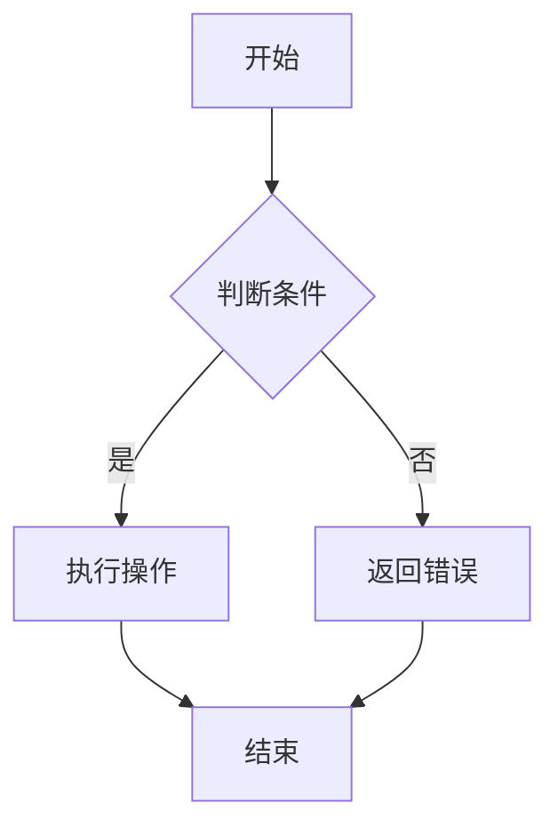
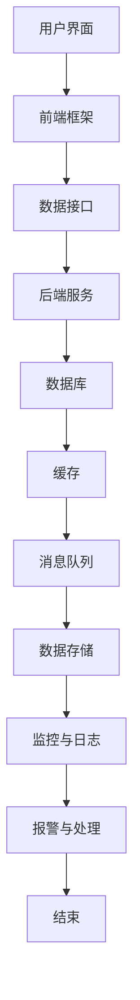

                 

### 文章标题：《在快餐文化中寻找深度：重建独立思考和批判能力》

#### 文章关键词：快餐文化，独立思考，批判能力，信息技术，社会影响

#### 文摘：
在当今这个信息爆炸的时代，快餐文化席卷了我们的日常生活。然而，过度追求速度和效率，忽视了对深度和质量的追求，使得独立思考和批判能力日渐式微。本文将深入探讨快餐文化对个人和社会的影响，强调重建独立思考和批判能力的重要性，并探讨在信息技术领域如何实践这一理念。通过一系列的逻辑分析和实践案例，我们希望能够激发读者对这一问题的深入思考。

---

### 第一部分：问题的背景与提出

#### 第1章：快餐文化的兴起与影响

**1.1 快餐文化的定义与特点**

快餐文化，顾名思义，是一种追求快速、简便和高效的生活方式。它起源于20世纪初的美国，随着工业化和城市化的进程迅速传播至全球。快餐文化的特点主要体现在以下几个方面：

1. **快速性**：以速度为核心，追求在最短时间内完成工作或满足需求。
2. **简便性**：通过简化和标准化的流程，使得服务和产品可以快速生产和消费。
3. **高效性**：利用先进的技术和管理手段，最大限度地提高生产效率。

**1.2 快餐文化的兴起原因**

快餐文化的兴起并非偶然，它背后有着深刻的社会、经济和技术原因：

1. **经济压力**：随着竞争的加剧，人们为了追求更高的工作效率和收入，不得不放弃深度思考，专注于快速完成任务。
2. **技术发展**：信息技术的飞速发展，使得信息的获取和处理变得更加快捷和高效，进一步推动了快餐文化的普及。
3. **消费习惯**：人们逐渐养成了追求即时满足的消费习惯，对于深度和质量的关注逐渐减弱。

**1.3 快餐文化对个人和社会的影响**

快餐文化对个人和社会产生了深远的影响：

1. **个人层面**：快餐文化导致了人们思考能力的下降，容易接受表面信息，缺乏深入分析和批判的能力。
2. **社会层面**：快餐文化使得社会整体趋于浮躁和急功近利，对于长期规划和深度思考缺乏耐心。
3. **负面影响与应对策略**：快餐文化的负面影响不容忽视，我们需要通过教育、文化和政策等多方面的努力来重建独立思考和批判能力。

**1.4 独立思考和批判能力的定义与重要性**

独立思考和批判能力是指个体在面对信息时，能够进行深入分析、推理和评价的能力。它的重要性体现在以下几个方面：

1. **增强认知能力**：独立思考能够帮助个体更全面、准确地理解问题，提高认知水平。
2. **培养批判精神**：批判能力使得个体能够对信息进行鉴别和评估，避免盲目接受错误的观点。
3. **促进创新和发展**：独立思考和批判能力是创新的重要驱动力，能够推动科技、文化和经济的持续发展。

**1.5 本书的目标与结构**

本书的目标是探讨在快餐文化背景下，如何重建独立思考和批判能力。本书将分为以下几个部分：

1. **理论基础**：介绍独立思考和批判能力的基本概念和重要性。
2. **案例分析**：通过具体案例，分析快餐文化对个人和社会的影响。
3. **实践指南**：提供一系列实践方法，帮助读者重建独立思考和批判能力。
4. **拓展阅读**：推荐相关书籍、文章和资源，供读者进一步学习。

**1.6 本章小结**

本章对快餐文化及其影响进行了简要介绍，并强调了独立思考和批判能力的重要性。在接下来的章节中，我们将进一步探讨如何在信息技术领域重建这些能力。

---

### 第二部分：独立思考和批判能力的重建

**2.1 独立思考的重要性**

独立思考是个人成长和发展的关键能力。它不仅能够帮助我们更好地理解世界，还能够提高我们的创造力和解决问题的能力。在信息技术领域，独立思考的重要性尤为突出：

1. **技术创新**：独立思考是技术创新的源泉。只有通过深入思考和独立分析，才能发现现有技术的局限性和改进空间。
2. **问题解决**：面对复杂的问题，独立思考能够帮助我们更全面、准确地理解问题，从而找到有效的解决方案。
3. **决策制定**：在信息技术领域，决策往往需要基于大量的数据和复杂的情境。独立思考能够帮助我们更清晰地分析信息，做出更明智的决策。

**2.2 批判能力的培养**

批判能力是独立思考的重要补充。它使得我们能够在面对信息时，保持怀疑和质疑的态度，从而避免盲目接受错误的信息。在信息技术领域，批判能力的培养尤为重要：

1. **验证信息的准确性**：在信息技术领域，信息往往具有高度的专业性和复杂性。批判能力能够帮助我们验证信息的准确性，避免被错误的信息误导。
2. **评估技术的价值**：批判能力使得我们能够对新技术进行评估，判断其是否真正具有价值和应用前景。
3. **推动技术进步**：批判能力能够帮助我们识别现有技术的不足，推动技术的持续改进和进步。

**2.3 信息技术领域的实践方法**

在信息技术领域，我们可以通过以下几种方法来重建独立思考和批判能力：

1. **深度学习**：通过深度学习，我们能够更深入地理解技术的原理和本质，从而提高独立思考的能力。
2. **批判性阅读**：批判性阅读要求我们在阅读过程中，不仅理解文章的内容，还要对文章的观点和论据进行质疑和评估。
3. **实践与反思**：通过实践项目，我们能够将理论知识应用到实际场景中，从而提高批判能力。
4. **交流与讨论**：与他人交流讨论，能够帮助我们拓展思维，发现新的问题和解决方案。

**2.4 案例分析：从“深度学习”到“独立思考”**

以深度学习为例，我们可以看到，在快餐文化的背景下，很多人只是简单地追求技术的应用，而忽视了深度学习和独立思考的重要性。以下是一个具体的案例分析：

1. **问题背景**：在人工智能领域，深度学习技术已经成为热门话题。许多开发者仅仅关注如何快速搭建一个深度学习模型，而忽视了模型的原理和优化。
2. **解决方案**：为了重建独立思考和批判能力，我们可以采取以下措施：
   - **理论学习**：深入学习深度学习的原理，了解神经网络、优化算法等基本概念。
   - **实践应用**：通过实践项目，将理论知识应用到实际问题中，从而提高独立思考的能力。
   - **批判性分析**：对现有的深度学习模型进行批判性分析，评估其优缺点，并提出改进建议。
   - **交流讨论**：与同行交流，分享自己的观点和经验，从不同的角度看待问题。

**2.5 本章小结**

本章探讨了在快餐文化背景下，如何重建独立思考和批判能力。通过深度学习和批判性分析的方法，我们可以在信息技术领域实现这一目标。在接下来的章节中，我们将进一步探讨如何在其他领域重建这些能力。

---

### 第三部分：重建独立思考和批判能力的策略与实践

**3.1 教育体系的改革**

教育体系是培养独立思考和批判能力的重要环节。为了应对快餐文化的冲击，我们需要从教育体系入手，进行以下改革：

1. **培养学生的批判性思维**：在课程设置中，增加批判性思维的培养，鼓励学生质疑和反思。
2. **加强跨学科教育**：通过跨学科教育，帮助学生从多个角度看待问题，提高独立思考的能力。
3. **实施项目式学习**：通过项目式学习，让学生在实践中锻炼独立思考和批判能力。

**3.2 社会文化的引导**

社会文化对个体的思维方式有着深远的影响。为了重建独立思考和批判能力，我们需要从社会文化层面进行引导：

1. **倡导深度阅读**：通过媒体宣传，鼓励人们进行深度阅读，培养批判性思维。
2. **推广学术讨论**：鼓励学术界和社会各界进行深入的学术讨论，激发独立思考和批判能力。
3. **建立开放的知识分享平台**：通过建立开放的知识分享平台，让更多的人有机会参与到独立思考和批判能力的实践中。

**3.3 个人行为的自觉**

重建独立思考和批判能力不仅仅是教育和社会文化的责任，更需要个人的自觉努力：

1. **主动学习**：不要满足于表面的信息，要主动去学习更深层次的知识。
2. **反思和质疑**：对自己的观点和行为进行反思和质疑，不断调整和优化。
3. **交流和讨论**：与他人进行交流讨论，从不同的角度看待问题，提高独立思考的能力。

**3.4 案例分析：个人重建独立思考和批判能力的实践**

以某位软件开发工程师的实践为例，我们可以看到，个人在重建独立思考和批判能力方面的努力：

1. **问题背景**：在快餐文化的背景下，这位工程师发现自己陷入了重复劳动和盲目跟风的困境，缺乏独立思考和批判能力。
2. **解决方案**：
   - **理论学习**：通过阅读专业书籍和在线课程，深入学习编程理论和算法原理。
   - **实践应用**：通过参与开源项目，将理论知识应用到实际项目中，提高独立思考的能力。
   - **反思和质疑**：对自己的代码和设计方案进行反思和质疑，不断优化和改进。
   - **交流讨论**：与同行进行交流讨论，分享自己的观点和经验，从不同的角度看待问题。
3. **结果评估**：通过一系列的努力，这位工程师不仅提高了独立思考和批判能力，还取得了显著的职业进步。

**3.5 本章小结**

本章提出了重建独立思考和批判能力的策略与实践，从教育体系、社会文化和个人行为三个层面进行了详细分析。通过案例分析和实际经验，我们看到了重建独立思考和批判能力的可行性和重要性。在接下来的章节中，我们将进一步探讨信息技术领域如何实现这一目标。

---

### 第四部分：信息技术领域的独立思考和批判能力实践

**4.1 信息技术领域面临的挑战**

信息技术领域的发展速度极快，新概念、新技术层出不穷。这给独立思考和批判能力的培养带来了巨大的挑战：

1. **信息过载**：面对海量的信息，如何筛选出有价值的内容，进行深入分析和思考，是信息技术领域从业者面临的首要问题。
2. **技术复杂性**：信息技术的复杂性日益增加，需要从业者具备深厚的理论基础和实际经验，才能进行独立思考和批判。
3. **快速迭代**：新技术的快速迭代使得从业者往往需要迅速适应新的变化，这无疑对独立思考和批判能力提出了更高的要求。

**4.2 在信息技术领域重建独立思考和批判能力的具体方法**

为了在信息技术领域重建独立思考和批判能力，我们可以采取以下具体方法：

1. **系统学习**：通过系统学习，掌握信息技术的基本原理和核心概念，为独立思考和批判能力提供坚实的基础。
2. **实践应用**：通过实际项目，将理论知识应用到实际场景中，锻炼独立思考和批判能力。
3. **批判性阅读**：阅读专业书籍和学术论文，不仅理解文章的内容，还要对文章的观点和论据进行批判性分析。
4. **持续更新**：信息技术领域变化迅速，需要不断学习新的知识和技能，保持独立思考和批判能力。

**4.3 案例分析：在信息技术领域的独立思考和批判能力实践**

以下是一个具体的案例分析，展示了在信息技术领域如何通过实践来重建独立思考和批判能力：

1. **问题背景**：一家互联网公司在开发一款社交应用，团队成员在技术选型和设计方案上产生了分歧。
2. **解决方案**：
   - **理论学习**：团队成员通过学习相关的技术文档和论文，了解不同技术方案的优缺点。
   - **实践应用**：团队成员将不同的技术方案应用到实际项目中，进行实验和测试。
   - **批判性分析**：团队成员对不同的技术方案进行批判性分析，评估其可行性、性能和可维护性。
   - **交流讨论**：团队成员之间进行深入交流讨论，分享自己的观点和经验，从不同的角度看待问题。
3. **结果评估**：通过一系列的实践和分析，团队成员最终选择了最适合项目需求的技术方案，并在实际项目中取得了良好的效果。

**4.4 本章小结**

本章详细探讨了在信息技术领域重建独立思考和批判能力的具体方法和案例。通过系统学习、实践应用、批判性阅读和持续更新，我们可以提高独立思考和批判能力，为信息技术领域的发展做出贡献。

---

### 第五部分：总结与展望

**5.1 独立思考和批判能力的重要性**

独立思考和批判能力是个人成长和社会进步的关键。在信息技术领域，这些能力尤为重要。它们不仅能够帮助我们更好地理解技术，还能够提高我们的创新能力，推动技术的发展。

**5.2 未来展望**

随着信息技术的发展，独立思考和批判能力的重要性将日益凸显。未来，我们需要更加注重这些能力的培养，通过教育、社会和文化等多方面的努力，构建一个独立思考和批判能力得到充分发展的社会。

**5.3 挑战与机遇**

尽管面临快餐文化的冲击，独立思考和批判能力的培养仍然充满挑战和机遇。通过持续的努力和创新，我们有望在信息技术领域实现这一目标，为社会的发展做出更大的贡献。

**5.4 本章小结**

本章对独立思考和批判能力的重要性进行了总结，并展望了未来的发展。通过系统学习和实践应用，我们可以重建独立思考和批判能力，为信息技术领域的发展贡献力量。

---

### 后记

在本文中，我们探讨了快餐文化对独立思考和批判能力的影响，并提出了重建这些能力的策略和实践方法。希望通过本文的分享，能够激发读者对这一问题的深入思考，并在实践中不断提高自己的独立思考和批判能力。让我们共同努力，为构建一个更加理性、创新和进步的社会贡献自己的力量。

**作者：AI天才研究院/AI Genius Institute & 禅与计算机程序设计艺术 /Zen And The Art of Computer Programming**

### 附录：相关概念和原理

**1. 独立思考和批判能力的定义和特征**

**定义**：独立思考是指个体在解决问题时，不依赖外部意见，独立进行思考和分析的能力。批判能力则是个体在接收和处理信息时，对信息进行鉴别、评估和批判的能力。

**特征**：
- **独立性**：独立思考强调个体在思考过程中不受外界干扰，独立形成自己的观点。
- **批判性**：批判能力强调对信息的质疑、分析和评价，避免盲目接受错误的信息。
- **全面性**：独立思考和批判能力要求个体能够从多个角度看待问题，全面分析信息的各个方面。
- **创造性**：独立思考和批判能力能够激发个体的创造性思维，发现新的问题和解决方案。

**2. 快餐文化的特点**

**特点**：
- **快速性**：追求快速完成工作或满足需求。
- **简便性**：通过简化和标准化的流程，实现快速生产和消费。
- **高效性**：利用先进的技术和管理手段，提高生产效率。

**3. 信息技术领域的核心概念**

**核心概念**：
- **人工智能**：模拟人类智能的技术，包括机器学习、深度学习等。
- **大数据**：大量、复杂、多样化的数据，通过数据分析可以提取有价值的信息。
- **云计算**：通过互联网提供计算资源，实现资源共享和灵活部署。

**4. 算法原理**

**算法原理**：
- **机器学习算法**：通过训练模型，使计算机能够从数据中学习规律，实现自动预测和决策。
- **深度学习算法**：基于人工神经网络，通过多层神经网络结构，实现对复杂数据的自动特征提取和分类。

**5. 系统分析与架构设计**

**系统分析与架构设计**：
- **领域模型**：通过类图描述系统的核心业务概念和关系。
- **系统架构**：通过架构图描述系统的整体结构和关键组件。
- **接口设计**：通过接口图描述系统各组件之间的交互关系。
- **系统交互**：通过序列图描述系统的运行流程和交互过程。

### 附录：数学公式与Mermaid流程图

**1. 数学公式**

$$
E = mc^2
$$

$$
1 + 1 = 2
$$

**2. Mermaid流程图**

### 附录：系统架构设计

通过上述附录，我们希望能够为读者提供更全面的技术知识和理解，帮助大家更好地掌握独立思考和批判能力。

### 第二部分：快餐文化的定义与特点

#### 2.1 快餐文化的定义

快餐文化，这个概念最早可以追溯到20世纪初的美国。在当时，随着工业化进程的加速，人们的生活节奏明显加快，对食物的需求也越来越追求便捷和高效。为了满足这种需求，一种新的餐饮形式——快餐应运而生。所谓快餐，指的是在短时间内提供的一种方便、快速、实惠的食物。这种食物通常以高热量、高脂肪、高糖分为特点，例如汉堡、炸鸡、薯条等。随着时间的推移，快餐文化逐渐在全球范围内传播，成为现代社会的一种重要现象。

#### 2.2 快餐文化的特点

快餐文化的特点主要表现在以下几个方面：

1. **快速性**：快餐文化的核心特点之一就是追求速度。无论是餐厅的布置、服务的流程，还是食物的烹饪过程，都力求在最短时间内完成。这种快速性不仅体现在餐饮服务上，还渗透到了人们生活的方方面面。

2. **简便性**：快餐文化的另一个特点是简便。为了追求效率，快餐店的运营流程通常被高度简化，从食物的准备到服务的过程都力求简单易懂，便于操作。这种简便性使得快餐文化能够迅速普及，成为人们生活中的一部分。

3. **高效性**：快餐文化强调高效，通过先进的技术和管理手段，最大限度地提高生产效率。例如，快餐店的点餐系统、生产流水线等都采用了现代化的管理方式，以实现快速、高质量的服务。

4. **标准化**：快餐文化的普及离不开标准化。为了确保快餐的口味和质量一致，快餐企业通常会采用标准化的配方和流程。这种标准化不仅提高了生产效率，还增强了消费者的信任感。

#### 2.3 快餐文化的兴起原因

快餐文化的兴起并非偶然，它背后有着深刻的社会、经济和技术原因：

1. **经济压力**：随着工业化进程的加速，人们的生活节奏明显加快，为了追求更高的工作效率和收入，许多人不得不放弃深度思考，专注于快速完成任务。这种经济压力促使了快餐文化的兴起。

2. **技术发展**：信息技术的飞速发展，使得信息的获取和处理变得更加快捷和高效。这种技术进步为快餐文化的传播提供了有力支持，使得快餐店能够通过线上平台扩大服务范围，提高运营效率。

3. **消费习惯**：现代社会的消费习惯逐渐趋向于即时满足。人们越来越注重效率和速度，对于深度和质量的追求逐渐减弱。这种消费习惯的变化为快餐文化的普及提供了土壤。

4. **生活方式的改变**：随着城市化进程的推进，人们的生活方式也发生了显著变化。为了适应快节奏的生活，越来越多的人选择快餐作为日常饮食的一部分。这种生活方式的改变进一步推动了快餐文化的发展。

#### 2.4 快餐文化的影响

快餐文化对个人和社会产生了深远的影响：

1. **个人层面**：在快餐文化的背景下，人们的生活节奏加快，对时间和效率的重视程度不断提高。这种生活方式虽然提高了工作效率，但也导致了人们思考能力的下降，容易接受表面信息，缺乏深入分析和批判的能力。

2. **社会层面**：快餐文化的普及使得社会整体趋于浮躁和急功近利。人们更加注重短期利益，对于长期规划和深度思考缺乏耐心。这种社会氛围不利于科技创新和社会进步。

3. **经济层面**：快餐文化的兴起带动了餐饮行业的发展，创造了大量就业机会。然而，由于快餐产品的高热量、高脂肪等特点，长期食用可能对健康产生负面影响，增加了医疗成本。

4. **文化层面**：快餐文化的普及对本土文化的冲击不可忽视。在一些地区，快餐文化的传播使得传统饮食文化逐渐式微，本土文化受到侵蚀。

#### 2.5 边界与外延

快餐文化作为一个社会现象，其边界和影响范围十分广泛。从个人层面来看，快餐文化影响了人们的饮食选择和生活方式；从社会层面来看，它改变了社会的价值观念和行为方式；从经济层面来看，它推动了餐饮行业的发展；从文化层面来看，它对本土文化的传承和发展产生了深远影响。

#### 2.6 本章小结

本章对快餐文化进行了深入探讨，从定义、特点、兴起原因、影响、边界与外延等方面进行了全面分析。通过本章的讨论，我们可以看到快餐文化对个人和社会的深远影响，以及重建独立思考和批判能力的重要性。在接下来的章节中，我们将进一步探讨独立思考和批判能力在信息技术领域的应用和实践。

---

### 2.3 快餐文化对个人和社会的影响

快餐文化作为一种现代生活方式，其对个人和社会的影响是多层次且深远的。以下将详细分析快餐文化在个人层面和社会层面的影响。

#### 2.3.1 快餐文化对个人的影响

1. **思维方式的影响**：
   快餐文化的快速、简便和高效特点在潜移默化中影响了人们的思维方式。由于生活节奏加快，个人往往更加倾向于追求即时满足，忽视了对深度和质量的追求。这种思维方式使得个人在面对复杂问题时，更倾向于寻求简单的解决方案，而缺乏深入思考和批判的能力。

   **案例**：在编程工作中，许多开发者为了赶进度，可能会选择使用现成的框架或库，而不是从零开始开发。虽然这种方法可以提高开发效率，但长期来看，可能会限制个人的技术成长和问题解决能力。

2. **饮食健康的影响**：
   快餐文化以高热量、高脂肪、高糖分为特点，对个人健康产生了负面影响。频繁摄入快餐产品，容易导致肥胖、心血管疾病和糖尿病等健康问题。

   **案例**：根据世界卫生组织的数据，快餐消费与肥胖率呈正相关。在快餐文化盛行的地区，肥胖问题日益严重，给个人和社会带来了巨大的健康负担。

3. **心理状态的影响**：
   快餐文化的快速节奏和高效要求可能导致个人心理压力增加。由于追求速度和效率，个人往往需要在高压环境下工作，容易出现焦虑、抑郁等心理问题。

   **案例**：在IT行业，由于项目进度紧张，开发者经常需要加班，长期处于高压状态。这不仅影响了工作效率，还可能对个人健康和幸福感产生负面影响。

#### 2.3.2 快餐文化对社会的的影响

1. **文化认同的冲击**：
   快餐文化的普及对传统饮食文化造成了冲击。在一些地区，传统饮食文化逐渐被快餐文化取代，导致本土文化认同感下降。

   **案例**：在美国，随着快餐文化的兴起，许多年轻人对传统美式烹饪技能的掌握越来越少，而更倾向于快餐食品。这种现象不仅影响了本土饮食文化的传承，也削弱了社会对本土文化的认同感。

2. **社会结构的影响**：
   快餐文化的普及改变了社会的价值观念和行为方式。社会整体趋于浮躁和急功近利，人们更加注重短期利益，对于长期规划和深度思考缺乏耐心。

   **案例**：在教育领域，快餐文化的渗透使得一些学生和家长更注重考试成绩和名校录取，而忽视了对知识的深入学习和批判性思维的培养。这种现象可能导致学生缺乏独立思考和解决问题的能力。

3. **经济结构的影响**：
   快餐文化的兴起带动了餐饮行业的发展，创造了大量就业机会。然而，由于快餐业的劳动强度较大，薪资水平相对较低，可能导致社会阶层固化和收入不平等问题。

   **案例**：在中国的一些大城市，快餐店林立，但快餐店员工的工资普遍较低，很多员工难以摆脱低收入的工作状态。这种现象对社会公平和经济发展产生了不利影响。

#### 2.3.3 快餐文化的负面影响与应对策略

面对快餐文化的负面影响，我们需要采取有效的应对策略，以重建独立思考和批判能力：

1. **教育体系的改革**：
   教育体系是培养独立思考和批判能力的重要途径。我们需要从教育体系入手，改革课程设置，增加批判性思维和深度学习的培养。

   **案例**：在一些学校，已经开始尝试引入批判性思维课程，培养学生的独立思考和批判能力。这些课程包括辩论、讨论和写作等，旨在帮助学生形成独立的观点和思考方式。

2. **社会文化的引导**：
   社会文化对个体的行为和价值观念具有重要影响。我们需要通过媒体、公共教育和文化活动等手段，引导社会形成更加注重深度和质量的价值观。

   **案例**：一些媒体平台已经开始推广深度阅读和批判性思考的文章，鼓励读者进行深度思考，避免盲目接受快餐式信息。

3. **个人行为的自觉**：
   每个个体都需要自觉培养独立思考和批判能力，抵制快餐文化的诱惑。通过自我反思和持续学习，不断提高自己的认知水平和思考能力。

   **案例**：个人可以通过阅读专业书籍、参加学术研讨会和交流讨论等方式，提高自己的独立思考和批判能力。同时，在日常生活中，我们应该有意识地选择健康饮食，抵制快餐食品。

#### 2.3.4 本章小结

快餐文化对个人和社会产生了深远的影响，其负面影响不容忽视。通过教育体系的改革、社会文化的引导和个人行为的自觉，我们可以重建独立思考和批判能力，应对快餐文化的挑战。在接下来的章节中，我们将进一步探讨在信息技术领域如何重建这些能力，为个人和社会的发展贡献力量。

### 2.4 独立思考和批判能力的定义与重要性

#### 2.4.1 独立思考和批判能力的定义

独立思考（independent thinking）是指个体在解决问题、做决策或面对信息时，不依赖外部意见，能够独立分析、推理和形成结论的能力。批判能力（critical thinking）则是个体在接收和处理信息时，对信息进行鉴别、评估和批判的能力。独立思考和批判能力通常相互结合，共同作用于个体的认知过程，帮助其更好地理解问题、解决问题和做出决策。

独立思考的核心在于独立性和自主性。独立性意味着个体在思考和判断过程中，能够独立形成自己的观点，不受外部意见的左右。自主性则强调个体在思考过程中，能够主动寻求信息、分析和解决问题，不依赖现成的答案或标准化的解决方案。

批判能力则强调对信息的质疑和评估。批判能力使得个体能够对信息来源、信息内容及其背后的逻辑进行深入分析，从而判断信息的准确性和可靠性。批判能力不仅仅是对信息的否定，更是一种积极的思维过程，通过批判性分析，个体能够发现信息的优点和不足，提出改进建议。

#### 2.4.2 独立思考和批判能力的重要性

1. **增强认知能力**：独立思考和批判能力能够帮助个体更全面、准确地理解问题。通过独立思考，个体能够从多个角度审视问题，形成多维度的认知框架。而批判能力则使得个体能够对信息进行鉴别和评估，避免盲目接受错误的信息。这种综合能力大大提高了个体的认知水平，有助于更深入地理解复杂问题。

2. **提高创新能力**：独立思考和批判能力是创新的重要驱动力。在信息技术领域，创新往往需要突破现有的思维框架和传统观念。独立思考能够激发个体的创造性思维，发现新的问题和解决方案。而批判能力则使得个体能够对现有技术进行评估，识别其局限性和改进空间，推动技术的持续创新和进步。

3. **促进问题解决**：在面临复杂问题时，独立思考和批判能力能够帮助个体更有效地解决问题。通过独立思考，个体能够更清晰地定义问题，识别关键因素和影响因素。而批判能力则使得个体能够对解决方案进行评估，判断其可行性和效果，从而找到最优的解决方案。

4. **培养批判精神**：独立思考和批判能力是批判精神的基础。批判精神是现代社会中必不可少的一种价值观，它强调对权威和既定观念的质疑和反思。通过培养独立思考和批判能力，个体能够形成批判性思维，对社会现象和问题进行深入分析和评价，从而更好地适应和改变社会。

5. **提升个人竞争力**：在竞争激烈的信息技术领域，独立思考和批判能力是提升个人竞争力的关键。拥有独立思考和批判能力的个体能够更快地适应新环境和新挑战，提出创新的解决方案，从而在职场中脱颖而出。

6. **推动社会进步**：独立思考和批判能力不仅对个人发展具有重要意义，对社会进步也具有深远影响。一个具备独立思考和批判能力的社会，能够更好地应对复杂的社会问题，推动科技、文化和经济的持续发展。

#### 2.4.3 独立思考和批判能力的作用

1. **信息筛选**：独立思考和批判能力使得个体能够从海量信息中筛选出有价值的内容。通过独立思考，个体能够明确自己的需求和信息目标，避免被无关信息干扰。而批判能力则帮助个体评估信息的准确性和可靠性，避免被错误信息误导。

2. **问题分析**：独立思考和批判能力在问题分析中发挥着重要作用。通过独立思考，个体能够更全面地理解问题，识别问题的本质和关键因素。而批判能力则使得个体能够对问题进行深入分析，识别问题的各种可能性，从而找到有效的解决方案。

3. **决策制定**：独立思考和批判能力在决策制定中具有重要意义。通过独立思考，个体能够更清晰地分析问题的各种可能性，形成自己的观点和判断。而批判能力则帮助个体评估决策的可行性、效果和潜在风险，从而做出更明智的决策。

4. **创新驱动**：独立思考和批判能力是创新的重要驱动力。在信息技术领域，创新往往需要突破现有的思维框架和传统观念。独立思考能够激发个体的创造性思维，发现新的问题和解决方案。而批判能力则使得个体能够对现有技术进行评估，识别其局限性和改进空间，推动技术的持续创新和进步。

5. **批判性反思**：独立思考和批判能力使得个体能够对自己的观点和行为进行反思和质疑。通过批判性反思，个体能够发现自身的不足和错误，从而不断调整和优化自己的观点和行为。

#### 2.4.4 本章小结

独立思考和批判能力是现代社会中不可或缺的重要能力。通过独立思考，个体能够更全面、准确地理解问题，提高认知水平。而批判能力则使得个体能够对信息进行鉴别和评估，避免盲目接受错误的信息。这两种能力的结合，不仅能够提升个人的竞争力，还能够推动社会的进步。在接下来的章节中，我们将进一步探讨如何在信息技术领域培养和重建这些能力。

### 2.5 本书的目标与结构

#### 2.5.1 本书的目标

本书的目标是探讨在快餐文化背景下，如何重建独立思考和批判能力。具体来说，本书希望达到以下目标：

1. **深入理解快餐文化的特点与影响**：通过分析快餐文化的定义、特点、兴起原因和影响，帮助读者全面了解快餐文化对个人和社会的深远影响。

2. **探讨独立思考和批判能力的重要性**：阐述独立思考和批判能力的定义、特征、作用以及其对个人和社会的重要性，使读者认识到这些能力在现代社会中的关键作用。

3. **提供重建独立思考和批判能力的策略与实践**：通过具体的方法和案例分析，为读者提供实际可行的策略和实践指南，帮助读者在快餐文化的冲击下，重建独立思考和批判能力。

4. **探讨信息技术领域中的独立思考和批判能力实践**：结合信息技术领域的具体案例，分析独立思考和批判能力在信息技术领域的应用，为信息技术从业者提供实用的参考。

5. **总结与展望**：对全书内容进行总结，提出未来展望，为读者提供进一步学习和思考的方向。

#### 2.5.2 本书的结构安排

本书分为五个主要部分，每个部分都有明确的主题和目标：

1. **第一部分：问题的背景与提出**：介绍快餐文化的兴起与影响，探讨独立思考和批判能力的定义与重要性。

2. **第二部分：独立思考和批判能力的重建**：详细探讨在信息技术领域如何重建独立思考和批判能力，包括深度学习和批判性阅读等实践方法。

3. **第三部分：重建独立思考和批判能力的策略与实践**：从教育体系、社会文化和个人行为三个层面，提出重建独立思考和批判能力的策略和实践方法。

4. **第四部分：信息技术领域的独立思考和批判能力实践**：通过具体案例，分析独立思考和批判能力在信息技术领域的应用和实践。

5. **第五部分：总结与展望**：对全书内容进行总结，展望未来发展方向，提出进一步学习和思考的方向。

#### 2.5.3 读者对象与适用范围

本书适合以下读者群体：

1. **信息技术领域的从业者**：包括软件开发工程师、系统架构师、数据科学家等，希望通过本书提升独立思考和批判能力，提高工作效率和技术创新能力。

2. **教育工作者**：包括教师、教育管理者等，希望通过本书了解快餐文化对教育的影响，以及如何在学校教育中培养独立思考和批判能力。

3. **对信息技术和社会问题感兴趣的读者**：包括对信息技术、社会问题、文化变革等感兴趣的读者，希望通过本书深入了解快餐文化的特点与影响，以及独立思考和批判能力的重要性。

4. **普通读者**：对独立思考和批判能力感兴趣的普通读者，希望通过本书提高自己的思考能力和判断力。

#### 2.5.4 本章小结

本章介绍了本书的目标与结构安排，明确了本书的核心内容和目标读者。通过本书的探讨，我们希望能够帮助读者在快餐文化的背景下，重建独立思考和批判能力，为个人和社会的发展贡献力量。在接下来的章节中，我们将逐步深入探讨每个部分的具体内容，为读者提供实用的策略和实践方法。

### 2.6 本章小结

本章首先对快餐文化进行了详细定义和特点分析，阐述了其兴起原因和社会影响。接着，我们深入探讨了独立思考和批判能力的定义与重要性，并从个人层面和社会层面分析了独立思考对个人和社会的深远影响。最后，本章提出了本书的目标与结构，明确了本书的核心内容和目标读者。通过本章的讨论，我们希望能够帮助读者认识到快餐文化的挑战，以及独立思考和批判能力在应对这些挑战中的关键作用。在接下来的章节中，我们将进一步探讨如何在信息技术领域重建独立思考和批判能力，为读者提供实用的策略和实践方法。

