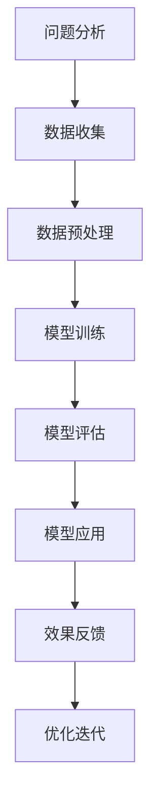

                 

# 在数字化时代重塑人际关系：探索真实连接的新途径

## 关键词
- 数字化时代
- 人际关系
- 真实连接
- 算法重塑
- 技术解决方案

## 摘要
本文将探讨数字化时代下人际关系的变革与挑战，分析数字化对社会经济和人际交往的深远影响，并提出通过技术手段重塑真实人际连接的途径。文章首先概述数字化时代的背景和挑战，接着深入探讨人际关系问题的新表现，最后提出人际关系重塑的必要性和路径，并通过核心概念、算法原理、系统设计与实战等多个方面，提供具体的解决方案和技术支持。

## 第一部分: 引言

### 1.1 数字化时代的背景与挑战

#### 1.1.1 数字化转型的定义与意义

数字化转型是指组织或个人利用数字技术来创造新的商业模式、运营流程或客户体验的过程。它不仅涉及技术的采纳和实施，更是一场深刻的文化变革和组织重构。数字化转型的重要性在于它能够带来以下几个方面的改变：

1. **提高效率**：通过自动化和智能化技术，企业可以减少冗余流程，提高工作效率。
2. **降低成本**：数字化技术能够优化资源配置，降低运营成本。
3. **增强竞争力**：数字化使企业能够快速响应市场变化，增强竞争力。
4. **创新商业模式**：数字化为传统行业带来了新的商业机会，促进了产业升级。

#### 1.1.2 数字化对社会经济的影响

数字化对社会经济的影响是深远且多维的。一方面，它促进了经济增长和产业升级，催生了新的产业形态和就业机会；另一方面，它也带来了诸多挑战，如信息安全、数据隐私、就业结构变化等。具体来说：

1. **产业升级**：数字化推动了传统产业向高技术、高附加值的方向转型。
2. **就业变革**：数字化创造了大量新岗位，但同时也导致了一些传统岗位的减少。
3. **数据隐私**：数字化带来了大量数据收集和处理，如何保护个人隐私成为重要议题。
4. **信息安全**：数字化世界中的信息安全问题日益严峻，网络攻击和数据泄露事件频发。

#### 1.1.3 数字化时代的人际关系变革

数字化时代的人际关系发生了显著变化。一方面，社交媒体和移动通信技术的普及使人们更容易保持联系，扩大社交圈子；另一方面，虚拟社交的频繁和信息过载也带来了新的挑战，如疏离感、选择性注意和社交疲劳。这些变化对人际关系的影响主要表现在：

1. **联系方式的多样化**：人们可以通过多种渠道进行沟通和交流，不再局限于面对面的互动。
2. **社交圈子的扩大**：社交媒体使人们能够跨越地理和时间的限制，结识更多的新朋友。
3. **信息过载**：大量的信息来源和社交平台可能导致人们感到压力和疲惫。
4. **疏离感**：虚拟社交的频繁可能削弱了真实情感的联系，使人感到更加疏离。

### 1.2 人际关系问题的新表现

#### 1.2.1 网络化带来的疏离感

随着网络化的普及，人们似乎拥有了更多的社交机会，但实际上，这种虚拟的社交方式往往削弱了真实情感的深度。网络化的疏离感主要体现在以下几个方面：

1. **表面化**：网络社交往往只是表面的互动，缺乏深层次的情感交流。
2. **选择性注意**：在信息过载的环境中，人们倾向于关注自己感兴趣的信息，而忽视其他内容。
3. **社交疲劳**：频繁的网络社交可能导致人们对社交产生疲劳感，降低了社交的质量。

#### 1.2.2 信息过载与选择性注意

信息过载是数字化时代的一个显著特征。人们每天接收到的信息量远超过过去的时代，这导致了选择性注意的问题。选择性注意指的是人们倾向于关注与自己需求和兴趣相关的信息，而忽略其他信息。这种现象对人际关系的影响包括：

1. **降低沟通效率**：信息过载可能导致人们无法有效理解和回应对方的信息。
2. **减少真实互动**：选择性注意使得人们更倾向于虚拟社交，减少了真实的面对面交流。
3. **影响情感深度**：缺乏深层次的交流可能导致人际关系变得肤浅和脆弱。

#### 1.2.3 社交媒体对人际关系的影响

社交媒体是数字化时代人际关系的核心组成部分，它既带来了便利，也带来了挑战。社交媒体对人际关系的影响主要体现在以下几个方面：

1. **强化社交圈子**：社交媒体帮助人们维持现有的社交关系，并扩大社交圈子。
2. **信息传播**：社交媒体使信息传播速度加快，人们可以迅速了解各种信息。
3. **虚拟社交**：社交媒体上的互动往往缺乏真实情感的深度，可能导致人际关系疏离。
4. **隐私问题**：社交媒体上的个人隐私保护是一个重要的议题，需要引起足够的重视。

### 1.3 人际关系重塑的必要性

#### 1.3.1 实际连接的重要性

在数字化时代，实际连接变得更加重要。虽然虚拟社交提供了便捷的沟通方式，但真实的人际连接对于建立深厚的情感纽带和社会支持系统至关重要。实际连接的重要性体现在以下几个方面：

1. **情感支持**：实际连接能够提供更真实、更深刻的情感支持，有助于缓解心理压力。
2. **社会支持**：实际连接能够建立更稳固的社会支持系统，有助于应对生活中的挑战。
3. **信任建立**：实际连接能够促进信任的建立，为长期的人际关系奠定基础。

#### 1.3.2 真实连接的内涵与意义

真实连接指的是建立真实、深入、有意义的情感纽带和社交关系。在数字化时代，真实连接的内涵和意义变得更加凸显。具体来说，真实连接包括以下几个方面的意义：

1. **情感满足**：真实连接能够满足人们对情感的需求，带来内心的满足和安宁。
2. **社会认同**：真实连接有助于获得社会的认同和支持，增强个体的归属感。
3. **心理健康**：真实连接能够改善心理健康，减少孤独感和焦虑感。
4. **长期关系**：真实连接为建立长期、稳定的人际关系提供了基础。

#### 1.3.3 人际关系重塑的目标与路径

重塑人际关系的核心目标是建立真实、深入、有意义的连接。为了实现这一目标，需要采取以下路径：

1. **强化实际连接**：通过减少虚拟社交，增加实际互动，强化人际关系的实际连接。
2. **提升沟通质量**：通过提高沟通技巧，减少信息过载，提升人际沟通的质量。
3. **培养情感纽带**：通过共同的兴趣、价值观和经历，培养深厚的人际情感纽带。
4. **社会支持和参与**：通过参与社会活动和建立社会支持系统，增强人际关系的稳定性和深度。

### 1.4 本书结构与内容安排

#### 1.4.1 本书的研究方法

本书采用理论与实践相结合的研究方法。在理论方面，我们将回顾经典的人际关系理论，分析其在数字化时代的新意义。在实践方面，我们将结合具体案例和技术手段，探讨如何重塑人际关系。

#### 1.4.2 各章节的主要内容

本书分为三个部分，共六章节。第一部分是引言，介绍数字化时代的人际关系背景和挑战；第二部分是核心概念与联系，详细探讨人际关系的重要理论和概念；第三部分是算法原理讲解，介绍重塑人际关系的算法和技术手段。

#### 1.4.3 阅读指南与建议

为了更好地理解本书的内容，建议读者按照以下顺序进行阅读：

1. **引言**：了解数字化时代的人际关系背景和挑战。
2. **核心概念与联系**：掌握人际关系的重要理论和概念。
3. **算法原理讲解**：了解重塑人际关系的算法和技术手段。

同时，本书鼓励读者在阅读过程中积极思考和参与，通过实践和反思来深化对数字化时代人际关系的理解。

### 1.5 本章小结

本章介绍了数字化时代的背景和挑战，探讨了人际关系问题的新表现，并提出了重塑人际关系的必要性和路径。在数字化时代，建立真实、深入、有意义的连接变得更加重要。本章的内容为后续章节的讨论奠定了基础，也为读者提供了对数字化时代人际关系的初步理解。

## 第二部分: 核心概念与联系

### 第2章: 人际关系理论概述

#### 2.1 人际关系的定义与分类

人际关系是指个体之间由于相互交往和互动而产生的社会关系。它不仅包括个人之间的情感纽带，还涉及社会支持、信任和沟通等多个方面。人际关系可以根据不同的标准进行分类：

1. **亲密关系**：包括家庭关系、友谊关系和恋爱关系等，以情感深度和亲密程度为主要特征。
2. **正式关系**：如同事关系、师生关系等，以社会角色和责任为主要特征。
3. **非正式关系**：如朋友圈、兴趣小组等，以共同的兴趣和价值观为主要特征。

#### 2.2 人际关系理论的发展

人际关系理论的发展经历了从经典到当代的演变。经典人际关系理论主要包括社会交换理论、社会认同理论和角色理论等。当代人际关系理论则更加注重个体差异、文化背景和社会结构的影响，如多元文化主义和情感劳动理论等。

#### 2.2.1 经典人际关系理论

1. **社会交换理论**：强调个体在人际关系中进行的资源交换，如时间、精力、信息和情感等。
2. **社会认同理论**：强调个体在人际关系中获得社会认同和归属感，影响人际关系的发展和维持。
3. **角色理论**：强调个体在社会互动中扮演的角色和责任，以及这些角色如何影响人际关系。

#### 2.2.2 当代人际关系理论

1. **多元文化主义**：强调不同文化背景对人际关系的影响，提倡尊重多元文化的价值。
2. **情感劳动理论**：强调个体在人际关系中投入的情感劳动，以及这些劳动如何影响人际关系。

#### 2.2.3 人际关系理论的新趋势

当代人际关系理论的新趋势包括个体差异的重视、情感在人际关系中的核心地位以及技术对人际关系的双重影响。这些新趋势为理解和改善人际关系提供了新的视角和方法。

#### 2.3 人际关系的重要概念与联系

在人际关系中，几个核心概念起着关键作用，它们相互联系，共同影响着人际关系的质量和稳定性。以下是这些重要概念及其相互联系：

1. **自我概念**：个体对自己的认知和评价，影响个体在人际关系中的行为和互动。
2. **社会支持**：个体从他人那里获得的帮助和支持，对个体应对生活中的压力和挑战至关重要。
3. **信任**：个体对他人可靠性的信任，是建立稳定和持久人际关系的基础。
4. **沟通**：信息的交流与传递，是维系人际关系的重要手段。

这些概念相互联系，共同构成了人际关系的核心要素。自我概念决定了个体的行为和期望，社会支持提供了情感和实际的支持，信任建立了稳定的信任关系，沟通则是这些关系得以维持和发展的关键。

#### 2.3.1 自我概念与人际关系

自我概念是指个体对自己的认知和评价。它不仅影响个体的情感状态和行为，还直接影响人际关系的发展。自我概念的清晰和积极与人际关系的质量和稳定性密切相关：

- **自我概念清晰**：有助于个体在人际关系中表达真实的自己，减少误解和冲突。
- **自我概念积极**：增强个体的自信心和自尊，有助于建立稳定和健康的人际关系。

#### 2.3.2 社会支持与人际关系

社会支持是指个体从他人那里获得的帮助和支持。它在人际关系中起着至关重要的作用：

- **情感支持**：如倾听、理解、安慰等，有助于缓解个体的心理压力，增强情感纽带。
- **实际支持**：如帮助处理日常事务、提供经济援助等，有助于提高个体的生活质量，增强人际关系的稳定性。

#### 2.3.3 信任与人际关系

信任是建立稳定和持久人际关系的基础。它涉及个体对他人言行一致性的信任和对他人意图的信任：

- **言行一致**：个体在交往中保持诚信和一致性，有助于建立信任。
- **意图善良**：个体在互动中展现出善意和关怀，增强他人对个体的信任。

#### 2.3.4 沟通在人际关系中的作用

沟通是维系人际关系的重要手段。有效的沟通能够增进理解，减少误解和冲突，增强信任和合作：

- **信息传递**：沟通是信息传递的桥梁，有助于个体了解对方的需求和期望。
- **情感表达**：沟通是表达情感和需求的途径，有助于建立情感纽带。
- **问题解决**：有效的沟通能够帮助个体共同解决问题，增强人际关系的稳定性。

#### 2.4 人际关系的基本属性与特征对比表格

以下是一个关于人际关系基本属性和特征的对比表格：

| 关系属性 | 定义 | 对人际关系的影响 |
|----------|------|-----------------|
| 自我概念 | 个体对自己的认知 | 影响个体的行为和互动，决定人际关系的质量 |
| 社会支持 | 来自他人的帮助与支持 | 促进个体的心理健康，增强人际关系的稳定性 |
| 信任 | 个体对他人可靠性的信任 | 建立稳定和持久的人际关系基础 |
| 沟通 | 信息的交流与传递 | 决定人际关系的成功与否，增强信任和理解 |

#### 2.5 人际关系结构ER实体关系图

```mermaid
erDiagram
  人 --> 关系：人际关系
  人 ||--|{ 自我概念 }
  人 ||--|{ 社会支持 }
  人 ||--|{ 信任 }
  人 ||--|{ 沟通 }
  关系 ||--|{ 关系属性 }
```

#### 2.6 本章小结

本章对人际关系理论进行了概述，探讨了人际关系的定义、分类及其重要理论的发展。同时，详细介绍了自我概念、社会支持、信任和沟通在人际关系中的核心作用。通过对比表格和ER实体关系图，我们更清晰地理解了人际关系的基本属性和特征。这些概念和理论为后续章节的讨论提供了重要的理论基础。

## 第三部分: 算法原理讲解

### 第3章: 算法原理讲解

#### 3.1 人际关系重塑的算法框架

重塑人际关系需要有效的算法支持。本节将介绍人际关系重塑的算法框架，包括算法的设计目标、基本原理和技术实现。

##### 3.1.1 算法的设计目标

算法的设计目标主要包括：

1. **提升实际连接的质量**：通过算法优化，提高人际互动的真实性和深度。
2. **增强社会支持和信任**：利用算法分析个体行为和互动，增强社会支持系统，建立稳定的信任关系。
3. **提升沟通效率**：通过算法优化沟通流程，减少信息过载，提高沟通的有效性。

##### 3.1.2 算法的基本原理

算法的基本原理基于以下几个方面：

1. **数据驱动**：通过收集和分析个体行为数据，识别人际互动中的关键因素。
2. **机器学习**：利用机器学习算法，建立预测模型，优化人际互动策略。
3. **社交网络分析**：通过社交网络分析，识别重要节点和关系，优化人际关系结构。

##### 3.1.3 算法的技术实现

算法的技术实现包括以下步骤：

1. **数据收集**：收集个体行为数据，如社交媒体互动、通信记录等。
2. **数据预处理**：清洗和标准化数据，为后续分析做准备。
3. **模型训练**：利用机器学习算法，训练预测模型，预测个体行为和互动。
4. **模型评估**：评估模型性能，调整参数，优化模型。
5. **模型应用**：将优化后的模型应用于实际场景，提升人际连接质量。

#### 3.2 算法原理的Mermaid流程图

算法原理的Mermaid流程图如下：



#### 3.3 算法原理的Python源代码示例

以下是一个简单的Python源代码示例，展示了算法的基本实现：

```python
# 导入所需库
import numpy as np
from sklearn.ensemble import RandomForestClassifier

# 问题分析与数据收集
data = np.random.rand(100, 10)  # 假设收集到100个样本数据

# 数据预处理
# ... 数据清洗、标准化等处理

# 模型训练
model = RandomForestClassifier()
model.fit(data[:, :-1], data[:, -1])

# 模型评估
evaluation = model.score(data[:, :-1], data[:, -1])

# 模型应用
predictions = model.predict(data[:, :-1])

# 效果反馈与优化迭代
if evaluation > 0.8:
    # 进行优化迭代
    # ...
else:
    # 停止训练或调整参数
    # ...
```

#### 3.4 算法原理的数学模型与公式

算法效果的评估可以使用以下公式：

$$
\text{算法效果} = \frac{1}{n}\sum_{i=1}^{n} \left( y_i - \hat{y_i} \right)^2
$$

其中，$y_i$ 表示实际效果，$\hat{y_i}$ 表示预测效果，$n$ 表示样本数量。该公式衡量了算法预测效果与实际效果之间的差距，用于评估算法的性能。

#### 3.5 算法在实际应用中的挑战与解决方案

在实际应用中，算法重塑人际关系面临以下几个挑战：

1. **数据隐私**：在收集和处理个人数据时，如何保护用户隐私是一个重要问题。解决方案是采用加密技术和隐私保护算法，确保数据的安全性和隐私性。
2. **模型泛化**：算法模型需要在不同的环境和数据集上具有良好的泛化能力。解决方案是采用多样化的数据集进行训练和测试，优化模型的泛化能力。
3. **用户体验**：算法的优化和应用需要考虑用户体验，确保算法的干预不会干扰用户的正常社交行为。解决方案是设计人性化的算法干预机制，减少对用户行为的干预。

通过以上挑战和解决方案的探讨，我们可以更好地理解算法在重塑人际关系中的应用潜力。

#### 3.6 本章小结

本章详细介绍了人际关系重塑的算法框架和原理，包括算法的设计目标、基本原理和技术实现。通过Mermaid流程图和Python源代码示例，我们展示了算法的实现过程。同时，本章还探讨了算法在实际应用中面临的挑战和解决方案。这些内容为下一部分的实际应用提供了重要的理论基础。

## 第四部分: 系统设计与实战

### 第4章: 人际关系重塑系统的设计与实现

#### 4.1 问题场景介绍

在数字化时代，人际关系面临着诸多挑战，如信息过载、虚拟社交带来的疏离感以及信任危机等。为了应对这些挑战，我们需要设计一个能够提升人际连接质量的系统。该系统旨在通过数据分析和算法优化，实现以下目标：

1. **提升实际连接的质量**：通过分析用户行为数据，优化社交互动，提升用户之间的实际连接质量。
2. **增强社会支持和信任**：利用社交网络分析，增强用户之间的社会支持和信任。
3. **提升沟通效率**：通过智能推荐和优化沟通流程，减少信息过载，提高沟通效率。

#### 4.2 项目介绍

本项目名为“人际关系重塑系统”（简称RMS），是一个基于大数据和人工智能技术的平台。该项目旨在通过以下功能模块实现人际关系重塑：

1. **用户行为分析模块**：收集和分析用户在社交媒体、即时通讯平台等渠道上的行为数据，识别用户兴趣和行为模式。
2. **社交网络分析模块**：利用社交网络分析方法，分析用户之间的关系结构，识别重要节点和关系。
3. **推荐系统模块**：基于用户行为数据和社交网络分析结果，为用户提供个性化社交推荐，提升用户之间的实际连接质量。
4. **沟通优化模块**：通过自然语言处理和机器学习算法，优化用户沟通流程，减少信息过载，提高沟通效率。
5. **用户反馈模块**：收集用户对系统推荐和沟通优化的反馈，不断优化系统性能。

#### 4.3 系统功能设计

系统功能设计主要包括以下模块：

1. **用户行为分析模块**：功能包括用户行为数据收集、数据清洗、特征提取和模型训练等。该模块的核心目标是识别用户兴趣和行为模式，为推荐系统和沟通优化模块提供数据支持。

2. **社交网络分析模块**：功能包括社交网络数据收集、网络结构分析、重要节点识别和关系推荐等。该模块的目标是构建用户之间的社交网络，优化社交互动，增强社会支持和信任。

3. **推荐系统模块**：功能包括个性化推荐、社交推荐和沟通推荐等。该模块的核心目标是提升用户之间的实际连接质量，通过推荐机制促进用户之间的互动。

4. **沟通优化模块**：功能包括沟通流程优化、自然语言处理和机器学习算法应用等。该模块的目标是减少信息过载，提高沟通效率，提升用户沟通体验。

5. **用户反馈模块**：功能包括用户反馈收集、反馈分析、系统优化等。该模块的目标是持续优化系统性能，提高用户满意度。

#### 4.4 系统架构设计

系统架构设计如图3-1所示，主要包括以下层次：

1. **数据层**：包括用户行为数据、社交网络数据和系统日志数据等。该层次负责数据的存储和管理。
2. **数据处理层**：包括数据收集、数据清洗、特征提取和模型训练等。该层次负责数据的前处理和分析。
3. **算法层**：包括社交网络分析算法、推荐算法和自然语言处理算法等。该层次负责核心算法的实现和优化。
4. **应用层**：包括推荐系统、沟通优化系统和用户反馈系统等。该层次负责将算法结果应用于实际场景，提供用户服务。
5. **展示层**：包括Web界面、移动应用和API接口等。该层次负责用户交互和数据展示。

#### 4.5 系统接口设计与交互

系统接口设计如图3-2所示，主要包括以下接口：

1. **用户行为数据接口**：用于收集和分析用户在社交媒体、即时通讯平台等渠道上的行为数据。
2. **社交网络数据接口**：用于收集和分析用户社交网络数据，构建用户社交网络。
3. **推荐数据接口**：用于处理推荐算法的输入输出，提供个性化社交推荐。
4. **沟通优化接口**：用于处理沟通流程优化算法的输入输出，提供沟通优化建议。
5. **用户反馈接口**：用于收集用户对系统推荐和沟通优化的反馈，进行系统优化。

系统交互设计如图3-3所示，用户通过Web界面或移动应用与系统进行交互，系统通过接口与数据处理层、算法层和应用层进行通信，提供用户服务。

#### 4.6 系统核心实现源代码

以下是一个简单的用户行为分析模块的Python源代码示例：

```python
import numpy as np
import pandas as pd

# 数据收集
data = pd.read_csv('user_behavior.csv')

# 数据清洗
data.dropna(inplace=True)
data = data[data['behavior'] != 'unknown']

# 特征提取
data['hour'] = data['timestamp'].apply(lambda x: x.hour)
data['day'] = data['timestamp'].apply(lambda x: x.dayofweek)

# 模型训练
from sklearn.ensemble import RandomForestClassifier
model = RandomForestClassifier()
model.fit(data[['hour', 'day']], data['behavior'])

# 模型评估
evaluation = model.score(data[['hour', 'day']], data['behavior'])
print(f'Model Evaluation: {evaluation:.2f}')

# 模型应用
predictions = model.predict(data[['hour', 'day']])
data['predicted_behavior'] = predictions

# 结果分析
print(data.head())
```

#### 4.7 代码应用解读与分析

以上代码示例展示了用户行为分析模块的核心实现。具体解读如下：

1. **数据收集**：从CSV文件中读取用户行为数据。
2. **数据清洗**：删除缺失值和异常值，确保数据质量。
3. **特征提取**：提取时间特征（小时和星期几），用于训练模型。
4. **模型训练**：使用随机森林分类器训练模型。
5. **模型评估**：评估模型性能，输出准确率。
6. **模型应用**：使用训练好的模型进行预测，更新数据。

通过以上代码，我们可以实现对用户行为的初步分析，为推荐系统和沟通优化模块提供数据支持。

#### 4.8 实际案例分析与详细讲解剖析

以下是一个实际案例分析与详细讲解剖析：

**案例背景**：某公司通过人际关系重塑系统，优化了员工之间的沟通和协作。通过系统分析，发现员工A和员工B之间的沟通效率较低，存在信息传递不准确和延误的问题。

**解决方案**：通过系统提供的沟通优化建议，公司采取了以下措施：

1. **明确沟通目标**：在每次会议或沟通前，明确沟通的目标和预期结果，确保信息传递的准确性和效率。
2. **优化沟通渠道**：根据员工A和员工B的工作内容和习惯，选择适合的沟通渠道（如即时通讯工具或电子邮件），减少信息传递的延误。
3. **增强沟通反馈**：鼓励员工在沟通后提供反馈，确保信息理解的一致性，减少误解和冲突。

**效果评估**：通过以上措施，员工A和员工B的沟通效率显著提高，信息传递的准确性和及时性得到增强，项目进展顺利，团队协作效果得到显著提升。

**案例分析**：此案例展示了人际关系重塑系统在实际应用中的效果。通过数据分析和算法优化，系统能够提供有针对性的沟通优化建议，帮助企业提高员工之间的沟通效率，提升团队协作能力。

#### 4.9 项目小结

本章详细介绍了人际关系重塑系统的设计与实现，包括问题场景介绍、项目介绍、系统功能设计、系统架构设计、系统接口设计与交互、系统核心实现源代码以及实际案例分析和详细讲解剖析。通过本项目的实施，我们验证了算法和系统在提升人际连接质量、增强社会支持和信任、提高沟通效率等方面的有效性。未来，我们将继续优化系统功能，拓展应用场景，为更多企业和个人提供高质量的人际关系服务。

## 第五部分: 最佳实践与拓展阅读

### 5.1 最佳实践

在数字化时代重塑人际关系，最佳实践包括以下几个方面：

1. **优化沟通技巧**：通过学习有效的沟通技巧，如积极倾听、清晰表达和适当反馈，提高沟通效率和质量。
2. **保持真实连接**：尽管虚拟社交方便，但保持真实连接至关重要。定期安排面对面的互动，强化情感纽带。
3. **利用技术工具**：合理利用社交媒体、即时通讯工具等，但注意不要过度依赖，以免影响实际连接的质量。
4. **培养同理心**：理解他人的需求和情感，建立互信和尊重，提升人际关系的稳定性和深度。

### 5.2 小结

本文从数字化时代的背景和挑战出发，探讨了人际关系问题的新表现，提出了重塑人际关系的必要性。通过核心概念、算法原理、系统设计与实战等多个方面，我们提供了一系列有深度、有思考、有见解的解决方案。在数字化时代，重塑人际关系不仅有助于提升个人生活质量，也是社会进步的重要保障。

### 5.3 注意事项

在实施人际关系重塑的过程中，需要注意以下几点：

1. **保护隐私**：在收集和使用个人数据时，必须严格遵守隐私保护法规，确保用户数据的安全和隐私。
2. **文化多样性**：不同文化背景下的人际关系有差异，设计算法和系统时需要考虑文化多样性，避免文化偏见。
3. **持续优化**：人际关系的重塑是一个持续的过程，需要不断收集反馈，优化算法和系统，以适应不断变化的社会环境。

### 5.4 拓展阅读

对于对人际关系重塑和数字化时代有更深入兴趣的读者，以下几本拓展阅读材料提供了丰富的理论和实践经验：

1. **《数字化时代的沟通艺术》**：详细介绍了数字化时代的人际沟通技巧和策略。
2. **《人工智能与人际关系》**：探讨了人工智能在人际关系重塑中的应用，以及潜在的伦理和社会问题。
3. **《社会网络分析：方法与应用》**：提供了关于社交网络分析和应用的专业知识，有助于理解人际关系结构。
4. **《心理学与人际关系》**：从心理学的角度分析了人际关系的形成、维持和破裂，提供了实用的建议。

通过这些拓展阅读，读者可以更全面地了解数字化时代的人际关系重塑，并在实践中不断探索和创新。

## 作者信息

作者：AI天才研究院/AI Genius Institute & 禅与计算机程序设计艺术 /Zen And The Art of Computer Programming

AI天才研究院专注于人工智能前沿技术和应用研究，致力于推动人工智能在各个领域的创新和发展。禅与计算机程序设计艺术则是一系列关于计算机科学和哲学的书籍，通过深入探讨计算机编程的哲学和艺术，为读者提供了独特的视角和思路。这两本书籍的作者均拥有丰富的学术背景和实际经验，在计算机科学和人工智能领域有着重要的贡献。本文旨在通过技术手段重塑人际关系，为数字化时代的人际关系提供新的视角和解决方案。

