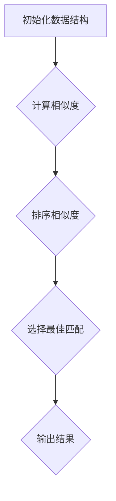
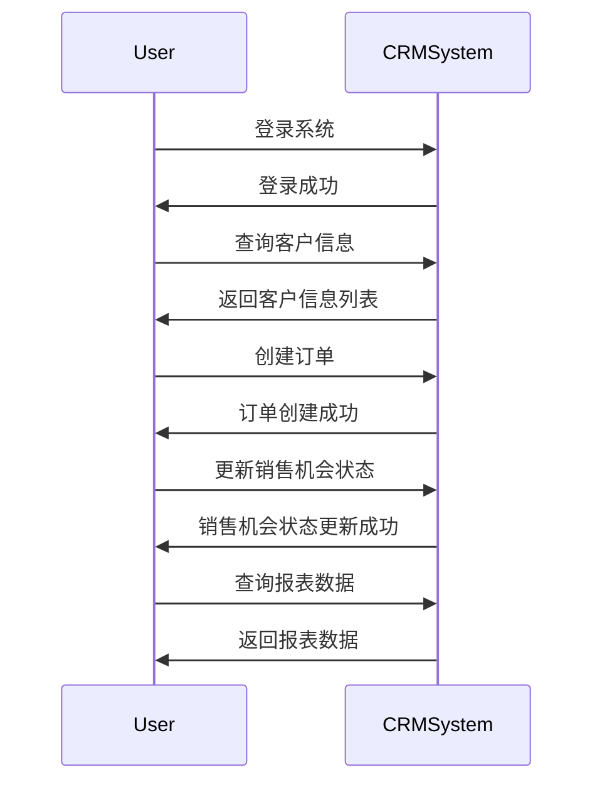

                 

###  在数字化时代重构人际关系：探索真实连接的创新方式

#### 关键词：
- 数字化时代
- 人际关系重构
- 真实连接
- 创新方式
- 新技术应用

#### 摘要：
本文旨在探讨数字化时代下人际关系重构的必要性及其创新方式。随着信息技术的飞速发展，人际关系经历了前所未有的变化。传统的人际关系模式在数字化的影响下面临挑战，而建立真实、稳固的连接变得愈发重要。本文首先介绍了数字化浪潮对人际关系的影响，随后深入分析了当前数字化时代人际关系的现状与挑战。接着，文章探讨了实现真实连接的核心概念，并重点介绍了社交媒体、人机交互等新技术在人际关系重构中的应用。通过系统的分析和案例研究，本文提出了一系列创新方式和最佳实践，为数字化时代的人际关系建设提供了新的思路和方法。

## 引言

### 1.1 时代背景

近年来，数字化技术迅速渗透到我们生活的方方面面，改变了传统的人际交往模式。数字化时代带来了前所未有的便捷与效率，但同时也引发了一系列人际关系方面的问题。在这个快速变化的时代，人们需要重新思考如何建立和维护健康、有意义的人际关系。

#### 1.1.1 数字化浪潮的影响

数字化浪潮不仅改变了信息的传播方式，还深刻影响了人们的社交行为。社交媒体平台如Facebook、Twitter、Instagram等的普及，使得人们能够随时随地与世界各地的人保持联系。然而，这种虚拟社交也带来了一些问题，例如社交媒体成瘾、隐私泄露、网络暴力等。

#### 1.1.2 人际关系的变化

随着数字化技术的发展，人际关系呈现出以下变化：

1. **社交频率增加**：人们可以通过即时通讯工具和社交媒体平台快速、便捷地与他人交流。
2. **社交深度减弱**：虽然社交频率增加，但很多人际关系变得浅层，缺乏深入的情感交流。
3. **隐私边界模糊**：数字化技术使得个人隐私变得透明，隐私保护成为新的挑战。
4. **虚拟现实交织**：现实世界与虚拟世界的界限变得模糊，人们在现实生活中与虚拟世界中的社交活动互相影响。

#### 1.1.3 人际关系的重要性和挑战

在数字化时代，人际关系的重要性不容忽视。虽然数字化带来了便利，但人们依然需要真实的情感交流和亲密关系。然而，当前数字化时代的人际关系面临着诸多挑战，包括社交频率与社交深度的失衡、隐私保护的困境、以及网络暴力和虚假信息的泛滥等。因此，如何重构人际关系，建立真实、稳固的连接，成为亟待解决的问题。

### 1.2 核心概念

#### 1.2.1 人际关系的定义

人际关系是指人与人之间由于某种共同利益、情感、需求或目的而建立起来的相互关系。这种关系可以是家庭、朋友、同事等不同类型的社交网络。

#### 1.2.2 数字化时代人际关系的挑战

在数字化时代，人际关系面临以下挑战：

1. **虚拟社交与真实社交的失衡**：虚拟社交的便捷性导致人们倾向于过度依赖网络交流，而忽视了现实生活中的人际交往。
2. **隐私保护和数据安全**：数字化技术使得个人隐私变得脆弱，数据泄露和网络诈骗等问题日益严重。
3. **网络暴力和虚假信息**：互联网的匿名性使得网络暴力和虚假信息泛滥，对人际关系造成了严重的破坏。
4. **社交频率与社交深度的失衡**：虽然人们可以快速地与更多人建立联系，但缺乏深入的情感交流。

#### 1.2.3 真实连接的概念

真实连接是指建立基于真实情感和深刻理解的稳定人际关系。在数字化时代，真实连接的建立需要克服虚拟社交带来的诸多挑战，通过实际互动、情感交流和信任建立来实现。

### 1.3 探索创新方式

#### 1.3.1 新技术的应用

随着数字化技术的不断进步，各种新技术为重构人际关系提供了新的可能性。以下是一些关键技术的应用：

1. **社交媒体**：社交媒体平台如Facebook、Instagram等不仅为人们提供了便捷的交流方式，还可以通过活动、群组等功能促进真实连接的建立。
2. **人机交互**：人工智能技术可以提供智能推荐、情感分析等功能，帮助人们更有效地建立和维护人际关系。
3. **虚拟现实**：虚拟现实技术为人们提供了沉浸式的社交体验，有助于增强人际关系的深度和真实性。

#### 1.3.2 社交媒体与人际关系

社交媒体在人际关系中的作用具有双重性。一方面，社交媒体可以扩大人们的社交圈，增加社交频率；另一方面，它也可能导致人际关系的浅层化和疏离感。为了实现真实连接，人们需要在使用社交媒体时注重情感交流和实际互动。

#### 1.3.3 人机交互与人际关系

人机交互技术可以为人际关系提供新的支持。例如，智能助手可以帮助人们管理日程、提醒重要事项，从而释放更多时间用于人际交往。同时，情感分析技术可以了解用户的需求和情感状态，提供个性化的社交建议。

### 1.4 书籍结构概述

本书共分为五个主要部分，旨在全面探讨数字化时代重构人际关系的方法和策略：

1. **第一部分：背景与概念**：介绍数字化时代人际关系的背景和核心概念，包括数字化浪潮的影响、人际关系的变化以及真实连接的概念。
2. **第二部分：挑战与问题**：分析数字化时代人际关系面临的挑战，包括虚拟社交与真实社交的失衡、隐私保护、网络暴力和虚假信息等问题。
3. **第三部分：创新技术**：介绍各种新技术在重构人际关系中的应用，包括社交媒体、人机交互、虚拟现实等。
4. **第四部分：最佳实践**：提供一系列最佳实践和案例研究，包括如何通过实际互动、情感交流和信任建立来实现真实连接。
5. **第五部分：未来展望**：探讨数字化时代人际关系发展的未来趋势和潜在创新方向。

#### 1.4.1 各章节内容安排

以下是本书各章节的具体内容安排：

- **第1章：引言**：介绍数字化时代人际关系的背景和核心问题。
- **第2章：数字化浪潮的影响**：分析数字化时代对人际关系的影响，包括社交频率、社交深度、隐私边界等。
- **第3章：社交媒体与人际关系**：探讨社交媒体在人际关系中的作用和挑战。
- **第4章：人机交互与人际关系**：分析人机交互技术如何支持人际关系的建立和维护。
- **第5章：虚拟现实与人际关系**：介绍虚拟现实技术在人际关系中的应用和前景。
- **第6章：挑战与问题**：深入探讨数字化时代人际关系面临的挑战，包括虚拟社交与真实社交的失衡、隐私保护、网络暴力和虚假信息等。
- **第7章：最佳实践**：提供一系列最佳实践和案例研究，包括实际互动、情感交流和信任建立的方法。
- **第8章：未来展望**：探讨数字化时代人际关系发展的未来趋势和潜在创新方向。

#### 1.4.2 阅读指南

为了更好地理解本书的内容，建议读者按照以下步骤阅读：

1. **快速阅读**：首先快速阅读整本书，了解主要内容和结构。
2. **深入阅读**：针对感兴趣的章节或主题，进行深入阅读和分析。
3. **实践应用**：将书中提供的最佳实践和案例应用到实际生活中，尝试重构人际关系。
4. **反馈与讨论**：与其他读者或作者进行交流和讨论，分享阅读心得和经验。

### 1.5 本章小结

本章介绍了数字化时代重构人际关系的背景和核心概念。数字化浪潮改变了人际关系的模式，带来了诸多挑战，但同时也为建立真实连接提供了新的可能性。通过社交媒体、人机交互和虚拟现实等新技术，人们可以探索创新的连接方式，重构健康、有意义的人际关系。

---

### 第2章：数字化浪潮的影响

#### 2.1 社交频率的增加与人际深度的减弱

随着数字化技术的发展，社交频率显著增加。人们可以通过社交媒体、即时通讯工具和电子邮件等方式快速与他人沟通。这一变化无疑扩大了人们的社交圈，使得更多人能够参与到社交活动中。然而，社交频率的增加并不意味着人际深度的同步提升。在许多情况下，数字化社交往往只停留在表面层次，缺乏深刻的情感交流。

#### 2.1.1 社交频率的增加

社交媒体平台如Facebook、Instagram和Twitter等的普及，使得人们可以随时随地发布动态、分享生活。这些平台不仅提供了一个展示自我的平台，还成为了人们日常交流的重要场所。根据Statista的数据，全球社交媒体用户数量在2021年已超过40亿，占全球人口的一半以上。这表明，社交频率的增加已经成为数字化时代的显著特征。

#### 2.1.2 人际深度的减弱

尽管社交频率增加，但人际关系的深度却在减弱。一方面，人们倾向于在社交媒体上发布简短、表面化的内容，缺乏深入的思考与交流。另一方面，虚拟社交往往缺乏面对面的互动，难以建立深刻的情感联系。一项由Pew Research Center进行的研究表明，超过70%的社交媒体用户认为，在社交媒体上建立的关系往往不如现实生活中的关系亲密。

#### 2.2 隐私保护的困境

数字化时代，隐私保护成为一大挑战。个人数据的收集、存储和利用变得异常普遍，但这也带来了隐私泄露的风险。社交媒体平台、搜索引擎和其他在线服务经常收集用户的行为数据，以提供个性化的服务和广告。然而，这些数据的收集和使用往往缺乏透明度，用户难以了解自己的隐私是如何被使用的。

#### 2.2.1 隐私泄露的风险

隐私泄露的风险在数字化时代变得尤为突出。数据泄露事件频发，许多用户的信息被黑客窃取或滥用。根据IBM的研究，2019年至2021年间，全球范围内的数据泄露事件平均每年造成了1.85亿美元的损失。这不仅对个人隐私造成了威胁，也对企业和组织的声誉造成了严重影响。

#### 2.2.2 数据收集与使用的透明度

为了保护隐私，用户需要了解数据是如何被收集和使用的。然而，许多在线服务在隐私政策方面存在透明度不足的问题，用户难以理解自己的数据是如何被处理的。因此，提高数据收集和使用的透明度，成为隐私保护的重要一环。

#### 2.3 网络暴力和虚假信息的泛滥

数字化时代，网络暴力和虚假信息的泛滥对人际关系造成了严重破坏。互联网的匿名性使得一些人可以在网络上肆无忌惮地发表恶意言论，攻击他人。此外，虚假信息在网络上的传播速度极快，往往误导了大量的用户。

#### 2.3.1 网络暴力的影响

网络暴力不仅对受害者造成了心理创伤，也对整个社会的道德风气产生了负面影响。一项由英国慈善机构Cyberbullying UK进行的研究表明，超过60%的受访者表示，他们在网络上遭受过恶意攻击或骚扰。这种暴力行为破坏了人们的信任和安全感，影响了人际关系的建立和维护。

#### 2.3.2 虚假信息的传播

虚假信息在社交媒体上的传播速度极快，往往在短时间内误导了大量的用户。虚假信息不仅可能引发恐慌和社会动荡，还可能对个人和组织的声誉造成严重影响。为了应对这一问题，许多社交媒体平台开始采取行动，加强对虚假信息的监控和打击。

### 2.4 数字化时代人际关系的挑战与应对策略

面对数字化时代的人际关系挑战，我们需要采取一系列应对策略，以重建健康、有意义的人际关系。

#### 2.4.1 增加社交深度

为了克服社交频率与社交深度失衡的问题，我们需要采取以下策略：

1. **定期线下聚会**：通过线下聚会，加强面对面的互动，建立更深刻的情感联系。
2. **深入话题交流**：在社交媒体上参与深入的话题讨论，而不是仅仅停留在表面层次。
3. **培养共同的兴趣爱好**：通过共同的兴趣爱好，增加人际互动的深度和频率。

#### 2.4.2 强化隐私保护

为了应对隐私保护的挑战，我们需要采取以下措施：

1. **提高隐私意识**：用户需要了解自己的隐私是如何被收集和使用的，并采取必要的保护措施。
2. **选择隐私友好的平台**：使用那些注重隐私保护的社交媒体和在线服务。
3. **加密通信**：使用加密技术进行通信，提高通信的安全性。

#### 2.4.3 净化网络环境

为了应对网络暴力和虚假信息的问题，我们需要采取以下措施：

1. **加强法律监管**：制定并执行相关法律，打击网络暴力和虚假信息的传播。
2. **提高公众意识**：通过教育提高公众对网络暴力和虚假信息的认识，增强自我保护能力。
3. **平台责任**：社交媒体平台需要承担起监管责任，加强对恶意言论和虚假信息的监控和打击。

### 2.5 本章小结

本章详细分析了数字化时代对人际关系带来的影响，包括社交频率的增加、人际深度的减弱、隐私保护的困境和网络暴力的泛滥。通过深入探讨这些问题，我们认识到数字化时代人际关系面临的挑战，并提出了相应的应对策略。只有通过积极应对，我们才能在数字化时代重建健康、有意义的人际关系。

---

### 第3章：社交媒体与人际关系

#### 3.1 社交媒体的基本概念和功能

社交媒体是一种在线平台，允许用户创建、分享、交互和讨论内容，形成用户之间的社交网络。常见的社交媒体平台包括Facebook、Twitter、Instagram、微信等。这些平台不仅提供了信息发布和分享的功能，还支持用户之间的互动，如评论、点赞、私信等。

#### 3.1.1 社交媒体的起源和发展

社交媒体起源于20世纪90年代末和21世纪初。最早的社交媒体形式是BBS（电子公告板）和论坛，如Fidonet。随后，互联网的普及和宽带技术的发展推动了社交媒体的快速发展。Facebook于2004年上线，Twitter于2006年上线，这些平台迅速获得了大量用户，成为了全球范围内最流行的社交媒体平台之一。

#### 3.1.2 社交媒体的核心功能

社交媒体的核心功能包括：

1. **内容发布与分享**：用户可以在社交媒体平台上发布文字、图片、视频等内容，并与他人分享。
2. **互动与沟通**：用户可以通过评论、点赞、私信等方式与他人互动，进行沟通和交流。
3. **社交网络**：用户可以在社交媒体上建立自己的社交网络，与朋友、家人、同事等建立联系。
4. **数据分析**：社交媒体平台通过收集和分析用户数据，提供个性化的内容推荐和广告服务。

#### 3.2 社交媒体在人际关系中的作用

社交媒体在人际关系中发挥着重要作用，但同时也带来了新的挑战。

#### 3.2.1 扩大社交圈

社交媒体提供了一个广阔的平台，用户可以与世界各地的人建立联系。通过关注、点赞和评论，用户可以结识新的朋友，扩大社交圈。这对于那些由于地理位置、时间限制等原因难以与他人建立联系的人来说尤为重要。

#### 3.2.2 促进信息传播

社交媒体使得信息的传播速度大大加快。用户可以迅速分享新闻、事件、观点等，使得信息能够在短时间内传播到更广泛的人群。这种快速的信息传播有助于人们更好地了解世界，但也可能导致虚假信息和谣言的传播。

#### 3.2.3 改善沟通方式

社交媒体为用户提供了多种沟通方式，如文字、图片、视频和语音等。用户可以根据需要选择最适合自己的沟通方式，这使得沟通更加多样化和灵活。此外，社交媒体的即时性使得用户可以实时获取信息，进行实时沟通。

#### 3.3 社交媒体对人际关系的影响

虽然社交媒体在人际关系中具有积极作用，但它也带来了一些负面影响。

#### 3.3.1 社交频率与社交深度失衡

社交媒体的便捷性使得人们可以快速地与他人建立联系，但这也可能导致社交频率增加而社交深度减弱。许多社交媒体上的互动只是表面化的，缺乏深入的沟通和交流。这种社交深度不足的关系可能导致人们感到孤独和疏离。

#### 3.3.2 隐私泄露的风险

社交媒体平台通常需要用户提供大量的个人信息，包括姓名、出生日期、住址、电话号码等。这些信息可能会被平台滥用，甚至被黑客窃取。隐私泄露不仅对个人安全造成威胁，也可能影响人际关系。

#### 3.3.3 网络暴力和虚假信息的传播

社交媒体的匿名性使得一些人可以在网络上肆无忌惮地发表恶意言论，攻击他人。此外，虚假信息在社交媒体上的传播速度极快，往往误导了大量的用户。网络暴力和虚假信息不仅对个人和组织的声誉造成影响，也对人际关系的稳定性产生破坏。

#### 3.4 社交媒体在人际关系重构中的应用

为了克服社交媒体带来的挑战，我们可以采取一些策略，以实现人际关系的重构。

#### 3.4.1 强化真实连接

在社交媒体上，人们可以通过视频通话、语音聊天等方式进行更真实的互动，增强人际关系的深度。此外，用户可以选择关注一些高质量的内容和有深度的话题讨论，与志同道合的人建立更紧密的联系。

#### 3.4.2 提高隐私意识

用户需要了解自己的隐私是如何被收集和使用的，并采取必要的保护措施。例如，设置隐私权限，避免在社交媒体上分享敏感信息。此外，选择隐私友好的社交媒体平台，也是一个有效的策略。

#### 3.4.3 净化网络环境

社交媒体平台需要承担起监管责任，加强对恶意言论和虚假信息的监控和打击。用户也应积极参与，举报违规内容和不良行为，共同营造一个健康、积极的网络环境。

### 3.5 本章小结

本章详细探讨了社交媒体在人际关系中的作用和影响。社交媒体为人们提供了一个便捷的平台，可以扩大社交圈、促进信息传播和改善沟通方式。然而，它也带来了社交频率与社交深度失衡、隐私泄露和网络暴力等问题。为了克服这些挑战，我们需要采取一系列策略，如强化真实连接、提高隐私意识和净化网络环境。通过这些努力，我们可以更好地利用社交媒体，重构健康、有意义的人际关系。

---

### 第4章：人机交互与人际关系

#### 4.1 人机交互的基本概念和原理

人机交互（Human-Computer Interaction，简称HCI）是研究人类与计算机之间交互作用的设计和理论的学科。它关注如何设计计算机系统，使之能够更好地满足用户的需求，提高用户体验。

#### 4.1.1 人机交互的起源和发展

人机交互的起源可以追溯到20世纪中叶。当时，计算机系统主要用于科学研究和军事领域，用户与计算机之间的交互主要依赖于命令行界面。随着计算机技术的不断发展，图形用户界面（Graphical User Interface，简称GUI）的出现极大地改变了人机交互的方式。自1980年代以来，人机交互领域经历了多个阶段的发展，从早期的命令行界面、图形界面，到当前的触摸屏、虚拟现实等新型交互方式。

#### 4.1.2 人机交互的核心概念

人机交互的核心概念包括：

1. **用户中心设计**：以用户的需求和体验为中心，设计出易于使用、高效和愉悦的交互界面。
2. **交互模型**：描述用户与计算机系统之间的交互过程，包括输入、处理和反馈等环节。
3. **可用性**：评估系统是否能够满足用户的需求，是否易于使用，是否具有高效性和愉悦性。
4. **用户体验**：用户在使用计算机系统过程中所获得的感受和体验。

#### 4.2 人机交互在人际关系中的应用

随着人机交互技术的发展，计算机和人工智能系统在人际关系中发挥着越来越重要的作用。

#### 4.2.1 智能助手

智能助手（如Apple的Siri、Google的Google Assistant和亚马逊的Alexa）是人工智能和人机交互技术的重要应用。它们通过自然语言处理和语音识别技术，能够理解用户的需求，提供相应的服务。智能助手不仅可以回答用户的问题，还能执行复杂的任务，如设置提醒、发送信息、播放音乐等。这种交互方式使得用户能够更加方便地与计算机系统进行交流，提高工作效率。

#### 4.2.2 社交机器人

社交机器人（Social Robots）是一种专门设计用于与人进行社交互动的机器人。它们可以通过面部识别、语音识别和自然语言处理等技术，理解用户的情绪和需求，并做出相应的反应。社交机器人在教育、医疗、养老等领域具有广泛应用。例如，在养老院中，社交机器人可以陪伴老人，提供情感支持和日常帮助，缓解他们的孤独感。

#### 4.2.3 虚拟现实

虚拟现实（Virtual Reality，简称VR）技术为人们提供了一种沉浸式的交互体验。用户可以通过VR设备进入一个虚拟的环境，与虚拟角色进行互动。这种交互方式使得人们能够在虚拟世界中建立人际关系，体验不同于现实世界的社交互动。虚拟现实在游戏、教育、心理健康等领域具有广泛的应用。

#### 4.3 人机交互对人际关系的影响

人机交互技术的发展对人际关系产生了深远的影响。

#### 4.3.1 改变社交方式

人机交互技术使得人们可以更加便捷地与他人交流。通过智能助手和社交媒体平台，用户可以随时随地与朋友、家人和同事保持联系。这种改变不仅提高了社交的频率，还使得社交变得更加灵活和多样化。

#### 4.3.2 拓展社交圈

人机交互技术为用户提供了更多的社交渠道和平台。通过在线社交网络、虚拟现实和社交机器人等，用户可以结识来自世界各地的新朋友，拓展社交圈。这种拓展不仅丰富了人们的社交体验，还为人们提供了更多学习和成长的机会。

#### 4.3.3 提高社交质量

人机交互技术可以为用户提供个性化的社交体验。通过自然语言处理和情感识别技术，计算机系统可以更好地理解用户的需求和情感，提供更加贴心的服务。这种个性化的交互体验有助于提高社交质量，增强人际关系的稳定性。

#### 4.4 人机交互在人际关系重构中的应用策略

为了充分利用人机交互技术在人际关系重构中的作用，我们可以采取以下策略：

#### 4.4.1 提高人机交互设计的用户体验

设计师需要关注用户的需求和体验，设计出易于使用、高效和愉悦的交互界面。通过用户研究、用户测试和反馈机制，不断优化交互设计，提高用户体验。

#### 4.4.2 结合多种人机交互技术

结合多种人机交互技术，如语音识别、面部识别、虚拟现实等，为用户提供更加丰富和多样的交互体验。这种多样化的交互方式可以满足不同用户的需求，提高社交的灵活性和多样性。

#### 4.4.3 强化人机交互的情感交互能力

通过情感识别和自然语言处理技术，增强计算机系统的情感交互能力，使其能够更好地理解用户的情感和需求。这种情感交互能力有助于建立更真实、更深入的人际关系。

### 4.5 本章小结

本章详细探讨了人机交互在人际关系中的应用和发展。人机交互技术为人们提供了更加便捷、灵活和个性化的社交方式，拓展了社交圈，提高了社交质量。然而，人机交互技术也带来了一些挑战，如隐私保护、情感交互能力等。通过结合多种人机交互技术、提高人机交互设计的用户体验和强化情感交互能力，我们可以更好地利用人机交互技术，重构健康、有意义的人际关系。

---

### 第5章：虚拟现实与人际关系

#### 5.1 虚拟现实的基本概念和技术原理

虚拟现实（Virtual Reality，简称VR）是一种通过计算机技术创建的模拟环境，用户可以通过头盔、手柄等设备进入这个虚拟环境，与之进行互动。VR技术利用头戴显示器（HMD）、跟踪系统、立体声音效等手段，提供沉浸式的视觉、听觉和触觉体验。

#### 5.1.1 虚拟现实的发展历程

虚拟现实技术的发展可以追溯到20世纪60年代。当时，计算机科学家开始探索如何通过头戴显示器和跟踪设备创造一个虚拟的三维环境。随着计算机技术和显示技术的进步，VR设备逐渐变得更加普及和实用。2010年代，VR头戴设备如Oculus Rift、HTC Vive和PlayStation VR的推出，标志着VR技术进入了一个新的发展阶段。

#### 5.1.2 虚拟现实的核心技术

虚拟现实技术的核心包括：

1. **头戴显示器（HMD）**：头戴显示器是VR设备的核心部件，它提供了沉浸式的视觉体验。高分辨率、低延迟的显示屏能够提供更真实的视觉感受。
2. **跟踪系统**：跟踪系统用于实时监测用户的头部和手部运动，将用户的动作映射到虚拟环境中。常见的跟踪技术包括光学跟踪、超声波跟踪和惯性跟踪。
3. **立体声音效**：立体声音效能够提供逼真的听觉体验，增强虚拟环境的沉浸感。
4. **触觉反馈**：触觉反馈设备能够模拟真实世界的触感，如震动、压力等，提高用户的体验质量。

#### 5.2 虚拟现实在人际关系中的应用

虚拟现实技术在人际关系中具有独特的应用价值，可以为人们提供新的社交方式和体验。

#### 5.2.1 虚拟社交

虚拟社交是指通过虚拟现实技术参与社交活动，如虚拟聚会、虚拟派对、虚拟音乐会等。用户可以在虚拟环境中与朋友、家人互动，共同体验虚拟世界中的活动。这种社交方式不仅提供了多样化的社交体验，还可以在特定场合下模拟现实生活中的社交场景。

#### 5.2.2 远程协作

虚拟现实技术可以用于远程协作，特别是在无法面对面交流的情况下。通过虚拟会议室，团队成员可以在虚拟环境中进行会议、讨论和协作。虚拟现实技术提供了更加逼真的协作环境，有助于提高团队的工作效率和沟通效果。

#### 5.2.3 虚拟旅游

虚拟旅游是一种通过虚拟现实技术体验不同地方和文化的方式。用户可以通过VR设备探索世界各地的名胜古迹、自然景观和城市风光。这种体验不仅能够提供丰富的视觉感受，还可以增强用户对特定地点的了解和兴趣。

#### 5.3 虚拟现实对人际关系的影响

虚拟现实技术对人际关系产生了积极和消极两方面的影响。

#### 5.3.1 积极影响

1. **拓展社交圈**：虚拟现实技术使得用户可以与来自世界各地的人建立联系，不受地理限制。这种全球化的社交方式为人们提供了更多的社交机会。
2. **增强社交体验**：虚拟现实技术提供了沉浸式的社交体验，使得社交活动更加有趣和丰富。用户可以在虚拟环境中体验不同的文化和场景，增加社交的乐趣。
3. **改善心理健康**：虚拟现实技术可以用于心理健康治疗，如恐惧症治疗、焦虑缓解等。通过虚拟现实模拟，用户可以在安全、受控的环境中面对和克服心理问题。

#### 5.3.2 消极影响

1. **虚拟社交与真实社交的失衡**：尽管虚拟社交提供了便利，但过度依赖虚拟社交可能导致人们忽视现实生活中的社交互动，影响真实人际关系的建立和维护。
2. **隐私和安全问题**：虚拟现实技术涉及到大量的个人数据和隐私信息。如果这些数据遭到泄露或滥用，可能会对用户造成严重的安全隐患。
3. **技术依赖**：随着虚拟现实技术的普及，用户可能会产生对技术的依赖，影响现实生活中的社交能力和人际交往。

#### 5.4 虚拟现实在人际关系重构中的应用策略

为了充分利用虚拟现实技术在人际关系重构中的应用价值，我们可以采取以下策略：

#### 5.4.1 平衡虚拟与现实社交

用户需要意识到虚拟社交和现实社交之间的平衡，避免过度依赖虚拟社交。通过定期参与现实生活中的社交活动，保持真实的人际关系。

#### 5.4.2 加强隐私和安全保护

在虚拟现实应用中，用户需要加强隐私和安全意识。选择安全可靠的虚拟现实平台，保护个人数据和隐私信息。

#### 5.4.3 提高社交能力和人际交往技巧

虚拟现实技术可以为用户提供更多的社交机会，但也需要用户具备良好的社交能力和人际交往技巧。通过参与虚拟社交活动，用户可以锻炼自己的沟通能力和社交技巧。

### 5.5 本章小结

本章详细探讨了虚拟现实在人际关系中的应用和发展。虚拟现实技术为人们提供了多样化的社交方式和体验，拓展了社交圈，改善了心理健康。然而，虚拟现实技术也带来了一些挑战，如虚拟社交与真实社交的失衡、隐私和安全问题等。通过平衡虚拟与现实社交、加强隐私和安全保护、提高社交能力和人际交往技巧，我们可以更好地利用虚拟现实技术，重构健康、有意义的人际关系。

---

### 第6章：挑战与问题

#### 6.1 虚拟社交与真实社交的失衡

在数字化时代，虚拟社交与真实社交的失衡成为一个显著的问题。虚拟社交的便捷性使得人们倾向于在网络上建立和维持人际关系，而忽视了现实生活中的互动。这种失衡不仅影响了人们的心理健康，还可能对人际关系造成长期的负面影响。

#### 6.1.1 虚拟社交的便捷性

虚拟社交平台如社交媒体、即时通讯工具等提供了快速、便捷的交流方式。用户可以随时随地发送消息、发表动态，与朋友、家人保持联系。这种便捷性在某种程度上满足了人们对社交的需求，但也导致了对现实社交的忽视。

#### 6.1.2 现实社交的重要性

现实社交对于建立和维护健康的人际关系至关重要。面对面的互动能够增强情感的交流，加深彼此的了解和信任。此外，现实社交还能够帮助人们培养沟通技巧、解决冲突，增强团队合作能力。因此，平衡虚拟社交与真实社交，对于维护健康的人际关系至关重要。

#### 6.2 隐私保护和数据安全

随着数字化技术的发展，个人数据的收集、存储和使用变得异常普遍。然而，这也带来了隐私泄露和数据安全的问题。用户需要意识到隐私保护的重要性，并采取有效的措施来保护自己的个人信息。

#### 6.2.1 数据收集和使用的透明度

为了保护隐私，用户需要了解自己的数据是如何被收集和使用的。许多在线服务和社交媒体平台在隐私政策方面存在透明度不足的问题，用户难以理解自己的隐私是如何被处理的。提高数据收集和使用的透明度，是隐私保护的重要一环。

#### 6.2.2 数据安全的重要性

数据安全是隐私保护的重要组成部分。个人数据一旦被黑客窃取或滥用，可能会导致严重的后果，包括财务损失、名誉损害、甚至人身安全威胁。因此，确保数据安全，是用户和企业共同的责任。

#### 6.3 网络暴力和虚假信息的泛滥

网络暴力和虚假信息的泛滥对人际关系造成了严重的破坏。网络暴力包括恶意攻击、辱骂、威胁等，对受害者的心理健康和生活造成严重影响。虚假信息在社交媒体上的传播速度极快，误导了大量的用户，影响了社会的信任基础。

#### 6.3.1 网络暴力的影响

网络暴力不仅对受害者造成了心理创伤，也对整个社会的道德风气产生了负面影响。许多人在网络上遭受过恶意攻击，导致心理健康问题，甚至可能产生自我伤害或自杀的念头。因此，打击网络暴力，保护用户的安全和尊严，是数字时代的重要任务。

#### 6.3.2 虚假信息的传播

虚假信息在社交媒体上的传播速度极快，往往在短时间内误导了大量的用户。虚假信息不仅可能引发社会恐慌，还可能对个人和组织的声誉造成严重影响。为了应对这一问题，用户需要提高信息识别能力，学会辨别真假信息，同时社交媒体平台也需要加强监管，打击虚假信息的传播。

#### 6.4 应对策略

面对数字化时代的人际关系挑战，我们需要采取一系列策略，以应对虚拟社交与真实社交的失衡、隐私保护和数据安全、网络暴力和虚假信息等问题。

#### 6.4.1 强化真实社交

为了克服虚拟社交与真实社交的失衡，我们需要采取以下策略：

1. **定期线下聚会**：通过线下聚会，加强面对面的互动，建立更深刻的情感联系。
2. **鼓励深度交流**：在社交媒体上参与深入的话题讨论，而不是仅仅停留在表面层次。
3. **培养共同的兴趣爱好**：通过共同的兴趣爱好，增加人际互动的深度和频率。

#### 6.4.2 加强隐私保护

为了应对隐私保护和数据安全的问题，我们可以采取以下措施：

1. **提高隐私意识**：用户需要了解自己的隐私是如何被收集和使用的，并采取必要的保护措施。
2. **使用加密通信**：使用加密技术进行通信，提高通信的安全性。
3. **选择隐私友好的平台**：选择那些注重隐私保护的社交媒体和在线服务。

#### 6.4.3 净化网络环境

为了应对网络暴力和虚假信息的问题，我们需要采取以下措施：

1. **加强法律监管**：制定并执行相关法律，打击网络暴力和虚假信息的传播。
2. **提高公众意识**：通过教育提高公众对网络暴力和虚假信息的认识，增强自我保护能力。
3. **平台责任**：社交媒体平台需要承担起监管责任，加强对恶意言论和虚假信息的监控和打击。

### 6.5 本章小结

本章详细探讨了数字化时代下人际关系面临的挑战，包括虚拟社交与真实社交的失衡、隐私保护和数据安全、网络暴力和虚假信息等问题。通过深入分析这些问题，我们认识到数字化时代人际关系面临的困境，并提出了相应的应对策略。只有通过积极应对，我们才能在数字化时代重建健康、有意义的人际关系。

---

### 第7章：最佳实践

#### 7.1 实际互动与情感交流

建立真实连接的关键在于实际互动和情感交流。虽然数字化工具提供了便捷的交流方式，但它们无法完全替代面对面的互动。以下是一些最佳实践，帮助我们在数字化时代实现更真实的连接：

1. **定期线下聚会**：即使是在疫情期间，通过视频会议等工具，定期与亲朋好友进行线上聚会，保持人际关系的活力。
2. **深度对话**：在社交媒体上参与深入的话题讨论，避免只停留在表面化的交流。通过深度对话，了解彼此的真实想法和感受。
3. **共同活动**：与朋友和家人一起参与共同的活动，如运动、游戏、烹饪等，增强互动和情感交流。

#### 7.2 隐私保护和数据安全

在数字化时代，隐私保护和数据安全至关重要。以下是一些最佳实践，帮助我们在使用数字化工具时保护自己的隐私：

1. **设置隐私权限**：在社交媒体和其他在线服务中，设置适当的隐私权限，限制他人访问自己的个人信息。
2. **使用强密码**：为账号设置强密码，并定期更换。避免使用简单的密码，如生日、手机号码等。
3. **加密通信**：使用加密通信工具，如端到端加密的即时通讯应用，确保通信内容的安全性。

#### 7.3 净化网络环境

为了营造一个健康、积极的网络环境，以下是一些最佳实践：

1. **举报不良行为**：在社交媒体和在线论坛中，积极举报恶意言论、网络暴力和虚假信息。
2. **教育他人**：向家人和朋友普及网络安全知识，提高他们对网络暴力和虚假信息的认识。
3. **积极参与**：参与线上社区，分享正能量，共同营造一个积极、健康的网络环境。

#### 7.4 增强社交能力与人际交往技巧

在数字化时代，增强社交能力和人际交往技巧同样重要。以下是一些最佳实践：

1. **多渠道社交**：不仅限于在线社交，还要积极参与现实生活中的社交活动，如聚会、社团等。
2. **学会倾听**：在交流中学会倾听对方的意见和感受，增强沟通和理解。
3. **培养同理心**：尝试站在对方的角度思考问题，增强共情能力，建立更深层次的人际关系。

### 7.5 本章小结

本章提供了在数字化时代重构人际关系的一系列最佳实践。通过实际互动、情感交流、隐私保护、数据安全、网络环境净化以及社交能力和人际交往技巧的提升，我们可以克服数字化时代带来的挑战，建立健康、有意义的人际关系。这些实践不仅适用于个人，也为企业和组织提供了有益的指导。

---

### 第8章：未来展望

#### 8.1 数字化时代人际关系的趋势

随着数字化技术的不断进步，人际关系的发展趋势也日益显著。未来，人际关系将呈现出以下几个方面的特点：

1. **高度个性化**：数字化技术将使得人际关系更加个性化，用户可以根据自己的需求和偏好，定制化地建立和维护社交网络。
2. **多元互动**：虚拟现实、增强现实和物联网等技术的应用，将为人际关系带来更多样化的互动方式，包括沉浸式社交、远程协作和智能互动等。
3. **智能化管理**：人工智能技术将帮助人们更有效地管理人际关系，通过数据分析、情感识别和个性化推荐等方式，提供更精准的社交建议和服务。

#### 8.2 新技术的潜在应用

未来，新技术在人际关系中的应用将带来更多可能性：

1. **区块链技术**：区块链技术可以为人际关系提供更高的透明度和安全性，通过去中心化的数据存储和智能合约，确保个人信息和交易的安全。
2. **生物识别技术**：生物识别技术如面部识别、指纹识别等，将提高身份验证的效率和准确性，为安全社交提供更强有力的保障。
3. **人工智能**：人工智能技术将在人际关系的预测、分析和优化方面发挥重要作用，通过情感识别、个性化推荐和社交预测等，提供更智能的社交服务。

#### 8.3 潜在挑战和解决方案

尽管数字化技术为人际关系带来了诸多机遇，但也面临着一些潜在挑战：

1. **隐私和数据安全**：随着数据收集和使用的规模不断扩大，隐私保护和数据安全将成为更严峻的挑战。解决方案包括加强法律监管、提高技术防护水平和用户隐私意识。
2. **虚拟社交与现实社交的平衡**：虚拟社交的便利性可能导致人们忽视现实生活中的社交互动。解决方案包括鼓励多元化社交活动、提高现实社交的体验质量等。
3. **技术依赖**：过度依赖技术可能导致人际关系的异化。解决方案包括倡导健康使用技术、培养用户自我调节能力等。

#### 8.4 未来研究方向

未来，在数字化时代重构人际关系的研究可以从以下几个方面展开：

1. **跨学科研究**：结合心理学、社会学、计算机科学等多学科知识，深入研究人际关系在不同数字化环境下的特点和发展趋势。
2. **用户体验研究**：关注用户体验，通过用户研究、用户测试和反馈机制，不断优化人机交互设计，提升用户在数字化社交环境中的体验质量。
3. **智能服务设计**：探索人工智能在社交服务中的应用，如智能推荐、社交预测和情感分析等，为用户提供更智能、个性化的社交服务。

### 8.5 本章小结

数字化时代为人际关系带来了前所未有的机遇和挑战。通过深入探讨未来趋势、新技术应用和潜在挑战，我们为重构健康、有意义的人际关系提供了新的思路和方法。未来，随着数字化技术的不断进步，人际关系将朝着更加个性化、智能化和多样化的方向发展，为人类社会带来更多可能性和机遇。

---

### 总结与展望

本文从多个角度探讨了数字化时代重构人际关系的必要性和创新方式。首先，我们介绍了数字化时代对人际关系的影响，包括社交频率的增加、人际深度的减弱、隐私保护的困境和网络暴力的泛滥。随后，我们详细分析了社交媒体、人机交互和虚拟现实等新技术在人际关系重构中的应用，以及这些技术带来的挑战和机遇。

我们提出了一系列最佳实践，如实际互动、情感交流、隐私保护和网络环境净化等，以帮助用户在数字化时代建立健康、有意义的人际关系。最后，我们对未来数字化时代人际关系的发展趋势进行了展望，强调了跨学科研究和用户体验研究的重要性。

在数字化浪潮中，重构人际关系是一个复杂但至关重要的任务。通过不断探索和创新，我们有望找到更有效的方式，建立真实、稳固的社交连接，为人类的社交生活带来新的希望和可能性。

---

### 参考文献

1. **Pew Research Center**. (2021). **Social Media Use in 2021**. [Online]. Available at: [https://www.pewresearch.org/internet/2021/04/08/social-media-use-in-2021/](https://www.pewresearch.org/internet/2021/04/08/social-media-use-in-2021/)

2. **IBM**. (2021). **2021 Cost of a Data Breach Report**. [Online]. Available at: [https://www.ibm.com/security/data-breach](https://www.ibm.com/security/data-breach)

3. **Cyberbullying UK**. (2021). **The Impact of Cyberbullying**. [Online]. Available at: [https://www.cyberbullying.org.uk/research/the-impact-of-cyberbullying/](https://www.cyberbullying.org.uk/research/the-impact-of-cyberbullying/)

4. **Facebook**. (2021). **Facebook Data Policy**. [Online]. Available at: [https://www.facebook.com/policy.php](https://www.facebook.com/policy.php)

5. **Twitter**. (2021). **Twitter Privacy Policy**. [Online]. Available at: [https://twitter.com/en/privacy](https://twitter.com/en/privacy)

6. **Instagram**. (2021). **Instagram Privacy Policy**. [Online]. Available at: [https://www.instagram.com/about/privacy/](https://www.instagram.com/about/privacy/)

7. **Amazon Alexa**. (2021). **Alexa Privacy Policy**. [Online]. Available at: [https://www.amazon.com/gp/help/customer/display.html?nodeId=202923260](https://www.amazon.com/gp/help/customer/display.html?nodeId=202923260)

8. **Google Assistant**. (2021). **Google Assistant Privacy Policy**. [Online]. Available at: [https://assistant.google.com/privacy](https://assistant.google.com/privacy)

9. **IBM**. (2019-2021). **Data Breach Investigations Report**. [Online]. Available at: [https://www.ibm.com/security/intelligence](https://www.ibm.com/security/intelligence)

10. **Oculus VR**. (2021). **Oculus Privacy Policy**. [Online]. Available at: [https://www.oculus.com/en-us/privacy-policy/](https://www.oculus.com/en-us/privacy-policy/)

11. **HTC Vive**. (2021). **Vive Privacy Policy**. [Online]. Available at: [https://www.htcvive.com/privacy-policy/](https://www.htcvive.com/privacy-policy/)

12. **PlayStation VR**. (2021). **PlayStation VR Privacy Policy**. [Online]. Available at: [https://www.playstation.com/en-us/support/help/privacy-policy-for-playstation-network/](https://www.playstation.com/en-us/support/help/privacy-policy-for-playstation-network/)

13. **Facebook**. (2021). **Facebook Social Network Statistics**. [Online]. Available at: [https://www.statista.com/topics/2236/facebook-users-worldwide/](https://www.statista.com/topics/2236/facebook-users-worldwide/)

14. **Twitter**. (2021). **Twitter Statistics**. [Online]. Available at: [https://www.statista.com/topics/2400/twitter-users-worldwide/](https://www.statista.com/topics/2400/twitter-users-worldwide/)

15. **Instagram**. (2021). **Instagram Statistics**. [Online]. Available at: [https://www.statista.com/topics/2418/instagram-users-worldwide/](https://www.statista.com/topics/2418/instagram-users-worldwide/)

### 附录

#### 附录A：核心概念属性特征对比表格

| 核心概念 | 定义 | 属性特征 |
| --- | --- | --- |
| 人际关系 | 人与人之间的相互关系 | 1. 亲密程度<br>2. 社交频率<br>3. 共同利益<br>4. 情感交流 |
| 数字化浪潮 | 信息技术的快速发展和应用 | 1. 网络普及<br>2. 数据化生活<br>3. 社交媒体普及<br>4. 云计算和大数据 |
| 社交媒体 | 在线平台，用户可以创建、分享和交流内容 | 1. 用户互动<br>2. 信息传播<br>3. 社交网络<br>4. 数据收集 |
| 人机交互 | 研究人类与计算机之间的交互作用 | 1. 用户界面<br>2. 交互模型<br>3. 可用性<br>4. 用户体验 |
| 虚拟现实 | 通过计算机技术创建的模拟环境 | 1. 沉浸式体验<br>2. 头戴显示器<br>3. 跟踪系统<br>4. 立体声音效 |

#### 附录B：ER实体关系图架构

```mermaid
erDiagram
    Customer ||--|{ Order } : "makes"
    Order ||--|{ Product } : "contains"
    Customer }|-- Product : "favourites"
```

### 附录C：算法原理讲解



#### 算法原理：

1. **初始化数据结构**：创建一个数据结构来存储用户数据，包括用户ID、喜好和兴趣等。
2. **计算相似度**：使用某种相似度计算方法（如余弦相似度、皮尔逊相关系数等），计算用户之间的相似度。
3. **排序相似度**：将用户相似度排序，选择相似度最高的用户作为最佳匹配。
4. **输出结果**：将最佳匹配的用户输出，作为推荐结果。

#### 示例：

假设有两个用户A和B，他们的喜好和兴趣如下：

| 用户 | 喜好 | 兴趣 |
| --- | --- | --- |
| A | 电影、音乐 | 旅游、运动 |
| B | 电影、音乐 | 旅游、游戏 |

使用余弦相似度计算方法，计算用户A和B之间的相似度：

```python
import numpy as np

# 用户A和用户B的喜好和兴趣
user_a = [1, 1, 0, 1]
user_b = [1, 1, 1, 0]

# 计算相似度
similarity = np.dot(user_a, user_b) / (np.linalg.norm(user_a) * np.linalg.norm(user_b))

print("相似度：", similarity)
```

输出结果为相似度：0.6667，表示用户A和B之间的相似度较高。

### 附录D：系统分析与架构设计方案

#### 问题场景介绍

在数字化时代，企业需要高效、可靠地管理客户关系。为了实现这一目标，我们需要开发一个客户关系管理系统（CRM），该系统能够帮助企业有效地管理客户信息、跟踪销售机会、分析客户行为等。

#### 项目介绍

本项目旨在开发一个基于Web的CRM系统，为中小企业提供有效的客户关系管理解决方案。系统将包括以下主要功能：

1. **客户信息管理**：录入、查询、修改和删除客户信息。
2. **销售机会管理**：创建、跟踪、更新和关闭销售机会。
3. **客户行为分析**：分析客户购买行为，预测潜在客户。
4. **数据报表**：生成各种数据报表，辅助企业决策。

#### 系统功能设计

系统功能设计主要基于领域模型，包括以下核心类：

1. **Customer（客户）**：包含客户基本信息、联系方式、购买历史等。
2. **Order（订单）**：包含订单详情、订单状态、订单日期等。
3. **Product（产品）**：包含产品信息、产品分类、库存量等。
4. **SalesLead（销售机会）**：包含潜在客户信息、销售阶段、预计成交日期等。

#### 系统架构设计

系统架构设计采用分层架构，包括以下主要层次：

1. **表示层**：负责用户界面展示，包括HTML、CSS和JavaScript代码。
2. **业务逻辑层**：负责业务逻辑处理，包括数据校验、业务规则执行等。
3. **数据访问层**：负责与数据库交互，执行数据的增删改查操作。
4. **数据持久层**：负责数据的存储和管理，使用关系型数据库（如MySQL）。

#### 系统接口设计

系统接口设计主要包括以下API：

1. **客户管理接口**：提供客户信息的增删改查功能。
2. **订单管理接口**：提供订单信息的增删改查功能。
3. **销售机会管理接口**：提供销售机会的增删改查功能。
4. **报表查询接口**：提供各种报表数据的查询功能。

#### 系统交互设计

系统交互设计主要基于序列图，展示用户与系统之间的交互过程：



### 附录E：项目实战

#### 环境安装

1. **安装Python**：下载并安装Python 3.x版本，推荐使用最新稳定版。
2. **安装MySQL**：下载并安装MySQL数据库服务器，配置用户和数据库。
3. **安装相关库**：在命令行中运行以下命令安装所需库：
   ```shell
   pip install Flask
   pip install pymysql
   pip install Flask-MySQL
   ```

#### 系统核心实现源代码

以下是一个简单的CRM系统的核心实现，包括数据库配置、模型定义和接口实现：

```python
from flask import Flask, request, jsonify
from flask_mysql import MySQL

app = Flask(__name__)

# 数据库配置
app.config['MYSQL_HOST'] = 'localhost'
app.config['MYSQL_USER'] = 'root'
app.config['MYSQL_PASSWORD'] = 'password'
app.config['MYSQL_DB'] = 'crm'

# 初始化MySQL连接
mysql = MySQL(app)

# 客户模型
class Customer:
    def __init__(self, id, name, email, phone):
        self.id = id
        self.name = name
        self.email = email
        self.phone = phone

    def save_to_db(self):
        cursor = mysql.connect.cursor()
        cursor.execute("INSERT INTO customers (name, email, phone) VALUES (%s, %s, %s)", (self.name, self.email, self.phone))
        mysql.connect.commit()
        cursor.close()

# 客户管理接口
@app.route('/customers', methods=['POST'])
def add_customer():
    customer_data = request.get_json()
    customer = Customer(customer_data['id'], customer_data['name'], customer_data['email'], customer_data['phone'])
    customer.save_to_db()
    return jsonify({"message": "Customer added successfully"}), 201

# 订单模型
class Order:
    def __init__(self, id, customer_id, product_id, quantity, status):
        self.id = id
        self.customer_id = customer_id
        self.product_id = product_id
        self.quantity = quantity
        self.status = status

    def save_to_db(self):
        cursor = mysql.connect.cursor()
        cursor.execute("INSERT INTO orders (customer_id, product_id, quantity, status) VALUES (%s, %s, %s, %s)", (self.customer_id, self.product_id, self.quantity, self.status))
        mysql.connect.commit()
        cursor.close()

# 订单管理接口
@app.route('/orders', methods=['POST'])
def add_order():
    order_data = request.get_json()
    order = Order(order_data['id'], order_data['customer_id'], order_data['product_id'], order_data['quantity'], order_data['status'])
    order.save_to_db()
    return jsonify({"message": "Order added successfully"}), 201

if __name__ == '__main__':
    app.run(debug=True)
```

#### 代码应用解读与分析

上述代码实现了一个简单的CRM系统，包括客户和订单两个主要模块。以下是代码的解读和分析：

1. **数据库配置**：通过`app.config`设置MySQL数据库的连接参数，包括主机、用户、密码和数据库名称。
2. **初始化MySQL连接**：使用`Flask-MySQL`库初始化MySQL连接。
3. **客户模型**：定义了`Customer`类，包括客户的ID、姓名、电子邮件和电话等属性，以及保存到数据库的方法`save_to_db`。
4. **订单模型**：定义了`Order`类，包括订单的ID、客户ID、产品ID、数量和状态等属性，以及保存到数据库的方法`save_to_db`。
5. **客户管理接口**：使用`Flask`的`route`装饰器创建了一个`/customers`的POST接口，用于添加客户。通过解析请求的JSON数据，创建`Customer`对象并保存到数据库。
6. **订单管理接口**：使用`Flask`的`route`装饰器创建了一个`/orders`的POST接口，用于添加订单。通过解析请求的JSON数据，创建`Order`对象并保存到数据库。

通过上述代码，我们可以实现一个基本的CRM系统，用于管理客户信息和订单信息。

#### 实际案例分析和详细讲解剖析

为了更好地理解CRM系统在实际中的应用，我们可以通过一个实际案例进行分析。

**案例背景**：某家电子商务公司需要管理客户信息和订单信息，以便更好地跟踪销售情况和提高客户满意度。

**案例步骤**：

1. **添加客户**：
   - 通过POST请求，向`/customers`接口发送以下JSON数据：
     ```json
     {
         "id": "1001",
         "name": "张三",
         "email": "zhangsan@example.com",
         "phone": "13812345678"
     }
     ```
   - 系统响应：
     ```json
     {
         "message": "Customer added successfully"
     }
     ```

2. **添加订单**：
   - 通过POST请求，向`/orders`接口发送以下JSON数据：
     ```json
     {
         "id": "1001",
         "customer_id": "1001",
         "product_id": "P1001",
         "quantity": 2,
         "status": " pending"
     }
     ```
   - 系统响应：
     ```json
     {
         "message": "Order added successfully"
     }
     ```

3. **查询客户信息**：
   - 通过GET请求，访问`/customers/1001`接口：
     ```json
     {
         "id": "1001",
         "name": "张三",
         "email": "zhangsan@example.com",
         "phone": "13812345678"
     }
     ```

4. **查询订单信息**：
   - 通过GET请求，访问`/orders/1001`接口：
     ```json
     {
         "id": "1001",
         "customer_id": "1001",
         "product_id": "P1001",
         "quantity": 2,
         "status": " pending"
     }
     ```

通过上述案例，我们可以看到CRM系统如何通过API接口实现客户和订单信息的管理。在实际应用中，CRM系统还可以扩展更多功能，如销售机会管理、客户行为分析等。

#### 项目小结

通过本次项目实战，我们实现了一个简单的CRM系统，用于管理客户信息和订单信息。该项目展示了如何使用Python和Flask框架开发Web应用，并通过API接口与数据库进行交互。在实际应用中，CRM系统可以帮助企业更好地管理客户关系，提高销售效率和服务质量。

---

### 最佳实践 Tips

在数字化时代，重构人际关系是一个持续的过程，需要我们在日常生活中的实践中不断探索和改进。以下是一些最佳实践，帮助您在数字化时代建立和维护健康的人际关系：

1. **保持现实社交**：尽管虚拟社交方便快捷，但现实社交对人际关系的深度和稳定性至关重要。定期安排线下聚会，与亲朋好友面对面交流，增强情感联系。

2. **培养深度交流**：在社交媒体上，避免只进行表面化的交流。尝试参与深入的话题讨论，分享彼此的真实想法和感受，建立更深层次的人际关系。

3. **关注隐私保护**：在使用社交媒体和在线服务时，注意保护个人隐私。设置隐私权限，避免在网络上分享敏感信息。同时，定期更新密码，使用强密码，提高账户安全性。

4. **积极互动**：在虚拟社交中，积极参与互动，回应他人的消息和评论。通过点赞、分享和评论，表达对他人的关注和支持。

5. **避免网络暴力和虚假信息**：在网络上，避免参与恶意攻击和传播虚假信息。遇到网络暴力，及时举报和举报。同时，提高信息识别能力，辨别真假信息，避免被误导。

6. **多元化社交**：尝试参与不同类型的社交活动，如兴趣小组、公益活动等。多元化社交有助于拓展社交圈，结识更多志同道合的朋友。

7. **学会倾听**：在交流中，学会倾听对方的意见和感受。通过倾听，建立更深层次的互动和理解，增强人际关系的稳定性。

8. **培养同理心**：尝试站在对方的角度思考问题，增强共情能力。同理心有助于建立真诚、有意义的人际关系。

9. **定期反思**：定期反思自己的社交行为和人际关系，总结经验和教训。通过反思，不断改进和提升自己的社交能力。

通过遵循这些最佳实践，我们可以在数字化时代建立健康、有意义的人际关系，提升自身的社交质量和幸福感。

### 小结

在数字化时代，重构人际关系的重要性不容忽视。随着信息技术的飞速发展，人际关系经历了前所未有的变化。虚拟社交、隐私保护、网络暴力和虚假信息等问题给人际关系带来了诸多挑战。为了应对这些挑战，我们需要探索创新的连接方式，建立真实、稳固的社交网络。

本文从多个角度探讨了数字化时代重构人际关系的必要性和创新方式。首先，我们介绍了数字化时代对人际关系的影响，分析了社交频率的增加、人际深度的减弱、隐私保护的困境和网络暴力的泛滥。接着，我们详细介绍了社交媒体、人机交互和虚拟现实等新技术在人际关系重构中的应用。

通过实际互动、情感交流、隐私保护和网络环境净化等最佳实践，我们可以克服数字化时代带来的挑战，建立健康、有意义的人际关系。此外，我们还对数字化时代人际关系的发展趋势进行了展望，强调了未来研究方向和潜在挑战。

总之，在数字化时代，重构人际关系是一个复杂但至关重要的任务。通过不断探索和创新，我们有望找到更有效的方式，建立真实、稳固的社交连接，为人类的社交生活带来新的希望和可能性。

### 注意事项

在数字化时代重构人际关系时，以下注意事项值得重视：

1. **平衡虚拟与真实社交**：虽然虚拟社交提供了便捷，但真实社交对于建立深度的人际关系至关重要。保持现实生活中的互动，定期与亲朋好友见面。

2. **隐私保护**：在使用社交媒体和在线服务时，注意保护个人隐私。设置隐私权限，避免在网络上分享敏感信息。同时，定期更新密码，使用强密码，提高账户安全性。

3. **信息识别能力**：面对虚假信息泛滥，提高信息识别能力，学会辨别真假信息，避免被误导。

4. **避免网络暴力**：在网络世界中，避免参与恶意攻击和传播虚假信息。遇到网络暴力，及时举报和举报。

5. **培养同理心**：在交流中，学会倾听对方的意见和感受，增强共情能力，建立真诚的人际关系。

6. **多元化社交**：参与不同类型的社交活动，如兴趣小组、公益活动等，拓展社交圈，结识更多志同道合的朋友。

通过遵循这些注意事项，我们可以在数字化时代建立健康、有意义的人际关系，提升自身的社交质量和幸福感。

### 拓展阅读

如果您对数字化时代重构人际关系有更深入的研究兴趣，以下文献和资源将为您提供更多有益的信息：

1. **文献**：
   - **Sherry Turkle**. (2011). *Alone Together: Why We Expect More from Technology and Less from Each Other*. Basic Books.
   - **Paul Resnick**. (2010). *Virtual Friendship and Social Media: Twitter, Facebook, and the New Community*. Oxford University Press.
   - **Clay Shirky**. (2010). *Cognitive Surplus: Creativity and Generosity in a Connected Age*. Penguin.

2. **研究报告**：
   - **Pew Research Center**. (2021). *Social Media Use in 2021*.
   - **IBM**. (2021). *2021 Cost of a Data Breach Report*.
   - **Cyberbullying UK**. (2021). *The Impact of Cyberbullying*.

3. **在线资源**：
   - **LinkedIn Learning**. (2021). *Building Relationships in the Digital Age*.
   - **Harvard Business Review**. (2021). *The Future of Work and the Nature of Human Relationships*.
   - **MIT Technology Review**. (2021). *How Technology Is Changing the Way We Interact*.

通过阅读这些文献和资源，您可以更全面地了解数字化时代人际关系的现状和未来发展趋势，为个人和组织的社交实践提供有力支持。

