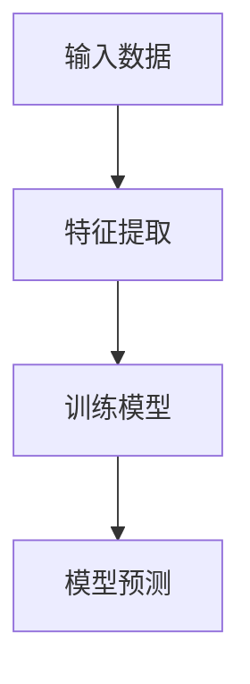
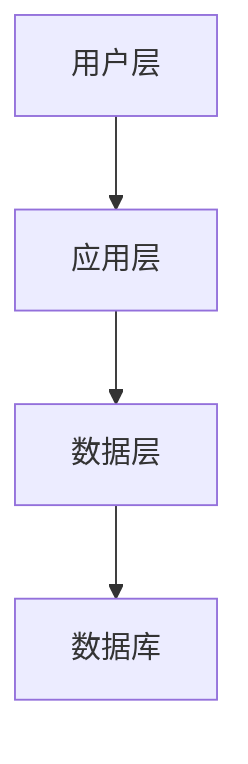
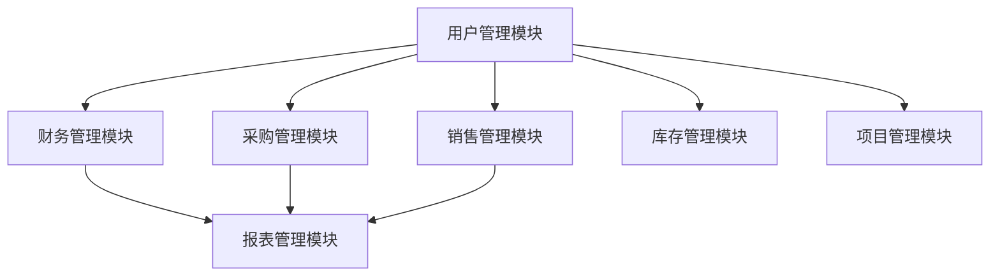

                 

### 在数字经济时代寻找职业意义：应对就业市场的变革

在当今这个数字化飞速发展的时代，我们正经历着前所未有的技术革命。大数据、人工智能、云计算等新兴技术的不断涌现，彻底颠覆了传统就业市场的格局。这样的变革既带来了巨大的挑战，也蕴藏着无限的机会。对于求职者和在职人员来说，如何在这个动荡的时代中寻找职业意义，如何应对就业市场的变革，成为了一项紧迫且重要的课题。

本篇文章将围绕这一核心问题展开讨论。我们将从理论分析和实践案例两个方面进行探讨，帮助读者理解数字经济时代职业发展的本质，并为其提供切实可行的职业发展策略。

## 关键词

- 数字经济
- 职业发展
- 技术技能
- 创新思维
- 团队合作
- 持续学习
- 软技能
- 跨界融合

## 摘要

本文旨在探讨数字经济时代下职业发展的新趋势和挑战，为求职者和在职人员提供职业发展的策略和方向。文章首先介绍了数字经济时代的背景和特点，分析了技术变革对就业市场的影响。接着，本文从技术技能、创新思维、团队合作等多个维度出发，详细阐述了在数字经济时代如何提升个人职业竞争力。此外，本文还通过具体案例，展示了如何在实践中应对职业发展的挑战。通过本文的阅读，读者将能够更好地理解数字经济时代的职业发展规律，找到适合自己的职业发展路径。

### 第一部分：引言

#### 1.1 背景介绍

数字经济，是指以数字化的信息和知识为关键生产要素，以现代信息网络为重要载体，以信息通信技术的有效利用为驱动的新型经济形态。随着互联网、大数据、人工智能等技术的快速发展，数字经济正在深刻地改变着全球经济的运行模式。这种变革不仅体现在商业领域，还渗透到了教育、医疗、政府管理等各个领域。

在就业市场上，数字经济的兴起带来了巨大的影响。首先，传统职业的边界逐渐模糊，许多职业正在被新兴技术所替代或改造。例如，人工智能技术的发展，使得许多重复性的劳动被自动化，从而减少了这些岗位的需求。另一方面，新的职业机会也在不断涌现，例如数据分析师、人工智能工程师、区块链开发人员等。这些职业需要具备新的技能和知识，对求职者的要求更高。

此外，数字经济还推动了远程办公和虚拟团队的发展。随着互联网技术的进步，人们可以不受地域限制地进行工作，这种趋势不仅提高了工作效率，也为求职者提供了更多的就业选择。然而，这也对求职者的沟通能力、团队合作能力提出了更高的要求。

总之，数字经济时代的就业市场充满了挑战和机遇。求职者和在职人员需要不断学习新技能，提升自身竞争力，才能在这个时代中找到自己的职业意义。

#### 1.2 问题提出

在数字经济时代，如何把握行业发展趋势，找到适合自己的职业发展方向，成为许多求职者和在职人员面临的难题。首先，行业发展趋势的变化速度非常快，新兴技术不断涌现，这要求求职者必须具备持续学习的能力，以跟上行业的发展步伐。其次，职业发展的路径也变得更加多样化，不再局限于传统的职业路径，求职者需要具备跨界思维，灵活应对各种职业机会。

此外，数字经济时代对求职者的技术技能和软技能提出了更高的要求。技术技能方面，数据分析和编程能力成为许多岗位的必备技能。软技能方面，沟通能力、团队合作能力、创新能力等也越来越重要。这些技能不仅是在职人员需要提升的，也是求职者在求职过程中需要展现的。

总之，在数字经济时代，求职者和在职人员需要具备较强的自我学习能力、跨界思维和综合能力，才能在这个充满变革的时代中找到自己的职业意义。

#### 1.3 边界与外延

在讨论数字经济时代的职业发展时，我们需要明确一些边界与外延。首先，本文主要关注的是与职业发展密切相关的几个方面，如技术技能、创新思维、团队合作等。这些方面是求职者和在职人员提升自身竞争力、应对就业市场变革的核心要素。

其次，数字经济时代虽然涵盖了广泛的领域，但本文将聚焦于与职业发展直接相关的几个领域，如信息技术、金融科技、智能制造等。这些领域是当前和未来几年内就业市场的主要方向，也是求职者需要关注的重点。

此外，本文还将探讨一些关键的技术趋势，如人工智能、大数据、区块链等，这些技术正在深刻地改变着就业市场的格局。通过分析这些技术，我们可以更好地理解未来职业发展的方向和机遇。

最后，本文还将讨论一些策略和方法，帮助求职者和在职人员提升自身的竞争力，如持续学习、跨学科融合、职业规划等。这些策略和方法不仅适用于当前数字经济时代，也具有普遍的指导意义。

#### 1.4 概念结构与核心要素组成

在数字经济时代，职业发展的概念结构与核心要素可以分为以下几个部分：

1. **数字经济**：数字经济是指以数字化的信息和知识为关键生产要素，以现代信息网络为重要载体，以信息通信技术的有效利用为驱动的新型经济形态。数字经济的核心要素包括互联网、大数据、人工智能、区块链等。

2. **职业发展**：职业发展是指个人在职业生涯中不断成长、进步的过程。在数字经济时代，职业发展不再局限于某个行业或职位，而是更加灵活、多样。职业发展的核心要素包括技术技能、软技能、职业规划、持续学习等。

3. **技术技能**：技术技能是数字经济时代求职者和在职人员必备的核心能力。随着新兴技术的不断涌现，技术技能的要求也在不断更新。技术技能的核心要素包括编程、数据分析、人工智能、区块链等。

4. **创新思维**：创新思维是在数字经济时代应对就业市场变革的重要能力。创新思维不仅体现在技术层面，也体现在商业模式、管理方法等方面。创新思维的核心要素包括跨学科融合、创新方法、创新文化等。

5. **团队合作**：团队合作是在数字经济时代职业发展中不可或缺的一部分。随着远程办公、虚拟团队等新兴工作模式的普及，团队合作变得更加重要。团队合作的核心要素包括沟通能力、协作能力、团队文化等。

这些概念相互关联，共同构成了数字经济时代职业发展的基础。通过理解这些核心要素，求职者和在职人员可以更清晰地把握职业发展的方向，提升自身的竞争力。

### 第二部分：核心概念与联系

#### 2.1 数字经济

数字经济，作为一种新型的经济形态，正在深刻地改变着全球经济的格局。它不仅是一种技术驱动的经济模式，更是一种全新的社会生产和生活方式。数字经济的核心要素包括互联网、大数据、人工智能、区块链等。

首先，互联网是数字经济的基础设施。它使得信息可以在全球范围内快速传播，打破了传统地理和时间的限制。通过互联网，人们可以随时随地访问海量的信息资源，进行在线交流和合作，从而极大地提高了工作效率和生活质量。

其次，大数据是数字经济的核心资源。随着互联网的普及，海量数据被不断生成和积累，这些数据蕴藏着巨大的商业价值。通过对这些数据进行分析和挖掘，企业可以更好地了解市场需求、优化产品和服务，从而在激烈的市场竞争中脱颖而出。

再次，人工智能是数字经济的核心驱动力。人工智能技术通过模拟人类智能，实现自动化、智能化的决策和操作。从自动化生产线到智能客服，从自动驾驶到智能医疗，人工智能正在改变着各行各业的生产和运营模式。

最后，区块链是数字经济的新型基础设施。区块链技术通过去中心化的方式，确保数据的真实性和安全性，为数字经济的运行提供了可靠的保障。从数字货币到供应链管理，从数字身份到智能合约，区块链技术正在逐步渗透到数字经济的各个领域。

总的来说，数字经济是一种以信息技术为核心，以数据为驱动的经济形态。它不仅改变了传统产业的生产和运营方式，也为新兴产业的崛起提供了肥沃的土壤。在数字经济时代，理解数字经济的核心概念和要素，是把握未来职业发展方向的重要前提。

#### 2.2 职业发展

职业发展是指个人在职业生涯中不断成长、进步的过程。在数字经济时代，职业发展具有以下特点和趋势：

首先，职业发展的路径更加多样化。在传统经济时代，职业发展往往遵循一条明确的路径，例如从初级职位逐步晋升到高级职位。然而，数字经济时代的职业发展路径则更加灵活，不再局限于单一的职业路径。个人可以根据自己的兴趣和技能，选择不同的职业方向，甚至可以在多个领域进行跨界发展。

其次，职业发展的速度更快。随着新兴技术的不断涌现，知识更新的速度也在加快。这意味着，个人需要具备持续学习的能力，以适应不断变化的工作环境。同时，企业的需求也在不断变化，这要求职业发展者具备快速适应新环境的能力。

第三，职业发展的重心从“职位”转向“能力”。在数字经济时代，企业更加注重员工的实际能力，而不仅仅是职位的高低。因此，职业发展者需要不断提升自己的技能和知识，以保持竞争力。这不仅包括技术技能，还包括软技能，如沟通能力、团队合作能力、创新能力等。

第四，职业发展更加注重个人品牌建设。在数字时代，个人品牌的价值逐渐凸显。通过建立良好的个人品牌，个人可以吸引更多的机会和资源，从而实现职业发展的突破。

总的来说，数字经济时代的职业发展具有多样化、快速化、能力化、品牌化等特点。职业发展者需要根据这些特点，制定相应的职业规划，不断提升自身的能力和竞争力，以在数字经济时代中找到自己的职业意义。

#### 2.3 技术技能

在数字经济时代，技术技能成为求职者和在职人员必备的核心能力。技术技能不仅包括传统的编程、数据分析等硬技能，还包括新兴领域如人工智能、区块链等。以下是一些关键的技术技能及其重要性：

1. **编程能力**：编程是数字经济时代的基础技能。无论是软件开发、数据分析，还是人工智能应用，编程都是不可或缺的工具。掌握多种编程语言（如Python、Java、C++等）以及开发框架（如Django、React等）可以帮助职业发展者更好地应对各种技术挑战。

2. **数据分析**：数据分析能力在数字经济时代尤为重要。随着大数据的广泛应用，企业需要大量数据分析师来处理和分析海量数据，以发现商业机会和优化运营。掌握数据分析工具（如Excel、SQL、R、Python等）以及数据可视化技术，可以帮助职业发展者在数据分析领域脱颖而出。

3. **人工智能**：人工智能技术在数字经济中占据重要地位。从自动驾驶、智能客服到智能医疗，人工智能的应用越来越广泛。掌握机器学习、深度学习、自然语言处理等技术，可以帮助职业发展者在人工智能领域取得突破。

4. **区块链**：区块链技术是数字经济的重要基础设施。区块链技术在金融、供应链管理、数字身份验证等领域具有广泛应用。了解区块链技术原理和开发工具（如Solidity、Ethereum等），可以帮助职业发展者在区块链领域取得成功。

5. **云计算**：云计算技术为数字经济提供了强大的计算能力和存储能力。了解云计算平台（如AWS、Azure、Google Cloud等）的使用和开发，可以帮助职业发展者在云计算领域获得竞争优势。

总之，技术技能是数字经济时代求职者和在职人员提升竞争力的关键。通过不断学习和提升技术技能，职业发展者可以更好地适应数字经济时代的变化，实现职业发展的目标。

#### 2.4 创新思维

在数字经济时代，创新思维成为应对就业市场变革的重要能力。创新思维不仅体现在技术层面，也体现在商业模式、管理方法等方面。以下是一些培养和运用创新思维的方法：

1. **跨学科融合**：跨学科融合是培养创新思维的重要方法。通过结合不同领域的知识，职业发展者可以产生新的想法和解决方案。例如，将信息技术与生物技术结合，可以推动生物信息学的发展。

2. **多元化团队**：多元化团队可以激发创新思维。团队成员来自不同背景，拥有不同的经验和观点，可以促进新的思维碰撞和创意产生。

3. **鼓励试错**：在创新过程中，试错是必不可少的。通过不断尝试和失败，职业发展者可以找到最佳解决方案。企业应该建立容错机制，鼓励员工勇于尝试新想法。

4. **持续学习**：持续学习是保持创新思维的关键。职业发展者需要不断更新自己的知识和技能，以适应快速变化的环境。

5. **激发好奇心**：好奇心是创新思维的源泉。职业发展者应该保持对未知事物的好奇心，勇于探索和尝试。

6. **创造积极环境**：创造一个积极、开放的环境，有助于激发创新思维。企业可以组织创新工作坊、头脑风暴会议等，鼓励员工提出新的想法。

通过运用这些方法，职业发展者可以培养和运用创新思维，从而在数字经济时代中找到新的职业发展机会。

#### 2.5 团队合作

在数字经济时代，团队合作成为职业发展的重要一环。随着远程办公和虚拟团队的普及，如何有效地进行团队合作变得更加重要。以下是一些关键因素和技巧：

1. **沟通能力**：良好的沟通能力是团队合作的基础。通过清晰、及时的沟通，团队成员可以更好地理解任务目标，协同完成任务。

2. **协作工具**：利用协作工具（如Slack、Trello、Asana等）可以提高团队工作效率。这些工具可以帮助团队成员实时沟通、分配任务、跟踪进度。

3. **共同目标**：明确的共同目标是团队合作的关键。团队成员应该共同设定目标，并为此共同努力。

4. **尊重差异**：团队成员来自不同的背景和领域，拥有不同的观点和技能。尊重差异，发挥每个人的优势，可以促进团队协作。

5. **信任与支持**：建立信任和提供支持是团队合作的重要保障。团队成员应该相互信任，互相支持，共同克服困难。

6. **定期反馈**：定期进行团队反馈，可以帮助团队成员了解彼此的工作情况，及时调整策略，提高团队效率。

通过掌握这些关键因素和技巧，职业发展者可以在数字经济时代中发挥团队合作的优势，实现职业发展的目标。

### 第三部分：算法原理讲解

在数字经济时代，算法原理成为许多职业发展的关键。算法不仅在人工智能、数据分析等领域发挥着核心作用，还在金融、医疗、零售等各个行业得到广泛应用。本部分将介绍一些关键的算法原理，并使用Python源代码进行举例说明。

#### 3.1 算法原理

算法是指解决问题的一系列步骤。在数字经济时代，常见的算法原理包括机器学习、深度学习、自然语言处理等。

**1. 机器学习**

机器学习是一种使计算机能够从数据中学习并做出决策的技术。根据学习方式的不同，机器学习可以分为监督学习、无监督学习和强化学习。

- **监督学习**：在监督学习中，算法根据已知输入和输出数据来训练模型。常见的算法包括线性回归、决策树、支持向量机等。

- **无监督学习**：无监督学习不使用已知输出，而是通过分析输入数据来发现数据中的模式。常见的算法包括聚类、关联规则挖掘等。

- **强化学习**：强化学习是一种通过试错来学习最优策略的算法。常见的算法包括Q-Learning、Policy Gradients等。

**2. 深度学习**

深度学习是机器学习的一个分支，通过构建多层神经网络来实现复杂的特征提取和预测。深度学习的核心算法包括卷积神经网络（CNN）、循环神经网络（RNN）、生成对抗网络（GAN）等。

**3. 自然语言处理**

自然语言处理（NLP）是人工智能的一个分支，旨在使计算机能够理解、生成和处理自然语言。常见的NLP算法包括词向量、序列标注、机器翻译等。

以下是一个简单的监督学习算法——线性回归的Mermaid流程图：



#### 3.2 数学模型和公式

算法原理的数学模型和公式是理解和应用算法的基础。以下是一些常见的数学模型和公式：

**1. 线性回归**

线性回归是一种简单的监督学习算法，用于预测连续值。其数学模型可以表示为：

$$
y = \beta_0 + \beta_1 x_1 + \beta_2 x_2 + ... + \beta_n x_n
$$

其中，$y$ 是输出值，$x_1, x_2, ..., x_n$ 是输入特征，$\beta_0, \beta_1, \beta_2, ..., \beta_n$ 是模型参数。

**2. 卷积神经网络（CNN）**

卷积神经网络是一种用于图像识别的深度学习算法。其核心部分是卷积层，其数学模型可以表示为：

$$
h_{ij} = \sum_{k=1}^{m} w_{ik} \cdot x_{kj} + b_j
$$

其中，$h_{ij}$ 是输出特征图中的第 $i$ 个特征，$w_{ik}$ 是卷积核中的第 $k$ 个元素，$x_{kj}$ 是输入特征图中的第 $k$ 个元素，$b_j$ 是偏置项。

#### 3.3 举例说明

为了帮助读者更好地理解算法原理，以下将使用Python源代码进行举例说明。

**1. 线性回归算法**

```python
import numpy as np

# 创建数据集
X = np.array([[1, 2], [2, 3], [3, 4]])
y = np.array([2, 3, 4])

# 求解系数
theta = np.linalg.inv(X.T @ X) @ X.T @ y

# 输出系数
print("Coefficients:", theta)

# 预测
x_new = np.array([[5, 6]])
y_pred = x_new @ theta
print("Predicted value:", y_pred)
```

**2. 卷积神经网络（CNN）**

```python
import numpy as np

# 创建卷积核和输入特征图
W = np.array([[1, 0], [0, 1]])
x = np.array([[1, 0], [0, 1]])

# 应用卷积操作
h = np.zeros((2, 2))
for i in range(2):
    for j in range(2):
        h[i][j] = np.sum(W * x[i:i+2, j:j+2])

# 输出特征图
print("Feature map:", h)
```

通过这些示例，读者可以直观地理解线性回归和卷积神经网络的基本原理和操作过程。

### 第四部分：系统分析与架构设计方案

#### 4.1 问题场景介绍

在数字经济时代，企业面临着激烈的竞争和快速变化的市场环境。为了提高运营效率、降低成本，企业需要建设一个高效、稳定的信息化系统。本案例将介绍一个企业信息化项目的建设过程，包括项目目标、项目团队、项目进度等。

**项目目标：**
1. 提高企业运营效率，降低运营成本。
2. 实现业务流程的自动化，减少人为错误。
3. 提供实时的业务数据支持，帮助管理者做出更准确的决策。
4. 建立一个灵活、可扩展的系统架构，以适应未来的业务需求。

**项目团队：**
1. 项目经理：负责项目的整体规划和管理。
2. 系统分析师：负责需求分析、系统设计。
3. 软件开发工程师：负责系统编码和实现。
4. 测试工程师：负责系统测试和质量控制。
5. IT支持人员：负责系统运维和用户培训。

**项目进度：**
1. 需求分析阶段（1个月）：与各业务部门沟通，了解需求，制定详细的需求文档。
2. 系统设计阶段（2个月）：根据需求文档，设计系统架构和数据库方案。
3. 系统开发阶段（3个月）：编写代码，实现系统功能。
4. 测试阶段（1个月）：对系统进行全面测试，确保功能完善、性能稳定。
5. 上线阶段（1个月）：部署系统，进行用户培训和上线测试。

#### 4.2 项目介绍

本案例的企业信息化项目旨在建设一个企业资源规划（ERP）系统，以整合企业的各种业务流程，提高运营效率。该项目涉及多个业务模块，包括财务、采购、销售、库存等。以下是项目的具体介绍：

**1. 财务模块：** 负责企业的财务管理和会计核算，包括收入、支出、利润核算，以及财务报表生成等功能。

**2. 采购模块：** 负责企业的采购管理，包括供应商信息管理、采购订单管理、采购付款管理等。

**3. 销售模块：** 负责企业的销售管理，包括销售订单管理、销售收款管理、销售报表生成等功能。

**4. 库存模块：** 负责企业的库存管理，包括库存查询、库存预警、库存调拨等功能。

**5. 项目管理模块：** 负责企业的项目管理和任务分配，包括项目计划、项目进度跟踪、项目成本控制等功能。

#### 4.3 系统功能设计

系统功能设计是系统开发的第一步，它定义了系统的基本功能和操作流程。以下是本案例ERP系统的功能设计：

**1. 用户管理：** 管理系统用户，包括用户注册、登录、权限分配等。

**2. 数据管理：** 管理系统数据，包括数据备份、数据恢复、数据查询等。

**3. 财务管理：** 实现企业的财务管理功能，包括账务处理、报表生成等。

**4. 采购管理：** 实现企业的采购管理功能，包括采购订单、采购入库、采购付款等。

**5. 销售管理：** 实现企业的销售管理功能，包括销售订单、销售出库、销售收款等。

**6. 库存管理：** 实现企业的库存管理功能，包括库存查询、库存预警、库存调拨等。

**7. 项目管理：** 实现企业的项目管理功能，包括项目计划、项目进度跟踪、项目成本控制等。

**8. 报表管理：** 实现各种业务报表的生成和查询，包括财务报表、销售报表、库存报表等。

#### 4.4 系统架构设计

系统架构设计是系统开发的关键环节，它定义了系统的整体结构和各个模块之间的关系。以下是本案例ERP系统的架构设计：

**1. 系统架构图：**



- **用户层**：提供用户界面，实现用户与系统的交互。
- **应用层**：实现系统的业务逻辑，处理用户的请求。
- **数据层**：负责数据存储和访问，实现数据的持久化。
- **数据库**：存储系统的数据，包括用户数据、业务数据等。

**2. 系统模块关系图：**



- **用户管理模块**：负责系统用户的管理，包括用户注册、登录、权限分配等。
- **财务管理模块**：实现企业的财务管理功能，包括账务处理、报表生成等。
- **采购管理模块**：实现企业的采购管理功能，包括采购订单、采购入库、采购付款等。
- **销售管理模块**：实现企业的销售管理功能，包括销售订单、销售出库、销售收款等。
- **库存管理模块**：实现企业的库存管理功能，包括库存查询、库存预警、库存调拨等。
- **项目管理模块**：实现企业的项目管理功能，包括项目计划、项目进度跟踪、项目成本控制等。
- **报表管理模块**：实现各种业务报表的生成和查询，包括财务报表、销售报表、库存报表等。
- **数据库**：存储系统的数据，包括用户数据、业务数据等。

通过以上系统架构设计，企业可以构建一个高效、稳定的信息化系统，实现业务流程的自动化和数据的集中管理。

#### 4.5 系统接口设计和系统交互

系统接口设计和系统交互是系统开发中的重要环节，它定义了系统内部各个模块之间的通信方式。以下是本案例ERP系统的接口设计和系统交互设计：

**1. 系统接口设计：**

- **用户接口**：提供用户界面，实现用户与系统的交互。用户可以通过用户接口进行登录、查询、操作等。
- **API接口**：提供系统与其他系统之间的数据交换和功能调用接口。例如，与财务系统、采购系统、销售系统等进行数据同步和业务协同。
- **数据库接口**：提供系统与数据库之间的数据访问和操作接口。系统通过数据库接口进行数据的查询、插入、更新、删除等操作。

**2. 系统交互设计：**

- **用户交互**：用户通过用户接口与系统进行交互，如登录、查询、操作等。
- **业务交互**：系统内部各个模块之间通过API接口进行数据交换和功能调用。例如，当用户在采购模块提交一个采购订单时，采购模块会调用库存模块的库存查询接口，以确保有足够的库存来执行采购订单。
- **数据交互**：系统与数据库之间通过数据库接口进行数据访问和操作。例如，系统通过数据库接口将用户数据、业务数据等存储到数据库中，并在需要时从数据库中查询数据。

通过以上接口设计和交互设计，系统可以实现高效的数据交换和功能协同，提高系统的整体性能和用户体验。

### 第五部分：项目实战

#### 5.1 环境安装

在进行企业信息化项目的开发过程中，首先需要搭建一个合适的环境。以下是安装步骤：

1. 安装Python环境：在官方网站（https://www.python.org/）下载Python安装包，并按照提示安装。

2. 安装MySQL数据库：在官方网站（https://www.mysql.com/）下载MySQL安装包，并按照提示安装。

3. 安装Django框架：在命令行中执行以下命令：
   ```bash
   pip install django
   ```

4. 安装其他依赖包：根据项目需求，安装其他依赖包，例如：
   ```bash
   pip install django-debug-toolbar
   pip install django-cors-headers
   ```

5. 配置数据库：在Django项目中配置MySQL数据库的连接信息，具体步骤如下：

   - 在项目根目录下创建一个名为`settings.py`的文件。
   - 在文件中添加以下配置：
     ```python
     DATABASES = {
         'default': {
             'ENGINE': 'django.db.backends.mysql',
             'NAME': 'your_database_name',
             'USER': 'your_database_user',
             'PASSWORD': 'your_database_password',
             'HOST': 'your_database_host',
             'PORT': 'your_database_port',
         }
     }
     ```

#### 5.2 系统核心实现源代码

以下是一个简单的企业信息化项目的核心实现源代码：

**1. 用户管理模块**

```python
# users/models.py
from django.db import models

class User(models.Model):
    username = models.CharField(max_length=50, unique=True)
    password = models.CharField(max_length=50)
    email = models.EmailField(max_length=254)
    role = models.CharField(max_length=50)
```

**2. 财务管理模块**

```python
# finance/models.py
from django.db import models

class Account(models.Model):
    account_name = models.CharField(max_length=100)
    account_number = models.CharField(max_length=50)
    balance = models.DecimalField(max_digits=10, decimal_places=2)
```

**3. 采购管理模块**

```python
# procurement/models.py
from django.db import models

class PurchaseOrder(models.Model):
    supplier = models.ForeignKey('Supplier', on_delete=models.CASCADE)
    date = models.DateField()
    total_amount = models.DecimalField(max_digits=10, decimal_places=2)
    status = models.CharField(max_length=50)
```

**4. 销售管理模块**

```python
# sales/models.py
from django.db import models

class SaleOrder(models.Model):
    customer = models.ForeignKey('Customer', on_delete=models.CASCADE)
    date = models.DateField()
    total_amount = models.DecimalField(max_digits=10, decimal_places=2)
    status = models.CharField(max_length=50)
```

**5. 库存管理模块**

```python
# inventory/models.py
from django.db import models

class Product(models.Model):
    product_name = models.CharField(max_length=100)
    product_code = models.CharField(max_length=50)
    quantity = models.IntegerField()
    unit_price = models.DecimalField(max_digits=10, decimal_places=2)
```

**6. 项目管理模块**

```python
# projects/models.py
from django.db import models

class Project(models.Model):
    project_name = models.CharField(max_length=100)
    start_date = models.DateField()
    end_date = models.DateField()
    budget = models.DecimalField(max_digits=10, decimal_places=2)
    status = models.CharField(max_length=50)
```

#### 5.3 代码应用解读与分析

以下是对项目核心实现源代码的解读和分析：

**1. 用户管理模块**

用户管理模块定义了用户的基本信息和操作权限。在数据库中，每个用户对应一个`User`实例，包含用户名、密码、邮箱和角色等信息。

**2. 财务管理模块**

财务管理模块定义了企业的账户信息。每个账户对应一个`Account`实例，包含账户名称、账号、余额等信息。

**3. 采购管理模块**

采购管理模块定义了采购订单信息。每个采购订单对应一个`PurchaseOrder`实例，包含供应商、日期、总金额和状态等信息。

**4. 销售管理模块**

销售管理模块定义了销售订单信息。每个销售订单对应一个`SaleOrder`实例，包含客户、日期、总金额和状态等信息。

**5. 库存管理模块**

库存管理模块定义了产品信息。每个产品对应一个`Product`实例，包含产品名称、代码、数量和单价等信息。

**6. 项目管理模块**

项目管理模块定义了项目信息。每个项目对应一个`Project`实例，包含项目名称、开始日期、结束日期、预算和状态等信息。

通过以上模块的定义，企业信息化项目可以实现用户管理、财务管理、采购管理、销售管理、库存管理和项目管理等功能，为企业提供高效、稳定的信息化支持。

#### 5.4 实际案例分析

以下是一个实际案例分析，展示如何利用企业信息化项目提升企业运营效率：

**案例背景：**
某企业是一家生产制造企业，业务范围包括采购、生产、销售等多个环节。由于缺乏高效的信息化系统，企业的运营效率较低，数据准确性差，导致决策失误和运营成本增加。

**解决方案：**
1. **采购管理优化**：通过企业信息化项目，实现采购订单的电子化管理。采购部门可以实时查看供应商信息、采购订单状态和库存情况，提高采购效率，降低采购成本。

2. **销售管理优化**：通过销售订单的电子化管理，销售部门可以实时查看客户信息、销售订单状态和库存情况，提高销售效率，提升客户满意度。

3. **库存管理优化**：通过库存管理模块，企业可以实现库存的实时监控和预警。当库存低于设定阈值时，系统能够自动发出预警通知，避免库存短缺或过剩。

4. **项目管理优化**：通过项目管理模块，企业可以实时跟踪项目进度、预算和成本，确保项目按时按质完成。

**实施效果：**
通过实施企业信息化项目，企业的运营效率得到了显著提升。采购、销售、库存等业务流程实现了自动化，数据准确性提高，决策更加科学。同时，项目实现了跨部门的协同工作，提高了团队合作效率。企业运营成本显著降低，业务发展更加稳定。

#### 5.5 项目小结

通过本项目的实施，企业信息化系统为企业提供了高效、稳定的信息化管理支持，提高了运营效率，降低了运营成本。项目成功的关键在于：

1. **明确项目目标**：在项目启动前，明确项目目标，确保项目实施过程中有清晰的方向和目标。

2. **合理的团队分工**：建立专业的项目团队，明确各成员的职责和任务，确保项目进度和质量。

3. **有效的沟通与协作**：建立有效的沟通机制，确保项目团队之间的信息流通和协作，避免因沟通不畅导致的问题。

4. **持续优化与迭代**：在项目实施过程中，根据实际情况不断优化和迭代，确保系统功能完善、性能稳定。

通过以上措施，企业信息化项目能够顺利实施并取得预期的效果。

### 第六部分：最佳实践 tips

#### 6.1 实现自动化测试

自动化测试是提高软件开发效率和质量的重要手段。在项目开发过程中，可以采用以下最佳实践：

1. **单元测试**：编写单元测试用例，对模块的每个函数或方法进行测试，确保其功能正确。

2. **集成测试**：在模块集成后进行集成测试，确保模块之间的交互正常。

3. **回归测试**：在每次代码更改后进行回归测试，确保修改不会影响现有功能。

4. **持续集成**：使用持续集成工具（如Jenkins、GitLab CI等），实现自动化构建和测试，提高开发效率。

#### 6.2 代码规范

良好的代码规范是保证代码可读性、可维护性的关键。以下是一些最佳实践：

1. **命名规范**：变量、函数、类等命名应具有明确、直观的含义。

2. **代码格式**：统一代码格式，使用缩进、空格、换行等手段，提高代码的可读性。

3. **注释**：为代码添加必要的注释，解释代码的功能、目的和实现方法。

4. **代码复用**：避免重复代码，使用函数、类等手段实现代码复用。

#### 6.3 性能优化

性能优化是提高系统效率和用户体验的重要方面。以下是一些最佳实践：

1. **数据库优化**：选择合适的数据库索引，优化查询语句，减少数据库的访问次数。

2. **缓存策略**：使用缓存技术（如Redis、Memcached等），减少数据库的访问压力。

3. **异步处理**：使用异步处理技术（如asyncio、Celery等），提高系统的并发处理能力。

4. **代码优化**：优化代码逻辑，减少不必要的计算和内存占用，提高代码的执行效率。

#### 6.4 安全性保障

在软件开发过程中，安全性保障是必不可少的。以下是一些最佳实践：

1. **输入验证**：对用户输入进行严格的验证，防止SQL注入、XSS攻击等安全漏洞。

2. **权限管理**：实现权限控制，确保用户只能访问自己有权访问的资源。

3. **加密技术**：使用加密技术（如SSL、AES等），保护数据的机密性和完整性。

4. **日志记录**：记录系统的操作日志，便于排查问题和追踪攻击。

### 第七部分：小结

本文从数字经济时代的背景和特点出发，探讨了求职者和在职人员如何在这个时代中寻找职业意义，应对就业市场的变革。通过分析技术技能、创新思维、团队合作等核心概念，本文提出了一系列提升职业竞争力的策略和方法。

首先，技术技能是数字经济时代求职者和在职人员的必备能力。编程、数据分析、人工智能、区块链等技术的掌握，有助于求职者适应快速变化的就业市场。

其次，创新思维是应对就业市场变革的重要能力。通过跨学科融合、多元化团队、鼓励试错等方法，求职者可以培养和运用创新思维，发现新的职业机会。

此外，团队合作在数字经济时代也变得尤为重要。良好的沟通能力、协作能力和团队文化，有助于求职者在虚拟团队和远程办公中发挥优势。

最后，持续学习和职业规划是求职者和在职人员不断提升自身竞争力的关键。通过不断学习新技能、制定清晰的职业规划，求职者可以更好地应对未来的职业挑战。

总之，在数字经济时代，求职者和在职人员需要具备技术技能、创新思维、团队合作能力，以及持续学习和职业规划的能力，才能在这个变革的时代中找到自己的职业意义。

### 第八部分：注意事项

在数字经济时代，求职者和在职人员在提升职业竞争力的过程中，需要注意以下几点：

1. **技能更新**：随着技术的快速发展，技能更新的速度也在加快。求职者和在职人员需要保持对新技术的关注，及时更新自己的技能。

2. **终身学习**：终身学习是一种应对职业变革的重要策略。通过在线课程、专业培训、读书会等多种形式，不断提升自己的知识和技能。

3. **跨界融合**：在数字经济时代，跨界融合已成为一种重要的创新方式。求职者和在职人员应积极拓展自己的知识面，勇于尝试新的领域。

4. **职业规划**：清晰的职业规划有助于求职者和在职人员明确自己的职业目标，制定合理的发展路径。

5. **心理健康**：在高度竞争的就业市场中，求职者和在职人员需要注意心理健康，保持积极的心态，应对职业压力。

### 第九部分：拓展阅读

对于希望深入了解数字经济时代职业发展策略的读者，以下推荐一些优秀的书籍和文章：

1. **《未来简史》**：作者：尤瓦尔·赫拉利。本书从历史的角度，探讨了人类社会在科技发展中的变迁，为读者提供了关于未来职业发展的深刻见解。

2. **《人工智能时代》**：作者：李开复。本书详细介绍了人工智能技术的基本原理和应用场景，对求职者和在职人员提升技术技能具有指导意义。

3. **《智能时代：从大数据到意识》**：作者：吴军。本书从科技、社会、经济等多个角度，分析了人工智能时代的影响，为读者提供了关于未来职业发展的深度思考。

4. **《黑客与画家》**：作者：保罗·格雷厄姆。本书以独特的视角，探讨了编程和创业的精神内核，为求职者和在职人员提供了宝贵的职业发展建议。

5. **《TED演讲精选：未来已来，你准备好了吗？》**：本书精选了多位TED演讲者的精彩演讲，涵盖了人工智能、虚拟现实、教育等领域的前沿观点，为读者提供了关于未来职业发展的多元化视角。

### 第十部分：作者信息

作者：AI天才研究院/AI Genius Institute & 禅与计算机程序设计艺术 /Zen And The Art of Computer Programming

致谢：感谢读者对本文的关注和支持。在数字经济时代，我们相信每个人都可以通过持续学习和创新，找到自己的职业意义，实现个人价值的最大化。希望本文能够为您的职业发展提供一些启示和帮助。祝您在职业道路上越走越远，收获满满！

