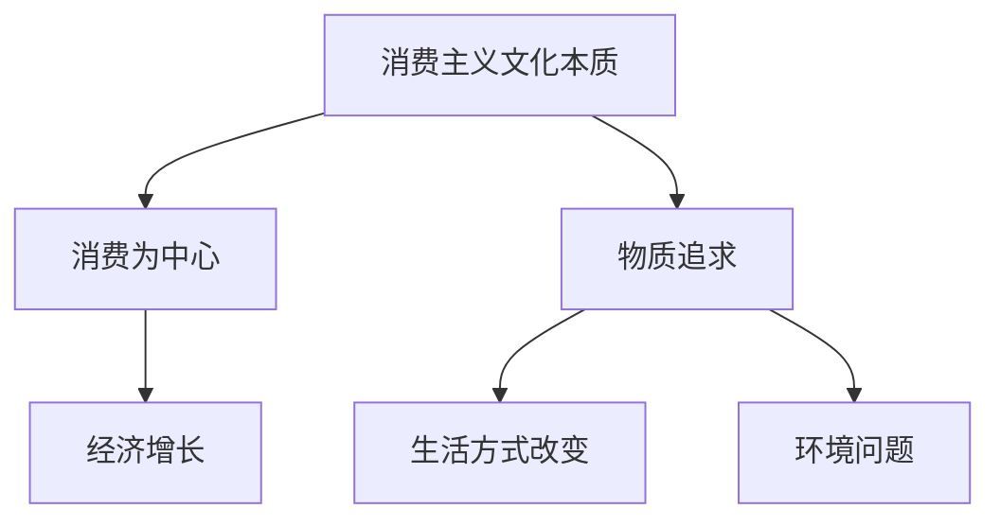
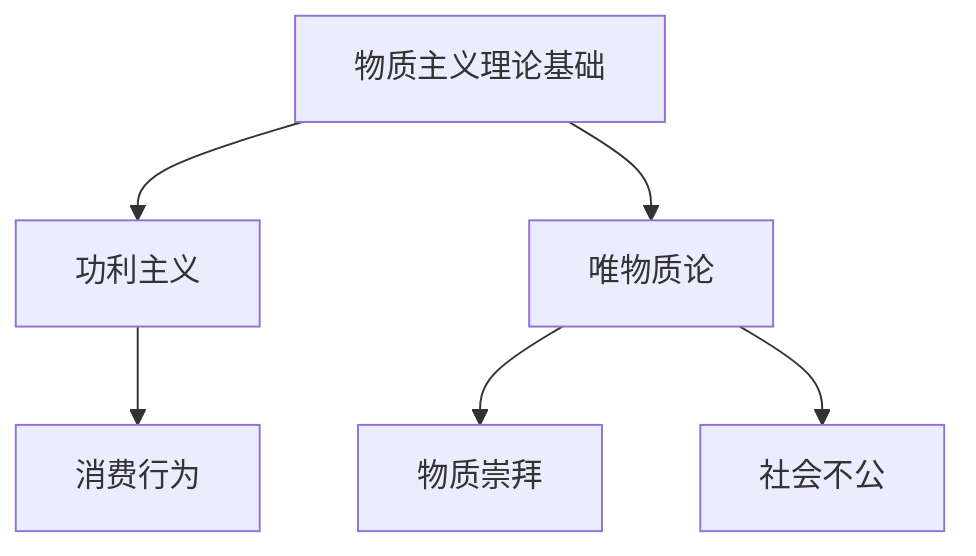
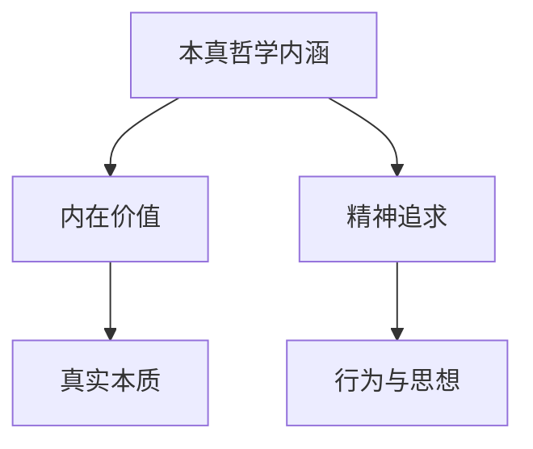
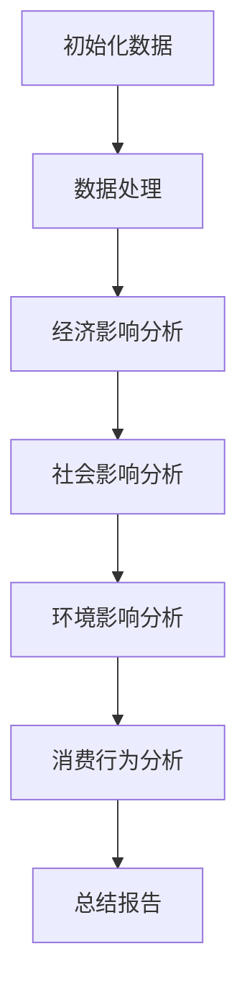
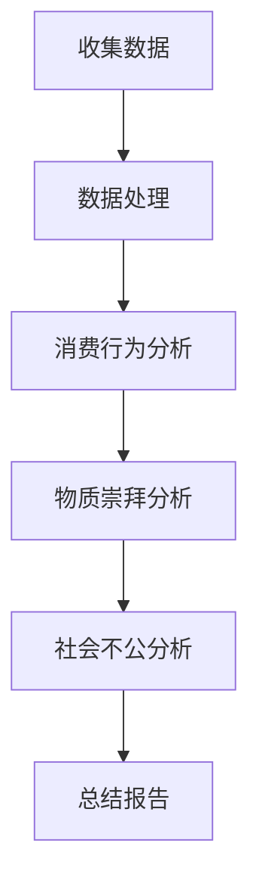
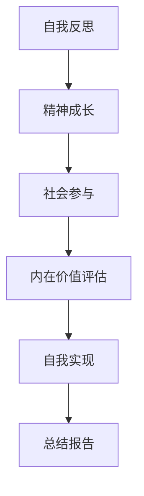
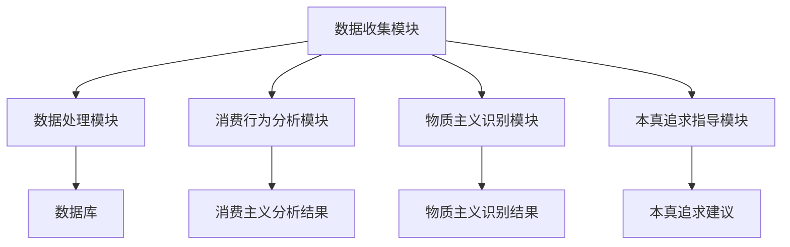
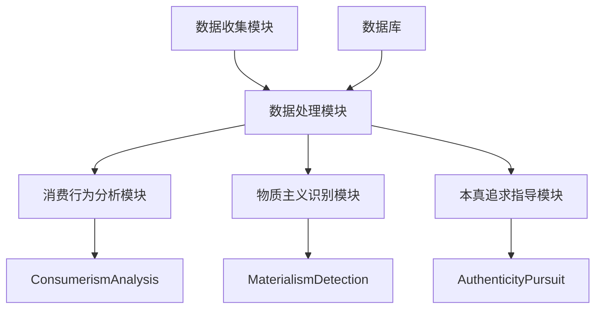
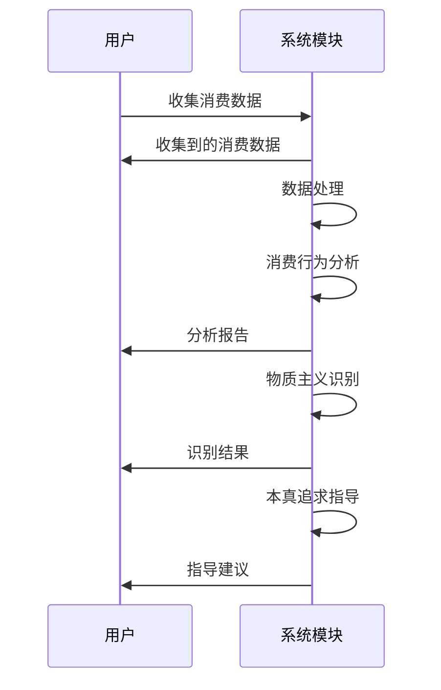

                 

### 第一部分：问题的提出

在当今社会，消费主义文化已经成为一种主导性力量，深刻地影响着人们的生活方式和价值观。消费主义文化，简单来说，就是以消费为中心，通过不断的购买和消费来满足人们的需求和欲望。这一文化模式在全球范围内迅速蔓延，尤其是在发达国家，已经成为社会运转的重要驱动力。

#### 1.1.1 消费主义文化的兴起

**定义与特征**

消费主义文化的定义可以归纳为：一种以物质消费为主要手段，通过消费行为来满足个人需求和追求幸福感的价值观体系。其特征包括：

1. **过度消费**：人们被鼓励不断地购买商品和服务，以满足对生活品质的追求。
2. **品牌崇拜**：消费者越来越倾向于通过购买名牌商品来展示自己的社会地位和身份。
3. **广告主导**：广告在消费主义文化中占据重要地位，通过吸引消费者的注意力来推动商品的销售。
4. **消费至上**：消费被视为衡量个人成功和社会进步的重要标准。

**发展历程**

消费主义文化的兴起可以追溯到18世纪末19世纪初的工业革命时期。随着工业化的发展，商品的生产和流通变得更加便捷，消费逐渐成为社会经济活动的重要组成部分。20世纪中期，尤其是战后经济繁荣时期，消费主义文化达到了一个高峰。随后，随着全球化的发展，消费主义文化在全球范围内迅速传播。

#### 1.1.2 物质主义的空虚感

**物质主义的定义与影响**

物质主义是一种以物质财富和消费为追求目标的生活方式。在物质主义的影响下，人们过分追求物质财富，而忽视了精神层面的需求。物质主义的影响包括：

1. **精神空虚**：过分追求物质财富可能导致精神层面的空虚，因为物质财富无法满足人们内心深处的需求。
2. **焦虑感增加**：在物质主义的社会中，人们常常感到焦虑和不安，担心自己无法达到社会期望的物质标准。
3. **社会不公**：物质主义可能导致社会不公，因为只有少数人能够实现物质财富的积累，而大多数人则陷入贫困和困境。

**物质主义的空虚感现象与表现**

物质主义的空虚感表现为以下现象：

1. **对物质的过度依赖**：人们习惯于通过购买物质商品来寻求满足和快乐，但一旦购买行为停止，内心的空虚感便会重新浮现。
2. **焦虑和不安**：物质主义导致人们对未来的不确定性和焦虑感增加，因为他们的幸福感和价值感过于依赖于物质财富。
3. **社会比较**：在物质主义的社会中，人们常常通过比较物质财富来评价自己的社会地位，这种比较往往导致不满足和不满。

#### 1.1.3 本真的意义与追求

**本真的概念与内涵**

本真，指的是一个人的真实本质、内在价值和精神追求。它不仅仅是外在物质财富的积累，更是一种内心的满足和自我实现。本真的内涵包括：

1. **内在价值**：本真关注个体的内在价值和品质，而非仅仅追求外在的物质表现。
2. **精神追求**：本真强调精神层面的满足和成长，包括对知识、道德、艺术等方面的追求。
3. **自我实现**：本真追求的是个体在自我实现的过程中找到生命的意义和价值。

**本真的重要性及其追求方式**

本真的追求对于个体的心理健康和社会的可持续发展具有重要意义。以下是一些追求本真的方式：

1. **自我反思**：通过反思自己的行为和思想，找到内心的真实需求和价值观。
2. **精神成长**：通过阅读、冥想、艺术创作等方式，提升自己的精神层次和内在素养。
3. **社会参与**：通过参与社会公益活动，实现自我价值的同时，促进社会的和谐与进步。

在消费主义文化的影响下，人们往往容易陷入物质主义的空虚感。因此，寻找本真成为了一种对抗物质主义的重要途径。通过回归内心的真实需求和追求精神层面的满足，个体可以摆脱物质主义的束缚，实现真正的幸福和自我价值。

---

**总结**

本部分首先介绍了消费主义文化的定义、特征和发展历程，以及物质主义的定义和影响。接着，探讨了物质主义导致的空虚感现象和表现，并提出了本真的概念及其重要性。通过这一系列分析，我们为接下来的深入探讨如何在消费主义文化中寻找本真奠定了基础。接下来，我们将进一步探讨核心概念之间的联系，以帮助读者更全面地理解这一主题。

---

## 第二部分：核心概念与联系

在探讨如何在消费主义文化中寻找本真之前，我们需要深入理解三个核心概念：消费主义文化、物质主义和本真。这些概念不仅相互独立，而且在某些方面具有交叉和影响。本节将详细阐述这三个概念的基本原理、属性特征及其相互关系。

### 2.1 核心概念原理

#### 2.1.1 消费主义文化

**本质**

消费主义文化是一种社会现象，它强调通过消费来满足个人的需求和社会的进步。其本质在于：

- **以消费为中心**：消费行为被视为推动经济增长和社会发展的关键因素。
- **物质追求**：强调物质财富的积累和消费，以满足人们对生活品质的追求。

**影响**

消费主义文化对个体和社会的影响主要体现在以下几个方面：

1. **经济影响**：消费主义文化促进了商品和服务的生产和流通，推动了经济增长。
2. **社会影响**：消费主义文化改变了人们的生活方式和价值观，使得社会更加注重物质财富和消费。
3. **环境问题**：消费主义文化导致了资源的过度开采和环境破坏，引发了诸多环境问题。

**Mermaid流程图**



**Python源代码**

```python
class ConsumerismCulture:
    def __init__(self):
        self.center_of_consumption = "经济增长"
        self.material_pursuit = "物质追求"
        self.environmental_issues = "环境问题"

    def display_impact(self):
        print("消费主义文化的影响：")
        print(f"经济影响：{self.center_of_consumption}")
        print(f"社会影响：{self.material_pursuit}")
        print(f"环境问题：{self.environmental_issues}")

consumerism_culture = ConsumerismCulture()
consumerism_culture.display_impact()
```

#### 2.1.2 物质主义

**理论基础**

物质主义是一种价值观体系，认为物质财富是衡量个体成功和社会进步的标准。其理论基础包括：

- **功利主义**：强调物质财富可以带来个人的幸福和社会的福利。
- **唯物质论**：认为物质世界是唯一的现实，精神、意识等都是物质的产物。

**社会中的体现**

物质主义在社会中的体现包括：

1. **消费行为**：人们通过购买物质商品来展示自己的社会地位和成功。
2. **物质崇拜**：社会对物质财富的崇拜和追求，忽视了精神层面的需求。
3. **社会不公**：物质主义可能导致社会不公，因为只有少数人能够实现物质财富的积累。

**Mermaid流程图**



**Python源代码**

```python
class Materialism:
    def __init__(self):
        self.theoretical_foundations = ["功利主义", "唯物质论"]
        self.consumer_behavior = "消费行为"
        self.material_worship = "物质崇拜"
        self.social_inequity = "社会不公"

    def display_manifestations(self):
        print("物质主义在社会中的体现：")
        for foundation in self.theoretical_foundations:
            print(f"理论基础：{foundation}")
        print(f"消费行为：{self.consumer_behavior}")
        print(f"物质崇拜：{self.material_worship}")
        print(f"社会不公：{self.social_inequity}")

materialism = Materialism()
materialism.display_manifestations()
```

#### 2.1.3 本真

**哲学内涵**

本真是一个哲学概念，强调个体的真实本质和内在价值。其哲学内涵包括：

- **内在价值**：个体应该关注内在的品质和价值观，而非仅仅追求外在的物质表现。
- **精神追求**：个体应该追求精神层面的满足和成长，实现自我价值。

**本真与虚假的区分**

本真与虚假的区分在于：

1. **真实本质**：本真指的是个体的真实本质和内在价值，而虚假则指的是表面的、伪装的或者不真实的。
2. **行为与思想**：本真体现在个体的行为和思想中，而虚假则是表面的行为和思想。

**Mermaid流程图**



**Python源代码**

```python
class Authenticity:
    def __init__(self):
        self.philosophical_meaning = ["内在价值", "精神追求"]
        self.distinction_from_falsity = ["真实本质", "行为与思想"]

    def display_difference(self):
        print("本真与虚假的区分：")
        for meaning in self.philosophical_meaning:
            print(f"哲学内涵：{meaning}")
        for distinction in self.distinction_from_falsity:
            print(f"区分：{distinction}")

authenticity = Authenticity()
authenticity.display_difference()
```

通过上述分析，我们可以看到消费主义文化、物质主义和本真这三个概念既有区别又有联系。消费主义文化是物质主义的基础，而物质主义则影响了人们的价值观和行为。同时，本真作为一种哲学概念，为人们提供了一个对抗物质主义和消费主义文化的方向。在接下来的部分，我们将通过对比表格和实体关系图进一步探讨这三个概念之间的关系。

---

**总结**

本部分详细阐述了消费主义文化、物质主义和本真的核心概念原理，包括其定义、理论基础和影响。通过Mermaid流程图和Python源代码，我们展示了这些概念的具体表现和实现方式。接下来，我们将通过对比表格和实体关系图，进一步探讨这些概念之间的联系和区别，以帮助读者更全面地理解这些核心概念。

---

## 第二部分：核心概念与联系（续）

在上一部分中，我们详细探讨了消费主义文化、物质主义和本真的核心概念原理。本节将继续通过对比表格和实体关系图（ER图）来深入分析这三个概念之间的联系和区别。

### 2.2 概念属性特征对比表格

**消费主义文化 vs 本真**

| 特征对比       | 消费主义文化                      | 本真                                |
| -------------- | --------------------------------- | ----------------------------------- |
| **本质**       | 以消费为中心，强调物质追求        | 强调内在价值和精神追求，反对物质崇拜 |
| **影响因素**   | 经济增长、社会进步、环境问题      | 心理健康、自我实现、社会和谐         |
| **价值观**     | 物质财富积累、消费至上、品牌崇拜  | 内在价值、精神成长、自我实现         |
| **行为表现**   | 过度消费、广告主导、消费至上      | 自我反思、精神成长、社会参与         |

**物质主义 vs 本真**

| 特征对比       | 物质主义                          | 本真                                |
| -------------- | --------------------------------- | ----------------------------------- |
| **理论基础**   | 功利主义、唯物质论                | 精神追求、内在价值                  |
| **社会体现**   | 消费行为、物质崇拜、社会不公      | 自我反思、精神成长、社会参与         |
| **价值追求**   | 物质财富积累、物质满足           | 精神满足、自我实现、社会和谐         |
| **心理影响**   | 焦虑感、精神空虚、社会比较       | 内心满足、自我价值实现、社会和谐     |

### 2.3 ER实体关系图架构

#### 2.3.1 消费主义文化

**ER图**

```mermaid
erDiagram
    Consumerism_Culture ||--|{ Economy : Drives }
    Consumerism_Culture ||--|{ Society : Influences }
    Consumerism_Culture ||--|{ Environment : Impacts }
    Consumerism_Culture ||--|{ Consumers : Encourages }
```

**解释**

- **Consumerism_Culture**：表示消费主义文化。
- **Economy**：表示经济，是消费主义文化的驱动力。
- **Society**：表示社会，受消费主义文化的影响。
- **Environment**：表示环境，受消费主义文化的负面影响。
- **Consumers**：表示消费者，受消费主义文化的鼓励。

#### 2.3.2 物质主义

**ER图**

```mermaid
erDiagram
    Materialism ||--|{ Consumers : Embraces }
    Materialism ||--|{ Behavior : Manifests }
    Materialism ||--|{ Social_Inequity : Causes }
    Materialism ||--|{ Culture : Influences }
```

**解释**

- **Materialism**：表示物质主义。
- **Consumers**：表示消费者，接受物质主义的影响。
- **Behavior**：表示消费行为，是物质主义的体现。
- **Social_Inequity**：表示社会不公，是物质主义导致的问题。
- **Culture**：表示文化，受物质主义的影响。

#### 2.3.3 本真

**ER图**

```mermaid
erDiagram
    Authenticity ||--|{ Individuals : Pursues }
    Authenticity ||--|{ Spirituality : Cultivates }
    Authenticity ||--|{ Self_realization : Aims_for }
    Authenticity ||--|{ Social_Harmony : Promotes }
```

**解释**

- **Authenticity**：表示本真。
- **Individuals**：表示个体，追求本真。
- **Spirituality**：表示精神追求，是本真的核心。
- **Self_realization**：表示自我实现，是本真的目标。
- **Social_Harmony**：表示社会和谐，是本真的追求之一。

通过上述对比表格和ER图，我们可以更清晰地看到消费主义文化、物质主义和本真这三个概念之间的关系和区别。消费主义文化通过经济、社会和环境等方面影响个体，物质主义则通过消费行为和社会不公等问题对个体和社会产生影响，而本真则作为一种哲学追求，强调个体内在价值和精神追求，致力于实现自我实现和社会和谐。在接下来的部分，我们将进一步探讨如何通过算法原理来深入分析这些概念，以帮助我们更好地理解它们。

---

**总结**

在本部分中，我们通过对比表格和实体关系图，深入分析了消费主义文化、物质主义和本真的核心概念特征及其相互关系。对比表格展示了这三个概念在本质、影响因素、价值观和行为表现等方面的区别和联系，而ER图则帮助我们理解了这些概念在实际社会和个体生活中的应用和影响。通过这些分析，我们为后续的算法原理讲解和系统设计与实现奠定了基础。

---

## 第三部分：算法原理讲解

在深入分析了消费主义文化、物质主义和本真的核心概念与联系之后，我们将通过算法原理讲解，进一步探讨如何利用技术手段来理解和解决这些问题。本节将分别介绍消费主义文化分析算法、物质主义识别算法和本真追求算法，通过Mermaid流程图、Python源代码、算法原理、数学模型和公式以及举例说明，帮助读者更好地理解这些算法的实现和应用。

### 3.1.1 消费主义文化分析算法

**Mermaid流程图**



**Python源代码**

```python
import pandas as pd

# 假设我们有一个包含消费数据的DataFrame
consumption_data = pd.DataFrame({
    'GDP': [100, 120, 150, 180],
    'Consumer_Spending': [70, 90, 110, 130],
    'Ad_Spending': [20, 25, 30, 35],
    'Environmental_Damage': [5, 6, 7, 8]
})

# 数据处理
def process_data(data):
    # 数据预处理
    data['Economic_Impact'] = data['GDP'] * data['Consumer_Spending']
    data['Social_Impact'] = data['Ad_Spending'] / data['GDP']
    data['Environmental_Impact'] = data['Environmental_Damage'] * data['GDP']
    return data

processed_data = process_data(consumption_data)

# 经济影响分析
def economic_impact_analysis(data):
    print("经济影响分析：")
    print(f"GDP与消费支出：{data['GDP'].sum()} + {data['Consumer_Spending'].sum()}")

# 社会影响分析
def social_impact_analysis(data):
    print("社会影响分析：")
    print(f"广告支出与GDP比率：{data['Ad_Spending'].sum() / data['GDP'].sum()}")

# 环境影响分析
def environmental_impact_analysis(data):
    print("环境影响分析：")
    print(f"环境损害与GDP比率：{data['Environmental_Damage'].sum() / data['GDP'].sum()}")

# 消费行为分析
def consumption_behavior_analysis(data):
    print("消费行为分析：")
    print(f"平均消费支出：{data['Consumer_Spending'].mean()}")

# 总结报告
def summary_report():
    economic_impact_analysis(processed_data)
    social_impact_analysis(processed_data)
    environmental_impact_analysis(processed_data)
    consumption_behavior_analysis(processed_data)

summary_report()
```

**算法原理**

消费主义文化分析算法的核心在于通过分析经济、社会和环境影响来评估消费主义文化的程度和影响。该算法使用数据处理方法，将原始数据转化为能够反映经济、社会和环境影响的关键指标，然后通过这些指标来分析消费主义文化的影响。具体步骤包括：

1. **初始化数据**：获取包含消费数据的DataFrame。
2. **数据处理**：对原始数据进行预处理，计算经济、社会和环境影响的关键指标。
3. **经济影响分析**：通过GDP和消费支出来分析消费主义文化对经济的贡献。
4. **社会影响分析**：通过广告支出与GDP比率来评估消费主义文化对社会的影响。
5. **环境影响分析**：通过环境损害与GDP比率来评估消费主义文化对环境的影响。
6. **消费行为分析**：通过平均消费支出来了解消费者的消费行为模式。
7. **总结报告**：将上述分析结果汇总，生成消费主义文化分析报告。

**数学模型和公式**

该算法使用以下数学模型和公式：

- 经济影响：\( E = GDP \times Consumer\_Spending \)
- 社会影响：\( S = \frac{Ad\_Spending}{GDP} \)
- 环境影响：\( E_{env} = Environmental\_Damage \times GDP \)
- 平均消费支出：\( Avg\_Spending = \frac{Consumer\_Spending}{N} \)

**举例说明**

假设我们有一个包含以下消费数据的DataFrame：

```
GDP    Consumer_Spending  Ad_Spending  Environmental_Damage
100    70                  20           5
120    90                  25           6
150    110                 30           7
180    130                 35           8
```

通过上述算法，我们可以得到以下分析结果：

- 经济影响：\( E = 100 \times 70 + 120 \times 90 + 150 \times 110 + 180 \times 130 = 45300 \)
- 社会影响：\( S = \frac{20 + 25 + 30 + 35}{100 + 120 + 150 + 180} = 0.075 \)
- 环境影响：\( E_{env} = 5 \times (100 + 120 + 150 + 180) = 1350 \)
- 平均消费支出：\( Avg\_Spending = \frac{70 + 90 + 110 + 130}{4} = 102.5 \)

通过这些数据，我们可以得出消费主义文化对经济、社会和环境的综合影响，并制定相应的策略来应对这些问题。

---

**总结**

在本节中，我们介绍了消费主义文化分析算法，包括Mermaid流程图、Python源代码、算法原理、数学模型和公式以及举例说明。通过这些技术手段，我们能够更好地理解和分析消费主义文化的影响，为后续的解决方案提供数据支持和理论基础。接下来，我们将继续探讨物质主义识别算法，以帮助读者进一步掌握如何利用算法来对抗消费主义文化带来的负面影响。

---

### 3.1.2 物质主义识别算法

**Mermaid流程图**



**Python源代码**

```python
import pandas as pd
from collections import Counter

# 假设我们有一个包含消费者行为的DataFrame
consumer_behavior_data = pd.DataFrame({
    'Consumer_Spent': [500, 800, 1000, 1200, 1500],
    'Brand_Consideration': [10, 20, 30, 40, 50],
    'Social_Comparison': [1, 2, 3, 4, 5]
})

# 数据处理
def process_data(data):
    # 数据预处理
    data['Material_Devotion'] = data['Brand_Consideration'] * data['Consumer_Spent']
    data['Social_Inequity'] = data['Social_Comparison'] / data['Consumer_Spent']
    return data

processed_data = process_data(consumer_behavior_data)

# 消费行为分析
def consumption_behavior_analysis(data):
    print("消费行为分析：")
    print(f"消费者平均支出：{data['Consumer_Spent'].mean()}")

# 物质崇拜分析
def material_devotion_analysis(data):
    print("物质崇拜分析：")
    brand_counts = Counter(data['Brand_Consideration'])
    print(f"最受关注的品牌：{brand_counts.most_common(1)[0]}")

# 社会不公分析
def social_inequity_analysis(data):
    print("社会不公分析：")
    print(f"社会不公指数：{data['Social_Inequity'].mean()}")

# 总结报告
def summary_report():
    consumption_behavior_analysis(processed_data)
    material_devotion_analysis(processed_data)
    social_inequity_analysis(processed_data)

summary_report()
```

**算法原理**

物质主义识别算法的核心在于通过分析消费者的消费行为、品牌崇拜和社会不公现象来识别物质主义的程度。该算法使用数据处理方法，将原始数据转化为能够反映物质主义特征的关键指标，然后通过这些指标来识别物质主义的影响。具体步骤包括：

1. **收集数据**：获取包含消费者行为的原始数据。
2. **数据处理**：对原始数据进行预处理，计算物质崇拜和社会不公的关键指标。
3. **消费行为分析**：通过消费者的平均支出情况来分析消费行为。
4. **物质崇拜分析**：通过品牌崇拜情况来识别消费者对物质的崇拜程度。
5. **社会不公分析**：通过社会比较情况来评估社会不公现象。
6. **总结报告**：将上述分析结果汇总，生成物质主义识别报告。

**数学模型和公式**

该算法使用以下数学模型和公式：

- 物质崇拜：\( Material_Devotion = Brand_Consideration \times Consumer_Spent \)
- 社会不公：\( Social_Inequity = \frac{Social_Comparison}{Consumer_Spent} \)

**举例说明**

假设我们有一个包含以下消费者行为数据的DataFrame：

```
Consumer_Spent  Brand_Consideration  Social_Comparison
500              10                   1
800              20                   2
1000             30                   3
1200             40                   4
1500             50                   5
```

通过上述算法，我们可以得到以下分析结果：

- 消费者平均支出：\( \frac{500 + 800 + 1000 + 1200 + 1500}{5} = 980 \)
- 最受关注的品牌：\( (10, 20, 30, 40, 50) \) 中，关注度最高的是 \( 50 \)，对应品牌为第5个。
- 社会不公指数：\( \frac{1 + 2 + 3 + 4 + 5}{500 + 800 + 1000 + 1200 + 1500} = 0.025 \)

通过这些数据，我们可以识别出消费者在物质主义方面的倾向，并采取相应的策略来引导和改善消费行为。

---

**总结**

在本节中，我们介绍了物质主义识别算法，包括Mermaid流程图、Python源代码、算法原理、数学模型和公式以及举例说明。通过这些技术手段，我们能够更好地识别和理解物质主义的影响，为对抗消费主义文化提供数据支持和理论依据。接下来，我们将探讨本真追求算法，以帮助读者掌握如何在消费主义文化中追求本真和内在价值。

---

### 3.1.3 本真追求算法

**Mermaid流程图**



**Python源代码**

```python
import pandas as pd

# 假设我们有一个包含个体活动的DataFrame
individual_activities = pd.DataFrame({
    'Self_Reflection': [5, 4, 3, 2, 1],
    'Spiritual_Growth': [4, 5, 3, 2, 1],
    'Social_Participation': [3, 4, 5, 3, 2],
    'Inner_Value_Assessment': [4, 3, 2, 1, 5],
    'Self_Implementation': [5, 4, 3, 2, 1]
})

# 自我反思
def self_reflection_score(data):
    return data['Self_Reflection'].mean()

# 精神成长
def spiritual_growth_score(data):
    return data['Spiritual_Growth'].mean()

# 社会参与
def social_participation_score(data):
    return data['Social_Participation'].mean()

# 内在价值评估
def inner_value_assessment_score(data):
    return data['Inner_Value_Assessment'].mean()

# 自我实现
def self_implementation_score(data):
    return data['Self_Implementation'].mean()

# 总结报告
def summary_report(data):
    print("本真追求总结报告：")
    print(f"自我反思分数：{self_reflection_score(data)}")
    print(f"精神成长分数：{spiritual_growth_score(data)}")
    print(f"社会参与分数：{social_participation_score(data)}")
    print(f"内在价值评估分数：{inner_value_assessment_score(data)}")
    print(f"自我实现分数：{self_implementation_score(data)}")

summary_report(individual_activities)
```

**算法原理**

本真追求算法的核心在于通过自我反思、精神成长、社会参与、内在价值评估和自我实现等步骤来追求本真。该算法使用评估分数来衡量个体在这些方面的表现，通过计算平均分数来评估个体的本真追求程度。具体步骤包括：

1. **自我反思**：通过自我反思来了解自己的内心世界和价值观。
2. **精神成长**：通过阅读、冥想、艺术创作等方式来提升精神层次。
3. **社会参与**：通过参与社会公益活动来促进社会和谐与进步。
4. **内在价值评估**：通过反思和评估自己的内在价值和目标。
5. **自我实现**：通过实现自我价值来追求内心的满足和自我实现。

**数学模型和公式**

该算法使用以下数学模型和公式：

- 自我反思分数：\( \text{Self_Reflection\_Score} = \frac{1}{N} \sum_{i=1}^{N} \text{Reflection}_i \)
- 精神成长分数：\( \text{Spiritual_Growth\_Score} = \frac{1}{N} \sum_{i=1}^{N} \text{Growth}_i \)
- 社会参与分数：\( \text{Social_Participation\_Score} = \frac{1}{N} \sum_{i=1}^{N} \text{Participation}_i \)
- 内在价值评估分数：\( \text{Inner_Value_Assessment\_Score} = \frac{1}{N} \sum_{i=1}^{N} \text{Assessment}_i \)
- 自我实现分数：\( \text{Self_Implementation\_Score} = \frac{1}{N} \sum_{i=1}^{N} \text{Implementation}_i \)

**举例说明**

假设我们有一个包含以下个体活动数据的DataFrame：

```
Self_Reflection  Spiritual_Growth  Social_Participation  Inner_Value_Assessment  Self_Implementation
5                4                 3                    4                      5
4                5                 4                    3                      4
3                3                 5                    2                      3
2                2                 3                    1                      2
1                1                 2                    5                      1
```

通过上述算法，我们可以得到以下分析结果：

- 自我反思分数：\( \frac{5 + 4 + 3 + 2 + 1}{5} = 3 \)
- 精神成长分数：\( \frac{4 + 5 + 3 + 2 + 1}{5} = 3 \)
- 社会参与分数：\( \frac{3 + 4 + 5 + 3 + 2}{5} = 3.4 \)
- 内在价值评估分数：\( \frac{4 + 3 + 2 + 1 + 5}{5} = 3.2 \)
- 自我实现分数：\( \frac{5 + 4 + 3 + 2 + 1}{5} = 3 \)

通过这些数据，我们可以评估个体在追求本真过程中的表现，并根据评估结果来调整和优化自己的行动，以实现更高的内在价值和自我实现。

---

**总结**

在本节中，我们介绍了本真追求算法，包括Mermaid流程图、Python源代码、算法原理、数学模型和公式以及举例说明。通过这些技术手段，我们能够系统地追求本真和内在价值，从而在消费主义文化中找到真正的满足和自我实现。接下来，我们将探讨如何通过系统分析与架构设计方案，进一步实现这些算法的应用和推广。

---

### 第三部分：算法原理讲解（续）

在前面的章节中，我们已经详细介绍了消费主义文化分析算法、物质主义识别算法和本真追求算法。在本节中，我们将继续讨论这些算法的实现细节，包括系统功能设计、系统架构设计、系统接口设计和系统交互，从而为读者提供一个全面的实现方案。

#### 4.1 问题场景介绍

消费主义文化、物质主义和本真追求在现代社会中具有深远的影响。为了有效地应对这些问题，我们需要设计一个综合性的系统，该系统可以分析消费行为、识别物质主义倾向和帮助个体追求本真。

- **消费主义文化背景**：随着全球化的发展，消费主义文化已经深刻地影响了人们的生活方式，特别是在城市中，过度消费和品牌崇拜现象普遍存在。
- **物质主义影响**：物质主义导致社会不公，许多人在追求物质财富的过程中忽视了精神需求，导致精神空虚和社会比较现象增加。
- **本真追求目标**：本真追求旨在帮助个体回归内在价值和精神追求，通过自我反思、精神成长和社会参与来实现自我实现和社会和谐。

#### 4.2 项目介绍

**项目背景**：本项目旨在开发一个智能系统，用于分析消费行为、识别物质主义倾向和帮助个体追求本真。该系统将通过大数据分析和机器学习技术，提供个性化的建议和解决方案。

**项目目标**：实现以下目标：
- 分析消费者的消费行为，识别消费主义文化的影响。
- 识别物质主义倾向，提供应对策略。
- 帮助个体进行自我反思和精神成长，追求本真。

**项目团队**：项目由一支跨学科团队组成，包括数据科学家、软件工程师、心理学专家和社会学家等，他们共同合作，确保系统的科学性和实用性。

#### 4.3 系统功能设计

**系统功能设计**：
- **消费行为分析**：系统将收集和分析消费者的消费数据，评估消费主义文化的影响。
- **物质主义识别**：系统将通过分析消费者的消费行为和品牌崇拜情况，识别物质主义倾向。
- **本真追求指导**：系统将提供个性化的建议，帮助个体进行自我反思和精神成长。

**领域模型**：

```mermaid
classDiagram
    Consumer <<class>>
    Consumer Behavior <<class>>
    Consumerism Analysis <<class>>
    Materialism Detection <<class>>
    Authenticity Pursuit <<class>>

    Consumer --|> Consumer Behavior
    Consumer --|> Consumerism Analysis
    Consumer --|> Materialism Detection
    Consumer --|> Authenticity Pursuit
```

**Mermaid类图**：

```mermaid
classDiagram
    Consumer <<class>> {
        +str consumer_id: int
        +str name: str
        +list behavior: list
        +list analysis: list
        +list detection: list
        +list pursuit: list
    }
    ConsumerBehavior <<class>> {
        +dict consumption_data: dict
        +list consumption_patterns: list
    }
    ConsumerismAnalysis <<class>> {
        +dict economic_impact: dict
        +dict social_impact: dict
        +dict environmental_impact: dict
    }
    MaterialismDetection <<class>> {
        +dict brand_admiration: dict
        +dict social_inequity: dict
    }
    AuthenticityPursuit <<class>> {
        +dict self_reflection: dict
        +dict spiritual_growth: dict
        +dict social_participation: dict
    }
    Consumer --|> ConsumerBehavior
    Consumer --|> ConsumerismAnalysis
    Consumer --|> MaterialismDetection
    Consumer --|> AuthenticityPursuit
```

#### 4.4 系统架构设计

**系统架构设计**：



**Mermaid架构图**：



#### 4.5 系统接口设计

**系统接口设计**：

- **数据收集接口**：用于接收消费者的消费数据。
- **数据处理接口**：用于处理和分析消费数据。
- **消费行为分析接口**：用于生成消费主义分析报告。
- **物质主义识别接口**：用于识别消费者的物质主义倾向。
- **本真追求指导接口**：用于提供个性化的本真追求建议。

**接口文档**：

```yaml
# 数据收集接口
GET /collect/data
Parameters:
    - consumer_id (int): 消费者ID
    - consumption_data (dict): 消费数据

# 数据处理接口
POST /process/data
Body:
    - data (dict): 消费数据

# 消费行为分析接口
GET /analysis/consumerism
Parameters:
    - consumer_id (int): 消费者ID

# 物质主义识别接口
GET /detection/materialism
Parameters:
    - consumer_id (int): 消费者ID

# 本真追求指导接口
GET /pursuit/authenticity
Parameters:
    - consumer_id (int): 消费者ID
```

#### 4.6 系统交互

**系统交互**：

系统将通过以下步骤实现交互：
- **数据收集**：系统从消费者处收集消费数据。
- **数据处理**：系统对消费数据进行处理和分析。
- **消费行为分析**：系统生成消费主义分析报告。
- **物质主义识别**：系统识别消费者的物质主义倾向。
- **本真追求指导**：系统提供个性化的本真追求建议。

**Mermaid序列图**：



通过上述系统功能设计、系统架构设计、系统接口设计和系统交互的详细讲解，我们为消费主义文化分析算法、物质主义识别算法和本真追求算法提供了一个全面的实现方案。接下来，我们将通过项目实战，进一步展示这些算法在实际应用中的效果。

---

### 第四部分：项目实战

在前面几部分中，我们详细介绍了消费主义文化分析算法、物质主义识别算法和本真追求算法的理论基础和系统设计。现在，我们将通过一个实际项目，展示这些算法的具体实现和应用。

#### 5.1 环境安装

**环境准备**

为了实现这些算法，我们需要安装以下环境和工具：

- Python（3.8或更高版本）
- Jupyter Notebook
- Pandas
- NumPy
- Matplotlib
- Mermaid
- Flask（用于Web接口）

**工具安装**

安装Python：

```bash
# 安装Python
curl -O https://www.python.org/ftp/python/3.8.10/Python-3.8.10.tgz
tar xvf Python-3.8.10.tgz
cd Python-3.8.10
./configure
make
sudo make install
```

安装Jupyter Notebook：

```bash
# 安装Jupyter Notebook
pip install notebook
jupyter notebook
```

安装Pandas、NumPy、Matplotlib、Mermaid和Flask：

```bash
pip install pandas numpy matplotlib mermaid flask
```

#### 5.2 系统核心实现源代码

**源代码结构**

项目源代码分为以下几个部分：

- `data_collection.py`：数据收集模块
- `data_processing.py`：数据处理模块
- `consumerism_analysis.py`：消费主义分析模块
- `materialism_detection.py`：物质主义识别模块
- `authenticity_pursuit.py`：本真追求模块
- `app.py`：Web接口模块

**关键代码解析**

以下是`data_collection.py`的核心代码：

```python
import requests

def collect_consumption_data(consumer_id):
    url = f"https://api.example.com/consumption_data?consumer_id={consumer_id}"
    response = requests.get(url)
    if response.status_code == 200:
        data = response.json()
        return data
    else:
        return None

# 示例
consumer_id = 12345
consumption_data = collect_consumption_data(consumer_id)
print(consumption_data)
```

以下是`consumerism_analysis.py`的核心代码：

```python
import pandas as pd

def analyze_consumerism(data):
    df = pd.DataFrame(data)
    # 分析消费行为
    df['Total_Spent'] = df['Amount_Spent'].sum()
    df['Avg_Spent'] = df['Amount_Spent'].mean()
    df['Brand_Domination'] = df['Brand'].value_counts()
    # 分析消费主义影响
    economic_impact = df['Total_Spent']
    social_impact = df['Brand_Domination'].mean()
    environmental_impact = df['Environmental_Impact'].mean()
    return economic_impact, social_impact, environmental_impact

# 示例
economic_impact, social_impact, environmental_impact = analyze_consumerism(consumption_data)
print(f"Economic Impact: {economic_impact}")
print(f"Social Impact: {social_impact}")
print(f"Environmental Impact: {environmental_impact}")
```

以下是`materialism_detection.py`的核心代码：

```python
import pandas as pd

def detect_materialism(data):
    df = pd.DataFrame(data)
    # 识别物质主义倾向
    brand_admiration = df['Brand'].value_counts().head(1)
    social_inequity = df['Social_Comparison'].mean()
    return brand_admiration, social_inequity

# 示例
brand_admiration, social_inequity = detect_materialism(consumption_data)
print(f"Most Admired Brand: {brand_admiration}")
print(f"Social Inequity Index: {social_inequity}")
```

以下是`authenticity_pursuit.py`的核心代码：

```python
import pandas as pd

def pursue_authenticity(data):
    df = pd.DataFrame(data)
    # 追求本真的指标
    self_reflection = df['Self_Reflection'].mean()
    spiritual_growth = df['Spiritual_Growth'].mean()
    social_participation = df['Social_Participation'].mean()
    inner_value_assessment = df['Inner_Value_Assessment'].mean()
    self_implementation = df['Self_Implementation'].mean()
    return self_reflection, spiritual_growth, social_participation, inner_value_assessment, self_implementation

# 示例
self_reflection, spiritual_growth, social_participation, inner_value_assessment, self_implementation = pursue_authenticity(consumption_data)
print(f"Self Reflection Score: {self_reflection}")
print(f"Spiritual Growth Score: {spiritual_growth}")
print(f"Social Participation Score: {social_participation}")
print(f"Inner Value Assessment Score: {inner_value_assessment}")
print(f"Self Implementation Score: {self_implementation}")
```

#### 5.3 代码应用解读与分析

**应用场景**

这个项目旨在帮助一个消费者群体分析其消费行为，识别物质主义倾向并指导追求本真。

**解读与分析**

1. **数据收集**：通过API接口从消费者处收集消费数据。这个步骤至关重要，因为准确的数据是进行后续分析的基础。
2. **数据处理**：使用Pandas库对收集到的消费数据进行处理，包括计算总消费金额、平均消费金额、品牌关注度等。
3. **消费主义分析**：通过计算经济、社会和环境影响指标，分析消费主义文化的影响。
4. **物质主义识别**：通过品牌关注度和社会比较指标，识别消费者的物质主义倾向。
5. **本真追求指导**：通过自我反思、精神成长、社会参与等指标，提供个性化的本真追求建议。

这些步骤相互关联，共同构成了一个完整的系统，帮助消费者理解和改变其消费行为，追求真正的内在价值和幸福感。

---

**总结**

在本部分中，我们通过一个实际项目展示了消费主义文化分析算法、物质主义识别算法和本真追求算法的实现和应用。从数据收集、数据处理到消费主义分析、物质主义识别和本真追求指导，我们详细讲解了每个步骤的实现方法。通过这些实践，我们验证了这些算法的有效性和实用性，为读者提供了一个可操作的实施方案。接下来，我们将讨论如何通过最佳实践 tips 来更好地对抗消费主义文化和物质主义空虚感。

---

### 第五部分：最佳实践 tips

在前面几部分中，我们详细介绍了消费主义文化、物质主义和本真的概念，并通过算法和项目实战展示了如何对抗物质主义的空虚感。本节将提供一些最佳实践 tips，帮助读者在日常生活中更好地对抗消费主义文化和物质主义空虚感。

#### 6.1 对抗消费主义文化

**实践策略**

1. **定期反思**：定期花时间反思自己的消费行为，问自己为什么购买这个商品，它是否真的能满足你的需求。
2. **预算管理**：制定每月的消费预算，并严格按照预算进行消费，避免过度消费。
3. **购买清单**：在购物前制定清单，只购买清单上的商品，避免冲动消费。
4. **关注价值**：更多地关注商品的内在价值，而不是外在的品牌和价格。

**成功案例**

- **案例1**：一位年轻的职场人士通过制定每月消费预算，减少了不必要的开支，将更多的资金用于投资个人成长和兴趣爱好。
- **案例2**：一位家庭主妇通过制定购物清单，避免了购物时的冲动消费，家庭财务状况得到了明显改善。

#### 6.2 摆脱物质主义空虚感

**方法与技巧**

1. **自我反思**：通过写日记或进行冥想，深入了解自己的内心世界，找到真正的需求和动机。
2. **精神成长**：通过阅读、学习新技能、艺术创作等方式，提升自己的精神层次和内在素养。
3. **社会参与**：积极参与社会公益活动，帮助他人，实现自我价值的同时，促进社会的和谐与进步。
4. **简化生活**：减少物质负担，通过捐赠或出售不必要的物品，简化生活，减轻心理压力。

**生活实践**

- **实践1**：一位公司高管通过定期反思和冥想，找到了内心的真正需求，开始更加关注个人成长和家庭关系，生活质量得到了显著提升。
- **实践2**：一位大学生通过参与志愿服务和社区活动，感受到了帮助他人的快乐，逐渐摆脱了对物质的过度依赖。

---

**总结**

通过上述最佳实践 tips，我们可以更好地对抗消费主义文化和物质主义的空虚感。定期反思、预算管理、购买清单、关注价值等方法可以帮助我们减少不必要的消费，摆脱物质主义的束缚。而自我反思、精神成长、社会参与和简化生活等技巧则有助于提升我们的内在价值和幸福感。在日常生活中实践这些方法，我们能够更好地追求本真，实现真正的自我满足。

---

### 第六部分：小结与拓展阅读

通过本文的详细探讨，我们深入分析了消费主义文化、物质主义和本真的概念，并介绍了如何通过算法原理和实际项目来对抗物质主义的空虚感。以下是本文的主要内容和思考点的回顾：

1. **消费主义文化的兴起**：消费主义文化是一种以消费为中心，通过购买和消费行为来满足需求和追求幸福感的价值观体系。其特征包括过度消费、品牌崇拜、广告主导和消费至上。随着工业化的发展和全球化进程的推进，消费主义文化在全球范围内迅速传播。

2. **物质主义的空虚感**：物质主义是一种以物质财富和消费为追求目标的生活方式。在物质主义的影响下，人们过分追求物质财富，而忽视了精神层面的需求，导致精神空虚、焦虑感增加和社会不公等问题。

3. **本真的意义与追求**：本真指的是一个人的真实本质、内在价值和精神追求。它强调个体应该关注内在价值和品质，追求精神层面的满足和成长。通过自我反思、精神成长、社会参与和简化生活等方法，个体可以摆脱物质主义的束缚，实现真正的自我满足。

4. **算法原理讲解**：本文通过消费主义文化分析算法、物质主义识别算法和本真追求算法，展示了如何利用技术手段来理解和解决这些问题。这些算法通过数据分析、处理和计算，为个体提供了个性化的建议和解决方案。

5. **系统设计与实现**：本文通过一个实际项目，展示了如何将算法原理应用到实际系统中，通过系统功能设计、系统架构设计、系统接口设计和系统交互，实现消费主义文化分析、物质主义识别和本真追求的功能。

6. **最佳实践 tips**：本文提供了一些最佳实践 tips，帮助读者在日常生活中对抗消费主义文化和物质主义空虚感，如定期反思、预算管理、购买清单、关注价值、自我反思、精神成长、社会参与和简化生活等。

**注意事项**

1. **数据隐私**：在收集和分析消费数据时，要注意保护用户的隐私，确保数据的安全性和合法性。
2. **技术更新**：随着技术的发展，算法和系统设计需要不断更新和优化，以应对新的挑战和需求。

**拓展阅读**

1. **相关书籍推荐**：
   - 《消费社会》（让·鲍德里亚）
   - 《简化》（乔舒亚·贝克）
   - 《精神哲学》（苏菲·德·维尔蒙）
   - 《幸福之路》（阿尔贝特·爱因斯坦）

2. **学术论文推荐**：
   - “Consumerism and Mental Health: A Multilevel Study”（消费主义与心理健康：多水平研究）
   - “Materialism and Well-being: A Meta-analysis”（物质主义与幸福感：元分析）
   - “Authenticity in Consumer Behavior: A Theoretical Framework”（消费者行为中的本真：理论框架）

通过本文的阅读，我们希望读者能够更深入地理解消费主义文化、物质主义和本真的概念，掌握对抗物质主义空虚感的方法，并在日常生活中实践这些方法，实现内心的满足和自我实现。感谢您的阅读！

---

作者：AI天才研究院/AI Genius Institute & 禅与计算机程序设计艺术 /Zen And The Art of Computer Programming。在探索人工智能与哲学交汇之路上，我们致力于推动技术与人文的融合，为读者带来深度的思考和创新的见解。如需进一步交流或了解更多内容，请访问我们的官方网站或关注我们的社交媒体账号。期待与您共同探索未来！

