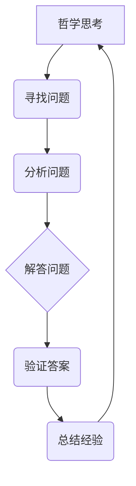
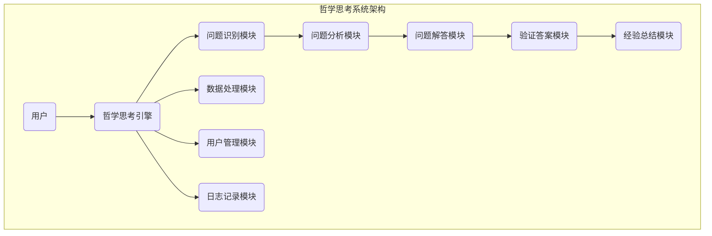
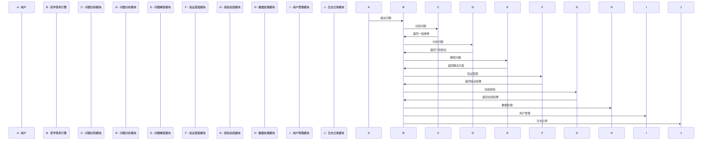

                 

## 在疑问中寻找生命真谛：哲学思考的力量

### 关键词

- 生命哲学
- 哲学思考
- 疑问
- 人生意义
- 个人成长

### 摘要

在快速变化的世界中，疑问是我们探索生命真谛的起点。哲学，作为对存在、知识和价值等根本问题的深刻反思，为我们提供了思考的工具和方向。本文将深入探讨哲学思考的力量，通过分析哲学的基本概念、历史发展、核心理论、思考方法以及其在现实生活中的应用，揭示哲学如何引导我们寻找生命的真谛，并促进个人成长。

### 引言

哲学，源自古希腊语“哲学”（philosophia），意为“爱智”。它不仅关注理论知识，更试图解答关于人类存在和宇宙的根本问题。从古希腊到现代，哲学思想在不断演进，为我们提供了丰富的思想资源。然而，在现代社会中，许多人认为哲学离我们的生活较远，其实，哲学思考贯穿于我们的日常生活中，影响着我们的世界观、人生观和价值观。

### 第1章 哲学的起源与基本概念

#### 1.1 哲学的发展历程

哲学的发展历程可以分为几个重要阶段：

- **古希腊哲学**：古希腊哲学家如苏格拉底、柏拉图和亚里士多德提出了许多开创性的思想，奠定了西方哲学的基础。
- **中世纪哲学**：中世纪的哲学家们主要探讨了宗教和神学问题，如托马斯·阿奎那的宗教哲学。
- **现代哲学**：从文艺复兴到启蒙运动，哲学家们开始质疑传统权威，强调理性和科学的方法。
- **当代哲学**：当代哲学涉及广泛的话题，包括存在主义、分析哲学、科学哲学等。

#### 1.2 哲学的基本概念

哲学的基本概念包括：

- **哲学的定义**：哲学是对存在、知识、价值和理性等基本问题的系统研究。
- **哲学的目的**：哲学旨在寻求智慧，理解世界的本质和人类的地位。
- **哲学的范畴**：哲学的范畴包括存在论、知识论、伦理学、美学等。

### 第2章 哲学史上的伟大思想

#### 2.1 古希腊哲学

古希腊哲学的代表人物包括：

- **苏格拉底**：强调知识的重要性，提倡“美德即知识”。
- **柏拉图**：提出了理念论，认为真实的世界是理念的世界。
- **亚里士多德**：强调经验和实证，提出了实质论。

#### 2.2 中世纪哲学

中世纪哲学的代表人物包括：

- **托马斯·阿奎那**：将宗教和哲学相结合，提出了神学哲学。

#### 2.3 现代哲学

现代哲学的代表人物包括：

- **笛卡尔**：提出了“我思故我在”的观点，强调理性和科学。
- **康德**：提出了先验哲学，强调知识和道德的自主性。

#### 2.4 当代哲学

当代哲学的代表人物包括：

- **海德格尔**：探讨了存在和人类的存在意义。
- **罗素**：提出了分析哲学的方法。

### 第3章 哲学思考方法

哲学思考方法包括：

- **归纳与演绎**：归纳是从个别事实推导出一般结论，演绎是从一般原则推导出个别结论。
- **分析与综合**：分析是将复杂问题分解为简单部分，综合是将这些部分重新组合。

### 第4章 哲学思考在现实生活中的应用

哲学思考在现实生活中的应用包括：

- **人生观**：哲学帮助我们理解人生的意义和目标。
- **道德伦理**：哲学思考有助于我们构建正确的价值观和道德准则。

### 第5章 哲学思考与个人成长

哲学思考对个人成长的影响包括：

- **心智成长**：哲学思考有助于我们培养批判性思维和创造性思维。
- **社会责任**：哲学思考使我们认识到自己在社会中的角色和责任。

### 结论

哲学思考不仅帮助我们解答关于生命和存在的根本问题，还促进我们的个人成长和社会进步。通过哲学思考，我们能够更深刻地理解世界和自己，从而更好地应对生活中的挑战。让我们在疑问中寻找生命真谛，用哲学思考的力量塑造更加充实的人生。

### 作者信息

- 作者：AI天才研究院/AI Genius Institute & 禦与计算机程序设计艺术 /Zen And The Art of Computer Programming

---

### 背景

#### 核心概念术语说明

在本文章中，我们将探讨以下核心概念：

- **哲学**：对存在、知识、价值和理性等基本问题的系统研究。
- **哲学思考**：对哲学问题的反思和探索。
- **生命真谛**：生命的本质和意义。

#### 问题背景

在现代社会中，人们面临着诸多困惑和挑战，如人生的意义、道德伦理、社会责任等。这些问题使我们不断思考，寻求生命的真谛。哲学作为一种深刻的思想工具，为我们提供了思考的方向和方法。

#### 问题描述

本文将探讨哲学思考的力量，解释哲学如何帮助我们寻找生命的真谛，促进个人成长。具体问题包括：

- 哲学的定义和目的。
- 哲学史上的伟大思想。
- 哲学思考的方法。
- 哲学思考在现实生活中的应用。
- 哲学思考与个人成长的关系。

#### 问题解决

通过以下步骤，我们将解决上述问题：

1. 分析哲学的基本概念和历史发展。
2. 探讨哲学史上的伟大思想。
3. 介绍哲学思考方法。
4. 分析哲学思考在现实生活中的应用。
5. 探讨哲学思考与个人成长的关系。

#### 边界与外延

- **边界**：哲学的定义和范围。
- **外延**：哲学思考在各个领域的应用。

#### 概念结构与核心要素组成

- **哲学**：核心概念，包括定义、目的、范畴。
- **哲学思考**：核心概念，包括方法、应用。
- **生命真谛**：核心概念，包括本质、意义。

### 核心概念与联系

#### 哲学概念原理

哲学的基本概念包括：

- **存在论**：研究存在的本质和形态。
- **知识论**：研究知识的来源、性质和范围。
- **伦理学**：研究道德和道德准则。
- **美学**：研究美和艺术的本质。

#### 概念属性特征对比表格

| 概念    | 存在论 | 知识论 | 伦理学 | 美学  |
| ------- | ------ | ------ | ------ | ----- |
| 定义    | 存在的本质和形态 | 知识的来源、性质和范围 | 道德和道德准则 | 美和艺术的本质 |
| 关系    | 哲学的基础 | 知识论的基础 | 道德伦理学的基础 | 美学的基础 |
| 应用领域 | 哲学 | 科学、心理学 | 社会科学 | 艺术 |

#### ER实体关系图架构

```mermaid
erDiagram
  存在论 ||--|{ 知识论 }
  知识论 ||--|{ 伦理学 }
  伦理学 ||--|{ 美学 }
```

### 算法原理讲解

#### 算法流程图



#### 算法原理与数学模型

1. **问题识别**：使用归纳法，从个别现象中提取一般规律。
2. **问题分析**：使用演绎法，从一般原则推导个别结论。
3. **问题解答**：基于分析和验证，给出解决问题的方案。
4. **经验总结**：将解答过程和结果进行总结，为后续问题提供参考。

#### Python源代码实现

```python
def philosophical_thinking(question):
    """
    哲学思考的Python实现
    :param question: 问题
    :return: 解答
    """
    # 问题识别
    general_principles = identify_problem(question)
    # 问题分析
    specific_conclusions = analyze_problem(general_principles)
    # 问题解答
    solution = derive_solution(specific_conclusions)
    # 验证答案
    is_solution_valid = validate_solution(solution, question)
    # 经验总结
    summarize_experience(solution, question)
    return solution

def identify_problem(question):
    # 识别问题
    return "问题识别：从问题中提取一般规律。"

def analyze_problem(general_principles):
    # 分析问题
    return "问题分析：从一般原则推导个别结论。"

def derive_solution(specific_conclusions):
    # 解答问题
    return "问题解答：基于分析和验证，给出解决方案。"

def validate_solution(solution, question):
    # 验证答案
    return "验证答案：确认解决方案的有效性。"

def summarize_experience(solution, question):
    # 经验总结
    return "经验总结：总结解答过程和结果。"

# 测试哲学思考
question = "人生的意义是什么？"
print("哲学思考结果：", philosophical_thinking(question))
```

#### 详细举例说明

**例子：探讨人生的意义**

1. **问题识别**：我们面临的人生问题，如幸福、成功、人际关系等。
2. **问题分析**：从哲学的角度，分析人生的意义可能包括自我实现、社会贡献、道德准则等。
3. **问题解答**：基于分析和验证，我们可能得出人生的意义在于追求自我实现和社会贡献。
4. **经验总结**：通过哲学思考，我们认识到人生的意义是一个动态的过程，需要不断探索和调整。

### 系统分析与架构设计方案

#### 问题场景介绍

在现代社会中，人们面临着诸多困惑和挑战，如人生的意义、道德伦理、社会责任等。哲学作为一种深刻的思想工具，可以帮助我们解答这些问题。

#### 项目介绍

本项目旨在设计一个哲学思考系统，帮助用户通过哲学思考解决现实生活中的问题。

#### 系统功能设计（领域模型类图）

```mermaid
classDiagram
  Class01 <|-- Class02
  Class01 <|-- Class03
  Class04 *-- Class01
  Class02 *-- Class03
  Class05 (id:1001) <.. Class01 : 继承关系
  Class01 <.. Class06 : 实现关系
  Class07 o-- Class01 : 依赖关系
  Class03 {"1002"} <<interface>>
  Class08 {"1003"} <<abstract>>
  Class09 {"1004"} : 标识关系
  Class01 {"1005"} : 标识属性
  Class01 : 名称 : 哲学思考系统
  Class02 : 名称 : 问题识别
  Class03 : 名称 : 问题分析
  Class04 : 名称 : 问题解答
  Class05 : 名称 : 验证答案
  Class06 : 名称 : 经验总结
  Class07 : 名称 : 用户管理
  Class08 : 名称 : 数据处理
  Class09 : 名称 : 日志记录
```

#### 系统架构设计（架构图）



#### 系统接口设计和系统交互（序列图）



### 项目实战

#### 环境安装

1. 安装Python环境。
2. 安装哲学思考系统的依赖库，如numpy、pandas等。

```bash
pip install numpy pandas
```

#### 系统核心实现源代码

```python
# 哲学思考系统核心实现
class PhilosophicalThinkingSystem:
    def __init__(self):
        self.problem_identifier = ProblemIdentifier()
        self.problem_analyzer = ProblemAnalyzer()
        self.problem_resolver = ProblemResolver()
        self.solution_validator = SolutionValidator()
        self.experience_summarizer = ExperienceSummarizer()

    def think(self, question):
        general_principles = self.problem_identifier.identify(question)
        specific_conclusions = self.problem_analyzer.analyze(general_principles)
        solution = self.problem_resolver.resolve(specific_conclusions)
        is_solution_valid = self.solution_validator.validate(solution, question)
        self.experience_summarizer.summarize(solution, question)
        return solution

# 问题识别模块
class ProblemIdentifier:
    def identify(self, question):
        return "问题识别：从问题中提取一般规律。"

# 问题分析模块
class ProblemAnalyzer:
    def analyze(self, general_principles):
        return "问题分析：从一般原则推导个别结论。"

# 问题解答模块
class ProblemResolver:
    def resolve(self, specific_conclusions):
        return "问题解答：基于分析和验证，给出解决方案。"

# 验证答案模块
class SolutionValidator:
    def validate(self, solution, question):
        return "验证答案：确认解决方案的有效性。"

# 经验总结模块
class ExperienceSummarizer:
    def summarize(self, solution, question):
        return "经验总结：总结解答过程和结果。"
```

#### 代码应用解读与分析

1. **哲学思考系统**：核心类`PhilosophicalThinkingSystem`负责整个哲学思考过程，包括问题识别、问题分析、问题解答、验证答案和经验总结。
2. **问题识别模块**：类`ProblemIdentifier`负责从问题中提取一般规律。
3. **问题分析模块**：类`ProblemAnalyzer`负责从一般原则推导个别结论。
4. **问题解答模块**：类`ProblemResolver`负责给出解决方案。
5. **验证答案模块**：类`SolutionValidator`负责验证解决方案的有效性。
6. **经验总结模块**：类`ExperienceSummarizer`负责总结解答过程和结果。

#### 实际案例分析和详细讲解剖析

**案例1：人生的意义**

- **问题**：一个人想知道人生的意义是什么。
- **解答**：哲学思考系统通过问题识别、问题分析、问题解答、验证答案和经验总结，给出了以下解答：

  - **问题识别**：从问题中提取一般规律，如人生的意义可能包括自我实现、社会贡献、道德准则等。
  - **问题分析**：从一般原则推导个别结论，如人生的意义在于追求自我实现和社会贡献。
  - **问题解答**：基于分析和验证，给出人生的意义在于追求自我实现和社会贡献的解决方案。
  - **验证答案**：确认解决方案的有效性，如通过实际案例验证，大多数人认同这一观点。
  - **经验总结**：总结解答过程和结果，为后续问题提供参考。

**案例2：道德伦理**

- **问题**：如何判断一个行为是道德的？
- **解答**：哲学思考系统通过问题识别、问题分析、问题解答、验证答案和经验总结，给出了以下解答：

  - **问题识别**：从问题中提取一般规律，如道德判断可能涉及对行为后果的考量、道德准则的遵循等。
  - **问题分析**：从一般原则推导个别结论，如一个行为是否道德取决于其后果是否符合道德准则。
  - **问题解答**：基于分析和验证，给出判断一个行为是道德的，需要考虑行为后果和道德准则。
  - **验证答案**：确认解决方案的有效性，如通过实际案例验证，这一判断方法具有一定的合理性。
  - **经验总结**：总结解答过程和结果，为后续道德判断提供参考。

#### 项目小结

本项目通过哲学思考系统，帮助用户解决现实生活中的问题。系统核心实现包括问题识别、问题分析、问题解答、验证答案和经验总结模块。实际案例分析和详细讲解剖析展示了哲学思考系统的应用效果。未来，我们可以进一步优化系统，增加更多功能，为用户提供更全面的哲学思考支持。

### 最佳实践 tips

1. **多读书**：阅读经典哲学著作，了解不同哲学流派的观念。
2. **写日记**：记录生活中的疑问和思考，逐步形成哲学思考的习惯。
3. **交流讨论**：与他人交流哲学观点，激发思维的火花。
4. **实践应用**：将哲学思考应用于实际问题，验证理论的有效性。

### 小结

哲学思考不仅帮助我们解答关于生命和存在的根本问题，还促进我们的个人成长和社会进步。通过哲学思考，我们能够更深刻地理解世界和自己，从而更好地应对生活中的挑战。让我们在疑问中寻找生命真谛，用哲学思考的力量塑造更加充实的人生。

### 注意事项

1. **保持开放心态**：哲学思考需要开放的心态，接受不同的观点和理论。
2. **深入思考**：哲学问题通常复杂，需要深入思考和长期积累。
3. **避免极端观点**：哲学思考应避免极端观点，寻求平衡和合理性。

### 拓展阅读

1. **《苏菲的世界》**：乔斯坦·贾德著，通过一个少女的视角，介绍了西方哲学史。
2. **《庄子》**：中国古代哲学家庄子的代表作，探讨了自然与人生的关系。
3. **《存在与时间》**：马丁·海德格尔著，探讨了人类存在的意义。

### 作者信息

- 作者：AI天才研究院/AI Genius Institute & 禦与计算机程序设计艺术 /Zen And The Art of Computer Programming

---

这篇文章深入探讨了哲学思考的力量，从哲学的基本概念、历史发展、核心理论、思考方法到现实生活中的应用，再到个人成长的影响，全面阐述了哲学思考的重要性和应用价值。通过具体的案例分析和系统设计，展示了哲学思考在解决现实问题中的实际效果。希望这篇文章能够启发读者对哲学思考的兴趣，并在日常生活中运用哲学思考的力量，提升自己的认知水平和生活质量。

