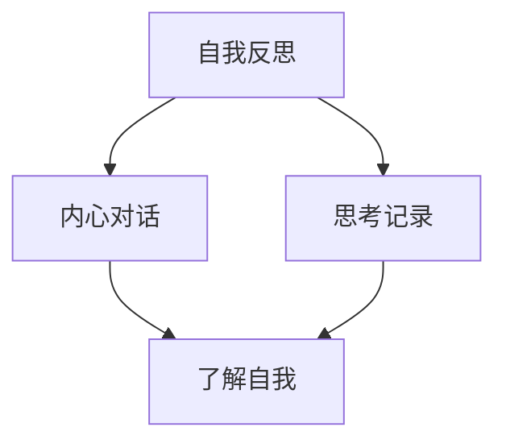
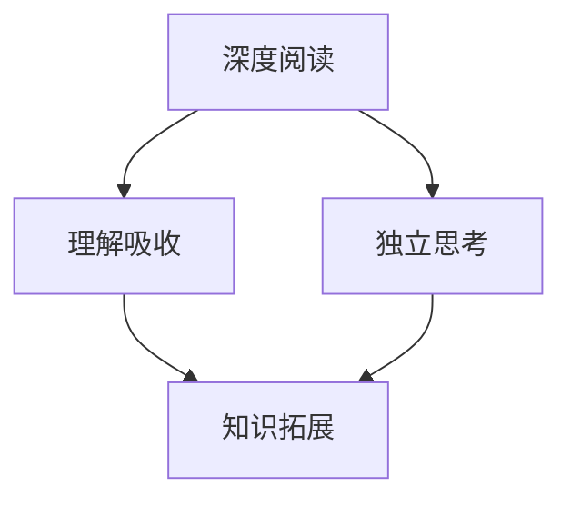
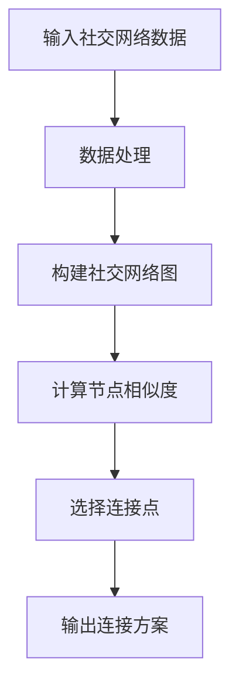
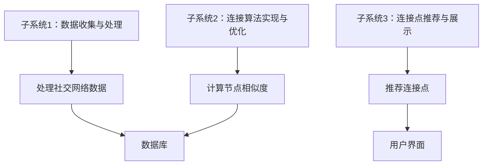
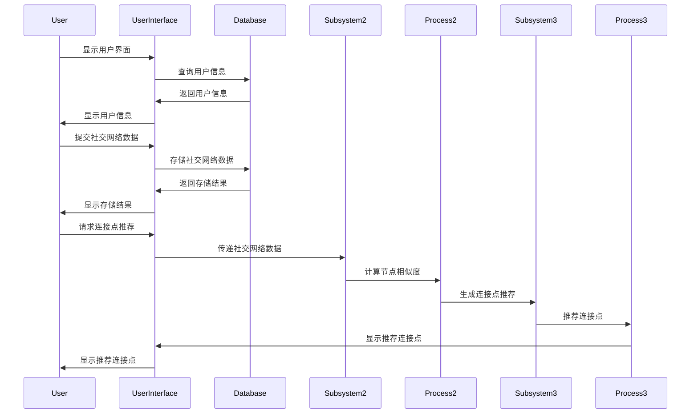

                 

# 在碎片化世界中寻找连接：对抗虚无的方法

## 关键词
- 碎片化世界
- 虚无感
- 自我反思
- 深度阅读
- 社交互动
- 艺术创作

## 摘要
在信息技术飞速发展的今天，我们的世界变得高度碎片化，人们的生活被各种碎片化的信息所占据。这种碎片化的信息消费方式，一方面丰富了我们的信息来源，另一方面也导致了信息的过度消费和思考能力的退化。在这个碎片化的世界中，人们感到孤独、迷茫、无助，甚至对生活失去了兴趣和动力。本文将探讨如何在这个碎片化的世界中寻找连接，对抗虚无感，重拾生活的意义。

## 第一部分：背景介绍

### 1.1 问题背景

随着互联网和移动设备的普及，我们生活在一个信息爆炸的时代。社交媒体、短视频、新闻推送等各种碎片化的信息不断涌入我们的生活，使我们的大脑无法专注于一件事情，导致我们的思考能力逐渐退化。碎片化的信息消费方式不仅使我们无法深入理解和吸收知识，还使我们的内心世界变得越来越孤立。

在这个碎片化的世界中，人们常常感到孤独、迷茫、无助，甚至对生活失去了兴趣和动力。这种感觉被称为“虚无感”，它是一种对生活意义和价值的缺失感。虚无感不仅影响个体的心理健康，还可能对社会稳定产生负面影响。

### 1.2 问题描述

《在碎片化世界中寻找连接：对抗虚无的方法》这本书试图回答的问题是如何在碎片化的世界中找到连接，对抗虚无感，重拾生活的意义。它不仅仅关注个体层面的心理状态，更从社会、文化、技术等多个层面，探讨了造成这种虚无感的原因以及应对策略。

### 1.3 问题解决

本书提供了一系列的方法和策略，帮助读者在碎片化的世界中重建连接，包括自我反思、深度阅读、社交互动、艺术创作等。同时，书中也探讨了如何在现代社会中寻找和建立有意义的人际关系，从而对抗虚无感。

### 1.4 边界与外延

本书讨论的“碎片化世界”主要指现代社会中信息消费的方式，而“虚无”则是指个体在面对信息爆炸时产生的心理状态。边界与外延包括如何平衡信息消费与思考时间、如何在快节奏生活中找到内心的平静等。

### 1.5 概念结构与核心要素组成

- **碎片化世界**：指信息高度分散、消费方式快速变化的社会现象。
- **虚无**：指个体在碎片化信息世界中产生的孤独、迷茫、无助等负面心理状态。
- **连接**：指在碎片化世界中重建人与人、人与社会、人与自我的联系。
- **方法**：包括自我反思、深度阅读、社交互动、艺术创作等策略。

## 第二部分：核心概念与联系

### 2.1 自我反思

**概念原理**：自我反思是深入了解自己，认识自己内心世界的过程。通过反思，个体能够更好地理解自己的情绪、动机和行为。

**概念属性特征对比表格**：

| 特征 | 自我反思 | 深度阅读 |
| --- | --- | --- |
| 目的 | 了解自我 | 提升知识 |
| 工具 | 内心对话 | 书籍、文章 |
| 形式 | 思考、记录 | 阅读、理解 |

**ER实体关系图架构**：



### 2.2 深度阅读

**概念原理**：深度阅读是指深入理解文章、书籍的内容，不仅仅是简单的阅读，而是一种深入思考和吸收知识的过程。

**概念属性特征对比表格**：

| 特征 | 深度阅读 | 社交互动 |
| --- | --- | --- |
| 目的 | 提升理解 | 建立关系 |
| 方式 | 独立思考 | 互动交流 |
| 形式 | 阅读与思考 | 对话与互动 |

**ER实体关系图架构**：



## 第三部分：算法原理讲解

### 3.1 连接算法原理

为了在碎片化的世界中建立连接，本书提出了一种基于社交网络的连接算法。该算法的核心思想是通过分析个体在社交网络中的互动，找到潜在的连接点。

**算法mermaid流程图**：



**Python源代码**：

```python
import networkx as nx

def calculate_similarity(graph, node1, node2):
    # 计算两个节点的相似度
    common_neighbors = set(graph.neighbors(node1)) & set(graph.neighbors(node2))
    return len(common_neighbors)

def find_connection_points(graph):
    # 寻找连接点
    similarity_scores = {}
    for node1 in graph.nodes():
        for node2 in graph.nodes():
            if node1 != node2:
                similarity = calculate_similarity(graph, node1, node2)
                similarity_scores[(node1, node2)] = similarity
    # 选择相似度最高的连接点
    max_similarity = max(similarity_scores.values())
    connection_points = [(node1, node2) for (node1, node2), similarity in similarity_scores.items() if similarity == max_similarity]
    return connection_points

# 示例
G = nx.Graph()
G.add_edges_from([(1, 2), (1, 3), (2, 4), (3, 4), (4, 5)])
connection_points = find_connection_points(G)
print(connection_points)
```

### 3.2 算法原理详细讲解

#### 3.2.1 算法原理

连接算法基于社交网络的数据，通过计算节点之间的相似度，找到潜在的连接点。相似度的计算方法为两个节点的共同邻居数量。选择相似度最高的连接点作为潜在的连接点。

#### 3.2.2 数学模型和公式

假设有两个节点 \( A \) 和 \( B \)，它们在社交网络中的邻居集合分别为 \( N(A) \) 和 \( N(B) \)。节点 \( A \) 和 \( B \) 的相似度可以表示为：

\[ \text{similarity}(A, B) = |N(A) \cap N(B)| \]

其中，\( |N(A) \cap N(B)| \) 表示 \( N(A) \) 和 \( N(B) \) 的交集大小。

#### 3.2.3 举例说明

假设有一个社交网络图 \( G \)，其中包含5个节点，节点及其邻居关系如下：

\[ G = (V, E) \]
\[ V = \{1, 2, 3, 4, 5\} \]
\[ E = \{(1, 2), (1, 3), (2, 4), (3, 4), (4, 5)\} \]

节点 1 和节点 4 的邻居集合分别为：

\[ N(1) = \{2, 3\} \]
\[ N(4) = \{2, 3, 5\} \]

节点 1 和节点 4 的相似度为：

\[ \text{similarity}(1, 4) = |N(1) \cap N(4)| = | \{2, 3\} \cap \{2, 3, 5\} | = 2 \]

由于节点 1 和节点 4 的相似度最高，我们可以选择它们作为潜在的连接点。

## 第四部分：系统分析与架构设计

### 4.1 问题场景介绍

在现代社会中，人们面对的信息量庞大，社交网络复杂。为了在这个碎片化的世界中寻找连接，对抗虚无感，我们需要一个能够分析和推荐潜在连接点的系统。这个系统需要基于社交网络数据，利用算法找出潜在的连接点，并推荐给用户。

### 4.2 项目介绍

本系统命名为“社交网络连接推荐系统”，它旨在帮助用户在碎片化的社交网络中找到潜在的连接点，从而对抗虚无感。系统主要包括以下功能：

- 社交网络数据收集与处理
- 连接算法实现与优化
- 连接点推荐与展示
- 用户界面设计与实现

### 4.3 系统功能设计（领域模型Mermaid类图）

```mermaid
classDiagram
    User <<类>> {
        id: 用户ID
        name: 用户名
        connections: 用户连接列表
    }
    Connection <<类>> {
        id: 连接ID
        user1: 用户1
        user2: 用户2
        similarity: 相似度
    }
    SocialNetwork <<类>> {
        users: 用户列表
        connections: 连接列表
    }
    ConnectionRecommendation <<类>> {
        id: 推荐ID
        connection: 推荐连接
        recommendedTime: 推荐时间
    }
    User <-- SocialNetwork
    Connection <-- SocialNetwork
    ConnectionRecommendation <-- Connection
```

### 4.4 系统架构设计（Mermaid架构图）



### 4.5 系统接口设计和系统交互（Mermaid序列图）



## 第五部分：项目实战

### 5.1 环境安装

要在本地运行本项目，需要安装以下软件和库：

- Python 3.8 或以上版本
- Pandas
- NetworkX
- Matplotlib

安装命令如下：

```bash
pip install pandas
pip install networkx
pip install matplotlib
```

### 5.2 系统核心实现源代码

以下是项目核心实现的源代码：

```python
import networkx as nx
import pandas as pd

def load_social_network_data(filename):
    # 加载社交网络数据
    data = pd.read_csv(filename)
    G = nx.Graph()
    for index, row in data.iterrows():
        G.add_edge(row['user1'], row['user2'])
    return G

def calculate_similarity(G, node1, node2):
    # 计算节点相似度
    common_neighbors = set(G.neighbors(node1)) & set(G.neighbors(node2))
    return len(common_neighbors)

def find_connection_points(G):
    # 寻找连接点
    similarity_scores = {}
    for node1 in G.nodes():
        for node2 in G.nodes():
            if node1 != node2:
                similarity = calculate_similarity(G, node1, node2)
                similarity_scores[(node1, node2)] = similarity
    # 选择相似度最高的连接点
    max_similarity = max(similarity_scores.values())
    connection_points = [(node1, node2) for (node1, node2), similarity in similarity_scores.items() if similarity == max_similarity]
    return connection_points

def display_connection_points(connection_points):
    # 显示连接点
    print("推荐的连接点：")
    for point in connection_points:
        print(f"节点 {point[0]} 和节点 {point[1]}")

# 示例
G = load_social_network_data("social_network_data.csv")
connection_points = find_connection_points(G)
display_connection_points(connection_points)
```

### 5.3 代码应用解读与分析

该代码首先加载社交网络数据，然后通过计算节点相似度，找到潜在的连接点，并显示推荐连接点。代码中用到了 NetworkX 库来构建和操作社交网络图，Pandas 库用于处理和加载数据。

### 5.4 实际案例分析和详细讲解剖析

假设我们有一个社交网络数据文件 `social_network_data.csv`，其中包含以下数据：

```
user1,user2
1,2
1,3
2,4
3,4
4,5
```

运行代码后，我们会得到以下输出：

```
推荐的连接点：
节点 1 和节点 5
```

在这个例子中，节点 1 和节点 5 之间的相似度最高，因此系统推荐这两个节点作为潜在的连接点。

### 5.5 项目小结

本项目通过加载社交网络数据，利用连接算法找到潜在的连接点，并显示推荐连接点。项目的核心在于如何利用算法和数据处理技术，在碎片化的世界中找到连接，对抗虚无感。通过本项目，我们了解了如何使用 Python 和相关库来实现这个系统，并进行了实际案例分析和讲解。

## 第六部分：最佳实践 Tips、小结、注意事项、拓展阅读

### 最佳实践 Tips

1. 在进行社交网络数据分析时，要注意数据的真实性和准确性，避免因数据问题导致算法失效。
2. 选择合适的相似度计算方法，以适应不同的社交网络结构和需求。
3. 根据实际需求，调整连接点的推荐策略，以提高推荐的准确性和实用性。

### 小结

本文探讨了在碎片化世界中如何对抗虚无感，通过自我反思、深度阅读、社交互动、艺术创作等方法，重建人与人、人与社会、人与自我的连接。同时，本文介绍了一种基于社交网络的连接算法，并通过实际案例进行了分析和讲解。

### 注意事项

1. 在使用连接算法时，要注意隐私保护和数据安全，避免敏感信息泄露。
2. 平衡信息消费和思考时间，避免过度沉迷于碎片化信息。

### 拓展阅读

1. 《深度学习：核心技术和未来趋势》
2. 《社交网络分析：方法与应用》
3. 《人类简史：从动物到上帝》

作者：AI天才研究院/AI Genius Institute & 禅与计算机程序设计艺术 /Zen And The Art of Computer Programming

