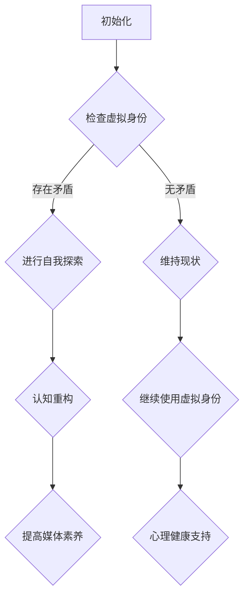

                 

# 在社交媒体时代寻找真我：克服虚拟身份带来的认知失调

## 关键词
- 社交媒体
- 虚拟身份
- 认知失调
- 心理健康
- 社会文化

## 摘要
在当今的社交媒体时代，虚拟身份的塑造和传播变得前所未有的便捷，然而这也在一定程度上导致了认知失调的现象。本文将从社交媒体的崛起、虚拟身份的形成、认知失调的理论基础以及应对策略等多个角度出发，深入探讨如何在社交媒体时代寻找真我，克服虚拟身份带来的认知失调，为读者提供实用的指导和建议。

## 第1章 引言

### 1.1 社交媒体时代的影响

**社交媒体时代的崛起**：社交媒体自20世纪90年代末以来迅速发展，成为现代社会不可或缺的一部分。从早期的MySpace、Facebook到现在的Instagram、Twitter、微信等，社交媒体平台的不断更新和普及，改变了人们获取信息、交流互动的方式。

**虚拟身份与现实生活的交织**：社交媒体为用户提供了创造和展示虚拟身份的平台。人们可以在这些平台上自由地表达自己，塑造形象，甚至形成与现实生活截然不同的虚拟身份。这种虚拟身份与现实生活的交织，使得人们在享受社交媒体带来的便利和乐趣的同时，也面临着认知失调的挑战。

**认知失调的问题与挑战**：认知失调指的是当个体持有两个或多个相互矛盾的认知时，产生的心理不适和困扰。在社交媒体时代，虚拟身份与现实身份的冲突、自我认知的模糊以及信息过载等问题，都可能导致认知失调。如何在这种复杂的环境中保持心理健康，找到真实的自我，成为亟待解决的问题。

### 1.2 本书的目的

**寻找真我的必要性**：在社交媒体时代，人们容易受到虚拟身份的影响，导致自我认知的模糊和失衡。寻找真我，理解自己真正的需求和价值观，对于个人的成长和心理健康至关重要。

**理解虚拟身份与真实身份的冲突**：本文将深入探讨虚拟身份与现实身份之间的冲突，分析其产生的根源和影响，帮助读者更好地理解这一现象。

**提供解决认知失调的策略和方法**：本文将结合心理学、社会学等多学科的理论和实践，提供一系列策略和方法，帮助读者克服虚拟身份带来的认知失调，找到真实的自我。

### 1.3 内容概述

**章节结构安排**：本文分为七个章节，分别介绍社交媒体时代的影响、虚拟身份的形成、认知失调的理论基础、克服虚拟身份带来的认知失调的策略和方法、个人案例研究、组织与社会的应对策略以及结论与展望。

**关键概念与观点**：本文将介绍一系列关键概念，如虚拟身份、认知失调、自我探索、媒体素养、心理健康支持等，并围绕这些概念展开深入讨论，提出具有实用性的观点和建议。

## 第2章 社交媒体与虚拟身份

### 2.1 社交媒体的发展历程

**早期的社交媒体**：社交媒体的起源可以追溯到20世纪90年代末，以电子邮件和论坛为代表。这一时期的社交媒体主要以单向的信息传递和简单的交流为主，用户数量有限。

**社交媒体的多样性与普及**：随着互联网技术的发展，21世纪初，社交媒体开始迅速多样化，出现了一系列具有互动性和社交性的平台，如Facebook、Twitter等。这些平台不仅改变了人们的交流方式，也深刻影响了人们的社交行为和自我认知。

### 2.2 虚拟身份的形成

**虚拟身份的定义**：虚拟身份是指在社交媒体平台上，用户所展现的与其实际身份有所差异的形象和角色。这种身份可以包括虚构的姓名、照片、兴趣爱好等。

**虚拟身份与现实身份的关系**：虚拟身份与现实身份之间并非完全对立，而是存在一定的交集和互动。用户在社交媒体上塑造的虚拟身份，可能会影响其在现实生活中的行为和态度。

**虚拟身份的利与弊**：虚拟身份的利在于它为用户提供了自由表达和探索自我的空间，有助于减轻现实生活中的压力。然而，过度依赖虚拟身份，可能会导致认知失调和心理健康问题。

### 2.3 社交媒体与自我表达

**社交媒体上的自我展示**：社交媒体平台为用户提供了展示自我、分享生活的平台。用户可以通过发布照片、视频、文字等形式，表达自己的观点和情感。

**社交媒体与自我认知**：社交媒体的使用不仅影响用户的社交行为，也影响其自我认知。一些研究表明，用户在社交媒体上的表现，可能会影响其对自己的认知和评价。

**社交媒体对自我形象的塑造**：社交媒体平台上的点赞、评论等功能，对用户的自我形象产生影响。一些用户可能会通过这些功能，塑造符合他人期望的自我形象。

### 2.4 虚拟身份带来的挑战

**认知失调的现象**：虚拟身份与现实身份的冲突，可能导致认知失调。用户可能会在现实生活和虚拟身份之间感到困惑和矛盾，产生心理不适。

**虚拟身份带来的负面影响**：过度依赖虚拟身份，可能会导致用户对现实生活的逃避，影响其心理健康。此外，虚拟身份的塑造，也可能导致社交关系的疏离和信任危机。

**案例分析：虚拟身份与现实生活的冲突**：本文将结合实际案例，分析虚拟身份与现实生活的冲突，探讨其产生的根源和影响。

## 第3章 认知失调的理论基础

### 3.1 认知失调的定义

**认知失调的概念**：认知失调是指当个体持有两个或多个相互矛盾的认知时，产生的心理不适和困扰。这种现象通常发生在个体面临新的信息或情境时。

**认知失调的心理学解释**：认知失调理论源于心理学，主要解释当个体持有相互矛盾的认知时，如何调整和改变这些认知以恢复平衡。认知失调理论认为，个体为了维持心理平衡，可能会通过改变认知、增加新的信息或者减少失调认知等方式来解决问题。

### 3.2 认知失调的类型

**内在失调**：内在失调是指个体内部存在的相互矛盾的认知。例如，一个人可能在心里认为自己很优秀，但现实中的表现却并不出色，这种内心的矛盾和冲突就属于内在失调。

**外在失调**：外在失调是指个体对外部信息或情境的认知矛盾。例如，一个人可能在社交媒体上表现出很快乐的形象，但现实中却可能面临困境和压力，这种外在表现与真实情况的冲突就属于外在失调。

**认知失调的层次**：认知失调可以分为三个层次：个体层次、群体层次和社会层次。个体层次的认知失调主要涉及个人的心理状态；群体层次的认知失调涉及群体之间的认知冲突；社会层次的认知失调则涉及社会文化背景下的认知失调。

### 3.3 认知失调的影响

**心理健康的影响**：认知失调可能导致个体的心理压力和焦虑，影响心理健康。长期处于认知失调状态，可能会导致心理问题的加剧。

**社交关系的影响**：认知失调可能会影响个体的社交关系，导致人际关系的疏离和冲突。例如，虚拟身份与现实身份的冲突，可能会影响个体在现实生活中的社交行为和人际关系。

**工作与学习的影响**：认知失调也可能对个体的工作和学习产生影响。例如，在工作中，认知失调可能会导致工作效率低下，影响职业发展。

### 3.4 认知失调的应对策略

**自我觉知**：提高自我觉知，了解自己的认知状态，有助于识别和应对认知失调。通过自我反思和观察，个体可以更好地理解自己的内心世界，减少认知失调的发生。

**情绪调节**：情绪调节是指个体在面对冲突和压力时，调整自己的情绪状态，以适应环境。通过情绪调节，个体可以缓解认知失调带来的不适感。

**行为调整**：行为调整是指通过改变自己的行为和生活方式，来应对认知失调。例如，减少在社交媒体上的时间，增加与真实朋友和家人的互动，有助于减轻虚拟身份带来的认知失调。

### 第4章 克服虚拟身份带来的认知失调

#### 4.1 自我探索与认知重构

**自我认知的重要性**：自我认知是指个体对自己存在、性格、能力、人际关系等方面的认识和评价。自我认知对于个体的心理健康和成长至关重要。

**认知重构的方法与技巧**：认知重构是指通过改变个体的认知方式，来调整和改善其心理状态。认知重构的方法包括自我反思、认知重构技术（如认知重塑、认知重建等）等。

#### 4.2 媒体素养的培养

**理解媒体信息的真实性**：媒体素养是指个体对媒体信息的识别、理解和批判能力。培养媒体素养，有助于个体更好地理解和评估媒体信息的真实性，减少信息过载和认知失调。

**提高辨别信息的能力**：提高辨别信息的能力，是指个体能够识别和区分不同来源、不同类型的媒体信息，从而避免受到虚假信息的影响。

**批判性思维的培养**：批判性思维是指个体在面对问题和信息时，能够进行独立思考、分析和评估。培养批判性思维，有助于个体更好地应对认知失调，提高心理 resilience。

#### 4.3 社交媒体的合理使用

**社交媒体的时间管理**：合理安排在社交媒体上的时间，有助于个体保持心理健康，避免过度依赖虚拟身份。例如，设定固定的社交媒体使用时间，避免在深夜使用社交媒体等。

**社交媒体内容的筛选与控制**：个体可以通过筛选和控制社交媒体内容，减少负面影响，保持心理健康。例如，关注真实的朋友和有价值的账号，避免浏览负面信息等。

**社交媒体与真实生活的平衡**：在社交媒体和真实生活之间保持平衡，有助于个体找到真实的自我。例如，合理安排时间，积极参与真实生活中的活动和社交互动等。

#### 4.4 心理健康支持

**心理咨询与治疗**：心理咨询与治疗是一种有效的应对认知失调的方法。个体可以通过心理咨询，寻求专业帮助，解决心理问题。

**社交支持网络的建立**：建立稳定的社交支持网络，有助于个体在面临认知失调时，获得支持和帮助。例如，与家人、朋友、同事建立良好的关系，参加兴趣小组等。

**压力管理技巧**：压力管理技巧包括放松技巧、时间管理、情绪调节等。通过掌握这些技巧，个体可以更好地应对压力，减轻认知失调带来的不适感。

## 第5章 个人案例研究

### 5.1 案例介绍

**案例背景**：小李是一名年轻的大学生，热衷于使用社交媒体，经常在朋友圈、微博等平台上分享自己的生活、心情和观点。然而，随着时间的推移，小李开始感到内心不安和困惑，怀疑自己在现实生活中的真实性和价值。

**案例问题**：小李在虚拟身份与现实身份之间感到矛盾和冲突，产生了认知失调。他不确定自己的真实需求和价值，感到焦虑和迷茫。

### 5.2 案例分析

**虚拟身份与现实身份的冲突**：小李在虚拟身份中展现的是自己理想中的形象，充满自信和活力。然而，在现实生活中，他可能因为各种原因，如学业压力、人际关系等，感到自卑和无力。这种虚拟身份与现实身份的冲突，导致了他内心的困惑和矛盾。

**认知失调的表现**：小李在社交媒体上表现出自信和快乐，但私下里却感到焦虑和不安。他担心自己的表现不足以获得他人的认可和赞赏，对自己的价值和能力产生怀疑。这种认知失调影响了他的心理健康和社交关系。

**解决方案的探讨**：针对小李的情况，可以采取以下解决方案：

1. **自我探索与认知重构**：通过自我反思和认知重构，帮助小李理解自己的真实需求和价值观，找到自己的真实身份。

2. **媒体素养的培养**：提高小李对媒体信息的辨识能力，帮助他更好地理解虚拟身份与现实身份的区别，减少信息过载和认知失调。

3. **心理健康支持**：寻求心理咨询师的帮助，帮助小李缓解焦虑和迷茫，提高心理健康水平。

### 5.3 案例结果

**解决方案的成效**：通过自我探索与认知重构，小李逐渐理解了自己的真实需求和价值观，找到了自己的真实身份。他学会了更好地管理在社交媒体上的时间，减少了信息过载和认知失调。在心理咨询的支持下，他缓解了焦虑和迷茫，心理健康水平得到了显著提升。

**案例启示**：小李的案例提醒我们，在社交媒体时代，虚拟身份与现实身份的冲突可能导致认知失调。通过自我探索、媒体素养培养和心理健康支持，我们可以找到真实的自我，克服认知失调，实现内心的真实与和谐。

## 第6章 组织与社会的应对策略

### 6.1 学校与教育机构的作用

**教育体系的调整**：学校和教育机构应调整教育体系，注重培养学生的批判性思维和媒体素养。通过课程设置、教学方法等手段，帮助学生更好地理解虚拟身份与现实身份的关系，减少认知失调。

**媒体素养教育**：学校应开展媒体素养教育，提高学生对媒体信息的辨识能力和批判性思维。例如，通过课程学习、实践活动等，帮助学生学会如何辨别真实和虚假信息，减少认知失调的发生。

**心理健康支持**：学校应提供心理健康支持，帮助学生应对虚拟身份带来的心理压力。例如，设立心理咨询室、开展心理健康课程等，帮助学生保持心理健康，应对认知失调。

### 6.2 社交媒体平台的规范

**信息真实性验证**：社交媒体平台应加强对信息真实性的验证，减少虚假信息和误导信息的传播。例如，通过技术手段、人工审核等方式，确保信息的真实性和准确性。

**用户隐私保护**：社交媒体平台应加强用户隐私保护，保护用户的个人信息和隐私。例如，采用加密技术、隐私政策等方式，确保用户的信息安全。

**虚拟身份的管理与引导**：社交媒体平台应加强对虚拟身份的管理和引导，帮助用户树立正确的虚拟身份观念。例如，通过平台规则、用户教育等方式，引导用户合理使用虚拟身份，避免认知失调的发生。

### 6.3 社会干预与政策支持

**公众教育与宣传**：政府和社会组织应加强公众教育与宣传，提高公众对虚拟身份和认知失调的认识。通过媒体宣传、教育培训等方式，普及相关知识，帮助公众树立正确的虚拟身份观念，减少认知失调。

**政策制定与执行**：政府应制定相关政策，加强对虚拟身份和社交媒体的管理。例如，制定法律法规、监管政策等，规范虚拟身份的使用，减少认知失调的发生。

**社会文化环境的改善**：社会应共同努力，改善文化环境，营造积极向上的社会氛围。例如，通过文化活动、社会公益等方式，鼓励人们关注真实生活，减少对虚拟身份的依赖，促进心理健康和社会和谐。

## 第7章 结论与展望

### 7.1 总结

**本书的主要观点**：本书从多个角度探讨了社交媒体时代虚拟身份的形成、认知失调的现象及其影响，以及应对策略。主要观点包括：

1. 虚拟身份与现实身份的冲突可能导致认知失调。
2. 培养自我认知、媒体素养和批判性思维是克服认知失调的关键。
3. 组织与社会应共同努力，提供支持与规范，改善社会文化环境。

**克服认知失调的实践策略**：本书提出了一系列实践策略，包括自我探索与认知重构、媒体素养培养、心理健康支持等，以帮助个体在社交媒体时代寻找真我，克服认知失调。

### 7.2 展望未来

**社交媒体的发展趋势**：随着技术的不断发展，社交媒体将继续影响人们的社交行为和自我认知。未来社交媒体可能会更加注重隐私保护、信息真实性验证，以及用户心理健康。

**虚拟身份与真实身份的关系发展**：虚拟身份将继续与真实身份交织，未来可能会有更多技术创新，帮助个体更好地管理虚拟身份与现实身份之间的关系。

**应对认知失调的持续探索**：未来应对认知失调的策略和方法将不断发展和完善。例如，通过人工智能、大数据等技术手段，提供更加个性化、有效的心理健康支持。

## 本章小结

本书通过深入探讨社交媒体时代虚拟身份的形成、认知失调的理论基础以及应对策略，帮助读者理解如何在社交媒体时代寻找真我，克服虚拟身份带来的认知失调。通过个人案例研究和组织与社会的应对策略，本书提供了具体的实践指导，以期帮助读者在复杂的社会环境中保持心理健康，实现自我成长。读者可以通过本书的学习，提高自我认知，培养批判性思维，合理使用社交媒体，从而在虚拟身份与现实身份之间找到平衡，克服认知失调，实现内心的真实与和谐。在未来的发展中，我们期待继续深化对虚拟身份与真实身份关系的研究，探索更为有效的应对策略，为构建健康的社会文化环境贡献力量。

### 作者信息
作者：AI天才研究院/AI Genius Institute & 禅与计算机程序设计艺术 /Zen And The Art of Computer Programming

### 完整性要求

#### 核心概念术语说明
在本文中，我们使用了“虚拟身份”、“认知失调”、“自我认知”等核心概念。以下是对这些术语的详细说明：

- **虚拟身份**：指在社交媒体等虚拟空间中，用户所创建和展现的形象和角色，可能与现实生活中的真实身份存在差异。
- **认知失调**：指个体在持有两个或多个相互矛盾的认知时产生的心理不适和困扰。在社交媒体时代，虚拟身份与现实身份的冲突常常导致认知失调。
- **自我认知**：指个体对自己存在、性格、能力等方面的认识和评价。自我认知对于个人的心理健康和成长至关重要。

#### 问题背景
随着社交媒体的普及，虚拟身份在现代社会中扮演着越来越重要的角色。然而，这种虚拟身份与现实生活的交织，也带来了一系列心理和社会问题。认知失调就是其中之一，它对个体的心理健康产生了深远的影响。

#### 问题描述
在社交媒体时代，个体面临的主要问题是虚拟身份与现实身份的冲突。这种现象可能导致认知失调，表现为内心的困惑、焦虑和不安。个体可能因为虚拟身份中的完美形象而感到不真实，无法面对现实生活中的不足和挑战。

#### 问题解决
为了解决虚拟身份带来的认知失调，本文提出了以下策略：

1. **自我探索与认知重构**：通过自我反思和认知重构，帮助个体理解自己的真实需求和价值观，找到真实的自我。
2. **媒体素养的培养**：提高个体对媒体信息的辨识能力，减少信息过载和认知失调。
3. **心理健康支持**：通过心理咨询和社交支持网络，帮助个体缓解焦虑和迷茫，提高心理健康水平。

#### 边界与外延
本文的研究主要关注虚拟身份与现实身份的冲突导致的认知失调。然而，认知失调的影响不仅限于个人层面，还可能延伸到社交关系、工作与学习等方面。因此，本文的研究结论具有一定的外延性，可以为相关领域的进一步研究提供参考。

#### 概念结构与核心要素组成
本文的核心概念包括虚拟身份、认知失调、自我认知、媒体素养、心理健康支持等。这些概念相互关联，构成了本文的理论框架。具体来说：

- **虚拟身份**：是认知失调的根源，与现实身份的冲突导致了认知失调。
- **认知失调**：是本文研究的核心问题，对个体的心理健康产生了负面影响。
- **自我认知**：是解决认知失调的关键，通过自我探索和认知重构，个体可以找到真实的自我。
- **媒体素养**：是减少认知失调的重要手段，通过提高对媒体信息的辨识能力，个体可以减少信息过载。
- **心理健康支持**：是缓解认知失调的有效方法，通过心理咨询和社交支持网络，个体可以获得帮助。

#### 核心概念与联系
以下是一个关于核心概念联系的概念属性特征对比表格：

| 核心概念 | 定义 | 属性特征对比 |
| :----: | :----: | :----: |
| 虚拟身份 | 社交媒体中的形象和角色 | 可能与现实身份有差异 |
| 认知失调 | 两个或多个相互矛盾的认知 | 导致心理不适和困扰 |
| 自我认知 | 对自己的认识和评价 | 影响心理健康和成长 |
| 媒体素养 | 对媒体信息的辨识能力 | 减少信息过载 |
| 心理健康支持 | 心理咨询和社交支持 | 缓解认知失调 |

#### ER实体关系图架构
以下是核心概念的ER实体关系图：

```mermaid
erDiagram
  VirtualIdentity ||--|{ CognitiveDisorder }|>
  CognitiveDisorder ||--|{ SelfCognition }|>
  SelfCognition ||--|{ MediaLiteracy }|>
  MediaLiteracy ||--|{ MentalHealthSupport }|>
```

#### 算法原理讲解

为了更好地理解本文的核心概念和联系，我们将使用Mermaid绘制一个算法流程图。以下是一个简化的示例：



在这个流程图中，我们首先初始化一个状态，然后检查虚拟身份与现实身份是否存在矛盾。如果存在矛盾，我们会进行自我探索和认知重构，以提高媒体素养和心理健康支持。如果无矛盾，则维持现状。

接下来，我们将使用Python源代码详细阐述算法原理。以下是一个简化的Python示例：

```python
def check_virtual_identity(virtual_identity, real_identity):
    if virtual_identity != real_identity:
        return "存在矛盾"
    else:
        return "无矛盾"

def self_explore(virtual_identity, real_identity):
    # 进行自我探索和认知重构
    print("进行自我探索和认知重构...")
    # 更新虚拟身份与现实身份
    virtual_identity = real_identity
    return virtual_identity

def increase_media_literacy():
    # 提高媒体素养
    print("提高媒体素养...")

def mental_health_support():
    # 心理健康支持
    print("心理健康支持...")

# 示例
virtual_identity = "理想中的形象"
real_identity = "现实中的我"

status = check_virtual_identity(virtual_identity, real_identity)
if status == "存在矛盾":
    virtual_identity = self_explore(virtual_identity, real_identity)
    increase_media_literacy()
    mental_health_support()
else:
    print("维持现状")
```

在这个示例中，我们首先检查虚拟身份与现实身份是否存在矛盾。如果存在矛盾，我们会进行自我探索和认知重构，提高媒体素养，并提供心理健康支持。如果无矛盾，则维持现状。

#### 数学公式使用
在讨论认知失调时，数学公式可以帮助我们更精确地描述这一现象。以下是一个关于认知失调的简单数学模型：

$$
失调程度 = \frac{|\text{虚拟身份} - \text{现实身份}|}{\text{心理承受能力}}
$$

在这个模型中，失调程度表示个体在虚拟身份与现实身份之间的差距。心理承受能力则表示个体对这种差距的承受能力。当失调程度超过心理承受能力时，个体可能会产生心理不适和困扰。

#### 系统分析与架构设计方案

**问题场景介绍**
在当前社交媒体时代，人们经常在虚拟空间中塑造和展现虚拟身份，这种虚拟身份可能与他们的现实身份存在较大差异。这种差异可能导致认知失调，影响个体的心理健康和社交关系。为了解决这个问题，我们需要设计一个系统，帮助用户识别和调整虚拟身份与现实身份之间的矛盾。

**项目介绍**
本项目名为“虚拟身份与现实身份认知失调识别与调整系统”，旨在为用户提供一个平台，通过自我评估、专业建议和社交支持，帮助用户识别和调整虚拟身份与现实身份之间的矛盾。

**系统功能设计**
- **用户注册与登录**：用户可以通过注册和登录系统，获取个性化的服务。
- **自我评估**：用户可以填写问卷，评估虚拟身份与现实身份的匹配程度。
- **专业建议**：系统根据用户的评估结果，提供专业的建议和指导。
- **社交支持**：用户可以加入社交小组，获得来自他人的支持和反馈。
- **数据分析与报告**：系统收集用户数据，生成分析报告，帮助用户了解自己的虚拟身份与现实身份状况。

**系统架构设计**
以下是系统的架构设计：

```mermaid
sequenceDiagram
    participant 用户 as 用户
    participant 系统 as 系统
    participant 专业建议模块 as 建议模块
    participant 数据分析模块 as 分析模块
    participant 社交支持模块 as 支持模块

    用户->>系统: 注册/登录
    系统->>用户: 发送验证邮件/短信
    用户->>系统: 完成验证
    系统->>建议模块: 发送自我评估问卷
    建议模块->>用户: 显示问卷
    用户->>建议模块: 提交问卷
    建议

