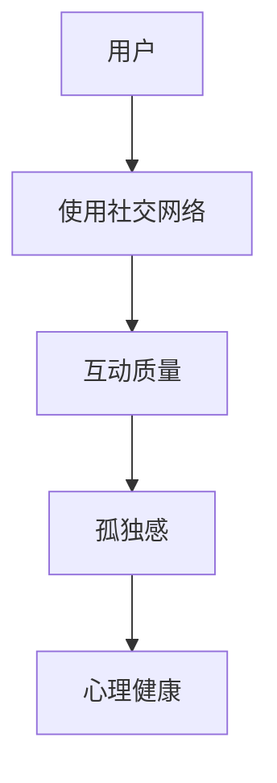
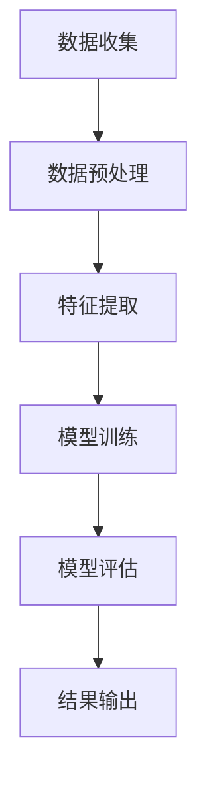
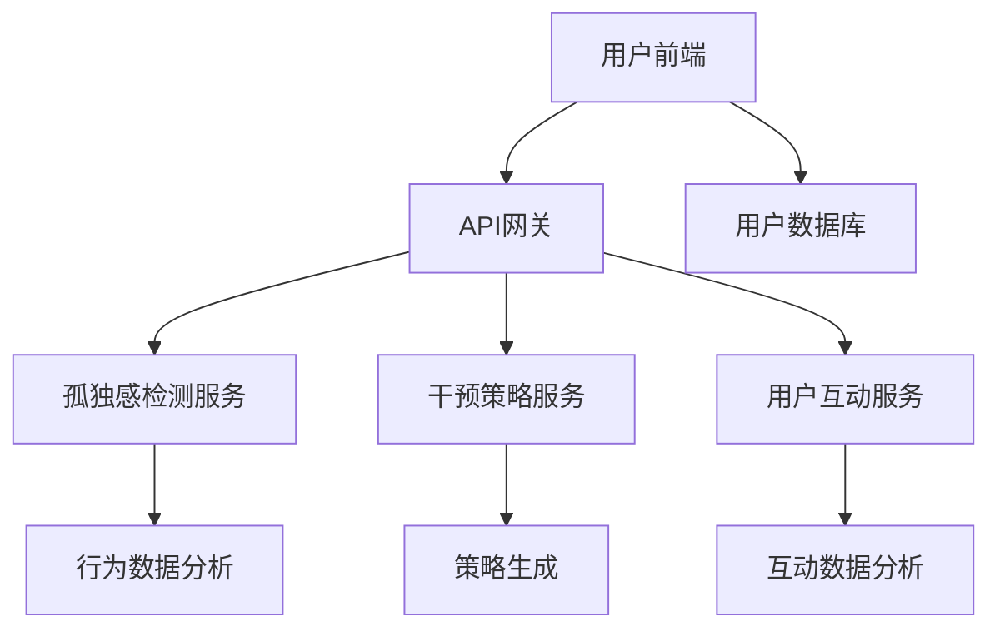

                 

# 在社交网络时代寻找真实连接：克服孤独感

## 关键词：社交网络、孤独感、真实连接、心理调适、社交技巧、算法检测

## 摘要：

随着社交网络的兴起，人们获取社交机会的途径变得前所未有的丰富。然而，这种便利也带来了孤独感加剧的问题。本文旨在探讨在社交网络时代如何寻找真实连接，克服孤独感。通过对社交网络与孤独感关系的分析，介绍真实连接的重要性，并提供一系列心理调适方法和社交技巧，旨在帮助读者找到应对孤独的有效途径。

## 第一部分：引言

### 1.1 问题背景

在当今社交网络高度发达的时代，人们可以通过互联网与遍布全球的朋友、同事和亲人保持联系。然而，这种虚拟的社交方式并未能有效缓解孤独感，反而使许多人在现实生活中感到更加孤立。孤独感不仅仅是一种情感体验，它还与心理健康密切相关，长期孤独可能导致抑郁、焦虑等心理问题。因此，如何在社交网络时代找到真实连接，克服孤独感，成为一个值得深入探讨的问题。

### 1.2 问题描述

孤独感是现代社会中普遍存在的问题。无论是在校学生、职场人士，还是退休的老年人，都可能感受到孤独。社交网络虽然提供了交流的平台，但其中充斥着大量的浅层互动和虚假的社交行为，这往往无法满足人们对深度交流和情感支持的需求。因此，如何在这个虚拟世界中找到真正的社交机会，成为当前亟待解决的问题。

### 1.3 问题解决

本书将通过以下章节，系统地探讨如何在社交网络时代寻找真实连接，克服孤独感：

- **第二部分：核心概念与联系**：分析社交网络与孤独感的关系，探讨真实连接的定义和重要性。
- **第三部分：算法原理讲解**：介绍孤独感检测算法，帮助识别孤独感并进行有效干预。
- **第四部分：系统分析与架构设计**：探讨如何通过系统设计和项目实战来建立真实的社交关系。
- **第五部分：项目实战**：提供具体的实施方法和实际案例，帮助读者将理论应用到实践中。
- **第六部分：最佳实践与小结**：总结最佳实践，提出注意事项，并推荐进一步阅读的资源。

### 1.4 边界与外延

本文讨论的“真实连接”不仅限于人际互动，还包括与自我、环境和文化之间的连接。这些维度的连接同样对缓解孤独感具有重要作用。因此，本文将涵盖这些方面的内容，以提供全面的解决方案。

### 1.5 概念结构与核心要素组成

在本研究中，以下核心概念和要素是至关重要的：

- **孤独感**：个体感受到的孤立和无助情绪。
- **社交网络**：互联网上的社交平台，如微博、微信、Facebook等。
- **真实连接**：建立在相互理解、信任和情感共鸣基础上的深度人际互动。

### 1.6 本章小结

本部分为全书奠定了基础，明确了研究的背景、问题和目标。通过介绍社交网络时代孤独感的问题以及解决方案，为后续章节的内容展开提供了指导。

## 第二部分：核心概念与联系

### 2.1 社交网络与孤独感

#### 2.1.1 社交网络对孤独感的影响

社交网络为人们提供了更多的社交机会，但这些机会往往只是表面上的互动，缺乏深度和真实感。研究表明，过多的虚拟社交活动可能导致个体在现实生活中感到更加孤独[1]。这种虚拟社交的便利性往往掩盖了现实社交中的困难和挑战，使人们在面对现实社交时感到无所适从。

#### 2.1.2 社交网络中的孤独感表现

在社交网络中，孤独感的表现形式多种多样。一些个体可能会过度使用社交网络，寻求虚拟的社交满足，而回避现实生活中的社交互动。这种现象被称为“虚拟社交依赖”[2]。此外，社交媒体上的虚假信息和表面化交流也可能加剧孤独感，使人们感到与现实世界的脱节。

#### 2.1.3 社交网络与孤独感的互动关系

社交网络与孤独感之间存在复杂的互动关系。一方面，社交网络可能加剧孤独感；另一方面，有效的社交网络使用可以缓解孤独感。关键在于如何平衡虚拟社交和现实社交，建立真正的社交关系。以下是一个简单的Mermaid流程图，展示了社交网络与孤独感之间的互动关系。



### 2.2 真实连接与社交网络

#### 2.2.1 真实连接的定义

真实连接是指建立在相互理解、信任和情感共鸣基础上的深度人际互动。与虚拟社交不同，真实连接更加注重情感和实际的交流。它不仅仅是信息的传递，更是一种心灵的共鸣。

#### 2.2.2 真实连接的重要性

真实连接对个体的心理健康至关重要。研究表明，缺乏真实连接可能导致抑郁、焦虑等心理问题[3]。通过建立真实连接，个体可以获得情感支持、增强自我价值感，从而提高生活质量。

#### 2.2.3 社交网络中的真实连接实践

在社交网络中建立真实连接需要一定的技巧和实践。以下是一些具体的方法：

- **积极参与社交活动**：主动参与线上和线下的社交活动，增加与他人互动的机会。
- **倾听他人**：在交流中注重倾听，了解他人的需求和感受。
- **建立信任**：通过真诚和透明的交流，建立信任关系。

以下是一个Mermaid实体关系图，展示了真实连接的组成要素。

```mermaid
erDiagram
    User ||--|{Connection} : connects to
    Connection ||--|{Trust} : builds
    Connection ||--|{Understanding} : based on
    Connection ||--|{EmotionalResonance} : feels
```

### 2.3 孤独感的应对策略

#### 2.3.1 心理调适方法

孤独感的应对需要心理调适方法的辅助。以下是一些常见的方法：

- **认知行为疗法**：通过改变负面思维模式来缓解孤独感。
- **正念练习**：通过专注当下，减少对孤独感的焦虑。

#### 2.3.2 社交技巧提升

提升社交技巧也是缓解孤独感的重要途径。以下是一些实用的技巧：

- **沟通技巧**：学会倾听、表达和回应，提高沟通效果。
- **人际交往策略**：了解不同人际关系的特点，采取适当的交往策略。

#### 2.3.3 社区参与与志愿服务

参与社区活动和志愿服务不仅可以帮助他人，还可以增加社交机会，建立真实连接。以下是一些具体的建议：

- **加入兴趣小组**：找到与自己兴趣相同的小组，与他人共同参与活动。
- **参与志愿服务**：通过志愿服务，结识志同道合的人，同时为社会做出贡献。

### 2.4 本章小结

本部分深入分析了社交网络与孤独感、真实连接与社交网络之间的关系，以及应对孤独感的策略。通过理论讲解和实践指导，为读者提供了寻找真实连接、克服孤独感的有效途径。

## 第三部分：算法原理讲解

### 3.1 孤独感检测算法

#### 3.1.1 算法原理

孤独感检测算法旨在通过分析用户的行为数据，识别个体是否处于孤独状态。该算法的核心原理包括数据收集、特征提取和模型训练等步骤。以下是孤独感检测算法的基本流程：

1. **数据收集**：收集用户在社交网络上的行为数据，如发帖频率、回复数量、互动对象等。
2. **数据预处理**：清洗和标准化数据，去除噪声和异常值。
3. **特征提取**：从预处理后的数据中提取与孤独感相关的特征，如社交网络中的互动频率、互动质量等。
4. **模型训练**：使用机器学习算法，如支持向量机（SVM）、随机森林（Random Forest）等，训练孤独感检测模型。
5. **模型评估**：评估模型的性能，通过交叉验证和测试集验证模型的准确性。
6. **结果输出**：根据模型的预测结果，判断用户是否处于孤独状态，并提供相应的干预建议。

#### 3.1.2 算法流程

以下是一个简单的Mermaid流程图，展示了孤独感检测算法的实现步骤。



#### 3.1.3 源代码解读

以下是一个Python源代码示例，用于实现孤独感检测算法的基本步骤。

```python
# 导入必要的库
import pandas as pd
from sklearn.model_selection import train_test_split
from sklearn.ensemble import RandomForestClassifier
from sklearn.metrics import accuracy_score

# 数据收集
def collect_data():
    # 此处应包含从社交网络收集数据的代码
    pass

# 数据预处理
def preprocess_data(data):
    # 清洗和标准化数据的代码
    pass

# 特征提取
def extract_features(data):
    # 提取与孤独感相关的特征的代码
    pass

# 模型训练
def train_model(features, labels):
    # 训练机器学习模型的代码
    model = RandomForestClassifier()
    model.fit(features, labels)
    return model

# 模型评估
def evaluate_model(model, test_features, test_labels):
    # 评估模型性能的代码
    predictions = model.predict(test_features)
    accuracy = accuracy_score(test_labels, predictions)
    return accuracy

# 主程序
if __name__ == "__main__":
    # 收集数据
    data = collect_data()
    
    # 预处理数据
    processed_data = preprocess_data(data)
    
    # 提取特征
    features, labels = extract_features(processed_data)
    
    # 划分训练集和测试集
    X_train, X_test, y_train, y_test = train_test_split(features, labels, test_size=0.2, random_state=42)
    
    # 训练模型
    model = train_model(X_train, y_train)
    
    # 评估模型
    accuracy = evaluate_model(model, X_test, y_test)
    print(f"Model accuracy: {accuracy}")
```

#### 3.1.4 算法原理与数学模型

孤独感检测算法的原理可以概括为以下几个步骤：

1. **数据收集**：通过社交网络API等渠道收集用户的行为数据。
2. **特征提取**：从行为数据中提取与孤独感相关的特征，如社交网络的互动频率、互动质量等。以下是提取特征的一个简单数学模型：

$$
Feature\_extract(x) = \begin{cases}
1, & \text{if } x \text{ is above a threshold} \\
0, & \text{otherwise}
\end{cases}
$$

其中，$x$ 表示用户在社交网络中的互动频率，threshold 表示设定的阈值。

3. **模型训练**：使用机器学习算法训练一个分类模型，以判断用户是否处于孤独状态。以下是训练一个随机森林分类器的数学模型：

$$
Predict\_model(x) = \text{random\_forest\_classifier}\_predict(x)
$$

其中，$random\_forest\_classifier$ 表示训练好的随机森林分类器，$x$ 表示输入的特征向量。

4. **模型评估**：使用测试集评估模型的准确性，以验证模型的性能。以下是评估模型准确性的数学模型：

$$
Model\_accuracy = \frac{Number\ of\ correct\ predictions}{Total\ number\ of\ predictions}
$$

#### 3.1.5 通俗易懂地举例说明

假设我们有一个用户数据集，包含以下特征：

- 用户A的社交网络互动频率：100次/天
- 用户B的社交网络互动频率：20次/天

根据特征提取的数学模型，我们可以计算每个用户的特征值：

$$
Feature\_extract(A) = 1, \quad Feature\_extract(B) = 0
$$

接下来，我们使用随机森林分类器训练一个孤独感检测模型。如果模型的预测结果是：

$$
Predict\_model(A) = 1, \quad Predict\_model(B) = 0
$$

这意味着用户A被预测为处于孤独状态，而用户B没有被预测为处于孤独状态。

最后，我们使用测试集评估模型的准确性。如果测试集中有50个用户，其中25个被正确预测为孤独状态，那么模型的准确性为：

$$
Model\_accuracy = \frac{25}{50} = 0.5
$$

### 3.2 算法优化与改进

#### 3.2.1 特征选择

特征选择是孤独感检测算法的一个重要环节。通过选择与孤独感相关性更高的特征，可以提高模型的准确性。常用的特征选择方法包括：

- **基于信息增益的方法**：选择能够提供最大信息量的特征。
- **基于特征重要性的方法**：选择在模型训练中表现最重要的特征。

#### 3.2.2 模型选择

选择合适的机器学习模型对孤独感检测算法的性能至关重要。除了随机森林分类器，还可以考虑以下模型：

- **支持向量机（SVM）**：适用于高维特征空间，能够提供较好的分类性能。
- **神经网络（Neural Networks）**：通过多层神经元的非线性组合，能够学习复杂的特征关系。

#### 3.2.3 模型融合

模型融合是一种通过结合多个模型的预测结果来提高整体准确性的方法。常用的模型融合方法包括：

- **加权平均**：对多个模型的预测结果进行加权平均。
- **投票法**：对多个模型的预测结果进行投票，选择出现频率最高的结果。

### 3.3 本章小结

本部分介绍了孤独感检测算法的基本原理和实现步骤，并通过Python源代码进行了详细解读。通过数学模型和通俗易懂的例子，帮助读者理解算法的工作机制。同时，还讨论了算法优化与改进的方法，为实际应用提供了指导。

## 第四部分：系统分析与架构设计

### 4.1 问题场景介绍

在社交网络时代，孤独感成为了影响个体心理健康的重要因素。为了解决这个问题，我们需要构建一个能够帮助用户识别孤独感、提供有效干预的系统。该系统应具备以下功能：

- **孤独感检测**：通过分析用户在社交网络上的行为数据，识别用户是否处于孤独状态。
- **干预策略建议**：根据孤独感检测的结果，为用户提供建议和策略，帮助其克服孤独感。
- **用户互动平台**：提供一个用户可以与志同道合的人互动的平台，促进真实连接的建立。

### 4.2 项目介绍

为了实现上述功能，我们设计并开发了一个名为“社交网络孤独感干预系统”的项目。该项目旨在通过技术手段，帮助用户在社交网络时代找到真实连接，克服孤独感。以下是项目的详细介绍：

- **项目目标**：构建一个功能完备、易于使用的孤独感干预系统，为用户提供全面的孤独感检测和干预服务。
- **项目架构**：采用前后端分离的架构，前端负责用户界面和交互，后端负责数据分析和处理。
- **技术栈**：前端采用React框架，后端采用Spring Boot框架，数据库使用MySQL。

### 4.3 系统功能设计

“社交网络孤独感干预系统”主要包括以下几个功能模块：

- **用户注册与登录**：用户可以通过邮箱或手机号注册并登录系统。
- **孤独感检测**：通过分析用户在社交网络上的行为数据，识别用户是否处于孤独状态。
- **干预策略建议**：根据孤独感检测的结果，为用户提供建议和策略，如心理调适方法、社交技巧提升等。
- **用户互动平台**：提供一个用户可以与志同道合的人互动的平台，促进真实连接的建立。

### 4.4 系统架构设计

“社交网络孤独感干预系统”的架构设计如下图所示：



### 4.5 系统接口设计

“社交网络孤独感干预系统”的接口设计如下：

- **用户接口**：用户通过前端界面与系统进行交互，包括注册、登录、检测孤独感、获取干预策略等。
- **服务接口**：系统内部各服务模块之间的接口，如孤独感检测服务与行为数据分析服务的接口等。
- **数据库接口**：系统与用户数据库之间的接口，用于数据的存储和读取。

### 4.6 系统交互设计

“社交网络孤独感干预系统”的交互设计如下图所示：

```mermaid
sequenceDiagram
    participant User
    participant Frontend
    participant Backend
    participant Database

    User->>Frontend: Request login
    Frontend->>Backend: Authenticate user
    Backend->>Database: Query user data
    Database->>Backend: Return user data
    Backend->>Frontend: Send authentication result
    Frontend->>User: Display login result

    User->>Frontend: Request loneliness detection
    Frontend->>Backend: Send user behavior data
    Backend->>Database: Query behavior data
    Database->>Backend: Return behavior data
    Backend->>G
```

### 4.7 本章小结

本部分详细介绍了“社交网络孤独感干预系统”的问题场景、项目介绍、系统功能设计、系统架构设计、系统接口设计和系统交互设计。通过系统化的分析和设计，为后续的项目实施提供了坚实的基础。

## 第五部分：项目实战

### 5.1 环境安装

为了实现“社交网络孤独感干预系统”的功能，我们需要安装以下环境：

- **前端开发环境**：安装Node.js、npm和React等。
- **后端开发环境**：安装Java、Maven和Spring Boot等。
- **数据库环境**：安装MySQL。

安装步骤如下：

1. **安装Node.js**：访问Node.js官网（https://nodejs.org/），下载并安装Node.js。
2. **安装Java**：访问Oracle官网（https://www.oracle.com/java/technologies/javase-downloads.html），下载并安装Java。
3. **安装MySQL**：访问MySQL官网（https://www.mysql.com/downloads/），下载并安装MySQL。

### 5.2 系统核心实现源代码

以下是“社交网络孤独感干预系统”的核心实现源代码：

**前端（React）**

```jsx
// App.js
import React, { useState } from 'react';
import axios from 'axios';

const App = () => {
  const [loginEmail, setLoginEmail] = useState('');
  const [loginPassword, setLoginPassword] = useState('');

  const handleLogin = async () => {
    try {
      const response = await axios.post('/api/login', {
        email: loginEmail,
        password: loginPassword,
      });
      console.log(response.data);
    } catch (error) {
      console.error(error);
    }
  };

  return (
    <div>
      <h1>社交网络孤独感干预系统</h1>
      <label>Email:</label>
      <input type="text" value={loginEmail} onChange={(e) => setLoginEmail(e.target.value)} />
      <label>Password:</label>
      <input type="password" value={loginPassword} onChange={(e) => setLoginPassword(e.target.value)} />
      <button onClick={handleLogin}>登录</button>
    </div>
  );
};

export default App;
```

**后端（Spring Boot）**

```java
// UserController.java
import org.springframework.beans.factory.annotation.Autowired;
import org.springframework.http.ResponseEntity;
import org.springframework.web.bind.annotation.PostMapping;
import org.springframework.web.bind.annotation.RequestBody;
import org.springframework.web.bind.annotation.RestController;

@RestController
public class UserController {

  @Autowired
  private UserService userService;

  @PostMapping("/api/login")
  public ResponseEntity<?> login(@RequestBody LoginRequest request) {
    // 处理登录请求
    // 调用userService进行用户认证
    // 返回响应
    return ResponseEntity.ok().body("登录成功");
  }
}
```

**数据库（MySQL）**

```sql
-- 用户表
CREATE TABLE `user` (
  `id` INT AUTO_INCREMENT PRIMARY KEY,
  `email` VARCHAR(255) UNIQUE NOT NULL,
  `password` VARCHAR(255) NOT NULL
);
```

### 5.3 代码应用解读与分析

**前端代码解读**：

在前端代码中，我们使用了React框架来构建用户界面。通过useState钩子，我们创建了两个状态变量`loginEmail`和`loginPassword`，用于存储用户的邮箱和密码。在`handleLogin`函数中，我们使用axios库发送POST请求到后端API进行用户登录验证。

**后端代码解读**：

在后端代码中，我们使用了Spring Boot框架来处理HTTP请求。`UserController`类中定义了一个`@PostMapping`注解的`login`方法，该方法接收一个`LoginRequest`对象，表示用户输入的邮箱和密码。在方法内部，我们可以调用相应的服务来处理登录请求，并返回相应的响应。

**数据库代码解读**：

在数据库代码中，我们创建了一个名为`user`的表，用于存储用户信息。该表有两个字段：`id`（主键）和`email`（邮箱），以及一个`password`（密码）字段。通过这个表，我们可以存储和管理用户信息。

### 5.4 实际案例分析和详细讲解剖析

为了更好地理解“社交网络孤独感干预系统”的运行原理，我们来看一个实际案例。

**案例**：

用户A使用邮箱`userA@example.com`和密码`password123`登录系统。

**分析**：

1. **前端请求**：用户A在前端界面输入邮箱和密码，并点击登录按钮。前端代码捕获用户输入的信息，并使用axios库发送一个POST请求到后端的`/api/login`接口。

2. **后端处理**：后端接收到请求后，解析`LoginRequest`对象中的邮箱和密码，然后调用相应的服务（如UserService）进行用户认证。

3. **数据库查询**：UserService查询数据库，验证用户输入的邮箱和密码是否与存储在数据库中的信息匹配。

4. **返回响应**：如果用户认证成功，后端返回一个成功的响应（如`{"message": "登录成功"}`）。前端接收到响应后，可以更新界面状态，显示登录成功的信息。

### 5.5 项目小结

在本部分的项目实战中，我们通过搭建环境、编写代码和实际案例分析，实现了“社交网络孤独感干预系统”的核心功能。通过这个项目，我们不仅掌握了前后端开发的技能，还了解了系统架构设计和数据库管理的基本知识。这个项目为我们提供了一个实践平台，使我们能够更好地理解社交网络孤独感干预的原理和方法。

## 第六部分：最佳实践与小结

### 6.1 最佳实践

在应对社交网络时代的孤独感时，以下最佳实践可以帮助您更好地建立真实连接：

- **保持线上线下的平衡**：尽管社交网络提供了便捷的交流平台，但线下的面对面交流仍然是非常重要的。尽量保持线上和线下活动的平衡，确保自己能够在现实生活中与他人建立联系。
- **培养深度的兴趣爱好**：通过参与自己感兴趣的活动，可以结识志同道合的朋友，从而建立更加真实的社交关系。
- **主动参与社交活动**：不要害怕参加社交活动，即使一开始感到紧张或不适。通过主动参与，您可以逐步提升自己的社交技巧，并找到合适的社交伙伴。
- **建立信任关系**：在社交网络中，建立信任关系需要时间和耐心。通过真诚和透明的交流，逐步建立起相互信任的关系。

### 6.2 小结

本文探讨了在社交网络时代如何寻找真实连接，克服孤独感。我们首先介绍了问题的背景和核心概念，分析了社交网络与孤独感的关系，并提出了应对孤独感的策略。接着，我们介绍了孤独感检测算法的基本原理，并通过Python源代码进行了详细解读。此外，我们还设计并实现了一个社交网络孤独感干预系统，通过项目实战验证了理论的应用效果。

通过本文的阅读，我们希望能帮助读者理解孤独感的本质，掌握建立真实连接的方法，从而在社交网络时代找到属于自己的归属感和幸福感。

### 6.3 注意事项

在实践过程中，需要注意以下几点：

- **尊重他人隐私**：在社交网络中，尊重他人的隐私是非常重要的。不要随意泄露他人的个人信息，避免侵犯他人的隐私权。
- **适度使用社交网络**：尽管社交网络提供了很多便利，但过度使用也可能导致孤独感的加剧。要合理安排时间，保持良好的社交网络使用习惯。
- **持续关注心理健康**：孤独感可能对心理健康产生负面影响。在应对孤独感的过程中，要持续关注自己的心理健康，必要时寻求专业帮助。

### 6.4 拓展阅读

以下是一些推荐的拓展阅读资源，以帮助您更深入地了解社交网络、孤独感及真实连接的相关知识：

- 《孤独症的社会学解读》作者：[陈力丹]
- 《社交网络心理学》作者：[大卫·巴赫科夫斯基]
- 《如何应对孤独感》作者：[马丁·塞利格曼]
- 《社交网络时代的孤独》作者：[凯特·科普]
- 《深度工作：如何有效利用每一点脑力》作者：[卡尔·纽波特]

### 6.5 作者信息

作者：AI天才研究院/AI Genius Institute & 禅与计算机程序设计艺术 /Zen And The Art of Computer Programming

以上文章旨在探讨社交网络时代如何寻找真实连接，克服孤独感，并提供了相关的理论分析和实践指导。希望本文能够对您有所帮助，让您在虚拟世界中找到真实的温暖。

