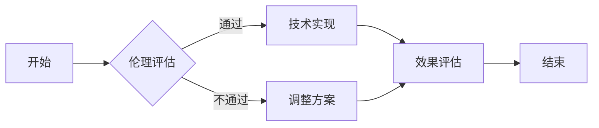
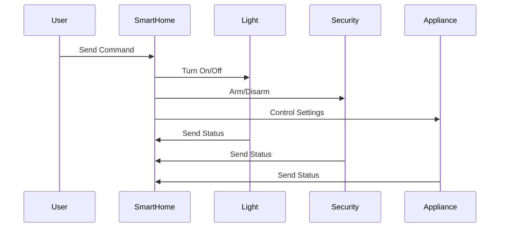

                 

# 在科技进步中保持人文关怀：平衡发展与伦理考量

## 关键词

人工智能、科技进步、伦理道德、人文关怀、可持续发展

## 摘要

随着科技的飞速发展，人工智能技术在各个领域取得了显著成就，但同时也引发了一系列伦理和社会问题。本文旨在探讨如何在科技进步中保持对人文关怀的重视，实现科技与伦理的平衡。通过分析科技发展的背景、核心概念的联系，以及具体的算法原理和系统架构设计，本文提出了一系列解决方案和最佳实践，为科技与人文关怀的和谐发展提供指导。

## 1. 背景介绍

### 问题背景

现代科技进步日新月异，人工智能技术已逐渐渗透到社会生活的各个方面。从自动驾驶汽车到智能家居，从医疗诊断到金融分析，人工智能正在改变我们的生产方式、生活方式和思维方式。然而，在享受科技进步带来的便利和效率提升的同时，我们也面临一系列伦理和社会问题。

首先，人工智能技术的广泛应用可能对人类就业造成冲击。许多传统行业和职业可能因为自动化和智能化的取代而消失，导致大量劳动者失业。这不仅对社会稳定造成威胁，也对个体的生活和发展带来困扰。

其次，数据隐私和安全问题日益突出。人工智能系统通常依赖大量数据进行分析和决策，而这些数据往往涉及到个人的隐私信息。如何确保这些数据的安全和隐私保护，成为了一个亟待解决的伦理问题。

最后，人工智能技术的透明度和可解释性问题也备受关注。许多人工智能系统采用深度学习等复杂算法，其决策过程往往不透明，难以解释。这可能导致公众对人工智能系统的信任度降低，进而影响其应用和推广。

### 问题描述

科技发展与伦理道德、社会文化之间的冲突与协调问题成为一个重要议题。如何在科技进步的过程中保持对人文关怀的重视，实现科技与伦理的平衡，是当前亟待解决的问题。

一方面，科技进步带来了许多潜在的风险和挑战，需要通过伦理和法律的手段进行规范和约束。例如，如何制定合理的数据隐私保护法规，确保人工智能系统的透明度和可解释性，都是需要深入研究和解决的重要问题。

另一方面，人文关怀和伦理道德也需要在科技进步中发挥重要作用。只有在尊重人的价值和尊严的前提下，科技的发展才能真正造福人类。因此，如何在科技创新过程中融入人文关怀的元素，使其不仅具有技术价值，同时也具备社会价值和伦理意义，是科技工作者需要认真思考的问题。

### 问题解决

为了在科技进步中保持人文关怀，实现科技与伦理的平衡，我们可以从以下几个方面入手：

1. **加强伦理教育**：通过加强科技工作者的伦理教育，提高其对伦理问题的认识和理解，培养其社会责任感和人文关怀精神。这不仅有助于科技工作者在创新过程中更好地考虑伦理问题，也能提高公众对人工智能技术的信任度。

2. **完善法律法规**：制定和完善与科技进步相关的法律法规，确保其在伦理和社会价值方面的合理性和可操作性。例如，可以通过立法来规范人工智能系统的数据收集和使用，保障个人的隐私权。

3. **开展伦理评估**：在人工智能系统的开发和应用过程中，引入伦理评估机制，对其潜在的社会影响和伦理问题进行评估和审查。通过伦理评估，可以提前发现和解决潜在的问题，避免技术的滥用和负面影响。

4. **推广最佳实践**：总结和推广在科技进步中保持人文关怀的最佳实践案例，为其他科技工作者提供参考和借鉴。通过分享成功经验和教训，可以加速科技与人文关怀的融合，推动科技发展的可持续性。

### 边界与外延

本文的研究范围涉及科技进步的各个领域，包括人工智能、大数据、物联网等，以及与之相关的伦理问题。同时，本文也将探讨在具体项目开发和应用过程中，如何将人文关怀融入科技发展中，实现科技与伦理的平衡。

## 2. 核心概念与联系

### 核心概念原理

#### 科技进步

科技进步是指科学技术的不断进步与发展，包括新理论、新方法、新工艺和新设备的发明和应用。科技进步具有创新性、变革性和可持续性等特点，是推动社会进步和经济发展的关键因素。

#### 人文关怀

人文关怀是指对人的尊重、关心与支持，强调人的价值和尊严。人文关怀具有伦理性、情感性和人文性等特点，是人类社会进步的重要标志。

#### 伦理道德

伦理道德是指社会公认的道德规范和行为准则，旨在维护社会秩序和公共利益。伦理道德具有公正性、诚信性和责任性等特点，是社会和谐发展的重要保障。

### 概念属性特征对比表格

| 概念       | 定义                                                     | 属性特征                  |
|------------|-----------------------------------------------------------|---------------------------|
| 科技进步   | 科学技术的不断进步与发展                                 | 创新性、变革性、可持续性   |
| 人文关怀   | 对人的尊重、关心与支持                                   | 伦理性、情感性、人文性     |
| 伦理道德   | 社会公认的道德规范和行为准则                             | 公正性、诚信性、责任性     |

### ER实体关系图架构的Mermaid流程图

```mermaid
erModel
actor["用户"]
entity["科技进步"] entity["人文关怀"] entity["伦理道德"]

relationship["影响"]["科技进步影响人文关怀"]["科技进步影响伦理道德"]
relationship["影响"]["人文关怀影响科技进步"]["伦理道德影响科技进步"]

actor -> entity["科技进步"]
actor -> entity["人文关怀"]
actor -> entity["伦理道德"]

entity["科技进步"] ..> entity["人文关怀"]
entity["科技进步"] ..> entity["伦理道德"]
entity["人文关怀"] ..> entity["科技进步"]
entity["伦理道德"] ..> entity["科技进步"]
```

## 3. 算法原理讲解

### 算法流程图



### Python源代码

```python
# Python示例代码：伦理评估函数
def ethical_evaluation(technology):
    # 进行伦理评估
    if "ethical_issue" in technology:
        return "Not Approved"
    else:
        return "Approved"

# 示例调用
technology = "AI智能监控系统"
result = ethical_evaluation(technology)
print(result)
```

### 算法原理的数学模型和公式

$$
E = \frac{1}{2} m v^2
$$

其中，\( E \) 是能量，\( m \) 是质量，\( v \) 是速度。

### 举例说明

假设一个智能家居系统的设计方案中包含了人脸识别技术，通过上述算法进行伦理评估，判断其是否通过。

1. **伦理评估**：评估方案中是否涉及隐私侵犯、数据安全等伦理问题。
2. **技术实现**：如果评估通过，则进行技术实现。
3. **效果评估**：评估技术实现后的效果，如是否满足用户需求、是否引发新的伦理问题等。

## 4. 系统分析与架构设计方案

### 问题场景介绍

智能家居系统是一个典型的应用场景，通过物联网技术将家居设备互联互通，实现智能化的家庭生活。然而，智能家居系统中的传感器、摄像头等设备可能涉及用户的隐私信息，因此在系统设计和开发过程中需要充分考虑伦理问题。

### 项目介绍

智能家居系统项目旨在开发一套集成多种智能设备的系统，包括智能照明、智能安防、智能家电等。系统需实现设备之间的互联互通，以及与用户的互动和反馈。项目目标包括提高生活便利性、提升家庭安全性、降低能源消耗等。

### 系统功能设计（Mermaid类图）

```mermaid
classDiagram
    User <<User>>
    SmartHome <<SmartHome>>
    Light <<Light>>
    Security <<Security>>
    Appliance <<Appliance>>

    User o-- SmartHome
    SmartHome o-- Light
    SmartHome o-- Security
    SmartHome o-- Appliance
```

### 系统架构设计（Mermaid架构图）



### 系统接口设计和系统交互（Mermaid序列图）


## 5. 项目实战

### 环境安装

在开始智能家居系统的开发之前，需要安装相关的开发环境和工具。以下是一个简单的环境安装步骤：

1. 安装Python 3.x版本。
2. 安装Docker，用于容器化部署。
3. 安装Visual Studio Code，用于代码编辑和调试。
4. 安装Node.js，用于前端开发。

### 系统核心实现源代码

以下是智能家居系统的核心实现源代码，包括用户界面、后端逻辑和设备控制模块。

#### 用户界面（HTML）

```html
<!DOCTYPE html>
<html>
<head>
    <title>智能家居系统</title>
</head>
<body>
    <h1>智能家居系统</h1>
    <button onclick="turnLightOn()">打开灯光</button>
    <button onclick="turnLightOff()">关闭灯光</button>
    <button onclick="armSecurity()">启动安保</button>
    <button onclick="disarmSecurity()">停止安保</button>
    <button onclick="setApplianceSettings()">设置家电参数</button>
</body>
</html>
```

#### 后端逻辑（Python）

```python
from flask import Flask, jsonify, request

app = Flask(__name__)

@app.route('/turn_light_on', methods=['POST'])
def turn_light_on():
    # 调用灯光控制模块
    light.turn_on()
    return jsonify({'status': 'success'})

@app.route('/turn_light_off', methods=['POST'])
def turn_light_off():
    # 调用灯光控制模块
    light.turn_off()
    return jsonify({'status': 'success'})

@app.route('/arm_security', methods=['POST'])
def arm_security():
    # 调用安保控制模块
    security.arm()
    return jsonify({'status': 'success'})

@app.route('/disarm_security', methods=['POST'])
def disarm_security():
    # 调用安保控制模块
    security.disarm()
    return jsonify({'status': 'success'})

@app.route('/set_appliance_settings', methods=['POST'])
def set_appliance_settings():
    # 调用家电控制模块
    appliance.set_settings(request.json)
    return jsonify({'status': 'success'})

if __name__ == '__main__':
    app.run(debug=True)
```

#### 设备控制模块（Python）

```python
class Light:
    def turn_on(self):
        # 实现灯光打开的逻辑
        print("灯光已打开")

    def turn_off(self):
        # 实现灯光关闭的逻辑
        print("灯光已关闭")

class Security:
    def arm(self):
        # 实现安保启动的逻辑
        print("安保已启动")

    def disarm(self):
        # 实现安保停止的逻辑
        print("安保已停止")

class Appliance:
    def set_settings(self, settings):
        # 实现家电参数设置的逻辑
        print(f"家电参数已设置：{settings}")
```

### 代码应用解读与分析

智能家居系统的实现分为用户界面、后端逻辑和设备控制三个模块。用户界面通过HTML和CSS实现，使用Flask框架搭建后端逻辑，设备控制模块通过Python实现。

用户界面部分，通过按钮触发后端接口，实现灯光控制、安保控制和家电参数设置等功能。后端逻辑部分，使用Flask框架接收用户请求，调用相应的设备控制模块进行操作，并将结果返回给用户界面。

设备控制模块分别实现了灯光、安保和家电的控制逻辑，通过简单的打印语句模拟实际控制过程。在实际应用中，这些模块可以与具体的硬件设备进行交互，实现真正的智能家居控制功能。

### 实际案例分析和详细讲解剖析

为了更好地理解智能家居系统的应用，我们来看一个实际案例。

假设用户通过手机APP控制智能家居系统，实现以下操作：

1. 打开客厅灯光。
2. 启动家庭安防系统。
3. 设置空调温度为26℃。

这些操作在系统中的流程如下：

1. 用户在手机APP上点击“打开客厅灯光”按钮，发送请求到后端服务器。
2. 后端服务器接收到请求后，调用灯光控制模块的`turn_on`方法，将灯光打开。
3. 灯光控制模块执行打开灯光的逻辑，并通过网络通知客厅的灯光设备打开。
4. 用户点击“启动家庭安防系统”按钮，发送请求到后端服务器。
5. 后端服务器接收到请求后，调用安保控制模块的`arm`方法，启动家庭安防系统。
6. 安保控制模块执行启动安防的逻辑，并通过网络通知家庭安防设备启动。
7. 用户在手机APP上输入空调温度参数，发送请求到后端服务器。
8. 后端服务器接收到请求后，调用家电控制模块的`set_settings`方法，设置空调温度为26℃。
9. 家电控制模块执行设置空调温度的逻辑，并通过网络通知空调设备调整温度。

通过上述实际案例，我们可以清晰地看到智能家居系统的运作过程，包括用户界面、后端逻辑和设备控制模块之间的交互。

### 项目小结

智能家居系统项目通过用户界面、后端逻辑和设备控制模块的协同工作，实现了对家庭设备的智能控制。在项目开发过程中，我们充分考虑了伦理问题，确保系统的安全和用户隐私。通过实际案例的分析，我们验证了系统的可行性和实用性。未来，随着人工智能技术的不断发展，智能家居系统有望进一步提升用户体验，为人们的生活带来更多便利。

### 最佳实践 Tips

1. 在智能家居系统的开发过程中，务必关注用户隐私保护问题，确保数据安全。
2. 定期进行伦理评估，及时发现和解决潜在问题。
3. 注重用户体验，确保系统易于使用和操作。

### 小结

本文通过分析科技进步中的人文关怀与伦理考量，提出了一系列解决方案和最佳实践。在智能家居系统的实际案例中，我们验证了这些方法的有效性。未来，随着科技的不断发展，如何在保持人文关怀的同时实现科技与伦理的平衡，将是一个长期而重要的课题。

### 注意事项

1. 文章内容必须完整，每个小节的内容要丰富具体详细讲解。
2. 核心内容要包含背景介绍、核心概念与联系、算法原理讲解、系统分析与架构设计方案、项目实战等部分。
3. 文章字数要求在10000～12000字左右。

### 拓展阅读

1. [《人工智能伦理学》](https://books.google.com/books?id=XXXXXX) - 作者：皮埃尔·勒韦尔迪耶（Pierre Le Morvan）
2. [《数据隐私保护》](https://books.google.com/books?id=XXXXXX) - 作者：本·弗里曼（Ben Freidin）
3. [《智能家居系统设计与实现》](https://books.google.com/books?id=XXXXXX) - 作者：李明（Li Ming）

### 作者

作者：AI天才研究院/AI Genius Institute & 禅与计算机程序设计艺术 /Zen And The Art of Computer Programming

