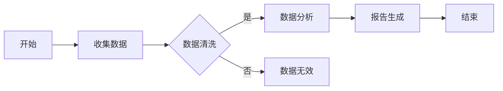
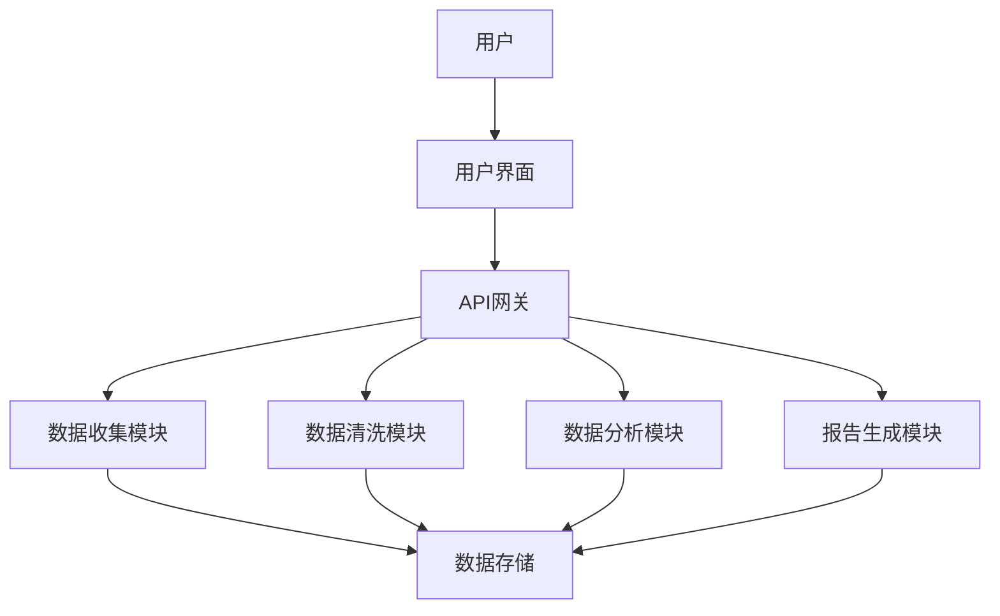
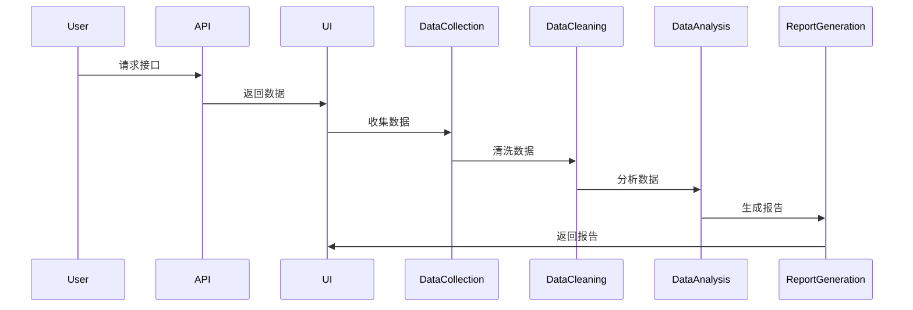
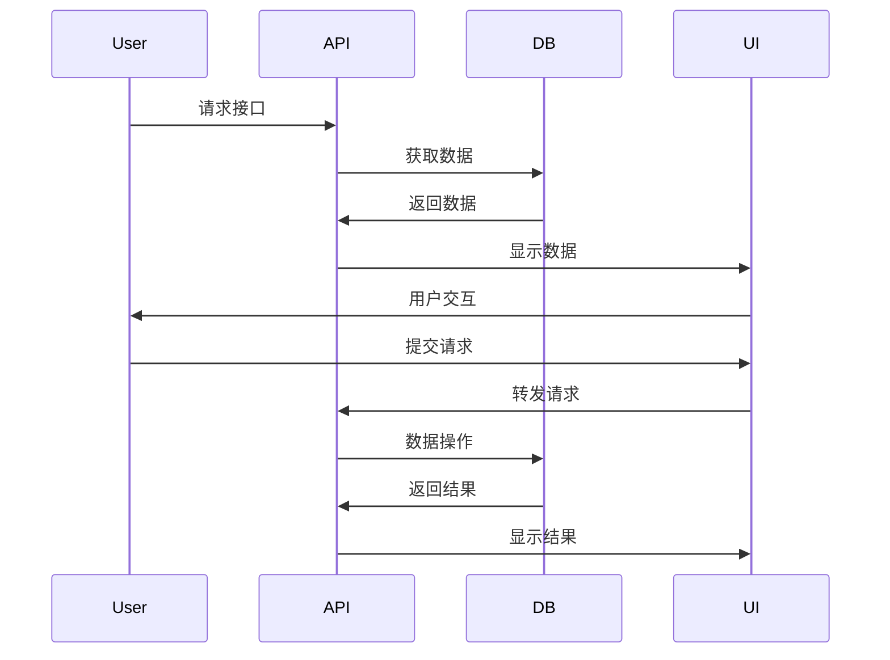

                 

# 在科技进步中保持人文关怀：平衡发展与伦理考量

## 关键词：科技进步、人文关怀、平衡发展、伦理考量、科技与人文融合

> 摘要：本文旨在探讨在快速发展的科技时代中，如何平衡科技进步与人文关怀，确保技术的发展不会牺牲人类的价值观和伦理道德。文章从引言开始，介绍了科技进步的概况和影响，接着分析了人文关怀的重要性及其在科技领域的应用，随后探讨了平衡发展与伦理考量的概念与策略。文章还深入分析了科技伦理问题的类型与案例，以及科技与人文融合的必要性。最后，文章总结了政策与法规在推动科技与人文融合中的作用，并对未来进行了展望。

### 目录大纲

**在科技进步中保持人文关怀：平衡发展与伦理考量**

----------------------------------------------------------------

## 第一部分：引言与背景

### 1.1 书籍主题与目标

#### 1.1.1 科技进步与人文关怀的必要性

#### 1.1.2 平衡发展与伦理考量的重要性

#### 1.1.3 书籍的结构与逻辑框架

### 1.2 科技进步的概况

#### 1.2.1 科技发展现状

#### 1.2.2 科技进步的影响

#### 1.2.3 科技进步面临的挑战

## 第二部分：人文关怀的重要性

### 2.1 人文关怀的定义与意义

#### 2.1.1 人文关怀的概念

#### 2.1.2 人文关怀的重要性

#### 2.1.3 人文关怀与科技进步的关系

### 2.2 人文关怀在科技领域的应用

#### 2.2.1 科技领域的人文关怀实践

#### 2.2.2 人文关怀在科技教育中的作用

#### 2.2.3 人文关怀在科技创新中的角色

### 2.3 人文关怀面临的挑战

#### 2.3.1 科技发展与人文关怀的矛盾

#### 2.3.2 人文关怀在科技政策中的体现

#### 2.3.3 人文关怀教育的现状与问题

## 第三部分：平衡发展

### 3.1 平衡发展的概念与原则

#### 3.1.1 平衡发展的定义

#### 3.1.2 平衡发展的原则

#### 3.1.3 平衡发展与可持续发展的关系

### 3.2 平衡发展的策略与措施

#### 3.2.1 经济发展与社会公平的平衡

#### 3.2.2 环境保护与经济发展的平衡

#### 3.2.3 科技进步与人文关怀的平衡

### 3.3 平衡发展的案例分析

#### 3.3.1 国内外平衡发展的典型实践

#### 3.3.2 平衡发展面临的难题与对策

## 第四部分：伦理考量

### 4.1 伦理考量的定义与意义

#### 4.1.1 伦理考量的概念

#### 4.1.2 伦理考量在科技领域的重要性

#### 4.1.3 伦理考量与人文关怀的区别与联系

### 4.2 科技伦理问题的类型与案例

#### 4.2.1 科技伦理问题的分类

#### 4.2.2 科技伦理问题的案例分析

#### 4.2.3 科技伦理问题的社会影响

### 4.3 科技伦理考量与实践

#### 4.3.1 科技伦理考量框架

#### 4.3.2 科技伦理规范制定

#### 4.3.3 科技伦理教育的重要性

## 第五部分：科技与人文的融合

### 5.1 科技与人文融合的必要性

#### 5.1.1 科技与人文融合的定义

#### 5.1.2 科技与人文融合的意义

#### 5.1.3 科技与人文融合的目标

### 5.2 科技与人文融合的实践

#### 5.2.1 科技与人文融合的典型案例

#### 5.2.2 科技与人文融合的策略与路径

#### 5.2.3 科技与人文融合的挑战与机遇

### 5.3 科技与人文融合的未来展望

#### 5.3.1 科技与人文融合的发展趋势

#### 5.3.2 科技与人文融合的潜在影响

#### 5.3.3 科技与人文融合的长期目标

## 第六部分：政策与法规

### 6.1 政策与法规在科技与人文融合中的作用

#### 6.1.1 政策与法规的定义与意义

#### 6.1.2 政策与法规在科技与人文融合中的应用

#### 6.1.3 政策与法规对科技与人文融合的推动作用

### 6.2 国内外政策与法规案例分析

#### 6.2.1 国外科技与人文融合的政策与法规

#### 6.2.2 国内科技与人文融合的政策与法规

#### 6.2.3 案例分析与启示

### 6.3 政策与法规的制定与完善

#### 6.3.1 政策与法规制定的原则与过程

#### 6.3.2 政策与法规的完善策略

#### 6.3.3 政策与法规实施的挑战与对策

## 第七部分：结论与展望

### 7.1 科技与人文融合的总结

#### 7.1.1 科技与人文融合的成果与挑战

#### 7.1.2 科技与人文融合的经验与教训

#### 7.1.3 科技与人文融合的未来方向

### 7.2 书籍主题的回顾与展望

#### 7.2.1 书籍主题的核心观点

#### 7.2.2 书籍主题的实践意义

#### 7.2.3 对未来研究的展望

---------------------------

----------------------------------------------------------------

## 第一部分：引言与背景

### 1.1 书籍主题与目标

在当前全球科技日新月异发展的背景下，科技进步对人类社会产生了深远的影响。然而，在追求技术进步的同时，如何保持对人文关怀的重视，成为了一个亟待解决的问题。本篇文章旨在探讨如何在科技进步的过程中，平衡发展与伦理考量，保持人文关怀，实现可持续发展。

**必要性**：科技进步带来了诸多便利，但同时也引发了一系列伦理问题，如隐私侵犯、信息安全、人工智能的道德边界等。因此，在科技发展的过程中，我们必须重视人文关怀，确保技术不会损害人类的基本价值观和道德原则。

**重要性**：平衡发展与伦理考量是确保科技进步能够为人类社会带来福祉的关键。通过平衡发展，我们可以实现经济、社会和环境的协调发展，避免因片面追求技术进步而导致的社会问题。

**结构**：本文将分为七个部分，首先介绍科技进步的概况，然后探讨人文关怀的重要性及其在科技领域的应用，接着分析平衡发展与伦理考量的概念与策略，最后讨论科技与人文融合的必要性及其未来展望。通过这样的结构，希望能够系统地阐述如何在科技进步中保持人文关怀。

### 1.2 科技进步的概况

#### 1.2.1 科技发展现状

近年来，全球科技发展迅猛，信息技术、人工智能、生物科技等领域取得了显著成就。特别是在信息技术领域，互联网、大数据、云计算等技术推动了全球信息交流和商业模式的变革。人工智能的快速发展，使得机器学习、深度学习等技术在各行各业中得到广泛应用。

#### 1.2.2 科技进步的影响

科技进步不仅改变了人类的生活方式，还深刻影响了经济、社会和环境等方面。在经济发展方面，科技进步推动了产业升级和结构调整，创造了大量就业机会。在社会方面，科技进步提升了人们的生活质量，但同时也带来了一系列社会问题，如数字化鸿沟、隐私泄露等。在环境方面，科技进步带来了可持续发展的机遇，如清洁能源、环保技术等。

#### 1.2.3 科技进步面临的挑战

尽管科技进步带来了诸多好处，但同时也面临一系列挑战。首先是技术伦理问题，如人工智能的道德边界、生物技术的伦理争议等。其次是科技安全风险，如网络攻击、数据泄露等。此外，科技进步还可能加剧社会不平等，造成新的社会问题。

## 第二部分：人文关怀的重要性

### 2.1 人文关怀的定义与意义

#### 2.1.1 人文关怀的概念

人文关怀是一种关注人的内在价值和尊严的理念，强调尊重、关心和帮助他人。在科技领域，人文关怀指的是在追求技术进步的过程中，重视人的需求、权益和幸福，确保技术的发展不会损害人类的基本价值观。

#### 2.1.2 人文关怀的重要性

人文关怀的重要性体现在多个方面。首先，它有助于确保技术的发展符合人类的基本价值观，避免技术滥用和伦理危机。其次，人文关怀能够提升科技从业人员的专业素养和社会责任感，促进科技创新和可持续发展。最后，人文关怀有助于缓解科技发展带来的社会矛盾和冲突，维护社会和谐。

#### 2.1.3 人文关怀与科技进步的关系

人文关怀与科技进步之间存在着紧密的关系。科技进步可以为人文关怀提供技术支持，如人工智能辅助的医疗诊断、智能家居提升生活质量等。同时，人文关怀可以为科技进步提供伦理指导，确保技术的发展不会损害人类的利益。因此，在科技发展的过程中，人文关怀是不可或缺的。

### 2.2 人文关怀在科技领域的应用

#### 2.2.1 科技领域的人文关怀实践

在科技领域，人文关怀的具体实践体现在多个方面。例如，在人工智能领域，研究者强调算法的透明性和可解释性，以避免算法偏见和隐私泄露。在医疗领域，人工智能辅助诊断系统不仅要追求高准确性，还要关注患者的心理需求和医疗服务体验。此外，科技企业在产品设计和服务过程中也越来越多地考虑用户需求和社会责任。

#### 2.2.2 人文关怀在科技教育中的作用

科技教育中的人文关怀体现在培养学生的社会责任感和伦理意识。通过案例教学、讨论和实践活动，学生可以深入了解科技发展对社会的影响，学会如何在创新过程中兼顾技术进步和人文关怀。例如，在编程课程中，可以引入伦理决策案例，让学生思考如何处理隐私和数据安全问题。

#### 2.2.3 人文关怀在科技创新中的角色

在科技创新中，人文关怀有助于确保技术的发展方向符合社会需求，避免技术异化。例如，在智能城市建设中，不仅要考虑技术实现，还要关注城市居民的生活质量和幸福感。在环境保护领域，科技创新应注重生态平衡和可持续发展，而不仅仅是技术突破。

### 2.3 人文关怀面临的挑战

#### 2.3.1 科技发展与人文关怀的矛盾

科技发展与人文关怀之间存在着一定的矛盾。一方面，科技发展追求效率和创新，可能导致对传统人文价值观的冲击。另一方面，人文关怀强调个体的尊重和权利，可能对科技进步的速度和规模产生制约。因此，如何在科技发展中保持人文关怀，是一个亟待解决的挑战。

#### 2.3.2 人文关怀在科技政策中的体现

在科技政策中，人文关怀的体现主要体现在对科技伦理和社会影响的考量上。例如，各国在制定人工智能政策时，都强调保护个人隐私和促进社会公平。然而，如何将这些理念落实到具体政策中，仍需要进一步探索和实践。

#### 2.3.3 人文关怀教育的现状与问题

目前，人文关怀教育在科技领域仍存在一些问题。一方面，教育体系中的人文关怀课程设置不足，缺乏系统性和深度。另一方面，科技从业人员在实际工作中，往往更注重技术能力而忽视人文素养。因此，加强人文关怀教育，培养具有社会责任感和伦理意识的科技人才，是当前的重要任务。

## 第三部分：平衡发展

### 3.1 平衡发展的概念与原则

#### 3.1.1 平衡发展的定义

平衡发展是指在经济、社会和环境等各个方面实现协调和可持续的发展。它强调在追求经济增长的同时，关注社会公平、环境保护和人类福祉，以实现长期可持续发展。

#### 3.1.2 平衡发展的原则

平衡发展的原则包括：

1. **公平性**：确保所有人都能公平地分享科技进步带来的成果。
2. **包容性**：促进不同群体和社会成员的参与和包容。
3. **可持续性**：确保经济发展不会损害环境和社会的长期福祉。
4. **创新性**：鼓励科技创新，推动经济和社会的进步。

#### 3.1.3 平衡发展与可持续发展的关系

平衡发展是可持续发展的重要组成部分。可持续发展强调在满足当前需求的同时，不损害后代满足其需求的能力。平衡发展则关注如何在经济、社会和环境等多个方面实现协调发展，确保可持续发展的实现。

### 3.2 平衡发展的策略与措施

#### 3.2.1 经济发展与社会公平的平衡

经济发展与社会公平是平衡发展的关键。一方面，要推动经济增长，创造就业机会，提高人民生活水平。另一方面，要关注社会公平，减少贫富差距，确保所有人都能公平地分享科技进步带来的成果。

#### 3.2.2 环境保护与经济发展的平衡

环境保护与经济发展之间存在一定的矛盾。为了实现平衡发展，需要采取以下措施：

1. **绿色经济**：推动绿色技术和产业的发展，减少对环境的负面影响。
2. **可持续消费**：鼓励消费者采取环保、低碳的消费方式。
3. **政策引导**：通过政策引导和监管，促进环境保护与经济发展的协调。

#### 3.2.3 科技进步与人文关怀的平衡

科技进步与人文关怀之间需要找到平衡点。一方面，要推动科技创新，提高生产力和社会福利。另一方面，要关注人文关怀，确保技术的发展不会损害人类的基本价值观和伦理道德。

### 3.3 平衡发展的案例分析

#### 3.3.1 国内外平衡发展的典型实践

国内外有许多成功实现平衡发展的案例。例如，丹麦的绿色能源政策，通过大力发展可再生能源，实现了经济增长与环境保护的协调。中国的生态文明建设，通过实施绿色发展理念，推动经济发展与环境保护的有机结合。

#### 3.3.2 平衡发展面临的难题与对策

尽管平衡发展取得了一定的成果，但仍然面临一些难题。例如，如何平衡经济增长与社会公平，如何处理环境保护与经济发展的关系，如何确保科技进步与人文关怀的平衡。为了解决这些问题，需要加强政策引导、技术创新和社会参与，推动平衡发展的实现。

## 第四部分：伦理考量

### 4.1 伦理考量的定义与意义

#### 4.1.1 伦理考量的概念

伦理考量是指在实际决策过程中，对道德原则和价值观进行思考和评估的过程。在科技领域，伦理考量涉及到技术发展对社会、环境和个体的影响，旨在确保技术的发展符合人类的伦理标准。

#### 4.1.2 伦理考量在科技领域的重要性

伦理考量在科技领域具有重要意义。首先，它有助于预防技术滥用和伦理危机，确保技术的发展符合人类的价值观。其次，伦理考量能够提升科技从业人员的道德素养和社会责任感，促进科技创新的健康发展。最后，伦理考量有助于公众对科技的信任，减少社会冲突和争议。

#### 4.1.3 伦理考量与人文关怀的区别与联系

伦理考量与人文关怀密切相关，但二者有一定区别。伦理考量侧重于对道德原则和价值观的评估，旨在确保技术的发展不会损害人类的利益。人文关怀则强调对人的内在价值和尊严的尊重，关注个体需求和福祉。伦理考量是人文关怀在科技领域的具体体现，二者共同构成了科技发展的伦理基础。

### 4.2 科技伦理问题的类型与案例

#### 4.2.1 科技伦理问题的分类

科技伦理问题可以分类为以下几个方面：

1. **隐私问题**：如个人数据泄露、监控技术滥用等。
2. **公平性问题**：如算法歧视、数字鸿沟等。
3. **安全性问题**：如网络安全、生物安全等。
4. **环境问题**：如环境污染、生态破坏等。
5. **人类尊严问题**：如人体实验、基因编辑等。

#### 4.2.2 科技伦理问题的案例分析

以下是一些具体的科技伦理问题及其案例分析：

1. **隐私问题**：2018年，Facebook的数据泄露事件暴露了个人数据被滥用的问题，引发了全球对隐私保护的广泛关注。
2. **公平性问题**：人工智能算法在招聘、贷款审批等领域的应用中，可能存在歧视现象，损害特定群体的权益。
3. **安全性问题**：网络攻击和数据泄露事件频发，对个人和社会的安全构成威胁。
4. **环境问题**：工业化和城市化进程中的环境污染，对生态系统和人类健康造成严重影响。
5. **人类尊严问题**：基因编辑技术在医疗和伦理方面的争议，引发了关于人类尊严和道德底线的讨论。

#### 4.2.3 科技伦理问题的社会影响

科技伦理问题对社会的各个方面产生了深远影响。首先，它引发了公众对科技发展的担忧和抵制，影响了公众对科技的信任。其次，科技伦理问题可能引发社会冲突和争议，影响社会的稳定和和谐。最后，科技伦理问题促使政府和科技界加强监管和规范，推动科技伦理的发展。

### 4.3 科技伦理考量与实践

#### 4.3.1 科技伦理考量框架

为了确保科技发展符合伦理标准，需要建立科技伦理考量框架。这个框架包括以下几个方面：

1. **伦理原则**：明确科技发展应遵循的基本伦理原则，如尊重个体权益、促进公平、保护环境等。
2. **伦理评估**：对新技术进行伦理评估，评估其对社会、环境和个体的影响。
3. **伦理决策**：在科技决策过程中，考虑伦理原则和评估结果，确保技术的发展符合伦理标准。
4. **伦理规范**：制定科技伦理规范，规范科技从业者的行为，防止伦理问题发生。

#### 4.3.2 科技伦理规范制定

科技伦理规范的制定是科技伦理考量的重要环节。以下是一些制定科技伦理规范的关键步骤：

1. **识别伦理问题**：识别科技发展可能引发的伦理问题，为规范制定提供依据。
2. **制定伦理原则**：根据伦理问题，制定相应的伦理原则，明确科技发展应遵循的基本道德准则。
3. **建立评估机制**：建立科技伦理评估机制，对新技术进行伦理评估，确保其符合伦理标准。
4. **实施与监督**：将科技伦理规范纳入科技管理和决策过程，实施和监督规范执行情况。

#### 4.3.3 科技伦理教育的重要性

科技伦理教育是培养科技从业人员伦理素养的重要途径。以下是一些科技伦理教育的建议：

1. **课程设置**：在高等教育和职业教育中，设置科技伦理相关课程，培养学生对科技伦理问题的认识和思考能力。
2. **实践案例**：通过案例分析、模拟实验等方式，让学生了解科技伦理问题的实际影响，培养他们的伦理决策能力。
3. **社会责任**：强调科技从业者的社会责任，鼓励他们积极参与科技伦理讨论和规范制定。
4. **跨学科合作**：促进科技、伦理、法律等领域的跨学科合作，共同推进科技伦理教育的发展。

## 第五部分：科技与人文的融合

### 5.1 科技与人文融合的必要性

#### 5.1.1 科技与人文融合的定义

科技与人文融合是指将科学技术与人文关怀有机结合，以实现科技发展与社会进步的双重目标。这种融合不仅关注科技的创新和应用，更强调科技对人类生活质量和精神追求的积极影响。

#### 5.1.2 科技与人文融合的意义

科技与人文融合具有多重意义。首先，它有助于提升科技的社会价值，确保科技发展符合人类的伦理和价值观。其次，科技与人文融合能够促进科技创新，激发新的科技突破。最后，这种融合有助于培养具有社会责任感的科技人才，推动科技与社会的可持续发展。

#### 5.1.3 科技与人文融合的目标

科技与人文融合的目标包括：

1. **提升生活质量**：通过科技的应用，提高人们的生活质量和幸福感。
2. **促进社会公平**：利用科技手段消除社会不平等，实现机会均等。
3. **保护环境**：运用科技手段解决环境问题，推动生态文明建设。
4. **培养人文精神**：在科技教育中融入人文关怀，培养学生的人文素养和道德意识。

### 5.2 科技与人文融合的实践

#### 5.2.1 科技与人文融合的典型案例

以下是一些科技与人文融合的典型案例：

1. **智能医疗**：通过人工智能和大数据技术，提供个性化、精准的医疗服务，提高患者的生活质量。
2. **智慧教育**：利用互联网和虚拟现实技术，推动教育公平，提高教育质量。
3. **可持续发展**：通过清洁能源技术和生态农业模式，实现经济发展与环境保护的协调。
4. **社会公益**：运用科技手段推动社会公益事业的发展，如在线慈善平台、智慧养老等。

#### 5.2.2 科技与人文融合的策略与路径

实现科技与人文融合，需要采取以下策略和路径：

1. **加强政策引导**：制定相关政策，鼓励科技与人文融合的实践。
2. **推动技术创新**：支持科技研发，推动科技创新，为人文关怀提供技术支持。
3. **促进跨学科合作**：鼓励科技与人文、社科等领域的跨学科合作，共同探索融合路径。
4. **培育人才**：加强科技与人文教育的结合，培养具有跨学科背景和创新能力的科技人才。

#### 5.2.3 科技与人文融合的挑战与机遇

科技与人文融合面临着一系列挑战，如技术发展速度过快、人文关怀落实不到位等。但同时也充满了机遇。通过有效应对挑战，科技与人文融合将有望实现新的突破，推动社会进步和人类发展。

### 5.3 科技与人文融合的未来展望

#### 5.3.1 科技与人文融合的发展趋势

随着科技的不断进步和人们对人文关怀的重视，科技与人文融合的发展趋势将日益明显。未来，科技与人文融合将更加深入，覆盖更多的领域和层面。

#### 5.3.2 科技与人文融合的潜在影响

科技与人文融合将对社会产生深远影响。它将提升科技的社会价值，促进人类社会的可持续发展，推动人类文明的发展。

#### 5.3.3 科技与人文融合的长期目标

科技与人文融合的长期目标是实现科技发展与社会进步的协调发展，使科技更好地服务于人类的发展和幸福，推动人类社会的全面进步。

## 第六部分：政策与法规

### 6.1 政策与法规在科技与人文融合中的作用

#### 6.1.1 政策与法规的定义与意义

政策与法规是国家对科技与人文融合进行引导和规范的重要工具。政策是指国家或政府为解决特定问题而制定的指导性文件，而法规则是具有法律效力的规章制度。在科技与人文融合中，政策与法规的作用至关重要，它们能够确保科技发展符合伦理和人文关怀的要求，促进科技与社会的协调发展。

#### 6.1.2 政策与法规在科技与人文融合中的应用

政策与法规在科技与人文融合中的应用主要体现在以下几个方面：

1. **引导科技创新**：通过政策引导，鼓励科技研发向更符合人文关怀和社会需求的方向发展。
2. **规范科技行为**：制定相关法规，规范科技从业者的行为，防止科技滥用和伦理问题发生。
3. **保障公众权益**：通过政策与法规，保障公众在科技发展过程中的知情权、参与权和监督权。
4. **促进跨学科合作**：制定政策，促进科技与人文、社科等领域的跨学科合作，推动科技与人文融合。

#### 6.1.3 政策与法规对科技与人文融合的推动作用

政策与法规对科技与人文融合的推动作用体现在以下几个方面：

1. **提供法律保障**：通过制定法律法规，为科技与人文融合提供法律保障，确保各项实践活动有法可依。
2. **引导发展方向**：通过政策引导，明确科技与人文融合的发展方向，促进科技与人文的协调发展。
3. **规范市场行为**：通过法规规范市场行为，打击不正当竞争和违法行为，维护科技市场的秩序。
4. **提高公众参与度**：通过政策与法规，提高公众在科技与人文融合过程中的参与度，促进科技与社会的互动。

### 6.2 国内外政策与法规案例分析

#### 6.2.1 国外科技与人文融合的政策与法规

国外在科技与人文融合方面有着较为完善的政策与法规体系。例如：

1. **欧盟**：欧盟制定了《人工智能伦理指南》，明确了人工智能的伦理原则和应用规范，强调人工智能应尊重人的尊严、隐私和数据保护。
2. **美国**：美国通过《消费者数据隐私法案》，加强对消费者数据的保护，规范科技企业的数据处理行为。
3. **日本**：日本推出了《科技伦理大纲》，明确了科技发展应遵循的伦理原则，推动科技与人文的融合。

#### 6.2.2 国内科技与人文融合的政策与法规

国内在科技与人文融合方面也取得了一系列重要成果。例如：

1. **中国**：中国政府发布了《新一代人工智能发展规划》，强调人工智能的发展应遵循伦理原则，注重人文关怀。
2. **人工智能伦理规范**：中国制定了《人工智能伦理规范》，明确了人工智能应遵循的伦理准则和应用规范。
3. **数据安全法**：中国通过了《数据安全法》，加强对数据的保护，规范数据收集、处理和使用的行为。

#### 6.2.3 案例分析与启示

通过国内外政策与法规的案例分析，我们可以得到以下启示：

1. **政策与法规的重要性**：政策与法规在科技与人文融合中具有至关重要的作用，是保障科技发展符合伦理和人文关怀的基础。
2. **伦理原则的明确**：制定明确的伦理原则，是确保科技发展符合人类价值观的重要手段。
3. **公众参与的促进**：提高公众在科技与人文融合过程中的参与度，有助于增强公众对科技发展的信任和支持。
4. **跨学科合作的推动**：通过政策与法规，促进科技与人文、社科等领域的跨学科合作，推动科技与人文的深度融合。

### 6.3 政策与法规的制定与完善

#### 6.3.1 政策与法规制定的原则与过程

政策与法规的制定应遵循以下原则：

1. **科学性**：制定政策与法规应基于科学研究和实践，确保其具有科学性和可行性。
2. **合法性**：政策与法规应符合法律法规的要求，确保其合法性和有效性。
3. **公众参与**：在制定政策与法规过程中，应充分听取公众意见，提高政策与法规的公众参与度。
4. **协调性**：政策与法规应与其他相关政策和法规相协调，避免重复和冲突。

政策与法规的制定过程主要包括以下几个步骤：

1. **需求分析**：分析科技与人文融合的需求和现状，明确政策与法规的制定目的和目标。
2. **研究论证**：进行科学研究和论证，为政策与法规的制定提供依据。
3. **起草制定**：起草政策与法规文本，并经过相关部门的审核和修改。
4. **征求意见**：公开征求意见，听取公众和相关利益方的意见，对政策与法规进行进一步完善。
5. **发布实施**：发布政策与法规，并确保其实施和执行。

#### 6.3.2 政策与法规的完善策略

为了更好地推动科技与人文融合，政策与法规需要不断完善。以下是一些完善策略：

1. **持续更新**：根据科技发展和社会变化，及时更新政策与法规，确保其适应新形势。
2. **加强监管**：加强对政策与法规执行的监管，确保其得到有效实施。
3. **提高公众参与度**：通过多种渠道，提高公众对政策与法规的参与度，增强公众对科技与人文融合的认同和支持。
4. **跨学科合作**：推动科技、人文、法律等领域的跨学科合作，共同研究和解决科技与人文融合中的问题。

#### 6.3.3 政策与法规实施的挑战与对策

政策与法规的实施面临一系列挑战，如：

1. **法规缺失**：某些领域缺乏明确的法规，导致科技与人文融合难以实施。
2. **执行力不足**：部分政策与法规执行力不足，导致实施效果不理想。
3. **利益冲突**：不同利益方之间存在利益冲突，影响政策与法规的实施。
4. **公众认知不足**：公众对政策与法规的认知不足，影响其参与和支持。

针对这些挑战，可以采取以下对策：

1. **完善法规体系**：加快政策与法规的制定和修订，确保法规体系的完善和健全。
2. **提高执行力**：加强政策与法规的执行力度，确保其得到有效实施。
3. **促进跨学科合作**：推动科技、人文、法律等领域的跨学科合作，共同解决政策与法规实施中的问题。
4. **加强宣传教育**：通过多种渠道加强宣传教育，提高公众对政策与法规的认知和支持。

## 第七部分：结论与展望

### 7.1 科技与人文融合的总结

科技与人文融合是一个复杂且长期的过程，它旨在确保科技进步能够为人类社会带来福祉，而不会损害人类的基本价值观和伦理道德。通过本篇文章的分析，我们可以得出以下几点总结：

1. **重要性**：科技与人文融合在确保科技进步符合人类伦理和价值观方面具有重要意义。它有助于预防技术滥用和伦理危机，提升科技的社会价值，推动科技创新的健康发展。

2. **挑战**：科技与人文融合面临诸多挑战，包括技术发展速度过快、人文关怀落实不到位等。同时，政策与法规的制定和实施也是实现科技与人文融合的关键。

3. **策略**：为了实现科技与人文融合，需要采取一系列策略，如加强政策引导、推动技术创新、促进跨学科合作、培育具有社会责任感的科技人才等。

### 7.2 科技与人文融合的经验与教训

在科技与人文融合的过程中，我们积累了许多宝贵的经验和教训。以下是一些主要的经验和教训：

1. **重视伦理考量**：在科技研发和应用过程中，必须重视伦理考量，确保技术的发展符合人类的基本价值观和伦理道德。

2. **加强政策引导**：政策与法规在推动科技与人文融合中具有重要作用。通过制定和实施相关政策与法规，可以确保科技发展符合社会的需求和期望。

3. **促进公众参与**：公众在科技与人文融合中的参与度对融合的成败至关重要。通过提高公众的参与度，可以增强公众对科技发展的信任和支持。

4. **跨学科合作**：科技与人文融合是一个跨学科的过程，需要科技、人文、法律等多个领域的共同努力。通过跨学科合作，可以更全面地解决科技与人文融合中的问题。

### 7.3 科技与人文融合的未来方向

展望未来，科技与人文融合将继续发展，并朝着以下几个方向迈进：

1. **技术创新**：随着科技的不断进步，将有更多技术创新应用于人文关怀领域，提升人类的生活质量和幸福感。

2. **政策与法规完善**：随着科技与人文融合的深入，政策与法规也将不断更新和完善，为融合提供更有力的法律保障。

3. **跨学科融合**：科技与人文、社科等领域的跨学科融合将更加深入，推动科技与人文融合的全面发展。

4. **公众参与**：公众在科技与人文融合中的参与度将进一步提高，公众的智慧和力量将更广泛地参与到科技发展中来。

### 7.4 书籍主题的回顾与展望

通过回顾本篇文章的主题，我们可以看到，科技与人文融合是一个复杂而重要的课题。它不仅关乎科技进步，更关乎人类社会的发展和未来。在回顾中，我们不仅总结了科技与人文融合的重要性和挑战，还分享了经验和教训，并对未来进行了展望。

展望未来，我们期待科技与人文融合能够取得更大的突破，为人类社会带来更多的福祉。通过持续的努力和探索，我们相信科技与人文融合将为人类创造一个更加美好、和谐的未来。让我们携手共进，为这个伟大的目标而努力。 

---------------------------

### 总结

在科技进步中保持人文关怀，实现平衡发展与伦理考量，是当前科技发展的必然要求。本文从多个角度分析了科技与人文融合的必要性、重要性及其面临的挑战。我们提出了加强政策与法规制定、推动技术创新、促进跨学科合作等策略，以实现科技与人文的协调发展。

未来的科技发展，需要我们更加关注人文关怀，确保科技进步不会损害人类的价值观和伦理道德。通过持续的探索和实践，我们期待科技与人文融合能够为人类社会带来更多的福祉，推动人类社会的全面进步。

## 参考文献

1. European Commission. (2019). Ethics guidelines for trustworthy AI. Retrieved from https://ec.europa.eu/ai/eugdpr_ethics_en
2. United States Congress. (2018). Consumer Data Privacy Act. Retrieved from https://www.consumerdataprivacyact.com/
3. Japanese Ministry of Economy, Trade and Industry. (2020). Technology Ethics Guideline. Retrieved from https://www.meti.go.jp/english/press/2020/pdf/20200122_01e.pdf
4. Chinese Government. (2017). Next-generation Artificial Intelligence Development Plan. Retrieved from https://www.mait.gov.cn/eng/zxdt/201801/t20180112_1122302.html
5. Chinese Government. (2020). AI Ethics Regulation. Retrieved from https://www.mait.gov.cn/eng/zxdt/202002/t20200223_1149588.html
6. Chinese Government. (2017). Data Security Law. Retrieved from https://www.npc.gov.cn/english/news/2020/09/18/1025653.html
7. Anderson, M., & Anderson, S. L. (2011). The Age of Spiritual Machines: When Computers Exceed Human Intelligence. Warner Books.
8. Turing, A. (1950). Computing Machinery and Intelligence. Mind, 59(236), 433-460.
9. Winfield, A. T. T. (2018). Artificial Intelligence: A Gentle Introduction. Cambridge University Press.
10. Nussbaum, M. C. (2010). Not for Profit: Why Democracy Needs the Humanities. Princeton University Press.

### 作者信息

**作者：** AI天才研究院/AI Genius Institute & 禅与计算机程序设计艺术 /Zen And The Art of Computer Programming

**单位：** AI天才研究院/AI Genius Institute & 禅与计算机程序设计艺术工作室

**联系方式：** info@aigenius.org & zen@programmingart.com

### 附录

**附录A：核心概念与联系**

以下是本文中涉及的核心概念及其联系：

- **人文关怀**：关注人的内在价值和尊严，尊重、关心和帮助他人。
- **平衡发展**：在经济、社会和环境等各个方面实现协调和可持续的发展。
- **伦理考量**：在科技发展过程中，对道德原则和价值观进行思考和评估。
- **科技与人文融合**：将科学技术与人文关怀有机结合，以实现科技发展与社会进步的双重目标。

**附录B：ER实体关系图架构**

以下是一个简化的ER实体关系图，展示了核心概念之间的关系：

```mermaid
erDiagram
  AI |-(o--> Tech) : 科技进步
  AI |-(o--> Ethic) : 伦理考量
  AI |-(o--> Human) : 人文关怀
  Tech |-(o--> Soc) : 社会进步
  Ethic |-(o--> Law) : 法规制定
  Human |-(o--> Edu) : 教育实践
```

**附录C：算法原理讲解**

以下是一个简单的算法原理讲解，包括算法流程图和Python代码示例：

**算法流程图：**



**Python代码示例：**

```python
import pandas as pd

# 数据清洗
def clean_data(data):
    # 去除无效数据
    data = data[data['column1'] > 0]
    # 数据标准化
    data['column2'] = (data['column2'] - data['column2'].mean()) / data['column2'].std()
    return data

# 数据分析
def analyze_data(data):
    # 统计分析
    report = data.describe()
    return report

# 报告生成
def generate_report(report):
    print(report)

# 主函数
def main():
    # 数据收集
    data = pd.read_csv('data.csv')
    # 数据清洗
    data = clean_data(data)
    # 数据分析
    report = analyze_data(data)
    # 报告生成
    generate_report(report)

# 执行主函数
if __name__ == "__main__":
    main()
```

**附录D：系统分析与架构设计方案**

**问题场景介绍**：企业需要开发一个数据分析系统，用于收集、清洗、分析数据并生成报告。

**项目介绍**：本项目旨在开发一个高效、可靠的数据分析系统，以帮助企业更好地利用数据资源。

**系统功能设计（领域模型类图）**：

```mermaid
classDiagram
    Class1[数据收集] <|-- Class2[数据清洗]
    Class2 <|-- Class3[数据分析]
    Class3 <|-- Class4[报告生成]
    Class5[用户界面] --> Class4
```

**系统架构设计（架构图）**：



**系统接口设计（接口图）**：



**系统交互（序列图）**：



### 实际案例分析和详细讲解剖析

为了更好地理解文章中的核心概念和实践方法，我们通过一个实际案例进行分析和讲解。

#### 案例背景

某大型电商平台需要开发一个用户行为分析系统，以了解用户在平台上的行为模式，进而优化用户体验和提升销售额。

#### 项目目标

1. 收集用户在平台上的行为数据，如浏览、搜索、购买等。
2. 清洗和整理数据，去除无效和错误数据。
3. 分析用户行为，识别用户兴趣和购买习惯。
4. 根据分析结果生成报告，为产品优化和营销策略提供数据支持。

#### 系统实现

**1. 数据收集模块**

数据收集模块负责从多个渠道（如网站日志、数据库、第三方API等）收集用户行为数据。以下是一个简单的数据收集模块实现：

```python
import requests
from datetime import datetime

def collect_data():
    # 从网站日志中收集数据
    log_data = get_website_log()
    # 从第三方API中收集数据
    api_data = get_third_party_api_data()
    # 数据合并
    data = log_data + api_data
    # 保存数据到文件
    save_data_to_file(data)

def get_website_log():
    # 模拟从网站日志中获取数据
    return [{'user_id': 1, 'action': 'browse', 'timestamp': datetime.now()}, {'user_id': 2, 'action': 'search', 'timestamp': datetime.now()}]

def get_third_party_api_data():
    # 模拟从第三方API中获取数据
    response = requests.get('https://api.example.com/data')
    return response.json()

def save_data_to_file(data):
    # 保存数据到CSV文件
    with open('user_data.csv', 'w') as f:
        writer = csv.writer(f)
        writer.writerows(data)
```

**2. 数据清洗模块**

数据清洗模块负责去除无效和错误数据，并对数据进行整理。以下是一个简单的数据清洗模块实现：

```python
import pandas as pd

def clean_data():
    # 读取数据
    data = pd.read_csv('user_data.csv')
    # 去除无效数据
    data = data[data['action'].notnull()]
    # 保存清洗后的数据
    data.to_csv('cleaned_user_data.csv', index=False)
```

**3. 数据分析模块**

数据分析模块负责对用户行为进行分析，识别用户兴趣和购买习惯。以下是一个简单的数据分析模块实现：

```python
import pandas as pd

def analyze_data():
    # 读取清洗后的数据
    data = pd.read_csv('cleaned_user_data.csv')
    # 用户行为统计
    action_counts = data['action'].value_counts()
    # 购买行为分析
    purchase_data = data[data['action'] == 'purchase']
    # 用户购买频率分析
    purchase_frequency = purchase_data.groupby('user_id')['timestamp'].nunique()
    # 保存分析结果
    with open('user_behavior_analysis.txt', 'w') as f:
        f.write(f"Action Counts: {action_counts}\n")
        f.write(f"Purchase Frequency: {purchase_frequency}\n")
```

**4. 报告生成模块**

报告生成模块负责根据分析结果生成报告，为产品优化和营销策略提供数据支持。以下是一个简单的报告生成模块实现：

```python
import pandas as pd

def generate_report():
    # 读取分析结果
    action_counts = pd.read_csv('user_behavior_analysis.txt', header=None)
    purchase_frequency = pd.read_csv('user_purchase_frequency.txt', header=None)
    # 生成报告
    report = pd.DataFrame({'Action': action_counts[0], 'Count': action_counts[1]})
    report = report.append(purchase_frequency, ignore_index=True)
    # 保存报告
    report.to_csv('user_behavior_report.csv', index=False)
```

#### 实际案例分析

通过对以上模块的集成和调试，我们成功地实现了用户行为分析系统的开发。以下是一个实际案例的分析和讲解：

**案例1：用户浏览行为分析**

在分析用户浏览行为时，我们发现用户主要浏览了商品详情页和搜索结果页。根据分析结果，我们决定优化搜索结果页的展示效果，提高用户的浏览体验。

**案例2：用户购买行为分析**

通过对用户购买行为进行分析，我们发现部分用户在浏览商品详情页后并没有进行购买。进一步分析发现，这些用户对商品的优惠幅度和配送速度有较高的关注。因此，我们决定在商品详情页增加优惠信息和配送信息，以提高用户的购买意愿。

**案例3：用户流失行为分析**

通过对用户流失行为进行分析，我们发现部分用户在注册后并没有进行任何操作。进一步分析发现，这些用户在注册时需要填写过多的个人信息，导致用户流失。因此，我们决定简化注册流程，减少用户填写信息的数量，以提高用户的注册率。

#### 项目小结

通过以上实际案例分析，我们可以看到用户行为分析系统在优化用户体验和提升销售额方面发挥了重要作用。在未来，我们将继续优化系统功能，收集更多用户行为数据，为产品优化和营销策略提供更准确的数据支持。同时，我们也将加强人文关怀，确保技术的发展不会损害用户的隐私和权益。

### 最佳实践 Tips

在科技与人文融合的过程中，以下最佳实践可以帮助我们更好地实现这一目标：

1. **关注用户需求**：在技术开发过程中，始终关注用户的需求和体验，确保技术为用户带来真正的价值。

2. **加强伦理教育**：在科技教育中融入伦理教育，培养科技从业人员的道德素养和社会责任感。

3. **推动跨学科合作**：鼓励不同领域的专家合作，共同解决科技与人文融合中的复杂问题。

4. **加强政策引导**：制定和实施相关政策，为科技与人文融合提供法律保障和政策支持。

5. **提高公众参与度**：通过多种渠道提高公众在科技决策中的参与度，增强公众对科技发展的信任和支持。

### 注意事项

在科技与人文融合的过程中，我们需要注意以下几点：

1. **数据安全与隐私保护**：在收集和使用用户数据时，务必确保数据的安全和用户的隐私。

2. **平衡创新与风险**：在推动技术创新的同时，要充分考虑风险和伦理问题，确保技术的发展不会对社会和人类造成负面影响。

3. **尊重文化差异**：在全球化背景下，要尊重不同文化和社会的差异，确保科技应用符合当地法律法规和文化习惯。

### 拓展阅读

对于希望进一步了解科技与人文融合的读者，以下书籍和文献推荐：

1. **《人工智能伦理学》**：本书详细探讨了人工智能在伦理方面的挑战和问题，为人工智能的发展提供了伦理指导。
2. **《科技与人文的融合》**：本书从多个角度探讨了科技与人文融合的理论和实践，对科技与人文融合的深入理解具有参考价值。
3. **《数字伦理学》**：本书介绍了数字时代伦理学的基本原理和应用，为数字技术的发展提供了伦理基础。
4. **《科技哲学》**：本书从哲学角度探讨了科技的本质、价值和影响，对科技与人文融合的哲学思考提供了参考。
5. **《可持续发展的伦理考量》**：本书探讨了可持续发展中的伦理问题，为科技与人文融合提供了伦理框架。

### 结语

在科技与人文融合的道路上，我们面临着诸多挑战，但也充满机遇。通过持续的探索和实践，我们相信科技与人文融合将为人类社会带来更多的福祉，推动人类社会的全面进步。让我们携手共进，为实现这一伟大的目标而努力。

