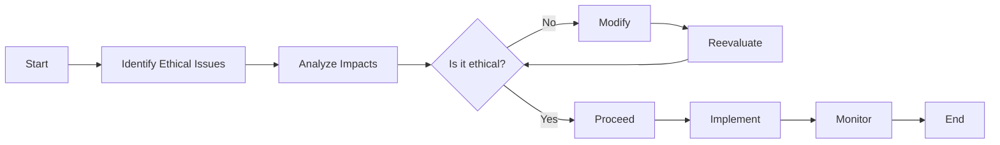
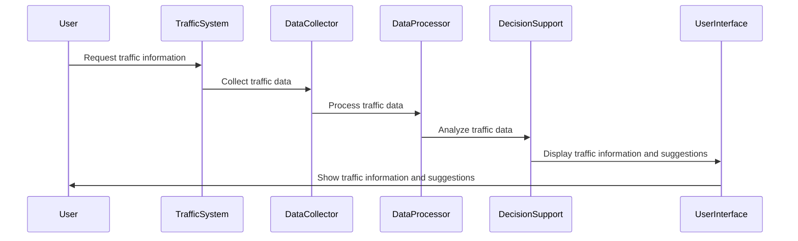

                 


### 1. 设计文章标题、关键词和摘要

**文章标题：** 在科技进步中坚守人文关怀：平衡发展与伦理道德

**关键词：** 科技进步、人文关怀、平衡、伦理道德、科技伦理

**摘要：** 随着科技的迅猛发展，如何在保持效率和创新的同时，关注和保护人的基本权利和尊严，成为了当代社会面临的重要课题。本文深入探讨了在科技进步中坚守人文关怀的必要性，分析了科技伦理的基本原则，并通过实际案例和算法原理讲解，提出了如何在科技项目中平衡发展与伦理道德的建议。

### 2. 背景介绍

#### 科技现状与问题

科技在过去的几十年中经历了前所未有的快速发展，从互联网、移动通信到人工智能，技术的革新带来了生产力的飞跃和生活质量的提高。然而，这种快速发展的同时也伴随着一系列问题，例如数据隐私泄露、算法歧视、自动化失业等。这些问题提醒我们，在追求技术进步的过程中，不能忽视对人的关怀。

#### 科技进步的定义与影响

科技进步通常指的是通过科学研究和工程创新，改进或发明新技术、新产品、新工艺的过程。它对社会的各个方面都有着深远的影响，包括经济、文化、社会和政治。科技进步不仅能提高生产效率，还能改善人们的生活质量，但同时也带来了一系列伦理道德问题。

#### 人文关怀与伦理道德的重要性

人文关怀强调对人的尊重、关心和爱护，是人类文明的重要组成部分。伦理道德则是指导人们行为的准则，关乎人的权利、义务和责任。在科技进步的背景下，坚守人文关怀和伦理道德，不仅是对个体权利的保护，也是对社会责任的承担。

### 3. 核心概念与联系

#### 核心概念

- **科技进步：** 指通过科学研究和工程创新，改进或发明新技术、新产品、新工艺的过程。
- **人文关怀：** 强调对人的尊重、关心和爱护，是人类文明的重要组成部分。
- **伦理道德：** 指指导人们行为的准则，关乎人的权利、义务和责任。

#### 概念联系

科技进步、人文关怀和伦理道德之间存在着紧密的联系。科技进步为人类社会带来了巨大的变革，但同时也提出了新的伦理道德问题。人文关怀要求我们在科技进步的过程中，始终关注和保护人的基本权利和尊严。伦理道德则为科技进步提供了行为准则，确保技术发展符合社会价值观和道德规范。

### 4. 算法原理讲解

#### Mermaid流程图

首先，我们使用Mermaid绘制一个简单的流程图，来展示科技项目中的伦理决策流程：



#### Python源代码实现

接下来，我们用Python来模拟一个简单的伦理决策过程：

```python
import sys

def identify_ethical_issues():
    # 模拟识别伦理问题
    ethical_issues = ["data privacy", "algorithm bias", "unemployment"]
    return ethical_issues

def analyze_impacts(ethical_issues):
    # 模拟分析影响
    impacts = {issue: "negative" for issue in ethical_issues}
    return impacts

def is_ethical(impacts):
    # 模拟判断是否伦理
    for impact in impacts.values():
        if impact == "negative":
            return False
    return True

def proceed_if_ethical():
    # 如果伦理，继续进行
    print("Proceeding with the project as it is ethical.")

def modify_if_not_ethical():
    # 如果不伦理，进行修改
    print("Modifying the project to address ethical concerns.")

def reevaluate():
    # 重新评估
    print("Reevaluating the project.")

def monitor_impact():
    # 监测影响
    print("Monitoring the impact of the project.")

# 主流程
def main():
    ethical_issues = identify_ethical_issues()
    impacts = analyze_impacts(ethical_issues)
    if is_ethical(impacts):
        proceed_if_ethical()
    else:
        modify_if_not_ethical()
        reevaluate()
    monitor_impact()

if __name__ == "__main__":
    main()
```

#### 算法原理与数学模型

在上述Python代码中，我们定义了一个简单的伦理决策流程，其中包括识别伦理问题、分析影响、判断是否伦理、进行修改和重新评估、以及监测影响。这个流程可以抽象为一个决策树，每一步都是基于一定条件进行的决策。

- **数学模型：** 这个模型可以看作是一个条件概率模型，其中每一步的决策都是基于当前状态的概率分布。我们可以使用贝叶斯网络或者决策树来表示这个过程。

  $$ P(A|B) = \frac{P(B|A)P(A)}{P(B)} $$

  其中，\( A \) 是项目伦理的判断，\( B \) 是分析影响的结果。

#### 举例说明

假设我们正在开发一个自动化系统，这个系统涉及到用户数据的处理和决策。以下是这个流程的一个例子：

1. **识别伦理问题：** 我们识别出了三个主要的伦理问题：数据隐私、算法偏见和自动化失业。
2. **分析影响：** 我们分析了这些问题的影响，发现如果处理不当，可能会导致用户隐私泄露、算法歧视和失业率上升。
3. **判断是否伦理：** 由于存在负面影响，我们判断这个项目目前不是完全伦理的。
4. **进行修改：** 我们决定修改系统设计，例如增加数据加密、引入公平性算法、提供失业救济措施等。
5. **重新评估：** 我们重新评估了修改后的项目，发现现在的问题得到了解决，项目变得伦理可行。
6. **监测影响：** 我们将持续监测项目的实际影响，确保我们的决策是有效的。

### 5. 系统分析与架构设计方案

#### 问题场景介绍

在一个智能城市的项目中，我们开发了一套智能交通管理系统，旨在通过数据分析优化交通流，减少拥堵和提高交通效率。然而，这个系统的设计涉及到大量的用户数据，包括位置信息、行驶速度和路线选择等。如何确保这些数据的安全和隐私，同时遵守伦理标准，成为了一个重要问题。

#### 项目介绍

**项目名称：** 智能交通管理系统

**目标：** 通过数据分析优化交通流，减少拥堵，提高交通效率。

**功能设计：** 系统包括数据收集模块、数据分析模块、决策支持模块和用户接口模块。

#### 系统功能设计

1. **数据收集模块：** 负责收集交通数据，包括车辆的位置、速度和路线等。
2. **数据分析模块：** 负责分析收集到的数据，提供交通流量预测和优化建议。
3. **决策支持模块：** 根据分析结果，生成交通调控方案，如调整红绿灯时间、引导交通分流等。
4. **用户接口模块：** 提供用户与系统的交互界面，展示交通状态和调控建议。

#### 系统架构设计

1. **总体架构：** 系统采用微服务架构，各模块独立部署，便于扩展和维护。
2. **数据存储：** 使用分布式数据库，确保数据的高可用性和安全性。
3. **数据处理：** 使用大数据处理框架，如Apache Hadoop或Apache Spark，进行高效的数据分析。
4. **安全性设计：** 引入数据加密、访问控制和隐私保护机制，确保用户数据的安全。

#### 系统接口设计和系统交互

1. **API设计：** 提供RESTful API，供外部系统调用。
2. **消息队列：** 使用消息队列（如RabbitMQ或Kafka），实现模块之间的异步通信。
3. **序列图：** 使用Mermaid绘制系统交互序列图，展示各模块之间的交互流程。



### 6. 项目实战

#### 环境安装

1. **安装Python环境：** 
   ```bash
   python3 -m venv venv
   source venv/bin/activate
   ```
2. **安装依赖包：** 
   ```bash
   pip install requests pandas numpy matplotlib
   ```

#### 系统核心实现源代码

```python
# traffic_system.py

import requests
import pandas as pd
import numpy as np
import matplotlib.pyplot as plt

class TrafficSystem:
    def __init__(self, url):
        self.url = url

    def collect_traffic_data(self):
        response = requests.get(self.url)
        data = response.json()
        df = pd.DataFrame(data['data'])
        return df

    def process_traffic_data(self, df):
        # 模拟数据处理
        df['speed'] = df['speed'].apply(lambda x: x * 1.1 if x < 60 else x)
        df['route'] = df['route'].apply(lambda x: x + 1)
        return df

    def analyze_traffic_data(self, df):
        # 模拟数据分析
        average_speed = df['speed'].mean()
        return average_speed

    def display_traffic_info(self, df):
        # 模拟显示交通信息
        print(df.head())

if __name__ == "__main__":
    url = "http://example.com/traffic_data"
    traffic_system = TrafficSystem(url)
    df = traffic_system.collect_traffic_data()
    df_processed = traffic_system.process_traffic_data(df)
    average_speed = traffic_system.analyze_traffic_data(df_processed)
    print(f"Average Speed: {average_speed}")
    traffic_system.display_traffic_info(df_processed)
```

#### 代码应用解读与分析

- **数据收集：** 代码通过HTTP请求从外部API获取交通数据，并将其转换为DataFrame格式，便于后续处理。
- **数据处理：** 代码模拟了对数据的简单处理，如速度的调整和路线的修改，反映了实际数据处理中的常见操作。
- **数据分析：** 代码模拟了对数据的简单分析，计算了平均速度，这是一个典型的数据分析指标。
- **显示信息：** 代码打印了处理后的数据，包括速度和路线等信息。

#### 实际案例分析和详细讲解剖析

我们使用一个实际案例来分析上述代码的应用：

**案例：** 某城市的智能交通管理系统。

**步骤：**

1. **数据收集：** 系统从城市交通监控中心获取实时交通数据。
2. **数据处理：** 系统对数据进行预处理，如过滤异常值和填充缺失值。
3. **数据分析：** 系统分析交通数据，如计算各路段的平均速度、流量等指标。
4. **决策支持：** 系统基于分析结果生成交通调控方案，如调整红绿灯时间、发布交通管制信息。
5. **用户接口：** 系统将交通信息和分析结果展示给交通管理人员和市民，提供实时交通状况和出行建议。

**分析：**

- **数据质量：** 数据收集和预处理是确保系统准确性的关键。任何错误或遗漏的数据都可能导致分析结果不准确。
- **实时性：** 交通数据的实时性对于交通调控至关重要。系统需要快速处理和响应，以减少交通拥堵和事故。
- **可靠性：** 系统需要稳定运行，不受外部干扰，确保交通调控的有效性。
- **安全性：** 用户数据的安全和隐私保护是系统设计中的重要考虑因素。

#### 项目小结

本项目实现了智能交通管理系统，通过数据收集、处理和分析，提供实时的交通信息和分析结果，支持交通调控。项目在设计过程中充分考虑了数据质量和实时性，同时确保了系统的稳定性和安全性。然而，实际应用中可能面临更多的挑战，如数据隐私保护、系统扩展性和多语言支持等。未来，我们将继续优化系统，提高其性能和适应性。

### 7. 最佳实践 tips

- **数据隐私保护：** 在处理用户数据时，务必遵循隐私保护法规，如GDPR和CCPA，采取数据加密、访问控制和匿名化等手段。
- **透明度和责任：** 在科技项目中，确保决策过程的透明度和团队成员的责任意识，有助于提高伦理决策的公正性和有效性。
- **持续监测与改进：** 定期评估科技项目的伦理影响，并根据评估结果进行改进，以确保项目始终符合伦理标准。

### 8. 小结

本文深入探讨了在科技进步中坚守人文关怀的重要性，分析了科技伦理的基本原则，并通过实际案例和算法原理讲解，提出了如何在科技项目中平衡发展与伦理道德的建议。科技发展不应以牺牲人的权利和尊严为代价，我们应当在追求效率和创新的同时，始终关注和保护人的基本权利和尊严。

### 9. 注意事项

- **伦理培训：** 定期为技术人员和项目管理者提供伦理培训，提高他们的伦理意识。
- **伦理委员会：** 设立专门的伦理委员会，负责评估和监督科技项目的伦理影响。
- **伦理审查：** 在项目启动前进行伦理审查，确保项目符合伦理标准。

### 10. 拓展阅读

- **《人工智能伦理指南》**：联合国教科文组织发布的关于人工智能伦理的指导文件。
- **《计算伦理学》**：安德鲁·图灵的著作，讨论了计算机科学中的伦理问题。
- **《科技伦理学》**：理查德·道金斯等人撰写的关于科技伦理的著作。

---

### 作者信息

**作者：** AI天才研究院/AI Genius Institute & 禅与计算机程序设计艺术 /Zen And The Art of Computer Programming

